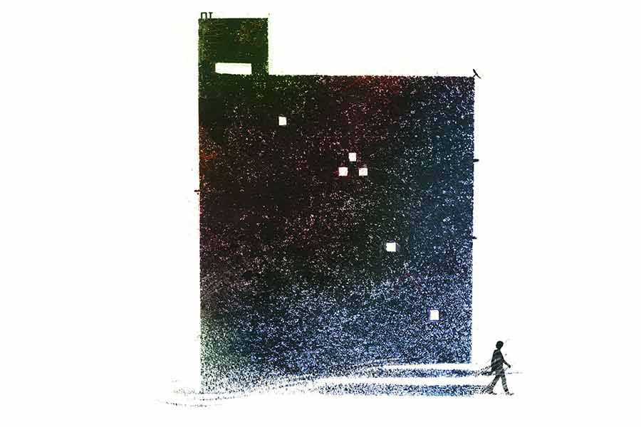

 
 <h1 align=center>অন্ধকারে</h1>
<h2 align=center>মহুয়া চৌধুরী</h2> 

লোকটাকে আজকাল প্রায়ই চোখে পড়ে নন্দার। বিশেষত মর্নিং স্কুল থেকে ফিরে কাচা জামাকাপড় বারান্দায় মেলার সময়ে। ব্যস্তসমস্ত ভঙ্গিতে এ দিক-ও দিক তাকাতে তাকাতে হেঁটে যায় সে। কী যেন খুঁজছে। উলোঝুলো চুল, সাদা দাড়ি-গোঁফে মুখ প্রায় ঢাকা। সিড়িঙ্গে লম্বা। রোদে পোড়া তামাটে গায়ের রং। ঢলঢলে প্যান্ট আর ছেঁড়া শার্ট গায়ে। বয়স হয়তো সত্তর ছুঁয়েছে। আপনমনে কী সব বিড়বিড় করে। বোঝাই যায়, মাথার গন্ডগোল।

নন্দা এক দিন শুনতে পেল, পাড়ার পুরনো ধোপা দীননাথ তাকে ডেকে নিচু গলায় বলছে, “এ অমু পাগলা, আবার তুই ভাবের মেয়েছেলেরে খুঁজতে এলি? ফের প্যাঁদানি খাবি। মনে আছে?”

লোকটা গ্রাহ্যও করল না। কিন্তু নন্দা স্পষ্ট দেখতে পেল, দীননাথ চোখ টিপে তাদের বাড়ির দিকেই ইশারা করে দেখাচ্ছে।

সে দিন প্রতীক ফিরলে, রাতে খেতে বসে নন্দা বলল, “এই, অমু পাগলা কে গো?”

সে অবাক, জিজ্ঞেস করে, “তুমি কোত্থেকে জানলে?”

নন্দা ঘটনাটা বলতেই প্রতীক রেগে আগুন হয়ে উঠল, “এখনও এতটা দূর অবধি হেঁটে হেঁটে চলে আসে হারামিটা? সে বার কষে ঠেঙিয়েছিলাম আমি, রতন, পবন মিলে... ভুলে গেছে নাকি!”

“সে কী? কেন?” অবাক হয় নন্দা।

“ব্যাটা শয়তানের ধাড়ি। তার পর থেকে আর আসত না— বুঝতে পেরেছি, এ বার আরও কড়া ডোজ়ের ওষুধ দরকার...”

“কোনও দিন নাম শুনিনি তো!”

বৌয়ের অবাক হওয়া সুন্দর মুখখানার দিকে চেয়ে, প্রতীকের উত্তেজনার পারা তত ক্ষণে নেমে গিয়েছিল। রহস্যময় ভঙ্গিতে বলল, “সবে তো দু’মাস বিয়ে হয়ে এলে। এর মধ্যেই সমস্ত শুনে ফেলবে নাকি?” তার পর মুচকি হেসে গলা নামাল, “ও আমার, হলেও-হতে-পারত মেসো। মাসিমণির নাম ধরে চিৎকার করতে করতে ঘুরে বেড়াত পাড়া জুড়ে, তাই পিটুনি দেওয়া হয়েছিল।”

আচমকা এমন ‘গসিপের’ ঝটকানিতে নন্দা মুখে পোরা রুটির টুকরো চিবোতে ভুলে গেল। রুদ্ধশ্বাসে বলে উঠল, “মাসিমণির নাম ধরে? মানে? যাঃ!”

প্রতীক হাসল, “যাঃ আবার কী! এক কালের ঘোরতর ইন্টুমিন্টু।”

মাসিমণি হলেন আভা। প্রতীকের মায়ের একমাত্র বোন। এই বিল্ডিংয়েরই একতলার ফ্ল্যাটে থাকেন। আসলে জমিটা প্রতীকের দাদামশাইয়ের। পরে পুরনো কাঠামো ভেঙে চারতলা ফ্ল্যাট বাড়ি বানানো হয়েছে। প্রতীকের মায়েরা দু’টি বোন। দু’জনে সমান ভাগের টাকা আর একটি করে ফ্ল্যাট পেয়েছিলেন। অন্য সব ফ্ল্যাটে বাইরের লোক।

দৈনিক খবরের কাগজের ম্যাট্রিমোনিয়ালে প্রথামাফিক সম্বন্ধ দেখেশুনে নন্দা আর প্রতীকের বিয়ে। ঝাড়া হাত-পা, সরকারি চাকুরে প্রতীক। বয়সে বছর দশেকের তফাত থাকলেও, নন্দার বাবা-মা পাত্রের খোঁজখবর নিয়ে খুশি। তবে বাড়ির নীচের তলায় বিধবা নিঃসন্তান মাসির থাকা নিয়ে গোড়ায় একটু মন খচখচানি ছিল সকলের। হয়তো উপর-পড়া হয়ে সব ব্যাপারে খবরদারি করতে আসবেন!

তবে এই ক’দিনেই নন্দা বুঝে গেছে, প্রতীককে ভালবাসলেও, আভা স্বভাবে নির্বিরোধী মানুষ। ভালমন্দ কিছু রাঁধল তো, উপরে দিয়ে গেল, এইটুকুই। কখনও তাদের ফিরতে বেশি রাত হলে শুকনো মুখে জেগে বসে থাকে। মায়া হয় দেখলে। নন্দাই বরং এখন তাদের বন্ধুবান্ধবের আড্ডায় দেরি হলে, মাসিমণিকে তাড়াতাড়ি ফোন লাগায়। দুশ্চিন্তা করতে বারণ করে দেয়। মাসিমণির বয়স ষাট পেরিয়েছে। ছেলেপুলে নেই। কম বয়সে বিধবা। হরেক রোগভোগে ফ্যাকাসে চেহারা। নিতান্তই নিরীহ, নির্জীব।

তা এমন মানুষ কখনও ঘোরতর ইন্টুমিন্টুতে জড়িয়ে পড়েছিল! সত্যি! এও হয়?

“মাসিমণিকে এখন এই রকম দেখছ। কম বয়সে ঢলঢলে সুন্দরীটি ছিল,” বলে প্রতীক।

নন্দা নিজের শ্বশুর-শাশুড়িকে দেখেনি। এ বাড়ি ভেঙে ফ্ল্যাট হওয়ার ক’বছরের মধ্যেই মারা গেছেন তাঁরা পর পর। প্রতীক বাবা-মায়ের বেশি বয়সের সন্তান। মায়ের ছেলেপুলে হওয়ার সময় পেরিয়ে যায় আর কী! শেষে দেওঘরের বাবা বৈদ্যনাথের দোর ধরে বুঝি জন্মাল সে। প্রতীকের বাবা রেলের চাকরি করতেন, শিমুলতলায়। তার খুব ছেলেবেলাতেই তাঁরা ওখানকার পাট চুকিয়ে চলে আসেন।

সেখানকার স্মৃতি বলতে কিছুই নেই প্রতীকের।

প্রতীকের মা আঠারো বছরের বড় ছিলেন বোনের চেয়ে। দিদিমা মারা যাওয়ার সময়ে, মাসিমণি সবে পাঁচ। বুড়ো বাবা আর ছেলেমানুষ বোনের ঝামেলা সামলাতে, প্রতীকের মাকে যখন তখন বাপের বাড়িতে ছুটে আসতে হত। মাসিমণির কাছে দিদিই ছিল প্রায় মায়ের মতো।

নিজের ভয়ঙ্কর নীতিবাগীশ মায়ের শিক্ষা-গুণে কোনও রকমের রংচঙে ঘটনা ঘটার সুযোগই হয়নি প্রতীকের জীবনে। বেচাল ঘটার বিন্দুমাত্র আশঙ্কা দেখলে, ছেলের ধাড়ি বয়স পর্যন্ত, রুটি-বেলন, ছড়ি, স্কেলের সদ্ব্যবহার করতে বিন্দুমাত্র দ্বিধা করতেন না। অতএব, রোম্যান্সের বীজ অঙ্কুরিত হওয়ার আগেই গুঁড়িয়ে চুরমার!

বরং মাসিমণি ঝাঁপিয়ে পড়ে আটকাতে গেছে কত বার। মা ঝটকা মেরে বোনকে সরিয়ে দিত, “আর একটা কথা বলবি যদি, মেরে তোরও মুখ ভেঙে দেব। লজ্জা করে না?”

মাসিমণি তখন ফোঁপাতে ফোঁপাতে বলত, “তা-ই কর। আমাকেই মেরে শেষ করে ফেল। সব জ্বালা জুড়োক।”

মা ও-সব ছেঁদো সেন্টিমেন্টে কান দেওয়ার পাত্রীই ছিল না। শাসনের পরে, হাঁপাতে হাঁপাতে ছেলেকে বলত, “আগে বড় হও, রোজগারপাতি করো। বৌ নিয়ে এসো। তার পর তাকে নিয়ে যা খুশি কোরো। তখন আমি কথাটিও কইতে আসব না।”

“আমার জীবন একখানা খোলা খাতা, বুঝলে? কেচ্ছা-কেলেঙ্কারির আঁচড়টুকুও পড়ার সুযোগ ছিল না। বরাবর মেয়েদের থেকে সাত হাত দূরে থেকেছি...” প্রতীক মজা করে বৌকে বলে। তা এত দিনে এক সুন্দরীকে আপন করে পেয়েছে সে। নিজের কচি বৌটির মধ্যেই দুনিয়া দেখে এখন।

রাত্রিকালীন রূপচর্চা চটপট সারা। হাতকাটা নাইটি গলিয়ে বিছানায় চলে এল নন্দা। প্রতীকের তত ক্ষণে মেজাজ ফুরফুরে! নাইটির ফাঁসে হাত দিতেই নন্দা ঠেলে সরাল, “আগে অমু পাগলার গল্প বলো...”

অগত্যা প্রতীক বলে চলে, “গল্প আর কী! বড়লোকের বখাটে ছেলে। তখন লেডি-কিলার টাইপের চেহারা। মেয়ে পটানোয় ওস্তাদ। ওদের বাড়ি ছিল সেই পল্টন ব্রিজ পেরিয়ে। কলেজ যাওয়ার পথে, মাসিমণিকে দেখেছিল নিশ্চয়ই। সুযোগ বুঝে ফলো করত। ওই চেহারা দেখে আর বুকনি শুনে মাসিমণি কুপোকাত। বলত নাকি, প্রাণ গেলেও অন্য কাউকে বিয়ে করবে না।”

“বাবা! এত রোম্যান্টিক?” খিলখিল করে কিশোরীর ভঙ্গিতে হেসে উঠল মহামায়া বালিকা বিদ্যালয়ের অঙ্ক-দিদিমণি নন্দা।

“আমার দাদুর তত দিনে বেশ বয়স হয়ে গেছে। রুগ্ণ। মেয়েকে সামলে রাখার ক্ষমতা নেই। মাসিমণি আচ্ছাসে প্রেম চালাত। মা শিমুলতলা থেকে এসে নাকি বকাবকি করত। বোঝাত যে, চার দিকে বড়ই বদনাম এ ছেলের। কিন্তু মাসিমণি তখন মরিয়া।”

“আরিব্বাস, নাটক যে জমে কুলফি! তার পর?” উত্তেজনায় উঠে বসল নন্দা।

“তার পরই ক্ল্যাইম্যাক্স। হঠাৎ এক দিন অমলেশ উধাও।”

“মানে?” নন্দার দু’চোখ ঠেলে বেরিয়ে আসছে।

“শোনা গেল, তার বাপ তাকে কবে যেন ব্যারিস্টারি পড়তে ইংল্যান্ডে পাঠিয়ে দিয়েছে চুপচাপ। সে খবর পাওয়ার পর, লজ্জায়-দুঃখেই বোধহয়, দাদামশাই হার্ট অ্যাটাকে মারা গেলেন। মাসিমণি তখন প্রায় উন্মাদ! নাওয়া-খাওয়া বন্ধ। সারা দিন একটানা কেঁদেই যেত। এক দিন গলায় দড়ি দিতে পর্যন্ত গিয়েছিল। মা অনেক কষ্টে সামলে রেখেছিল বোনকে। এ দিকে আবার জানা গেল, বিয়ের অত বছর মা তখন সদ্য প্রেগন্যান্ট। তা সে অবস্থায় মায়ের কে যত্ন করে তার ঠিক নেই, মা-ই উল্টে বোনকে নিয়ে জেরবার। বাবারও প্রচুর সাপোর্ট ছিল। মাসিমণিকে একলা এখানে রাখার প্রশ্নই নেই। ওরা তাকে নিয়ে চলে গিয়েছিল শিমুলতলায়।

“নতুন জায়গা। অন্য পরিবেশ। মাসিমণি আস্তে আস্তে স্বাভাবিক হচ্ছিল। তার পর তো...” নতুন বৌকে গুষ্টির ইতিহাস শোনাতে শোনাতে ক্লান্ত হয়ে গিয়েছিল প্রতীক। এমন তারা-ঝিমঝিমে নিশুত রাত কি মা-মাসির আখ্যান বলার সময়? মাঝপথে অধৈর্য হয়ে উঠল সে, “এই! ছাড়ো তো এ বার যত্ত পুরনো কাসুন্দি ঘাঁটা! এসো...”

“ওই বদমাইশ অমুটা পাগল হয়ে গেল কী করে?”

“আরে বাবা, সিফিলিস, সিফিলিস! তাতেই মাথার গন্ডগোল। ব্যারিস্টারি পড়তে গিয়ে পাল পাল বিদেশি মেয়ের সঙ্গে লীলাখেলার ফল... টাকাপয়সা খরচ করে ফিরিয়ে আনতে হয়েছিল শেষকালে।”

নন্দা অন্যমনস্ক। প্রতীক মাঝখানে এক বার বিরক্ত হয়ে বলে উঠল, “হলটা কী? ওই অমু পাগলা এখনও চক্কর কাটছে মগজে?”

খুব কাছ থেকে নন্দা আরও এক বার দেখতে পেল যে, প্রতীক একদৃষ্টে চেয়ে থাকলে, বোঝা যায়, ও খুব সামান্য ট্যারা, যাকে বলে লক্ষ্মীট্যারা। প্রতীককে বললে কিন্তু কিছুতেই মানবে না। হেসে ফেলল সে। প্রতীকের থুতনির মাঝখানের খাঁজে আঙুল ঠেকিয়ে নেড়ে দিল। কোথায় যেন পড়েছিল, থুতনিতে খাঁজ থাকা মানুষদের ব্যক্তিত্ব নাকি জোরালো হয়। তা অমন জাঁদরেল মায়ের চাপে প্রতীকের সে সব উবে গেছে বোধহয়।

পরদিন স্কুলে বেরনোর আগে, একতলার ফ্ল্যাটের দরজায় রোজকার মতো টোকা দিল নন্দা । বলে গেল, “আসছি গো মাসিমণি...” আসা-যাওয়ার পথে, এই সৌজন্যটুকু করেই থাকে সে।

ক্লাসে ঢুকে কিন্তু মেজাজ বিগড়োল। নন্দার ব্যক্তিগত অভিমত, প্রাথমিক স্তরের অঙ্ক সামান্য যুক্তিবোধ আর একটুখানি মনোযোগ ছাড়া কিছুই দাবি করে না। আর মেয়েগুলো হয়েছে ফাঁকিবাজের চূড়ান্ত। খাতার পর খাতার পাতায়, রাশি রাশি ভুল উত্তর লাল কালিতে ঘ্যাঁচ-ঘ্যাঁচ করে কেটেই চলল সে।

তারই মধ্যে টিফিন টাইমে মাসিমণির কথা ভেবে মনটা খারাপ লাগছিল। প্রতীক জন্মানোর পর, তাকে নাড়াচাড়া করতে করতেই বোধহয় ক্রমশ স্বাভাবিকতায় ফিরেছিলেন মাসিমণি। অনেক বুঝিয়ে বিয়ে দেওয়া হয়েছিল তার পর। কিন্তু ভাগ্যটাই খারাপ। ফুসফুসের ক্যানসারে দু’বছরের মধ্যে সে বর শেষ। বাপের বাড়িতে ফিরতে হল। তখনই নাকি প্রতীকের মা-বাবাও শিমুলতলার পাট বরাবরের মতো চুকিয়ে এখানে চলে এসেছিলেন। ওই অমু পাগলার পরিচ্ছেদটা ছাড়া আর সবই আগে বলেছে প্রতীক।

আজ স্কুল থেকে ফেরার সময়ে নন্দা দেখল, উল্টো দিক থেকে অমু পাগলা আসছে। একই রকম উদ্‌ভ্রান্ত ভাবভঙ্গি। তফাতের মধ্যে আজ গোঁফ-দাড়ি কামানো। বাড়ির লোকে কামিয়ে দিয়েছে বোধহয়। ওই শয়তানটাকেও দেখাশোনা করার লোক আছে তার মানে।

যেতে যেতে হঠাৎ নন্দার খুব কাছে সরে এল অমু পাগলা। ফিসফিসে গলায় বলল, “আভাদের বাড়িটা গেল কোথায় বলতে পারো? কিছুতেই খুঁজে পাচ্ছি না... কত করে খুঁজছি সেই থেকে!” স্থির চাউনিতে একটুখানি তাকিয়ে রইল নন্দার মুখের দিকে। তার পর উত্তরের অপেক্ষা না করে বড় রাস্তার দিকে এগিয়ে গেল।

আচমকা পাগলের মুখোমুখি হয়ে কেঁপে উঠেছিল নন্দা। বুক ধড়ফড় করছিল। শেষে সম্বিত ফিরতে তাড়াতাড়ি বাড়ির মধ্যে ঢুকে, উপরে চলে এল। মাসিমণির সঙ্গে দেখা করার কথা মনেই রইল না।রাতে বরের মুখের দিকে শূন্য চোখ তুলে তাকাল অঙ্ক-দিদিমণি নন্দা। স্খলিত গলায় জিজ্ঞেস করল, “আচ্ছা, তুমি শিমুলতলাতেই জন্মেছিলে,তাই তো?”

“হুঁ। সেই রকমই তো শুনেছি। কাছাকাছি চেনাজানা মানুষ নেই কোনও। অনেক পথ পেরিয়ে একটা জঘন্য লোকাল হাসপাতালে... সে সব আশির দশকের কথা।”

বিহ্বল চোখে তাকিয়ে খুব এলোমেলো গলায় নন্দা জিজ্ঞেস করে, “তুমি কাকে পিটুনি দিয়েছিলে? কাকে মেরেধরে এসেছিলে আসলে?”

প্রতীকের চোখে তার চোখ। ওর চিবুকের খাঁজটাতে আঙুল রাখে নন্দা। প্রতীক টের পায়, বৌয়ের আঙুল কাঁপছে। তার পর হাত বাড়িয়ে রাত-আলোটা নিভিয়ে দেয় নন্দা।

খোলা খাতায় অঙ্ক-দিদিমণির আঁক কষা সারা। উত্তর মেলানো বাকিই থাকুক বরং। অন্ধকার লেপে-মুছে দিক সব।

