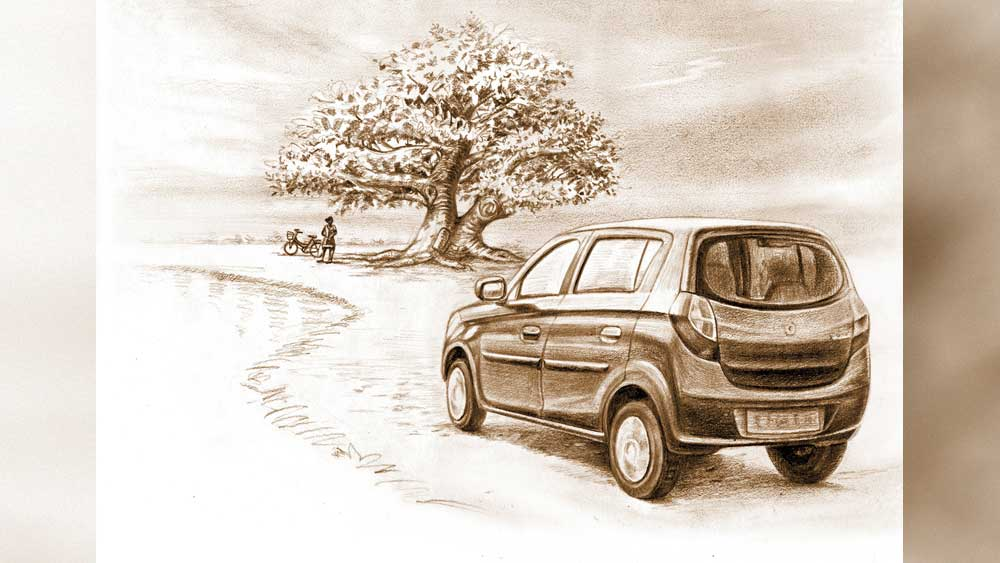

 

<h1 align=center>অন্য আলো</h1>
<h2 align=center>অর্ণব দে</h2>
এই মিতা, তোর কী হয়েছে বল তো? সন্ধেবেলা ঘর অন্ধকার করে এ ভাবে শুয়ে আছিস! শরীর খারাপ?”   মিতা এ বাড়ির সবচেয়ে ছোট সদস্যা। সবচেয়ে আদরের। এমনিতে খুবই মিশুকে, আর আনন্দে থাকতে পছন্দ করে। রাগ বা অভিমান তার ধাতে নেই। তা এমন মানুষ যদি গুম মেরে বসে থাকে তা হলে কারই ভাল লাগে! মিতার দাদারও একই অবস্থা। প্রশ্নের জবাব না পেয়ে সে বলল, “কী রে! কালা হয়ে গেলি না কি?”   “উফ! কী হয়েছে?” বিরক্ত স্বরে বলল মিতা।   “বাবা! ম্যাডামের মেজাজ তো গরম কড়া, ধরলেই ছ্যাঁকা খেতে হবে!” বলেই তার দাদা খিকখিক করে হাসতে লাগল। মিতার তা দেখে আরও মাথা গরম হয়ে গেল।   দাদা বলল, “যাকগে, আমি বাজারে যাচ্ছি, তোর জন্য ফুচকা নিয়ে আসব?”   “না থাক, আমার খেতে ইচ্ছে করছে না।”   “সে কী রে.. বিড়ালের মাছে অরুচি! এই, তোর পেট খারাপ হয়েছে তাই না? বলেছিলাম দুপুরে অতগুলো ধনেপাতার বড়া খাস না, তা কে কার কথা শোনে!”   “এই তুই যাবি এখান থেকে...”   “আরে রাগ করছিস কেন! আচ্ছা ঠিক আছে, আমি আসার পথে তোর জন্যে গ্যাসের বড়ি নিয়ে আসব।”   “দরকার নেই। যা না দাদা... আমাকে একটু একা থাকতে দে।”   “একা থাকবি!”   সে যেন কথাটা বিশ্বাসই করতে পারেনি। তার পর চেঁচিয়ে বলে উঠল, “ও মা দেখো, বোন কী রকম করছে, মনে হয় পেটখারাপ করেছে!”   দাদার চিৎকার শুনে মা ছুটে এল। বাবা বাড়ি ছিল না, না হলে একটা কাণ্ড বেঁধে যেত। দাদাটাও এমন সময় সরে পড়ল। ফলে মার প্রশ্নবাণ একা তাকেই সামলাতে হল। মা এসেই ঘরের আলো জ্বালিয়ে বলল, “কী রে কী হয়েছে, শরীর খারাপ? সন্ধে হয়ে গেছে ঘরের আলো জ্বালাসনি কেন?”   মিতা বলল, “না না, তেমন কিছু নয়, ওই একটু মাথা ধরেছিল, তাই শুয়ে ছিলাম।”   “তুই চোখ-মুখ ধুয়ে আয়, চা করে দিচ্ছি। দেখবি ঠিক হয়ে যাবে।”   বার বার চোখে-মুখে জলের ঝাপটা দিতে লাগল মিতা। তাকাল আয়নাটার দিকে। তার চোখে মুখে কি মনের কষ্টটা বোঝা যাচ্ছে? না, কিছুতেই অন্য কাউকে বুঝতে দেওয়া যাবে না তার মনে কী চলছে। প্রথম যখন নীলাদ্রি কথাটা বলেছিল, প্রায় এক সপ্তাহ আগে, তখন সে বিশ্বাসই করেনি। আর করবেই বা কেন! করোনা দিন দিন যে ভাবে দ্রুত ছড়াচ্ছে, এই সময় বাড়ি থেকে বেরোতেই ভয় হয় আর সেখানে নীলাদ্রিকে কাজে যোগ দিতে হবে! সে ভাবল নীলাদ্রি ঠাট্টা করছে।   নীলাদ্রি ফোনের অপর প্রান্ত থেকে ম্লান হেসে বলেছিল, “আমি সত্যি বলছি মিতা, আজকে আমাদের ডিপার্টমেন্ট আমাদের সবাইকে মেল করে জানিয়ে দিয়েছে, আগামী সপ্তাহের মধ্যে আমাদের সবাইকে জয়েন করতে হবে।”   তার কথা শুনে মনে হয়নি সে ঠাট্টা করছে।   “কিন্তু তুমি যাবে কী করে? ট্রেন তো বন্ধ!” উত্তেজিত গলায় জিজ্ঞেস করেছিল মিতা।   “আমরা দু’-তিন জন মিলে একটা প্রাইভেট গাড়ি ভাড়া করব।”   “কবে যাবে?”   “এই রবিবার।”   “যেতেই হবে?”   “হুঁ। আর কত দিন সরকার বসে বসে খাওয়াবে...”   “আমি তোমার সঙ্গে যাব?”   “হ্যাঁ, তোমার বাবা আগে তোমায় আমার হাতে দিন, তার পর না-হয় যেয়ো,” হেসে বলেছিল নীলাদ্রি।   নীলাদ্রির সঙ্গে মিতার সম্পর্কটা প্রায় তিন বছর হতে চলল। এই তিন বছরে তারা পরস্পরের বেশ কাছাকাছি চলে এসেছে। এক বছর হল নীলাদ্রি সাব-ইনস্পেক্টর হয়ে শিলিগুড়িতে পোস্টিং পেয়েছে। আর কয়েক বছরের মধ্যে সম্পর্কটা একটা পরিণতি পাবে। এত দিন মানুষটা কাছে আছে কিন্তু করোনার জন্য 
দেখা করা হয়নি, তবে প্রত্যেক দিন ফোনে কথা হয়।   যদিও ওখানে গেলেও তার সঙ্গে ফোনে কথা বলতে পারবে। মিতা ভাবছে এত দিন নীলাদ্রি বাড়ি ছিল, কোনও চিন্তা ছিল না। এখন প্রতি মুহূর্তে তার করোনায় আক্রান্ত হওয়ার ভয় তাকে নিশ্চিন্তে থাকতে দেবে না।   মিতার চুল বাঁধতে বাঁধতে কিছু একটা আন্দাজ করল তার মা। জিজ্ঞাসা করল, “এত কী চিন্তা করছিস মিতা?”   “কই কিছু না তো!” অপ্রস্তুত হয়ে উত্তর দিল মিতা।   “কিছু তো একটা চিন্তা করছিস তুই। না হলে অন্য দিন চুল বাঁধার সময় এত কথা বলিস আর আজ একদম চুপচাপ! সত্যি করে বল তো কী হয়েছে?”   এই রে! মা কিছু বুঝে ফেলল না কি! মাকে অন্য কিছু একটা বলতে হবে। সে বলল, “না মা, তেমন কিছু নয়... ভাবছিলাম আমার নাম নিয়ে।”   “কেন, নামে আবার কী হল?” অবাক হয়ে বলল তার মা।   “না, খারাপ কিছু নেই, কিন্তু যে শোনে সে-ই বলে কী রকম যেন আদ্যিকালের নাম— সুলোচনা!”   তার মা একটু হেসে বলল, “আমাদের সমস্যা কী জানিস, আমরা সব সময় বড্ড লোকের কথা ধরে চলি। যে দিন তুই এই সাধারণ চিন্তা-ভাবনা থেকে বেরিয়ে অন্য আলোয় নিজেকে দেখতে পাবি, সে দিন সত্যিটা তোর সামনে আসবে। তখন আর লোকের কথা অত গুরুত্বপূর্ণ মনে হবে না।”   “আমি না ঠিক বুঝতে পারলাম না! মানে…”   “আগে বল তো, তোর নামের মানে কী?”   “আমার নামের মানে তো সুন্দর চোখ তাই না!”   “হ্যাঁ, সেই জন্যই তোর দিদুন এই নাম দিয়েছিল তোকে। তবে এই নামের পিছনে একটা গল্প আছে।”   “গল্প! কী রকম?”   “পুরাণে সুলোচনার জন্মের একটা সুন্দর গল্প আছে। এক দিন মহাদেব স্নান করার পর দেবী পার্বতী তাঁকে সাজিয়ে দিতে লাগলেন। তিনি তাঁকে বাঘের ছাল, রুদ্রাক্ষমালা এবং গলায় সাপ পরিয়ে দিলেন। কিন্তু মহাদেবের হাতে সাপ বাঁধার সময় তিনি এত জোরে সাপটা বেঁধেছিলেন যে সাপের চোখ থেকে দু’ফোটা জল মাটিতে পড়ে। আর তা থেকে জন্ম নেয় দুই কন্যা, এক জন সুলোচনা আর অপর জন সুনয়না।”   মিতা এ বার না হেসে পারল না। সে বলল, “যত সব আজগুবি গল্প, এ রকম আবার হয় না কি!”   “বিশ্বাস করিস বা না করিস গল্পটা শোন, ভাল লাগবে। তা কী বলছিলাম যেন... হ্যাঁ মনে পড়েছে, তা সুনয়না আর সুলোচনার জন্মের পর তাদের অধিকার নিয়ে সমস্যা দেখা দিল। নাগদেবী বললেন, যে হেতু তাঁর চোখের জল থেকে কন্যা দু’টির জন্ম তাই কন্যা দু’টি নাগবংশের সন্তান। আবার দেবী পার্বতী বললেন, যে হেতু তাঁর শক্ত করে বাঁধার জন্যেই সাপের চোখ দিয়ে জল বেরিয়েছিল, তাই কন্যা দু’টি আসলে তাঁর সন্তান। এই সময় সমস্যার সমাধান করতে এগিয়ে এলেন স্বয়ং মহাদেব। তিনি বললেন, যে হেতু তাঁরা দু’জনেই এই দু’টি কন্যার জন্মের কারণ, তাঁরা দু’জনেই একটি করে কন্যাসন্তান পালনের অধিকার পাবেন। মহাদেবের কথা মতো দেবী পার্বতী সুনয়নাকে সন্তানরূপে গ্রহণ করে তাকে 
মানুষ করে বিয়ে দিলেন মিথিলার রাজা জনকের সঙ্গে। সুলোচনাকে নাগদেবী মানুষ করতে লাগলেন। তার পর কার সঙ্গে তাঁর বিয়ে হয়েছিল জানিস?”   মিতা দু’পাশে মাথা নাড়িয়ে জানাল সে জানে না।   মা বলল, “রাবণের পুত্র মেঘনাদের সঙ্গে।”   এত ক্ষণ মিতা খুব মন দিয়ে তার মার কথাগুলো শুনছিল। সে হঠাৎ বলে উঠল, “কিন্তু আমি তো জানি মেঘনাদের স্ত্রীর নাম প্রমীলা। মাইকেল মধুসূদনের ‘মেঘনাদবধকাব্য’-এ তো ওই নামই লেখা আছে।”   তার মা হেসে বলল, “ঠিকই। আসলে সুলোচনার আর এক নাম ছিল প্রমীলা, যেমন তোর আর এক নাম মিতা। তা যা-ই হোক, সুলোচনা যে খুব সাহসী নারী ছিলেন সেটা তুই মেঘনাদবধ কাব্য পড়েই বুঝতে পেরেছিস নিশ্চয়ই!”   মিতা বলল, “সে তো অবশ্যই, প্রমীলা সত্যিই এক জন 
বীরাঙ্গনা ছিলেন।”   “তা হলে বুঝলি তোর নামের গুরুত্ব কতখানি! যারা বলেছে এটা আদ্যিকালের নাম, তারা এর সম্পর্কে কিছুই জানে না। আর তুই তাদের কথা মেনে নিলি!”   মিতা আর কিছু বলল না। মার কথাগুলো তার মনের গভীরে 
ঢুকে পড়েছে।   মা উঠতে উঠতে বলল, “যাক, অনেক গল্প হল, এখন রাতের খাবারের ব্যবস্থা করতে হবে...”   মা চলে যাওয়ার পর মিতা এক গভীর চিন্তায় ডুবে গেল, সে ভাবতে লাগল প্রমীলার কথা। কী অসাধারণ নারী ছিলেন তিনি। স্বামী মেঘনাদ যুদ্ধে যাওয়ার আগে তিনি ভেঙে পড়েননি, বাধাও দেননি, বরং প্রকৃত বীরাঙ্গনার মতো তাঁর স্বামীকে সাহায্যের জন্য লঙ্কাপুরীতে প্রবেশ করেছেন মৃত্যুভয় তুচ্ছ করে। যাঁর বীরত্বে মুগ্ধ হয়েছিলেন স্বয়ং রামচন্দ্র, তাঁর নামে নিজের নামকরণ, ভেবে অভিভূত হয়ে গেল মিতা। সে হঠাৎ বলে উঠল, “আচ্ছা মা, তোমার কী মনে হয়, আমি কি প্রমীলার মতো সাহসী?”   তার মা একটু হেসে বলল, “সেটা সময়ই বলবে!”   এমন সময় মিতা তার ফোন একটা মেসেজটোন শুনতে পেল। নীলাদ্রি মেসেজ পাঠিয়েছে—   “ফোনটা তুলছ না কেন? এখনও মন খারাপ? তুমি অত বেশি ভেবো না। কাল সকাল সাতটায় বেরোব।”   মেসেজ পড়ে ফোনটা রেখে দেয় মিতা। রিপ্লাই দেওয়ার তাড়াহুড়ো করে না, নিজের চিন্তায় ডুবে যায় সে।      “ড্রাইভারদা, গাড়িটা একটু থামাও তো...” বলে উঠল নীলাদ্রি। ড্রাইভারের পাশের সিটে বসেছিল সে, গাড়িটা মোড়ের বটতলার পাশ দিয়ে যাওয়ার সময় তাকে দেখতে পেল। সাইকেল নিয়ে দাঁড়িয়ে আছে। মুখে মাস্ক থাকলেও নীলাদ্রির চিনতে অসুবিধে হল না মানুষটাকে।   তাড়াতাড়ি গাড়ি থামিয়ে দিয়ে বলল, “ড্রাইভারদা, তুমি একটু দাঁড়াও, আমি এক্ষুনি আসছি।” 
বলেই সে গাড়ি থেকে বেরিয়ে, দাঁড়িয়ে থাকা মেয়েটার দিকে এগিয়ে গেল। একটা অদ্ভুত মেটে গন্ধ আছে এই বটতলায়। ভীষণ ভাল লাগে নীলাদ্রির। বুড়ো বটগাছটা তার ডালপালা এমন ভাবে ছড়িয়েছে যে, দিনের বেলাতেও এখানে তেমন আলো ঢোকে না।   “মিতা, তুমি এখানে! মানে বাইরে বেরিয়েছ কেন?” উত্তেজিত হয়ে বলল নীলাদ্রি।   মিতা তার দিকে তাকিয়ে শান্ত স্বরে বলল, “তোমায় দেখতে!”   নীলাদ্রি হাসিমুখে বলল, “এত বার ফোন করলাম, মেসেজ করলাম, রিপ্লাই দিলে না, আমি তো চিন্তায় পড়ে গেছিলাম। করছিলে কী?”   “নিজের মধ্যে ডুবে ছিলাম।”   “তোমার মন খারাপ করা স্বাভাবিক। কিন্তু আমাকে তো যেতেই হবে মিতা।”   “না, না, আমি সেই জন্য চিন্তা করছিলাম না। আমি কি এতই স্বার্থপর যে, শুধু আমার জন্য তোমাকে আটকাব! এই পরিস্থিতিতে এখন তোমাদের সবচেয়ে বেশি দরকার এই সমাজের।”   “তুমি এত কিছু চিন্তা করা কবে থেকে শুরু করলে মিতা!”   মিতা বুড়ো বটগাছটার দিকে অন্যমনস্ক ভাবে তাকিয়ে বলল, “জানো, এত দিন নিজের বিচার করার ক্ষমতা ছিল না। লোকে যা বলত, যা করত, তা-ই ভাবতাম ঠিক। নিজেকে যখন অন্য আলোয় দেখলাম, তখন যেন নিজেকে চিনতে পারলাম।”   “কী বুঝলে?”   “বুঝলাম, আমরা মেয়েরা দুর্বল, কারণ আমরা নিজেদের দুর্বল ভাবি। যে দিন থেকে আমরা সমস্ত ভয় ঝেড়ে ফেলে সাহস করে জীবন কাটাতে পারব সে দিনই আমরা পুরুষদের সমান গুরুত্বপূর্ণ হয়ে উঠব।”   নীলাদ্রি মিতাকে বুকে জড়িয়ে ধরে বলল, “ঠিক বলেছ, মিতা। এই অন্য আলোয় যদি সমাজের প্রত্যেক মানুষের মন আলোকিত হয়ে ওঠে, তা হলে এই মহামারিকেও আমরা অতি সহজেই জয় করতে পারব।”   মিতা বুঝতে পেরেছে, তার নামটা পুরনো না আধুনিক, তার চেয়েও বড় কথা হল তার নামের সঙ্গে জুড়ে আছে তারই মতো কারও সাহস 
আর দৃঢ়তার কিংবদন্তি। এমন এক জন, যার ভালবাসা কারও পায়ের বেড়ি হয়নি, বরং প্রেমিককে সে দেশের জন্য, দশের জন্য উদার আকাশের দিকে এগিয়ে দিয়েছিল। শেষে কী হবে কেউ জানে না, কিন্তু এই মুহূর্তগুলোর মধ্য দিয়েই তো মানুষ বেঁচে থাকে।   ভোরের হাওয়ায় মিতার চোখের জল চোখেই শুকিয়ে যায়। বুড়ো বটগাছের ডালপালার মধ্যে দিয়ে সকালের মিষ্টি আলো তাদের দুজনের গায়ে এসে পড়ছে। আজকের আলোটা সত্যিই বড় অন্য রকম।   