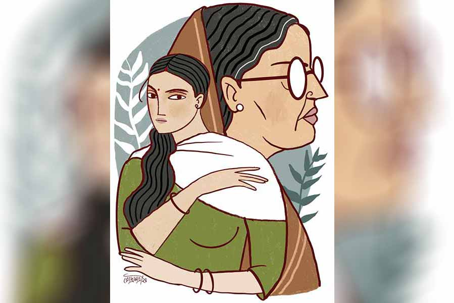

 
 <h1 align=center>অন্য মা</h1>
<h2 align=center>মহুয়া চৌধুরী</h2> খুব ঘটা করে লিপি আর সৌভিকের মেয়ে রিঙ্কির বিয়ে হয়ে গেল। লিপি নিজেই  এখনও আনাড়ির একশেষ। একটা সামান্য কাজ করতে পাঁচ বার থমকায়। বিয়েবাড়ির যাবতীয় দায়িত্ব নিজের কাঁধে তুলে নিয়েছিল পরমা। ক’দিন ধরে তার নিঃশ্বাস ফেলার ফুরসত ছিল না। কারা যেন ভেবেছিল পরমা বুঝি লিপির নিজের বোন।

“মায়ের পেটের বোন এর চেয়েও বেশি নিজের হয় কি না আমার জানা নেই।”— লিপি উত্তর দেওয়ার আগেই পরমা বলেছিল। চোখে জল টলটল করছিল।

শুধু বিয়ের সব অনুষ্ঠান মিটে গেলে, কাল অনেক রাতে অর্ক, পরমার বর, বলেছিল, “দুধের সাধ ঘোলে মেটালে?”

অর্কর গলায় পুরনো মন খারাপ। আলতো করে পরমা উত্তর দিয়েছিল, “না তো, দুধের সাধ ক্ষীরে মেটালাম।”

ওর নিঃশ্বাসের শব্দে ঘরের অন্ধকার হাওয়া কাঁপছিল তিরতির করে। সত্যি বলেছিল কি না, পরমা নিজেই জানে না।

দু’জনেই সুস্থ। তবু যে কেন সন্তান এল না! কত চিকিৎসা, কবচ, মাদুলি! বৈজ্ঞানিক আর অবৈজ্ঞানিক হরেক পদ্ধতি। সব বৃথা। শুধু পরমার এক গোপন ব্যাখ্যা আছে। কাউকে বলার নয়। শরীর, মন মিলেমিশে না ডাকলে, শিশুরা নেমে আসে না মাটির পৃথিবীতে। আসলে ওই সব মুহূর্তে ভীষণ আতঙ্কে সিঁটিয়ে যেত পরমা। জীবন্ত দুঃস্বপ্নের মতো জেগে উঠত স্মৃতিরা। যদি— যদি— পরমা নিজেই বদলে যায়! তার অজাত সন্তানের কচি গায়ে কালশিটের দাগ দেখতে পেত সে। শিউরে উঠত।

কালকে রিঙ্কির রিসেপশনে পরা সবুজ ইক্কতটা ইস্ত্রি করছিল তখন পরমা। স্কুলজীবনের কত ছোট ছোট মুহূর্ত মনে পড়ে যাচ্ছিল! লিপির সবচেয়ে ঘনিষ্ঠ বন্ধু সে। ইদানীং আরও বেড়েছে ঘনিষ্ঠতা। একমাত্র লিপিই জানত পরমার লুকোনো সমস্ত কথা। ভয়— ভয়— ভয়! এক ভীষণ আতঙ্কের রাজ্যে পরমার প্রথম আঠারোটা বছর কেটেছিল। রোগা-রোগা শ্যামলা দুটো হাত দিয়ে সেই ভয় থেকে, লিপি আগলে রাখতে পারেনি পরমাকে। কিন্তু ক্ষতে নরম ছোঁয়া দিয়েছিল। বন্ধুতা তৈরি হতে আর কী লাগে! টুকরো টুকরো কত সময়ের কথা লিপি ভুলে গেছে। পরমা আজও মনে রেখেছে।

মোবাইল বেজে উঠল। স্ক্রিনে রাধার নাম। রাধা নিজে থেকে সাধারণত ফোন করে না। পরমা রাতে এক বার ফোন করে মায়ের সারা দিনের খবর নেয়। অবশ্য খবর নেওয়ার কিছু থাকে না। তার ছিয়াশি পেরিয়ে-আসা মা দেড় মাস হল সেমি-কোমায়। ফিমার বোন ভেঙে গিয়েছিল। তার পর থেকেই ক্রমশ অবনতি। ডক্টর চ্যাটার্জি বলেছিলেন, “এই বয়সে অপারেশন করে লাভ নেই। বরং যে ক’টা দিন আছেন উনি, বাড়িতেই রাখুন। মেনে নিন যে, এটাই বিগিনিং অব দ্য এন্ড।”

পরমা, অর্ক ওই বাড়িতে খুব কম যায়। নিতান্তই যখন না গেলে নয়। অবশ্য বাবা মারা যাওয়ার পর, এই সাত বছর ধরে মায়ের যাবতীয় দরকার মিটিয়ে আসছে সে। ইদানীং অনলাইনের কল্যাণে ধরি মাছ না ছুঁই পানি কায়দা ভারী সুবিধেজনক।

ফোনে ডক্টর চ্যাটার্জির সঙ্গে সে মায়ের ছোট ছোট সমস্যাগুলো নিয়ে কথা বলে নেয়। ভারী বয়সের রোগীর লাগাতার সমস্যা ডাক্তাররা বিশেষ পাত্তা দেন না। গত সপ্তাহে পরমা ফোনে বলেছিল, “প্রেশারটা লোয়ের দিকে শুনছি ক’দিন ধরে।”

তাতে সমাধান খোঁজা দূরে থাক, নিঃশ্বাস ফেলে বলেছিলেন ভদ্রলোক, “কী মারাত্মক জীবনীশক্তি!”

খারাপ লাগবে কী, পরমার নিজেরই তো কত বার তা মনে হয়েছে। কাঁটা হয়ে থাকত, বিয়েবাড়ি চলার মধ্যে কিছু না হয়ে যায়! এখন ভাবল, এ বার সত্যিই শেষ বোধহয়। নইলে রাধা নিজে থেকে কেনই বা...

“দিদি, তুমি চলে এসো। এক্ষুনি।... দাদাকেও বলো...” উত্তেজিত গলা রাধার।

হাঁপাচ্ছিল। কথা কেটে পরমা ঠান্ডা গলায় বলল, “আসছি।” জিজ্ঞেসও করল না, কী হয়েছে।

তখন হাঁউমাউ করে কাঁদতে লাগল রাধা, “মাসিমা যে চলে গেল গো দিদি, চোকে কানে দেকতে দিল না! দুকুর পজ্জন্ত যেমনিকার তেমনি... আমি খেয়ে এসে দেকি কি...”

পরমার মনে হচ্ছিল ন্যাকামি। যত দিন বাক্শক্তি ছিল, রাধাকে দাঁতে পিষে রেখেছিল মা। আঠারো বছরের পুরনো লোক। শয্যাশায়ী হওয়ার আগেও প্রায়ই কাপড় নোংরা করে ফেলত মা। ঘেন্নাপিত্তির বালাই রাখেনি তখন রাধা। দু’হাতে সমস্ত ময়লা সাফ করেছে। কিন্তু কাউকে সহ্য করতে পারেনি মা কখনওই। যখন-তখন ফোন করে কেবল অভিযোগ আর অভিযোগ। রাধার কাজে গাফিলতি, বিস্বাদ রান্না, ঠান্ডা চা, ঠিকে কাজের মেয়ের মুখে মুখে তর্ক... “দূর করে দাও এ সব অপদার্থ চাকরানিগুলোকে— কাউকে দরকার নেই আমার...” তখনও কী তীব্রতা ছিল মায়ের গলায়! জবাবে পরমা, একটাই কথা বলত, “ঠিক আছে, যা ভাল বোঝো করো। রাখছি।”

বলেই ফোন কেটে দিত।

এখন ফোন ছেড়ে পরমার মনে হল, ভাগ্যিস কালকে কিছু হয়নি!

আয়রন মেশিনের সুইচ অফ করেনি পরমা। একটু ইতস্তত করে পরিপাটি ভাবে ইস্ত্রি শেষ করল। তার পর হাউসকোট ছেড়ে একটা কুর্তা, পালাজ়ো গলিয়ে তৈরি হল। মা পছন্দ করত না। বিয়ের আগে শাড়ি ছাড়া আর কিছু পরতে দেয়নি। একমাত্র মেয়ের নির্দোষ একটা শখেরও তোয়াক্কা করেনি মা কখনও। বনানীর জন্মদিনে শাড়ি পরে বেরিয়েছিল পরমা বাড়ি থেকে। তার পর লুকিয়ে লিপির ফ্রিসাইজ় সালোয়ার-কামিজ় পরে নিয়েছিল। বাড়ি ঢোকার আগে আবার শাড়ি। তখন টুয়েলভ ক্লাস। পরদিন কী ভাবে যেন টের পেয়ে গিয়েছিল মা। সঙ্গে সঙ্গে সেই পাট করা শাড়িটা টেনে দাঁত দিয়ে ছিঁড়ে কুটিকুটি করে ফেলেছিল। আলুথালু চুল ছড়িয়ে পড়েছিল বুকে কাঁধে। ভয়ানক আক্রোশে বিকৃত মুখ। কেমন বিকৃত, জান্তব দেখাচ্ছিল পরমার সুন্দরী মাকে।

আতঙ্কে দূরে দাঁড়িয়ে কাঁপছিল পরমা। ওদের বাড়িটা ছিল সমস্ত স্বাভাবিকতা থেকে বিচ্ছিন্ন একটা দ্বীপ। ওখানে মায়ের কথাই শেষ কথা। মনে মনেও কেউ তার ইচ্ছের বিরোধিতা করবে, সহ্য করতে পারত না মা।

আরও আগে, পান থেকে চুন খসার অপেক্ষা। স্কুলের পরীক্ষায় একটা অঙ্ক কাটা গেছে, বানান ভুল, টিউশন থেকে ফিরতে সামান্য দেরি, পড়ার টেবিল অগোছালো— মা জিজ্ঞেস করার আগেই মারতে শুরু করত। রুটি বেলার বেলুন, চটি, স্কেল, হাতের কাছে যা পেত তাই দিয়ে। কী সাংঘাতিক সে মার! কালশিটে পড়ে যেত তার হাতে পায়ে। চুল ছিঁড়ে যেত। গালের আঁচড়ে রক্তের ছোপ। যন্ত্রণায় ডুকরে কেঁদে উঠত সে। তবু থামত না মা। যত ক্ষণ না নিজে হাঁপিয়ে যেত।

বাবা বাড়িতে থাকলে আটকাতেন। তখন বাবাকে নিয়ে পড়ত মা। বাবার অপদার্থতার কথা চিৎকার করে বলত, “গোবরের তাল! গোবরের তাল একটা! লোকে বলে ভালমানুষ! নিকুচি করেছে ভালমানুষির! তোমার বাবা, আমার পড়া বন্ধ করে, আমার সমস্ত জীবনটা নষ্ট করে দিয়ে তবে মরেছে— কেন? তখন তো নিজের বাবার উপরে একটা কথা বেরোয়নি মুখ দিয়ে! আমার ম্যাট্রিক ক্লাসের মেডেল কোন কাজে এল? ডিস্ট্রিক্ট ম্যাজিস্ট্রেটের বৌ নিজে হাতে পরিয়ে দিয়েছিল গলায়। কিন্তু চাকরানি হয়ে এ বাড়িতে আসা! সব চুলোর দোরে গেল। কী চিপটিনি কাটা কথা ছিল তোমার বাবার...”

মা কলেজে পড়তে চেয়েছিল। চাকরি করতে চেয়েছিল। তখনকার ফ্যাশনে শখ করে হাতকাটা ব্লাউজ় পরতে চেয়েছিল। কিন্তু পরমার সেকেলে ঠাকুরদা সে সবের কোনওটাই হতে দেননি। পরমার বাবা খোলাখুলি স্ত্রীর পক্ষ নিতে পারেননি। নিজের বাবার কথার প্রতিবাদে কিছু বলতে পারেননি।

পরমা জন্মানোর আগেই ঠাকুরদা মারা গেছেন। তবু একটা উপলক্ষ পেলেই, কোন কালের ব্যাপার টেনে এনে ফুঁসত মা। জমা রাগ উগরে দিত। বারবার উগরে দিয়েও জীবনে কখনও ফুরোয়নি মায়ের সেই আক্রোশ।

এক বার পরমা সাহস করে খুব ফিকে গলায় বলেছিল, “তা তুমি আবার নতুন করে লেখাপড়া শুরু করো না... প্রাইভেটে পরীক্ষা দিয়ে...”

কথা শেষ হয়নি। গর্জন করে উঠেছিল মা, “গাড়োলের মতো কথা বোলো না! সময় চলে গেলে আর ফেরে না! যখন যা হওয়ার কথা, তা না হলে, আর কোনও কালে হয় না... এখন সেই মন আছে? না, স্মৃতিশক্তি আছে? সব, সব গেছে, তোমাদের এ সংসারে হাঁড়ি ঠেলতে ঠেলতে...”

মায়ের সুন্দর পাতলা ঠোঁট বেঁকে বিকৃত হয়ে গিয়েছিল। ঘন ঘন নিঃশ্বাস পড়ছিল। চোখে কী বীভৎস ঘেন্না! দেখে ভয়ে কাঠ হয়ে গিয়েছিল পরমা। বাবা আর মেয়ে ছিল যেন মায়ের জঞ্জাল ফেলার আঁস্তাকুড়।

বাবা খোঁজখবর চালাচ্ছিলেন তলে তলে। বারো ক্লাস পাশের পরেই তাড়াতাড়ি বিয়ে দিয়ে দিলেন মেয়ের। ওই অসুস্থ পরিবেশ থেকে মুক্তি! পরমা পালিয়ে বেঁচেছিল। এ বাড়িতে এসে নিঃশ্বাস ফেলেছিল। খুব বেশি কিছু চাওয়ার ছিল না পরমার, একটুখানি স্বাভাবিকতা ছাড়া। অর্কর কাছে প্রথম থেকেই নিরাপত্তা পেয়েছিল সে। তার বাবা-মা ছিলেন সহজ মানুষ। মন খুলে কথা বলা যায় যেখানে। প্রণাম করে উঠলে, অর্কর মা যখন চিবুক ছুঁয়ে আদর করতেন, বুক ভরে যেত তার। বাবা আসতেন প্রায়ই। খোলা গলার হাসি ভাসত এ বাড়ির হাওয়ায়। পরমার মনে হত, পৃথিবীতে তার চেয়ে বেশি সুখী আর কেউ নেই বুঝি। দুঃস্বপ্নের মতো ওই বাড়িটাকে ফেলে এসেছিল সে। আর কখনও রাত কাটায়নি।

মায়ের সঙ্গে বরফের মতো ঠান্ডা, শক্ত, দুর্লঙ্ঘ্য দূরত্ব তৈরি করে নিয়েছিল ক্রমশ।

এখন বেরোনোর আগে পরমা অর্ককে ফোন করল। রিটায়ার করার পর সে একটা কোম্পানিতে কনসালটেন্সির কাজ করছে। খবরটা দিতে চুপ করে রইল কয়েক মুহূর্ত। তার পর সম্ভবত একটু উচিত-অনুচিত ভেবে নিয়ে বলল, “শান্তি পেলেন।”

ফোন রেখে পরমা মনে মনে বলল, ‘শান্তি দিলেন।’

ও বাড়িতে পৌঁছে পরমা দেখল, দরজা খোলা। দু’-চার জন বয়স্ক প্রতিবেশী। পাড়ার কলের মিস্ত্রি। বিল্ডিং-এর সিকিয়োরিটি গার্ড। ঠিকে কাজের মেয়ে তিলু। সবার উপরে কাঁদুনে রাধা। আর কেউ নয়।

আত্মীয়স্বজন কাকে কাকে খবর দেবে ভাবছিল পরমা। মামার বাড়ির পাট নেই তার। মায়ের মা তিন বছর বয়সে, টাইফয়েডে মারা যান। একমাত্র দাদা মায়ের বিয়েরও আগে গলায় দড়ি দিয়ে আত্মহত্যা করেছিলেন। ছাড়া-ছাড়া ভাবে ঘটনাগুলো মায়ের মুখেই শোনা। মা শ্বশুরবাড়ির দিকের কাউকেই ভাল চোখে দেখত না। বিশেষ সম্পর্ক নেই। তবুও জানতে পারলে আসবে তারা। পরমার হাসি পেল মনে মনে। দুঃখী-দুঃখী ভাবটা তখন জোর করে মুখে ফুটিয়ে রাখতেই হবে তাদের। বেচারা!

অর্ক মিনিট দশেকের মধ্যে এসে পৌঁছবে জানাল। লিপি, সৌভিকও। তত ক্ষণে করণীয় কাজগুলো মোবাইলে সারতে শুরু করল পরমা।

সামনের বাড়ির বয়স্কা প্রতিমা কাকিমা ওকে দেখে বললেন, “সব শেষ হয়ে গেল। বড় কষ্ট পাচ্ছিল... শয্যেধরা হয়ে পড়ে থাকা... অমন সচল মানুষটা! যাও মা, ভিতরে যাও! একমাত্তর সন্তান, মুখাগ্নি তো মা তোমাকেই করতে হবে?”

এত ক্ষণ ভাবেনি। আচমকা শুনে বিকট অস্বস্তি পাক দিয়ে উঠল ভিতরে। একটা মানুষের মুখে আগুন ছোঁয়াতে হবে!

ঘরে ঢুকতেই, শুয়ে থাকা অবয়বটা চোখে পড়ল আগে। সেই মা পড়ে গিয়েছিল যে দিন, সে দিন এসেছিল পরমা। তার পরে আজ। দেড় মাসে শুকিয়ে ছোট্টটি হয়ে গেছে।

পায়ে পায়ে এগোল পরমা। এক কালের নামজাদা সুন্দরী ছিল মা। আজও বলিরেখা প্রায় নেই। চুল বেশির ভাগই কালো। মায়ের মধ্যে যে আগুন জ্বলত সারা ক্ষণ, নিবে গেছে। পড়ে আছে শুধু ছাই। ঠোঁটের কোণে, বন্ধ চোখের কোলে এখন বিষাদ, কত কালের বিষাদ শুধু। কী করুণ! অবাক হয়ে চেয়ে রইল পরমা। কোথায় লুকিয়ে ছিল মায়ের এত বিষাদ? যে ছোট মেয়েটি কখনও পরমার গর্ভে আসেনি, কেমন করে আজ তাকে সামনে দেখতে পায় পরমা? অসহায়— গোলকধাঁধায় পথ হারিয়ে বেভুল—তাকে পথ দেখায়নি কেউ। কত কী চেয়েছিল, কিছু পায়নি তবু! হু-হু করে ওঠে পরমার বুকের ভিতরটা। ওই মেয়েটার মা হয়ে ওঠে সে। অজান্তেই দু’ফোঁটা জল গড়িয়ে পড়ে তার গাল বেয়ে। জ্ঞান হয়ে অবধি কেঁদেছে সে কত বার, মায়ের দেওয়া নিষ্ঠুর আঘাতে। মায়ের জন্য কাঁদেনি কখনও।

এ বার চোখ দিয়ে জল পড়ে তার। মায়ের জন্য। পরমার ষাট-পেরোনো জীবনে এই প্রথম।