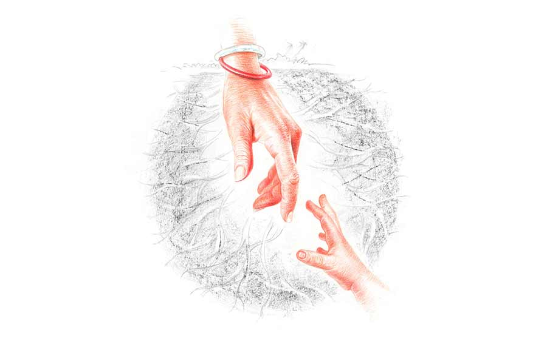

 
 <h1 align=center>অপরিচিতা</h1>
<h2 align=center>অরুণাভ দত্ত</h2> জানিস পাপাই, সব ক’টা টমেটো গাছ মরে গেছে!”

“যা! সে কী!”

“তোর বাবা দু’বেলা ধরে এত জল দিয়েছে যে, গোড়াগুলো পচে গেল! জানিস, টুলু চাকরি পেয়েছে। তোর মামা বলল। স্টার্টিংয়েই নাকি তিরিশ হাজার টাকা মাইনে।”

“টুলুকে আমার তরফ থেকে অভিনন্দন জানিয়ো।”

“কী জানি বাবা! আমার তো মনে হচ্ছে মাইনেটা বাড়িয়ে বলছে। জানিস, টিটি কাল তোর পড়ার টেবিলের বুদ্ধমূর্তিটা মেঝেতে ফেলে ভেঙে ফেলেছে।”

“সে কী!”

“তোর বাবা তো রেগে আগুন। খালি বলছে, ‘বলেছিলাম কুকুর-টুকুর পুষো না!’ আচ্ছা ও তো অবুঝ, বল?”

“টিটিকে কিছু বোলো না। আজ কী রান্না করলে মা?”

“আজ তো শনিবার। আম দিয়ে টক ডাল করলাম, ঝিঙে-পোস্ত, পাঁপড়ভাজা আর বাটি চচ্চড়ি।”

“আহা!”

“তোদের হস্টেলে কী হচ্ছে?”

“সেই জলের মতো ডাল, আলুভাজা, পোনা মাছের ঝোল।”

“আজ মাছ খাবি?”

“সবই তো আমিষের ছোঁয়া।”

“আচ্ছা… ওই দেখ, তোর বাবা বাথরুম থেকে ‘গামছা, গামছা’ করে চেঁচাচ্ছে। আশ্চর্য লোক বটে! রোজ গামছা না নিয়ে চান করতে যাবে। দাঁড়াও যাচ্ছি। আচ্ছা শোন, রোজ রোজ রাত জাগিস না বাবা! আর কেউ কিছু ছাইপাঁশ খাওয়াতে এলে খাবি না কিন্তু! আমার দিব্যি!”

“আচ্ছা। রাখছি।”

অডিয়ো ক্লিপটা শেষ হয়ে গেল। মাঝরাতে নিজের বিছানায় শুয়ে অর্ক শুনছিল মায়ের সঙ্গে তার পাঁচ বছরের পুরনো একটা কথোপকথন। সেটা ফোনের ‘রেকর্ড’ নামের একটা ফোল্ডারে সংরক্ষিত ছিল। যে সময়ে ওই কথা হচ্ছে, তখন মা বাড়িতে আর অর্ক সুদূর হস্টেলে। কথাগুলো শুনতে শুনতে অর্কর দু’চোখ থেকে জল উপচে পড়ছে। খুব মনে পড়ছে সেই মায়ের কথা।

অর্কর মা অর্থাৎ শাশ্বতী কিন্তু এখন পাশের ঘরে ঘুমোচ্ছেন। কিন্তু এখন অর্কর কাছে তিনি এক জন অপরিচিতা নারী। আজকাল নিজের মাকে অর্ক আর চিনতে পারে না। মনে হয়, তার সেই চেনা মানুষটাকে হঠাৎ যেন হারিয়ে ফেলেছে। এই মাকে ছেলেবেলা থেকে সে কোনও দিনই দেখেনি। হঠাৎই যেন আদ্যোপান্ত বদলে গিয়েছে মানুষটা।

অর্কর পরিবারে সে, তার মা আর বাবা। বাবা তো সারা দিন অফিসে। তাই অর্কর ছেলেবেলা জুড়ে কেবল মা আর মা। মায়ের সঙ্গেই ছিল তার যত আড্ডা। মায়ের সঙ্গে সিনেমা দেখা। মায়ের কাছে গান শেখা। ছুটির দুপুরে মায়ের কাছে শুয়ে গল্প শোনা। মায়ের সঙ্গে রান্নাঘরে নতুন রান্না নিয়ে গবেষণা। অর্কর ছেলেবেলা কেটেছে এ ভাবেই। তার পর ইঞ্জিনিয়ারিং পড়তে সে হস্টেলে চলে যায়। সেখানে প্রতিদিনই মায়ের সঙ্গে ফোনে কথা হত। তখনকার কোনও একটা কল রেকর্ড অর্কর অজান্তে সংরক্ষিত থেকে গিয়েছিল তার মোবাইলে। সেই রের্কডটা শুনতে শুনতে অর্ক শুধুই ভাবছিল, ‘কোথায় গেল আমার সেই মা!’

অবশ্য শাশ্বতীর মুখ থেকে যে কথাটা শুনে অর্কর প্রথম মনে হয়েছিল যে, ওর মা বদলে গিয়েছে, সেই কথাটা অর্ক আগেও অনেক বার মায়ের মুখে শুনেছে। তবে অন্য ভাবে। যেমন, ছেলেবেলায় অর্ক দুষ্টুমি করলে মা বকতেন, কখনও দু’ঘা বসিয়েও দিতেন। তার পর অর্ক যখন কৈশোরের গণ্ডি পেরিয়ে যাচ্ছে, তখন সে মায়ের মুখে শুনতে পেত নতুন একটা কথা। তখন অর্কর কোনও কাজ বা কথা শাশ্বতীর অপছন্দ হলে তিনি হামেশাই অর্ককে বলতেন, “মায়ের ওপর জুলুম করে নাও! মা সহ্য করবে, বৌ করবে না!”

সচরাচর কথাটা পুরুষানুক্রমে সব ছেলেই তাদের মায়ের মুখ থেকে শুনে থাকে। অর্করও কথাটা শুনে-শুনে গা সয়ে গিয়েছিল। কখনও কথাটা শুনে অর্ক আদর করে শাশ্বতীর গাল টিপে দিত। অর্কর বাবা শুধু বলতেন, “আগে ছেলেটাকে নিজের পায়ে দাঁড়াতে দাও। এখন থেকে অত বিয়ে-বিয়ে করো না।”

শাশ্বতী বলতেন, “এক দিন তো বিয়ে করবেই। তখন বুঝবে।”

এর পর অর্ক ইঞ্জিনিয়ারিং পাশ করে একটা ভাল চাকরি পেল। অর্পিতার সঙ্গে পরিচয় হল। প্রেম হল। এক দিন শাশ্বতীর সঙ্গে অর্পিতার পরিচয় করাল। দেখেশুনে শাশ্বতী খুব খুশি। অর্ক জানাল, “মা, সবে চাকরি পেয়েছি। একটু গুছিয়ে নিয়ে অর্পিতাকে বিয়ে করব।”

অর্কর মনে আছে, ঠিক ওই সময় থেকেই শাশ্বতীর পরিবর্তনটা এসেছিল। এক দিন হয়তো অর্পিতার সঙ্গে ফোনে গল্প করতে করতে অর্কর খেতে বসতে দেরি হচ্ছে দেখে শাশ্বতী তাড়া দিচ্ছেন। অর্ক এলে বললেন, “খেয়ে নিয়ে তো যত রাজ্যের গল্প করতে পারিস।”

“স্যরি মা।”

“প্রতিদিন সেই এক কথা! কী খেলে, কী পরলে, কখন ঘুমোলে। এ সব খেয়ে নিয়ে করলে তো আমায় খাবার আগলে বসে থাকতে হয় না।”

অর্ক তখন বিরক্ত হয়ে উত্তর দিল, “বললাম তো স্যরি। তা ছাড়া এক দিন দশ মিনিট দেরি করে খেতে বসলে কী এমন মহাভারত অশুদ্ধ হবে?”

“আগে তো খেতে দিতে ওই দশ মিনিট দেরি হলে চিৎকার করে বাড়ি মাথায় করতিস। এখন কী করে খিদে সহ্য করে আছিস?”

“বললে তো অনেক বার! এ বার শান্তিতে খেতে দাও!” গলা উঁচু করে বেশ রাগতস্বরেই কথাগুলো বলে ফেলে অর্ক।

তখনই শাশ্বতীর মুখ বেরিয়ে আসে সম্পূর্ণ নতুন কথা, নতুন সুরে, “এখনই এত গায়ে লাগছে তোর? এর পর বৌ এলে তো মা দু’চোখের বিষ হয়ে যাবে রে!”

সেই ছিল সূত্রপাত। এর পর মায়ের মুখ থেকে এই জাতীয় অনেক কথা শুনেছে অর্ক। শুনেছে আর ভেবেছে যে, মায়ের এই কথা আর কৈশোরের সেই কথার মধ্যে বিস্তর ফারাক। ‘মা সহ্য করবে, বৌ করবে না’— এই কথাগুলোর মধ্যে রাগের সঙ্গে মিষ্টতাও ছিল। আর এখন শাশ্বতী যে কথাগুলো অর্ককে বলেন, তার মধ্যে আছে বক্রোক্তি আর আশঙ্কা। যেগুলো অর্কর মোটেই ভাল লাগে না।

‘এখন আমার কথা মনে আছে, বৌ এলে ভুলে যাবি...’ শুনে অবাক হয় অর্ক। মাকে কেন ভুলে যাবে সে? অর্ক কি এতটাই খারাপ? অর্ক এখনও মনেপ্রাণে সেই ছেলেবেলাকার মায়ের ছবিটাই গেঁথে রেখে দিয়েছে মনে, তাই হয়তো হঠাৎ ভবিষ্যতের চিন্তায় বদলে যাওয়া মাকে মন থেকে মেনে নিতে পারে না। তার বাবা অবশ্য এ সব বিষয়ে সম্পূর্ণ নিঃস্পৃহ।

পুজোর সময় বাবা-মায়ের সঙ্গে নতুন জামা কিনতে যাওয়া অর্কর বরাবরের অভ্যাস। অর্পিতা অর্ককে বলেছিল, “তোমায় শার্টের চেয়ে টি-শার্ট পরলে বেশি ভাল লাগে।” দোকানে গিয়ে শাশ্বতী অর্কর জন্য একটা গোলাপি শার্ট পছন্দ করছেন দেখে অর্ক বলল, “মা, অর্পিতা বলে শার্টের থেকে টি-শার্ট পরলে আমায় মানায় ভাল। তুমি বরং এই রঙের একটা টি-শার্ট দেখো...” বলে অর্ক প্রশ্ন করল, “শার্ট পরলে কি আমায় খারাপ লাগে মা?”

শাশ্বতী গম্ভীর মুখে জবাব দিলেন, “তোকে তো এক জন মতামত দিয়েই দিয়েছে। আবার মা কেন?”

অর্ক রাগ করে সে বছর আর নতুন জামা-ই কিনল না। শাশ্বতীও তা-ই করলেন। বাবা বললেন, “এক যাত্রায় পৃথক ফল করে কী লাভ? আমারটাও তবে থাক। সত্যি, তোমাদের মা-ছেলের যে কী নিয়ে এত মন কষাকষি, বুঝি না বাপু!”

অর্ক জানে, শাশ্বতী অর্পিতাকে যথেষ্ট ভালবাসেন। অর্পিতাকে অনেক বার বাড়িতে এনে নিজের হাতে রেঁধে খাইয়েছেন। তাও যেন শাশ্বতীর মনে অর্ককে নিয়ে কী এক ভয় ঘুরেফিরে আসে। অর্করা আগে থাকত তাদের শরিকি বাড়িতে। সেখানে একটাই ছোট ঘর। অর্ক চাকরি পাওয়ার পর তারা পুরনো বাড়ি ছেড়ে নতুন ফ্ল্যাটে চলে এসেছিল। ফ্ল্যাটে দুটো ঘর। একটা বড়, অন্যটা ছোট। অর্কই বাবা-মাকে বড় ঘরে থাকতে বলেছিল। সেই ঘরের লাগোয়া একটা ব্যালকনি আছে। ওটা অর্পিতার খুব পছন্দ। এক দিন কথায় কথায় অর্ক শাশ্বতীকে বলল সে কথা। শাশ্বতী বললেন, “আচ্ছা, তোরা বিয়ের পর বড় ঘরেই থাকিস। ছোট ঘরটায় আমি আর তোর বাবা থাকব।” 

তার পরই ‘অশ্বত্থামা হত ইতি গজ’র মতো কথার শেষে স্তিমিত কণ্ঠে বললেন, “এখানে থাকতে দিবি তো? না কি আমাদের পুরনো বাড়িতে চলে যেতে হবে?”

“তোমার কী মনে হয়? বিয়ের পর আমি তাড়িয়ে দেব তোমায়?”

“ভবিষ্যতের কথা কিছু বলা যায় বাবা? কখন কার পাল্লায় পড়ে কার কী মতি হয়!”

“তোমার কিন্তু এখনই মতিভ্রম দেখা দিয়েছে।”

“আমাকে তুই পাগল প্রতিপন্ন করতে চাইছিস?”

“আর তুমি যে দীর্ঘ দিন ধরে এই কথাগুলো বলে আমাকে পাগল করে দিচ্ছ! আমার তো মনে হয়, আমার বিয়ের পর নিত্য অশান্তি লেগে থাকবে বাড়িতে।”

অর্কর দিকে স্থির দৃষ্টিতে তাকিয়ে শাশ্বতী বললেন, “ভাবিস না। নিজেকে এ বার শুধরে নেব। ভবিষ্যতেও যদি কোনও অন্যায় দেখি, তখনও চুপ করেই থাকব। ভগবান রক্ষা করেছেন, তোর বাবার পেনশনটা আছে। আমার জন্য কিছু টাকাকড়িও আলাদা রেখে দিয়েছে। তেমন দিন এলে বৃদ্ধাশ্রমে গিয়ে…”

অর্ক দাঁতে দাঁত চেপে সব শুনতে লাগল। সে ভাবল শাশ্বতী ধরেই নিয়েছেন যে, ভবিষ্যতে অর্ক তাঁদের দেখবে না। বৌয়ের কথায় উঠবে বসবে। শাশ্বতীর এই পরিবর্তন অর্কর কাছে অসহ্য লাগে। এখন সে শাশ্বতীর সঙ্গে বিশেষ কোনও কথাই বলে না। মুখ বুজে খেয়ে অফিসে যায়, সন্ধ্যায় ফিরে নিজের ঘরে কাজ নিয়ে বসে থাকে। এই ভাবে মা ভীষণ অপরিচিতা হয়ে ওঠে অর্কর কাছে।

তবে সেই রাতে একটা ম্যাজিক ঘটে গেল। শাশ্বতীর সেই পুরনো গলা আর কথাগুলো শুনতে শুনতে ছোটবেলার ঘটনাগুলো অর্কর স্মৃতিতে ভাসতে লাগল সুগন্ধের মতো। বহু কালের বদ্ধ ঘরে এক ঝলক টাটকা বাতাসের মতো সুখস্মৃতিগুলো অর্কর মন ভাল করে দিল। ভাবল, তার ধারণা হয়তো ভুল। মা কি কখনও বদলাতে পারে? পরদিন অর্ক অফিসে গেল না। ভাবল আজ সারা দিন সে মায়ের সঙ্গে আনন্দ করে সময় কাটাবে। এক সঙ্গে বসে দেখবে বলে ল্যাপটপে শাশ্বতীর প্রিয় একটা সিনেমাও জোগাড় করে রেখেছে, উত্তমকুমারের। কিন্তু ম্যাজিক বেশি ক্ষণ স্থায়ী হল না।

অর্কর বাবা গিয়েছেন ব্যাঙ্কে। অর্ক চায়ের কাপ হাতে বসে শাশ্বতীর সঙ্গে টুকরো টুকরো গল্প শুরু করেছে। হঠাৎ অর্কর মোবাইলে একটার পর একটা এসএমএস ঢুকতে শুরু করল। অর্ক ছুটি নিয়েছে শুনে অর্পিতা সিনেমা দেখতে যাওয়ার প্ল্যান করেছে। এমনকি দুটো টিকিটও বুক করে রেখেছে। অর্ক সরাসরি লিখে জানাল, সে আজ যেতে পারবে না। অর্পিতা মানতে নারাজ। শাশ্বতীর কথায় মনোযোগ দিতে পারছে না অর্ক। রিংটোনের শব্দ শুনে বার বার ফোন হাতে নিয়ে অর্পিতাকে রিপ্লাই দিতে হচ্ছে। শাশ্বতী উঠে দাঁড়ালেন, “যা, ওকে সময় দে। নইলে আবার সকাল সকাল ঝগড়াঝাঁটি শুরু হবে। মাকে সময় না দিলেও চলবে।”

দোটানার মাঝে পড়ে মেজাজটা একেবারে বিগড়ে গেল অর্কর, “তোমার কি প্রবলেম জানো? তুমি অর্পিতাকে সহ্যই করতে পারো না!”

“সেই জন্যই তো ঠিক করেছি, তোদের বিয়ের পর আমি আর তোর বাবা আমাদের পুরনো বাড়িতে গিয়ে থাকব। তোরা কী করলি না করলি দেখতেও আসব না। মায়ের তরফ থেকে কোনও অশান্তি হবে বলে আশঙ্কা করিস না।” দ্রুত পদক্ষেপে তিনি রান্নাঘরে চলে গেলেন।

অর্কও মাথা গরম করে বেরিয়ে গেল কোথায়।

কয়েক মাস আগে হেড অফিস থেকে অর্কর জন্য খুব ভাল একটা অফার এসেছিল। কোম্পানি ওকে পাঁচ বছরের জন্য জার্মানিতে ট্রান্সফার করতে চায়। অর্ক সময় চেয়েছিল। কিন্তু এখন সে অফারটা লুফে নিল। ঠিক করল অর্পিতাকেও জার্মানিতে নিয়ে যাবে। শাশ্বতীকে এই ব্যাপারে বিন্দুবিসর্গ জানাল না। মায়ের জন্য বিন্দুমাত্র কষ্টও হল না। খারাপ লাগল শুধু বাবার কথা ভেবে। এক দিন রাতে অফিস থেকে ফিরে অর্ক জানাল যে, পরদিন সে অফিসের কাজে কয়েক মাসের জন্য বেঙ্গালুরু চলে যাচ্ছে।

শাশ্বতী শুধু বললেন, “কাল চলে যাবি আর আজ জানাচ্ছিস?”

অর্ক সে কথার কোনও উত্তর দেয় না। চুপ করে থাকে।

পরের দিন রাতের দিকে ফ্লাইট। এ দিকে সকাল থেকে শুরু হয়েছে তুমুল ঝড়বৃষ্টি। বেলা গড়ানোর সঙ্গে সঙ্গে পাল্লা দিয়ে বাড়ছে ঝোড়ো হাওয়ার দাপট। অর্পিতা অর্ককে বার বার বলেছিল তাড়াতাড়ি এয়ারপোর্টে পৌঁছতে। তাই সন্ধে হওয়ার আগেই বেরিয়েছে অর্ক। প্রচণ্ড দুর্যোগ মাথায় নিয়ে ট্যাক্সি ছুটছে। বেরোনোর আগে সে সংক্ষেপে একটা চিঠি লিখে এসেছে। অর্কর মনে পড়ছে সেই চিঠির শেষাংশের কথাগুলো— ‘মা, কয়েক মাস নয়, আবার পাঁচ বছর পর আমাদের দেখা হবে। তোমার সংসার তোমারই রইল। কিছুই আমি নিইনি। শুধু একটাই আফসোস রয়ে গেল। যাওয়ার আগে তোমাকে আর খুঁজে পেলাম না।’

মায়ের থেকে আরও দূরে চলে যাচ্ছে অর্ক। কিছু ক্ষণ বাদেই তার কাছে এই দেশ হয়ে যাবে বিদেশ। মাথাটা প্রচণ্ড দপদপ করছে। গাড়ির সিটে হেলান দিয়ে চোখ বুজতেই অর্কর হঠাৎ মনে পড়ে গেল এমনই এক দুর্যোগের কথা। তখন অর্কর বয়স দশ। এক মধ্যরাতে চার দিক ঝড়বৃষ্টিতে লন্ডভন্ড হয়ে যাচ্ছে। ঘরে বিছানায় অর্ক পড়ে আছে জ্বর নিয়ে। থার্মোমিটারের পারদ ১০৩ ডিগ্রি ছুঁই-ছুঁই। জ্বরের ঘোরে অর্ক প্রায় অচেতন। বাবা তখন অফিসের কাজে বাইরে। দুর্যোগের জন্য বাইরে বেরোনোর উপায় নেই। শাশ্বতী একলাটি হতবুদ্ধি হয়ে অর্কর শিয়রের কাছে বসে। রুমাল ভিজিয়ে অর্কর কপালে দিচ্ছেন বার বার। হাওয়া করছেন হাতপাখা নেড়ে। ভয়ে ভাবনায় মুখ বিবর্ণ। কেঁদে কেঁদে দু’চোখ লাল। মায়ের সেই বিবর্ণ মুখ আজও ভোলেনি অর্ক।

অর্ক সোজা হয়ে বসল। এত ক্ষণে বোধ হয় শাশ্বতী চিঠিখানা পড়ে ফেলেছেন। অর্কর চোখের সামনে ভাসছে শাশ্বতীর সেই ভয়ার্ত মুখখানা। মনে পড়ে যাচ্ছে জ্বরের ঘোরে তার সেই আকুল আহ্বান, “মা, তুমি কোথায়?”

“এই তো বাবা! তোর কাছেই আছি!” শাশ্বতী বুকে আগলে ধরছেন অর্ককে। ট্যাক্সিতে বসে অর্কর মনে হয় যেন নদীর একটা কূল হঠাৎ ধসে পড়ছে। অর্কর ভিতরটা খাঁ-খাঁ করে ওঠে। সেই সময় অর্পিতার ফোন। নিশ্চয়ই সে এয়ারপোর্টে। হয়তো অর্কর দেরি হচ্ছে দেখে ফোন করেছে। কলটা রিসিভ করতেই অর্ক শুনতে পায় অর্পিতার হতাশ কণ্ঠ, “ব্যাড লাক অর্ক! খারাপ ওয়েদারের জন্য ফ্লাইট ক্যানসেলড!”

বাইরে তখনও জলভরা মেঘ কামান দাগছে। কিন্তু ট্যাক্সির ভিতরে যেন কেটে যাচ্ছে মেঘ। অর্কর চোখে-মুখে প্রশান্তির ছাপ। তার মনে হচ্ছে বাইরের জগৎ তোলপাড় হয়ে গেলেও তার দু’কূলই সুরক্ষিত রাখার জন্য ফের চেষ্টা করতে হবে তাকে। সে প্রাণপণে বোঝাবে শাশ্বতীকে যে, অর্ককে তো দুই কূল নিয়েই ঘর বাঁধতে হবে। অর্কর কাছ থেকে আর একটু সান্ত্বনা, আর একটু আশ্বাস, আর এক বার সন্তানের পাশে বসে তার কথাটুকু শোনার সুযোগ কি মায়ের প্রাপ্য নয়!

অর্পিতার ফোন রেখেই অর্ক ড্রাইভারকে নির্দেশ দেয়, “গাড়ি ঘোরাও। বাড়ি ফিরব।”

ছবি: মহেশ্বর মণ্ডল