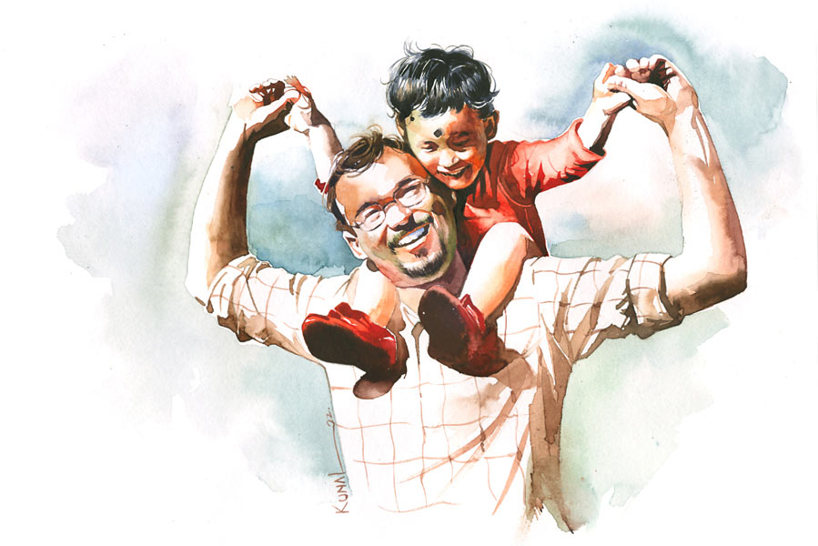

 
 <h1 align=center>অপেক্ষা</h1>
<h2 align=center>শাশ্বতী নন্দী</h2> গাড়ির স্পিডোমিটারের কাঁটা এখন আশি থেকে একশো ছুঁই-ছুঁই। সমুদ্র ছুটছে। মোবাইল স্ক্রিন জুড়ে এখন ওর দেড় বছরের ছোট্ট ছেলে, নীল। ঝাঁকড়া চুল, ফর্সা, পাতলা গোলাপি গোলাপি ঠোঁট। হাত নেড়ে নেড়ে ডেকেই চলেছে, “বাবা বাবা, আয় আয়। বেই বেই। পালাই পালাই...” ছিটকে আসা ওই আধফোটা বুলিই সমুদ্রকে ছুটিয়ে নিয়ে চলেছে।

সমুদ্র স্টিয়ারিং ঘোরাতে ঘোরাতে নিজের মনে হাসছে। ছেলে বলে কী! একেবারে পালাতে হবে? চল তা হলে, পালাই। তোকে নিয়ে তো আমি সাত সমুদ্র তেরো নদী পেরোতেও রাজি রে!

কথাগুলো ভিতরে ঘূর্ণি তুলল বটে, কিন্তু তার পরেই গলার কাছে এক ডেলা কষ্ট। কত দিন দেখা হয়নি ছেলেটার সঙ্গে। না, হয়েছে। তবে মোবাইল স্ক্রিনের ও পার থেকে, ভিডিয়ো কলে। কিন্তু আজ কাছ থেকে দেখবে, ছুঁয়ে ছুঁয়ে দেখবে। 

এই মুহূর্তে তাই দুঃখ-কষ্টকে সমুদ্র কাছে ঘেঁষতে দেবে না, একদম না। সামনের ক’টা মুহূর্ত শুধু খুশির, আনন্দের আর অনেক অপেক্ষার।

হঠাৎ বেশ হাসি পেল। ছেলের সঙ্গে যে মনে মনে কথা হয় তার অনর্গল, সেটা কি কেউ জানে? মনে মনেই তো সে প্রতি রাতে গল্প বলে ঘুম পাড়ায় নীলকে। নইলে যে ও ছটফট করবে, ঘুমই আসবে না। ওর দৃঢ় বিশ্বাস বাতাসের তরঙ্গে ভাসতে ভাসতে গল্পগুলোও ঠিক পৌঁছে যায় কচি ছেলেটার কাছে। মাত্র ছ’মাসে ওর অভ্যেস কি আর পাল্টে যাবে! 

হ্যাঁ, ছ’মাসই তো। পাপড়ি নীলকে নিয়ে চলে গেছে তার বাপের বাড়ি। আটকেছিল সমুদ্র। বুঝিয়েছিল অনেক বার, বলেছিল, “একটা সমঝোতায় আসা যায় না? তুমি কিছু ছাড়ো, আমি কিছু ছাড়ি।”

পাপড়ি ভ্রু কুঁচকে প্রথমেই দাবি করল, “তোমাকে এ বাড়ি ছাড়তে হবে, রাজি?”

সমুদ্র একসমুদ্র ভাবনার মধ্যে থই খোঁজে। বাড়ি ছাড়বে? বাবা ক্যানসার পেশেন্ট, রেডিয়েশন, কেমোর মধ্যে দিন গুজরান। প্রতিদিন একটু একটু করে সন্ধ্যা নামছে তাঁর জীবনে। 

কিন্তু পাপড়ি বেপরোয়া। শর্ত মানো, নইলে সম্পর্ক ছাড়ো। ওর সোজাসাপটা হিসেব, যে মানুষের এক্সপায়ারি ডেট শিয়রে এসে দাঁড়িয়েছে, তার চিকিৎসায় কাঁড়ি কাঁড়ি টাকা খরচ কেন বাপু? সমুদ্র সেনের কতই বা রোজগার? সদ্য তো ডাক্তারি প্র্যাকটিস শুরু হয়েছে, জমতে সময় লাগবে।    

কিন্তু সত্তর-পেরোনো অসুস্থ মানুষটাকে ফেলে ঘর খালি করে বেরিয়ে আসার কথা যে ভাবতেই পারে না সমুদ্র। বাবা এখন অবোধ শিশু। ছেলের হাতের মুঠির মধ্যে যেন জীবনের শেষ আশ্রয় খুঁজে বেড়ান।    

পাপড়ির তেরিয়া জবাব, “তা হলে বাবাকে নিয়েই থাকো।”

এক দিন সত্যি সত্যি সে ছেলে কোলে ঘর ছাড়ল। মায়ের কাঁধে নীল তখন গাল পেতে শুয়ে আছে। শান্ত দৃষ্টি বাবার দিকে। ঘর থেকে বেরিয়ে যাওয়ার মুহূর্তে হঠাৎ ভ্যাঁ করে কান্না। তার পর ছোট ছোট হাত দিয়ে টা টা করল, সঙ্গে আরও কিছু অব্যক্ত কথা। সমুদ্র মুখ ফিরিয়ে নিয়েছিল। চোখটা শিরশির করে উঠেছিল যে।   

বিকেল পড়ে আসছে। আর একটু আগে বেরোতে পারলে ভাল হত। ম্যাপে গল্ফ গ্রিন এখনও এক ঘণ্টা কুড়ি মিনিট।

প্রতি রবিবার মফস্সলের এক হাসপাতালে ফ্রি ভিজ়িটে আসে ডক্টর সমুদ্র সেন। আজ একটা ক্রিটিক্যাল কেস ছিল। ও টি সেরে সদ্য নিজের ঘরে ঢুকেছে যখন, একটা ভিডিয়ো কল এল। অচেনা নম্বর। ক্লান্ত গলায় লাইনটা ধরতেই ভ্যাবাচ্যাকা খেল। পাপড়িদের কমপ্লেক্সের মাঠটা ভেসে উঠছে না! তার পরেই হতবাক। লাল জামা, লাল জুতো পরা একটা বাচ্চা ছেলে একটা লাল বলের পেছনে টলমল পায়ে ছুটছে। ও কে?

আর একটু নজর করতেই বুঝল, আরে, তার নীলসোনা যে! পাশ থেকে চিত্তদার হাসির আওয়াজ, “ডাগদার, চিনতে পারলে?”

চিত্তদা পাপড়িদের বহু বছরের পুরনো কাজের লোক। কোন এক অজানা কারণে প্রথম দিন থেকেই সমুদ্রকে বড় স্নেহ করে। 

নীল এ বার ঘাড় ফিরিয়ে তাকাল, স্ক্রিনে বাবাকে দেখেই গলায় উল্লাস, “বাব্বা!” তার পর আবার বলের গায়ে কষে লাথি। এক মুহূর্তে বুকের ভেতরটা তোলপাড় করে উঠল সমুদ্রর। ও-ও চিৎকার করে ডাকল, “নীল, তুই ফুটবল খেলছিস একা একা? আমি আসব?”

সত্যিই! কবে থেকে সে একটা স্বপ্ন পুষে রেখেছে। সমুদ্র আর নীল মিলে এক বর্ষায় কাদা মাঠে ভূত হয়ে বল খেলবে। 

নীল আবার ছুটল ঘাসের ওপর দিয়ে। আহা, প্রাণটা জুড়িয়ে যাচ্ছে। কিন্তু  কয়েকটা কষ্টের স্মৃতিও যে চোখে ভিড় জমাচ্ছে! সেই লাল জামা, লাল জুতো, লাল বল! আলাদা আলাদা প্যাকেট করে সমুদ্র এক দিন ছেলের জন্য নিয়ে গিয়েছিল পাপড়িদের বাড়ি। দেখামাত্র প্যাকেটগুলো ছুড়ে ফেলে দিল ও ঘরের কোণে। বুক চিনচিন করে উঠেছে তার, কিন্তু প্রতিবাদ করতে পারেনি। বেরিয়ে আসতে আসতে শুনেছিল, “বার বার এ ভাবে আমাদের বিরক্ত করবে না। সব সময় আমার ছেলেকে আমি যার-তার সঙ্গে দেখা করতে দিতে রাজি নই...”

সমুদ্র এই আঘাতে স্তব্ধ হয়ে গিয়েছিল। বলা যেতে পারত অনেক কিছুই, কিন্তু অদ্ভুত এক কষ্টে গলা বুজে গিয়েছিল।     

“বাবা-আ-আ-আ!” আবার এক দীর্ঘ ডাক। ছেলে যেন শাসন করে বলতে চাইছে, ‘অন্যমনস্ক হয়ো না বাবা, আমায় দেখো।’  

ক্লান্ত হাসি এ বার সমুদ্রর চোখে মুখে। সারা ক্ষণই তো তোকে দেখি রে বাবু, অদৃশ্য একটা ওয়াচটাওয়ারে বসে।

হ্যাঁ, এ শুধু কথার কথা নয়। দূরদূরান্ত থেকেও সে নীলকে দেখতে পায়। ও কেমন ঘুমিয়ে ঘুমিয়ে দেয়ালা করে, কখন আবার ভয় পেয়ে বাবাকে খোঁজে! সমুদ্র তখন একটা হাত বাড়াবেই বাড়াবে, ফিসফিস করে সাহস দেবে, ‘আছি, আছি, এই তো আছি, সোনা।’   

“আজ তামাম বাড়ি ফাঁকা, ডাগদার। একটা বিয়ের অনুষ্ঠানে সবাই বেরিয়ে গেছে বাড়ির গাড়ি নিয়ে। তুমি আসবে? আজ তো রোববার।” চিত্তদার কথাগুলো তার ঘোর ভাঙাল।

“সে কী! ফাঁকা বাড়ি! অথচ নীল একা রয়েছে!” সমুদ্র অবাক।

“না, কাল থেকে ওর পটি হয়নি। ঘ্যানঘ্যান করছিল। পাপড়িদিদি বলল, ‘থাকুক তোমার কাছে। বিয়ে বাড়ির ভিড়ভাট্টা, আরও বিরক্ত করবে।’ শোনো ডাগদার, পারলে টুক করে এক বার ছেলেকে দেখে যাও। ওরা ন’টার আগে ফিরবে না...” বলতে বলতে চিত্তদা হাসল। 

‘আচ্ছা চিত্তদা, ওই জামাপ্যান্টগুলো কোথায় পেলে তুমি? তোমার দিদিমণি তো…” আচমকা প্রশ্নটা করে বসে সমুদ্র।  

“আমিও ছেলেপুলের বাপ গো। তোমার কষ্টটা বুঝি।” চিত্তদা দুঃখী মানুষের গলায় বলল, “যাক, এখন ছাড়ছি। এই ক্যামেরাওলা ফোন তো আমার নেই। চেনা এক জনকে তোমার নম্বর দিতেই ভিডিয়ো কল করে দিল। শোনো, আমি নীলবাবুকে নিয়ে মাঠে অপেক্ষা করব। তুমি জলদি চলে এসো। আহা, কত দিন ওকে ছুঁয়ে দেখোনি তুমি!”

 

*****

হাইওয়েতে পড়ল গাড়ি। গতি বাড়ায় সমুদ্র। চিত্তদার ফোন বার বার আসছে, “আর কত দূর ডাগদার?”

“আসছি, এই তো...” সমুদ্র ফিফ্থ গিয়ার টানে।

ভিতরে ভিতরে তিরতিরে উত্তেজনা। শান্ত পুকুরে হঠাৎই যেন কেউ একটা ঢিল ছুড়েছে। আজ কাছ থেকে নীলের নিঃশ্বাসের শব্দ শুনবে। ওর ছোট্ট বুকে কান পাতবে। আচ্ছা, ওখানে কি ‘বাবা’ নামটা লেখা আছে এখনও? না কি ডিলিট বাটন চালিয়ে মুছে দিয়েছে পাপড়ি! 

নীল কি খুব লম্বা হয়েছে? লোকে বলে ও নাকি জুনিয়র সমুদ্র হয়ে উঠছে। তবে মায়ের মতো রোগাটে গড়ন। খায় না নিশ্চয়ই। আসলে শিশুদের গান গাইয়ে গাইয়ে খাওয়াতে হয়। ওর মায়ের সময় কোথায়? প্রাইভেট ব্যাঙ্কে চাকরি নিয়েছে। তুমুল ব্যস্ততা।

আজকাল সমুদ্র ক’টা গান তুলেছে। পাশের ফ্ল্যাটের এক কচি বাবাকে দেখে তো রোজ। অফিস যাওয়ার আগে ছেলেকে গান গাইয়ে গাইয়ে খাওয়াচ্ছে। ও-ও একটা ঘুমপাড়ানিয়া গান শিখে নিয়েছে। যদি কোনও দিন আবার এক রাত কাছে পায় ছেলেকে, শোনাবে।

এহ্‌! আবার লাল সিগনাল। সামনে এক ট্র্যাফিক সার্জেন্ট হাত দেখাচ্ছে কেন? এ আবার কী গেরো! গাড়ি সাইড করাতে বলছে যে!

“স্যর, একটা রিকোয়েস্ট রাখবেন?” সমুদ্র গাড়ি থেকে নেমে কাঁচুমাচু মুখে বলল পুলিশ অফিসারকে, “ছেলের কাছে যাচ্ছি, বড্ড তাড়া। কত ফাইন লাগবে বলুন। দিয়ে দিচ্ছি। কিন্তু অপেক্ষা করাবেন না প্লিজ়।’ 

“ছেলে কি আপনার চলে যাচ্ছে কোথাও? এত তাড়া! কোথাও সিগন্যাল ভাঙছেন, কোথাও আবার স্পিড লিমিট ব্রেক করছেন। আরে মশাই এত বেখেয়ালে...”

সমুদ্রর মুখে চোখে আবার অনুনয়, “বাড়ির সবাইকে লুকিয়ে ছেলের সঙ্গে দেখা করতে হবে। বিশ্বাস করুন মিথ্যে বলছি না। বেশি দেরি হলে ওরা দেখা করতে দেবে না। আমার স্ত্রী ছেলেকে নিয়ে তার বাপের বাড়ি চলে গিয়েছে আলাদা হয়ে...”

সার্জেন্ট অপলক চেয়ে আছে। হঠাৎই তার মুখে ছায়া নামল। পরক্ষণেই যেন খুব কষ্ট করে হাসলেন ভদ্রলোক, “যান আপনি। ফাইন কিছু দিতে হবে না। আমি বলে দেব এমার্জেন্সি ছিল...”

থমকে যায় সমুদ্র, বলে, “বিশ্বাস করছেন না নিশ্চয়ই। আমি কিন্তু মিথ্যে বলছি না স্যর। যা ফাইন লাগে, নিন না।” 

“আরে মশাই, এগোন তো।”

সমুদ্রের তবু দোনামনা মুখ।

“আরে আমিও আপনারই মতো অভাগা মশাই। স্ত্রীর সঙ্গে সেপারেশনের কেস চলছে। ছেলের সঙ্গে দেখা হয় কোর্টের অর্ডারে। তবে গত বার ছেলে এল না। একটা বিদেশি ফোন চেয়েছিল, দিতে পারিনি। ছেলে তাই মেসেজ পাঠিয়েছে, এর পরের বারও ফোন না দিতে পারলে, দেখা হবে না। ছেলের বয়স বারো বছর। এনিওয়ে, বেস্ট অব লাক। সাবধানে ড্রাইভ করে যান।”

বুক চিরে একটা দীর্ঘশ্বাস বেরিয়ে এল সমুদ্রের।

*****

গাড়ি যখন গল্ফ গ্রিনের কাছাকাছি, রাত তখন সাড়ে সাতটা। মোড়ের মাথায় একটা বেলুনওয়ালা দাঁড়িয়ে। নেবে ক’টা? না, দেরি হয়ে যাবে। তবে ফেরার সময়, একটা কেন, একশো বেলুন কিনে ও আজ রাতের আকাশ ঢেকে দেবে।

কিন্তু একেবারে খালি হাতে যাবে ছেলের কাছে? কী নেওয়া যায়? ওই তো বেলুনওলার লাঠিতে একটা ব্যাট-বল ঝুলছে। প্লাস্টিকের, কম দামি। আপাতত, ওটাই নেওয়া যাক।    

আচ্ছা, আজ পাপড়িদের বাড়ির পাশের মাঠে একটা মিনি ক্রিকেট ম্যাচ খেললে কেমন হয়? রাস্তায় তো আলোর ফোয়ারা, অসুবিধে হবে না খেলতে। সমুদ্র বোলিংয়ে আর তার লিটল হিরো ব্যাটিংয়ে। আর চিত্তদা ফিল্ডিংয়ে। দৃশ্যটা চিন্তা করেই তার উত্তেজনা বেড়ে গেল। কিন্তু চিত্তদার ফোন বেজে যাচ্ছে, ধরছে না কেন? একটু আগেও তো কথা হল।

এ কী! পাপড়িদের গাড়িটা দাঁড়িয়ে আছে কেন ওদের গেটের মুখে! গন্তব্যে পৌঁছে সমুদ্র হতবাক। ওরা কি ফিরে এল? ন’টা তো বাজেনি! তা হলে কি নীলের শরীরটা ভাল নেই বলে সাত তাড়াতাড়ি...

ওই তো, পাপড়িদের চারতলার ফ্ল্যাটে আলো জ্বলছে। লোক জনের আভাস দেখা যাচ্ছে। আর দেখা হবে না নীলের সঙ্গে? এতখানি এল, খালি হাতে ফিরে যাবে?

সমুদ্র ধীর পায়ে গাড়ি থেকে নেমে আসে। ফ্যালফ্যাল করে ঘাড় উঁচু করে তাকিয়ে থাকে চার তলার জানলায়। আচ্ছা, এক বার যদি এখান থেকে জোরে ডাকে নী-ঈ-ঈ-ঈ-ল বলে, ছেলেটা শুনবে? উঁকি দেবে জানলায়? ওকে যে ব্যাট-বলটাও দেওয়া হল না। কী করবে এখন ওগুলো নিয়ে?

হঠাৎ চোখ যায়, মাঠের বাইরে ফুটপাতের উপর এক পরিবার ছাউনি বেঁধে সংসার পেতেছে। সমুদ্র গুটিগুটি এগিয়ে যায় সে দিকে। কাছে যেতেই দেখে, এক হাড্ডিসার লুঙ্গি-পরা পুরুষের গায়ে লেপ্টে আছে এক শিশু। খিলখিল হাসছে। হাসছে আর খেলছে। মাঝে মাঝে হামি দিচ্ছে লোকটার তোবড়ানো, বিজবিজে দাড়িওয়ালা গালে। ও কি শিশুটার বাবা? নিশ্চয়ই তাই।

দৃশ্যটায় কী যে ছিল, অস্বস্তি শুরু হল ভেতরে। বুকের মধ্যে কিছু যেন পুড়ছে। তাড়াতাড়ি ও খেলনা ব্যাট-বল দুটো বাচ্চাটার সামনে নামিয়ে ফিরে আসে গাড়ির দিকে। নিজেকে এত কাঙাল আগে কখনও মনে হয়নি। বুঝতে পারে, চোখের এ পারে ফোঁটা ফোঁটা বৃষ্টি জমছে।

গাড়িতে ওঠার আগে কয়েক মুহূর্ত থমকে দাঁড়ায়। এক বার কি পেছন ফিরে তাকাবে? না, থাক। শুধু শুধু মায়া বাড়ানো। সমুদ্র গাড়ির দরজায় হাত রাখে। হঠাৎ একটা চিকন ডাক, “বাবা-আ-আ।”

ঠিক শুনল কি? ওই তো আবার ডাকটা ভেসে ভেসে আসছে নীলেরই গলায়, “বাবা, বাবা। আয় আয়। বেই বেই, যাই যাই...”  

সমুদ্রের সারা শরীরে এ বার তুমুল কাঁপন। খুব ধীরে ধীরে ঘাড় ফেরাচ্ছে সে। দেখে পাপড়িদের জানলার গ্রিলে দাঁড়িয়ে ওর নীল। ছোট ছোট হাত বাড়িয়ে প্রাণপণে ডাকছে বাবাকে। পিছনে চিত্তদা।

না, দামাল কান্নাটাকে আর বুঝি রোখা গেল না। সমুদ্র কেঁদে ওঠে। উথালপাথাল কান্নায় এখন ভেসে যাচ্ছে ওর চোখ, মুখ, বুক। কাঁদতে কাঁদতেই দু’হাত বাড়িয়ে দাঁড়িয়ে রইল সমুদ্র, অস্ফুটে বলতে লাগল, “আয় নীল, আয়...”

এ বার অপেক্ষা। হয়তো এক অনন্ত অপেক্ষা... নীল কখন জোয়ার ভাটা পেরিয়ে ঝাঁপিয়ে পড়বে সমুদ্রের বুকে।