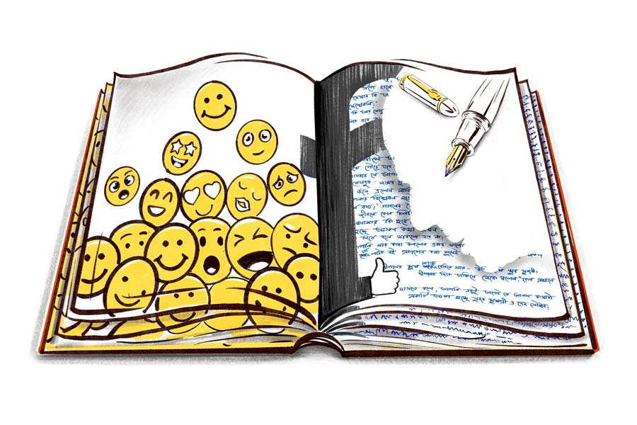

 
 <h1 align=center>অপ্রকাশিত আখ্যান</h1>
<h2 align=center>অঞ্জন সেনগুপ্ত</h2> দীপেনবাবু বেশ কিছু জুতোর ভিড়ে নিজেরটা খুলে রেখে সুইং ডোরের পাল্লা ঠেলে ভিতরে ঢোকেন। আগেও বহু বার এসেছেন, তখন সুইং ডোর ছিল না। হাল আমলে লাগানো। ভিতরে মাথা গলিয়ে দেখে মালিকের চেয়ার দখল করে মালিকের ছেলে বসে আছেন। দীপেনবাবুর ভুরু কুঁচকে যায়। তা হলে যা শুনেছিলেন, তা একেবারে অপপ্রচার নয়। এ ভাবে নিঃশব্দে ব্যবসার চেয়ার বদলে গেল! অথচ মালিক তো এমন কিছু অথর্ব নন যে, এখনই তাঁকে সরে যেতে হবে! না কি ভেতরে ভেতরে তিনি সত্যিই অসুস্থ ছিলেন! এই তো সে দিন একই ট্রেনে বেড়াতে গিয়ে শিবেন্দ্রবাবুর সঙ্গে দেখা হল। দলবল নিয়ে কোথায় যেন পাড়ি দিচ্ছেন! নিজেই বললেন এক দিন দফতরে আসার জন্য। ব্যবহার ঠিক আগের মতোই মসৃণ। দীপেনবাবুও ঘাড় কাত করে হেসেছিলেন। সেই সূত্রেই আজ আসা।

বসার জন্য চেয়ারটা টানতেই শিবেন্দ্রবাবুর ছেলে গগনেন্দ্র, অর্থাৎ গগন মাথা তোলেন। দীপেনবাবু বলে, “কী ব্যাপার, শিবেনদা আসেননি?”

“না, বাবা এখন বাড়িতেই থাকেন। কিন্তু আপনাকে তো ঠিক...” গগন বলেন।

“সে কী! এর আগেই তো এক দিন এসেছিলাম আমার প্রাপ্য বইগুলো নিতে। আপনিই তো গোডাউন থেকে আনিয়েও দিলেন। এ বার চিনতে পারলেন?” দীপেনবাবু কাঁধ থেকে ঝোলাটা নামিয়ে টেবিলে রাখেন।

এ বার হয়তো মনে পড়েছে। গগন তাঁর পরিষ্কার করে কামানো গালে কষ্ট করে সরু হাসির রেখা ছড়িয়ে বললেন, “বলুন।”

দীপেনবাবু এ বার তাঁর ঝোলা থেকে একটা মোটা প্যাকেট বের করে বলেন, “আমার আসা নিয়ে আগেই শিবেনদার সঙ্গে কথা হয়েছে। কিন্তু উনি যে আজ থাকবেন না, তা জানা ছিল না। তা হলে আমি কি একটু অপেক্ষা করব?”

“কেন?” গগন জানতে চাইলেন।

“তা হলে ওঁর সঙ্গে দেখাও হয়ে যাবে। তখনই না-হয় কাজের কথাটাও বলা যাবে।”

“সে আপনি বসতেই পারেন। কিন্তু বাবার সঙ্গে দেখা হবে না। উনি আসেন না। কাজেই অহেতুক...”

“তা হলে বরং আমি আপনাদের বাড়িতেই যাই, বাড়ির অ্যাড্রেসটা যদি...” দীপেনবাবু জানতে চান।

সামান্য রুক্ষ শোনায় গগনের গলা, “বাড়ি গিয়ে লাভ হবে না। উনি ইদানীং কারও সঙ্গেই দেখা করেন না। আমাকে প্রয়োজনটা বলতে পারেন।”

দীপেনবাবুর উৎসাহটা দপ করে নিভে যায়। কী করবেন বুঝতে না পেরে ইতস্তত করতেই গগন আবার বলেন, “ওই প্যাকেটে কী আছে?”

দীপেনবাবু সস্নেহে ব্রাউন রঙের প্যাকেটটির গায়ে মৃদু হাত বুলিয়ে বলেন, “প্রায় তিন বছরের কঠোর পরিশ্রমের ফসল। বহু কাঠখড় পুড়িয়ে একে রূপ দিতে পেরেছি। সবই রেফারেন্সে পাবেন।”

“ঠিক বুঝলাম না, এতে আছেটা কী?” গগনের গলায় সামান্য বিরক্তি। তিনি ভুরু কুঁচকে প্যাকেটটির দিকে তাকিয়ে আছেন।

গগনের বিরক্তি গায়ে না মেখে দীপেনবাবু বলেন, “আসলে এটি একটি উপন্যাস। বহু চরিত্রের সমাহার! কাকে ছেড়ে কাকে মনে রাখবেন, ঠিক করতে পারবেন না। অন্তত এর ভূমিকাটা পড়লেই আন্দাজ পাবেন, এক বার পড়ুন না।”

বহু কষ্টে গগন দীপেনের পাণ্ডুলিপির দিকে তাকিয়ে বললেন, “চা খাবেন?”

“তা খেতে পারি। তবে একেবারে চিনি ছাড়া লিকার,” দীপেনবাবু আশান্বিত হয়ে নড়েচড়ে বসেন।

গগন তাঁর রিভলভিং চেয়ার ঘুরিয়ে সটান উঠে দাঁড়িয়ে ভিতরে চলে যান। কিছু ক্ষণের মধ্যেই এক জন এসে টেবিলে এক কাপ গরম জল এবং প্লেটে একটি টি-ব্যাগ রেখে যায়। চা-টা সবে শেষ করেছেন, এমন সময় গগন ফিরে এলেন। রিভলভিং চেয়ারে শরীর ছেড়ে দিয়ে বললেন, “আমি বাবার সঙ্গে কথা বললাম। এই মুহূর্তে আমরা গল্প-উপন্যাস করব না। এখন আমরা স্কুলের পাঠ্যবইয়ের দিকে মন দিয়েছি। আপাতত ওরাই আমাদের ভরসা। দু’বছর তো একেবারে কিছুই করতে পারিনি। তা ছাড়া আপনার ওই ভূতের বইটা একেবারেই চলেনি। সবাইকে দিয়ে দিতে হয়েছে।”

দীপেনবাবু এ বার গগনের কথার মাঝেই বলে ফেলেন, “চলেনি মানে!”

“না, একেবারেই কাটতি হয়নি। সব কপি প্রায় দিয়ে দিতে হয়েছে।”

“দিয়ে দিতে হয়েছে মানে! রাস্তায় দাঁড়িয়ে বিলিয়েছেন না কি!” দীপেনবাবু বিস্মিত হয়ে জানতে চান।

“না, তা ঠিক নয়। আসলে আমাদের তো স্কুলে স্কুলে পাঠ্য বই পুশ করতে হয়। কাজেই প্রতি বিষয়ের শিক্ষকদের একটি-দু’টি করে গল্পের বই উপহার না দিলে তাঁরাই বা আমাদের বই মনোনীত করবেন কেন! সে সময় আপনার বইটি বেশ কাজে দিয়েছে। বুঝতেই পারছেন সবটাই হচ্ছে গিভ অ্যান্ড টেক। কিছু করার নেই, যুগটাই এমন হয়ে গেছে!” গগন একটা গভীর নিঃশ্বাস ফেলেন।

“শুনে খুব ভাল লাগল যে, আমার বইটি একটি মহৎ কাজে লেগেছে! এমনিতেই আপনাদের কিছু না কিছু উপহার তো শিক্ষকদের দিতেই হত। সেখানে আমার বইটি দিয়ে বেশ ভাল কাজই করেছেন। এটা কিন্তু আপনার এক রকম বিক্রিই হল, কী বলেন! তা হলে কি এ বার আপনারা কোনও গল্প-উপন্যাস ছাপবেন না! নাকি শুধু আমারটাই...” দীপেনবাবু স্থির চোখে গগনের দিকে তাকিয়ে থাকেন।

“না, তা কেন! বইবাজারে তো আমাদের কয়েক হাজার বই রয়েছে। টুকটুক করে দিব্যি চলছে। আচ্ছা, আপনি আমাদের ফেসবুক দেখেছেন?” গগন ঠোঁট টিপে হাসেন।

“হ্যাঁ, না দেখার কী আছে। আমি তো লাইকও করেছি। কেন আপনি আমার নাম দেখেননি?”

“আমার কি আর ফেসবুক দেখার অত সময় আছে! তা আপনার ফ্রেন্ড বা ফলোয়ার কত?” একটা হাই চেপে বলেন গগন।

“কত আর হবে, বড় জোর হাজার দেড়েক,” শ’তিনেক বাড়িয়েই বললেন দীপেনবাবু।

“মাত্র! এ তো যে কোনও লোকেরই থাকে। এই ফলোয়ার সংখ্যা দেখেই বোঝা যায় আপনার পরিচিতি কতটা। আপনি যে একেবারেই পপুলার নন, তা পরিষ্কার বোঝা যায়। আর এই জায়গাটাতেই আপনাকে আরও জোর দিতে হবে দীপেনবাবু। কমপক্ষে এক লাখে পৌঁছে তার পর বরং আসুন।”

“কিন্তু গত বার যে আপনারা এক মহিলাকে নিয়ে মেতেছিলেন, তাঁর নাম তো বাপের জন্মেও শুনিনি! উনি কি হঠাৎ ধূমকেতুর মতো সাহিত্য জগতে উড়ে এলেন!” দীপেনের গলায় শ্লেষ ঝরে পড়ে।

“আপনি জানেন ওঁর ফ্যান-ফলোয়ার কত?” গগনের ঠোঁটে একটা প্রচ্ছন্ন হাসি লেগে থাকে।

“যার নাম জীবনে কোনও লিটল ম্যাগে পর্যন্ত দেখিনি, তার ফলোয়ার্স জেনে আমার কী হবে!” সামান্য অবাক হন দীপেনবাবু।

“এটাই হচ্ছে আসল কথা। এখন যা দিনকাল পড়েছে, তাতে শুধু নিজেরটা নিয়ে বসে থাকলে হবে না! পাশাপাশি অন্যেরটাও জানতে হবে। আর আপনি যার কথা বললেন, তাঁর ফলোয়ারস বর্তমানে দেড় লাখ! আর শুধু তাই নয়, ওঁর বই প্রকাশের কথা শুনেই পাঁচ হাজার বইয়ের প্রি-বুকিং হয়েছিল! ক্যান ইউ ইমাজিন!”

গগন থামতেই দীপেনবাবু সবিস্ময়ে জিজ্ঞেস করেন, “আচ্ছা, উনি কি লেখার জন্য বিশেষ সম্মান বা পুরস্কার পেয়েছেন?”

“তা আমার জানা নেই। তবে আজ পাননি, কিন্তু পেতে কত ক্ষণ?” গগন মুচকি হাসেন।

“পেতেই পারেন। আসলে আমি তো বহু নামী সাহিত্যিকের কথা জানি। এর আগে কখনও শুনিনি যে, তাঁদের কোনও বই প্রকাশের আগেই হাজার পাঁচেক বায়না হয়ে যায়। এঁর ক্ষেত্রে হল কী করে, এই রহস্যটাই মাথায় ঢুকছে না!” বিস্ময়ে দীপেনের চোয়াল প্রায় ঝুলে পড়ে।

হাত নেড়ে মাছি তাড়ানোর ভঙ্গি করেন গগন, “আরে না না, কোনও রহস্য নেই। আসলে উনি উপন্যাসটি আমাদের দেওয়ার আগেই তার কিছু কিছু অংশ ফেসবুকে দিয়ে বইটিকে জনপ্রিয় করে তুলেছিলেন। ফ্যানরা চাইছিল সম্পূর্ণ বইটি পড়তে। আসলে ফেসবুক ছাড়া আমাদের জীবন অচল। সাহিত্য বলুন সিনেমা বলুন কি গানবাজনা... সবই তো ওর উপরেই দাঁড়িয়ে আছে মশাই! ফেসবুক-ইনস্টায় লাখ পাঁচ-সাত ভক্ত না থাকলে সে আবার কেমন পপুলার!” গগন এমন একটা মোক্ষম কথা বলে দুলে দুলে হাসতে লাগলেন।

বিস্ময়ের শেষ সীমায় পৌঁছে ধীরে ধীরে দীপেনবাবু বলেন, “ঠিক বুঝলাম না। পৃথিবীর সমস্ত মননশীল পাঠকের একমাত্র ঠিকানা শুধু সোশ্যাল মিডিয়া! তারাই ঠিক করে দেবে কোনটা ভাল কোনটা খারাপ! ফেসবুকের বাইরে আর পাঠক নেই তা হলে? আমি এমন অনেকের কথা জানি, গল্পের বই পড়ার সময় কমে যাবে এই ভয়ে তাঁরা সোশ্যাল মিডিয়ার ছায়াও মাড়াননি, অথচ রোজগারের সিংহভাগ বই কেনার পিছনে খরচ করেন, বড় বড় সাহিত্যপত্রিকায় তাঁদের সমালোচনা ছাপা হয়— সে সব কিছু নয়?” 

এ বার গগনবাবু একটু টেনে টেনে হেসে বললেন, “আমি বুঝতে পারছি আপনি একেবারেই এখনকার বাজারের সঙ্গে পরিচিত নন।”

“বাজার! আপনি কোন বাজারের কথা বলতে চাইছেন?” দীপেনবাবু জানতে চাইলেন।

“আমি বইবাজারের কথাই বলছি। জানেন, এখন বইবাজার কী ভাবে চলে? আমাদের দোকানে কাচের দরজা ঠেলে বই কেনাবেচা হয় শুধু। লেখকরা সবাই আসেন আমাদের এই অফিসে। অনামী অপরিচিত লেখকরা নামী লেখককে মুরুব্বি ধরে তবে এখানে আসার সাহস পায়। এখন একটাই হিসাব, ফেলো কড়ি মাখো তেল— প্রকাশক কি লেখকের পর? কী বুঝলেন?”

“ব্যাপারটা যদি একটু খোলসা করেন, তা হলে বুঝতে সুবিধে হয়...” দীপেনবাবু আন্দাজ করতে পারছেন সবই, তবু গগনের মুখ থেকেই শুনতে ইচ্ছে হল তাঁর।

“একে আপনি মাছের তেলে মাছ ভাজাও বলতে পারেন। যদি নতুন লেখক হন বা জীবনের শেষে এসে লেখক হওয়ার ইচ্ছে হয়ে থাকে, তা হলে আমরা আগেই বলে দিই যে, আপনাকে আপনারই শ’দুয়েক বই কিনে নিতে হবে। আমরা অবশ্যই আপনাকে তিরিশ শতাংশ ছাড় দেব। এ বার সে সব বই আপনি বন্ধুদের বা পরিচিতদের বিক্রি করে টাকা তুলেও নিতে পারবেন। মাঝখান থেকে আপনার একটা বইও প্রকাশ পেয়ে গেল, আবার আর্থিক ক্ষতিও হল না! এখন এই ফর্মুলাটাই বাজারে চলছে। বাকি বই আমরা বেচব। তারও নানা স্কিম আছে। ফার্স্ট এডিশনের বইতেই লেখা থাকবে ‘বেস্টসেলার। তিন হাজার কপি নিঃশেষিত’। তার পর থেকে থেকে ফেসবুকে লেখা যাবে ‘সেকেন্ড এডিশন শেষ, থার্ড এডিশন শেষ’। ওতেই কত পাঠক নালে-ঝোলে হয়ে যাবে, দেখবেন! পার এডিশন পাঁচটা বই ছাপা হয় না পঞ্চাশটা, কোনও গা... স্যরি, কেউ সে সব জানে না, জানতে চায়ও না! আপনি যে ভাবে প্রচার চাইবেন, পাবেন। সব আলাদা আলাদা প্যাকেজের ব্যাপার...”

দীপেনবাবু মৃদু হেসে বলেন, “এ সব তো নতুন লেখকদের ক্ষেত্রে প্রযোজ্য। কিন্তু যাদের কিছু বই বাজারে চলছে, যেমন ধরুন আমার বেলায়ও কি একই নিয়ম?”

তাচ্ছিল্যের গলায় গগন বলেন, “আমি তো আগেই বলেছি, আপনার ভূত না পেরেছে কাউকে ভয় দেখাতে, না পেরেছে পাঠকের পকেট কাটতে। মাঝখান থেকে আমাদের গচ্চা! তবে চাইলে এই পাণ্ডুলিপিটা রেখে যেতে পারেন। হওয়ার চান্স খুব কম, আগেই বলে রাখছি...” গগন একটা ফোনে ব্যস্ত হয়ে পড়ে।

দীপেনবাবু উঠে দাঁড়ায়। পাণ্ডুলিপি ব্যাগে ঢুকিয়ে দু’পা এগোতেই কানে আসে গগন ফোনে বলছেন, “আরে ম্যাডাম, আপনার দ্বিতীয় উপন্যাসটার পাণ্ডুলিপি তো এখনও পাঠালেন না! এ বার কিন্তু পাঁচে চলবে না। ফ্যানদের বলুন যেন কমপক্ষে সাত হাজারের প্রি-বুকিং হয়। আমরা চাই, আপনি এ বারও বেস্টসেলার হবেন। অ্যাঁ? কী, দক্ষিণা?... না না, সে আপনার হাতের ময়লা... আপনাকে বাজারে খাওয়ানোর দায়িত্ব আমাদের... ”

সুইং ডোরটি একটু শব্দ করেই যেন বন্ধ হল। দীপেনবাবু অনেকগুলো সিঁড়ি ভেঙে রাস্তায় এসে দাঁড়ালেন। মনটা বেশ ফুরফুরে। তাঁর উপন্যাস প্রকাশক ফিরিয়ে দেওয়াতেও মনে কোনও দুঃখ নেই! এত দিন ধরে মাস্টারমশাইদের ছেলেমেয়েরা তাঁর ভূতের বইটা তো পড়েছে! কে জানে, হয়তো পড়ে এমনই ভয় পেয়েছে যে, শেষে ভূতেরাও আজকাল কলার তুলে ঘুরছে!

এতেই দীপেনবাবুর সুখ।