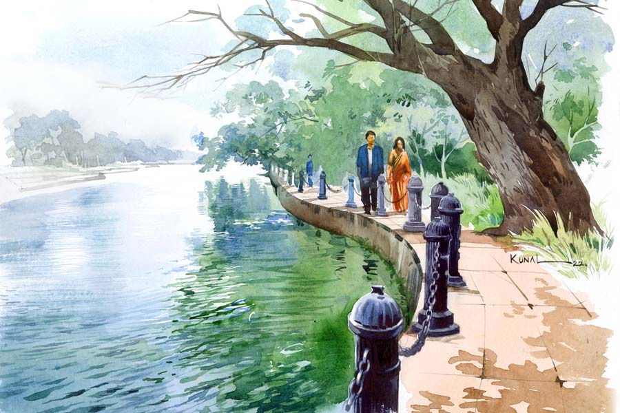

 
 <h1 align=center>অভি-নিভা</h1>
<h2 align=center>প্রসেনজিৎ সিংহ</h2> তুই জানতিস কাঞ্চনফুলের গন্ধ আছে?”

“নিশ্চয়ই! তবে শুধুমাত্র রানি কালারের এই কাঞ্চনেই একটা মৃদু গন্ধ পাওয়া যায়। সাদা কাঞ্চনে কোনও গন্ধ নেই। অথচ বেশির ভাগ সাদা ফুলেই মিষ্টি গন্ধ থাকে। বেল, জুঁই, গন্ধরাজ, গুলঞ্চ, শিউলি।”

“কাঞ্চন সবার চেয়ে আলাদা। তাই না! কারণ সাদা কাঞ্চনের গন্ধ নেই। কিন্তু রঙিনের গন্ধ আছে।”

“নিজেই পরখ করে দেখ না।”

ফুলে ফুলে ঢেকে থাকা গাছটার একটা ডাল নুইয়ে ধরেন অভি। নিভা সেই ফুলের গন্ধ নেওয়ার আগে এক বার অভির দিকে তাকান। মুখে কিছু বলেন না। তার প্রয়োজনও নেই। তবে একটা দুটো ফুলে নাক ডুবিয়ে বুঝতে পারেন গন্ধ একটা আছে।

“হালকা গন্ধ। কিন্তু খুব চেনা।”

“পুরুষমানুষের বুকে এই গন্ধটা পাওয়া স্বাভাবিক।”

“অভি, এই বয়সেও ফক্কুড়ি?”

“সিরিয়াসলি! একটুও ঠাট্টা করছি না। এবং তোর সঙ্গে আমি একমত, এই গন্ধটা খুব চেনা। আসলে একটা পারফিউমের সঙ্গে মেলে। সেটা কোনও পুরুষের গায়েই পাওয়া সম্ভব। গন্ধটা একটা মেল পারফিউমের খুব কাছাকাছি।”

“তাই না!”

“হ্যাঁ। অন্তত আমার সে রকমই মনে হয়। খুব পপুলার একটা ইন্টারন্যাশনাল ব্র্যান্ড আছে, নামটা ঠিক মনে পড়ছে না। বিশ্বের সর্বত্র পাওয়া যায়। এই কাঞ্চনের গন্ধটা তার খুব কাছাকাছি।”

শীত এখনও পড়েনি। তবে বাতাসে হালকা শিরশিরে ছোঁয়া। করোনাকালে আত্মগোপন করে থাকা কলকাতা শহরটা যেন একটু একটু করে আড়মোড়া ভাঙতে শুরু করেছে। তবে রবীন্দ্র সরোবর নামে শহরের দক্ষিণে যে বিশাল জলাশয় রয়েছে, সেখানে প্রাতর্ভ্রমণকারীদের প্রভাতী ব্যস্ততা, কোলাহল এখন স্তিমিত। কারণ খানিকটা বেলা হয়ে গিয়েছে। অসমাপ্ত বাক্যের শেষে তিনবিন্দু যতিচিহ্নের মতো একটা উপসংহারহীন অলস মেদুরতা চার পাশে। যেন অনেক সম্ভাবনা নিয়ে বসে আছে।

আমাদের এই গ‌ল্পের দুই কুশীলব অভি আর নিভা আঠারো বছর পর দেখা করতে এসেছেন একে অন্যের সঙ্গে। অভি সদ্য পঞ্চাশে পা দিয়েছেন। নিভাও অর্ধশতাব্দীর চৌকাঠের দিকে গুটিগুটি এগোচ্ছেন। দূরত্ব মাস ছয়েকের।

দু’জনেই পরিণত, অভিজ্ঞও। তবু বয়সের অভিঘাত এখনও দু’জনকে তেমন কাবু করতে পারেনি। তার একটা কারণ, দু’জনেই কর্মজীবনে বিপুল ব্যস্ততায় নিজেদের অতিসচল রাখতে বাধ্য হয়েছেন। পরিবারের দাবি, চার পাশের লোকজন এবং পরিচিতদের দাবি, সর্বোপরি বেঁচে থাকার অত্যন্ত কেজো চাহিদাগুলো মিটিয়ে অতি অল্প সময়ই আর অবশিষ্ট থাকে তাদের। যাকে লোকে বলে অবসর।

তা হলে হঠাৎ কেন ফোন করলেন নিভা? কেনই বা অভি সাড়া দিলেন তাতে? সেটা একটা প্রশ্ন বটে!

“এই গাছটা চিনিস? ওই যে বড় বড় পাতা? লম্বাটে ফুল হয়। বাইরের পাপড়িটা খসখসে খয়েরি। আর ভেতরে সাদা পাপড়ি। এর শক্ত শক্ত ফল হয়। আর তার ভেতরে বীজগুলো আরশোলার ডানার মতো। ছেড়ে দিলে ঘূর্ণিপাক খেতে খেতে নামে। নামটা রবি ঠাকুরের বইয়ে পড়েছিস ছোটবেলায়। কিন্তু এই গাছটাকে অনেকেই নামে চেনে না। আমাদের স্কুলের কাছে এই গাছটা ছিল বলে আমি চিনি। ওর নাম মুচকুন্দ। কেউ কেউ বলেন কনকচাঁপা।”

“নামটা শুনেছি মনে হচ্ছে। তুই তো বেশ গাছ চিনিস।”

“ওই দু’-চারটে। গাছ চেনা সহজ আনলাইক মানুষ। লেকের অনেক গাছে নাম লেখা রয়েছে। তবে সেগুলো ছাড়াও গাছ আছে যার নাম আমি জানি। থাক ও-সব কথা। চল ওখানটায় বসি। একটু চা পেলে হত।”

“চা-ওয়ালা এই সময় পাবি না। লোকজন নেই, ছুটির দিনও নয় আজ। তার উপর মহামারির ছায়ায় বিষণ্ণ হয়ে আছে শহর।”

“নিভা, তুই কি আগেও এতটা ফিলসফিক ছিলি?”

কোনও উত্তর দেন না নিভা। আলগা হাসিতে শুধু ফিকে করে দেন প্রশ্নটাকে। পরিণত বয়স বুঝি মানুষের ঝুলিতে চুপ করে থাকার নানা কৌশল ভরে দিয়ে যায়।

বিকেলের দিকে অভির একটা নিজস্ব কাজ আছে। অফিসে গেলে সেটা হত না। তাই একটা ক্যাজ়ুয়াল লিভ নিয়েছিলেন। আর নিভা দিন পনেরো হল ছুটি নিয়ে কলকাতায় এসেছেন। নিজের শহরে এখন ওকে ছুটি নিয়ে আসতে হয়। বহু দিন হল তিনি পুণের বাসিন্দা। ছেলেমেয়ে স্বামী নিয়ে ভরা সংসার। সবটুকু অবশ্য জানেন না অভি। কেন জানেন না, সে বলতে গেলে অনেক কথাই বলতে হয়। এই যে ওরা দু’জন আজ দেখা করলেন, এটা ওদের তৃতীয় দেখা। অথচ পরিচয়টা বহু দিনের। নয় নয় করে বিশ বছরের।

অভি তখন সদ্য বিয়ে করেছেন। দক্ষিণ কলকাতায় একটা ছোট্ট ফ্ল্যাটে অস্থায়ী সংসার ওদের। এক দিন বন্ধু সিদ্ধার্থ ফোন করে বলল, “আজ পার্টি হবে। তুই মুনিয়াকে নিয়ে চলে আয়। জায়গাটা তোদের বাড়ির কাছে। আমার এক বান্ধবীর বাড়ি।”

“এ রকম যাওয়া যায় না কি! আমি তো ওকে চিনি না।”

“চিনে যাবি।”

“কিন্তু...”

“কোনও কিন্তু নয়। ও খুব ভাল মেয়ে। তোরা দু’জন চলে আয়। আমি, আর কৈতরী যাচ্ছি। জুরান-পিয়ালিও আসছে।”

সিদ্ধার্থর ফোনের পরই এসেছিল নিভার ফোন। সনির্বন্ধ অনুরোধ জানিয়ে। সে দিন সন্ধেবেলা বৌকে নিয়ে নিভার ফ্ল্যাটে হাজির হয়েছিলেন অভি। প্রথমটায় মুনিয়ার একটু কিন্তু-কিন্তু ছিল। হুট করে অচেনা এক জন মহিলার ফ্ল্যাটে... কোনও দিন দেখেনি, কথা বলেনি। কিন্তু নিভার ব্যবহারে একটা স্বাভাবিক উষ্ণতা ছিল। বেশি ক্ষণ লাগেনি ওদের সহজ হতে। অল্প বয়সে নতুন বন্ধুবান্ধবের সঙ্গে মেলামেশা অনেক সহজ ছিল। আড় ভাঙতে দেরি হয়নি। আজ হলে কি অত সহজে মুনিয়া রাজি হত নিভার বাড়ি যেতে!

আলাপ-পরিচয়ের প্রাথমিক পর্বের পর পানাহার, গল্পগুজব অনেক রাত পর্যন্ত চলেছিল। নিভার সম্বন্ধে যেটুকু জেনেছিল, তা সংক্ষিপ্তই। সেটা অবশ্য বাধা হয়ে দাঁড়ায়নি সে দিনের আন্তরিক মেলামেশায়।

জেনেছিল ও একটা বিপিও-তে চাকরি করে। কোনও এক বিদেশি কোম্পানির ব্যাক-অফিস কলকাতায় শুনে বেশ অদ্ভুত লেগেছিল সে সময়। ওরা ওই সংস্থার কাস্টমারদের সুযোগসুবিধা সংক্রান্ত বিষয়গুলো নিয়ে তাদের সঙ্গে কথা বলে, অভিযোগ শোনে। এ রকমই একটা বিশাল টিম ও লিড করে। বিদেশে ট্রেনিংও হয়েছে ওর।

আড্ডাটা সে দিন জমে গিয়েছিল। অভি গান গেয়েছিলেন। আর গেয়েছিলেন নিভা। তার পর একটা ডুয়েটও। কোনও রকম প্রস্তুতি ছাড়াই। সোফায় কার্পেটে ছড়িয়ে ছিটিয়ে বসেছিল ওরা সব। কার্পেটের উপর পাশাপাশি বসে গাইতে গাইতে নিভা একটা হাত রেখেছিল অভির হাতে। সে কি শুধুই তাল দেওয়ার ছলে! না কি গানের রসায়ন কোথাও জারিত করেছিল দু’জনকে!

প্রথম পরিচয়ে এমন স্পর্শ প্রত্যাশিত ছিল না। তবে ভাল লেগেছিল অভির। আর মুনিয়ার? ভালমন্দ যা-ই লেগে থাক সে দিন কিছু বলেনি। তবে পরবর্তী দু’দশকে বিষয়টা ঘুরেফিরে অনেক বার এসেছে ওদের দাম্পত্যের মাঝখানে।

অভির নুনমরিচে ঢাকা মাথায় অভিজ্ঞতার কত পরত পড়ল! তবু সেই স্পর্শটা ওর আর মুনিয়ার পোড়-খাওয়া যৌথজীবনে ঘুমন্ত কাঁটা হয়ে জেগে রয়েছে। বিশেষত তাদের একঘেয়ে দাম্পত্যে পারস্পরিক বিশ্বাসের প্রশ্নে যখনই অভিকে আক্রমণ করার প্রয়োজন হয়েছে, মুনিয়া বেছে নিয়েছে সেই রাতের কথা। অভি বোঝে, সে দিন ব্যাপারটা নিভার ফ্ল্যাটে উপস্থিত অন্যদেরও নজর এড়ায়নি। পরে বন্ধুদের আড্ডায় কখনও সখনও উঠে এসেছে সেকথা। মুনিয়াও যে অতগুলো চোখের সামনে বিশেষ স্বস্তি পায়নি, সেটা বুঝে নিতে কষ্ট হয়নি অভির। পরবর্তী কালে বিষয়টা নিয়ে স্বাভাবিক থাকার চেষ্টা করেছিল অভি, পেরে ওঠেনি। ফাঁকি দিতে পারেনি মুনিয়ার চোখকে।

“তোর সুন্দরী বৌয়ের কী খবর?”

“হঠাৎ? মুনিয়ার খবর নিতে ডাকলি বুঝি!”

“ও খুব ভাল। তোর মনে আছে, আমাদের সেই পার্টির পর এক দিন তোর বাড়িতে গিয়েছিলাম।”

“থাকবে না আবার?”

“শি ইজ় কোয়াইট ডিফারেন্ট ফ্রম আদার্স। পরে যে দিন তোর বাড়ি গিয়েছিলাম, সে দিনও ওকে দেখে একই কথা মনে হয়েছিল জানিস। কী সুন্দর আমাদের দু’জনকে গল্প করতে বলে কত কী বানিয়ে নিয়ে এল। টুকটাক কথাও বলল। কোথাও কোনও অস্বস্তি নেই। এমনটা সচরাচর পাওয়া যায় না কিন্তু।”

“তাই!”

“যেন নিজে জানিস না! তোদের এই ছেলেদের ভণ্ডামিগুলো কিছুতেই সহ্য করতে পারি না। যেন কী উদাসীন, মহৎ ঔদার্যে পার্থিব তুচ্ছতার সঙ্গে সম্পর্করহিত!”

“এত দিন পর দেখা হল, পুরুষ-নারী বিতর্ক রাখ। তবে একটা কথা বলতেই হবে, এত দিন বাইরে থেকেও তোর পোশাকি বাংলার বিরামহীন বর্ষণটা একই রকম রয়ে গিয়েছে।”

“ধ্যাত! বাজে বকিস না তো! কেমন আছিস বল? মেয়ে কত বড় হল? তোর বৌ কি স্কুলের চাকরিটা এখনও করছে?”

“না, ছেড়ে দিয়েছে। মেয়েকে মানুষ করার মহান ব্রত নিয়ে সে ঘোরতর সংসারী। বেশ আছে।”

“আর তুই?”

“আমি শেষ পাক দিচ্ছি। চার পাশে অনেক প্রত্যাশা জাগিয়ে যে দৌড়টা শুরু করেছিলাম, সেটা শেষ হওয়ার আগেই বুঝতে পারছি, একটা ভুল দলে নাম লিখিয়ে ফেলেছি।”

“মানে?”

“মানে যারা জানে এই দৌড়টায় আর কোনও ভাবেই জিততে পারবে না। আরও অনেকের সঙ্গে শেষ করবে বা করবেও না, যাদের মধ্যে কেউ দম হারিয়ে হঠাৎ ট্র্যাক থেকে বেরিয়ে যাবে। কারও তেষ্টায় ছাতি ফেটে যাবে। কারও মনে হবে এই দৌড়টার আসলে কোনও মানে নেই।”

“কিন্তু স্পোর্টসম্যান স্পিরিট?”

“হ্যাঁ, ওটা একটা কথা বটে। স্কুলে অ্যানুয়াল স্পোর্টসের দিনে প্রধান অতিথিরা বছর-বছর এই কথাটাই বলতেন, জেতাটা বড় কথা নয়, অংশ নেওয়াটাই আসল। এখন কথাটা বড্ড অর্থহীন লাগে। মনে হয়, যে দৌড়ে জেতার সম্ভাবনা নেই, সে দৌড়ে মাঠে না নামাই ভাল। হেরোদের দল ভারী করে জয়ীর গৌরব বাড়িয়ে কী লাভ!”

“তুই কি জেলাস! না ফ্রাস্ট্রেটেড?”

“জানি না। মাঝে মাঝে আমার অদ্ভুত ফিলিংস হয় জানিস!”

“কী রকম?”

“মনে হয়, আমি রিটায়ার করে গেছি। সকালবেলা উঠে মনে হয় অনেক দূর হেঁটে চলে যাই। নিরালম্ব একটা সকাল ঝুলিতে থাকুক নিজের মতো খরচ করার। হাতে একটা পছন্দের বই নিয়ে কিছুটা সময় কাটুক পার্কে। ভাবতেও বেশ লাগে। তার পর যেই মনে হয় অফিস যেতে হবে, মনটা কেমন তেতো হয়ে যায়।”

পথিক চায় একটা গাছ। যার তলায় বসে মিলবে ফেলে আসা পথের দিকে তাকানোর অবসর। মাথার উপরে সেই গাছ কত ফুল কত ফলের অভিজ্ঞতা দিয়ে এক একটা বর্ষবলয় এঁকেছে তার অন্তরে। সব কুঁড়ি ফুল হয় না বা সব ফুল থেকে ফল। তবু গাছ তাদের কি ভুলতে পারে! জীবনের পূরণ না হওয়া সম্ভাবনা, অসমাপ্ত গল্পগুলো ঘুমিয়ে থাকে ক্লান্ত পথিকের মনেও। মাথার উপরে পাকুড় গাছটার সঙ্গে একাত্মবোধ করেন অভি। দীর্ঘশ্বাস ফেলেন। তাকান নিভার দিকে সোজাসুজি।

“সিদ্ধার্থর সঙ্গে কথা হয়?”

“না রে। ওর সঙ্গে দেখা হয়নি অনেক দিন। কথাও হয় না আজকাল। তোর সঙ্গেই কেমন করে যেন একটা ক্ষীণ যোগসূত্র রয়ে গিয়েছিল।”

“কেন বল তো?”

“কে জানে!”

“এই বয়সে এসে আর এড়াচ্ছিস কেন? বল না কী শুনতে চাইছিলি।”

“যেন এই বয়সে তুই আমার পছন্দসই উত্তর দিবি!”

“তা কেন? অকপটে আমার মনের কথাই বলব। হতে পারে যেটা তোরও পছন্দসই।”

কিছুই জিজ্ঞেস করতে পারেন না অভি। তাকিয়ে থাকেন। মনের কথাটা মুখে প্রায় এসে গিয়েছিল আজ। তবু পারলেন না। কে আটকাল তাকে!

গাছের গুঁড়িটাকে কেন্দ্র করে বসেছিলেন দু’জনে। এক সঙ্গেই উঠে দাঁড়ান। এই অদ্ভুত সমাপতনে দু’জনেই‌ হেসে ফেললেন। সেই রেশটুকু নিয়ে ধীর পায়ে হাঁটতে থাকেন দু’জনে। পরস্পরের বিপরীতে। গন্তব্য দু’জনেরই আলাদা। মাঝখানের ফারাক বাড়তে বাড়তে একসময় সেই ঘন পাতায় ছাওয়া গাছটার নজর থেকে মিলিয়ে যান দু’জনে। দু’জনের মনেই বহু দিনের লালন করা একটা প্রশ্ন আর একটা উত্তর। আর সঙ্কোচ? হ্যাঁ, সেটাও আছে। এত দিন পরেও!

আবার কখনও হয়তো এই গাছের তলায় দেখা হবে অভি-নিভার। হয়তো পাকুড় গাছটার বর্ষবলয়ে সে দিনও আঁকা হবে দুই পথিকের না-হওয়া প্রশ্নোত্তরের ইঙ্গিত।