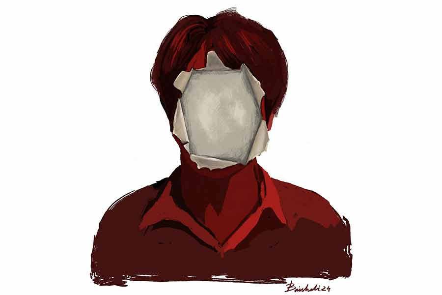

 
 <h1 align=center>অভিনেতা</h1>
<h2 align=center>অরিন্দম চট্টোপাধ্যায়</h2> 

অভিনেতার নিজের কোনও মুখ থাকতে নেই। দর্শক মনে করবে, যাকে সে হাসতে-কাঁদতে-রাগতে-ভয় পেতে দেখছে, সেটাই আসল! আর ঠিক তখনই অতর্কিতে সেই আবরণ ছিঁড়ে ফেলে নতুন কলেবরে আত্মপ্রকাশ করবেন তিনি, ঠিক ম্যাজিশিয়ানের মতো! বলে উঠবেন, ‘ধাপ্পা’— স্যর বলতেন। তখন বিশ্বাস করতাম না। ভাবতাম, এমনটা আবার হয় নাকি? অভিনেতা বলে কি মানুষ নই?...”

“কাট, কাট। লাইট রিফ্লেক্ট করছে শার্টটা থেকে! উফফ! এই জামাটা কে চুজ় করেছে? এই, সন্দীপ, জামাটা চেঞ্জ করাও!”

ধুত্তোরি! এই নিয়ে বোধহয় এগারো... নাকি বারো বার হল। কখনও জামা বদলাও, কখনও আলো ঠিক করো, কখনও আবার ফ্রেমের এক কোণে বসে থাকা কেউ নড়েছে হিসেবের চেয়ে একটু বেশি!

হুঁহ! ন্যাকাপনা প্রচুর। এইটুকু কাজ, তার জন্য...

বিরক্ত না হয়ে পারে না এমিলি। বাবার দিকে তাকায় এক বার। না, বাবার মুখে কোনও বিরক্তির ছাপ নেই। থাকবেই বা কেন? বুড়ো তো দিনরাত এই নিয়ে থাকতে পারলেই বেঁচে যায়। কিন্তু ওর তো অন্য কাজকম্ম আছে, নাকি!

ইউনিটের একটা লোক এগিয়ে এল, “স্যর, জামাটা একটু... ”

বাবা খানিক আমতা-আমতা করল, “খুলে দেব? তা হলে কি, ইয়ে, মানে... খালি গায়ে... ”

“আপনি বরং এক কাজ করুন, এই টাওয়েলটা তত ক্ষণ গায়ে জড়িয়ে নিন। কস্টিউম মিনিট-দুয়েকের মধ্যেই চলে আসবে।”

“ওটা এলেই তো এটা নিয়ে যেতে পারতেন। এত লোকের মধ্যে এক জন বয়স্ক মানুষ টাওয়েল গায়ে দিয়ে বসে থাকবেন... ” এমিলি না বলে পারে না। লোকটা কিছু বলার আগেই বাবা অধৈর্য হয়ে ওঠে, “ওহ! মানু, তুই না! ওদের কাজের একটা সিস্টেম আছে। তুই যা বলবি, তাই করলে চলবে? এই জামাটা তো আবার কেচে, ইস্তিরি করে...”

“হেঁ-হেঁ-হেঁ! স্যর ঠিক বুঝেছেন। চাপ নেবেন না ম্যাডাম, হয়ে এসেছে।”

‘যার জন্য করি চুরি, সে-ই বলে চোর!’ নিজের মনেই গজগজ করে এমিলি।

অখিলেশবাবু টের পান। মেয়েকে ম্যানেজ করার জন্য বলেন, “তোর ড্রেসটা কিন্তু ফাটাফাটি দিয়েছে এরা। ভারী সুন্দর মানিয়েছে!”

“এটা আমার নিজের ড্রেস। ওরা দেয়নি,” গোমড়া মুখেই জবাব দেয় এমিলি। ঘড়ি দেখে। শিট! পৌনে পাঁচটা। আট ঘণ্টা হতে চলল, ওরা এসেছে। এখনও কত ক্ষণ, কে জানে।

কী দরকার ছিল বাবার এই সব ঝামেলায় রাজি হওয়ার, কে জানে! বিখ্যাত শিষ্য একটু পাত্তা দিয়েছে বলেই কি এত আদেখলাপনা করতে হবে? অবশ্য, শুধু বাবাকে দোষ দিয়ে তো লাভ নেই। ও নিজেও কি কম নেচেছিল?

পারিজাত, খোদ পারিজাত সেন গুরুদক্ষিণা দিতে চায় ওর বাবাকে। নাচবে না?

*****

অভিনেতার আসল জায়গা স্টেজ। সেখানে সে তার পরম আরাধ্য দেবতা— দর্শকের একেবারে মুখোমুখি। কোনও নিরাপদ দূরত্ব নেই, কোনও উদাসীন অবগুণ্ঠন নেই।

সেখানে সিনেমা? ছো!

মেপে হাঁটো, মেপে কথা বলো, মেপে ঘাড় ঘোরাও; চোখে জল আনতে গ্লিসারিন, অভিব্যক্তি স্পষ্ট করে তুলতে ক্লোজ়-আপ, কণ্ঠের সীমাবদ্ধতা ঢাকতে ডাবিং— সব দিক থেকে তো হাত-পা বাঁধা। সিনেমা জিনিসটাই ওই জন্য এক্কেবারে পছন্দ করেন না অখিলেশবাবু।

না হলে সুযোগ কি আসেনি?
ডাক আসেনি কি একেবারেই? যাননি। প্রবল জেদে শক্ত ঘাড় ত্যাড়া
করে রেখেছেন।

কিন্তু সে দিন যখন লোকগুলো এল, পুরো ব্যাপারটা এক্সপ্লেন করল, কেমন যেন দুর্বল হয়ে গেলেন। চেষ্টা করেও ‘না’ বলতে পারলেন না।

একটি বহুজাতিক কোম্পানি বেশ কিছু মাস ধরে একটি বিজ্ঞাপনের সিরিজ় বার করছে। ভারতের তাবড়-তাবড় সেলিব্রিটিরা আসছেন তাঁদের প্রথম গুরুকে সঙ্গে নিয়ে। গুরুর প্রতি শিষ্যের শ্রদ্ধা, কৃতজ্ঞতা, ট্রিবিউট। আবেগঘন এই বিজ্ঞাপনগুলির প্রথমটি টিভির পর্দায় আসার সঙ্গে-সঙ্গেই লোকের নজর কেড়েছে। দ্রুত কোম্পানির ব্র্যান্ড ভ্যালু বেড়েছে, কাস্টমারদের ইমোশনাল অ্যাটাচমেন্ট তৈরি হয়েছে।

ন্যাশনাল সার্কিটে সাড়া ফেলার পর, এ বার নজর পড়েছে রিজিয়োনাল বেল্টগুলোয়। আইকন বলতে তো এ দেশে আবার ফিল্মের অ্যাক্টর বা ক্রিকেটারকেই বোঝায়। আর, বাংলায় পারিজাত সেনের মতো আইকন আর কে-ই
বা আছে এখন! সে-ই পারিজাত চান, তাঁর অভিনয়ের প্রথম গুরু, অখিলেশ মজুমদারের সঙ্গে কাজটা করতে।

সত্যি বলতে, পারিজাত যে প্রায় তিরিশ বছর পরেও তাঁকে মনে রেখেছে, সেটাই অবিশ্বাস্য!

অল্পবয়সে গ্রুপ-থিয়েটারে প্রচুর ছেলেমেয়ে নাম লেখায়। কেউ এলিটিস্ট গ্ল্যামারের মোহে, কেউ একটু নতুন কিছু করার উদ্দীপনায়, কেউ বা নিছকই সুন্দরী মেয়েদের সঙ্গে খোলামেলা মেলামেশার সুযোগটুকু নিতে; প্রেম-ট্রেম করতে।

বছর-বিশেকের পারিজাত এসেছিল, তার উচ্চাশার টঙে ওঠার জন্য দরকারি প্রথম সিঁড়িটায় পা রাখতে। চাবুক চেহারা। টুকটাক মডেলিং করছে। তখন থেকেই সিনেমার হিরো হওয়ার ছুঁকছুঁকানি। কেউ কানে মন্তর ঢেলেছিল, একটু স্টেজ-এক্সপোজ়ার থাকলে প্রযোজক-পরিচালকদের নজরে পড়তে সুবিধে হয়। তাই...

বেশি দিন টেকেনি। অখিলেশ জানতেন, টিকবে না। গ্রুপ করতে এলে নিষ্ঠা দরকার পড়ে। সেট বাঁধতে হয়, লাইট-সাউন্ড সামলাতে, এমনকি প্রয়োজনে স্টেজ ঝাঁট দিতে পর্যন্ত হয়। সে সবও অভিনয়-শিক্ষারই পাঠ। রিহার্সালে কারও হয়ে প্রক্সি দেওয়ার সুযোগ আসে কখনও-সখনও। এই ভাবে এক সময় পরিচালকের নজরে পড়লে, হয়তো ছোটখাটো রোল জোটে। তার জন্য অপেক্ষা করতে-করতে কখনও বছর পেরিয়ে যায়।

বড়লোকের ছেলে পারিজাত। কয়েক মাসেই দেখে নিল এই ঢিমেতালের পথে সুবিধে হবে না। তার চেয়ে টিভি সিরিয়ালের শর্টকাট ভাল।

সেটা খুঁজে পেতেও অসুবিধে হল না। শুধু এমন সময়ে পেল...

অভিনয়টা মন্দ করে না বলেই, অখিলেশবাবু ভেবেছিলেন তাঁর নতুন নাটকে ওকে নেবেন একটা ইম্পর্ট্যান্ট রোলে। সেই ভেবেই পরিকল্পনা এগিয়েছিল। কিছু শো বুক হয়ে গেছিল। রিহার্সালও এগিয়েছিল অনেক দূর। সেই সময়েই বিনা মেঘে বজ্রপাতের মতো এক দিন পারিজাত এসে নির্বিকার মুখে জানিয়েছিল, সে আর দলে আসবে না।

অখিলেশবাবুর গ্রুপে তখন পার্থ। টিভি-দুনিয়ায় তার বিস্তর চেনাজানা। পারিজাতকে সে চান্স করিয়ে দিয়েছে একটা মেগাসিরিয়ালে।

অখিলেশবাবু একটু বিপাকেই পড়েছিলেন। অল্প সময়ে নতুন ছেলেকে তৈরি করে নেওয়াটা নেহাত সহজ হবে না। তিনি নিজে কিছু না বললেও, দলের দু’-এক জন সিনিয়র তো আগ বাড়িয়ে পারিজাতকে অনুরোধও করেছিল, “অন্তত কয়েকটা শো করে যা। না হলে দলটা... ”

পারিজাত কান দেয়নি। সে তার রাস্তা খুঁজে পেয়েছে। হোক না সে শর্টকাট!

কই, তাতে লোকসান তো বিশেষ হয়নি। সেই রাস্তা বেয়েই তো পারিজাত সেন আজকে বাংলা সিনেমার অবিসংবাদিত নায়ক।

বরং পুরনো পন্থা আঁকড়ে থেকে তিনিই বোকা বনে গেছেন। এক সময়ের বাংলা নাট্যজগতের সবচেয়ে চর্চিত কালপুরুষ, অখিলেশ মজুমদারের নাম ক্রমে মুছে গেছে লোকস্মৃতি থেকে।

তাঁর গ্রুপ ‘পালাবদল’-এরও আর সেই জৌলুস নেই। টিমটিম করে টিকে আছে কোনও মতে। নতুন প্রোডাকশন তোলার পয়সা নেই। পুরনো প্রোডাকশন করে আর লোক টানা যায় না। কল শো-র সংখ্যাও আঙুলে গোনা।

এর পরেও, এই ধ্বংসস্তূপের মতো অখিলেশকে যে পারিজাত মনে রেখেছে, তাঁকে নিজের ‘প্রথম গুরু’র সম্মান দিতে চেয়েছে— এ কথা কি সহজে বিশ্বাস করা যায়?

মানু তো আকাশ থেকে পড়েছিল। কত বার জিজ্ঞেস করল, “পারিজাত মানে, পারিজাত সেন? অভিনেতা পারিজাত সেন? তোমার ছাত্র ছিল?”

ওর অবশ্য দোষ নেই। জানতই না, পারিজাতের সঙ্গে ‘পালাবদল’-এর যোগসূত্রের কথা। ওর জন্মেরও আগের কথা সে সব।

*****

“স্যর, গ্লিসারিন?”

মেক-আপ চেক করতে-করতেই হাত নাড়লেন অখিলেশবাবু, “লাগবে না, ভাই!”

এডি ছেলেটি কিন্তু-কিন্তু করে, “না, মানে, ইমোশনাল সিন তো; আপনার চোখ একটু ছলছল করলে ভাল হয়!”

“এই সিনটা তো এমনিতেই যথেষ্ট ইমোশনাল,” এমিলি ছেলেটির কনুই ধরে এক পাশে টানে, “বাবার এত পুরনো, এমন সফল ছাত্র। এত দিন পরে দেখা হবে... ” তার পর ফিসফিস করে জোড়ে, “চেপে যাও। বুড়ো একটু এই ব্যাপারে টাচি-ফিলি। অভিনয়ের সময় চোখে জল আনতে গ্লিসারিন দিতে হবে বললেই খচে যাবে।”

“কিন্তু, কিন্তু... মানে, পারিজাত স্যর তো সামনে থাকবেন না।”

“মানে? পারিজাত না এলে শট নেওয়া হবে কী করে?” ভুরু কুঁচকে যায় এমিলির। খেয়াল করে, বাবাও এসে দাঁড়িয়েছে কাছে। কানে গেছে কথাটা।

এডি ছেলেটির ভ্রুক্ষেপ নেই, “আজ তো স্যরের ডেট পাওয়া যায়নি। আজ আপনার শটটা নেওয়া হবে। স্যরের ডায়লগটা রেকর্ডিং চলবে। আর রিঅ্যাকশন দেওয়ার জন্য এক জন ডাবল আছে, ও-ই দাঁড়াবে সামনে।”

মেয়ের মেজাজ বিগড়োচ্ছে আঁচ পেয়ে অখিলেশবাবু হড়বড় করে বলে ওঠেন, “আরে, তোকে তো বলাই হয়নি। পারিজাত ফোন করেছিল তো আমায়, সকালে। কত বার করে ক্ষমা চাইল। বলল, ওর বৌয়ের শরীরটা ভাল নেই। না হলে ঠিকই আসত।”

হায় রে! মেয়ের সামনে কি তাঁর নির্লজ্জ লোভানিটুকু খুব স্পষ্ট হয়ে যাচ্ছে?

‘মানুষ যখন মিথ্যে কথা বলে, তখন তার চোখ পিটপিট করে, কথা বলার স্পিড স্বাভাবিকের চেয়ে একটু বেশি হয়, শরীর একটু স্টিফ হয়ে যায়। এগুলো খেয়াল করবে। অবজ়ারভেশন— অভিনেতার একমাত্র সোর্স অব লেসন!’

নিজের কথাগুলিই মনে পড়ে অখিলেশের। মুখে বলেন, “আমার গ্লিসারিন লাগবে না। চলো।”

*****

শীর্ণ চেহারা বয়সের ভারে সামান্য ন্যুব্জ। মুখের সব বলিরেখা পলকের ভাঙাগড়ায় ক্যালেইডোস্কোপের মতো নতুন-নতুন ছবির জন্ম দিয়ে চলেছে। ঘন ভুরুর নীচে দু’টি বাঙ্ময় চোখ— কী অলৌকিক সেই চোখের ভাষা বদল! অনতিদূর থেকে হেঁটে আসা নিজের প্রাক্তন ছাত্রকে দেখে প্রথমে ক্ষণিকের নিস্পৃহা, চকিতে তা বদলে যায় অকৃত্রিম বিস্ময়ে।

শিষ্য এসে সামনে দাঁড়ায়। নিচু হয়ে পায়ে হাত দেয়। গমগম করে ওঠে তার ভাবালু কণ্ঠস্বর; মুহূর্তে বৃদ্ধের চোখের চাহনি বদলে যায় আপ্লুতিতে। নিবিড় স্নেহের ঘন ছায়া মাখামাখি হয়ে ওঠে সেখানে। চোখের কোণে অভ্রগুঁড়োর মতো চিকচিক করে ওঠে জল। শিষ্যের থেকে পাওয়া স্বীকৃতির শেষলগ্নে এসে সেই চাহনিই ফের রং বদলে মেখে নেয় গর্বের গোধূলি-রং, আস্থা খুঁজে পাওয়ার প্রশান্তি।

ক্যামেরার দিকে পিঠ ফিরিয়ে বসে থাকা এমিলি দেখছিল বাবাকে। জ্ঞান হওয়ার পর থেকে ও বাবাকে অভিনয় করতে তেমন দেখেনি। রিহার্সালে অন্যকে দেখিয়ে দেয়, টুকটাক শুধরে দেয়। কিন্তু পুরোদমে একটা চরিত্রকে ফুটিয়ে তোলা, তাও এমন স্বল্প অবসরে... উল্টো দিকে নিছকই এক জন ডামি, কোনও সিচুয়েশন তৈরি হওয়ার সুযোগই নেই। নিজের অভিব্যক্তির উপর কী অকল্পনীয় নিয়ন্ত্রণ! কী পরিমিত পরিশীলন!

“ম্যাডাম, শট শেষ। এ বার আপনি... ”

চটকা ভাঙে এমিলির। বাবা কোথায়? জিজ্ঞেস করতে ছেলেটি বলল, “মেকআপ তুলতে গেছেন।”

মেকআপ রুমে ঢুকতে গিয়ে এমিলি থমকে দাঁড়ায়। আয়নার সামনে ঝুম হয়ে বসে আছে বৃদ্ধ। তার মুখ এখনও ভাঙাচোরা। বলিরেখার সোঁতা বেয়ে বয়ে চলেছে শীর্ণ জলধারা!

“অভিনেতাকে নিজের জীবনের সমস্ত অভিজ্ঞতা ছেনে, খুঁড়ে তুলে আনতে হয় অভিনীত চরিত্রের উপযুক্ত অভিব্যক্তি”— বলত বাবা, “তা হলেই আর ‘অভিনয়’ থাকে না ব্যাপারটা!”

তা হলে অভিনয় ছিল না পুরোটা! বিখ্যাত শিষ্যের কাছে ফের এক বার ব্যবহৃত হওয়ার গ্লানিটুকু জড়ো করে অন্য পথে চ্যানেলাইজ় করেছেন নটসম্রাট অখিলেশ মজুমদার, তাই কি?

মেয়েকে দেখে সোজা হয়ে বসেন অখিলেশবাবু, “পাঁচ মিনিট দে, মানু। হয়ে এসেছে।”

নিজেই ভিজে স্পঞ্জ ঘষে-ঘষে মেকআপ তুলতে-তুলতে নিচু গলায় বলেন, “হ্যাঁ রে, চেকটা হাতে পেয়েছিস?”

এমিলি ঘাড় নাড়ে।

“কত দিয়েছে?”

“পঞ্চাশ। যা কথা হয়েছিল।”

“যাক, দিয়েছে তো। যদিও টাকাটা বড় কথা নয়। এই যে পারিজাত সেন পাবলিকলি অ্যাকনলেজ করছে, আমি ওর গুরু— দলটা এর পরে একটু চাঙ্গা হবে, কী বলিস?”

মেকআপের পরত উঠে যাচ্ছে ক্রমে। মুখোশের ভিতর থেকে ফুটে উঠছে মুখ... নাকি আরও একটা মুখোশ! অখিলেশবাবুর স্মৃতিতে গুনগুন করতে থাকে, ‘...অভিনেতার নিজের কোনও মুখ থাকতে নেই। তুমি ভাববে, বিশ্বাস করবে, যাকে তুমি হাসতে-কাঁদতে-রাগতে-ভয় পেতে দেখছ... ’

কণ্ঠ শীতল হয়। উচ্চারণ হিসেবি, কাটাকাটা। তিনি বলে চলেন, “এই টাকাটা আপাতত সরিয়ে রাখ। আমার হিসেব বলছে, এই বিজ্ঞাপনটা টিভিতে আসার পর থেকে ‘পালাবদল’-এ একটা পালাবদল ঘটবে... ঘটবেই... দেখে নিস। ভিড় সামলানো যাবে না। হুঁ হুঁ! সব শালাকে দেখিয়ে দেব... ”

ধন্দ লাগে এমিলির। কোনটা সত্যি? অভিনেতার সবটাই মুখোশ, নাকি মুখোশ ছিঁড়ে, ফাটল দিয়ে মুখ দেখা যায় কখনও-সখনও!

