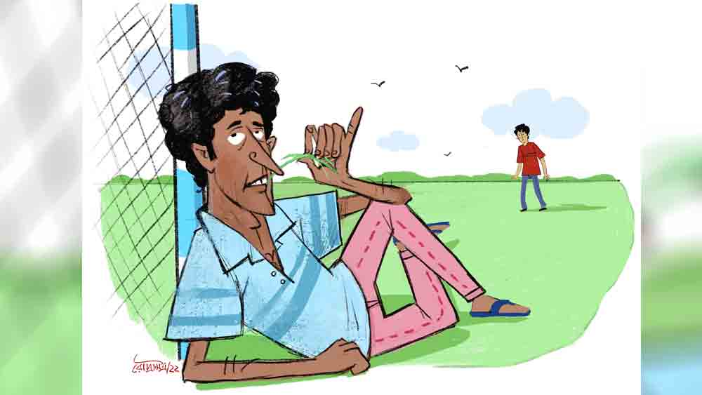

 
 <h1 align=center>অলরাউন্ডার</h1>
<h2 align=center>মানসেন্দু সমাজপতি</h2> ঘর ফাটিয়ে চেঁচিয়ে উঠলেন কদমতলা ক্লাবের সেক্রেটারি গজানন সামন্ত, “হঠ যাও! নিকাল যাও! সব শালা অকম্মার ঢেঁকি! উজবুক! গাড়ল!”

অপ্রতিরোধ্য বিরিয়ানি-প্রীতি মধ্য-চল্লিশের গজাননকে প্রায় দশানন করে তুলেছে। ঘাড়-গলার ঝামেলা নেই। কুমড়ো ধাঁচের কদমছাঁট মাথা। গোল্লা গোল্লা চোখদুটো মোটা কালো ফ্রেমের চশমার গায়ে প্রায় সাঁটা। ঝোলা গোঁফ, পুরু কালো ঠোঁট, খরগোশের মতো বড় বড় হলদে দাঁত নিয়ে পুরোদস্তুর সেক্রেটারি-মার্কা চেহারা। বাজখাঁই গলা, মনে হয় যেন সব সময়েই খেপে আছেন। মুখ দিয়ে যখন নাগাড়ে রাষ্ট্রভাষার শ্রাদ্ধ বেরোয়, তখন বুঝে নিতে হয় গজানন নিয্যস খেপেছেন, যেমন এই মুহূর্তে, “লাঞ্চমে ‘পাঁউরুটি কিঁউ’ বোলকে বাওয়াল করেগা আর ম্যাচের পর ম্যাচ হারেগা? ইয়ার্কি পায়া হ্যায়? অ্যাঁ? মামদোবাজি? আর সেই নিকম্মা অপদার্থ গদাই ব্যাটা কাঁহা হ্যায়? কিসকা ওভারবাউন্ডারিকা বল কুড়ানে গিয়া?”

গজাননের দোষ নেই। এই মফস্সলের চার-পাঁচটা ক্রিকেট ক্লাবের মধ্যে কদমতলার নাম আছে। সেই নামের মেন আর্কিটেক্ট গদাই। গদাধর গুঁই। কালোকুলো, দাঁত উঁচু, সিড়িঙ্গে। লেখাপড়ায় গুণধর। হায়ার সেকেন্ডারিতে দু’বার গাড্ডু মেরে এ বার ফার্স্ট ইয়ারে ঢুকেছে। তবে ব্যাট হাতে মাঠে নামলেই বীরেন্দ্র সহবাগ। বল হাতে পাড়াতুতো বুমরা। গদাইয়ের বাবার স্বপ্ন, অলরাউন্ডার গদাই এক দিন বেঙ্গল খেলবে, তার পর আইপিএল, তার পর আর কিছু না হোক, অনঙ্গ জাঙ্গিয়া আর পদশ্রী মোজার স্পনসরশিপটা বাগাবেই।  

তা ভবিষ্যতের কথা ভবিষ্যতে। বর্তমানের ক্যাঁচালটা বেশ গভীর। পর পর দুটো ম্যাচে কদমতলা হেরেছে। গদাইয়ের রান ছয় আর আট। প্রেস্টিজে যাকে বলে গ্যামাক্সিন। ফলশ্রুতি, গজাননের রাগ আর রাগাশ্রয়ী রাষ্ট্রভাষা!

খিস্তি হজম করে ব্যাজার মুখে স্কুলের মাঠ দিয়ে শর্টকাট করছিল পল্টু, কদমতলার উইকেটকিপার। দূর থেকেই দেখল, গোলপোস্টে হেলান দিয়ে বসে গদাই, উদাস চোখে গাছের মগডাল দেখছে আর ঘাস ছিঁড়ে অন্যমনস্ক ভাবে চিবোচ্ছে। পল্টু গদাইয়ের পাশে গিয়ে ধপাস করে বসে পড়ল, “ওফ! গজাদা আজ যা ঝাড়টা দিল মাইরি, মনে হচ্ছিল ক্রিকেট ছেড়ে লুডো খেলি!”

গদাই দূরমনস্ক দৃষ্টিতে পল্টুর দিকে তাকাল, “কে গজাদা?”

“লে হালুয়া! অ্যাই, তোর কী হয়েছে বল তো? ল্যাদাড়ুসের মতো ব্যাট চালাচ্ছিস, ম্যাদাড়ুসের মতো বসে ঘাস চিবোচ্ছিস, এটা তো তুই নোস! একটু স্ট্রেট ব্যাটে ঝেড়ে কাশ তো গুরু, হয়েছেটা কী?”

গদাই ফোঁস করে একটা দীর্ঘশ্বাস ছেড়ে বলল, “পুঁটি।”

“ও! পুঁটিমাছ খাওয়ার শখ হয়েছে? তা সেটা কাকিমাকে বললেই হয়। আমার অবিশ্যি ভাজার চেয়ে অম্বলটাই বেড়ে লাগে,” পল্টুর মুখ রসস্থ হয়ে ওঠে।

“ধ্যাত মাকড়া! পুঁটিমাছ-ফাছ নয়! পুঁটি, পুঁটি… বুড়োশিবতলা।”

“মানে, আমাদের পটলের দিদি? সে আবার কী করল? ধরে ঝাড় দিয়েছে বুঝি? সে তো তার জেঠু থেকে শুরু করে লাহাদের কুকুর অবধি সবাইকেই দেয়… তাতে কী হল?”

“এ ঝাড় সে ঝাড় নয় রে, পল্টে!” গদাই বুকের বাঁ দিকে একটা থাবড়া মারল, “এ ঝাড় ডাইরেক্ট এইখানে।”

মেরেছে! গদাই তো তা হলে জম্পেশ ফেঁসেছে! অবিশ্যি বাইশ বছরের একটা ছেলের প্রেমে পড়াটা দোষের কিছু নয়, কিন্তু আর মেয়ে পেলি না? শেষে পুঁটির মতো একটা মেয়ে হিটলার!

পুঁটি। বছর কুড়ির আঁটোসাঁটো চেহারা। শ্যামলা মুখে বড় বড় চোখে ব্যক্তিত্ব বেশ গম্ভীর। পনেরো বছর বয়সে পুঁটির বাবা-মা দুজনেই রোড অ্যাক্সিডেন্টে মারা যান। লেখাপড়ায় খারাপ ছিল না, কিন্তু অল্প বয়েসে সংসার ঘাড়ে এসে পড়ায় পড়াশোনাটা হায়ার সেকেন্ডারির পর আর এগোয়নি। অবিবাহিত রিটায়ার্ড জ্যাঠা আর ভাই পটলকে নিয়ে ছোট্ট সংসারের পুঁটিই সর্বময়ী কর্ত্রী। জ্যাঠার পেনশনটাই ভরসা। অভাবের সংসারের চাদর ডাইনে টানতে বাঁয়ে কুলোয় না। সেই জোয়াল টানতে টানতে মেয়েটার কথাবার্তার মাধুর্য গেছে উবে। মেজাজ সব সময়েই হিটলারি। তবে মেয়েটা দুর্দান্ত কাজের। সংসারও চালায় দোর্দণ্ডপ্রতাপে। জ্যাঠা-ভাই থেকে আরম্ভ করে পাড়া-প্রতিবেশী সবাই তাই তাকে সমঝে চলে।  

কিন্তু বন্ধু বলে কথা! বিশেষ করে কেসটার সঙ্গে যখন জড়িয়ে গেছে গদাইয়ের রানের ফাঁস আর গজাদার ফাঁসি, তখন কিছু একটা তো করতেই হয়। কিন্তু প্রশ্নটা হচ্ছে, বেড়াল, থুড়ি হিটলারের গলায় ঘণ্টাটা বাঁধবে কে?

 

তখন সুরুচি কেবিনে গোটা চারেক ডেভিল নিয়ে বেজায় ব্যস্ত খগেন সাহা, কদমতলার ক্রিকেট কোচ। কন্ট্রাক্টের কোচিং, জিতলে পুরো টাকা, হারলে হাফ। সুতরাং খগেনের সময়টা ইদানীং খুব একটা ভাল যাচ্ছে না।

পল্টু হাঁপাতে হাঁপাতে এসে খগেনের সামনের চেয়ারটায় ধপাস করে বসল, “খগাদা, কেস জন্ডিস!”

“জন্ডিস বলে জন্ডিস! গদাই ব্যাটা ঝোলাচ্ছে আর আমার টাকা হাফ হচ্ছে। দুটোর বেশি চপ-ডেভিল অর্ডার করতে গেলেই ভাবতে হচ্ছে। ভাবতে পারিস?”

পল্টু বিরক্ত মুখে বলে, “আরে রাখো তোমার ডেভিল। এখন গদাইয়ের মাথার ডেভিলের কী করবে তাই ভাবো। গদাই প্রেমে পড়েছে!”

“অ্যাঁ! বলিস কী রে পল্টু!” খগেন উত্তেজনায় আস্ত ডেভিল মুখে পুরে দিল, “এ য়ো হগগ খয়ো এ!”

“জব্বর খবর কী বলছ! স্যাম্পলটা কে জানো? বুড়োশিবতলার পুঁটি!”

ক্রাশের নামটা শুনে খগেনদার হাত কেঁপে সেকেন্ড ডেভিলটা ইয়র্ক করে বেরিয়ে যাচ্ছিল, বাঁ হাতে খপ করে গ্রাউন্ড লেভেল ক্যাচ নিয়ে ক্র্যাশ বাঁচাল খগেন, তার পর বলল, “লে খ্যাঁচাকল! গদাই আর মেয়ে পেল না? শেষে পুঁটি! এ তো একশো চল্লিশের বিমার। মাথা পুরো নামানোও যায় না, হেলমেটে ছ্যাঁকা মেরে চলে যায়!”

পল্টু গলা নামিয়ে বলল, “গদাই সাহস করে পুঁটিকে ইন-সুইংটা ডেলিভারি করতে পারছে না। তোমাকে ফ্লিপার ঝেড়ে উইকেটটা তুলতেই হবে খগাদা, না হলে নেক্সট ম্যাচের পর আমরা সবাই গজাদার রিজ়ার্ভ বেঞ্চে চলে যাব।”

“মুশকিল করলি রে পল্টু, এই বয়েসে শোয়েবের বাউন্সারের সামনে ফেলে দিলি, মুড়োটা না গুঁড়ো হয়ে যায়। মুড়ো… মুড়ো… আরে দাঁড়া দাঁড়া! মুরলী, মানে মুরলী চক্কোত্তি আছে না!”

ভুরু কোঁচকায় পল্টু, “মানে সেই জ্যোতিষী? সে কী করবে?”

“যা বলবি তা-ই। অব্যর্থ। চল দিকি আমার সঙ্গে,” প্লেটে পড়ে থাকা চপ-ডেভিলের টুকরোটাকরা মুখে পুরে উঠে পড়ল খগাদা।

টাউনের এক প্রান্তে পুরনো এক তলা বাড়ি। বহু দিন রং-চুনকামের বালাই নেই। রংচটা বোর্ডটায় কোনও ক্রমে পড়া যাচ্ছে, ‘বগলা জ্যোতিষপীঠ’। বৈঠকখানার ঠিক মাঝখানটায় সিলিং থেকে ঝুলছে একটা টিমটিমে ষাট পাওয়ারের বাল্‌ব। এক দিকে একটা মা কালীর প্রায় দেওয়াল-জোড়া ছবি, মায়ের পায়ের কাছে লাল-শুকনো অসংখ্য জবাফুলের মেলা, ছবির সামনে কাঁচা পাকা-জটা-দাড়ি-রক্তাম্বর-রুদ্রাক্ষ-তাবিজ-কবচ-মাদুলিশোভিত মুরলী তাকিয়ায় ঠেস দিয়ে আধশোয়া। খগেনদের দেখে ব্যাজার মুখে আলসে বেড়ালের মতো বিকট একটা হাই তুলে বললেন, “কী হে দ্রোণাচার্য… তোমার আবার কী কেস?”

“এই… এক জনকে আর এক জনের পিছনে ঘুরঘুর করানোর কেস আর কী!”

বৃত্তান্ত শুনে পাশের কাঠের বাক্সটা থেকে একটা ছোট্ট মতো রংচটা কবচ বার করলেন, “তোমার জন্যে সব সময়ই আমার রেডিমেড থাকে, এই নাও... মহাশক্তিশালী বশীকরণ কবচ, তোমার জন্যে সস্তায় করে দিলুম, মাত্তর পাঁচশো।”

খগেন তাচ্ছিল্যের সঙ্গে পল্টুর দিকে হাত নেড়ে বলল, “পাঁচশো টাকা? কোনও ব্যাপারই না, ও পল্টুই দিয়ে দেবে।”

অগত্যা পল্টুরই নগদ খসল।

খগেন সময় নষ্ট করতে রাজি নয়। মুরলীর ডেরা থেকে বেরিয়েই সোজা পটলদের বাড়ির দিকে হাঁটা দিল। সদ্য পাঁচশো খসে গিয়ে বেশ ব্যাজার পল্টু, তাও মুখে খুব উৎসাহ-টুৎসাহ দিতে দিতে পটলদের বাড়ির সামনে এসেই হঠাৎ, “এই যাঃ, মা চিনি আনতে বলেছিল, একদম ভুলে গেছি, তুমি এগিয়ে যাও খগাদা, বেস্ট অব লাক...” বলেই, খগেন হাঁ-হাঁ করে ওঠার আগেই একটা সরু গলি ধরে স্রেফ হাপিশ!

“দেখেছ কী শয়তান ছেলে, ম্যাকগ্রার বাউন্সারের সামনে ফেলে দিয়ে কী রকম কেটে গেল! মরুকগে… পটলা আছিস না কি, পটলা...”

মিনিট দুয়েক ডাকাডাকির পর আঁচলে হাত মুছতে মুছতে বেরিয়ে এল পুঁটি, “কে? ও! খগাদা? পটলার তো জ্বর হয়েছে।”

“সেই জন্যেই তো দেখতে এলুম রে। কেমন আছে এখন?”

“জ্বরটা একটু কম। যা বাঁদর ছেলে, বিছানায় বসেই গুগলি প্র্যাকটিস হচ্ছে...”

“ভাল, ভাল… তা একটু জল খাওয়া দিকি!” বলে পুঁটিকে পাশ কাটিয়ে ভিতরে ঢুকে সোফায় বসে পড়ল খগেন, তার পর আসল কথা পাড়ল, “ইয়ে… বলছিলুম কী, মানে… আমাদের গদাই… চিনিস তো?”

পুঁটি প্রশ্ন ছোড়ে, “কোন গদাই? ল্যাংড়া না হাতকাটা?”

“আরে না না, ওরা আমাদের গদাই হতে যাবে কেন, ওরা তো অন্য লাইন অ্যান্ড লেংথের বোলার! মস্তান এক-একটা! আমি বলছি ক্রিকেটার গদাইয়ের কথা…”

পুঁটি নির্বিকার মুখে বলে, “ও! সিড়িঙ্গে গদাই? তো?”

বিশেষণটা শুনে একটু বোমকে গেল খগেন। তার পর একটু দম নিয়ে বলল, “না, মানে… ইয়ে, পল্টু বলছিল, গদাই বোধহয় তোকে কিছু বলতে চায়, বুঝলি না... মানে, ঠিক সাহস পাচ্ছে না…”

“মানে?”

“না, মানে, তেমন কিছু নয়, আসলে তোদের সময়টা তো খুব একটা ভাল যাচ্ছে না, তাই মুরলীর কাছ থেকে এইটে নিয়ে এলুম। এটা কনুইয়ের ওপর বেঁধে ফেল দিকি!”

“ও মা! কবচ! তা এর টাকা?”

“সে তোকে ভাবতে হবে না, ও পল্টু দিয়ে দিয়েছে।”

“পল্টুদা!” পুঁটি মর্মভেদী দৃষ্টিতে খানিক ক্ষণ তাকিয়ে থাকল, তার পর একটা স্বগতোক্তি করল, “আ-চ-ছা!” তার পরই কবচটা হাতে নিয়ে স্বাভাবিক গলায় বলল, “আপনি বসুন খগাদা, আমি জল নিয়ে আসছি।”

কাজটা এমন মাখনের মতো হয়ে যাবে ভাবেনি খগেন। প্রেমসে জলটা খাচ্ছিল, হঠাৎ পুঁটি চেঁচিয়ে উঠল, “পিঁপড়ে!”

খগেন বিষম খেল, “কো-কোথায়?”

“আপনার মুখের মধ্যে… বড়, লাল রঙের, মুখটা খুলুন দেখি, থাকলে বের করে দেব, নইলে এক বারে পেটে গিয়ে রামকামড় লাগাবে। কী মুশকিল!”

খগেন কাকের বাচ্চার মতো বিঘৎখানেক হাঁ ঝুলিয়ে বসল, পুঁটির চোখ নেমে এল খগেনের মুখের কাছে। তার পর কী নিখুঁত টিপ পুঁটির! কবচটা খগেনের টাকরায় বাউন্স করে সটান চালান হয়ে গেল পেটে। খগেন হাঁউমাঁউ করে উঠল, “এই মেরেচে! কবচটা গিলে ফেললুম যে! কী হবে এই বার?”

পুঁটি সলজ্জ হেসে বলল, “সরি, হাতে ছিল, সিলিপ করে ঢুকে গেল! যাকগে, ভালই হল, আপনার কবচ আপনারই পেটের মধ্যে থেকে জোর কাজ করবে, ঠিক না খগাদা?”

 

বৃত্তান্ত শুনে মুরলী গম্ভীর হয়ে বললেন, “কম্মটি সেরেছ, কবচ গিলে ফেলেছ, এখন পুঁটির বদলে তুমিই যে গদাইয়ের পেছনে ঘুরঘুর করবে হে!”

খগেন কাঁদো কাঁদো গলায় বলল, “কী কেলেঙ্কারি! এখন উপায়?”

“উপায় একটাই, মধু ডাক্তারের কাছে যাও। পারলে সে-ই পারবে কিছু করতে। দেখো কী বলে...”

সব শুনে মধু ডাক্তারের চশমা কপালে, “অ্যামেজ়িং কেস! তা তুমি হঠাৎ কবচ খেতে গেলে কেন হে? ওটা কি বিরিয়ানি কবচ না কি?”

“আরে ধ্যাত্তেরি! খেতে যাব কেন? ব্যাপারটা অ্যাক্সিডেন্ট। এখন দয়া করে বের করার একটা ব্যবস্থা করুন তো।”

“ব্যবস্থা আর কী! একটা কড়া জোলাপ দিচ্ছি, লম্বালম্বি যদি বেরিয়ে যায় তো বেঁচে গেলে, কিন্তু আড়াআড়ি বেরোতে গিয়ে যদি আটকে যায় তা হলেই চিত্তির!”

“লে খ্যাঁচাকল!” খগেন ঘেঁটে ঘ!

 

পরদিন বিকেলবেলা মাঠ থেকে প্র্যাকটিস সেরে ফিরছিল গদাই। হঠাৎ পটল কোত্থেকে উদয় হয়ে একটা চিরকুট গদাইয়ের হাতে ধরিয়ে দিয়ে বোঁ করে হাওয়া হয়ে গেল। চিরকুটটা খুলে গদাই দেখল, মেয়েলি হাতের লেখা, “অলরাউন্ডার না ছাই। এত ভয় থাকলে ব্যাটে ওই আট-দশ রানই আসবে আর উইকেট অন্য প্লেয়ার তুলে নিয়ে যাবে। পরের মুখে কি রাবড়ি খাওয়া যায়?”

নাকে একেবারে ঝামা ঘষে দিয়েছে পুঁটি। সত্যিই তো, অন্যের মুখে কি রাবড়ি খাওয়া যায়? নিজের কাজটা নিজেকেই করতে হয়।

পরদিন বিকেলের বাজার সেরে ফিরছিল পুঁটি। তক্কেতক্কে পিছু নিল গদাই। কালেক্টরেট পেরিয়ে গাজনের মাঠ, সেই অবধি গদাই পেছন পেছন এল। মাঠটার মাঝামাঝি বড় বড় গাছে ঝুপ্পুস একটা জায়গা। সেইখানটায় এসে ঝট করে ওভারটেক করল গদাই। একেবারে পুঁটির মুখোমুখি।

বলল, “আম- আমি... কিছু ব-বলতে চাই...”

পুঁটি নির্বিকার ভাবে গাছের মগডালই দেখছে।

“যা কিছু হয়েছে সব পল্টুর কীর্তি। আমি কিন্তু ওকে এ সব করতে বলিনি… মাইরি বলছি...”

বড় বড় শান্ত চোখ মেলে তাকাল পুঁটি। গোধূলির কনে-দেখা আলো ঘামতেলের মতো তার সারা মুখে ছড়িয়ে পড়ে মায়াসিক্ত করে তুলেছে। ঠোঁটের কোণে একটা আবছা প্রশ্রয়ের হাসিও কি?

এ বার স্টেপ আউট করে পুল। কপালে থাকলে লং-অনের ওপর দিয়ে ছক্কা, না হলে বাউন্ডারি লাইনে ক্যাচ কট কট। সাহসী হল গদাই, বলল, “আমি অলরাউন্ডার, তা জানো? নিজের রাবড়ি আমি নিজের মুখেই খেতে পারি...”

মুখ বেঁকাল পুঁটি, “আ-হা, কী ঘণ্টার অলরাউন্ডার! পল্টুদা, খগাদা, জ্যোতিষী… অলরাউন্ডারের এত জন রানার লাগে?”

“এখন তো আমি নিজেই এসেছি… এ বার দাও!”

“কী?”

“আমার রাবড়ি!”

“ই-ই-শ-শ! সাহসের একেবারে পরমবীরচক্র! ভিতু কোথাকার!” বলে হেসে ফেলল পুঁটি।

তার সলজ্জ সমর্পণের হাসি সহস্র শ্বেতকপোত হয়ে স্বপ্ন ছড়াতে ছড়াতে উড়ে গেল গোধূলির সিঁদুর-রাঙানো মায়াস্নাত আকাশটা জুড়ে।