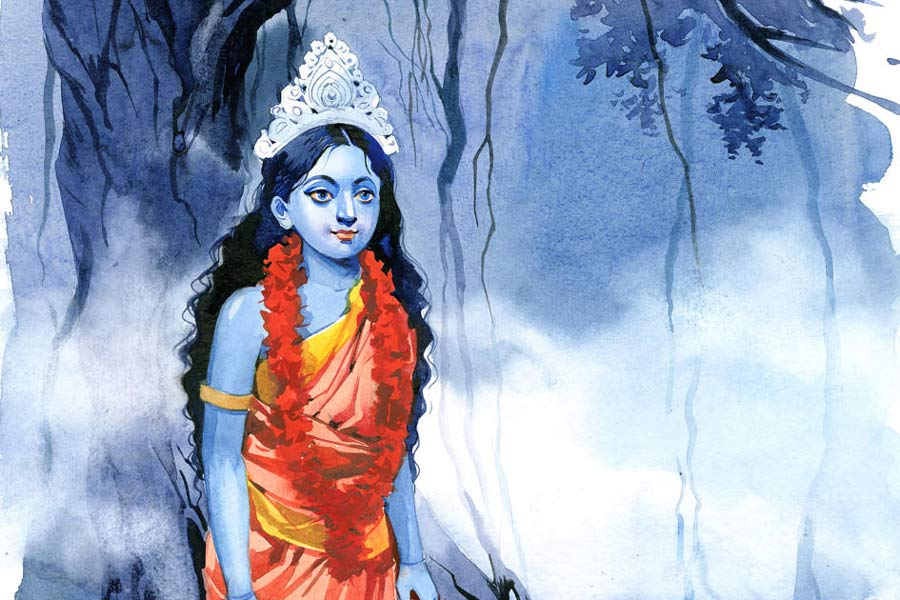

 
 <h1 align=center>অসূয়া</h1>
<h2 align=center>কৃষ্ণেন্দু মুখোপাধ্যায়</h2> ঝুমঝুম করে হালকা একটা ঘুঙুরের আওয়াজ শুনতে পেল রত্নাবলী। তার পর আওয়াজটা জানালার কাছে এসে বন্ধ হয়ে গিয়ে আশ্চর্য নিস্তব্ধ হয়ে গেল চার দিক। বাইরে ঝিঁঝির ডাক ছাড়া আর কিছু নেই। রত্নাবলী খাট থেকে নেমে নিঃশব্দ পায়ে জানালার সামনে এসে দাঁড়াল। বাইরে অন্ধকার। আকাশে আধ ফালি চাঁদের আলোয় দেখা যাচ্ছে, চরাচরের কুয়াশা আরও এগিয়ে আসছে। জানালার অদূরে বটগাছটার যে ঝুরিগুলো নেমেছে, কুয়াশা এসে আস্তে আস্তে পেঁচিয়ে ধরছে তাদের।

জানালার নীচে কি কেউ রয়েছে? শিকের জন্য মুখটা আর বাড়িয়ে দেখতে পাচ্ছে না রত্নাবলী। তবে একটা ধুনোর গন্ধ পাচ্ছে। কিছু ক্ষণ দাঁড়িয়ে থেকে খাটের দিকে পা বাড়াতেই একটা বাচ্চা মেয়ের ফিসফিসে গলায় নিজের নামটা শুনতে পেল, “রত্নাবলী… রত্নাবলী…”

অদ্ভুত একটা সম্মোহনী ডাক। ঘুরে আবার জানালার কাছে গেল রত্নাবলী। ঝুমঝুম আওয়াজটা আবার হচ্ছে। একটা বাচ্চা মেয়ে লাল আটপৌরে শাড়ি পরে বটগাছটার দিকে এগিয়ে যাচ্ছে। মেয়েটা সামনের দিকে এগিয়ে যাচ্ছে বলে ওর মুখ দেখতে পাচ্ছে না। তবে বুঝতে পারছে, মেয়েটার মাথায় শোলার মুকুট আছে। মেয়েটা কুয়াশার ভিতর মিলিয়ে যাওয়ার আগে এক বার মুখ ফেরাল। ঘন নীল মুখে ফুটে রয়েছে ঝকঝকে দুটো চোখ।

‘মেয়েটাকে ভাল রেখো মা...’ ওর মনের মধ্যে শব্দগুলো বেজে উঠল।

মোবাইলটা ব্যাগের মধ্যে বাজছে। ধড়মড় করে ঘুম ভেঙে উঠে চোখ খুলল রত্নাবলী। তার পর ব্যাগের চেনটা খুলে হাতড়ে যত ক্ষণে মোবাইলটা খুঁজে পেল, তত ক্ষণে লাইন কেটে গিয়েছে। মোবাইল তুলে দেখল, বোনের মিসড কল। একটু ধাতস্থ হয়ে বাইরের দিকে তাকাল। হেমন্তের নরম সকালে দুর্গাপুর এক্সপ্রেসওয়ে দিয়ে ছুটে চলেছে এসইউভিটা। সুকান্ত গাড়ি চালানোর সময় এফএম না চালিয়ে থাকতে পারে না। কিন্তু এখন এফএমটা বন্ধ। রত্নাবলী ঘুমিয়ে পড়েছিল বলেই বোধহয় আর চালায়নি।

“কত দূর এলাম সুকান্ত?”

“বর্ধমান পেরিয়ে গিয়েছি দিদি।”

“চা খেতে দাঁড়াবি না?”

“সামনেই শক্তিগড়। ওখানে দাঁড়াব দিদি।”

রত্নাবলী আবার বাইরের দিকে তাকাল। চরাচরে এখনও কুয়াশা কাটেনি। সারা রাত্রি ঘুম হয়নি। মাথার ভিতরটা কেমন যেন বোধশূন্য মনে হচ্ছে। মোবাইল হাতে নিয়ে বোনকে ফোন করল। দুটো রিং হওয়ার সঙ্গে সঙ্গেই ফোন ধরে রম্যাণি উদ্বিগ্ন গলায় জিজ্ঞেস করল, “তুই কোথায় দি?”

“এই তো গাড়িতে। ফিরছি।”

“উফ! জানি তো। কাল সন্ধে থেকে তোর মোবাইল সুইচড অফ। শেষকালে এই একটু আগে পিসিকে ফোন করে জানলাম তুই একেবারে ভোরবেলায় আলো ফুটতেই বেরিয়ে পড়েছিস। কী হল রে?”

সুকান্ত অনেকটাই জানে। তবে সবটা জানে না। সবটা কি জানা উচিত? রত্নাবলী যদিও পিছনে বসে আছে, কিন্তু গাড়ির মধ্যে কোনও প্রাইভেসি নেই। কলকাতাতে ফিরেও সব বোনকে বলা যেত, কিন্তু রত্নাবলী নিজের মধ্যেও একটা তাড়না টের পেল কাউকে সব বলার।

“এফএমটা চালিয়ে নে সুকান্ত। তোর আবার গান না শুনলে চোখ লেগে যায়।”

সুকান্ত এফএম চালানোর পর কানে ব্লুটুথ লাগিয়ে একটু চাপা গলায় ইংরেজিতে রত্নাবলী বলল, “ইট’স আ কেস অব ব্ল্যাক ম্যাজিক।”

উল্টো দিকে উত্তেজিত গলায় রম্যাণি বলল, “তোকে বলেছিলাম। এ বার বিশ্বাস হল তো?”

রম্যাণি এ সবে যতটা বিশ্বাস করে, রত্নাবলী ততটা নয়। অন্তত গতকাল সকাল পর্যন্ত হেসে উড়িয়ে দিত। কিন্তু কাল রাতের অভিজ্ঞতার পরে পুরো ব্যাপারটা অন্য ভাবে ভাবতে বাধ্য হয়েছে।

“অ্যাই দি, চুপ করে আছিস কেন? তোর আবার কোনও ক্ষতি করে দেয়নি তো?”

“ক্ষতি!” উদাস গলায় রত্নাবলী বলল, “জানি না রে, ক্ষতি না লাভ। তবে কিছু তো আছে।”

“তুই আবার বড় তান্ত্রিক সাজতে গিয়েছিলি। কী দরকার ছিল বল তো তোর এই সব বিপজ্জনক ব্যাপারে ঢুকতে যাওয়ার।”

“লাভলিকে তোর মনে নেই? ছোট্ট ফুটফুটে একটা বছর চারেকের মেয়ে। তুই যখন ক্লাস সিক্সে পড়তিস, তখনও তো ওরা আমাদের বাড়িতে ছিল। পিসি তো শুধু আমাদের বেবি সিটার ছিল না, এক অর্থে আমাদের কোলে-পিঠে করে মানুষ করেছে। লাভলি আমাদের ছোট বোনের মতো। তার এ রকম একটা অবস্থার খবর পেয়ে যাব না?”

“তার জন্য তোর ওদের গ্রামে যাওয়ার কী দরকার ছিল? কলকাতায় তোর চেম্বারে ডাকতে পারতিস। তুই তো বলেছিলি সাইকায়াট্রিক প্রবলেম। তুই কাউন্সেলিং করে ঠিক করে দিবি। তা নয়, এই সব ডেঞ্জারাস ব্যাপারের মধ্যে জড়াতে গেলি। তাও আবার কালীপুজোর আগের দিন তান্ত্রিক সেজে।”

“কাল রাতে কী ছিল তোর মনে নেই? ভূতচতুর্দশীর রাত্রি, তাও আবার শনিবার। এই সব ব্ল্যাক ম্যাজিক প্র্যাকটিস যারা করে, আর সাইকায়াট্রিস্ট, এদের মধ্যে একটা জিনিস কমন জানিস তো। মানুষের সাবকনশাস। অবচেতন মনের দখল নেওয়া। কাল ছিল আইডিয়াল ডে।”

“আচ্ছা, বুঝেছি। এ বার বলবি তো লাভলির কী হয়েছিল?”

লম্বা একটা শ্বাস নিয়ে রত্নাবলী বলল, “কী হয়েছিল সেটা তো সবাই দেখেছে বোনু। লাভলির হোয়াটসঅ্যাপে ডিপি-টা দেখ। সুন্দরী, ফর্সা, ছিপছিপে একটা মেয়ে। চোখ দুটো কী উজ্জ্বল। সেই লাভলি... মুখটা একেবারে পাংশু। চোখের তলায় কালি। কাঁধের হাড় বেরিয়ে আসছে। খুব কষ্ট হয়েছে রে ওকে সামনে থেকে দেখে।”

“একদম শিয়োর কেউ ব্ল্যাক ম্যাজিক করেছে ওর উপর। কে করেছে বুঝতে পারলি?”

“কে করেছে, তার চেয়েও ইম্পর্ট্যান্ট হচ্ছে, কেন করেছে, কী ভাবে করেছে?”

“উফ দি! কে করেছে, কী ভাবে করেছে, কেন করেছে? একদম ডিটেকটিভ গল্পের মতো মনে হচ্ছে।”

“একদম ঠিক বলেছিস। আর এই ব্যাপারে পরলোকগতা এক ভদ্রমহিলা খুব হেল্প করেছেন।”

“ওরে বাবা! ভূতচতুর্দশীর দিন তুই আবার পরলোক থেকে কাকে নামিয়ে আনলি?”

“আগাথা ক্রিস্টি। আগাথা ক্রিস্টির ডিটেকটিভ গল্পের প্যাটার্নটা লক্ষ করবি, একটা হত্যা হয়েছে। ভিক্টিমের বাড়ির সব লোকেরা, বন্ধুবান্ধব এক জায়গায় রয়েছে। প্রত্যেকে সাসপেক্ট। প্রত্যেকের সন্দেহভাজন হওয়ার যথেষ্ট কারণ আছে। আগাথা ক্রিস্টি কিন্তু সব সময় ‘কে’ খোঁজার আগে ‘কেন’-র উপর ফোকাস করেছেন।”

“তা, তুইও তা হলে আগে ‘কেন’টা খুঁজলি?”

“লাভলির বিয়ে হয়েছে ওদেরই গ্রামে। জানিসই তো ও কী রকম হাসিখুশি প্রাণবন্ত মেয়ে। লাভলিকে পছন্দ করে না এমন কাউকে খুঁজেই পাবি না। তাই সরাসরি ‘কে’ ব্যাপারটায় পৌঁছনো বেশ মুশকিল। আর তার মধ্যেই আমি ‘কেন’টা খুঁজে পেয়ে গেলাম।”

“সেটা কী?”

“ঈর্ষা। ঈর্ষা যে কী সাংঘাতিক জিনিস বোনু! আমার মনে হয় পৃথিবীতে নিরানব্বই শতাংশ ব্ল্যাক ম্যাজিক অ্যাপ্লাই করার কারণ ঈর্ষা। মোটিভ হচ্ছে, তোকে আমি ভাল থাকতে দেব না।”

“কী করে বুঝতে পারলি! উফ, একটু খুলে বল না।”

“কাল দুপুরে পিসিদের গ্রামে গিয়ে পৌঁছেছিলাম। পিসি এক দিকে যেমন খুশি, আর এক দিকে তেমনই ইমোশনাল হয়ে গিয়েছিল। লাভলি ওখানেই ছিল। ওর ফুটফুটে একটা বাচ্চা মেয়ে আছে। লাভলির চেহারার এখন কী দশা তোকে তো আগেই বললাম। লাভলি এসে আমার পায়ে পড়ে কাঁদতে শুরু করল, বলল, ‘বড়দিভাই, আমি আর বাঁচব না। আমি মরে গেলে আমার মেয়েটার কী হবে?’

“ওর উপর যে তন্ত্রমন্ত্র করে কেউ ব্ল্যাক ম্যাজিক করেছে, সেটা তো পিসি আগেই ফোনে বলেছিল। মেয়েটা রাতের পর রাত দুঃস্বপ্ন দেখে ঘুমোতে পারছে না। সব সময় মনে হচ্ছে একটা ছায়া যেন রাত হলেই ওকে অনুসরণ করছে। খাওয়ার সময় বার বার ভাতে, তরকারিতে চুল পাচ্ছে, এই রকম সব। সাইকায়াট্রিস্ট হিসেবে কিছু কিছুর ব্যাখ্যা আমার কাছে আছে, আবার কিছু কিছু বড্ড জটিল। অ্যাট লিস্ট আমার কাছে ব্যাখ্যা নেই।”

“তুই তো আবার ওখানে সাইকায়াট্রিস্ট নয়, তান্ত্রিক যোগিনী সেজে গিয়েছিলি!”

“সেজে?” হেসে উঠল রত্নাবলী, “ইয়া বড় জটাওয়ালা পরচুলা, লাল শাড়ি, কপাল জুড়ে একটা সিঁদুরের টিপ! না রে, সে সব কিছু নয়। সাধারণ পোশাকেই গিয়েছিলাম, কারণ আসল কাজটা পিসিই করে রেখেছিল। সাংঘাতিক তান্ত্রিক শক্তি আছে আমার মধ্যে, কথাটা ছড়িয়ে রেখেছিল। কাজ হয়েছিল। আমি পৌঁছতে ভিড় হতে শুরু করল আমাকে দেখতে। বিশ্বাস করবি না, এক জন-দু’জন এসে ঢিপ ঢিপ করে প্রণামও করতে শুরু করে দিল। আমি লাভলিকে বুকে জড়িয়ে আশ্বস্ত করতে থাকলাম, ‘আমি এসে গিয়েছি। এ বার কেউ তোর কিচ্ছু করতে পারবে না। যে চেষ্টা করবে তার আমি…’”

“গুষ্টি উদ্ধার করে দিবি।”

“আমি লাভলির গুণের খুব প্রশংসা করতে থাকলাম, আর মাঝে মাঝেই বলতে থাকলাম, যে ওর ক্ষতি করার চেষ্টা করবে, তার আমি আজ এই ভূতচতুর্দশীর রাতে সর্বনাশ করে দিয়ে যাব। আমি কথাগুলো বলছি আর চার দিকে চোখ বোলাচ্ছি। সবাই রয়েছে, লাভলির শাশুড়ি, জা, পাড়া-প্রতিবেশী। সবার মুখে একটা অস্বস্তি। সবাই যেন ‘কে’। আর এই ঝাপসা মুখগুলো দেখতে দেখতেই আমি ওই ‘কেন?’ কমন ফ্যাক্টরটা পেয়ে গেলাম। ঈর্ষা। লাভলির বর আর শ্বশুরমশাই লাভলি অন্তপ্রাণ। শাশুড়ির ঈর্ষা। লাভলির যেটুকু গয়নাগাটি আছে, ওর জায়ের তা নেই, ঈর্ষা। লাভলির বর লাভলিকে এ বার কাশ্মীর বেড়াতে নিয়ে গিয়েছিল। পাড়া-প্রতিবেশীর ঈর্ষা। এ রকম আরও হাজারটা কারণ আগেই পিসির কাছে মোবাইলে জেনেছিলাম।”

“আসলটা বল না। তুই বড্ড ভূমিকা করিস!” অধৈর্য হয় রম্যাণি।

“বেশ। পর পর যা হল বলছি। পিসি ভিড় সরিয়ে আমাকে ভিতরের ঘরে নিয়ে গিয়ে ভাত বেড়ে খাওয়াল। জানিস, পিসির হাতের রান্নাটা সেই আগের মতোই ফ্যান্টাস্টিক আছে। স্পেশ্যালি ওই বাটি চচ্চড়িটা। তোকে পরের বার নিয়ে যেতে বলেছে।”

“উফ, সে না-হয় যাব। তুই বল না তার পর কী হল।”

“খাওয়ার সময় পিসি বলল, ‘বড়কি, তুমি যাদের ভাবছ কালা জাদু করেছে, ওরা কেউ নয়। কালা জাদু করছে এক তান্ত্রিক।’

“জিজ্ঞেস করলাম, ‘কোন তান্ত্রিক? তুমি চেনো?’

“বলল, ‘আছে, শ্মশানের কাছে এক জন।’

“খেয়ে উঠে বললাম, নিয়ে চলো আমাকে শ্মশানের সেই তান্ত্রিকের কাছে। পিসি তো প্রথমে ভয় পেয়ে গেল। কিছুতেই আমাকে নিয়ে যেতে চাইছিল না। যদি তান্ত্রিক আমার কোনও ক্ষতি করে দেয়! আমি বললাম, লাভলিকে যদি বাঁচাতে চাও, নিয়ে চলো আমাকে। তুই বিশ্বাস করবি না বোনু, ওই যে অত লোক ভিড় করে আমাকে দেখতে এসেছিল, তারা কেউ তান্ত্রিকের ভয়ে গেল না। যাই হোক, এখন তো দেখছিস নভেম্বরের শুরুতেই বেলা কেমন ছোট হয়ে আসছে। পিসির সঙ্গে শ্মশানে যখন পৌঁছলাম, তখন একদম সন্ধে হয়ে এসেছে। কোনও মড়া পুড়ছিল না। শ্মশানটা একেবারে ফাঁকা। একটা ছোট শ্মশানকালীর মন্দির আছে, ভিতরে কালীমূর্তি। গলায় একটা বড় জবার মালা। একটা প্রদীপ জ্বলছে আর অদ্ভুত গন্ধের একটা ধূপ। মন্দিরটার একটু পিছনে একটা প্রাচীন বটগাছ, অনেকটা জায়গা নিয়ে অসংখ্য ঝুরি নেমেছে। তার সামনে একটা বেদি। আমি ও-দিকে এগোতেই পিসি খপ করে আমার হাতটা টেনে ধরে বলল, ‘ও-দিকে যেয়ো না বড়কি। ওটা পঞ্চমুণ্ডির আসন।’”

“পঞ্চমুণ্ডির আসন!” গলা কেঁপে উঠল রম্যাণির, “সে তো শুনেছি সাংঘাতিক রে দি। অপঘাতে মরা একটা মেয়ের মাথার খুলি, শেয়ালের খুলি, গোখরো সাপের খুলি— এ রকম পাঁচটা মাথার খুলি থাকে।”

“এ বার কিন্তু তুই ইন্টারাপ্ট করছিস। শোন, আমি পিসির হাতটা ছাড়িয়ে ব্যাগ থেকে একটা মোমবাতি বার করে জ্বালিয়ে বেদিটার উপর রাখব ঠিক করছি, হঠাৎ অন্ধকার ফুঁড়ে কাপালিক গোছের একটা লোক এসে হাজির হয়ে চোখ লাল করে চিৎকার করে উঠল, ‘তোর সাহস তো কম নয়! মরবি, মরবি। চলে যা এখান থেকে!’

“পিসি বলল, ‘ক্ষমা করে দাও বাবা। ওর কোনও দোষ নেই। আমি ওকে নিয়ে এসেছি।’ পিসি তো পারলে লোকটার পায়ে পড়ে যায়। আমি লোকটার মুখোমুখি এগিয়ে গেলাম। দু’জনের মধ্যে একটু নিচু করে মোমবাতিটা ধরলাম।”

“হিপনোটাইজ় করার চেষ্টা করলি?” উত্তেজিত হয়ে জিজ্ঞেস করল রম্যাণি।

“চোখে চোখ রেখে কথা বলে উইনিং পার্সোনালিটি ঠিক করা। তুই তো আবার বলিস এটা আমার সাইকিক পাওয়ার। সব সময় জিতে যাই। লোকটার উপর গলা চড়িয়ে চিৎকার করলাম, ‘কেন করছিস মেয়েটার উপর এই সব? তোকে আমি শেষ করে দিয়ে যাব।’ অপলক দৃষ্টিতে চেয়ে আছি লোকটার দিকে। একটু পরে লোকটা মাথা ঝাঁকাতে ঝাঁকাতে বলতে আরম্ভ করল, ‘আমি না, আমি না। তবে জানি কে করে।’

‘কে?’

‘একমাত্র যে এসে এই পঞ্চমুণ্ডির আসনে বসতে পারে।’

“কথাগুলো বলে লোকটা যে অন্ধকার থেকে এসেছিল, সে দিকে গিয়ে অন্ধকারে মিলিয়ে গেল। পিসি তো মুগ্ধ। আমাকে বলতে লাগল, ‘বড়কি তুমি বলছ, তুমি তান্ত্রিক সেজে এসেছ। তুমি তো সত্যিই সাধিকা। যে তান্ত্রিককে লোকজন যমের মতো ভয় পায়, কাছেপিঠে আসতে চায় না, তাকে তুমি ও ভাবে তাড়িয়ে দিলে! এ বার লাভলি ভাল হয়ে যাবে বলো!’

“‘ভাল হতেই হবে!’ পিসিকে আশ্বস্ত করতে কথাগুলো বললাম। তবে মনের মধ্যে খচখচ করছে, এই লোকটা নয়। কিন্তু অন্য কেউ। কিছু তো একটা আছে।”

“তার মানে তুই যেটা বিশ্বাস করতিস না, ব্ল্যাক ম্যাজিক বলে কিছু আছে, সেটা শেষ পর্যন্ত বিশ্বাস করতে আরম্ভ করলি?” রম্যাণি বলল।

“বিশ্বাস-অবিশ্বাস ব্যাপারটা খুব রিলেটিভ রে বোনু। গ্যালিলেয়ো যখন বলেছিলেন পৃথিবী সূর্যের চার দিকে ঘোরে, সেটা তখন যেমন লোকে বিশ্বাস করেনি, তেতাল্লিশ-চুয়াল্লিশ বছর আগে ডাক্তার সুভাষ মুখোপাধ্যায় যখন কলকাতায় সামান্য যন্ত্রপাতি সম্বল করে পৃথিবীর দ্বিতীয় টেস্টটিউব বেবির জন্ম দিয়েছিলেন, বড় বড় ডাক্তাররাই বিশ্বাস করেননি। টিটকিরি দিয়েছিলেন। ভদ্রলোককে হতাশায় আত্মহত্যা করতে হয়েছিল। আসলে অবিশ্বাস করতে কোনও যুক্তি লগে না।”

“তা হলে তন্ত্রমন্ত্র ব্ল্যাক ম্যাজিক আছে, স্বীকার করছিস?”

“দেখ, প্রকৃত তন্ত্রমন্ত্র আর ব্ল্যাক ম্যাজিককে এক নয়। তন্ত্র অনেক উচ্চমার্গের সাধনা। আর ব্ল্যাক ম্যাজিক হচ্ছে তন্ত্রমন্ত্রের খুব নিচু স্তরের টেকনোলজির অ্যাপ্লিকেশন। একটা গল্প শুনিসনি ছোটবেলায়? রামকৃষ্ণ পরমহংসদেবকে এক বার এক তান্ত্রিক চ্যালেঞ্জ করেছিল, ‘তুমি কত বড় সাধক দেখাও তো। গঙ্গার উপর দিয়ে হেঁটে ও পারে যেতে পারবে? উনি হেসে বলেছিলেন, ‘ও তো দু’পয়সার সাধনা। মাঝিকে দু’পয়সা দিলেই গঙ্গা পার করিয়ে দেবে। তার জন্য সাধনার কী দরকার?’ সমস্যা হচ্ছে এই দু’পয়সার ক্ষমতা পাওয়া লোকগুলোকে নিয়ে। আচ্ছা, লাভলির গল্পটা এখনও শেষ হয়নি কিন্তু।”

“হ্যাঁ, হ্যাঁ। বল।”

“পিসির সঙ্গে ফিরতে ফিরতে মাথার মধ্যে ভনভন করছে, অন্য কেউ... অন্য কেউ... কিসের ঈর্ষা? পিসিকে জিজ্ঞেস করলাম, ‘আচ্ছা পিসি, লাভলির বিয়ের আগে কোনও প্রেমিক ছিল?’

“পিসি বলল, ‘তোমার কাছে আর কী লুকোব বড়কি। লাভলিকে অনেকেই পছন্দ করত। ঠারেঠোরে আমাকে বলেওছে। কিন্তু প্রশান্তর মতো জামাই কি আর পেতাম? আর প্রশান্তকে জামাই করার জন্য লোকের কি কম ইচ্ছে ছিল? নিবারণ ঠাকুরপোর মেয়ে ঝুমুরের সঙ্গে তো বিয়ে প্রায়...’ বলতে বলতে হঠাৎই থেমে গেল পিসি।

“বললাম, ‘কী হল পিসি?’

“চাপা আতঙ্কের গলায় পিসি বলল, ‘ওই নিবারণ ঠাকুরপো... পঞ্চমুণ্ডির আসনে গিয়ে বসে। বলে ও সবে নাকি বিশ্বাসই করে না।’

“বললাম, ‘আমাকে এক বার ওদের বাড়ি নিয়ে যাবে পিসি?’

“পিসি একটু নিমরাজি হয়েও নিয়ে গেল নিবারণবাবুর বাড়ি। বাড়ির দাওয়ায় তখন ভূতচতুর্দশীর প্রদীপ জ্বালাচ্ছে ঝুমুর। পিসি বলল, ‘বাবা আছে রে বাড়িতে?’

“নিবারণবাবু বেরিয়ে এলেন। আমি নমস্কার করে বললাম, ‘আমার নাম রত্নাবলী।’

“প্রতিনমস্কার করে নিবারণবাবু বললেন, ‘খবর পেয়েছি আপনি কলকাতা থেকে এসেছেন। তন্ত্রসাধনা করেন। তা আমার বাড়িতে?’

“বললাম, ‘একটু ভিতরে বসে কথা বলা যায়?’

“ভিতরে ঢুকেই আমি নিশ্চিত হয়ে গেলাম, শেষ পর্যন্ত ঠিক জায়গাতেই পৌঁছেছি।”

“কী দেখলি?”

“সিম্বল।”

“চিহ্ন! কিসের চিহ্ন?”

“খেয়াল করেছিস, আমরা পুজোআচ্চায় যা ব্যবহার করি তার অদ্ভুত কিছু আকৃতি বা চিহ্ন আছে। যেমন স্বস্তিকা, যেমন শাঁখের আকৃতি, কোশাকুশির আকৃতি। সে রকমই যারা অপদেবতার সাধনা করে, তারাও কিছু চিহ্ন সাজিয়ে রাখে।”

“তাতে কী হয়?”

“কঠিন প্রশ্ন করলি। উত্তরটা আমার জানা নেই। আমার ধারণা শাঁখের আওয়াজ, স্বস্তিকাচিহ্ন আমাদের ভিতরে যে রকম পজ়িটিভ ভাইবস দেয়, ব্ল্যাক ম্যাজিকে ভিক্টিমের সাবকনশাস মাইন্ডের কন্ট্রোল নিয়ে শরীরেরও দখল নেওয়া যায়। চিহ্নগুলো সেখানে কোডেড কমিউনিকেশনে সাহায্য করে।”

“উফ! কঠিন থিয়োরি।”

“ঠিক, জানি না রে। তবে সব কিছু সবাই বুঝতে পারে না। ঠিক যেমন কোয়ান্টাম ফিজ়িক্সের কোডেড টেলিপোর্টেশন থিয়োরি বুঝতে পারব না, এও সে রকম। যাই হোক, আমি নিবারণবাবুর চোখে চোখ রাখলাম।”

“আবার হিপনোটিজ়ম? চোখে চোখ রেখে সাইকিক পাওয়ার দিয়ে কুপোকাত করা?”

“নাহ। এ বার আর পারলাম না। নিবারণবাবুই বলে দিলেন, ‘পারবে না মা। চেষ্টা কোরো না। বলো কী চাও?’

“বললাম, ‘চোখের সামনে সুখী লাভলিকে দেখে সহ্য হচ্ছে না? আপনি পিতৃস্থানীয়। তবু এত অসূয়া? সাধনাই যদি করে থাকেন, তার ফলে আপনার মেয়ে ঝুমুরের একটা ভাল জীবনের জন্যও তো প্রার্থনা করতে পারেন। আর এটা নিশ্চয়ই আপনার অজানা নয় যে, যাঁরা ব্ল্যাক ম্যাজিক করেন, তাঁরা নিজের জীবনের তার বহু গুণ ক্ষতি করে তা করেন। আর নিবারণবাবু, প্রকৃতির চেয়ে বেশি ক্ষমতাশালী কেউ নেই। প্রকৃতি ভারসাম্যের গোলমাল মেনে নেয় না। এক জনের উপর যে দুর্ভাগ্য আপনি আরোপ করছেন, তা তার প্রাপ্য নয়। এই দুর্ভাগ্যের ঋণ যদি কখনও আপনার হয়ে আপনার মেয়ে ঝুমুরকে সুদ-সহ শোধ করতে হয়, বাবা হয়ে তা চোখের সামনে দেখতে পারবেন তো! এ জন্মেই স্বর্গ, এ জন্মেই নরক। প্রকৃতি ধারবাকি পছন্দ করে না, তার যে কাঠায় মাপ, সেই কাঠাতেই শোধ। কথাগুলো কি আপনি জানেন না নিবারণবাবু?’

“নিবারণবাবু মাথা নিচু করে সব শুনলেন, কোনও উত্তর দিলেন না।”

“ব্যস! ব্যস!” রম্যাণি রত্নাবলীকে থামিয়ে দিয়ে বলল, “মিস মার্পল শেষে মিস রত্নাবলী বসু হয়ে উঠে কাউন্সেলিং শুরু করে দিল, তাই তো? কাজ হল?”

একটা হাই তুলে রত্নাবলী বলল, “জানি না রে! ব্যাপারটা হয়তো এত সহজও নয়। তবু আমি চেষ্টা করেছি মানুষের মধ্যে ইভিল পাওয়ারের সঙ্গে যে পজ়িটিভ পাওয়ার রয়েছে সেটার সন্ধান দিতে। যদি আত্মগ্লানিটাকে ট্রিগার করা যায়। ওর জন্য ওর মেয়েও ভুগতে পারে, এই কথাটা যদি ওর মন-মস্তিষ্কে ইমপ্ল্যান্ট করে দেওয়া যায়, এটুকুই শুধু। আর ফল? জানিস, কাল লাভলি আমাকে জড়িয়ে ধরে খুব ভাল ঘুমিয়েছে। দুঃস্বপ্ন দেখেনি। যদি জিজ্ঞেস করিস, ওই নিবারণ পঞ্চমুণ্ডির আসনে গিয়ে বসে ব্ল্যাক ম্যাজিক উইথড্র করে নিয়েছে কি না, বলতে পারব না। যদি জিজ্ঞেস করিস, আমার উপর লাভলির অগাধ আস্থা যে বড়দি এসে সব ঠিক করে দেবে, এই বিশ্বাস ওর সাবকনশাস মাইন্ড থেকে সব অন্ধকার দূর করে দিয়েছে কি না, তাও বলতে পারব না।”

সুকান্ত গাড়িটা রাস্তার ধারে দাঁড় করিয়ে বলল, “দিদি, শক্তিগড় এসে গেছে। চা-জলখাবার খাবেন তো?”

মোবাইলটা মিউট করে রত্নাবলী বলল, “না রে, আজ কালীপুজোর উপোস, রাতে অঞ্জলি দেব। তুই যা, খেয়ে নে।”

মোবাইলটা আনমিউট করতেই রম্যাণি বলল, “কী হল রে, লাইনটা হঠাৎ ব্ল্যাঙ্ক হয়ে গেল। তুই এমন সব ব্ল্যাক ম্যাজিকের কথা বলছিলি... যাকগে, সোজা বাড়ি ফিরছিস তো?”

“না। ফেরার পথে অনেক বাজি কিনব। ফুলঝুরি, তুবড়ি, রংমশাল। তার পর সেগুলো নিয়ে আমার ছোট্ট বোনুর বাড়িতে যাব। ঠিক ছোটবেলার মতো দু’বোন মিলে খুব বাজি ফাটিয়ে দীপাবলি উদ্‌যাপন করব।”