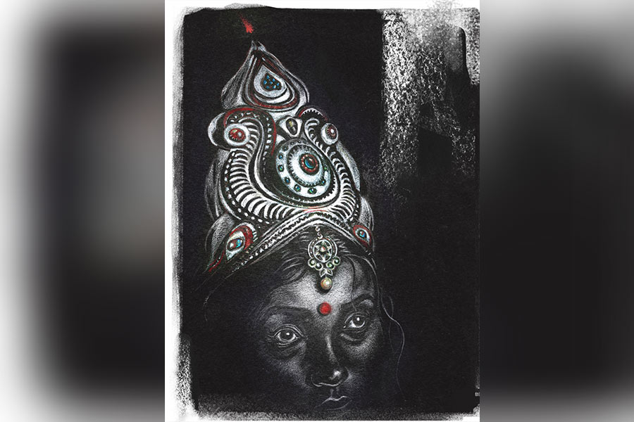

 
 <h1 align=center>অহল্যা</h1>
<h2 align=center>অংশু পাণিগ্রাহী</h2> ছাদে উঠতেই পাশের বাড়ির জানলা দিয়ে মুখ বাড়িয়ে চৈতালি বলল, “অলিদি, এত তাড়াতাড়ি! আমার পুচকুর যে স্নানই হয়নি...” 

“হ্যাঁ রে, আজ এক জায়গায় যাওয়ার কথা,” ভেজা কাপড় দড়িতে মেলে দিয়ে বললাম।

“তার মানে, এই দস্যি মেয়েকে খাওয়াতে আজ কালঘাম ছুটবে।”

মুখ শুকিয়ে গেল চৈতালির।

আগে ওর কথায় কষ্ট হত। এখন সয়ে গেছে। তা ছাড়া আজ অন্য এক উত্তেজনা কাজ করছে আমার মধ্যে। চৈতালির উদ্দেশে ছোট করে হাসলাম। শরৎ কাল। ঝাঁ-ঝাঁ করছে রোদ। আকাশের দরাজ নীল বুকে সাদা মেঘের পাশাপাশি লাল টুকটুকে একটা ঘুড়ি ভেসে বেড়াচ্ছে। হু-হু হাওয়ায় গোঁত খেয়ে উঠে যাচ্ছে আরও উপরের দিকে। পরিচিত দৃশ্যটাকে আশ্চর্য সুন্দর মনে হল।

আজ সঞ্জীবের বাড়ি যাব। আড়াইটের ট্রেনে চাপলে ঘণ্টা দেড়েক বড়জোর। সঞ্জীব স্টেশনে থাকবে। স্টেশন থেকে হাঁটাপথে ওদের বাড়ি। 

সঞ্জীব ডিভোর্সি। আমার সহকর্মী। একই স্কুলে পড়াই আমরা। ওর সঙ্গে আমার সম্পর্কটা বিয়ের সম্ভাবনা তৈরি করবে, এমনকি কোনও পুরুষের সঙ্গেই আমি বিয়ের বন্ধনে আবদ্ধ হব, এ জাতীয় বাসনা গত ষোলো বছরে আমার মনের কোনও গহিন কোণেও উঁকি দেয়নি।

সঞ্জীব কখনও আমার হাত ধরেনি। আমিও ওর কাঁধে মাথা রেখে কোনও পার্কের নিভৃত প্রান্তে অথবা নদী-জলাশয়ের ধারে সময় ভুলে বসে থাকিনি। শুধু এক বার ভিড়ে ঠাসা বাসের ভিতর প্রবল ঠেলাঠেলিতে ওর উপর পড়ে গেছিলাম। খামচে ধরেছিলাম ওর বুকের জামা। টাল সামলাতে না-পেরে সঞ্জীবও আমার দুই কাঁধ চেপে ধরেছিল। ব্যস, স্পর্শ বলতে এটুকুই। ভালবাসাবাসির কথা ও কখনও মুখ ফুটে বলেনি। আমিও বলিনি। তবু দু’জনেই এক সময় অনুভব করলাম, দুই হৃদয়ের মধ্যে অদৃশ্য একটা সাঁকো তৈরি হয়েছে। ভাঙাচোরা মচমচে সাঁকো নয়। পোক্ত। ভরসা করে পা রাখা যায়। 

এই উপলব্ধি আমাকে এক দ্বন্দ্বের সামনে দাঁড় করিয়েছিল। বিশ্বাস করতে ইচ্ছে করছিল সঞ্জীবকে। তবু ঘরপোড়া গরু... আমার কি চোখ বুজে ভেসে পড়া উচিত?

মর্নিং স্কুলের পরে পাশাপাশি হেঁটে দু’জনে বাসস্ট্যান্ডে আসি। বাসের অপেক্ষায় মিনিট দশেক দাঁড়াতে হয়। সিট পেলে পাশাপাশি বসি। একটা সিট জুটলে আমাকে জোর করে বসিয়ে সঞ্জীব দাঁড়িয়ে থাকে। বলে, “তুমি বোসো। বাসের ভিড়ে লোকজন সুযোগ খোঁজে।”

আমি জোরে হেসে বলি, “নেহাত অন্ধ ছাড়া কেউই আমায় ছোঁবে না।”

আমার কথার বিপক্ষে সঞ্জীব যুক্তি পেশ করতে পারে না। চুপ করে যায়। আমি তখন ওকে দেখি। ছোটখাটো চেহারা। রং ময়লা। গালে খোঁচা-খোঁচা দাড়ি, চোখে মোটা চশমা। কোনও ভাবেই সুপুরুষ নয়। ভিড়ের মধ্যে মিশে যাওয়া চেহারা, একেবারেই চোখ টানে না। আমি আবার হাসি। অন্য মানুষের রূপের বিচার করছে অহল্যা! 

এ ভাবেই চলছিল, গতকাল সঞ্জীব বলল, “আমি বাড়িতে তোমার কথা বলেছি, অলি। মা তোমাকে দেখতে চেয়েছে। যাবে?” 

এ কী বলল সঞ্জীব! এর মানে তো... সহসা কোনও উত্তর জোগায়নি মাথায়। নতমস্তকে দাঁড়িয়ে ছিলাম। 

সঞ্জীব আবার বলল, “ভয় পাচ্ছ? এক বার সুন্দরী বৌ বাড়িতে এনে আমাদের যা হয়রানি হয়েছে, তার পর আর রূপ-টুপ মায়ের কাছে গুরুত্বপূর্ণ নয়। বুঝলে?” 

“আচ্ছা, যাব...” মুখ দিয়ে বেরিয়ে গিয়েছিল আমার। 

ছাদ থেকে নেমে এসে বসলাম আয়নার সামনে। নিজেকে খুঁটিয়ে দেখলাম কিছু ক্ষণ। নাহ্, মোটেও ভাল দেখাচ্ছে না। আমার যা রূপ, তাতে এটাই স্বাভাবিক। জোর করে নিজেকে সুন্দরী দাবি করে কী লাভ? পথেঘাটে লোকজন প্রথম দর্শনে আমাকে একদৃষ্টে চেয়ে দেখে। তার পর মুখ ফিরিয়ে নেয়। আর ভুলেও তাকায় না। আমাকে দেখে সঞ্জীবের মায়ের প্রতিক্রিয়া কেমন হবে? যদি অসম্মান করেন? পূর্বতন অভিজ্ঞতা আমাকে বার বার সচেতন করছে।

ছোটবেলায় বাবার সঙ্গে আমি প্রায়ই যেতাম বাবার অভিন্নহৃদয় বন্ধু রঞ্জনকাকুর বাড়ি। কাকুর ছেলে অনিমিখ। সে আমার সমবয়সি, ক্লাসমেট, তার উপর বাবাদের সখ্য... আমাদেরও বন্ধুত্ব জমতে দেরি হয়নি।

স্কুলের পরে যে দিন টিউশন থাকত না, আমি গিয়ে অনিমিখের ঘরে ওরই বিছানায় শুয়ে থাকতাম। ওর বইয়ের তাক থেকে গল্পের বই নামিয়ে পাতা ওল্টাতাম। মূল উদ্দেশ্য সাহিত্যের রসাস্বাদন নয়। অনিমিখের বিছানায়, ওর বালিশে মুখ গুঁজে শুয়ে থাকতে আমার ভাল লাগত। অনিমিখ বাড়িতে থাকলে বিছানার পাশে স্টাডি টেবিলে পড়াশোনায় ডুবে থাকত। সর্বক্ষণ সিলেবাসের বইয়ে মুখ গুঁজে থাকা পড়ুয়া ছেলে সে।

এক দিন টের পেলাম, অনিমিখের জন্য আমি নিজের অজান্তেই মনের মধ্যে পৃথক একটা ঘর তৈরি করে ফেলেছি। ওকে সর্বক্ষণ নিজের মধ্যে নিয়ে বেড়াচ্ছি। ওর থেকে শুধু বন্ধুত্ব নয়, আরও বেশি কিছুর প্রত্যাশা। অভূতপূর্ব এক ভাল-লাগার আবেশ আমাকে ঘিরে ধরল। মাটিতে পা পড়ছে না, উড়ে বেড়াচ্ছি আমি। উষ্ণমণ্ডলের এই আকাশেও শুধু আমার জন্য অরোরা তৈরি হচ্ছে। আমি এমনিতেই পড়াশোনা কম করি। তার উপর এই সব। উচ্চ মাধ্যমিক মাথায় উঠল।

সে দিন জানলার বাইরে ছাতিম গাছটায় ঝেঁপে ফুল এসেছিল। তার মাতাল করা গন্ধে অনিমিখও মাঝে-মাঝে উদাস হয়ে যাচ্ছিল। আমার ষষ্ঠ ইন্দ্রিয় বলল, আজই মোক্ষম দিন। এমন দিনেই মনের কথা বলতে হয়। 

আমার তরফে প্রেমপ্রস্তাব পেয়ে অনিমিখ প্রথমে হকচকিয়ে গিয়েছিল। হাঁ করে চেয়ে ছিল আমার দিকে। তার পর হো-হো অট্টহাসিতে ফেটে পড়েছিল। 

আমি বিস্মিত হয়ে বলেছিলাম, “আমি সিরিয়াস, অনি!”

অনিমিখের হাসির প্রাবল্য বেড়ে গিয়েছিল। বলেছিল, “আয়নায় মুখ দেখেছিস কখনও নিজের? কী কুৎসিত তুই! বীভৎস।”

“তাতে কী হয়েছে? ভালবাসা কি এ সব দেখে হয়?”

“গাঁজা টেনেছিস তুই? তোর গায়ের রং আলকাতরার মতো। কোদালের মতো বড় বড় দাঁত। হাসলে মাড়ি দেখা যায়। ব্যাঙের মতো খসখসে চামড়া। হাড্ডিসার শরীর। এই নিয়ে তুই ভালবাসা খুঁজছিস?... যা ভাগ! আমাকে পড়তে দে।”

অনিমিখের প্রত্যেকটা বাক্যই ঠিক। কিন্তু ও শুধু কথাগুলো বলছিল না, একটা করে চাবুকের বাড়ি মারছিল আমার গায়ে। দাগ হয়ে যাচ্ছিল। চিরস্থায়ী দাগ। যৌবনোদ্গমের সময় তখন, কংক্রিটের কাঁচা ঢালাই, কোনও ছাপ বসে গেলে অক্ষয় হয়ে থেকে যায়। আমারও তা-ই হয়েছিল। অনিমিখের বাড়ি আর যাইনি। ক্লাসে, রাস্তাঘাটে দেখা হয়েছে। কথা বলিনি। প্রেমে প্রত্যাখ্যাত হওয়াটা বড় নয়, বুকে বেজেছিল প্রেমাস্পদের করা ওই অপমান। এর পর আর কেউ আমার সামনে ফুল হাতে হাঁটু গেড়ে বসেনি। আমিও ভিতরে-ভিতরে জমাট বেঁধে গেছি। বাবা দু’-এক বার বিয়ের প্রসঙ্গ, ঘটকের কথা তুলেছে, রাজি হইনি। কুৎসিত মেয়ের একা থাকাই ভাল।

ট্রেনে বসে বার বারই মনে হচ্ছিল মাঝের কোনও স্টেশনে নেমে যাই। আমার মতো কদাকার মানুষ সচরাচর দেখা যায় না। আমার এই কুরূপ দেখিয়ে পাশের বাড়ির নতুন বৌ চৈতালি তার শিশুকন্যাকে ভাত খাওয়ায়। আমি ছাদের আলসেতে ভর দিয়ে দাঁড়িয়ে থাকি। বাচ্চাটা ত্রস্ত হয়ে তাড়াতাড়ি খাবার গিলে ফেলে। 

ফেসবুকে আমাকে নিয়ে মিমের ছড়াছড়ি। এক বার কী কুক্ষণে নিজের ছবি দিয়ে ফেসবুকে অ্যাকাউন্ট খুলে ফেলেছিলাম। রাস্তাঘাটে অত লোকের মাঝে বেরোই, ফেসবুকে আর অসুবিধে কী? কিন্তু কারা যেন আমার ছবির সঙ্গে ক্যাপশন জুড়ে বন্ধুদের ট্যাগ করতে শুরু করল। যেমন, ‘এই সুন্দরীর সঙ্গে শুধু সৌরভেরই বিয়ে হবে’, অথবা ‘আকাশ নামের ছেলেদের বৌ এ রকম হবে’। ছবির নীচে হাজার-হাজার হাসির প্রতিক্রিয়া। 

আজ সব এক সঙ্গে মনে পড়ছে। হুড়মুড় করে তুষারধসের মতো নেমে আসছে। এই ফাঁকে কখন যেন গন্তব্যে পৌঁছে গেছি। সঞ্জীব স্টেশনে আমার জন্য দাঁড়িয়ে ছিল। 

সঞ্জীবের প্রাক্তন স্ত্রী নাকি ছিল ডাকসাইটে সুন্দরী! পাকা গমের মতো রং, পানপাতা মুখে মুক্তোর মতো দাঁতের সারি... গরিব বাড়ির মেয়ে। শিক্ষাগত যোগ্যতা উচ্চ মাধ্যমিক। সম্বন্ধ করে বিয়ে। রূপ দেখেই মাথা ঘুরে গিয়েছিল পাত্রপক্ষের। তবে বিয়ে টেকেনি। মাস চারেকের মধ্যেই পুরনো প্রেমিকের সঙ্গে পাখি উড়েছে। এমনিতেই বিয়ের পর থেকে সঞ্জীবের মা নাকি মেয়েটাকে সহ্য করতে পারছিলেন না। বিদ্যাবুদ্ধি নেই, রূপের গর্বে সর্বক্ষণ মটমট করছে। তাই আর সুন্দরী বৌ চাই না। অর্থাৎ কুৎসিত হওয়ার যোগ্যতা নিয়ে আমি সঞ্জীবের বাড়ি যাচ্ছি। এক বার মনে হয়েছিল, আমি কুরূপা বলেই কি সঞ্জীবের সঙ্গে সম্পর্ক এত দূর গড়িয়েছে? যদি তা-ই হয়, ক্ষতি কী? সুশ্রী, ফর্সা হওয়াটা যদি পাত্রীর গুণ হিসেবে বিবেচিত হয়, কেলেকুচ্ছিত রূপও ক্ষেত্রবিশেষে পাত্রপক্ষের চাহিদা হতে পারে। কেউ আমাকে বিয়ে করবে ভেবেছে, এই তো অনেক।

বড় রাস্তা থেকে গলির মধ্যে ঢুকে সঞ্জীব বলল, “টেনশন হচ্ছে?”

“হ্যাঁ। একটু...” বললাম আমি।

সঞ্জীব এই প্রথম আমার খসখসে হাত চেপে ধরল আলতো করে। ওর আশ্বাসে উৎকণ্ঠা সামান্য কমল।

আমাদের জন্য বাড়ির দরজা খুললেন সঞ্জীবের মা। আমাকে দেখেই তাঁর মুখের আলো ঝপ করে নেমে গেল কয়েক ওয়াট। মনে হল, ভদ্রমহিলা চারটে নিমপাতা চিবোতে চেয়েছিলেন, অথচ পরিবেশিত হয়েছে এক গ্লাস করলার রস। অপ্রস্তুত ভাবটা কাটিয়ে উঠে মহিলা বললেন, “তোরা বসে কথা বল, আমি রান্নাঘরের দিকটা দেখে আসছি।”

শুরুতেই ছন্দপতন! সিঁদুরে মেঘ দেখলাম আমি।

সঞ্জীবের ঘরের জানালার সামনে পড়ার টেবিল, দেওয়ালে রবীন্দ্রনাথের প্রতিকৃতি, আলমারিতে বইয়ের সারি, আলমারির মাথায় বিষ্ণুপুরের ঘোড়া-ডোকরার মূর্তি... গড়পড়তা শিক্ষিত মধ্যবিত্ত বাঙালির গৃহসজ্জা।

ঘণ্টাখানেক কেটে গেছে। সেই যে রান্নাঘর দেখতে গেছেন মহিলা, এখনও ফেরেননি। সঞ্জীব উসখুস করছে। আমাকে একা বসিয়ে ভিতরের খবর জানার জন্য উঠে যেতেও পারছে না। তাতে অভদ্রতা করা হয়।

এই সময়ে সঞ্জীবকে উদ্ধার করতেই যেন ওর বাবা এসে ঢুকলেন। আমি প্রণাম করতে উদ্যত হতে ভদ্রলোক বললেন, “থাক, থাক। আমরা যথেষ্ট আধুনিক।”

“আমি রান্নাঘর থেকে আসছি,” বলে সঞ্জীব বেরিয়ে গেল। ওর মুখে উদ্বেগের কালো মেঘ। যেমন আশা করেছিল, ঘটনা তেমন এগোচ্ছে না। কোথায় যেন তাল কেটে গেছে। 

ওর বাবা টুকটাক প্রশ্ন করছিলেন। পাহাড় না সমুদ্র, মেসি না রোনাল্ডো, বিরাট না স্মিথ, শিঙাড়া না জিলিপি...

সঞ্জীবের মা এক ফাঁকে জলখাবার বোঝাই ট্রে নামিয়ে দিয়ে থমথমে মুখে বললেন, “খাও। আমার শরীরটা আজ ভাল নেই। মাইগ্রেনের ব্যারাম আছে। কিছু মনে কোরো না...”

সঞ্জীব পিছন-পিছন এসেছিল। এক বার মায়ের দিকে, আর এক বার আমার দিকে চেয়ে বোকার মতো হাসল। 

আমি মাথা নাড়তেই ভদ্রমহিলা বেরিয়ে গেলেন। ভদ্রলোক তখনও শাহরুখ না হৃতিক, ব্রাজিল না আর্জেন্টিনা, জীবনানন্দ না রবীন্দ্রনাথ করে চলেছেন। বুঝলাম, এখানে বসে থাকা অর্থহীন। ঘড়ির দিকে এক ঝলক তাকিয়ে বললাম, “আমি আজ উঠি কাকু। টিউশন আছে। বেশি দেরি করলে গার্জিয়ান আবার...” 

রবিবার আমার টিউশন থাকে না। সঞ্জীব জানে। তবু আমাকে বাধা দিল না। এগিয়ে দিল দরজা পর্যন্ত। বলল, “রাতে কল করব।” 

আমি ওর দিকে নিষ্পলক তাকিয়ে রইলাম। ওর ক্ষমাপ্রার্থী কাতর চোখদুটো দেখে আমারও চোখ ফেটে জল এল। মুখ ঘুরিয়ে হাঁটতে শুরু করলাম দ্রুত।

কোনও রূপকথা রচিত হয়নি। অহল্যা আবার রক্তাক্ত হয়েছে। আরও এক বার ভালবাসার ফাঁদে পা দিয়ে ফিরছে মান খুইয়ে।

ব্যাহত দৃষ্টির শিশুপুত্রের নাম পদ্মলোচন হলে আমার নাম অহল্যা কেন নয়! এমন ভেবেই কি বাবা-মা আমার নামকরণ করেছিল? এক বার জিজ্ঞেস করতে হবে। 

নিজেকে সান্ত্বনা কী ভাবে দেব, সারা রাত বিছানায় এ পাশ-ও পাশ করেও সিদ্ধান্তে পৌঁছতে পারিনি।

রাতে সঞ্জীবের ফোন আসেনি। আসার কথাও নয়। আমার সমস্ত আশাভঙ্গের শেষ অঙ্ক আমার সামনেই ওর বাড়িতে অভিনীত হয়ে গিয়েছিল। আগে এক বার বিয়ে ভেঙেছে। বাবা-মায়ের বিপরীতে দাঁড়িয়ে নিজের সিদ্ধান্তে অবিচল থাকার, তাকে রূপায়িত করার মনের জোর হারিয়েছে সঞ্জীব। আর অশান্তি চায় না।

আজ স্কুলে যাইনি। স্নানের কাপড় মেলতে এসে দেখলাম, কালকের সেই লাল ঘুড়িটা পত্রহীন একটা মরা গাছের শাখা-প্রশাখার ফাঁকে আটকে আছে।

“অলিদি, আজ এক্কেবারে ঠিক সময়ে...” এক গাল হেসে চৈতালি ভাতের গ্রাস গুঁজে দিল সন্তানের মুখে। আমি হাসলাম। শিশুটি ভয়ে কুঁকড়ে গেল আরও।

আমার কদর্য রূপ ব্যবহার করে চৈতালি উপকৃত হচ্ছে, হবেও। আমার বিষিয়ে-ওঠা ক্ষতগুলো সম্পর্কে ওর কোনও ধারণা নেই। শিশুকে অনায়াসে খাওয়াতে পেরেই প্রসন্ন। ফেসবুকেও আমার ছবি দিয়ে মিম তৈরি হবে। রাস্তাঘাটে লোকজন ফিরে তাকাবে না। কেউ কেউ হয়তো শিউরে উঠবে। স্কুলের স্টাফরুমে সহকর্মীদের মধ্যে চাপা হাসাহাসিও হবে ‘জলার পেতনি’-কে নিয়ে। এ ভাবেই চলবে সব কিছু। আমার জীবন এমনই। এই নিয়েই আমাকে বাঁচতে হবে।

নিজের অপমানের কথা বার বার ভাবতে চাই না। প্রত্যেক মানুষেরই বহুমাত্রিক কষ্ট আছে। তবু মানুষ নিজেকে নানা কায়দায় ভুলিয়ে শোক, তাপ, দুঃখ অতিক্রম করে বেঁচে থাকে, সুখী হওয়ার চেষ্টা করে, শিশুরা যেমন খেলনা পেলে বাকি সব ভুলে থাকে। আমাকেও ওই খেলনাটার সন্ধান পেতে হবে। বাকি দুনিয়া থেকে বিচ্ছিন্ন থাকার চাবিকাঠি। এটুকুই আমার হাতে আছে। নিজের জন্য এর বেশি আর কী-ই বা করতে পারি!

পাঁজরভাঙা দীর্ঘশ্বাসের মতো হাওয়া বয়ে যায় একটা। অজান্তেই চোখ চলে যায় সেই ঘুড়িটার দিকে। লাল ঘুড়িটা নড়ে ওঠে শুধু। তার সব উড়ান মিথ্যে হয়ে গেছে। এক জায়গায় আটকে থেকে আস্তে আস্তে ছিঁড়েখুঁড়ে যাওয়াই তার নিয়তি, জানতে পেরে গেছে সে।

ছবি: মহেশ্বর মণ্ডল