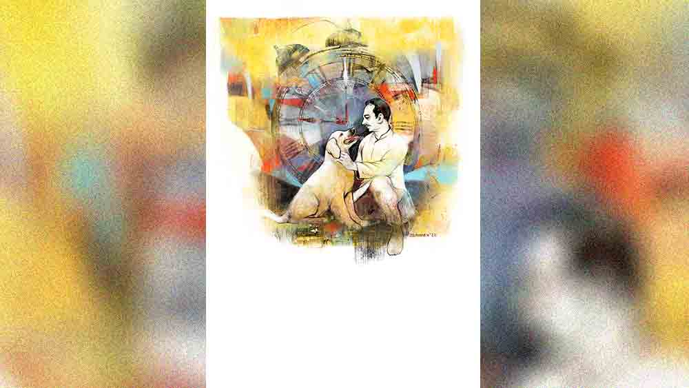

 
 <h1 align=center>অ্যালার্ম</h1>
<h2 align=center>আনন্দদীপ চৌধুরী</h2> রাতে ঘুম আসত না কিছুতেই। এ পাশ-ও পাশ চলত সমানে। কখন যে ঘড়ির অ্যালার্মটা বেজে উঠবে কে জানে! অ্যালার্ম দেওয়ার এই এক অসুবিধে। ঘুম এক বার ভাঙলে আর রক্ষে নেই। খালি মনে হত এই বুঝি বাজবে সে। আর এক বার বাজতে শুরু করলে থামারও নাম করত না সহজে।

অগত্যা অ্যালার্ম বন্ধ করতে দৌড়তে হত আমাকেই। যথাসময়ে বন্ধ না হলেই আমার রাজপুত্তুর ছেলে সাতসকালে বিকট চিৎকারে বাড়ি মাথায় তুলবে একেবারে। সুন্দর শান্ত সকালে এমন বেমানান চিৎকার শ্রুতিকটু শোনায় বেশ। অতঃপর রাতে এক বার ঘুম ভেঙে গেলে ঘড়ির অ্যালার্ম বন্ধ করার ভাবনায় ঘুমের বারোটা বেজে যেত আমার।

বছরখানেক হয়ে গেল অ্যালার্ম দেওয়ার অভ্যেসটা ছেড়েছি আমি। প্রয়োজনই পড়েনি তার। আর পড়বেই বা কেন? ঝপাং যে এ কাজে একাই একশো। এ বাড়িতে আসার মাস তিন পর থেকেই সকাল ছ’টায় এমন ভৌ ভৌ শুরু করল যে, অ্যালার্ম দেওয়ার অভ্যেস পাকাপাকি ভাবে জীবন থেকে বিদায় দিলাম আমি।
অভিজ্ঞতা থেকে দেখেছি ঘড়ির অ্যালার্মও টেকনিক্যাল কারণে বিগড়োয়। কিন্তু ঝপাং বিগড়োয়নি কোনও দিন। এক বার তো প্রবল অসুস্থ শরীরেও বিশ্বাসী সহচরের মতো দায়িত্ব পালন করেছিল ও।

যাই হোক, ঝপাংয়ের অসুস্থতার কথাতেই বড় বয়সে হওয়া পাপাইয়ের অসুস্থতার কথা মনে পড়ল হঠাৎ। সে বার বোধ হয় ভাল মতোই অসুস্থ হয়েছিল পাপাই। না কি অসুস্থতার ভান করেছিল লাটসাহেব! আরে বাবা নিজের ছেলেকে চিনব না আমি! ছেলেটা তো অমনই। কোনও জিনিস নিয়ে এক বার বায়নাক্কা শুরু করলে রেহাই নেই আর। কাঙ্ক্ষিত জিনিসটি হস্তগত না হওয়া অবধি এমন অসুস্থতারই ভান করে যায় সে। সদ্য উনিশ পেরিয়েও ছেদ পড়েনি সেই ছোটবেলার অভ্যেসে।

সেল্‌সের চাকরির কারণে কম মানুষের সঙ্গে তো মিশিনি জীবনে! সে মেশার সুবাদে দেখেছি প্রত্যেক মানুষেরই জীবনে কিছু সুনির্দিষ্ট শখ বা হবি থাকে। পাপাই কিন্তু সে দিক থেকে ব্যতিক্রম। সেই ছোট থেকেই দেখেছি, তেমন কোনও নির্দিষ্ট শখ নেই পাপাইয়ের। থাকবেই বা কী করে! বছর ঘোরার সঙ্গে সঙ্গে তার শখেরও পরিবর্তন ঘটে যে! এই যেমন এক বার পড়ল মাছের অ্যাকোয়ারিয়াম নিয়ে। পয়সার বিনাশ ঘটিয়ে কত কিছু যে কেনা হল ইয়ত্তা নেই তার! ইয়া বড় অ্যাকোয়ারিয়াম, এত্তগুলো রঙিন মাছ, নাম না-জানা কত শত সরঞ্জাম। কিন্তু বৃথা গেল সবই। এক বছরের বেশি টেকসই হল না সে শখ।

অ্যাকোয়ারিয়ামের শখ মিটতে না মিটতেই খোলা বাতাসে থাকা ক্ষণস্থায়ী কর্পূরের মতো উদয় হল বাগান করার শখ। মাটি, টব, গাছ, সার সব কিছুই কেনা হল সে শখপূরণে। কিন্তু বছর ঘুরতে না ঘুরতেই সিকির মতো অচল হয়ে গেল বাগানের সে শখও। গেল বছর আবার পড়েছিল কুকুর নিয়ে। হ্যাঁ, বাড়িতে বিদেশি কুকুর পোষার মত শখও জাগ্রত হয়েছিল আমার পাপাইয়ের মস্তিষ্কে।

যদিও ঠারেঠোরে বুঝিয়েছিলাম, মাসে ত্রিশ হাজারি কর্মচারীর ছেলের এমন শখ বাতুলতা। কিন্তু ভবি যে ভোলবার নয়। গুরুতর অসুস্থতার এমন নাটকবাজি শুরু করল যে কোলিগের থেকে বারো হাজার টাকা ধার করে পূরণ করলাম নবাবপুত্তুরের সে শখও। হ্যাঁ, বড় রাস্তার সামনের বিখ্যাত পেট সেন্টার থেকে কিনে আনলাম আড়াই মাস বয়সের একটি হলুদাভ ল্যাব্রাডরের ছানা।

প্রথম প্রথম কী মাতামাতিই না হত ওকে নিয়ে। সেই মাতামাতিতে পাপাইয়ের সঙ্গে সঙ্গে শামিল হয়েছিল সোমাও। প্রথম দিন থেকেই বাড়ির সমস্ত ভালবাসার ভরকেন্দ্র হয়ে উঠেছিল আড়াই মাসের সারমেয় ছানাটি। প্রথম দু’রাত ওর কুঁইকুঁই কান্না শুনে বাচ্চাটির উপর বড় কষ্ট হয়েছিল পাপাইয়ের, তাই নিজের খাটে ওকে সঙ্গে করে শুয়েছিল সে। পাপাইয়ের হঠকারী মনোভাবের মাঝে স্নেহপ্রবণ কোমল হৃদয়ের পরশ দেখে তুষ্ট হয়েছিলাম সে দিন। মনে হয়েছিল আমার ছেলেটির মন কোমল, প্রাণে দয়ামায়া আছে। পিছিয়ে ছিল না সোমাও। ছোট্ট ছানাটিকে সময়মতো খাওয়ানোর দায়িত্ব নিজের কাঁধে তুলে নিয়েছিল সে। লক্ষ করে দেখেছি দায়সারা ভাবে নয়, বরং স্নেহশীলা মায়ের মতোই বুকভরা যত্ন নিয়ে সে দায়িত্ব পালনে করে গিয়েছে সহধর্মিণী।
গত কয়েক বছর ধরেই সোমার এক অদ্ভুত আচরণ লক্ষ করেছি আমি। সাংসারিক কাজে হাঁপিয়ে উঠলেই বিরক্ত হয়ে ওঠে সে। দু’-একটি কটু কথা শুনিয়ে দিতেও ছাড়ে না তখন। কিন্তু কুকুরছানার যত্নআত্তি করা নিয়ে এতটুকু বিরক্ত হতে দেখিনি তাকে। বরং হাসিমুখে বাচ্চাটিকে খাওয়ানোর প্রচেষ্টায় শশব্যস্ত থাকত সোমা। কুকুরছানার সে আকস্মিক আগমন স্ত্রী, পুত্রের মুখে এমন হাসি ফুটিয়েছিল, যে আমার বারো হাজার টাকা ধার নেওয়ার দুঃখও ভুলিয়ে দিয়েছিল অনায়াসে।

এর পর আসে কুকুরছানার নামকরণের পালা। বহু জল্পনাকল্পনার পর শেষ পর্যন্ত আমার দেওয়া নামেই সিলমোহর পড়ে সর্বসম্মতিক্রমে। কুকুরছানার নাম রাখা হল ঝপাং।
ওকে দেখভালের সব দায়িত্ব স্ত্রী-পুত্র নিলেও ঝপাং বরাবরই আমার একটু বেশি ন্যাওটা। তা না হলে সন্ধেয় অফিসফেরত বাড়ির বাইরে এসে দাঁড়ালেই আমার উপস্থিতি টের পায় কী করে? আর টের পেলেই ভৌ ভৌ শব্দে সবাইকে জানান দেয় ও।

নতুন অতিথির উপস্থিতিতে বেশ কয়েকটা মাস মহানন্দেই কাটে আমাদের। অপ্রাপ্তির গতানুগতিক হিসেবনিকেশ স্মৃতির মেনুকার্ডে বড় একটা স্থান পেত না তখন। ও দিকে পরিবারের স্নেহধন্য সদস্য হিসেবে একটু একটু করে বড় হতে থাকে ঝপাং-ও। সময়ের গতিতে ছোট্ট ঝপাং দুধ ছেড়ে খেতে শেখে ভাত আর সেদ্ধ চিকেন। টুকটাক রকমারি খাবার খেতেও দিনে দিনে পটু হয়ে ওঠে ও। ক্রমে ডাক্তারের সুপরামর্শে আর সান্যালবাড়ির আদরে কলেবরে দীর্ঘকায় হতে থাকে আমাদের আদরের ঝপাং।

এই মাস তিন আগে এক বছর পূর্ণ হল ওর। সেদিনকার ছোট্ট ঝপাং বেশ ভাল উচ্চতায় লাফাতে পারে এখন। খেলার বলটা ছুড়ে দিলে ক্ষিপ্র বেগে তা কুড়িয়ে আনতেও দক্ষ ও। ঝপাং খুবই অ্যাকটিভ আর ফিট। ছোট থেকেই রোজ সকালে আমার সঙ্গে হাঁটতে যাওয়াটা ওর অভ্যেস। আর  আমি অফিস থেকে ফিরলে কী দাপাদাপিই না শুরু করে ব্যাটা! গায়ে হাত দিয়ে আদর না করা অবধি সে  অস্থিরতা থামায়ও না সচরাচর।

আচ্ছা, অস্থির তো আমিও হতাম মাঝে মাঝে। আসলে তিরিশ হাজার টাকা বেতনে সমস্ত খরচ কুলিয়ে ওঠার প্রাণপণ চেষ্টাই উচাটন করত মনটাকে। আর উদ্দাম মাতাল ঝড়ের মতো দোদুল্যমান মানসিক সেই উচাটনই এই অস্থিরতার উৎস। তবু অদৃশ্য শক্তির ক্রাচে ভর দিয়ে খুঁড়িয়ে খুঁড়িয়ে চলছিল এ সংসার। তালটা কেটে গেল গত সপ্তাহে। হঠাৎই। যখন নতুন শখের তোড়জোড় নিয়ে হাজির হল পাপাই, “বাবা, একটা কথা ছিল। বলা যাবে?”

ছেলের এ ধরনের ভূমিকায় বরাবরই অশনিসঙ্কেত টের পাই আমি। সে দিনও পেয়েছিলাম। কিন্তু তা গোপন করেই বলেছিলাম, “কী বলবি? বলে ফেল।”
“বলছিলাম!” পাপাই সহজাত অভ্যেসের ধারা বজায় রেখে বলেছিল, “জিম জয়েন করব ভাবছি। বাইসেপ্স, ট্রাইসেপ্স ঠিকঠাক না হলে কলেজে পাত্তা পাওয়া যায় না আজকাল।”
সহজ উপায় বাতলেছিলাম আমি, “সে তো টুকটাক সরঞ্জাম কিনে বাড়িতেই করা যায়।”

“বাড়িতে সব হলে জিমগুলো তো আর গজিয়ে উঠত না বাবা। তা ছাড়া জিম করলেই হয় না, ডায়েট চার্টও মানতে হয়। জিম ইনস্ট্রাকটারই একমাত্র সে ব্যাপারে সঠিক গাইড করতে পারেন,” যুক্তির আঠা লাগিয়ে নির্মেদ বক্তব্য পেশ করেছিল পাপাই।

বললাম, “জিমের সঙ্গে আবার মানানসই ডায়েটের খরচ! সে তো অনেক টাকার ধাক্কা রে!”

নিষ্ঠুর কণ্ঠস্বরে উপায় বাতলেছিল পাপাই, “বাবা, অনেক দিন তো হয়ে গেল, ঝপাং এ বাড়িতে আছে। দেখো না, এখন কোনও একটা ডগ শেল্টারে যদি রাখা যায় ওকে।”
বিস্ময়ে হতবাক হয়ে গেলাম! কী র্স্পধা ছেলের! বাড়ির সদস্যকে বাইরে রাখার কথা বলে কী করে সে? কথাটা শুনেই রাগ হয়েছিল খুব। কষিয়ে ধমক দিতে যাব ভেবেছিলাম। কিন্তু তা না করে সোমাকে সে ঘরে ডেকেছিলাম দ্রুত। তার পর সব কথা জানিয়েছিলাম তাকে। ঝপাংকে খুব ভালবাসে সোমা, আশা ছিল সোমা কষে ধমকাবে ছেলেকে। কিন্তু কোথায় কী! পুরোটা শুনেও পাপাইয়ের সামনে নিশ্চুপ রইল সোমাও। তবে কি পাপাইয়ের অভিসন্ধিতে পূর্ণ সায় ছিল তারও! হবে হয়তো। নীরবতাই যে সম্মতির লক্ষণ।

চূড়ান্ত মনঃকষ্ট নিয়ে একটা সপ্তাহ কাটালাম এর পর। গতকালই গিয়েছিলাম পরিচিত এক বন্ধুর বাড়ি। সেখান থেকে বন্ধুর পরিচিত এক অ্যানিম্যাল শেল্টারের ঠিকানা জোগাড় করেছি। ঠিক করলাম কেউ যখন চায় না, তখন ঝপাংকে সেখানেই রেখে আসব আমি।

অ্যানিম্যাল শেল্টারটি বাড়ি থেকে  প্রায় পনেরো কিলোমিটার। সকাল ছ’টা থেকে আটটার মধ্যে গোটা কাজটা সারার প্ল্যান করলাম। বেশি দেরি হলে অফিস মিস হবে।

সব কিছু ঠিকঠাকই চলছিল এর পর। এক্কেবারে নিখুঁত প্ল্যানমাফিক। ঘড়ির অ্যালার্মটা ভোর সাড়ে চারটেয় সেট করেছিলাম আমি। বিনিদ্র রজনীর সমাপ্তি ঘটিয়ে এই সবে বাজল সেটা। উঠেও পড়লাম তড়িঘড়ি। ভেবেছিলাম স্নান, বাথরুম সেরে ঝপাংকে নিয়ে একটা অ্যাপ ক্যাব বুক করে ডট সাড়ে পাঁচটায় বেরোব। কিন্তু বেরোব কী করে! কোনও এনার্জিই যে পাচ্ছি না আজ! মনটা বড় বিষাদগ্রস্ত হয়ে গিয়েছে আচমকা। মনের অজান্তেই মাথার মধ্যে বাজছে বিসর্জনের সুর। কিছু প্রশ্ন যেন হঠাৎই তিরবিদ্ধ করে বসেছে আমায়। ঝপাংকে চলে গেলে কাল সকালে কে জাগাবে আমায়? কে-ই বা আমার আদর পাওয়ার অধীর অপেক্ষায় বসে থাকবে? আমার প্রাতর্ভ্রমণের সঙ্গীই বা হবে কে? আর জুলজুল মায়াবী চোখে চাওয়া সর্বক্ষণের সঙ্গীকেই বা খুঁজে পাব কোথায়? প্রশ্নগুলোর উপর্যুপরি আঘাতে অন্তরটা গুমরে উঠতে থাকে আমার।

কী করব ঠাওর করতে পারি না ঠিক। আকাশপাতাল ভেবে দেখলাম, চাইলেই মাসে মাসে কিছু টাকা বাঁচাতে পারি আমি। বড় বাসরাস্তার মোড় থেকে আমার বাড়ি বড়জোর আড়াই কিলোমিটারের পথ। ওই পথটুকু অটোতে যাতায়াত করি রোজ। হেঁটে যাতায়াতে দৈনিক ষোলো টাকা বাঁচাতে পারি আরামসে। ও দিকে সকালের ছানা খাওয়াটা বাদ দিলে দুধের জন্য বরাদ্দ টাকাটাও জমে যাবে আমার। আর যদি একটু বেশি হেঁটে মধুপুরের বড় পাইকারি বাজারে যাই, তবে তো বাজার খরচেও রাশ টানা যাবে খানিকটা। তাই না! ইস! এ ভাবনা যে কেন আসেনি আগে, কে জানে! একটু কষ্ট সইলেই তো বেশ কিছু টাকা বেঁচে যাবে মাসে। আর তা হলেই হাজার ত্রিশের বেতনে সেঁটে যাবে জিম-সহ চারটি প্রাণীর সাংসারিক সব খরচ।

ভাবনাগুলো শেষ হতেই আমার চোখ গিয়ে পড়ে ঘড়িতে। পাঁচটা পনেরো বাজে। ঝপাংকে শেল্টারে পাঠানোর দুর্বুদ্ধি ঝেড়ে ফেলে টান টান হয়ে বিছানায় শুয়ে পড়ি আবার। অস্থির ভাবটা অনেকটাই কেটে গেছে এখন, হঠাৎই দুশ্চিন্তা অপহরণকারী কাঙ্ক্ষিত এক শান্তির উপস্থিতি টের পেতে থাকি মনে। অবাক হলাম বড়। আচ্ছা, মানসিক অবস্থার আকস্মিক এ পরিবর্তন কি নিছকই কাকতালীয়! না কি ঘড়ির অ্যালার্ম বন্ধ রাখার চাবিকাঠি পুনরুদ্ধারই এর মূল কারণ! আসলে কি আমরা আমাদের নিজেদের ইচ্ছে আকাঙ্ক্ষা সুবিধেগুলোই ভালবাসি শুধু? অন্য কিছু বা অন্য কাউকে নয়! স্ত্রী, ছেলে, আমি— কেউই কি এই নিয়মের ব্যতিক্রম নয়! সব ভালবাসাই সাময়িক, কিংবা অভিনয়! নির্দিষ্ট কারণ অনুসন্ধান করতে গিয়ে পঞ্চান্নর চৌকাঠে দাঁড়িয়েও আমি দ্বিধায় পড়ি ভীষণ।