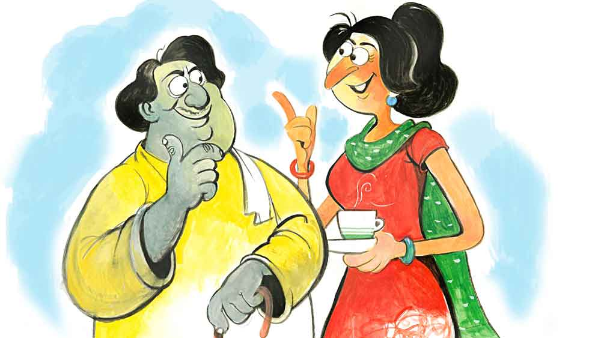

 
 <h1 align=center>আঁতাঁত</h1>
<h2 align=center>প্রভাত সরকার</h2> পকেটে হাত ঢুকিয়ে সিগারেটের প্যাকেটটা বার করতেই গিন্নি হাজির। তিতকুটে মুখে বললেন, “কী আর করবে! সারা দিন বসে বসে বিড়িই ফোঁকো যত পারো।”

মুকুন্দবাবুর গলা নিরুত্তাপ, “বিড়ি নয়, এটাকে সিগারেট বলে। আর আজ এটাই প্রথম।”

তাতে চিঁড়ে ভিজল না। গিন্নির গলায় হতাশা, “শেষ তো আর নয়। রাত পর্যন্ত কতগুলো যে... অবশ্য এ সব কথা তোমাকে বলার চেয়ে গাছকে বলা ভাল।”

মুচকি হাসি মুকুন্দবাবুর মুখে। তবে গিন্নি খুশি হন না সেই হাসিতে, বিরক্ত মুখেই বলেন, “একটা কাজের কথা বলি, মন দিয়ে শোনো। একটা বড় ভুল হয়ে গেছে আমাদের, বুঝলে। এক্কেবারে মনে ছিল না।”

নড়েচড়ে বসলেন মুকুন্দবাবু, “সে কী! এখনও কিছু আনতে বাকি আছে না কি! কাল তিন বার বাজার যেতে হয়েছে, আজ আমি আর পারব না বাজার যেতে।”

গিন্নির কপালে ভাঁজ, বললেন, “এ বারে আর আনতে হবে না, দিতে যেতে হবে।”

গিন্নির মুখে বিস্ময়ের দৃষ্টি রাখতেই গলা চড়ল গিন্নির, “ছেলের বিয়ে দিতে যাচ্ছ। খোকা এক বার দেখে এসে হ্যাঁ বলে দিলেই বিয়ের সানাই বেজে উঠবে কি? তুমি তো কোনও খবরই রাখো না! আমি খবর নিয়ে জানতে পেরেছি, এ বার যে  মেয়েটির সম্বন্ধ এসেছে, সেই মেয়েটি খুব ফর্সা, আমার তো ছবি দেখেই খুব পছন্দ হয়ে গেছে। জানি না কেন খোকাকে মেয়ে দেখতে যাওয়ার কথা বললেই জবাব দিচ্ছে, এখন খুব ব্যস্ত। আধবেলাও ছুটি দেবে না ম্যানেজার।”

মুকুন্দবাবুর ধৈর্য একেবারে তলানিতে, কারণ হাতে সিগারেট, অথচ গিন্নির বকবকানির চোটে ধরানো যাচ্ছে না, সামান্য গলা চড়িয়ে বললেন, “অত ধানাইপানাই ভাল লাগছে না। কী ভুল হয়েছে সেটা তাড়াতাড়ি বলো তো।”

গলা চড়ল গিন্নিরও, “বলি, হাজরাবাবুর মেয়ের ছবিটা কি ফেরত দিয়েছিলে? আমি ছবি দেখেই বুঝেছি, ও মেয়ের গায়ের রং খুব একটা ফর্সা হবে না। কিন্তু ওরা তো আশা করে বসে থাকবেন। পরিচিত ঘর, বাড়ির কাছাকাছিই থাকেন, কী মনে করবেন বলো তো!”

মুকুন্দবাবু বুঝলেন। তাঁর গলায় আক্ষেপের সুর, “এ হে! একেবারে খেয়াল ছিল না। আসলে খামটা তো কয়েক দিন টেবিলে দেখিনি। ব্যস, মন থেকে বিষয়টা বেরিয়ে গেছে! চোখের সামনে খামটা থাকলে নিশ্চয়ই ভুলে যেতাম না।”

গিন্নির গলায় বিস্ময়, “ও মা! আমি তো খামটা দেখতে না পেয়ে ভাবলাম তুমিই সরিয়ে রেখেছ। তা হলে কে সরাল খামটা! আমিও কয়েক দিন ধরে খামটা দেখিনি টেবিলে! আজ খোকার আলমারি থেকে পাঞ্জাবি বার করতে গিয়ে দেখি, খামটা পাঞ্জাবির নীচেই রাখা।”

রেগে গেলেন মুকুন্দবাবু, “আমি তোমার ছেলের আলমারিতে হাত দিই নাকি! আর কাণ্ডজ্ঞান বটে তোমার ছেলের! যে মেয়েটাকে বাতিল করেছ, তার ছবিটা আলমারিতে ঢুকিয়ে রেখে দিয়েছে। ওটা যে ফেরত দিতে হবে এটুকু বুদ্ধিও তার নেই!”

বরাবরের মতোই খোকার নামে অভিযোগ ভাল লাগল না গিন্নির, “সে ও রকম একটু-আধটু ভুলে যেতেই পারে মানুষ, আর কত কাজ বলো তো খোকার। তোমার মতো না কি! সারা দিন গুচ্ছের বিড়ি টেনে ঘরে ধোঁয়া দেওয়া ছাড়া কোনও কাজই নেই তোমার, তাও যদি ওই ধোঁয়ায় মশার উৎপাত একটু কমত!”

মুকুন্দবাবু কিছু বললেন না। নীরবে দাঁত কিড়মিড় করলেন।

বড় শ্বাস পড়ল গিন্নির, “অবশ্য আরও দুটো কাজ তুমি করো— মাসে এক বার পেনশন তোলা আর দু’বেলা ভরপেট চর্ব্যচোষ্য খেয়ে আমার রান্নার নিন্দে করা...”

একটু থেমে নতুন করে ভেবে নিয়ে গিন্নি বললেন, “আমার মনে হয়, বন্ধুদের দেখাবে বলেই হয়তো খোকা ছবিটা সরিয়ে রেখেছিল। হয়তো দেখানো হয়েও গেছে, তার পর ভুলে গেছে পাঁচ কাজে।”

মুকুন্দবাবুকে বোকার মতো চুপ করে দাঁড়িয়ে থাকতে দেখে তাগাদা দিলো, “যাও, দয়া করে দিয়ে এসো ছবিটা। এই তো মোড়টা পেরোলেই হাজরাদার বাড়ি। পাঁচ মিনিটের রাস্তা। কোনও দিন খবর নিতে এসে যদি দেখেন অন্য জায়গায় বিয়ের সব ঠিকঠাক হয়ে গেছে তা হলে...”

বাকিটা মুকুন্দবাবুই শেষ করলেন, “লজ্জার আর শেষ থাকবে না— তাই তো?”

এই কথাটাও আবার পছন্দ হল না গিন্নির, “ঠিক তা নয়। লজ্জা আবার কেন! লজ্জার কোনও কারণ নেই। মনে রেখো, আমরা ছেলেপক্ষ।”

মেয়েরাই যে মেয়েদের সবচেয়ে বড় শত্রু সে কথা কে না জানে! মনে মনে ভাবলেন মুকুন্দবাবু। মুখে বললেন, “তা হলে, কী বলব এত দিন পরে ছবিটা ফেরত দিয়ে?”

পিছনে দাঁড়িয়ে থাকা শ্যালিকা চটজলদি সমস্যাটার সমাধান করে দিল, “আরে দূর জামাইবাবু, একটা ছবিই তো, ছিঁড়ে ফেলে দিন। চাইলে বলবেন হারিয়ে গেছে।”

বাধা দিলেন গিন্নি, “না, না, সেটা অমঙ্গলের কাজ। তোর জামাইবাবু বরং এক্ষুনি দিয়ে আসুক ছবিটা।”

“সে-ই ভাল, দ্বিতীয় দফার চা-টা বরং ফিরে এসেই খাব!” বলে মুকুন্দবাবু বেরিয়ে গেলেন।

হাজরাবাবুর বাড়ি পৌঁছে দরজার বেল বাজাতেই মিষ্টি মুখের একটা মেয়ে দরজা খুলে দিল। অনুরোধ করল, “ভেতরে এসে বসুন, বাবাকে ডেকে দিচ্ছি।”

যেন কত কালের চেনা, এমন ভাবে বলল কথাটা। মুকুন্দবাবু চেয়ারে বসতেই প্রণাম করল মেয়েটা। হতচকিত হয়ে পড়লেন উনি। একেবারেই চেনে না, অথচ... নিশ্চয়ই হাজরাবাবু এই মেয়েটার ছবিই দিয়েছিলেন। রংটা খুব ফর্সা না হলেও মুখটা ভারী মিষ্টি। কথাগুলোও কী সুন্দর। মনে হল, খোকার বৌ হলে তো মন্দ হত না। মেয়েটা ভিতরের ঘরে যেতেই পকেট থেকে খামটা বের করে সামান্য ফাঁক করে ছবিটা এক বার দেখে নিয়ে নিশ্চিত হলেন, ছবিটা এই মেয়েটারই।

আসলে মাসখানেক আগে এক মুহূর্তের জন্য দেখিয়েছিলেন গিন্নি। তাও আবার খবর শোনার মাঝে। তাই ভাল করে দেখাও হয়নি মুখটা। আর দেখেও কোনও লাভ হবে না জেনেই আর দ্বিতীয় বার দেখতে চাননি, কারণ এই সংসারে গিন্নির কথাটাই শেষ কথা। পাত্রীর গায়ের রং দুধে-আলতা না হলে সঙ্গে সঙ্গে বাতিল। রেসিস্ট মহিলা! গায়ের রংটাই কি মানুষের সব! মনে মনে গজগজ করে ওঠেন মুকুন্দবাবু। তার উপর খোকার শখ রবীন্দ্রসঙ্গীত জানতেই হবে বৌকে।না হলে মামলা সঙ্গে সঙ্গে খারিজ। ধন্যি শখ বটে খোকার। নিঃশব্দে হাসলেন মুকুন্দবাবু।

হাজরাবাবু ঘরে ঢুকতেই উঠে দাঁড়িয়ে খামটা ওঁর হাতে ধরিয়ে দিয়ে মুকুন্দবাবু বললেন, “মা আমার খুব সুলক্ষণা...”

হাজরাবাবু সঙ্গে সঙ্গে স্টিয়ারিং ধরে ফেললেন, “সে আপনি খবর নিলেই জানতে পারবেন। বাড়িতে কয়েক জন গান শিখতেও আসে মেয়ের কাছে। তা ছাড়া কাছেই একটা স্কুলে গান শেখাতেও যায়। আর...” 

কথার মাঝেই ঢুকে পড়লেন মুকুন্দবাবু, “দেখি খোকা কবে আসবে এক বার এখানে, এখন ওর অফিসে কাজের চাপটাও খুব বেশি বুঝলেন,” খানিকটা ভেবে আন্দাজেই যোগ করলেন, “এখন তো আবার ক্লোজ়িং চলছে। তার নাকি কথা বলারও সময় নেই। তবে আপনাকে জানাবখোকা কবে...”

খামটা খুলেই হাজরাবাবু অবাক হলেন, “এ যে দেখছি ছেলের ছবিও দিয়েছেন! না, না,  ছবি দেওয়ার দরকার ছিল না। আমি তো মাঝে মাঝেই দেখি আপনার ছেলেকে রাস্তায় যখন কাজে যায়।”          

বোঝানোর চেষ্টা করলেন উনি, আমার মেয়েও বলেছে, “কলেজে পড়তে অনেক বার দেখেছে আপনার ছেলেকে। আমার মেয়ে যে বছর কলেজে ভর্তি হল, সেই বছরই নাকি আপনার ছেলের লাস্ট ইয়ার ছিল।”

মুকুন্দবাবু রীতিমতো ধন্দে। মাথায় কেমন যেন একটা ভাবনা ঘুরপাক খাচ্ছে। এলোমেলো একটা চিন্তা মাথা তোলপাড় শুরু করে দিয়েছে। এখন মনে পড়ল, এই ছবিটা দেখিয়ে গিন্নি বলেছিল, “খোকা বলেছে মেয়েটাকে চেনে। কলেজে নবীন বরণের অনুষ্ঠানে নাকি খুব ভাল গান গেয়েছিল।”

কী গান গেয়েছিল কে জানে! খোকা তো আবার রবীন্দ্রসঙ্গীতের অন্ধ ভক্ত। ঘুমোনোর আগে আধ ঘণ্টা রবীন্দ্রসঙ্গীত তার শোনা চাই। না শুনলে নাকি ঘুমই আসে না তার।

মনে পড়ল, গিন্নির খুব পছন্দ হওয়া একটা মেয়েকে শুধু রবীন্দ্রসঙ্গীত না জানার  কারণে এক কথায় বাতিল করে দিয়েছিল ছেলে। সেই নিয়ে মা-ছেলেতে মন কষাকষিও চলেছিল অনেক দিন।

হঠাৎ মনে হল, খোকার ছবিটা খামের মধ্যে কী করে ঢুকে পড়ল! খোকার মায়ের তো এ মেয়ে পছন্দ নয়। সে তো রাখবে না! তা হলে! আর সেটা আলমারিতে অতযত্ন করে পাঞ্জাবির নীচে খোকা ছাড়া কে-ই বা...!

মাথাটা কেমন যেন গুলিয়ে যেতে শুরু করল। এত ক্ষণ হাজরাবাবু মেয়ের নামে কী যে সব বলে গেলেন, কানে গেল না ওঁর। হঠাৎ প্রশ্ন করে বসলেন, “আচ্ছা আপনার মেয়ে কি কলেজে নবীন বরণ উৎসবে রবীন্দ্রসঙ্গীত গেয়েছিল?”

হেসে ফেললেন হাজরাবাবু, “সে তো অনেক দিন আগের ব্যাপার, ঠিক মনে করতে পারব না। তবে রবীন্দ্রসঙ্গীতটা ও ভালই গায়। আর এখনও রবীন্দ্রসঙ্গীতই শেখে। আকাশবাণীতে অডিশনও দিয়েছে।”

হাসলেন মুকুন্দবাবু, “বুঝলাম বুঝলাম! খোকা কবে আসবে ফোনে জানিয়ে দেব। নম্বর তো আছেই আমার কাছে।”

মেয়েটি কখন এসে দাঁড়িয়েছে পাশে, লক্ষই করেননি মুকুন্দবাবু। 

“আজ তা হলে আসি,” বলে ওঠার উপক্রম করতেই মেয়েটি বলল, “একটু বসুন, চা প্রায় হয়ে এসেছে। চা খেয়ে যাবেন।”

ভিতরে ভিতরে অস্থির হয়ে পড়লেন মুকুন্দবাবু, এখনই গিন্নিকে গিয়ে সব বলা দরকার, তাড়াহুড়ো করে বললেন, “না মা, আমি চা খেয়েই বেরিয়েছি।”

হাসল মেয়েটি, “আপনি তো চা ভালবাসেন।”

হাঁ হাঁ করে উঠলেন উনি, “সে তো বাসি কিন্তু...” 

আবার হাসল মেয়েটি, “ভাববেন না, চিনি ছাড়াই দেব আপনাকে।”

চমকে উঠলেন মুকুন্দবাবু, মনের ভিতরে দ্রুত ঘুরপাক খেল কয়েকটি কথা— ‘চা ভালবাসি ওর জানা। আবার চিনি ছাড়া চা খাই তাও মেয়েটার জানা। তা হলে খোকাই বলেছে নিশ্চয়ই, না হলে কে আর...’

“না গো মা, আজ খুব জরুরি একটা কাজ আছে, অন্য দিন এসে বরং খেয়ে যাব,” বলেই তাড়াতাড়ি বেরিয়ে পড়লেন মুকুন্দবাবু। রাস্তায় বেরোতে বেরোতে বিড়বিড় করলেন, “এখনই গিয়ে গিন্নিকে সব বলা দরকার। না হলে ফর্সা মেয়ের খবর পেলেই গিন্নি ফস করে কথা দিয়ে ফেলতে পারে।”

মুকুন্দবাবু চা ভালবাসেন। তবু সাধা চা ফেলে চলে আসতে হল বলে তেমন আফসোস হচ্ছে নাতাঁর। তাঁর মন বলছে, এই মিষ্টি মেয়েটির হাতে তৈরি চা হয়তো আগামী দিনগুলোয় বহু বার জুটবে। ভাবতে ভাবতে নিজের মনেই মুচকি হাসেন মুকুন্দবাবু।

সবচেয়ে আগে সব খবর, ঠিক খবর, প্রতি মুহূর্তে। ফলো করুন আমাদের Google News, Twitter এবং Instagram পেজ।