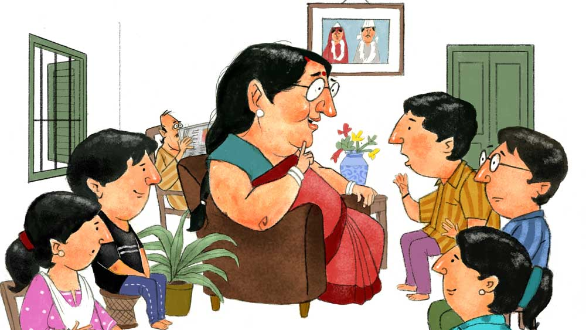

 

<h1 align=center>আক্ষরিক</h1>
<h2 align=center>সৌরভ মুখোপাধ্যায়</h2>
হ্যাঁ  রে, ওই দামড়া ছোঁড়াটা বুকে ও কী নকশা করেছে উল্কি কেটে?”   টিভিতে নামজাদা এক বিদেশি মডেল-ছোকরার খালি-গায়ের কসরত দেখাচ্ছে। বুকে মস্ত বাহারি ট্যাটু। লতুপিসির চোখ পড়েছে সেটার দিকে। নরম সোফার হাতলটা তাঁর বিপুল কনুইয়ের চাপে অর্ধেক দাবিয়ে, তিনি একটু বাঁ দিকে তেরছা হয়ে প্রশ্নটা আমাদের দিকে ছুড়ে দিলেন। মানে, পাঁচটি খাদ্যলোলুপ অপোগণ্ডের দিকে। আমি, সন্তু, পল্লবী, রঞ্জনা আর বিনায়ক।   চেলি-মুকুট পরা লতুপিসির যে-ছবিটি তাঁর বসার ঘরের দেয়ালে ঝোলে তা বাইশ বছর আগের। সে ছবি যে তাঁরই, এ কথা ঘোর অবিশ্বাস করবে শতকরা আটানব্বই ভাগ লোক, যত ক্ষণ না ছবিতে তাঁর পাশে কুণ্ঠিতমুখে দাঁড়ানো টোপরধারী পুরুষটি আমাদের মাইডিয়ার পল্টু-পিসে বলে শনাক্ত হন! এবং তার পর অনিবার্য ভাবে আলেখ্য-দর্শকের মুখ হাঁ হয়ে উঠবেই। কোনও বেআক্কেলে মশা সেই বর্তুল-গহ্বরের মধ্যে চু-কিতকিত খেলে বেরিয়ে আসার পর কোনও রকমে সে বলে উঠতে পারবে, “লতুপিসি... এত স্লিম ছিল!”   বর্তমানে চার ফুট এগারোর মধ্যে ছিয়াশি কিলো ধরিয়ে-নেওয়া শ্রীমতী লতিকা ঘোষাল তখন দাপটে গর্জন করে উঠবেন, “কেন রে! লতু বামনি এখন বুঝি মুটকি ধুমসি?”   এর উত্তরে যে লোক মাখন-হেসে বলতে পারবে, “বালাই ষাট লতুপিসি, আমি তো সবে অর্ধেকটা বলেছি! আসলে বলছিলাম, লতুপিসি যে স্লিম ছিল সেটা এখনও বেশ বোঝা যায়,” তার বরাতে ফ্রেঞ্চ টোস্ট আর কিমার চপ বাঁধা। পিসি মেজাজি হলেও আশুতোষিণী, চর্ব্যচুষ্যের বর দিতে দক্ষিণ হস্ত উঁচিয়েই রয়েছেন।   তা, রবিবারের সন্ধেয় পিসির বসার ঘরে আমাদের একটা আড্ডা জমে। সত্যি বলতে, দমদার খ্যাঁটনের লোভেই জুটে যাই ক’জন। পল্টুপিসে এক কোণে বসে ক্রসওয়ার্ড-পাজ়ল সলভ করেন, টিভি খোলা থাকে, আমাদের পাঁচ মক্কেলের জমায়েত তার মধ্যেই চালু। পিসি রান্নাঘর থেকে এসে মাঝে মাঝে যোগ দেন, নানাবিধ মন্তব্য করেন, নিরাপদ দূরত্ব থেকে পিসে টিপ্পনি ছাড়েন, সেই সব নিয়ে ধুন্ধুমার ও হাহাহিহিহোহো করতে করতেই সময় কাবার।   “উল্কিতে কিছু লিখেছে না কি রে?” পিসি চোখ কুঁচকে টিভির দিকে তাকিয়েই আছেন, “লেখাজোকা বলেই মনে হচ্ছে... ও কী ভাষা বল দিকি! চিনে?”   “না, চাইনিজ় নয় পিসি, জাপানি! ওর গার্লফ্রেন্ড জাপানি মডেল। তাই জাপানিজ়ে ওই নাম ট্যাটু করিয়ে রেখেছে!” সন্তু বলল।   “দেখেছ, হতভাগা ছোঁড়া! ঝোঁকের মাথায় কী বোকামি কল্লি বল তো!” পিসি চোখমুখ কুঁচকে আক্ষেপ প্রকাশ করেন, “একেবারে বুকে পাকাপাকি খোদাই করে ফেললি বাপ! ক’দিন পর যখন জাপানি ছুঁড়ি তোকে ছুড়ে ফেলে দেবে তখন হাঁপানি সামলাতে পারবি?”   “অর, ভাইসি ভার্সা! ও নিজেও ছুড়তে পারে ছুঁড়িকে!” ক্রসওয়ার্ড থেকে মুখ তোলেননি, কিন্তু বাঁকানো কর্নার কিক-এর মতো মন্তব্যটি ভাসিয়ে দিয়েছেন পল্টুপিসে।   “থামো বাপু তুমি!” ফিস্ট করে বহুদূর বল পাঠিয়ে দিলেন পিসি, “পুরুষের খ্যামতা জানা আছে!”   পিসে যথারীতি অখণ্ড মৌনে ডুবে গেলেন ফের।   লতুপিসি আবার প্রসঙ্গে ফিরলেন, “তা, হ্যাঁ রে সন্তু! এই যে এরা সব এখানে-ওখানে লাভারের নাম লিখিয়ে উল্কি ফোঁড়ায়—তা, কাটান-ছাড়ান হয়ে যাওয়ার পর সে লেখাগুলোর কী হয়? পরের লাভারের চোখের সামনেই প্যাটপেটিয়ে ফুটে থাকে তো!”   রঞ্জনা হেসে ওঠে। বলে, “না না, পিসি! এগুলো পার্মানেন্ট ভাবছ না কি? সব তুলে ফেলা যায়।”   “তাই বল!” পিসি সোজা হলেন, “তবু ভাল! আমাদের সময়ে তো...”   “তোমাদের সময়েও এই রকম ট্যাটু লেখানোর চল ছিল?” বিনায়ক কিঞ্চিৎ অবাক।   ও পাশে, ক্রসওয়ার্ডের আড়াল থেকে একটা গলাখাঁকারি ভেসে এল।   পিসি সে দিকে তাকিয়ে একটা রহস্যঘন অথচ লাজুক-লাজুক চাউনি ছুড়লেন। বললেন, “কী গো! বলব?”   পল্লবী আর রঞ্জনা এক সঙ্গে ঝাঁপিয়ে পড়ে প্রায়! “বলো কী পিসি! তোমাদেরও এই সব গল্প আছে না কি? স্কিনে নাম-লেখানোর কেস?”   ফের গলাখাঁকারি আসে। বোধহয় গ্রিন সিগনাল!   পিসি পর্যায়ক্রমে আমাদের দিকে তাকিয়ে নেন। তার পর হাসেন ফের। আমরা দেখি, হঠাৎই যেন বয়স কমে গেছে লতুপিসির!   “তা বাপু, আমাদের কালে উল্কি-টুল্কি ছিল না। হিন্দুস্থানি মুনিষ-কাহারদের মধ্যে চোখে পড়ত, ঠাকুর-দেবতা বা নিজেদের নাম লিখিয়েছে হাতে। কিন্তু বাঙালি-ঘরে... নাহ্‌!” একটু থেমে পিসি বললেন, “আমাদের ছিল জ্যামিতিবাকসোর কম্পাস। আর, ব্লেড!”   আমি চমকে উঠে বললাম, “চামড়া কেটে লেখা! উরিশ্‌শা...”   বিনায়ক মাথা চুলকোল, “রক্তারক্তি কেস!”   “কেন, তোদের আমলে এখন কেউ হাত কেটে লাভারের নাম লেখে না বুঝি?”   “হা-ত কে-টে!” রঞ্জনা আঁতকে ওঠে, “বাপ রে! আমি ব্যাঙ কাটার ভয়ে বায়োলজি নিইনি! রক্ত দেখলেই আমি অজ্ঞান!”   “রক্ত দিয়ে লাভ লেটারও লেখে না তোদের বন্ধুবান্ধবরা কেউ?” লতুপিসি যেন বেশ অবাক।   “লাভ লেটার?” পল্লবী কুলকুলিয়ে হাসল, “এখন হোয়াটস্যাপ টেক্সটে প্রোপোজ় হয়, পিসি! রিজেক্টেড হলে— পুরোটা কপি-পেস্ট, রেসিপিয়েন্টের নামটা এডিট, তার পর সেন্ড টু অ্যানাদার...”   “দূর দূর! প্রেমপত্রের চার্ম জানলি না রে মুখপুড়িরা।... যাকগে, শোন! প্রেমপত্র তো হাজার কিসিমের। কল্কা-আঁকা, গোলাপের পাপড়ি-সাঁটা, সেন্ট-মাখানো, লিপস্টিক-ছাপ পর্যন্ত, কিন্তু সেরা হচ্ছে... রক্তে-লেখা লাভ লেটার! ও জিনিস অন্তত একখানা না পেলে প্রেমজীবন বৃথা, মনে করা হত আমাদের কালে!” পিসি গর্বের হাসি হাসলেন, ও প্রান্তে খবরের কাগজের আড়ালে উঁকি-দেওয়া চকচকে টাকটির দিকে ইঙ্গিত করে চোখ মটকে বললেন, “সাত-সাতখানা, হুঁ!”   সন্তু কফির কাপে সবে চুমুক দিয়েছিল। বিষম সামলে বলল, “অ্যাঁ! পিসেমশাই...! সা-ত-খানা!! অ্যানিমিয়া ধরেনি?”   পল্লবী বিস্ফারিতচক্ষে বলল, “রক্ত দিয়ে লেখা, উরিবাবা, বিশাল ঝঞ্ঝাটের কেস!”   পল্টুপিসের মৃদু কণ্ঠ ভেসে এল, “হুম! ঝঞ্ঝাট খুবই! মুরগি-কাটা কসাইয়ের সঙ্গে দোস্তি রাখতে হত... ইয়ে, মানে, হেভি লেবার দিতে হত...”   পিসি খর চোখে তাকালেন, “কী মানে দাঁড়াল কথাটার?”   “কিচ্ছু না, কিচ্ছু না... থুক্কুড়ি থুক্কুড়ি...,” পিসের কাশির দমকটা বেশ সময়মতো উঠল দেখলাম।   “না মানে! এই যে কী বললে, মুরগি-কাটা না কী যেন?”   পিসের কাশি আর থামেই না!   “তার মানে তোমার সাতটা চিঠিই মুরগির রক্ত দিয়ে লেখা ছিল না কি!”   কাশি ক্রমশ প্রবলতর দেখে আমরা মীমাংসার চেষ্টা করি, “ছেড়ে দাও পিসি, কত কাল আগের কথা...”   “ছেড়ে দেব কী রে, অ্যাঁ!” রণংদেহি লতুপিসি লাফিয়ে উঠেছেন। গলায় তপ্ত তেলে লঙ্কা-ফোড়নের ঝাঁঝ, “ওই রক্ত-চিঠির পর রক্ত-চিঠি দিয়ে দিয়েই আমাকে পটিয়েছিল শয়তানটা, জানিস! না হলে ওর মতো শুঁটকো টেকোকে কে পুঁছত!”   “আহা, তখন কি টেকো ছিল পিসে!” বিনায়ক বলে, “ওই তো ছবি ঝুলছে... কেমন পুঞ্জ-পুঞ্জ বাবরি চুল... মধ্যে চেরা সিঁথি...”   “থাম তোরা!” খেঁকিয়ে উঠলেন লতুপিসি, “বিয়ের দশ বছরের মধ্যেই ওই চেরাপুঞ্জি যে সাহারা হয়ে গেছল তা জানিস? ফক্কিকারি জালি মাল, গ্যারান্টি পিরিয়ড পেরোল না...”   ক্রসওয়ার্ড-পাঁচিলের ও পাশ থেকে এক চিলতে মুখের উঁকি। ছোট্ট টিপ্পনি এল, “ইয়ে... পঁচিশ বছর আগের সেই উনপঞ্চাশ-কিলোর বালিঘড়ি-মার্কা ফিগার? যেটা ওই ফটোয় ধরা আছে? সেটা কি গ্যারান্টি পিরিয়ড পেরিয়েছিল?”   লতুপিসি প্রবলতর একটা হাঁ করে প্রত্যাঘাতে নামছিলেন, আমরা সমবেত চেষ্টায় নিরস্ত করি।   সন্তু দু’হাত দু’দিকে ছড়িয়ে দিয়ে বক্সিং রেফারির ঢঙে ঘোষণা করে, “শান্তি শান্তি শান্তি! টাক ভার্সাস ফিগারের লড়াই আজকের ইস্যু নয়, ওটা অন্য দিন ফাইনালাইজ়ড হবে’খন। আজকের টপিক হল রক্তে লেখা চিঠি!”   “আর, হাত কেটে নাম!” আমি পাদপূরণ করি।   “হাত কেটে নামটাও কি পিসেমশাইয়েরই কীর্তি?” পল্লবী জানতে চায়।   “উঁহ্‌হ্‌হ্‌!” নাকমুখ বিকৃত করে পিসি ফুঁসে ওঠেন, “মুরগির রক্ত দিয়ে যে ফেরেববাজি করে, সে কাটবে হাত! চোট্টা কোথাকার!”   ফের একটা কাব্যরসে-ভেজা মন্তব্য আসে ও দিক থেকে, “আহা, আমি চোট্টম বলিয়া তুমি উত্তম না হইবে কেন লতুরানি? তোমার হাতের কাটা দাগ তো আর মুরগি-ঠোঁটের ঠোক্কর নহে। জেনুইন জিনিস, এখনও জাজ্জ্বল্যমান!”   “অ্যাঁ-অ্যাঁ-অ্যাঁ!” আমাদের পাঁচ জোড়া চোখ চড়কের গাছে চড়ে গেল, “ল-তু-পি-সি! হাত কেটে নাম লিখেছিল! পিসেমশাইয়ের নাম!”   “দেখি পিসি, দেখি!” প্রথমেই হামলে পড়ে রঞ্জনা আর পল্লবী।   লতুপিসি এখনও গোঁজ। শাঁখা-পলা-চুড়ি-বালায় ঢাকা বাঁ-হাতের কব্জি, সেটা ডান হাতে আড়াল করে, মুখ ফিরিয়ে আছেন। দেখাবেন না।   বিনায়ক ভুরু তুলে বলে, “আসল নামটা... পুরো? পিসের তো বিরাট নাম, মনুজেশনারায়ণ না কী যেন... উরিব্বাবা!”   “আরে ধ্যাত!” পিসে বললেন, “ওই নাম পুরো লিখতে গেলে তো ঊর্ধ্ববাহুতে তাগা পরার জায়গা থেকে স্টার্ট করতে হবে হে!”   “তা হলে? আদ্যক্ষরটা বুঝি শুধু... এম?”   “আদ্যক্ষরই, তবে ডাকনামটার! পল্টুর পি। স্ট্রেট লাইনটা ব্লেডের টান, কার্ভড লাইনটা কম্পাস দিয়ে!”   “কোন ক্লাস? তখন?”   “ওর টেন,” পিসে বললেন, “আমার টুয়েলভ!”   আমি লতুপিসির গোমড়া মুখের দিকে এক বার তাকিয়ে একটু আশঙ্কিত হচ্ছিলাম। আজকের জলপানিটা ফসকে না যায় এই সব শুকনো ঝামেলায়! কেবল এক কাপ কফি জুটেছে এত ক্ষণে। এ বার যদি ফস করে পিসি বলে বসেন, আজ মেজাজ খারাপ, চপ ফ্রাই কিচ্ছু ভাজতে পারবেন না...   গলাটাকে একটু আবেগ-কম্পিত করে নিয়ে বললাম, “তবে, পিসেমশাই, আপনি খুবই গর্হিত কর্ম করেছিলেন। যে লতুপিসি নিজের হাত কেটে আপনার নাম খোদাই করল, চিঠিতে মুরগির ব্লাড ইউজ় করে কিন্তু তার নির্ভেজাল ইমোশনটাকেই আপনি ঠকিয়েছিলেন! প্রতারণাটা ফাঁসই যখন করলেন এত বছর বাদে, আপনার অন্তত এক্ষুনি আর্নেস্টলি অ্যাপোলোজাইজ় করা উচিত...”   ও হরি! পিসে মুখ খোলার আগেই লতুপিসি দেখি খ্যাঁকখেঁকিয়ে হেসে উঠেছেন।   “ও বুড়োর আর মাফ চেয়ে কাজ নেই! অ্যাদ্দিন পর যখন নিজের ফোরটোয়েন্টি কেস লিক করেই ফেলল, তখন আমিই বা পিছিয়ে থাকি কেন? নাও বাপু, এই সব্বার সামনে আমিও আজ হালকা হই! হাত কেটে নাম লেখাটিতেও জালিয়াতি ছিল, এই জেনে রাখো, হ্যাঁ! উল্টো দিকের জালি কেসটা তো তখন জানতুম না, কিন্তু ওপরওয়ালার খেলা দ্যাখো... অজান্তেই শোধবোধ করে রেখেছিলুম, হি হি!”   এ বার পিসে খবরের কাগজ টেবিলে ফেলে শিরদাঁড়া খাড়া করে ফেলেছেন!   “ম্‌-মানেটা কী?”   সোফার ওপর দু’পা মুড়ে গুছিয়ে বসলেন লতুপিসি। আর, এত ক্ষণে বলয়-কঙ্কণের ভার সরিয়ে বাঁ হাতের কবজিটি উন্মুক্ত করলেন।   ঝুঁকে পড়েছি আমরা সক্কলে। একটু আবছা হয়ে এসেছে, কিন্তু ফর্সা হাতে এখনও বেশ বোঝা যায়, মণিবন্ধ থেকে ইঞ্চি-কয়েক ওপরে— সুপ্রাচীন ক্ষত, ইংরেজি পি অক্ষর! পরিষ্কার।   “এ তো দেখছি জেনুইন জিনিস!” রঞ্জনা বলল।   “জেনুইন... কিন্তু ফলসও বটে!” পিসি মিটিমিটি হাসছেন।   “এ আবার কেমন হেঁয়ালি লতুরানি!” পিসেমশাইও নিজের বাঙ্কার ছেড়ে উঠে এসেছেন। হতভম্ব মুখ।   “অনেক বছর চেপে রেখেছি বাপু, ভুলেই গেছলুম এক রকম। আজ হোক তবে ঘোটালা-কনফেসের দিন! আর, তিন কাল গিয়ে এক কালে ঠেকেছে, এখন এ সব দু’নম্বরি ফাঁস হলেই বা কী!”   “কিন্তু... কিন্তু,” সন্তু ভুরু কুঁচকে বলে, “ব্লেডে-কম্পাসে চামড়া কেটে লেখা— এতে দু’নম্বরি করা যায় না কি? স্পষ্টই দেখা যাচ্ছে, খাঁটি পি!”   “উঁহু! গোঁজামিল পি, সোনা!”   “মানে?”   লতুপিসি একটু লাজুক মুখে বললেন, “গোড়া থেকে শোন তবে। তখনও তোর পিসের সঙ্গে আমার আলাপ হয়নি। ক্লাস নাইনের মাঝামাঝি। এক বিয়েবাড়িতে দেখলুম আমার বান্ধবী মণিমালার মামাতো দাদাকে। কলেজে পড়ে, হ্যান্ডসাম, স্মার্ট, গান গায়, ক্রিকেট খেলে... বুঝলি। আর যায় কোথা। ঝপ্পাস!”   “ওয়ান-সাইডেড?” পল্লবী জিগ্যেস করে।   “আবার কী! অমন কলেজ-রোমিয়োর বয়েই গেছে আমার মতো গাঁইয়া ফ্রক-পরা পুঁটিকে পাত্তা দিতে। কিন্তু আমার যে তখন ডুবজল! দিনরাত একাকার। কী-করি কী-করি! কী ভাবে দেখানো যায় যে আমি তার তরেই মরি! মণিদীপা বার বার বলছে, ওরে লতু, তুই ও চিন্তা ছাড়, ওখানে তোর নো চান্স! তত জেদ চেপে যায়। লতু বামনির জেদ! লিখে ফেললুম হাত খুঁচিয়ে, ড্রিমবয়ের নামের আদ্যক্ষর! মণিকে বললুম, বলিস তোর দাদাকে— লতিকা তার নাম লিখেছে চামড়া কেটে!”   “অ্যাঁ!” পিসেমশাই তোতলাচ্ছেন উত্তেজনায়, “ত-তবে... ওই প্-পি... আদতে স্-সে-ব্যাটারই নামের আদ্যক্ষর! আমার ওপরে চালালে!”   “আরে দূর! অত ইজ়ি নয় চাঁদ! তার নাম পি দিয়ে ছিলই না!” লতুপিসি খেলা জমিয়ে নিয়েছেন নিজের কোর্টে, পিসেমশাইকে খাবি খেতে দেখে ভারী আহ্লাদ তাঁর মুখেচোখে!   “পি দিয়ে ছিল না!” খাবি আমরাও খাচ্ছি, “তা হলে? পি লিখেছিলেন যে...”   “আরে, পুরো গল্পটা আগে শোন! হাত কেটে-ফেটেও সুবিধে হল না ও দিকে, বুঝলি। সে ছেলে ওতে ঘায়েল হওয়ার মতো জিনিসই নয়! মাঝখান থেকে আমার হাতটাই খুঁতো হয়ে রইল। বাড়িতে ঠ্যাঙানিও খেলুম। মা চুলের মুঠি ধরে নাড়তে-নাড়তে বলেছিল, ‘মুখপুড়ি চর্মলিপি লিখে পাকা কাজ করে ফেললেন! কিন্তু অঙ্কটা তো মেলাতে পারলি না রে, গোবুদ্ধি! মাঝখান থেকে আলফ্যাবেটের বাকি পঁচিশটা অক্ষর বাতিল হয়ে গেল, মর তুই এ বার ওই একটামাত্তর অক্ষরের নামওয়ালা ছেলে খুঁজে-খুঁজে!’”   “কথাটা ভাববার মতোই!” সন্তু চিন্তিত ভাবে মাথা নাড়ে, “পুরনো দাগটা দেখে তো নয়া লাভার কুরুক্ষেত্র করবেই! একমাত্র... ওই পার্টিকুলার অক্ষরের ছেলে মিলে গেলে তবেই রক্ষে... হুম্‌!”   “কিন্তু অমন অক্ষর খুঁজে-খুঁজে কি প্রেম হয়?” পল্লবী এখনও ঘোর সন্দিহান।   “দূর, তাই হয় আবার?” লতুপিসি হেসে ওঠেন, “কপালেরও খেলা দেখ, তার কিছু দিন পরেই তোদের পিসের সঙ্গে আলাপ! ইশকুলের সরস্বতীপুজোয়। সপ্তা না-ঘুরতেই বাবুর চিঠি এল, রক্তে-লেখা চিঠি!”   ফের জোরে কেশে উঠলেন পিসেমশাই, তার পর বললেন, “কিন্তু... ওই নামের ব্যাপারটা...”   চোখ বড়-বড় করে হাসলেন লতুপিসি, “নাম দেখেই তো কপালে হাত! মনুজেশ! বাপ রে! যে অক্ষর লিখে ফেলেছি তার ঘা সদ্য কিছু দিন হল শুকিয়েছে, কিন্তু মনুজেশে তো সে-অক্ষরের বাষ্প পর্যন্ত নেই! ...সত্যি বলতে কী, পাত্র পছন্দ হয়েছে খুবই, ভেতরে ইচ্ছে ষোলো-আনা! আর, এ দিকে ইনি একটার পর একটা চিঠি পাঠিয়েই চলেছেন... ওই ইয়েতে লেখা চিঠি...”   পিসেমশাই কাশতেও ভুলে গেছেন। হাঁ করে তাকিয়ে। পিসি বলে চলেছেন, “কিন্তু কব্জির ওই একটি দগদগে অক্ষরই অভিশাপ হয়ে দাঁড়িয়েছে! ভয়ে ইয়েস করতে পারছি না! তখন মণিদীপাই বাঁচাল। বলল, ‘ডাকনামের খোঁজ কর না! অনেক ছেলের একাধিক ডাকনাম থাকে—খোকন, বাবুয়া, টুকাই, ডিঙ্গো...! প্রব্যাবিলিটি বেড়ে যাচ্ছে কি না? বাই চান্স একটা ম্যাচ করে গেলেই বলবি, ওইটাই খুব পছন্দ, ওটার আদ্যক্ষর হাতে লিখেছি! ব্যস!’”   “দুর্দান্ত সমাধান!” বিনায়ক হাততালি দিল।   “ছাই সমাধান!” ঝাঁঝিয়ে উঠেই ফিক করে হেসে ফেললেন পিসি, “এমন কপাল, ডাকনাম একটাই বেরোল— পল্টু! কিন্তু, আমি তো পি লিখে রাখিইনি!”   “তবে?”   “আমি তো ডি লিখেছিলাম হাত কেটে! ডি! সে ছেলের নাম তো ছিল দীপেন!”   “অ্যাঁ! তা হলে যে এই পি...”   “আবার ব্লেড চলল! আমি তখন মরিয়া। মিলিয়েই ছাড়ব,” লতুপিসি মুখটা কোঁচকালেন, “দাঁতে দাঁত চেপে ক্যাপিটাল ডি-এর সোজা-দাঁড়িটাকে নিচের দিকে জাস্ট একটুখ্খানি বাড়িয়ে দিলাম, ব্যস! প্রবলেম সল্‌ভড! পি!”   আমাদের বাক্যি হরে গেছে!   পিসেমশাই বিড়বিড় করে বললেন, “কুক্কুট-রুধিরে পত্রলিখন... বনাম... অক্ষরের বর্ধিতবাহু-অঙ্কন! বন্য ওল্লকন্দ ও ব্যাঘ্র-তিন্তিড়ী!... যাকগে, শঠে-শাঠ্যং হয়ে গেছে ভাই লতু, এ বার চপগুলো ভেজে ফ্যালো, অনেক ক্ষণ ধরে সাসপেন্স পুইয়ে জোর খিদে লেগেছে মাইরি!”         