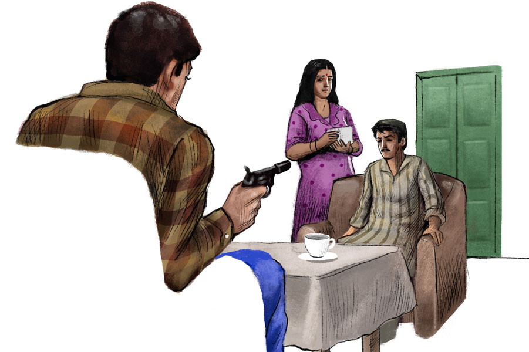

 
 <h1 align=center>আগন্তুক</h1>
<h2 align=center>জয় সেনগুপ্ত</h2> বাজার সেরে বাড়ি ঢোকার সময় তাঁর বাড়ির ঠিক গাঁ ঘেঁষে লোকটিকে দাঁড়িয়ে থাকতে দেখে একটু অবাক হলেন রাহুল শ্রীবাস্তব। এ কি তাঁর অপেক্ষাতেই দাঁড়িয়ে আছে? লোকটাকে দেখতে ইংরেজি সিনেমার টম ক্রুজ়-এর মতো। হ্যান্ডসাম। বেশ লম্বা। বয়স আন্দাজ বছর পঁয়ত্রিশ-চল্লিশ। পরনে চেক-চেক ফুল স্লিভ জামা আর নেভি ব্লু প্যান্ট। এক হাতে অ্যাটাচি, অন্য হাত প্যান্টের পকেটে ঢোকানো। পাশেই একটা বড়সড় মোটরবাইক। এটায় চেপেই এসেছে বোধহয়।

লোকটিকে কোনও দিন এই গাঁয়ে দেখেননি তিনি। এই গাঁয়ের প্রায় সকলকেই চেনেন রাহুল। তাঁর কাছে চিকিৎসা করতে আসে তারা। আজ রোববার, চেম্বার বন্ধ। না হলে সপ্তাহের অন্য দিনগুলো তাঁর বাড়ির সামনের ঘরটা বেশ জমজমাট থাকে রোগীদের ভিড়ে। এই গ্রামে আসার পর মাত্র এক বছরেই হোমিয়োপ্যাথি ডাক্তার হিসেবে বেশ নাম করেছেন তিনি।

এ-ও কি তাঁর কাছে চিকিৎসা করাতে এসেছে? আশপাশের কোনও গ্রাম থেকে?

লোকটির একেবারে মুখোমুখি হয়ে রাহুল জিজ্ঞেস করলেন, “কাউকে খুঁজছেন?”

“হ্যাঁ। মিস্টার রাহুল শ্রীবাস্তবকে,” হাসিমুখে উত্তর দিল আগন্তুক। তার পরেই মোবাইল বার করে কী একটা দেখেই আবার বুকপকেটে রেখে দিল মোবাইলটা।

লোকটাকে নিজের পরিচয় দিলেন রাহুল।

লোকটা মুখে হাসি ঝুলিয়ে রেখেই খুব বিনীত ভাবে বলল, “আমি জন বিশ্বাস। এসেছি ক্ষেত্রপুরের পালপাড়া থেকে। বিশেষ দরকারে।”

ক্ষেত্রপুরের পালপাড়ার নাম শুনেই রাহুলের শরীরে একটা শিহরন বয়ে গেল। এক বছর আগের কথা মনে পড়ে গেল বিদ্যুচ্চমকের মতো।

কিন্তু এখান থেকে প্রায় পঁয়তাল্লিশ কিলোমিটার দূরে ক্ষেত্রপুরের পালপাড়া থেকে এ লোকটা তাঁর কাছে এসেছে কী করতে? তিনি এমন কিছু নামকরা হোমিয়োপ্যাথি ডাক্তার নন যে, পঁয়তাল্লিশ কিলোমিটার দূর থেকে তাঁকে কেউ দেখাতে আসবে! এই গাঁয়ের লোকজনেরই চিকিৎসা করেন। মাঝে মাঝে আশপাশের গাঁ থেকেও দু’-দশ জন আসে। এই অঞ্চলে মোটামুটি নাম করেছেন। কিন্তু এতটাও নয় যে, অত দূর থেকে কোনও রোগী আসবে তাঁর কাছে।

“একটা বিশেষ দরকারে আপনার কাছে এসেছি,” জন বলল।

“সেটা কী?” কথাটা শুনে রাহুলের ভ্রু কুঁচকে গেল।

“একটু সময় লাগবে। বাইরে দাঁড়িয়ে বলা যাবে না,” জন বিনীত ভাবে হাসল।

“চলুন, ভিতরে গিয়ে বসা যাক।”

কোলাপসিবল গেট খুলে ভিতরে ঢুকে রাহুল জনকে বসার ঘরে নিয়ে গেলেন। “আপনি বসুন। আমি বাজারটা রেখে আসি,” রাহুল বললেন।

সোফায় আরাম করে বসল জন।

মিনিট দু’-তিন পরেই বাড়ির ভিতর থেকে এসে, জনের ঠিক উল্টো দিকের সোফায় মুখোমুখি বসলেন রাহুল।

“এ বার বলুন কী ব্যাপার।”

“আমাকে দেখে আপনি আশ্চর্য হচ্ছেন। খুব স্বাভাবিক। আপনি আমাকে চেনেন না। ইন ফ্যাক্ট, আমিও চিনি না আপনাকে। মানে, কিছু ক্ষণ আগে পর্যন্ত চিনতাম না। তাই যখন আপনি পরিচয় দিলেন, মোবাইলে আপনার ছবিটা দেখে নিশ্চিত হয়ে নিলাম। আসলে ক্ষেত্রপুরের পালপাড়া থেকে আমাকে পাঠিয়েছেন শতদ্রু সান্যাল,” একটানা বলে চুপ করল জন।

শতদ্রু সান্যালের নামটা শুনেই রাহুল শ্রীবাস্তবের শিরদাঁড়া দিয়ে হিমশীতল বরফের স্রোত নেমে গেল।

বেশ কয়েক সেকেন্ড চুপ করে রইলেন শ্রীবাস্তব। তার পর চিন্তিত গলায় বললেন, “আপনি বসুন। আমি একটু ভিতর থেকে আসছি।”

ভিতরে গিয়ে স্ত্রী মালবিকাকে বললেন, “শতদ্রু সান্যাল এই লোকটিকে পাঠিয়েছে। আশ্চর্য ব্যাপার, আমি যে এখানে আছি, ও জানল কী করে?”

“সত্যিই আশ্চর্য, এখানকার ঠিকানা জানল কী করে? আমি তো ভেবেছিলাম, এত দিনে সব কিছু স্বাভাবিক হয়ে গেছে। রাগ পড়ে গেছে ওর!” মালবিকা চিন্তিত মুখে বলল, “যাও, গিয়ে দেখো, কী বলতে চায় লোকটা। যাই বলুক ঘাবড়ে যাবে না একদম।”

“আপনার এই জায়গাটা খুব সুন্দর। বেশ মনোরম। কোলাহলমুক্ত। শহরের ঘিঞ্জিতে তো শরীর-মন হাঁসফাঁস করে। আর তেমনই দূষণ। খুব ভাল জায়গা চুজ় করেছেন আপনি,” পকেট থেকে একটা সিগারেটের প্যাকেট বার করল লোকটা। রাহুলকে বলল, “চলবে?”

“আমি স্মোক করি না। ধন্যবাদ।”

“বাঃ, খুব ভাল। ড্রিঙ্ক করেন?”

“না, তা-ও নয়।”

একটু অধৈর্য হয়ে উঠলেন রাহুল। বললেন, “আমার এখানে আপনার আসার উদ্দেশ্যটা কিন্তু বললেন না!”

“বলব। তার আগে চা-টা খেয়ে নিই। এক কাপ চা খাওয়াবেন নিশ্চয়ই?”

“অবশ্যই।”

“লিকার চা। চিনি দিয়ে।”

আবার ভিতরে গেল রাহুল। মালবিকাকে চা করতে বলল। লোকটার ধরনধারণ কী রকম যেন!

মালবিকা বলল, “নিজে থেকে চা খেতে চাইল?”

“হ্যাঁ, যেন আমাকে কত দিন ধরে চেনে!” কিছুটা অবাক রাহুল।

ফিরে এসে সোফায় বসতেই জন বলল, “একটা অ্যাশট্রে হবে?”

“অ্যাশট্রে তো নেই। আপনি মাটিতেই ফেলুন।”

“আমারই ভুল। আপনি সিগারেট খান না, অ্যাশট্রে রাখবেন কেন?” হাসল জন।

একটু বোকা বোকা ভাবে হাসলেন রাহুলও, “হ্যাঁ, শতদ্রু সান্যাল আপনাকে কেন পাঠালেন?”

“ওই যে বললাম, চা-টা খেয়ে নিয়ে বলব!” নিঃশব্দে বিনয়ের হাসি হাসল জন।

জনের দিকে সন্দেহের দৃষ্টিতে তাকিয়ে গুম হয়ে বসে রইলেন রাহুল। সিগারেটের গন্ধটা খুব কটু লাগছে রাহুলের। ধোঁয়া ছড়িয়ে পড়ছে সারা ঘরে।

একটু পরে ভিতরে গিয়ে এক কাপ চা আর দুটো ক্রিম ক্র্যাকার বিস্কুট নিয়ে এলেন রাহুল।

“এ কী, আপনি চা খাবেন না?” জন প্রশ্ন করল।

“না, কিছু ক্ষণ আগেই খেয়েছি। বেশি চা খাই না আমি।”

“বাঃ, খুব ভাল। খুব স্বাস্থ্যসচেতন আপনি। সিগারেট, মদ খান না। চা-ও খুব মেপে খান... তবে আপনার কিন্তু অন্য একটা নেশা আছে।”

“আমার অন্য নেশা আছে? কী সেটা?” ভুরু কোঁচকান রাহুল।

“বলছি। চা-টা খেয়ে নিয়েই।”

খুব দ্রুত গরম চায়ে চুমুক দিতে লাগল জন। রাহুল ভ্রু কুঁচকে তার দিকে তাকিয়ে রইলেন। তাঁর মনের মধ্যে একটা দোলাচল। কী জন্য এই লোকটাকে পাঠিয়েছে শতদ্রু সান্যাল? আর, অন্য একটা নেশা বলতে কী বলতে চাইছে এ?

খালি কাপটা টেবিলের উপরে রেখে ঘড়ি দেখল জন। স্বগতোক্তি করল, “হাতে বেশি সময় নেই।”

প্রায় শেষ হয়ে যাওয়া সিগারেটটা মাটিতে ফেলে, জুতো দিয়ে আগুনটা নিভিয়ে আর-একটা সিগারেট ধরাল। বলল, “চা খেয়ে একটা সিগারেট খেতেই হয় আমাকে।”

পর পর দুটো টান দিয়ে সোজাসুজি তাকাল রাহুলের মুখের দিকে। হাসল, “এ বার আসল কথাটা শুরু করি, অ্যাঁ।”

“আমার অন্য একটা নেশার কথা কী বলছিলেন?”

“ও হ্যাঁ। মেয়েছেলের নেশা!”

“কী! হাউ ডেয়ার ইউ!” এত ক্ষণ চুপচাপ থাকা রাহুল শ্রীবাস্তব সোজা উঠে দাঁড়ালেন।”

“কুল কুল, মিস্টার শ্রীবাস্তব। চেঁচাবেন না। বিস্তারিত বলছি আপনাকে ঘটনাটা,” অদ্ভুত রকমের ঠান্ডা গলায় বলল জন।

“আজ থেকে প্রায় এক বছর এক মাস আগে, ক্ষেত্রপুরের পালপাড়ায় থাকতেন আপনি। হোমিয়োপ্যাথি ডাক্তার হিসেবে নাম-যশ হয়েছিল। আপনার প্রতিবেশী ছিলেন শতদ্রু সান্যাল। আপনি আপনার প্রতিবেশী শতদ্রুর স্ত্রী মালবিকাকে ফুসলে নিয়ে চলে এলেন এখানে। লুকিয়ে রইলেন। কেউ জানল না আপনার খবর। না আপনার বন্ধুবান্ধব, না আত্মীয়স্বজন। হোমিয়োপ্যাথির ডিগ্রিটা ছিল, অভিজ্ঞতাও। প্র্যাকটিস শুরু করলেন। তার পর...”

মালবিকা দরজার আড়ালে দাঁড়িয়ে সব শুনছিলেন। তিনি ছিটকে ঢুকে পড়লেন ঘরের ভেতর।

“আপনি ভুল বলছেন। আমাকে মোটেই ফুসলে আনেনি রাহুল। আমি নিজের ইচ্ছেতেই এসেছি। বরং এই ভাবে পালিয়ে আসার ব্যাপারে ও-ই একটু ইতস্তত করেছিল। আর, আপনি কি এই সব বাজে কথা বলতে এখানে এসেছেন?”

“না। এটা হল মুখবন্ধ। যাই হোক, সোজাসুজি আসল কথায় আসি। শতদ্রু সান্যাল আপনাদের দু’জনকেই মেরে ফেলতে চান। তাই আমাকে উনি ভাড়া করেছেন। আমি এক জন কনট্র্যাক্ট কিলার,” জন অ্যাটাচি খুলে সাইলেন্সার লাগানো একটা পয়েন্ট থ্রি এইট ক্যালিবারের রিভলভার বার করল।

রাহুল একটু নড়ে উঠতেই জন বলল, “একদম পালানোর চেষ্টা করবেন না। আমার টার্গেট কিন্তু মিস হয় না। আকাশ থেকে উড়ন্ত পাখিকে গুলি করে নামাতে পারি। আর গুলি চললে কোনও আওয়াজও হবে না, এতে সাইলেন্সার লাগানো আছে।”

“আপনাকে কত টাকা দিয়েছে ও, আমাদের মারার জন্য?” রাহুল প্রশ্ন করল।

মালবিকা শাড়ির আঁচলে মুখ ঢেকে ফুঁপিয়ে কাঁদতে কাঁদতে বলল, “আমাদের মেরে ওর লাভ?”

রাহুল আবার বলল, “বলুন, ও কত টাকা দিয়েছে আপনাকে?”

“শুনবেন?” মুচকি হাসল জন, “অ্যাডভান্স এক লাখ। কাজ হয়ে গেলে আরও তিন লাখ।”

“আপনাকে একটা প্রস্তাব দিচ্ছি। আমি আপনাকে এর ডবল দেব, এখনই। আপনি যখন এক জন কনট্র্যাক্ট কিলার, তখন এটা করতেই পারেন। আপনাকে এ বার আমি হায়ার করছি। আমার কাছ থেকে আট লাখ টাকা নিন। তার পর সোজা গিয়ে শতদ্রু সান্যালকে মেরে ফেলুন,” কথাগুলো বলে স্ত্রীর দিকে তাকালেন রাহুল।

“এটা খারাপ বলেননি। অত টাকা যদি এক্ষুনি আমাকে দিতে পারেন, তা হলে আজই শতদ্রু সান্যালের মৃত্যু নিশ্চিত। কিন্তু শর্ত হল, বাইরে বেরিয়ে টাকা আনতে যেতে পারবেন না। না এটিএম, না ব্যাঙ্ক,” জন তার ছোট্ট অস্ত্রটা তাক করেই রইল রাহুলের দিকে।

“টাকা বাড়িতেই আছে। বাড়ির সামনের ফাঁকা জমিটা কিনে বাগান করব বলে অ্যাডভান্সের টাকা কালই ব্যাঙ্ক থেকে তুলে এনে রেখেছিলাম।” রাহুলের চোখেমুখে আত্মবিশ্বাস।

“ঠিক আছে, আপনার স্ত্রীকে বলুন টাকাটা নিয়ে আসতে। আপনি এখানেই থাকবেন। কিন্তু একটা কথা, কোনও রকম চালাকির চেষ্টা করলেই কিন্তু আপনার মৃত্যু অবধারিত।”

মিনিট পাঁচেক পরে মালবিকা একটা প্লাস্টিকের ব্যাগে টাকার বান্ডিল নিয়ে ঘরে ঢুকে দেখল, রাহুল সামনের সোফায় বসে, আর পায়ের উপর পা দিয়ে বসে আছে জন। রিভলভারটা ঠিক একই ভাবে রাহুলের দিকে তাক করা।

মালবিকার কাছ থেকে ব্যাগটা নিয়ে জনের হাতে দিলেন রাহুল, “নিন, গুনে নিন।”

“তার প্রয়োজন নেই,” এক ঝলক ব্যাগের ভেতরটা দেখে নিল জন বিশ্বাস, “জানেন মিস্টার শ্রীবাস্তব, কনট্র্যাক্ট কিলারদের একটা এথিক্স আছে। একটা অলিখিত নিয়ম। এক বার টাকা হাতে পেয়ে গেলে তারা কখনও কথার খেলাপ করে না, নিজের জীবন বিপন্ন হলেও। ঠিক যেমন শতদ্রু সান্যালের কাজটা আমায় করতেই হবে। কারণ, তাঁর কাছ থেকে আমি টাকা নিয়েছি।”

মুহূর্তের মধ্যে শিস দেওয়ার মতো শব্দ হল, পর পর দুটো। শার্প শুটার জনের হাতের সাইলেন্সার লাগানো কালো ছোট্ট আগ্নেয়াস্ত্রের গুলি এফোঁড়-ওফোঁড় করে দিয়েছে রাহুল আর মালবিকার কপাল।

সাইলেন্সার লাগানো অবস্থায় রিভলভারটা অ্যাটাচিতে রাখল জন। বাইরের দরজা খুলে চার পাশ ভাল করে দেখে নিয়ে, ধীর পায়ে বেরিয়ে এল বাড়ির বাইরে। তার পর বাইকে উঠে চলে গেল তার গন্তব্যে। কাকপক্ষীতেও টের পেল না, এ রকম ভয়ঙ্কর একটা ঘটনা ঘটে গেল এখানে।

পরের দিন শতদ্রু সান্যাল তাঁর বৈঠকখানায় বসে জন বিশ্বাসকে বলছেন, “এত দিনে শান্তি পেলাম। এক বছর ধরে রাতে ঘুমোতে পারিনি ভাল করে। প্রতিহিংসায় জ্বলে যাচ্ছিল সারা শরীর। কী ভাবে যে একটা-একটা করে দিন কাটিয়েছি, আপনাকে বলে বোঝাতে পারব না। আঃ, কী আরাম লাগছে আজ। দাঁড়িয়ে রইলেন কেন? বসুন বসুন,” গভীর তৃপ্তি ঝরে পড়ল শতদ্রু সান্যালের গলায়।

টানা লম্বা সোফা-কাম-বেডে বসল জন। খুব ধীরে, ঠান্ডা গলায় বলল, “তা হলে এ বার আমার বাকি টাকাটা দিন।”

“হ্যাঁ, নিশ্চয়ই। বসুন, আমি নিয়ে আসছি,” বাড়ির ভিতরে দ্রুতপায়ে চলে গেলেন শতদ্রু সান্যাল।

একটা সিগারেট ধরাল জন।

একটু পরে ঘরে ঢুকে সেন্টার টেবিলে একটা বড় কাগজের প্যাকেট থেকে টাকার বান্ডিলগুলো রাখলেন শতদ্রু। বললেন, “এই আপনার বাকি তিন লাখ।”

জন অ্যাটাচি খুলে রিভলভারটা রাখল টেবিলের ওপর। তার পর টাকার বান্ডিলগুলো ভরে রাখল অ্যাটাচিতে। তার পর শতদ্রুর দিকে স্থির চোখে তাকিয়ে মৃদু হেসে বলল, “পুরো গল্পটা শুনবেন না?”

“কোন গল্পটা?”

“আরে, আমি ওখানে গেলাম। ওদের সঙ্গে কী কথাবার্তা হল, কী ভাবে মারলাম দু’জনকে— জানার ইচ্ছে নেই আপনার?”

মাছি তাড়ানোর মতো হাত নাড়ান শতদ্রু সান্যাল, “একেবারেই নয়। আমার চরম শত্রুর সঙ্গে আমার বিশ্বাসঘাতক স্ত্রীকেও আপনি গুলি করে মেরেছেন। ব্যস। আজকের কাগজেও বেরিয়েছে ওদের মৃত্যুর খবর। এর বেশি আর কিছু জানার দরকার নেই আমার।”

মুখের হাসিটা ধরে রেখে জন বলল, “আছে বইকি মিস্টার স্যান্যাল। আপনি ওদের যেমন যেমন বলতে বলেছিলেন ঠিক তেমন তেমন বলার পর, আপনার শত্রু, মানে মিস্টার রাহুল শ্রীবাস্তব একেবারেই ভয় না পেয়ে আমাকে জিজ্ঞেস করলেন, আপনি ওদের মারার জন্য কত টাকা দিয়েছেন আমায়। এবং টাকার অঙ্ক শুনে, একটুও না ঘাবড়িয়ে উনি আমাকে যা বললেন, তাতে আমি হতবাক হয়ে গেলাম।”

চোখেমুখে বিরক্তি ফুটে ওঠে শতদ্রুর, “কী বলল শুয়োরের বাচ্চাটা আপনাকে?”

“হাঃ হাঃ। বলল, আপনি যে টাকা আমাকে দিয়েছেন, তার দ্বিগুণ টাকা উনি আমাকে দেবেন, আপনাকে মেরে ফেলার জন্য।”

“তার পর?”

“আমি নিয়েও নিলাম।”

“নিয়ে নিলেন? ডবল টাকা? মানে, আট লক্ষ?”

“একদম তাই। বাড়িতেই ছিল। ব্যাঙ্ক থেকে তুলে রেখেছিলেন নাকি জমি কেনার জন্য।”

“তার পর?”

“তার পর আর কী! আমি এক জন কনট্র্যাক্ট কিলার। এক জন কনট্র্যাক্ট কিলার কথার খেলাপ করে না কখনও। আপনার কাছ থেকে টাকা নিয়েছি, আমার কাজ তো আমাকে করতেই হবে। ওপরে পাঠিয়ে দিলাম দু’জনকে। আবার উল্টো দিকে দেখুন, মিস্টার শ্রীবাস্তবও তো আমাকে টাকা দিয়েই ভাড়া করেছেন আপনাকে মারার জন্য। তাই এ বার আপনারই পালা মিস্টার সান্যাল।”

বিদ্যুতের গতিতে টেবিলের উপর রাখা রিভলভার উঠে এল জনের হাতে। আর শিস দেওয়ার মতো একটা শব্দ। গুলিটা বিঁধেছে শতদ্রু সান্যালের বুকের বাঁ দিকে।

মাটিতে পড়ে যাওয়া দেহটাকে এক বার ভাল করে দেখল জন। তার পর কপালে রিভলভার ঠেকিয়ে আরও একটা গুলি করল।

অ্যাটাচি ভর্তি টাকা। সেখানে আর জায়গা নেই। রিভলভারটা কোমরে গুঁজে বাড়ি থেকে বেরিয়ে এল জন বিশ্বাস। সে একটু অন্য রকম কনট্র্যাক্ট কিলার। যারা মানুষ মারার জন্য টাকা দিতে পারে, তাদেরও বেশি দিন বেঁচে থাকা পছন্দ করে না সে। এটা জন বিশ্বাসের নিজস্ব এথিক্স।

তার জন্য বাড়তি টাকা পেলে তো কথাই নেই!