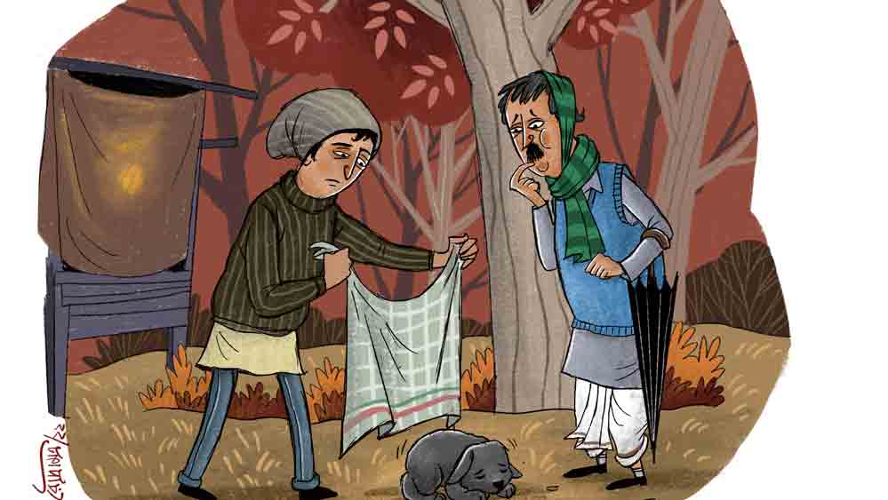

 
 <h1 align=center>আগরওয়াল অ্যান্ড সন্স</h1>
<h2 align=center>সোমজা দাস</h2> অনন্তলাল আগরওয়ালকে চেনেন? অনেকেই চেনেন, কেউ কেউ হয়তো চেনেন না। যাঁরা চেনেন না, তাঁদের অবগতির জন্য বলি অনন্তলাল এই শহরের বিখ্যাত সুপুরি ব্যবসায়ী। সুপুরি শুনে নাক কোঁচকাবেন না। জেনে রাখুন, এই শহরে যত সুপুরি কেনাবেচা হয়, তার সিংহভাগ আসে আগরওয়ালের গুদাম থেকে। ‘আগরওয়াল অ্যান্ড সন্স’ লেখা বিশাল গুদামটি দেখেননি পুরনো বাজারে? যদিও নামেই ‘সন্স’, অনন্তলাল আগরওয়ালের একটি মাত্র পুত্তুর, সেও মাটির সঙ্গে কথা কইছে। বয়স মাত্র ছয়। হয়তো আগরওয়ালের ইচ্ছে ছিল ডজনখানেক ‘সন্স’ বাড়িময় পঙ্গপালের মত ভোঁ ভোঁ করে বেড়াবে। তার সেই আশা দোকানের নামে প্রতিফলিত হয়েছিল। কিন্তু বাস্তবে সেই আশা দুরাশা।

প্রথমা স্ত্রীর অকালপ্রয়াণের পর বেশ দেরিতেই দ্বিতীয় বার দারপরিগ্রহ করে আগরওয়াল। প্রথম সন্তান জন্মায় আরও অনেক বছর পরে। বর্তমানে আগরওয়াল দম্পতির যথেষ্ট বয়স। অনন্তলালকেও একটিমাত্র পুত্রেই খুশি থাকতে হচ্ছে অগত্যা।

যাক, অনন্তলাল আগরওয়ালকে চিনলেন তো এ বার? তাকে আমি গত তিন মাসাধিক কাল খুঁজে চলেছি। না না, সে হারিয়ে-টারিয়ে যায়নি। এই শহরেই আছে, বহাল তবিয়তেই আছে। শুধু আমি দেখা করতে চাইলেই পাঁকাল মাছের মতো পিছলে যাচ্ছে ক্রমাগত।

কী ভাবছেন? আমি কোনও মহাজন-টহাজন কি না? নিশ্চয়ই ভাবছেন, অনন্তলালের কাছে মোটা টাকা পাই, তাই সে পালিয়ে বেড়াচ্ছে! আরে দূর মশাই! সিদ্ধেশ্বরী জুনিয়র হাই স্কুলের তস্য জুনিয়র বাংলার মাস্টার হয়ে অনন্তলাল আগরওয়ালকে টাকা ধার দেব আমি! ধন্যি মশাই আপনার কল্পনাশক্তি! আগরওয়ালের এক দিনের রোজগারে আমার হেসেখেলে কয়েক মাসের সংসার খরচ চলে যায়, বুঝলেন কি না!

আচ্ছা থাক। আপনাদের আর কষ্ট করে অনুমান করতে বসতে হবে না। আমিই বলছি। গোড়া থেকেই গুছিয়ে শুরু করি, কী বলুন? সবটুকু শুনে আপনারাই নাহয় বিচার করবেন।
  দাঁড়ান বাপু, আগে নিজের পরিচয়টা দিয়ে নিই। আমি হলুমগে রাধাকান্ত খাসনবিশ। পেশাটা তো আগেই বলেছি।

ঘটনার শুরু মাসপাঁচেক আগে। যদিও অনন্তলাল আগরওয়ালের সঙ্গে আমার আলাপ তারও অনেক আগে। কয়েক পুরুষ বাংলায় থেকে মাছেভাতে বাঙালি বনে গেলেও বাংলা ভাষাটা ঠিক আয়ত্ত করে উঠতে পারেনি সে। এক স্কুলে একই বেঞ্চে বসতাম দু’জন। অবশ্য বসতাম বলা ভুল, কারণ আগরওয়াল ক্লাসের অর্ধেক সময় তো দাঁড়িয়েই থাকত, কখনও ক্লাসের পিছনে, কখনও বেঞ্চের উপর কান ধরে। লেখাপড়ায় যত দূর অমনোযোগী হওয়া সম্ভব, তাই ছিল সে। সব ক্লাসে দু’-তিন বছর করে থামতে থামতে এক বার আমার ক্লাসে এসেছিল। মাত্র এক বছর আমি আর ও এক ক্লাসে পড়েছি। আমি আবার মোটামুটি ভালই ছিলাম লেখাপড়ায়। তাতে আর কী এল গেল বলুন? লেখাপড়া করে আমি গাধা পেটাচ্ছি, আর না করে আগরওয়াল মোটরগাড়ি হাঁকিয়ে বেড়াচ্ছে।

 দেখুন তো, আসল কথা বলতে গিয়ে বার বার অন্য কথায় এসে যাচ্ছি। এই আমার দোষ বুঝলেন? আমার বৌও বলে, আমি নাকি বেশি কথা কই। কিন্তু বিশদে ব্যাপারটা বুঝিয়ে না বললে আপনারা বুঝবেন কী করে? প্রদীপ জ্বালার আগে সলতে পাকাতে হয় না? যা বলছিলাম, অবস্থায় আকাশ-পাতাল ব্যবধান থাকলেও সেই স্কুলজীবন থেকে কেমন করে যেন বন্ধুত্বটা বেশ টিকে গিয়েছিল। সন্ধেবেলাটা বাড়িতে থাকতে আমার ভাল লাগে না কোনও দিনই। ওই সময় টিভিতে গিন্নির বস্তাপচা সিরিয়ালগুলো চলে। তার কড়া শাসনে আমার বাড়ির দেওয়ালে টিকটিকিগুলো অবধি ভয়ে ভয়ে থাকে, পাছে টিকটিকিয়ে ফেলে ভুল করে! আমি তখন বেশির ভাগ দিনই বেড়াতে বেরিয়ে যাই। এখানে সেখানে ঘুরে বেড়াই, কোনও দিন আগরওয়ালের গদিতে যাই। আড্ডা মেরে বাড়ি ফিরি।

মাস পাঁচেক আগেকার কথা। সন্ধেবেলা উদ্দেশ্যহীনের মতো ঘুরছিলাম রাস্তায়। পটলার চায়ের দোকানের সামনে এসে মনে হল, এক কাপ চা হলে মন্দ হয় না। গরম চা আর একটা প্রজাপতি বিস্কুট নিয়ে বসলাম বেঞ্চে।

শীতটা জাঁকিয়ে পড়েছিল। তার উপর বিকেলবেলায় এক পশলা বৃষ্টি হয়ে বেশ একটা কনকনে হাড়-কাঁপানো হাওয়া দিচ্ছিল। লোকজনের ভিড় কম ছিল রাস্তায়। পটলা দোকানে বসে হাই তুলছিল, তাড়াতাড়ি ঝাঁপ ফেলে বাড়ি পালানোর ইচ্ছে ছিল বোধ হয়। চা খেতে খেতে টুকটাক কথাবার্তা বলছিলাম আমরা।
এমন সময় শব্দটা শুনলাম। একটা মৃদু কুঁইকুঁই শব্দ। প্রথম বার শব্দটা কানে যাওয়ার পর অতটা গুরুত্ব  দিইনি। কিন্তু মিনিটখানেক পর আবার শুনলাম। এ বারে যেন একটু দীর্ঘস্থায়ী কান্নার মতো শব্দ। আমরা দু’জন দু’জনের দিকে তাকালাম। তার পর শব্দের উৎস সন্ধানে নামলাম। বেশি খুঁজতে হল না। মিনিট কয়েকের মধ্যে দোকানের পিছনে অন্ধকারে তার দর্শন পেলাম। ছোট্ট এক সারমেয় শাবক, সম্ভবত দেশীয় বংশোদ্ভূত। বৃষ্টিতে ঝুপ্পুস ভিজে, ভীষণ শীতে থরথর করে কাঁপছে বেচারা। বড় মায়া হল। পটলা একটা পুরনো গামছা দিয়ে জড়িয়ে দোকানের ভেতরে নিয়ে এল বাচ্চাটাকে। জ্বলন্ত স্টোভের পাশে ওকে দাঁড় করিয়ে শুকনো করে গা মুছল। তার পর এক বাটি গরম দুধে ক’টা বিস্কুট ভিজিয়ে খাওয়াল। স্টোভের আগুনের ওমে আর খাবার খেয়ে বাচ্চাটা একটু চাঙ্গা হয়ে উঠেছে তত ক্ষণে। কালো কুচকুচে শরীরে গলার কাছটায় সাদা দাগ। জুলজুলে চোখে আমাদের দু’জনকে দেখছে।

এত ক্ষণে আমাদের মাথায় আসল চিন্তাটা এল। বাচ্চাটাকে নিয়ে কী করা হবে? পটলার মা অত্যন্ত শুচিবায়ুগ্রস্ত মহিলা। কুকুর বেড়াল বাড়ির ত্রিসীমানা মাড়ালেই তিন বার চান করেন। বাড়িতে এই বাচ্চাটাকে নিয়ে গেলে নির্ঘাত পটলাকেই ঢুকতে দেবেন না বাড়িতে। আর আমার বাড়িতে আমার বৌ। কোন পরিস্থিতিতে যে কী প্রতিক্রিয়া দেখাবেন, আগে থেকে অনুমান অসম্ভব। কিন্তু উপায়ান্তর না থাকায় কুকুরছানাটিকে বাড়িতে নিয়ে যাওয়ার দুঃসাহস আমাকেই করতে হল।
ঘটনাক্রম পুরো বর্ণনা না করেও এটুকু বললেই বিবাহিত পাঠকেরা বিলক্ষণ বুঝবেন, সেই রাতে আমায় বসার ঘরের তক্তপোশে ঠান্ডায় জড়সড় হয়ে একাই শুতে হয়েছিল। না, ঠিক একা নয়। অকিঞ্চিৎকর হলেও সারমেয়কুলোদ্ভবটি একটি আস্ত প্রাণী তো বটে!

পরদিন সকালবেলায় বেরোলাম বাচ্চাটাকে নিয়ে পটলার দোকানে। দোকান বন্ধ। জানা গেল, কাল রাতে উঠোনের জলকাদায় আছাড় খেয়ে পটলার মায়ের কোমরে জোর লেগেছে। পটলা মাকে নিয়ে হাসপাতালে গিয়েছে। এই অবস্থায় কি কুকুরের কথা তোলা যায়? কিন্তু আমিই বা কী করি? এক দিনে ছানাটার উপর মায়া পড়ে গেছে। সে-ও বেশ আমার ন্যাওটা হয়ে উঠেছে দেখলাম। কিন্তু একে নিয়ে আবার বাড়িতে ঢুকলে গিন্নি আজ আমাকেই বাড়িছাড়া করবেন নিশ্চিত জানি।
কী করি ভাবতে ভাবতেই মনে পড়ল আগরওয়ালের কথা।

 আগরওয়াল বলছিল বটে সে দিন, একটা ভাল জাতের বিদেশি কুকুর পেলে পুষতে চায়। গুটিগুটি পায়ে কালুকে কোলে করে আগরওয়ালের গদিতে উপস্থিত হলাম। ওর ওই নামই রেখেছিলাম আমি। মাথায় একটাই চিন্তা ঘুরছিল। আগরওয়াল কি আর দেশি কুকুর পুষবে? সে না করে দিলে কালুকে নিয়ে যাব কোথায়, কী করব? আর যা-ই হোক ওকে রাস্তায় ছেড়ে দিতে পারব না।
সাতপাঁচ ভেবে কালুর জাতকুলটা চেপে যাওয়াই মনস্থ করলাম। আগরওয়ালও দোনামনা করে কালুকে নিজের কাছে রাখল। কালুকে ছেড়ে ফিরে আসার সময় মনটা হুহু করে উঠল। ব্যাটা এক দিনেই আমায় বড় মায়ায় বেঁধে ফেলেছিল। মাথায় হাত বুলিয়ে বেরিয়ে এলাম। বাড়ি ফিরে সারা রাত ঘুম হল না। আমার দশা দেখে গিন্নিরও বুঝি মায়া হল। স্ত্রিয়াশ্চরিত্রম্ দেবা ন জানন্তি। কিসে যে কী হয় সে বোঝা ভগবানেরও অসাধ্য, কুতো মনুষ্যা? তিনি নিজেই বললেন, “যাও, ওটাকে ফেরত নিয়ে এসোগে। কিন্তু খবরদার আমার ঠাকুরঘরে যেন না ঢোকে।”
মনে হচ্ছিল গিন্নিকে ধরে দু’চক্কর নেচে নিই। কিন্তু বয়সটা বিবেচনা করে আর সেই ঝুঁকি নেওয়া সমীচীন বোধ করলাম না।

কিন্তু সব কিছুর উপরে একটা ব্যাপার আছে, যার নাম কপাল। রাস্তায় বেরোতেই হোঁচট খেয়ে উল্টে পড়লাম। একটুর জন্য চলন্ত গাড়ির নীচে পড়ার থেকে রক্ষা পেলাম যদি বা, বাঁ পা-টি রক্ষা পেল না। গোড়ালির হাড়টি ভেঙেছে। ডাক্তার প্লাস্টার করে শয্যাবিশ্রামের বিধান দিয়ে দক্ষিণা নিয়ে বিদায় হলেন। এক মাস পরে আবার দেখবেন। তত দিন নট নড়নচড়ন।

এ বার আমার ঘরের ডাক্তারনিটি স্বমহিমায় অবতীর্ণ হলেন। পারলে তিনি আমায় হাতের আঙুলও নাড়তে দেন না। কী যে ঝামেলায় পড়া গেল!
মাস দেড়েক পর ডাক্তারবাবু এই বিশ্রাম নামক অত্যাচার থেকে ছুটি দিলেন আমায়। নিজের পায়ে দাঁড়ানোর আনন্দ সে-ই জানে, যাকে আমার মতো অবস্থার সম্মুখীন হতে হয়েছে। স্কুলে জয়েন করলাম আবার। দিন সাতেক পর মনে হল, এ বার আগরওয়ালের বাড়ি থেকে কালুকে নিয়ে আসাই যায়। যেমন ভাবা তেমনই কাজ। বিকেলে গিয়ে পৌঁছলাম আগরওয়ালের গদিতে। ট্রাক ভর্তি করে বস্তা বস্তা সুপুরি লোড করা হচ্ছে। আগরওয়াল রাস্তায় দাঁড়িয়ে তারই তদারক করছে দেখলাম। আমায় ইশারায় বলল ভেতরে বসতে। কিছু ক্ষণ পরে সে এল। বসে টুকটাক কথাবার্তা বলার পর আমার অভিপ্রায় ব্যক্ত করলাম।

আগরওয়াল দেখলাম চোখ গোল গোল করে চেয়ে আছে আমার দিকে। তার পর গলা খাঁকরে বলল, “সেটা তো না হবে ভায়া। টাইগার আমার ছেলের মতো। তোমাকে কেমন করে দিয়ে দিব?”
আমি এ সব ভেবেই এসেছিলাম। তাই আগরওয়ালের টাইগার, ওরফে আমার কালুর বংশপরিচয় ব্যক্ত করতেই হল। আগরওয়ালের হাত ধরে বললাম, “তোমায় আমি ভাল বিদেশি কুকুর জোগাড় করে দেব ভাই। কালুকে তুমি আমায় দাও। তোমার প্রাসাদের মতো বাড়িতে দেশি কুকুর মোটেই মানায় না। লোকে কী বলবে?”
আগরওয়াল বেশ কিছু ক্ষণ স্থির দৃষ্টিতে আমার দিকে তাকিয়ে রইল। তার পর হঠাৎই যেন কিছু মনে পড়ে গেছে এমন ভাবে তড়িঘড়ি আমায় কিছু না বলেই বেরিয়ে গেল।

তার পর থেকে আগরওয়ালের দেখাই পাওয়া যাচ্ছে না। তার গদিতে গেলেই শুনি সে নেই। বাড়ি অবধি ধাওয়া করেছি ক’বার। দেখলাম সেখানে এক উর্দিধারী দারোয়ান মোতায়েন হয়েছে। জিজ্ঞেস করলেই পাথরের মতো মুখে বলে, “সাহাব ঘরমে নেহি হ্যায়। বাদ মে আইয়ে।”
বাদ মে বাদ মে করে তিন মাস কাটল আরও। আপনারাই বলুন তো, এটা কি আগরওয়ালের উচিত কাজ হচ্ছে? হ্যাঁ, মানছি কালুকে আমিই আগরওয়ালকে দিয়েছিলাম। কিন্তু ও তো আসলে আমারই। আমার জিনিস ফেরত নিতে চাইলে কেন দেবে না? ঠিক করলাম, জোর করেই আগরওয়ালের বাড়িতে ঢুকে কালুকে নিয়ে আসব।

পরদিন গেলাম। ভাগ্য সুপ্রসন্ন। দারোয়ান বোধ হয় কাছেপিঠে কোথাও গিয়েছে। টুল খালি। গেট ঠেলে টুক করে ভেতরে ঢুকে পড়লাম। এগিয়ে গিয়ে সিঁড়িতে পা রাখতেই গরগর শব্দে চমকে উঠলাম। দরজার মুখে দাঁড়িয়ে এক কেঁদো বাঘের মতো বিশাল কালো কুকুর রুদ্ধ আক্রোশে গর্জন করছে। এই বাড়িতে আমার মতো হেঁজিপেঁজি লোকের আবির্ভাব সে মোটেই পছন্দ করছে না বোঝা গেল। থমকে গেলাম। এটা কে? কালু? গলার কাছের সাদা দাগটা দেখে নিশ্চিত হলাম, এ আমার কালুই। এই ক’মাসে এত বড় হয়ে গেছে?

সিঁড়ি দিয়ে এক পা উঠতেই ঘেউঘেউ করে তেড়ে এল। পেছন থেকে আগরওয়ালের গলা পেলাম। ‘টাইগার’,  ‘টাইগার’ করে ডাকতে ডাকতে ঘর ছেড়ে বেরিয়ে এল সে। আমায় দেখে একটু থমকে দাঁড়াল। তার পর মুখে হাসি টেনে বলল, w“এসো এসো, বাইরে কেন? ভিতরে এসো। টাইগার বাইরের লোক পসন্দ কোরে না। ও কিছু না করবে।”
গুটিগুটি পায়ে বসার ঘরে গিয়ে বসলাম। এ দিক-সে দিকের কথাবার্তার পর আগরওয়াল বললো, “দেখো ভাই, লুকাছুপি আমার ভাল লাগে না। তুমি দোস্তলোগ আছ। তাই সিধা বাত বলি। টাইগার তুমার ছিল। এখন হামার আছে। হামার ছেলে আছে।”

বলে উঠে গেল আগরওয়াল। দেরাজ খুলে একটা খাম নিয়ে এসে আবার আমার সামনে বসল। কতগুলো কাগজ আর স্ট্যাম্প পেপার বার করল।

“এই দেখো। টাইগার হামার ছেলে আছে। আগে রাস্তায় ছিল, তার পর হামি ওকে লেখাপড়া করে লিগালি অ্যাডপ্ট করেছি।”

দেখলাম। যে দিন আমি আগরওয়ালের গদিতে গিয়েছিলাম কালুকে ফেরত নিতে, তার পরের দিনের তারিখ। সে দিন ওর তড়িঘড়ি বেরিয়ে যাওয়ার কারণটা পরিষ্কার হল। মানে সে দিন ব্যাটা উকিলের কাছেই দৌড়েছিল এই ব্যবস্থা করার জন্য। আর তো কিছু করার নেই!   তবু শেষ চেষ্টা হিসেবে বললাম, “কিন্তু ও তো নেহাতই দেশি...”

আহত চোখে তাকিয়ে আগরওয়াল আমাকে বলল, “এ তুমি কেমন বাত বলছ ভাই! রয়্যাল বেঙ্গল টাইগারও তো দেশি জিনিস! হোল ওয়ার্ল্ড কি তাকে সন্‌মান কোরে না! যত দোষ হামার টাইগারের!”

মন খারাপ করেই আগরওয়ালের বাড়ি থেকে বেরিয়ে এলাম। তবু সান্ত্বনা পেলাম টাইগারের ভাগ্য দেখে। কপাল করে বাপ পেয়েছে ব্যাটা! বেরোতে গিয়ে চোখে পড়ল, গেটের পাশে ‘আগরওয়াল অ্যান্ড সন্স’ নাম লেখা ট্রাক। যাক, এত দিনে কোম্পানির নামটা সার্থক হল যা হোক।