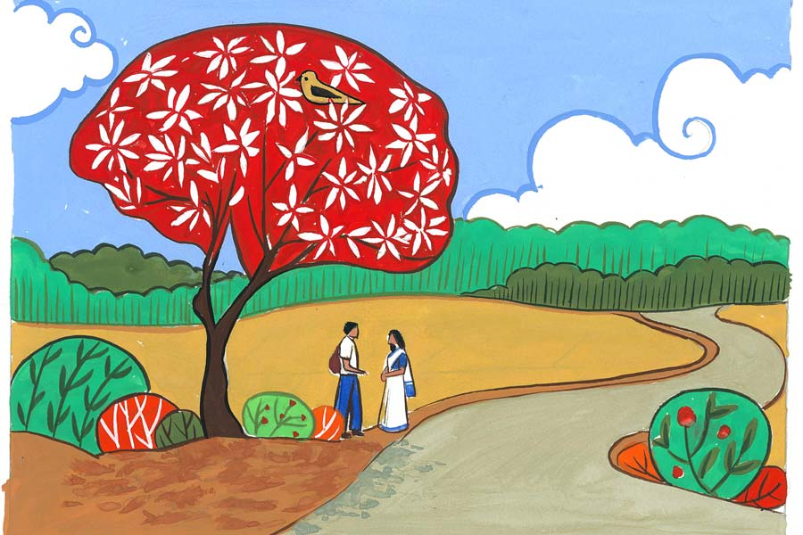

 
 <h1 align=center>আজ বসন্ত</h1>
<h2 align=center>অমিত দাস</h2> হইচইয়ের শব্দে মুখ তুলে জানলার বাইরে তাকাল শ্রীতমা। ছাত্রছাত্রীদের পরীক্ষা শেষের আনন্দের রেশ বোধ হয়। ওদের মজা হওয়া স্বাভাবিক। পরীক্ষার শেষ দিনের আনন্দ সব সময়েই আলাদা। এ বার এটা আরও স্পেশ্যাল। বছরদুয়েক পর আবার ওরা সবাই স্কুলে এসে এই পরীক্ষা দিল। অনেক দিন পর এক সঙ্গে কয়েকটা দিন কাটাল।

বাইরে হইহুল্লোড় বেড়ে চলেছে। ছাত্রছাত্রীরা নিজেদের মধ্যে আবির খেলছে। কেউ না মাখতে চাইলে সবাই মিলে ঘিরে ধরে মুখে আবির মাখিয়ে দিয়ে নিজেদের মধ্যে মজা করছে, মোবাইল ফোনে ছবি তুলছে। এত ক্ষণে ওর খেয়াল হল। আরে, কাল তো দোল! স্কুলে আসার পথে অবশ্য চোখে পড়েছে রাস্তার ধারে আবির, রং, পিচকিরি, বেলুন, টুপি, মুখোশ বিক্রি হচ্ছে। স্কুলে এসে নানা ঝামেলায় ভুলে গিয়েছিল। এখন মনে পড়ল। কাল ছুটি। এ সপ্তাহে আর স্কুল নেই। আবার সোমবার।

প্রাণোচ্ছ্বল ছেলেমেয়েগুলোকে দেখতে বড় ভাল লাগছিল। ও তন্ময় হয়ে ওদের দেখছিল।

“কী রে? রং মাখতে ইচ্ছে করছে? ওদের কাছ থেকে একটু আবির এনে তোকে মাখিয়ে দেব না কি?” মল্লিকার কথায় চমক ভেঙে তাকাল শ্রীতমা।

“ধ্যাত! ওদের রং খেলতে দেখে বেশ লাগছিল। এক-এক জনের মুখে নানা রঙের আবির বেশ মানিয়েছে।”

“সত্যি, জীবনের এই সময়টাই রঙিন, আনন্দে মেতে থাকার সময়। এই বয়সটা খুব মিস করি। স্কুল-কলেজ জীবনের বছরগুলো। সে যাকগে, তুই কি যাবি এখন?”

“তোর আজকের মতো কাজ শেষ?” জিজ্ঞেস করে শ্রীতমা।

“হ্যাঁ রে, এ বার বেরোব। রিনি, জয়াদি, সঙ্গীতারাও বেরিয়ে যাবে। তোকে খুঁজতে গিয়ে শুনলাম তুই এখানে বসে আছিস,” বলে মল্লিকা।

“এই আর কয়েকটা খাতা দেখা বাকি আছে। তোরা এগো। আমি এগুলো শেষ করে বেরোব।”

“ও কে। সামনের সপ্তাহে আবার দেখা হবে... ‘আজ আমাদের নেড়াপোড়া, কাল আমাদের দোল’! কাল বিজনদার সঙ্গে ভাল করে দোল খেলো সখী।”

মল্লিকা হাসতে হাসতে বেরিয়ে যাওয়ার পরও, ওর ইয়ার্কির রেশ রয়ে গেল। এই স্কুলে ওরা এক সঙ্গে জয়েন করেছিল বছর দশেক আগে। ও ইংরেজিতে, আর মল্লিকা সায়েন্সে। এই স্কুলে পাশাপাশি কাজ করতে করতে ওদের নিজেদের মধ্যে বন্ধুত্বটা বেশ দৃঢ় হয়ে উঠেছে। দু’জনে এক সঙ্গে হলেই নিজেদের মধ্যে ইয়ার্কি, ফাজলামো চলতে থাকে। মনের মধ্যে হাসির রেশটা ধরে রেখে আবার টেবিলে রাখা বাকি খাতাগুলোর দিকে মন দিল শ্রীতমা।

অভ্যস্ত চোখে বাকি খাতাগুলো দেখে নিতে বেশি সময় লাগল না। এত ক্ষণ টানা পরীক্ষার খাতা দেখতে দেখতে ঘাড় ব্যথা করছে। খাতা দেখা শেষ করে চোখ বুজে ঘাড়টা এ দিক-ও দিক দু’-এক বার আস্তে আস্তে ঘোরাল। এ রকম করলে একটু আরাম লাগে। টেবিলের উপরকার খাতাগুলো গুছিয়ে উঠতে যাবে, তখনই জানলা দিয়ে বাইরে চোখ পড়ল। রোগা, লম্বা মতো একটা ছেলে ওদের স্কুলের কম্পাউন্ডের বাইরে একটা বাড়ির পাঁচিল ঘেঁষে রাস্তার ধারের কৃষ্ণচূড়া গাছের ছায়ায় দাঁড়িয়ে আছে। আর পায়ে পায়ে ওর দিকে নিঃশব্দে এগিয়ে চলেছে একটা মেয়ে।

এ দিকটা একটু একটেরে। স্কুলের যাতায়াতের পথের বাইরে। জায়গাটা দোতলায় এই টিচার্স রুমের জানলা দিয়ে চোখে পড়ে। স্কুলের গেটের বাইরে দাঁড়িয়ে আবির খেলা ছেলেমেয়েদের ভিড় সরে গেলে ওরা দু’জন আর একটু নিরিবিলি জায়গা খুঁজে নিয়েছে। ইলেভেনে ক্লাস নেওয়ার কারণে ও ওই ছেলেমেয়ে দু’জনকে চেনে। ছেলেটা একটু চুপচাপ। সায়েন্স নিয়ে পড়লেও ছেলেটার লিটারেচার সেন্স ভাল, লেখার হাত চমৎকার। মেয়েটা চটপটে, সপ্রতিভ। টিচার হিসেবে ওদের ব্যক্তিগত পরিসরে ঢুকে পড়া ঠিক হচ্ছে না বুঝেও, অদম্য কৌতূহলে ও ওদের দু’জনের দিকে তাকিয়ে রইল।

মেয়েটা পায়ে পায়ে ছেলেটার কাছে এসে এক মুঠো আবির ছেলেটার সারা মুখে মাখিয়ে দিল। ছেলেটা মুহূর্তের জন্য অপ্রস্তুত। চোখ থেকে চশমাটা খুলে জামায় মুছে নিল। তার পর মেয়েটার হাতের আবির তুলে নিয়ে ওরও সারা মুখে মাখিয়ে দিল। মেয়েটা চোখ বুজে দাঁড়িয়ে আছে। এত দূর থেকেও শ্রীতমা বুঝতে পারল, এই পড়ন্ত বেলায়, স্কুল কম্পাউন্ডের বাইরে রাস্তার ধারে লাগানো পলাশ, কৃষ্ণচূড়া, রাধাচূড়ার রঙিন ফুলে, বসন্তের শেষ বিকেলে ঢলে পড়া সূর্যের বর্ণচ্ছটার রং মেয়েটার সারা মুখে ছড়িয়ে।

সন্ধ্যায় ফ্ল্যাটের ব্যালকনিতে এক কাপ চা নিয়ে বসে বিকেলের মুহূর্তগুলো ভাবছিল শ্রীতমা। চতুর্দশীর চাঁদ উঠতে একটু দেরি। মনে পড়ছিল, মল্লিকার বলা ‘আজ আমাদের নেড়াপোড়া, কাল আমাদের দোল’ কথাগুলো। ছোটবেলায় ওদের পাড়ায় নেড়াপোড়া হত। পাড়ার বড় দাদারা ঘুরে ঘুরে নারকেল, সুপারি গাছের ঝরে পড়া ডাল সংগ্রহ করে রাখত। ওরা, পাড়ার ছোটরা, আরও কিছু শুকনো পাতা জড়ো করত, মাটি দিয়ে বুড়ি বানাত, বুড়ির ঘর তৈরিতে হাত লাগাত। সন্ধে লাগার মুখে, বড়রা সবাই মিলে সেই বুড়ির ঘরে আগুন দিত। আগুন দেওয়ার আগে ওরা বাড়ি থেকে আলু, বেগুন এনে দিত। বুড়ির ঘর জ্বলতে থাকার পর ওরা জ্বলতে থাকা আগুন ঘিরে হাতে হাত ধরে বলত, ‘আজ আমাদের নেড়াপোড়া, কাল আমাদের দোল...’ নেড়াপোড়ার পর সবাই মিলে ওই ঝলসানো আলু, বেগুন খুঁজে বার করে, একটু নুন দিয়ে খেতে বেশ মজা লাগত।

বসন্তের সন্ধেয় ওই নেড়াপোড়া, পরের দিন দোল খেলার রঙিন আনন্দের ছবিগুলো ওর মনের গভীরে রয়ে গেছে। ছোটবেলায় দেখেছে, ওর মার আপত্তি সত্ত্বেও বাবা উৎসাহ দিয়েছে রং খেলায়। আবির, পিচকিরি, বেলুন এনে দিত। বালতিতে রং গুলে, পিচকিরি দিয়ে বেলুনে ভরে দিত। দোলের দিন সকালে, ঠাকুরদা-ঠাকুমাকে আবির দেওয়ার পর, ছোটদের সঙ্গে সঙ্গে থেকে উৎসাহ দিত, পিচকিরি দিয়ে রং দিতে, বেলুন ছুড়তে। দুপুর অবধি অনাবিল আনন্দে ভরে থাকত ওরা। কোনও কোনও বাড়ি থেকে আসত সত্যনারায়ণ পুজোর প্রসাদ। সিন্নি, লাল বাতাসা, খেজুর, শসা, কলা আপেলের টুকরো, শাঁখ-সন্দেশ। সন্ধেয় মামাবাড়ি গিয়ে দাদু, দিদা, মামা, মামিকে আবির মাখানো। স্কুলজীবনের শেষের দিকে রং খেলা বদলে গিয়েছিল। কৈশোরের শেষ বেলায় মা সবার সঙ্গে রং খেলতে বারণ করত। তখন মন না মানলেও, ও একটু বড় হয়ে বুঝেছে কারণটা। কলেজে পৌঁছে, দোলের দিন বন্ধুদের সঙ্গে দেখা হওয়ার প্রশ্ন ছিল না। অগত্যা দোলের আগের দিন, ওরা নিজেদের মধ্যে আবির খেলত। আজ স্কুলের ছেলেমেয়েদের আবির খেলতে দেখে ওর সেই সব দিনগুলো মনে পড়ছিল। সেই সঙ্গে মনে পড়ে গিয়েছিল, কলেজের থার্ড ইয়ারে, দোলের আগের দিনটা।

ওদের সঙ্গে কলেজের ইংরেজি অনার্সের ফার্স্ট ইয়ারে ভর্তি হয়েছিল ছেলেটা। আজকের ছেলেটার মতোই রোগা, লম্বা, চশমা-পরা। শহরতলি থেকে লোকাল ট্রেন, বাস ধরে কলেজে আসত ও। ক্লাসে বা ক্লাসের বাইরে চুপচাপ থাকত ছেলেটা। কলেজে ক্লাসের ফাঁকে ওরা যখন কফি হাউস, নন্দন, রবীন্দ্রসদন, ভিক্টোরিয়ায় যেত, অধিকাংশ সময় ওদের সঙ্গে থাকত না। নানা ভাবে এড়িয়ে যেত। কখনও এড়িয়ে যেতে নিতান্ত নাচার হলে, ওর দেখা মিলত। সবাই মিলে যখন হইচই করছে, তখনও ও চুপচাপ, সবার কথা শুনছে বা অন্য কিছু ভাবছে।

শ্রীতমা তখন ওদের কলেজে ইংরেজি অনার্সের নামী ছাত্রী, কলেজ দাপিয়ে বেড়াচ্ছে। এক্সটেম্পো স্পিচ, ডিবেট, ড্রামা, ফেস্টে কলেজের প্রতিনিধি। একের পর এক মেডেল, প্রশংসা, ভক্তদের ভিড়। তবু ক্লাসে লিটারেচারের কোনও পিস-এর উপর বিশ্লেষণ, মৌলিক লেখা, ওয়াল ম্যাগাজ়িনের কবিতা, ফার্স্ট ইয়ার, সেকেন্ড ইয়ারের পরীক্ষায় লিটারেচারের নম্বর, সব কিছুতেই কেমন করে যেন ওই মুখচোরা ছেলেটা এগিয়ে থাকত। শ্রীতমা কিছুতেই এটা মেনে নিতে পারত না।

কলেজের থার্ড ইয়ারে, বইমেলায় গিয়ে একটা আশ্চর্য অভিজ্ঞতা হয়েছিল। বাবার মতো ও-ও কবিতার ভক্ত। প্রতিষ্ঠিত কবির থেকে উঠতি, নতুন কবিদের কবিতা পড়তে ওর ভাল লাগত। বাবা বলত, নতুনদের কবিতায় ক্ষমতা কিংবা প্রতিষ্ঠার আঁশটে গন্ধটা থাকে না।

লিটল ম্যাগাজ়িনের স্টলগুলোয় ঘুরতে ঘুরতে চোখে পড়েছিল পাতলা কবিতার বইটা। কবির নাম দেখে নিতান্ত কৌতূহলে হাতে নিয়ে চোখ বোলাতে গিয়ে কখন যেন হারিয়ে গিয়েছিল। প্রতিটা কবিতার ছত্রে ছত্রে যেন ওর কথা লেখা! লাইনগুলো যেন বুকের কোনও গভীর, গোপন তন্ত্রীতে টান দিয়ে যায়। স্টলের উল্টো দিকে বসে ছিল সেই নিতান্ত পরিচিত মুখচোরা ছেলেটা। বইটা তারই লেখা। গিয়ে তাকে ধরেছিল শ্রীতমা। তাকে বইয়ে সই করে দিতে হবে। খুবই লজ্জা আর আড়ষ্টতার সঙ্গে বইয়ের প্রথম পাতায় সই করে লিখেছিল, ‘শ্রী-কে’। তার পর থেকে বহু দিন বাড়িতে ফিরে ঘুমহীন চোখে রাতের পর রাত পড়ে গেছে বইটার একটার পর একটা কবিতা।

তার পরেই এসেছিল থার্ড ইয়ারের বসন্ত উৎসব। পরীক্ষা সামনে জেনেও এসেছিল ওরা সবাই। কলেজ ক্যাম্পাসের মাঠে ওরা মেতেছিল আবির নিয়ে রঙের উৎসবে। অন্যান্য বারের মতো এ বারও ওই ছেলেটা এসে এক ধারে দাঁড়িয়েছিল চুপ করে। রং দেওয়া-নেওয়ায় মাতেনি। রং খেলার শেষে যখন সবাই বাড়ি ফেরার পথ ধরেছিল, তখন ছেলেটা কেন যেন রয়ে গিয়েছিল। বাড়ি থেকে গাড়ি আসবে বলে বন্ধুদের সঙ্গে ফেরা এড়িয়ে গিয়েছিল শ্রীতমা। কলেজের মাঠের ধারে তখন কোনও কৃষ্ণচূড়া, পলাশ, কদম গাছ ছিল কি না মনে নেই। সেই বিকেলে কোনও কোকিল ডেকেছিল কি না, মনে নেই। ‘ফুল ফুটুক, না ফুটুক, আজ বসন্ত’... মনে মনে বলতে বলতে এগিয়ে গিয়েছিল ও। হাতের মুঠোয় থাকা লাল আবির মাখিয়ে দিয়েছিল মাঠের ধার ঘেঁষে দাঁড়ানো ছেলেটার সারা মুখে। প্রথমে কিছুটা হতচকিত হলেও, সে দিন কিছুটা স্বভাববিরুদ্ধ ভাবে ছেলেটা ওর হাত থেকে আবির নিয়ে মাখিয়ে দিয়েছিল ওর সারা গালে। ও নীরবে, চোখ বুজে, ওই মুহূর্তে তার স্পর্শ অনুভব করেছিল ওর সারা শরীর, মন দিয়ে। এর পর শেষ বিকেলের অস্তগামী সূর্যের সারা আকাশ জুড়ে হোলিখেলাকে সাক্ষী রেখে শ্রীতমার বন্ধ চোখের পাতায়, কপালে, ঠোঁটে ছুঁয়ে গিয়েছিল ওর ঠোঁট। প্রথম চুম্বনের মহার্ঘ স্পর্শে তিরতির করে কেঁপেছিল শ্রীতমার সারা শরীর, মন।

সেই প্রথম, সেই শেষ। কলেজের পাঠ শেষ হওয়ার পর, নিজেদের কক্ষপথে ঘুরতে ঘুরতে কে যে কোথায় হারিয়ে গেল! সে সময় ওদের কারও মোবাইল ফোন ছিল না, ছিল না সোশ্যাল নেটওয়ার্ক। আক্ষরিক অর্থে ওরা ছিটকে গিয়েছিল চার দিকে। মাস্টার্স করার পর, বি এড করে শ্রীতমা এই স্কুলে। মাসকয়েক আগে ওদের কলেজের মৌসুমি উদ্যোগ নিয়ে ওদের কলেজ ব্যাচের ছেলেমেয়েদের জড়ো করছে হোয়াটসঅ্যাপে। জীবনের এতগুলো বছর পেরিয়ে এসে ওদের সবার চেহারা অনেক বদলে গেছে। গ্রুপের ছবিতে অনেকের নাম দেওয়া না থাকলে চেনা যায় না।

গতকাল ওদের গ্রুপে মৌসুমি একটা মেসেজ পাঠিয়েছে। কলকাতার আশপাশে যারা আছে, তাদের নিয়ে ও দোলের দিন বিকেলে একটা আড্ডার আয়োজন করছে। ওকে ফোন করেছিল গত সন্ধ্যায়। অনেক করে আসতে অনুরোধ করেছে, বিজনকে সঙ্গে নিয়েই। শ্রীতমা মনস্থির করতে পারেনি। বিয়ের পর থেকে ওর কাছে দোল মানে, সকালে ওদের কমপ্লেক্সের কয়েক জন পড়শিদের মধ্যে একটু আবির খেলা। ও পছন্দ না করলেও, দিনের বেলাতেই বিজন ওদের সঙ্গে ড্রিঙ্ক নিয়ে বসে। সন্ধেয় আবার বিজনের কোলিগদের পার্টি। আবার ড্রিঙ্ক, নাচ, গান, খুচরো বেলেল্লাপনাতেই দিন শেষ হয় বিজনের। দোলের দিনটা কেমন যেন রঙিন হতে গিয়েও শেষমেশ বর্ণহীন হয়ে যায় শ্রীতমার। বিজন বড় একগুঁয়ে আর রগচটা। শ্রীতমার পছন্দ-অপছন্দের মূল্য সে কখনওই তেমন করে দেয়নি। অন্য কোথাও গিয়ে, অন্য কোনও ভাবে দিনটা কাটানোর কথা অনেক বার বিজনকে বলেও লাভ হয়নি।

এ বারও, মৌসুমির আমন্ত্রণ সত্ত্বেও জানে না, ও নিজে ওদের আড্ডায় যেতে পারবে কি না। ও দোলের দিনের বেহেড বিজনকে নিয়ে বন্ধুদের সামনে যেতে চায় না। এই কারণেই মৌসুমিকেও এড়িয়ে গেছে গত দু’দিন ধরে।

অফিস থেকে ফিরে বিজন এক পড়শির ফ্ল্যাটে গেছে একটা বোতল বগলদাবা করে। আজ সন্ধে থেকেই ওদের দোলের সেলিব্রেশন চালু। চতুর্দশী পেরিয়ে পূর্ণিমার দিকে পায়ে পায়ে এগিয়ে চলা চাঁদের আলো দু’চোখে ভরে নিতে শ্রীতমা ব্যালকনিতে বসে। ফোনে ভেসে আসা মেসেজের শব্দে সংবিৎ ফিরে ফোনটা তুলে এক এক করে মেসেজগুলো দেখতে থাকে।

অচেনা এক নম্বর থেকে আসা মেসেজে চোখ পড়ে, ‘ভ্রুপল্লবে ডাক দিলে, দেখা হবে চন্দনের বনে’। মেসেজের প্রোফাইল পিকচারে থাকা ছবিটা বহু যুগ পেরিয়েও কেমন যেন চেনা ঠেকে। রোগাটে চেহারা যেন অনেকটাই পুরন্ত। গালে নরম হালকা দাড়ি। চোখদুটো একই রকম স্বপ্নময়।

অজানা এক সম্ভাবনায় শ্রীতমার সারা শরীর, মন, সমস্ত অনুভূতি তিরতির করে কেঁপে ওঠে, বহু বছর পর আবার। সে আর কিছু চিন্তা করে না। মৌসুমিকে মেসেজে জানিয়ে দেয়, দোলের বিকেলের আড্ডায় সে যাবে।