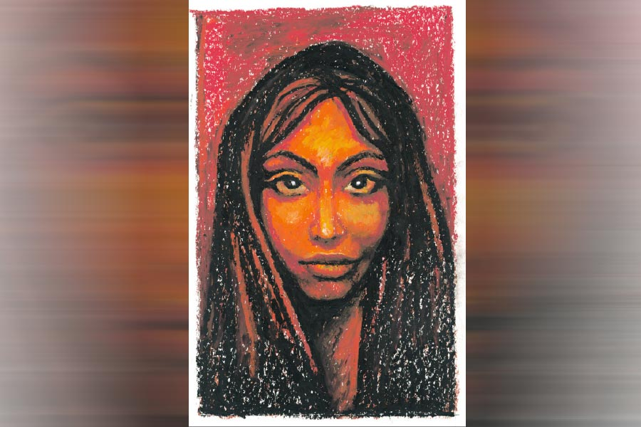

 
 <h1 align=center>আততায়ী</h1>
<h2 align=center>দিলীপ মাশ্চরক</h2> নীচের ডোরবেলটা বাজছে। এক বার থেমে, আবার এক টানা। যে এসেছে সে খুব অধৈর্য। অস্মিতার ভুরু কুঁচকে গেল। ল্যাব থেকে ফিরেছে আধ ঘণ্টা। ফ্রেশ হয়ে একটু চা নিয়ে অনির্বাণের কাছে বসবে ভাবছিল, সারা দিন বেচারা একা একা শুয়ে থাকে। এখন আবার কে জ্বালাতে এল! কাজের মেয়েটা অস্মিতা ফিরলেই চলে যায়। বাড়িটাও বড্ড একটেরে। চার দিকে বাগান-ঘেরা ছোট্ট দোতলা বাড়ি। অনির্বাণের বাবার শখ করে তৈরি। বাড়িতে লোক বলতে দু’জন, অস্মিতা আর অনির্বাণ। একতলাটা ফাঁকাই পড়ে থাকে।

ডোরবেলের আওয়াজটা অচেনা। অস্মিতা নাইটির উপর ড্রেসিং গাউন জড়িয়ে নিল। সন্ধে সাতটা বাজে। অনির্বাণ চোখ বুজে শুয়ে আছে। ঘুমোচ্ছে না জেগে আছে, দেখলে বোঝা যায় না।

নীচে নেমে মেহগনির ভারী দরজাটা খুলল অস্মিতা। এর পরে একটা গ্রিলের দরজা। গ্রিলের ফাঁক দিয়ে আগন্তুককে দেখে অস্মিতার হৃৎপিণ্ড থমকে গেল। ঋক! খুব সুন্দর ট্রিম করা দাড়ি আর ব্যাকব্রাশ চুলে মনে হচ্ছে যেন গতকালই এই দরজা থেকে ফিরে গিয়েছে।

হৃৎপিণ্ডের শব্দটা দ্বিগুণ জোরে ফিরে এল। অস্মিতা খুব স্বাভাবিক ভাবে গ্রিলের দরজাটা খুলল। তার পর বলল, “এসো...”

একটু হেসে ঋক বলল, “কী রকম সারপ্রাইজ় বলো!”

অস্মিতা দরজা লাগিয়ে ঘুরে দাঁড়াতেই সিঁড়ির আধো অন্ধকারে ঋক অস্মিতাকে জড়িয়ে ধরল। অস্মিতা বাধা দিল না, সাড়াও দিল না। কপালে ঠোঁট ছুঁইয়ে ঋক বলল, “তুমি আগের চেয়ে অনেক সুন্দরহয়েছ, অস্মি।”

অস্মিতা সিঁড়ি দিয়ে উঠতে উঠতে বলল, “তুমি কবে এসেছ?”

ঋক বলল, “আজ দুপুরেই। সদর স্ট্রিটের একটা হোটেলে উঠেছি।”

দোতলার ডাইনিং স্পেসে বড় সোফায় ঋককে বসাল অস্মিতা। একটা রুমালে মুখ মুছে ঋক বলল, “অনির্বাণ কোথায়?”

অস্মিতা নিচু স্বরে বলল, “শোওয়ার ঘরে। বোধহয় ঘুমোচ্ছে, ওকে বিরক্ত করার দরকার নেই।” ঋক কাঁধ ঝাঁকিয়ে বলল, “ঠিক আছে, আগে জমিয়ে এক কাপ চা খাওয়াও।”

রান্নাঘরে গিয়ে এক মিনিট দাঁড়িয়ে রইল অস্মিতা। নিজেকে কেমন অগোছালো লাগছে। অকারণেই ড্রেসিং গাউনের ফিতেটা খুলে আবার বেঁধে নিল। চায়ের জল চাপিয়ে পাশের দরজা দিয়ে শোওয়ার ঘরে গেল। অনির্বাণ একই রকম ভাবে চোখ বুজে শুয়ে আছে। ডিসেম্বরের মাঝামাঝি, শীত বাড়ছে। কম্বলটা গায়ের ওপর টেনে দিল অস্মিতা। তার পর আয়নার সামনে দাঁড়িয়ে চুলটা ঠিকঠাক করে রান্নাঘরে ফিরে এল।

চা নিয়ে ডাইনিং স্পেসে এল অস্মিতা। ঋককে বলল, “এই নাও তোমার চা। এখনও দেখছি খুব চা ভালবাসো।”

সোফায় পা ছড়িয়ে বসে ঋক বলল, “তোমার মতোই তোমার চা-টাও আমি খুব মিস করি।”

“আর বাজে কথা বোলো না,” অস্মিতা হাসল, “তুমি এ বার এ দেশে কেন এসেছ?”

ঋক নীরবে চায়ে কয়েক বার চুমুক দিল। তার পর আস্তে আস্তে বলল, “কোম্পানির কাজে নয়, এসেছি একটা মিশন নিয়ে।”

অস্মিতা ভুরু তুলল, “সে আবার কী?”

“বলছি। তার আগে বলো, তুমি কেমন আছ?”

অস্মিতা অন্য দিকে তাকিয়ে উদাসীন গলায় বলল, “ভালই আছি। দিন কেটে যাচ্ছে এক রকম।”

“তুমি এখানে কী করো?”

“একটা ফরেনসিক ল্যাবে কাজ করি।”

“তুমি যখন থাকো না, অনির্বাণকে কে দেখাশোনা করে?”

“একটা কাজের মেয়ে আছে, সারা দিন থাকে। অনির্বাণকে বাথরুম করানো, স্নান করানো— আমি নিজেই করি।”

“অনির্বাণের অ্যক্সিডেন্টটা যেন কবে হয়েছিল?”

“দু’বছর আগে। রাস্তা পার হচ্ছিল… একটা গাড়ি এসে পিছন থেকে ধাক্কা দেয়।”

ঋক পকেট থেকে সিগারেটের প্যাকেট বার করল। চোখ সরু করে বলল, “মে আই?”

অস্মিতা উত্তর না দিয়ে একটা অ্যাশট্রে এনে টেবিলে রাখল। দামি লাইটার দিয়ে সিগারেট ধরিয়ে লাইটারটা কোটের পকেটে রেখে ঋক বলল, “এটা প্যারাপ্লেজিয়া। তুমি জানো এটা সারে না। অনির্বাণ কোনও দিনই উঠে দাঁড়াতে পারবে না।”

একটু কঠিন গলায় অস্মিতা বলল, “হঠাৎ এ কথা?”

ঋক নরম ভাবে বলল, “তোমার বিয়ে হয়েছে তিন বছর, তোমার বয়েস এখন আঠাশ। তুমি কত দিন এই মানুষকে আঁকড়ে পড়ে থাকবে?”

অস্মিতা সোফায় নড়েচড়ে বসল। ধারালো গলায় বলল, “তুমি কি এ সব বাজে কথা বলতে এসেছ?”

ঋক সরাসরি অস্মিতার চোখে চোখ রাখল। তার পর আস্তে আস্তে বলল, “হয়তো অন্য কোথাও একটা দীর্ঘ সুখী জীবন তোমার জন্য অপেক্ষা করে আছে।”

অস্মিতা শান্ত কঠিন স্বরে বলল, “আমার জীবন আমি যে ভাবে খুশি কাটাব।”

কথাটা বলেই অস্মিতার মনে হল, এতটা রূঢ় ভাবে না বললেও হত। মনের গহনে অস্মিতাও কি নিষ্কৃতি চাইছে না! যখন খুব ক্লান্ত লাগে, যখন এই অসুস্থতার সঙ্গ খুব একঘেয়ে হয়ে ওঠে— আর একটা নতুন জীবনের স্বপ্ন কি সেও দেখে না! এই নির্জন বাড়িতে নিঃসঙ্গতা মাকড়সার জালের মতো জড়িয়ে আছে, চিবুক বেয়ে গড়িয়ে পড়া জলের ফোঁটায় সেই অদৃশ্য জাল খুব স্পষ্ট ভাবে দেখা যায়। 

অন্যমনস্ক ভাবে সিগারেট টানছিল ঋক। ওকে দেখছিল অস্মিতা। এক সময় এই মানুষটার জন্য সর্বস্ব দিতে রাজি ছিল। শারীরিক সম্পর্কও হয়েছিল। কিন্তু ঋককে ঠিক চিনতে পারেনি। ঠিক চার বছর আগে এ রকমই ডিসেম্বরের এক সন্ধেয় একটা বিয়েবাড়িতে ঋকের সঙ্গে দেখা হয় অপালার। বাদামরঙা চোখের সেই মেয়েটিকে দেখে পাগল হয়ে ওঠে ঋক। কিন্তু আলাপের প্রথম পর্বেই জানা গেল, অপালার বিয়ে ঠিক হয়ে আছে মাসখানেকের মধ্যেই। মুষড়ে পড়ে ঋক।

তার পর বিয়ের ঠিক সাত দিন আগে অপালাকে আর খুঁজে পাওয়া গেল না। অনেক পরে জানা গেল, ঋক তাকে নিয়ে চলে গেছে নিউ জার্সিতে। একটু বাউন্ডুলে স্বভাবের ঋককে কেউ ট্রেস করতে পারল না।

তার পর কত দিন রাত জেগে কাটিয়েছে অস্মিতা। চোখে জল আসত না, শুধু জ্বালা করত। প্রত্যাখ্যানের কষ্টের চেয়েও হীনম্মন্যতা তাকে কুরে কুরে খেত। তিন বছরের সম্পর্ক মানুষ এত সহজে ভুলে যেতে পারে? আশ্চর্য হয়ে অস্মিতা দেখল, এর পরেও তার ভিতরকার অভিমান হিমশৈলের মতো গলে যাচ্ছে।

সিগারেটটা অ্যাশট্রেতে গুঁজে রাখল ঋক। অস্মিতা নিজেকে একটু গুছিয়ে নিয়ে বলল, “আমার কথা থাক। অপালার খবর কী বলো।”

বিষণ্ণ ভাবে ঘাড় নাড়ল ঋক, “অপালা নেই।”

“সে কী? কী হয়েছিল?”

‘মাস ছয়েক আগে কার অ্যাক্সিডেন্টে পায়ের হাড় ভেঙে যায়। প্লাস্টার করা অবস্থায় বেডরিডেন ছিল। সন্ধেবেলায়ও ওর সঙ্গে অনেক গল্প করেছি… পরদিন সকালে উঠে দেখি, ওর নিথর দেহটা বিছানায়পড়ে আছে।”

“কী হয়েছিল?”

“ডাক্তার পরীক্ষা করে দেখে বলল, এম্বলিজ়ম।”

অনেক ক্ষণ চুপ করে থাকে অস্মিতা। ঘড়ির কাঁটার শব্দে পেরিয়ে যায় সময়। হাত বাড়িয়ে অস্মিতার আঙুলের ওপর হাত রেখে আস্তে আস্তে ঋক বলল, “একটা নতুন গল্প শুরু করো অস্মি।”

অস্পষ্ট গলায় অস্মিতা বলল, “আর অনির্বাণ? সে ওই নতুন গল্পের কোথায় থাকবে?”

ঋক গলা নামিয়ে বলল, “আমি তার ব্যবস্থা করে দেব।”

“মানে?”

অস্মিতার দিকে ঝুঁকে ঋক ফিসফিস করে বলল, “মানে, ওর যন্ত্রণা বাড়িয়ে কোনও লাভ নেই। ও আর সেরে উঠবে না। এর পরে আস্তে আস্তে বেডসোর, আরও যন্ত্রণাদায়ক মৃত্যু। আমি ওকে মুক্তি দিতে চাই।”

“কী বলছ পাগলের মতো?”

“খুব সহজ ব্যাপার অস্মি। ভেনের মধ্যে একটু এয়ার পুশ করে দেব। বহুকাল শুয়ে আছে, ডাক্তার বলবে এম্বলিজ়ম। আমি না করলেও নিজে নিজেও এটা হতে পারে।”

ধমনীর রক্ত ছলাৎ করে উঠে হৃৎপিণ্ডে ধাক্কা দেয়। দু’হাতের পাতায় মুখ চেপে ধরে অস্মিতা। আর্ত স্বরে বলে, “তুমি কী বলছ ঋক তুমি জানো না, তুমি এক বার অনির্বাণকে দেখো, তোমার মায়া হবে।”

ঋক হাত রাখে অস্মিতার পিঠে। কোমল গলায় বলে, “চলো, ওর ঘরে গিয়েই বসি।”

হাতের ব্যাগটা নিয়ে উঠে দাঁড়ায় ঋক। অন্ধকার প্যাসেজ পেরিয়ে শোওয়ার ঘরে টেবিল ল্যাম্পের হালকা মায়াবী আলো। খুব ধীরে ধীরে পাতলা কম্বলে ঢাকা দেওয়া বুক উঠছে, নামছে। বিছানার পাশে দাঁড়িয়ে একদৃষ্টে তাকিয়ে থাকে ঋক। তার পর চোখ ফেরায় অস্মিতার দিকে। তার দৃষ্টি অদ্ভুত।

অস্মিতা ঠোঁটের ওপর তর্জনী রেখে চুপ থাকার ইঙ্গিত করল। ঋক সাবধানে চেয়ারে বসে আস্তে আস্তে ব্যাগ থেকে বার করল একটা ক্যানিস্টার।

অস্মিতা দাঁতে দাঁত চেপে প্রশ্ন করল, “এটা কী?”

হাত বাড়িয়ে বিছানার দিকে ঝুঁকে কয়েক বার স্প্রে করল ঋক। তার পর ব্যাগ খুলে ঢুকিয়ে রাখতে রাখতে বলল, “ঘুমের ওষুধ, আট ঘণ্টার মধ্যে ওর ঘুম ভাঙবে না।”

অধীর গলায় অস্মিতা বলে, “তুমি ওকে ঘুম পাড়ালে কেন?”

ঋক শান্ত গলায় বলে, “এর মধ্যেই আমি ইন্ট্রাভেনাস ইঞ্জেকশনটা দিয়ে দিতে পারব।”

অস্মিতা ঋকের দিকে স্থির দৃষ্টিতে তাকিয়ে থাকে। এই ঋককে সে চেনে। কোনও পথই ওর অগম্য নয়। কিন্তু অস্মিতা এখন কী করবে? অস্মিতার মনে হল, এই নির্জন বাড়িতে সে সত্যিই খুব একা।

একটু ঝুঁকে ব্যাগ থেকে একটা ছোট বোতল বার করল ঋক। বোতলটা অস্মির দিকে বাড়িয়ে দিয়ে বলল, “অস্মি, একটা গ্লাসে ঢেলে একটু বরফ দিয়ে নিয়ে এসো প্লিজ়। তুমি খাবে না?”

অস্মিতা খুব ধীরে দু’দিকে ঘাড় নাড়ল। তার পর রান্নাঘরে গিয়ে একটু দাঁড়াল সে। কাঁপা হাতে গ্লাসে হুইস্কি ঢেলে ফ্রিজ় থেকে বরফ নিয়ে মেশাল।

হুইস্কিতে চুমুক দিতে দিতে নরম গলায় ঋক বলল, “মন খারাপ কোরো না অস্মি, এটা একটা অ্যক্সিডেন্ট, আমরা শুধু প্ল্যান করে ঘটাতে চাইছি। যেখানে বেঁচে থেকে আর কোনও লাভ নেই, যার পরিণতিতে আছে দীর্ঘ যন্ত্রণাদায়ক মৃত্যু… তার পক্ষে এটাই ভাল। চিন্তার জড়তা কাটিয়ে উঠলে তুমিও বুঝতে পারবে।”

অস্মিতা ঋকের চোখে চোখ রাখে। আস্তে আস্তে বলে, “তা হলে অপালাও কি…”

ঋক হেসে মাথা নাড়ে, “এটা বলার জন্য কোনও প্রাইজ় নেই ডার্লিং। অপালার ছিল সাঙ্ঘাতিক সন্দেহবাতিক। আমার জীবন দুর্বিষহ করে তুলেছিল। বিয়ে করেছি মানে তো দাসখত লিখে দিইনি। বিবাহিত বলে কি আমার মেয়েবন্ধু থাকতে পারবে না? তাদের সঙ্গে আমি কোথাও যেতে পারব না? ও নিজের সন্দেহের বিষে নিজেই সুখী হতে পারেনি। সন্দেহের জ্বালা বড় জ্বালা। আমিই ওকে সে জ্বালা থেকে মুক্তি দিয়েছি…”

হুইস্কির গ্লাসটা এক চুমুকে শেষ করে একটা সিগারেট ধরাল ঋক। অস্মিতার ঊরুর ওপর আলতো হাত রেখে বলল, “এক বার ভাল করে ভেবে দেখো অস্মি, আমি কিন্তু ভাল কাজই করেছি। সন্দেহে সন্দেহে জীবন নরক করে তুলেছিল অপালা। তাকে মুক্তি দিয়েছি। অনির্বাণের কথাই ধরো। এ ভাবে কত দিন মানুষ বাঁচতে পারে? এক দিন তোমারও ক্লান্তি আসবে। এক দিন এই লোকটা শুয়ে শুয়েই মারা যাবে। কিন্তু তখন তোমার নতুন জীবন শুরু করার বয়স থাকবে না। অনির্বাণের মুক্তি হলে তোমারও এই যন্ত্রণার নিঃসঙ্গতা থেকে মুক্তি হবে।”

অস্মিতা খুব স্পষ্ট গলায় বলে, “তুমি নতুন জীবন কাকে বলছ ঋক?”

উত্তর দিতে গিয়ে হঠাৎই অস্বস্তি বোধ করে ঋক, “নতুন জীবন… আঃ, আমার কথা কেন জড়িয়ে আসছে অস্মি, জিভটা আটকে যাচ্ছে কেন বলো তো, ঝাপসা লাগছে কেন চার দিক...” আচমকাই বেসামাল ঋকের ঠোঁট থেকে সিগারেটটা মাটিতে পড়ে গেল। হাত দিয়ে তুলতে গিয়ে হাতটা নাড়াতে পারল না ঋক।

চেয়ার থেকে উঠে সিগারেটটা তুলে হুইস্কির গ্লাসে ডুবিয়ে অস্মিতা বলল, “এ রকমই হবে। প্রথমে মুখ এবং হাত-পা অসাড় হয়ে আসবে। ব্রেন এখনও কাজ করছে তোমার। তার পর হাল ছেড়ে দেবে। একটু পরেই তুমি মারা যাবে। জানো না বোধ হয়, আমি এক জন টক্সিকোলজিস্ট। পোস্টমর্টেমে এই বিষ ধরা পড়বে না। ডাক্তার বলবে, কার্ডিয়ো-রেস্পিরেটরি ফেলিয়োর…মুক্তি কি সব সময় তুমিই দেবে ঋক? কেউ নিজে খুঁজে নিতে পারবে না?”