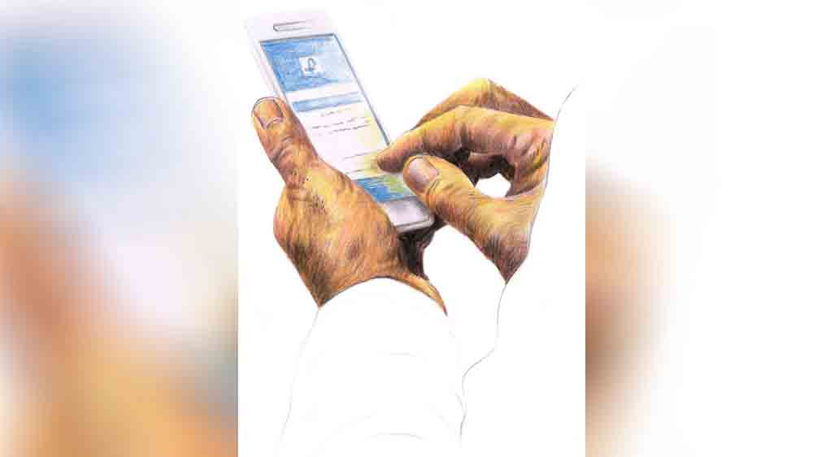

 

<h1 align=center>Short story: আন্তর্জালি যাত্রা</h1>
<h2 align=center>অমল আচার্য</h2>
থানার ঠিক পিছনে দোতলায় অফিসটি। কাচের দরজাটি ঠেলে উদ্‌ভ্রান্তের মতো ভিতরে ঢুকে পড়লাম। ভিতরে এক বৃদ্ধ ভদ্রলোক, সঙ্গে কমবয়সি একটি মেয়ে। ভুরু কুঁচকে কর্তব্যরত পুলিশ অফিসার আমাকে দেখে অপেক্ষা করতে বললেন। যথাসম্ভব মনকে সংযত করে এক পাশে বসে পড়লাম। সব শেষে আমার পালা। সবে বলা শুরু করেছি, তরুণ অফিসারটি রেজিস্টার খুলে এন্ট্রি করতে করতে স্বগতোক্তি করলেন, “এই বয়সে এ সব?” তার পর আপাদমস্তক দেখে খুব তাচ্ছিল্যের সঙ্গে জিজ্ঞেস করলেন, “করেন কী আপনি?”   আমার লজ্জায় মিশে যাওয়ার মতো অবস্থা। মিনমিন করে বললাম, “রিটায়ার্ড।”   “রিটায়ার্ড? কী করতেন?”   বললাম, “স্টেট সিভিল সার্ভিসে ছিলাম।”   উত্তর শুনে, তেলেবেগুনে জ্বলে উঠলেন উনি, “আপনাদের মতো লোকেরা যদি এ সবের চক্করে পড়েন, তা হলে সাধারণ লোকদের আর দোষ দেব কেমন করে? এই তো সে দিন রাষ্ট্রায়ত্ত সংস্থার এক বড় অফিসার চব্বিশ লাখ টাকা চোট খেয়েছেন। ফেসবুকে এক কমবয়সি রাশিয়ান সুন্দরীর ছবি দেখে বন্ধুত্ব। তার পর যা হয় বুঝে নিন। এক সঙ্গে ছুটি কাটাবার প্রোগ্রাম পর্যন্ত হয়ে গিয়েছিল।”   পাশ থেকে এক মেয়ে পুলিশ টিপ্পনী কাটল, “স্যর, আর ওই ডাক্তারবাবুর ব্যাপারটা?”   “ও হ্যাঁ! গত পরশু এই শহরের এক নামী ডাক্তারবাবু এসে হাতে পায়ে ধরে বলেছেন, ‘আমাকে বাঁচান।’ সেই মেয়ে-ঘটিত ব্যাপার। ওঁদের দাবি মতো টাকা না দিলে ডাক্তারবাবুর ব্যক্তিগত ছবিগুলো বাজারে ছেড়ে দেবে। আরে এই দেশে কি সুন্দরী মেয়ের অভাব যে, বিদেশি মেয়ের পিছনে দৌড়তে হবে?”   পিছন থেকে এক পুলিশ বেশ রসিয়ে মন্তব্য করল, “স্যর, এঁরা হয়তো ভাবেন, বিদেশে মনের শখ-আহ্লাদগুলো মেটালে এই দেশে কেউ টের পাবে না। এঁদের তো আবার মান-সম্মানের ভয়ও অনেক বেশি।”   মুখ ফসকে আমি বলেই ফেললাম, “ওঁর কত গেছে?”   পুলিশ অফিসারটি মাথা নিচু করে রিপোর্ট লিখতে লিখতেই বললেন, “আরে মশাই, ও কি আর সহজে বলে? তার পর চেপে ধরতেই ধীরে ধীরে সব বেরিয়ে এল। সব মিলিয়ে লাখ পঁয়তাল্লিশ গেছে। কিন্তু আপনার আমার তো মাসমাইনের টাকা। কী ভাবে এই চক্করে পড়লেন?”   বুঝলাম, প্রাথমিক অশ্রদ্ধার ভাবটা কেটে গিয়ে আমার উপর কিছুটা সদয় হয়েছেন। উনি এ বার মোবাইল খুলে সব দেখাতে বললেন। আমি মেসেঞ্জার খুলে দেখাতেই ভদ্রলোক পুলিশোচিত কাঠিন্যে খিঁচিয়ে উঠলেন, “ফেসবুক খুলে দেখাতে আপনার অসুবিধে কোথায়? এখন আর কী লুকোতে চাইছেন? ওই মেয়েটির ইউআরএল 
নম্বর দিন।”   সব শুনে বুঝতে পারলাম, আমাকে এখন দু’টি ব্যাঙ্ক অ্যাকাউন্টের ডিটেলস, মেয়েটির ফেসবুক অ্যাকাউন্টের স্ক্রিনশট, হোয়াটসঅ্যাপ মেসেজের স্ক্রিনশট, মেসেজের কপি— সব জমা দিতে হবে, না হলে কেস শুরু করা যাবে না। পুলিশ অফিসারটি বেশ দক্ষ বলেই মনে হল। বুঝিয়ে বললেন, “প্রতারিত হয়েছেন, সেটা বুঝতেই লোকের অনেকটা সময় লেগে যায়। তার পর থাকে সামাজিক মানসম্মান খোয়ানোর ভয়। সব মিলিয়ে আমাদের কাছে যখন কেস আসে, তত দিনে বেশ দেরি হয়ে যায়। আমরা বিশেষ কিছুই করে উঠতে পারি না।”   বাইরে এসে মনে পড়ল, এই তল্লাটে এখন লকডাউন চলছে। সব কিছুই বন্ধ। ব্যাঙ্ক স্টেটমেন্ট পাওয়া সম্ভব হবে না। গোদের উপর বিষফোড়া। কাগজপত্র আজ আর জমা দিতে পারলাম না। পুরোপুরি বিধ্বস্ত অবস্থায় বাড়ি ফিরলাম।   আমার চেহারা দেখেই চমকে উঠেছে ঘরনি। নাছোড়বান্দা সে। বলতেই হবে কী হয়েছে? গত এক মাস ধরে আমি নাকি ভীষণ অস্বাভাবিক ব্যবহার করছি। খেতে বসে থালায় আঁকিবুকি কাটছি, খেতে পারছি না। মাঝরাতে ঘুম ভেঙে উঠে দিশেহারার মতো এ দিক-ও দিক তাকাচ্ছি। ফোন এলেই দৌড়ে ছাদে চলে যাচ্ছি ইত্যাদি।   সত্যি একা একা আর সহ্যও করতে পারছিলাম না এই চাপ। পুরুষসুলভ অহমিকা সরিয়ে রেখে এ বার নমনীয় হওয়ার চেষ্টা করলাম। কিন্তু নিজের এত বড় বোকামোর কথা কী করে নিজমুখে বলি? তার উপর বিষয়টি যখন মেয়েঘটিত।   স্ত্রীকে বোঝানোর প্রকৃষ্টতম সময় হল রাতে ঘুমোনোর আগে। শুরু হল আমাদের আরব্যরজনীর গল্প।      *****   “মেয়েটি আমেরিকান। নাম রেইন গ্যাব্রিয়েল। তাঁর এক কাকা পারিবারিক সম্পত্তির লোভে তাঁর মা-বাবাকে খুন করে। সে তখন খুবই ছোট। রেইন এর পর থেকে অনাথ আশ্রমে প্রতিপালিত হয়। বড় হয়ে নিজের চেষ্টায় আমেরিকান এয়ার ফোর্সে চাকরি পায়। বর্তমানে পোস্টিং সিরিয়ায়। সেখানে প্রতিনিয়ত আইসিস জঙ্গিদের বিরুদ্ধে লড়াই। ডিউটিতে যাওয়া মানে প্রতিদিনই মৃত্যুর মুখোমুখি হওয়া। তার পরিকল্পনা, ওখান থেকে প্রাণ নিয়ে ফিরতে পারলে জমানো টাকায় আমেরিকার নেভাডায় একটি ব্যবসা খুলবে। হঠাৎ এক দিন জঙ্গিদের মিসাইলের আঘাতে ওদের ঘাঁটি ধ্বংস হয়ে যায়। রেইন বেঁচে যায় বটে, কিন্তু ওর সার্ভিস-সংক্রান্ত প্রচুর কাগজপত্র নষ্ট হয়ে যায়। আমেরিকান সোলজারদের ছিন্নবিচ্ছিন্ন মৃতদেহের ছবিও এর সঙ্গে পোস্ট করেছে সে। পরদিন থেকে ডিউটিতে যাওয়ার আগে রেইন আমাকে ওর জন্য প্রার্থনা করতে বলত। তত দিনে আমি ওঁর ড্যাড। আমার মেয়েদের দেখার খুব ইচ্ছে ওর। বলে, ওর চাকরির চুক্তির মেয়াদ আর কয়েক মাস। তার পরই ও প্রথমে এ দেশে এসে আমাদের সঙ্গে দেখা করবে। কারণ পৃথিবীতে ওর আপন বলতে আর কেউ নেই।   “এর পর রেইন দ্বিতীয় বার আইসিস আক্রমণের মুখে পড়ে। ও কাতর ভাবে জানায়, ওর ব্যক্তিগত কাগজপত্র সব বাঁচানোর জন্য আমার কাছে সাময়িক ভাবে রাখবে। আমি দ্বিধাগ্রস্ত। এত অল্প পরিচয়ে ওকে কী করে বিশ্বাস করব?”   সঙ্গে সঙ্গে বৌ পাশ থেকে বলে ওঠে, “সেই জন্যই তুমি বলছিলে, বিদেশ থেকে একটা পার্সেল 
আসবে। সেটা রাখার জন্য জায়গাও পরিষ্কার করছিলে।”   বললাম, “ঠিক। কিন্তু আমি প্রথমে নিজের ঠিকানা দিইনি। এক সপ্তাহ নিজের সঙ্গে লড়াই করেছি। তার পর সে যখন বলল, ‘ড্যাড, তোমার নিজের মেয়ে যদি এই অবস্থায় পড়ত, তুমি কী করতে?’ শেষে ভাবলাম, সামান্য একটা পার্সেলের তো ব্যাপার! তিন মাসের জন্যে কাস্টোডিয়ান হলে যদি কারও উপকার হয়, তা হলে আমি কেন আপত্তি করছি? তা ছাড়া বিশ্ব জুড়ে উগ্রপন্থার বিরুদ্ধে এক জন দায়িত্বশীল নাগরিক হিসেবে আমারও একটু অবদান থাকুক না! অবশেষে রেইনকে বললাম, পার্সেলটিতে যেন ওদের কর্তৃপক্ষের সার্টিফিকেট থাকে। যে দিন আমি আমার ঠিকানাটা জানালাম, তার পরদিনই সে তার পার্সেলের ভিডিয়ো, কর্তৃপক্ষের সার্টিফিকেট ইত্যাদি আমার হোয়াটসঅ্যাপে পাঠিয়ে দিল। সঙ্গে জানাল, দুই দেশের ডাকমাশুলের তারতম্য হেতু সামান্য কিছু টাকা হয়তো আমাকে দিতে হতে পারে। পিতৃসুলভ ঔদার্যে আমি তা-ও মেনে নিলাম। পরদিনই এক অচেনা নম্বর থেকে এক ভদ্রমহিলা হিন্দিতে জানালেন, সিরিয়া থেকে আমার নামে একটি পার্সেল এসেছে। পার্সেলটি ছাড়াতে চৌত্রিশ হাজার টাকা লাগবে। এত টাকা লাগবে ডাকমাশুল বাবদ? আমি রেইনকে জানালাম, এত টাকা আমার পক্ষে দেওয়া সম্ভব নয়। 
রেইন খুব কাকুতি-মিনতি করে বলল, এই পার্সেলেই ওর যথাসর্বস্ব আছে। এটি খোয়া গেলে ওর সর্বনাশ 
হয়ে যাবে। তা ছাড়া সময়মতো ডেলিভারি না নিলে প্রতিদিনের 
জন্য আলাদা চার্জ দিতে হবে। এ বাবদ যা খরচ হবে, সব আমাকে ও দিয়ে দেবে।   “আমি সে দিন বিকেলেই আমার অ্যাকাউন্ট থেকে দিল্লি অফিসের নির্দেশ মতো টাকাটি পাঠিয়ে দিলাম। আমাকে জানানো হল, খুব শীঘ্রই কাস্টমস ক্লিয়ারেন্স হয়ে আমার কাছে পার্সেল পৌঁছে যাবে। ঠিক মতো দায়িত্বটি পালন করতে পেরে বহু দিন পর শান্তিতে ঘুমোতে গেলাম। পরের দিন সকালে দিল্লি অফিস থেকে আবার ফোন। জানাল, পার্সেলটির ক্লিয়ারেন্সে খুব সমস্যা দেখা দিয়েছে। প্যাকেটের ভেতরে প্রচুর আমেরিকান ডলার আছে।   “মনে পড়ল, রেইন বলেছিল কিছু আমেরিকান ডলারও প্যাকেটের মধ্যে রেখেছে সে। ভদ্রমহিলা ফোনে জানালেন, বিভিন্ন দফতরের অফিসাররা পার্সেলটি পরীক্ষা করছেন। ফেরা আইন অনুযায়ী এই অবৈধ বিদেশি মুদ্রার জন্য আমাকে পেনাল্টি দিতে হবে। আমার চোখে অন্ধকার নেমে এল। বুঝলাম, অন্যের উপকার করতে গিয়ে আমার নির্ঝঞ্ঝাট জীবনে বিচ্ছিরি বিপদ ডেকে এনেছি। আমি ফাঁদে পড়া পাখির মতো ছটফট করতে করতে বললাম, এ পার্সেল আমি নেব না। ফোনের অপর প্রান্ত থেকে অত্যন্ত রূঢ় ভাবে তিনি জানালেন, তাঁরা সন্দেহ করছেন, সিরিয়ার উগ্রপন্থীদের সঙ্গে আমার যোগাযোগ আছে। পার্সেলের এই বিপুল অর্থ হয়তো নাশকতামূলক কাজে ব্যবহার করা হবে। এখন পার্সেল না নিলেও ইনভেস্টিগেশনের স্বার্থে কাস্টমস, আয়কর দফতর এবং ই ডি আমাকে জিজ্ঞাসাবাদ করবে। আমি যেন টিম না আসা পর্যন্ত বাড়িতেই থাকি।   “আমি হিন্দি ইংরেজি মিলিয়ে দিল্লির অফিসকে বোঝানোর চেষ্টা করলাম, আমি শুধু এই পার্সেলের কাস্টোডিয়ান হতে রাজি হয়েছি। কোনও ক্রমেই এটি খোলা হবে না। রেইনের সার্ভিস আইডেন্টিটি, পার্সেলের সার্টিফিকেট ইত্যাদি দিয়ে বললাম, এটি আমেরিকান এয়ার ফোর্স থেকে এসেছে। এর সঙ্গে সিরিয়ার উগ্রপন্থীদের কোনও যোগাযোগ নেই। রেইনকে বললাম, দিল্লির কাস্টমস অফিসের সঙ্গে যেন অবিলম্বে যোগাযোগ করে বিষয়টি সবিস্তারে জানায়। রেইন তার স্বর্গত মা-বাবার নামে শপথ করে জানাল, কোনও ভাবেই আমার কোনও ক্ষতি সে করতে দেবে না। ঊর্ধ্বতন কর্তৃপক্ষের সঙ্গে যোগাযোগ করে অবিলম্বে সমস্যা সমাধানের চেষ্টা করছে সে।   “এ দিকে আমি রাস্তার দিকে তাকিয়ে রয়েছি। যে কোনও মুহূর্তে স্থানীয় পুলিশের সহায়তা নিয়ে  হয়তো ইনভেস্টিগেশন টিম আমার বাড়ির ঠিকানায় পৌঁছে সবার সামনে থেকে আমাকে তুলে নিয়ে যাবে। মনে হতে লাগল, মস্তিষ্ক আর বেশি ক্ষণ এই চাপ নিতে পারবে না। যে কোনও মুহূর্তে আমি অজ্ঞান হয়ে যাব। আমি আত্মহত্যা করলেও আমার পরিবার কি বাঁচবে?   “ঠিক তখনই রেইনের মেসেজ এল। তাঁর অফিস দিল্লি অফিসকে কনফার্ম করেছে, আমি  উগ্রপন্থীদের সঙ্গে যুক্ত নই। এ বার আমি নিজেই দিল্লির কাস্টমস অফিসের সঙ্গে যোগাযোগ করলাম। ওরা জানাল, হ্যাঁ, আমার সঙ্গে যে আইসিস-এর যোগাযোগ নেই, এ ব্যাপারে নিশ্চিত হওয়া গেছে। আমার বুক থেকে যেন পাষাণভার নেমে গেল। কিন্তু 
সঙ্গে সঙ্গেই আবার জানাল, ফেরা আইন মোতাবেক অবৈধ বিদেশি মুদ্রা রাখার  জন্য আমাকে মোট আড়াই লক্ষ টাকা পেনাল্টি দিতে হবে। সেটা অফিসের পাঠানো অ্যাকাউন্ট নম্বরে আগামী চব্বিশ ঘণ্টার মধ্যে জমা দিতে হবে।   “আমি রেইনকে জানালাম, এত টাকা দেওয়ার সঙ্গতি আমার নেই। ও যেন সেই টাকা পাঠানোর ব্যবস্থা করে। জবাবে রেইন জানাল, ওর পার্সেলে তিন লক্ষ মার্কিন ডলার আছে, আমি যেন পার্সেল খুলে সেই টাকাটা নিয়ে নিই। পার্সেল খোলার কোড নম্বরও আমায় পাঠিয়ে দিল। কিন্তু পার্সেল তো আগে ডেলিভারি নিতে হবে। সেই টাকা আমি কোথা থেকে পাব? আমার অপারগতার কথা তাঁকে জানাতেই সে কাকুতি-মিনতি করে বলল, কোনও ভাবে আমি যেন বন্ধুদের কাছ থেকে ধার নিয়ে পার্সেলটি ছাড়িয়ে নিই।   “এ দিকে দিল্লি অফিস থেকে লাগাতার ফোন। চব্বিশ ঘণ্টা সময়সীমার মধ্যে টাকা না পেলে আমার বাড়িতে টিম পৌঁছে যাবে। বাধ্য হয়ে বাজার থেকে অত্যন্ত চড়া সুদে টাকা ধার নিয়ে আরটিজিএস করে পাঠিয়ে হাঁপ ছেড়ে বাঁচলাম।”   আমার দূর সম্পর্কের এক আত্মীয় পুলিশে চাকরি করেন। নিশ্চয়ই স্ত্রী তাঁকে কিছু বলেছে। এক বিকেলে তিনি বাড়ি এসে হাজির। তাঁর প্রথম প্রশ্ন, মেয়েটির সঙ্গে বন্ধুত্ব হল কী করে? জানালাম, রিটায়ার করার পর নিঃসঙ্গতা থেকে বাঁচার জন্য ফেসবুক শুরু। বন্ধুর সংখ্যা বাড়ানোর জন্য প্রায় সবার রিকোয়েস্টেই সাড়া দিয়েছি। তা ছাড়া এই মেয়েটি আমার চার জন মিউচুয়াল ফ্রেন্ডেরও বন্ধু। তাই সন্দেহ হয়নি। এ ছাড়া পার্সেলের ভিডিয়ো, আমেরিকান এয়ারফোর্সের সার্টিফিকেট, মেয়েটির সার্ভিস আইডেনটিটি কার্ড, মেল অ্যাড্রেস—  সব দেখেই আমার  বিশ্বাস জন্মেছে। পুলিশ-আত্মীয়টি মৃদু হেসে বললেন, ইন্টারনেটে সব কিছুই পাওয়া যায়। এমনকি দিল্লির যে নম্বরটিতে যোগাযোগ করতাম, সেটিও ভুয়ো।   আমি আপত্তি জানিয়ে বললাম, “নাম্বারটিতে ফোন করলে কিন্তু এখনও এক ভদ্রমহিলা ধরেন।”   তিনি হেসে বললেন, “এটা তো দিল্লি পুলিশের এখতিয়ারভুক্ত এলাকা। পুলিশি তদন্ত তো চলছে। দেখুন কত দূর কী হয়!”   পরে তিনি রেইন মেলিসা তথা রেইন গ্যাব্রিয়েল-এর নম্বরে অনুসন্ধান করে জানিয়েছেন, সেটিও ভুয়ো। খুব সম্ভবত হিমাচল প্রদেশের কোনও ফ্রড গ্যাং এ সবের পেছনে।   ভদ্রলোকের কথা সত্যি করে আজ অবধি আমার নামে কোনও পার্সেল আসেনি। আমার আত্মীয় পুলিশ অফিসারটির কথাই ঠিক হল, আমি সাইবার ক্রাইমের শিকার। থানায় বার বার যাই। জিজ্ঞেস করি, কেসটির অগ্রগতি কত দূর।   তাঁরা জানতে চান, কোন কেস। আমি মুখস্থ বলি, কেসের নম্বর, তারিখ। তাঁরা বলেন, দেখছেন।   কোনও এক দিন হয়তো নিশ্চয়ই ব্যবস্থা নেওয়া হবে। তত দিন পর্যন্ত অপেক্ষা করা ছাড়া আমার আর করণীয়ই বা কী!   দু’লক্ষ চুরাশি হাজার টাকা শুধু যায়নি, মানুষের প্রতি বিশ্বাস জিনিসটাও মন থেকে বেমালুম উবে গিয়েছে। রাস্তার ভিখিরি দেখলেও আজকাল ঘেন্নায় মুখ ফিরিয়ে নিই।         