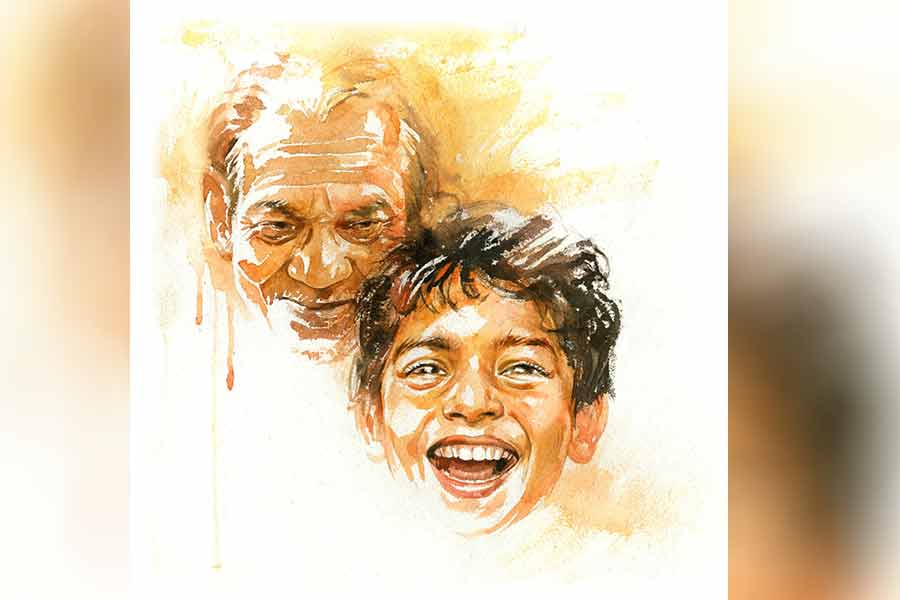

 
 <h1 align=center>আপনজন</h1>
<h2 align=center>মানসেন্দু সমাজপতি</h2> 

আপনাকে তো রোজই দেখছি স্যর। আপনার কেউ ভর্তি আছে নাকি এখানে? আপনজন?”

এই আপনজন ব্যাপারটা বেশ গোলমেলে। জীবনের যাত্রাপথে আমরা সবাই দৌড়চ্ছি— কেউ এক কদম আগে, কেউ দু’কদম পিছনে। দৌড়তে দৌড়তেই কত সম্পর্ক গড়ে, ভাঙে। সেই সব সম্পর্কের কোনওটা জন্মগত— বাবা, মা, ভাই, বোন। কোনওটা আবার দৌড়পথের অর্জন— স্বামী, স্ত্রী, সন্তান, বন্ধু। কিন্তু সবাই কি আর আপনজন? জীবনপথের সাহারা-তুন্দ্রায় ঝড়ে-ঝঞ্ঝায় রৌদ্রে-শিশিরে যারা সর্বদাই পাশে থাকবে— প্রতিদানের আশায় নয়, ভালবাসার আশ্বাসে— তেমন আপনজন আজ কোথায়?

রাস্তায় দাঁড়িয়ে ভাঁড়ে চা খাচ্ছিলাম। মুখ ফিরিয়ে দেখলাম, পিছনে দাঁড়িয়ে এক জন রোগাভোগা লোক, বয়স আন্দাজ পঁয়ত্রিশ-ছত্রিশ, ইস্ত্রি-না-করা ঘামের দাগ লাগা হাফ শার্ট, ঢলঢলে প্যান্ট, পায়ে সস্তার চপ্পল, চোখের কোলে নিম্নবিত্ত যাপনের কালি। প্রশ্নটা করে একটা ম্লান হাসি নিয়ে তাকিয়ে আছে আমার মুখের দিকে।

পিছনে রোদের আলোয় ঝকঝক করছে সাজানো ক্যাম্পাসের ভিতর কলকাতার নামী ক্যানসার হাসপাতাল। বাইরের চাকচিক্য আড়াল করতে পারেনি ভিতরের নিয়ন আলোর নীচে আনাচে-কানাচে ছড়িয়ে থাকা মৃত্যুভয়ের অন্ধকার। হাসপাতালের প্রশস্ত চৌহদ্দি ছাড়িয়ে মারণ রোগের উদ্বিগ্ন ছায়া ছড়িয়ে আছে রোগীদের অপেক্ষারত আত্মীয়স্বজনের চোখেমুখেও।

পিছনে ঘুরে বললাম, “হ্যাঁ, আমার এক ঘনিষ্ঠ বন্ধু ভর্তি আছে এখানে। আপনার?”

“আমাকে আপনি বলবেন না স্যর। আমি আপনার থেকে অনেক ছোট। আমার নাম নিতাই মাইতি। বাড়ি কাঁথি। একটা ছোট ইলেকট্রিকের দোকান আছে। ছোটখাটো যন্ত্রপাতি সারাই। নুন আনতে পান্তা ফুরোয়, তার মধ্যে আবার এই ঝামেলা!”

“হ্যাঁ, এই সব রোগ মানেই তো যার হয় তার কষ্ট, বাড়ির লোকজনের ছোটাছুটি, উদ্বেগ, জলের মতো খরচ। তা কী আর করবে বলো? তোমার কে ভর্তি আছে এখানে?”

“আমার ছেলে। সাত বছর বয়স। প্যানক্রিয়াসে ক্যানসার... কপাল!”

“সে কী! ওইটুকু ছেলের এই রোগ! অসুখবিসুখের আর কোনও বাছবিচার রইল না দেখছি!”

“যা বলেছেন স্যর... কী যে হবে, ভেবে কোনও কূলকিনারা পাচ্ছি না!”

কূলকিনারা যে এখানে সবার সামনেই মেঘাবৃত, সেই তিক্ত সত্যিটা এই লোকটারও জানা থাকার কথা। হাসপাতালের লবি জুড়ে অসংখ্য উদ্বিগ্ন উদ্‌ভ্রান্ত মুখ। কে কাকে কূলকিনারা দেখাবে? কে কাকে দেবে আলোকস্তম্ভের ঠিকানা?

অসুস্থ সন্তানের জন্যে চিন্তা-ভাবনায় পাগল বাবাকে আশার কথা শোনাতে যাওয়া বাতুলতা। তাও যান্ত্রিক ভাবে বললাম, “এটা তো এই অসুখের জন্যে নামকরা হাসপাতাল, নামীদামি ডাক্তাররা দেখছেন, তোমার ছেলের তো বয়সটাও কম, দেখো, নিশ্চয়ই ভাল হয়ে যাবে।”

নিতাই হাসল। নিষ্প্রাণ হাসি। তাতে ভরসার আলো বিশেষ নেই।

অপেক্ষার দুপুর গড়িয়ে যাচ্ছে বিকেলের কোলে। ভিজ়িটিং আওয়ার্স শুরু হয়ে যাবে আর একটু পরেই। এত ক্ষণ ধৈর্য ধরে অপেক্ষা করে থাকা মুখগুলো দ্রুত পায়ে এগোচ্ছে লিফটের দিকে। লিফটের সামনে ভিড় দেখে অনেকেই আবার এগোচ্ছে সিঁড়ির দিকে, দ্রুত হেঁটে উঠে যাবে বলে। রোগক্লিষ্ট প্রিয়জনদের যতটা সময় দেওয়া যায়, যতটা কাছে থাকা যায়... কে জানে, আগামী কাল কী বার্তা নিয়ে আসে!

রেসিডেন্ট পেশেন্টদের ওয়ার্ডটা একটা লম্বা হলঘর। সার দিয়ে বেড পাতা। দরজা থেকে দুটো বেড ছেড়ে এক জন বয়স্ক মানুষের বেড। ভদ্রলোকের বয়স আন্দাজ ষাট-পঁয়ষট্টি। রেডিয়েশন-কেমোর দৌলতে মনে হচ্ছে সত্তর-পঁচাত্তর। ভদ্রলোকের নাম শুনলাম ইন্দুশেখর হাজরা। তার পরের বেডটাতেই নিতাইয়ের ছেলে কানাই। আর তার পাশের বেডেই আমার বন্ধু সুদীপ।

ভিজ়িটিং আওয়ার্সে ঘণ্টাখানেক সাক্ষাৎ। আমি সুদীপের বেডের পাশে বসে। নিতাই ছেলের পাশে। ইন্দুবাবুর পাশে কেউ নেই।

সুদীপের ঘাড়ের কাছে একটা গ্ল্যান্ড হয়েছিল। প্রাইমারি স্টেজ। অপারেশনের পর এখন ভাল আছে। ডাক্তার বলেছেন, আর কয়েক দিন দেখে ছেড়ে দেবেন। ওর অস্তিত্বকে ঘিরে মৃত্যুর চোখরাঙানিটা আর নেই। আমার দিকে গলা বাড়িয়ে চাপা স্বরে বলল, “জানিস তো, ওই ইন্দুবাবু লোকটার কেউ নেই মনে হয়, কাউকেই ওঁর কাছে আসতে দেখিনি। ভদ্রলোকের লাং ক্যানসার। অ্যাডভান্সড স্টেজ। বোধহয় আর কোনও চান্স নেই। তাই অষ্টপ্রহর খেপচুরিয়াস! সেই জন্যেই বোধহয় ওঁর ধারেকাছে কেউ ঘেঁষে না। সিস্টাররা সব খ্যাঁচানির ভয়ে তটস্থ।”

আমি আশ্চর্য হয়ে বললাম, “ভদ্রলোক এই অবস্থায় সারা দিন একা মুখ বুজে বিছানায় পড়ে থাকেন? ওতে তো রোগযন্ত্রণা আরও অসহ্য হয়ে উঠবে!”

“মুখ না খোলাই ভাল। মুখ খুললেই তো চেঁচামেচি গালাগালি। সিস্টাররাও যতটা সম্ভব এড়িয়েই চলে ওঁকে। তবে হ্যাঁ… ওই নিতাইয়ের ছেলেটাকে অবশ্য খুব ভালবাসেন ভদ্রলোক। ওর সঙ্গে অনেক ক্ষণ গল্প করেন! একমাত্র তখনই ওঁকে হাসতে দেখেছি… অদ্ভুত মানুষ, সত্যি!”

ইন্দুবাবুর মেজাজের প্রমাণ সে দিনই পেলাম হাতেনাতে। ভিজ়িটিং আওয়ার্সের শেষে নিতাই ইন্দুবাবুর বেডের পাশ দিয়ে যাওয়ার সময় ভদ্রতা করে বলেছে, “কেমন আছেন, স্যর?” তাতে ইন্দুবাবু বিচ্ছিরি মুখ করে খেঁকিয়ে উঠলেন, “দেখে কী মনে হচ্ছে? এ সব বোকা-বোকা ফালতু প্রশ্ন করো কেন? যত্ত সব আদিখ্যেতা! আমার সঙ্গে খেজুর না করে নিজের ছেলেটাকে দেখো। বাচ্চাটার একটা পা তো চিতায় তুলে দিয়েছ… ইরেসপন্সিবল মুখ্যু যত সব! কোথা থেকে যে আসে সব গাঁইয়া...”

বেরিয়ে এসে নিতাই খেপে লাল, “দেখুন দিকি কারবার! খিটকেল বুড়ো ভাম একটা! সবার সঙ্গেই এই রকম খারাপ ব্যবহার, জানেন তো! আচ্ছা… ছেলেটার অসুখের জন্যে কি আমি দায়ী? খামোখা কতগুলো খারাপ কথা শুনিয়ে দিল! এই সব জঞ্জালগুলো ফটাফট ফুটে গেলেই তো পারে!”

কথাটা শুনতে ভাল লাগল না। ভদ্রলোকের ঘাড়ের উপর মৃত্যুর হিমেল শ্বাস। ওঁর কথাবার্তায় বেচাল হতেই পারে, তাই বলে আমরাও কি বেচাল হয়ে যাব?

পরের দিন সুদীপের সঙ্গে কিছু ক্ষণ কথা হওয়ার পর বললাম, “দেখ, ওই ইন্দুবাবু লোকটার খিটখিটে মুখোশটার আড়ালে আমার মনে হয় কিছু গল্প লুকোনো আছে… এক বার বাজিয়ে দেখে আসি, কী বলিস?”

সুদীপ হেসে বলল, “তোর গল্পের প্লট খুঁজছিস? বেশ, যা তবে সাবধানে… শোয়েবের বাউন্সার… মাথা বাঁচিয়ে!”

ভদ্রলোক কপালের উপর ডান হাতটা উপুড় করে রেখে চোখ বুজে শুয়েছিলেন। আমি পাশে দাঁড়িয়ে গলাখাঁকারি দিতে চোখ খুলে চাইলেন। আলো নিবে আসা চোখের নীচে গাঢ় কাজলের মতো অবসাদ আর ক্লান্তি।

হাত জোড় করে বললাম, “নমস্কার। আপনার সঙ্গে একটু আলাপ করতে এলাম।”

প্রত্যাশা মতোই কোনও রেসপন্স এল না। আমিও নাছোড়বান্দা। পাশের টুলটা টেনে নিয়ে বসে পড়ে বললাম, “বসছি, কেমন? বসে কথা না বললে কথাগুলো সব আবার হাওয়ায় উড়ে যায়, জানেন তো!”

“সাংবাদিক? নাকি গোয়েন্দা দফতর?” ভদ্রলোকের মুখ কঠিন।

“না না! আমি একটা কলেজে পড়াই, সঙ্গে একটু-আধটু লেখালিখির শখ আছে। এই আর কী।”

“ও, ও আচ্ছা! গল্পের প্লট চাই?” ভদ্রলোকের গলার স্বর এ বার অনেকটা নরম।

“ঠিক তা নয়, কারও ব্যক্তিগত পরিসরে নাক গলানোর ইচ্ছে আমার নেই। তবে হ্যাঁ, জীবনকে জানতে চাই, জীবন থেকেই তো গল্প উঠে আসে।”

ভদ্রলোক ইশারায় সুদীপকে দেখিয়ে জিজ্ঞেস করলেন, “কে?”

বললাম, “বন্ধু।”

“বন্ধুর জন্যে এত ছোটাছুটি? বন্ধুও আপনজন হতে পারে! ভাল!”

“আপনার আপনজনরা কেউ...?”

“আপনজন? তা সত্যিকারের আপনজনটা যে কে, সেটা বুঝতে বুঝতেই এই ছোট্ট জীবনটা শেষ। লালন যেমন সারাটা জীবন খুঁজে বেড়ালেন তাঁর মনের মানুষটিকে।”

ভদ্রলোকের পড়াশোনা আছে মনে হচ্ছে। বললাম, “লালনের মনের মানুষটি কিন্তু জৈবিক নয়, আত্মিক।”

“জৈবিকরা তো আরও সরেস। নিজেদের আখেরটুকু ছাড়া কিস্যু বোঝে না। যত দিন একটা জুট মিলের জেনারেল ম্যানেজার ছিলাম, আপনজনের অভাব ছিল না। যেই সে জুট মিল সিক হতে আরম্ভ করল, আপনজনেরা ফুটবল ম্যাচ-ভাঙা দর্শকের মতো হাওয়া হয়ে যেতে লাগল। তার পর মিলটা যখন একেবারে বন্ধ হয়ে গেল, ক্রমশ বাজার-খরচায় টান পড়া শুরু হল, তত দিনে গ্যালারি ফাঁকা। এ দিকে জুট মিলের জুটের রোঁয়া আর সিগারেটের ধোঁয়া বুকের ভিতর বিদায়ঘণ্টা বাজিয়ে দিয়েছে। শকটা সামলাতে না পেরে গিন্নি ম্যাসিভ হার্ট অ্যাটাকে পালিয়ে বাঁচলেন। একমাত্র মেয়ে বিদেশে সেটলড, কাজের চাপে তার আর আসার সময় নেই। তবে তার প্রতি আমি কৃতজ্ঞ, আমার মেডিকেল ইনশিয়োরেন্সটা চালু রাখার জন্যে। না হলে এই হাতির খরচ সামলানো আমার ক্ষমতার বাইরে। কাজেই এই মুহূর্তে ও-ই আমার একমাত্র আপনজন। তবে এই খরচাটা বোধহয় আর ওকে বেশি দিন গুনতে হবে না”

অনেক ক্ষণ একটানা কথা বলে হাঁপাচ্ছিলেন ভদ্রলোক। খানিক ক্ষণ দম নিয়ে এ বার স্বগতোক্তি করলেন, “আসলে, জীবনের এই রঙ্গমঞ্চে যাদের আমরা আপনজন বলে ভাবি, তারা সবাই বোধহয় এই জীবননাট্যের কুশীলব মাত্র। এত মুখোশের ভিড়ে আপনজনের মুখ খুঁজে পাওয়া কি আর সহজ কাজ! লালনের মতোই সারা জীবন খুঁজে ফিরি, কোথায় পাব তারে, হয়তো উইংসের ও পারে অনন্ত অন্ধকারেই অপেক্ষায় থাকে সে… কী জানি!”

হাতটা আবার কপালের উপর তুলে চোখ বন্ধ করলেন ইন্দুবাবু। আমি আর কথা না বাড়িয়ে উঠে এলাম সুদীপের কাছে।

তার পর থেকে ইন্দুবাবু যেন দিন-দিন আরও বিছানার সঙ্গে মিশে যেতে থাকলেন। জীবন-মৃত্যুর পাঞ্জা লড়াইতে কি হেরে যাচ্ছে জীবন?

নিতাইয়ের মনস্কামনা যে এত তাড়াতাড়ি ফলে যাবে, সে নিজেও বোধহয় ভাবেনি।

মাঝখানে কয়েক দিন হাসপাতালে যাওয়া হয়নি। দিন তিনেক পর ভিজ়িটিং আওয়ার্সে ওয়ার্ডে ঢুকেছি, প্রথমেই চোখ পড়ল ইন্দুবাবুর বেডের উপর। বেডটায় অন্য এক জন পেশেন্ট। শুনলাম, দু’দিন আগে সন্ধে থেকেই নাকি ইন্দুবাবুর হঠাৎ তীব্র শ্বাসকষ্ট শুরু হয়। ডাক্তার-নার্সদের ঐকান্তিক প্রচেষ্টা ব্যর্থ করে অবস্থা ক্রমাগত আরও খারাপ হতে থাকে। জীবন-মৃত্যুর সেই কুরুক্ষেত্রের সংগ্রাম কেমো রেডিয়েশন-দীর্ণ শরীর আর নিতে পারেনি। শেষ রাতে যুদ্ধসমাপ্তি ঘোষণা করে, সব জ্বালাযন্ত্রণা মিটিয়ে দিয়ে চলে গেছেন ভদ্রলোক। ম্যাসিভ হার্ট অ্যাটাক। সিস্টাররা নিশ্চয়ই হাঁপ ছেড়ে বেঁচেছে।

নিতাই পরম বিতৃষ্ণায় চোখমুখ কুঁচকে বলল, “এক দিক দিয়ে ভালই হয়েছে, এ সব খ্যাঁচখেঁচে পাবলিক বেঁচে থেকে সব্বার জীবন হালুয়া করে দেয়! চাঁড়াল লোক একটা!”

চলে যাওয়া লোকটা সম্বন্ধে এমন মন্তব্য ভাল লাগল না। বুঝলাম, সে দিনের অপমানটা ও এখনও ভুলতে পারেনি। তা ছাড়া ছেলেকে নিয়ে দুশ্চিন্তায় হয়তো নিতাইয়েরও মাথার ঠিক নেই।

কিন্তু নাটক তখনও বাকি ছিল!

দু’দিন পর হাসপাতালে ঢুকছি। নিতাই দেখতে পেয়েই ছুটে এল, উত্তেজনায় হাঁপাচ্ছে। হাত ধরে হিড়হিড় করে লবির একটা সাইডে টেনে নিয়ে গেল। ওর চোখ বড়-বড়, ছলছল করছে। মুখটা হাঁ হয়ে ঝুলে আছে, যেন নিজের চোখ-কানকে বিশ্বাস করতে পারছে না। উত্তেজিত গলায় ফিসফিস করে বলল, “জানেন স্যর, হাসপাতালের অফিস থেকে ডেকে পাঠিয়েছিল, ইন্দুবাবু নাকি মারা যাবার আগে ওঁর প্যানক্রিয়াস দান করে গিয়েছেন আমার ছেলের জন্যে! পরশুই অপারেশন। আমার ছেলেটা বোধহয় বেঁচে গেল এ যাত্রা।” নিতাই রুমাল তুলল চোখে, “গালে চড় মেরে চলে গেল লোকটা, বাইরেটা দেখে কত খারাপ কথা ভেবেছি, বলে ফেলেছি, সে-ই আমার ছেলেটাকে বাঁচিয়ে দিয়ে গেল নিজের শরীর দিয়ে! একটা ধন্যবাদ দেওয়ার সুযোগটুকুও দিল না!”

একটু থেমে দম নিয়ে নিতাই যেন স্বগতোক্তি করল, “আপনজন তো আর রক্তের সম্পর্কে হয় না... জীবন দিয়ে যে জীবন ফিরিয়ে দেয় সে-ই তো আসল আপনজন...” বলতে বলতে নিতাইয়ের চোখমুখ লাল হয়ে উঠল। চোখের কোলে টলটলে জল। মনে হল, একটা মানুষকে ঠিক সময়ে চিনতে না পারার গ্লানি বুঝি ঝরে পড়বে শিশির হয়ে।

