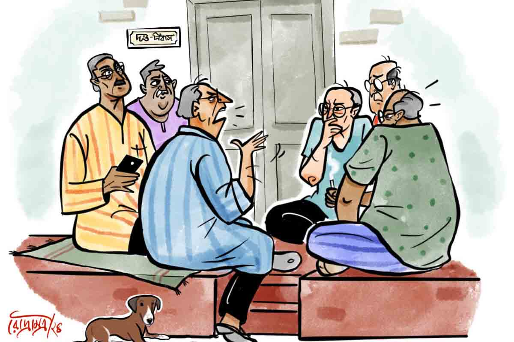

 
 <h1 align=center>আম-ছেঁচকি ও ঝড়ের গল্প</h1>
<h2 align=center>উপল পাত্র</h2> 

উত্তর কলকাতার নয়নচাঁদ দত্ত লেনে একটিই বাড়ি ‘দত্ত নিবাস’, যার বাইরে বারো বাই চার ফুটের টানা রোয়াক লাল সিমেন্ট দিয়ে বাঁধানো। বিকেল থেকে রাত ন’টা সাড়ে ন’টা পর্যন্ত সেখানে আড্ডা চলে।

বাড়ির মালিক সুধাংশু দত্ত ঘোর আড্ডাবাজ লোক। চল্লিশ বছর বেসরকারি অফিসে কলম পিষে অবসর নিয়েছে। একাত্তরেও সুধাংশু বেশ সুস্থ আর প্রাণচঞ্চল। বন্ধু-বান্ধব নিয়ে মেতে থাকে সারাক্ষণ।

বিকেল পাঁচটায় রাসবিহারী রোয়াক ঝাঁট দিয়ে শতরঞ্চি পেতে দেয়। প্রথমে আসে কেদারনাথ, নিখিল, সুরেশ্বর। এরা মোটামুটি সুধাংশুর সমবয়সি। প্রবীর আর সুদীপ্ত চাকরিজীবী, আসে সাতটার পর। চা আসে দু’দফায়— সন্ধে ছ’টা আর রাত আটটায়।

সে দিন রোববার, আড্ডাধারীরা সবাই উপস্থিত। কথাবার্তা চলছে আসন্ন ঘূর্ণিঝড় নিয়ে।

কেদারনাথ বলল, “শুনছি এ বার যে ঘূর্ণিঝড় আসছে, ‘যশ’ না কী, সেটা গতবারের আমফানের চেয়েও বেশি মারাত্মক?”

স্মার্টফোনে চোখ রেখে প্রবীর বলল, “যশ নয় ‘ইয়াস’। শুনেছ ঠিকই। ইয়াস যদি সাগর, সুন্দরবন হয়ে বাংলাদেশ— এই রুটে যায়, তবে এ বারও কপাল পুড়বে কলকাতার।”

“রুট?” হো হো করে হেসে উঠল সুদীপ্ত, “বললি বটে প্রবীর! ঝড় বুঝি তোর আহিরীটোলার অটো যে, রুটে যাতায়াত করবে।”

প্রবীরের মাতব্বরিতে বিরক্ত হল কেদারনাথ। তাচ্ছিল্যের সুরে বলল, “তা ঝড়বাদলার খবরও কি তোমার ওই মোবাইলে পাওয়া যায় নাকি প্রবীর?”

“যায় বইকি! চাইলে ঝড়ের ‘লাইভ’ মুভমেন্টও দেখতে পাবে দাদা।”

রাসবিহারী এল মুড়ি, চানাচুর আর গরম পেঁয়াজি নিয়ে। “চা তয়ের হচ্ছে, একটু সবুর করো। রাসু, রাসু বলে যেন পাড়া মাথায় কোরোনি বাবু।”

কেদারনাথ বলল, “তা তো বুঝলাম, কিন্তু তেলেভাজা তো হাজির, সুধাংশু গেল কোথায়?”

“এসতেছে, গিন্নিমাকে ওষুধ খাইয়ে,” তার পর গলা নামিয়ে বলল, “কত্তা নিজে হাতে খাইয়ে না দিলে তো মা ওষুধ খাবেনে কি না।”

পেঁয়াজিতে কামড় দিয়ে সুরেশ্বর দীর্ঘশ্বাস ফেলল, “একেই বলে প্রেম, বুঝলে!”

“এই বয়সেও এত! ভাবা যায়! হিংসে হয় রে ভাই ওর ভাগ্যকে!” নিখিল বলল।

এক মুঠো মুড়ি মুখে ফেলে কেদারনাথ বলল, “আমাদের সম্পর্ক এখন ভাই-বোনের মতো। প্রেমের ছিটেফোঁটাও অবশিষ্ট নেই।”

প্রবীর বলল, “যা বলেছ। বাড়িতে থাকলে বৌ বলে ‘আড্ডা নেই’ আজ? কী বলব, ছেলেমেয়েরাই এখন সব, আমি শুধু... তার এটিএম।”

সুরেশ্বর বলল, “বৌয়ের নিন্দে করা তোদের স্বভাব। খাওয়া-পরার দায়িত্ব নেওয়া ছাড়া তার জন্যে আর কী করেছিস বল, প্রবীর?”

“লোকে আর কী করে... বলো শুনি?”

কাঁচালঙ্কায় ছোট্ট কামড় দিয়ে কেদার বলল, “একটু তোয়াজ টোয়াজ... করতে হবে না?”

সুরেশ্বর বলল, “হবে বইকি। বৌ হল গে বিড়ির মতো। ঘন ঘন না টানলে বিড়ি যেমন নিবে যায়, তোয়াজ না করলে...”

“বৌ আর বিড়ি এক হল হতভাগা!” নিখিল আর বিরক্তি চাপতে পারল না, “আর সব কথায় বৌকে টানিস কেন? হচ্ছিল তো ঝড়জলের কথা।”

“ঝড়জলের কথা কী বলছিলে নিখিল?” কথার মাঝে সুধাংশু এল, “জীবনে ঝড়জল তো কম দেখলুম না, কিন্তু কালবোশেখি ঝড়ের সে দিনটার কথা মনে পড়লে... গায়ে কাঁটা দেয় এখনও! ওরে রাসু, আমার খাবারটা দিয়ে যা।” গল্পের গন্ধ পেয়ে সবাই চুপচাপ মুখ চালাতে লাগল। শুধু কেদার বলল, “আচ্ছা, তোমার কি সব বিষয়ের পিছনেই সত্যি ঘটনা থাকে সুধাংশু, নাকি... গপ্পো বানাও?”

রাসবিহারী চা দিয়ে গেলে সবাই যে যার কাপ তুলে চুমুক দিল। পেঁয়াজি সহযোগে এক মুঠো মুড়ি মুখে ফেলে সুধাংশু বলল, “ঘটনা থাকে কি না সেটা জানার কি খুব দরকার? এই যে চা খাচ্ছ, জানতে চাইছ কি... ওটা দার্জিলিং না আসামের?”

কেদার বলল, “ঠিকই তো। ভুল হয়ে গেছে ভাই, তুমি শুরু করো।”

সুধাংশু শুরু করেন, “আইএ পরীক্ষা দিয়ে মামাবাড়ি গেছি, মনের সুখে ক’দিন আম, জাম, কাঁঠাল খাব, মামাদের পুকুরে মাছ ধরব। এক দিন ছিপ ফেলে বসে আছি বুঝলে, মাছ ঠোকরাল। যেই না তুলতে যাব, অমনি কোথা থেকে আধলা ইট একটা ঝপাং করে পড়ল পুকুরে। ব্যস, মাছ গেল পালিয়ে। ফিরে দেখি এক কিশোরী, মুখে কাপড় চাপা দিয়ে হাসছে। আমাকে উঠতে দেখে দে ছুট।”

“তুমিও নির্ঘাত তার পিছু নিলে?”

সুরেশ্বরের কথায় কান দিল না সুধাংশু, বলে চলল, “একটু পর আবার ঠোকরাল। এ বার মাছটা তুললাম বটে, কিন্তু বঁড়শি থেকে ছাড়াই কী করে? মাছটা এত লাফাচ্ছে, ছাড়াতে গেলে যদি বঁড়শি হাতে গেঁথে যায়। কী করব ভাবছি, কোত্থেকে সেই মেয়ে এসে বুঝলে, মাছটাকে ছাড়িয়ে বলল, ‘ই-শ!... মাছ ছাড়াতে পারে না, আবার ছিপ ফেলতে এসেছে!’ শ্যামলা রং, বছর পনেরোর মেয়েটার গাছকোমর বাঁধা শাড়ি। খোলা চুল পিঠের উপর ছড়ানো, নাম বলল পারুল। চাপল্য আর প্রগল্‌ভতা ভরা মুখে...”

“তুমি তো কাব্যি শুরু করলে হে। ওই ‘প্রভলগতা’ না কী বললে, আমরা বাপু ও সব শক্ত কথা বুঝিনে। পষ্টাপষ্টি বল দিকিনি, হাত দু’খানা চেপে ধরেছিলে কি?” অধৈর্য কেদারনাথ।

সুদীপ্ত বলল, “হালকা হাগ... বা ফ্লাইং কিস...”

“কী যে বলো তোমরা! ভদ্রবাড়ির অচেনা মেয়ের হাত ও ভাবে ধরা যায় নাকি... তাও পঞ্চাশ বছর আগে... পাড়াগাঁয়ে?”

প্রবীর বলল, “রবিঠাকুরের গল্পের মৃন্ময়ীর ছায়া দেখছি যেন?”

নিখিল বলল, “না না, শরৎ চাটুজ্জে। পারুল নিশ্চিত বামুন, ছেলে কায়েত। অসবর্ণ বিয়ের অনুমতি নেই। ছেলে এ বার কী করে তা-ই দেখার।”

বিরক্ত সুরেশ্বর বলল, “কেন খামোকা বাধা দিচ্ছ? বলে যাও সুধাংশু।”

“ক’দিন পর বুঝলে, এক দুপুরে আমবাগানে এসে অপেক্ষা করছি পারুলের জন্য...”

“রোসো, রোসো...” এ বার বাধা কেদারের, “অপেক্ষা করছ মানে, ও বলেছিল নাকি আসবে! বাব্বা, তলে তলে এত দূর!”

“ও বলেছিল, ‘বাগানে এসো, তোমায় আম-ছেঁচকি খাওয়াব’।”

“শুধুই ছেঁচকি?” নিখিলের চোখে রহস্য।

সুধাংশু বলল, “শোনোই না। মেঘলা আকাশ, অসহ্য গুমোট। এক দিকে লুকিয়ে দেখা করার উত্তেজনা, অন্য দিকে ধরা পড়ার ভয় বুঝলে, সে এক রোমাঞ্চকর অবস্থা। হঠাৎ আকাশ কালো করে এল কালবৈশাখী।”

“আর তুমিও ঝড় মাথায় নিয়ে বসে রইলে, ছেঁচকি খাবে বলে। বলিহারি লোভ তোমার!” সুরেশ্বর ফোড়ন কাটল।

“ছেঁচকির লোভ কি আর ছাড়া যায়!” সুদীপ্তর চোখে কৌতুক।

প্রবীর বলল, “দুর্যোগেই তো রোম্যান্স জমে। এই সিনেই তো নায়িকার এন্ট্রি। আমার বৌ এক বার...”

“প্রবীর... চেপে যা...” চোখ পাকায় সুদীপ্ত।

“ইতিমধ্যে বুঝলে, তুমুল ঝড় শুরু হয়েছে। কবির ভাষায়— ‘ব্যাকুল বেগে আজি বহে বায়, বিজুলি থেকে থেকে চমকায়’...” কেদার জুড়ল, “যে কথা এ জীবনে রহিয়া গেল মনে, সে কথা আজি যেন বলা যায়... তা কী বললে প্রেমিকাকে?”

“বলার ফুরসত পেলাম কই? মাথা বাঁচাতে পারুল আমায় টেনে নিয়ে গেল বাগানে কাঠকুটো রাখার চালাঘরটায়।”

প্রবীর বলল, “হম তুম এক কামরে মে বন্ধ হো, অর দিল খো যায়...”

“যত বাজ পড়ে, পারুল ভয়ে কানে আঙুল দেয়, আরও ঘেঁষে আসে আমার দিকে। শরীরে শরীর লাগে, গরম নিঃশ্বাস পড়ে ঘাড়ে। ও দিকে চালাঘরের চুঁইয়ে পড়া জলে মাথা ভেজে। পারুল তার আঁচল দিয়ে আমার মাথা ঢাকার চেষ্টা করে। ওর দেহের ছোঁয়ায়, শরীরী গন্ধে আমি কেমন যেন...”

“জলে ভেজার জায়গাটা বিভূতিবাবুর থেকে নেওয়া। রেলগাড়ি দেখতে গিয়ে...”

সুরেশ্বর বিরক্ত হয়ে বলল, “ওহ! কেন রসভঙ্গ করছ কেদার? ভাল না লাগলে...”

সুদীপ্ত বলল, “দাদা, যদি গপ্পোই বানাও, একেবারে ‘ভেজ’ যেন না হয়।”

সুধাংশু বলল, “মানে?”

প্রবীর বলল, “বুঝলে না! গল্পে একটু অ্যাডাল্ট চাটমশলা মেশাবে। একটু কিস, উইঙ্ক, হাগ... এ সব না থাকলে গল্প পানসে।”

“ইতিমধ্যে বৃষ্টি থেমেছে। পারুলকে বললাম, এ বার চলো। ও আমার হাত দুটো শক্ত করে ধরে বলল, ‘কালই চলে যাবে?’ বললাম, হ্যাঁ, এ বার কলেজে ভর্তি হতে হবে। জিজ্ঞেস করল, ‘কলেজে মেয়েরা পড়ে, না?’ বললাম, পড়ে তো। থমথমে মুখে প্রশ্ন করল, ‘তাদের খুব সুন্দর দেখতে, তাই না?’ বললাম, জানি না।

জানতে চাইল, ‘আবার কবে আসবে?’ বললাম, ছুটি পড়লে। ও একদৃষ্টে চেয়ে রইল আমার দিকে। ওর ঠোঁট দুটো তিরতির করে কাঁপছিল, শ্বাস পড়ছিল ঘনঘন, দু’চোখের কোণ লাল। আরও কাছে এগিয়ে এসে বলল, ‘আমাকে ভুলে যাবে না তো?’ বললাম, এই বেলা চলো, নইলে কেউ এসে পড়বে খুঁজতে।”

সুধাংশু থামল। সবাই বলে উঠল, “তার পর?”

“তার পর আর কী, চলে এলাম।”

সুরেশ্বর বলল, “ফিরে এসে পারুলের জন্য মনখারাপ হয়নি?”

“একটু তো হয়েছিলই। তবে কলেজ শেষ না হতেই বিয়ে হয়ে গেল।”

সুদীপ্ত বলল, “বিয়ে! চাকরি কি তা হলে আগেই পেয়ে গিয়েছিলে?”

কেদার বলল, “আমাদের সময় বয়স হয়ে গেলেই বিয়ের পিঁড়িতে বসে পড়তে হত। আমারও তা-ই হয়েছিল।”

প্রবীর বলল, “আর মামার বাড়ি যাওনি?”

“গেছিলাম।”

“পারুলেরও বিয়ে হয়ে গেছিল নিশ্চয়?” নিখিল জানতে চাইল।

“হুম।”

সুরেশ্বর বলল, “তা হলে তো প্রেমিকার সঙ্গে তোমার আর দেখা হয়নি?”

সুধাংশু একটু ভেবে বলল, “প্রেমিকার সঙ্গে দেখা... নাহ, তা হয়নি।”

সুদীপ্ত বলল, “কিন্তু দাদা, গায়ে কাঁটা দেওয়ার মতো কী এমন ঘটল? নিশ্চয়ই কিছু চেপে যাচ্ছ।”

সকলের পীড়াপীড়িতে সুধাংশু ইতস্তত করে বলল, “ওটা আর বলতে বোলো না, নিতান্তই গোপনীয় ব্যাপার...”

“আমাদের কাছে এই বয়সে কী আর গোপন করবে ভাই, বলেই ফেলো।”

“ছাড়বেই না যখন... শোনো তবে। বিয়ের পরে মামাবাড়ি গেছি। এক দিন দুপুরে পারুল আমায় চুপি চুপি বাগানে নিয়ে গেল।”

“তার মানে পরকীয়া... মঁপাসার গন্ধ পাচ্ছি!” সুদীপ্ত উত্তেজিত।

“এ কথা-সে কথার পর পারুল বলল, ‘সেই ঝড়-বৃষ্টির দিনে আমার কী ইচ্ছে করছিল জানো?’ বলেই ও আমার গলা দু’হাতে জড়িয়ে...’”

দ্বিতীয় দফার চা নিয়ে এল রাসু, “বাবু, আপনেরে কত্তামা ডাকতেচে।”

নিখিল বিরক্ত হয়ে বলে উঠল, “ওহ, ডাকার আর সময় পেল না। সুধাংশু, শেষ করে যাও প্লিজ়। দু’হাতে গলা জড়িয়ে... তার পর?”

লজ্জায় সঙ্কুচিত সুধাংশু বলল, “আমার ঠোঁটে, গালে, বুকে...”

“বলেছিলাম না, আম-ছেঁচকি খাওয়ানোর কেসটা দাদা চেপে যাচ্ছে। এটা গায়ে কাঁটা দেওয়ার মতোই ঘটনা বটে!” সুদীপ্ত বলল।

প্রবীর বলল, “পরকীয়া বিনে প্রেম যেন নেট-ছাড়া স্মার্টফোন।”

নিখিল অত্যন্ত হতাশ আর বিরক্ত হয়ে বললে, “রাবিশ! বানানোরও একটা সীমা থাকে। পাড়াগাঁয়ে কোন বিবাহিত বধূর পক্ষে ভরদুপুরে এই গোপন অভিসার শুধু অসম্ভবই নয়, অবাস্তবও বটে।”

কেদার, সুরেশ্বর কিছু বলতে যাচ্ছিল নিখিলকে, দত্তগিন্নি এসে পড়ায় সব চুপ করে গেল।

“এ কী! তুমি উঠে এলে কেন?” সুধাংশু ব্যস্ত হয়ে উঠল।

“অনেক ক্ষণ ডেকেছি... আড্ডায় বসলে কিছুই হুঁশ থাকে না তোমার। জোলো বাতাস দিচ্ছে, চাদরটা জড়াও আর তোমার এই ওষুধটা...”

“ওহ পারুল! রাসুকে দিয়েই তো পাঠালে পারতে। মিছিমিছি অসুস্থ শরীরে...।”

দত্তগিন্নি চলে যেতে সবাই এক সঙ্গে বলে উঠল, “পারুল! মানে ইনিই কি...”

“বুঝ লোক যে জান সন্ধান!” মুচকি হেসেবলে সুধাংশু।

নিখিল বলল, “তবে যে বললে পারুলের বিয়ে হয়ে গেছিল!”

সুরেশ্বর বলল, “প্রেমিকার সঙ্গে দেখা হয়নি বললে... সবটাই ধাপ্পা?”

বিরক্ত কেদারনাথ বলল, “গোড়াতেই বলেছিলাম, সুধাংশু গপ্পো বানায়।”

সুধাংশু বলল, “তোমরা জিজ্ঞেস করেছ, পারুলের বিয়ে হয়েছে কি না। হয়েছে, সে তো দেখতেই পেলে। শুধু কার সঙ্গে হয়েছে সেটা ভাঙিনি। জানতে চাইলে প্রেমিকার সঙ্গে দেখা হয়েছে কি না। বলেছিলাম হয়নি। সবাই জানে, বিয়ের পরে প্রেমিকা আর প্রেমিকা থাকে না, আটপৌরে স্ত্রী হয়ে যায়। কাজেই আমি ধাপ্পাও দিইনি, গপ্পোও বানাইনি।”

“গপ্পো তো বানিয়েছ দাদা, তবে বড্ড কাঁচা।”

“কোন গপ্পোটা সুদীপ্ত?” সবাই উৎসুক।

“বিয়ের পর বাগানে দাদাকে ‘আম-ছেঁচকি’ মানে কিস খাওয়ানোটা। ওটা ঘটেছিল, একদম প্রথম দিনেই।”

সুধাংশু অবাক, “কী করে বুঝলে?”

“বিবাহিত পারুলের সঙ্গে শরীরী সম্পর্ক হতে পারে— এমন কোনও ইঙ্গিত কিন্তু গল্পে পাইনি। সেই ইঙ্গিতটা বরং স্পষ্ট ছিল প্রথম দিনের পারুলের শরীরী ভাষার বর্ণনায়। কী দাদা, ঠিক তো?”

গোলাপখাস আমের মতো রাঙা মুখে সুধাংশু বলল, “সেন্ট পারসেন্ট!”

সবাই বলল, “কিন্তু বিয়েটা কী ভাবে,...”

সুধাংশু হেসে বলে, “সে আর এক কিসসা, পরে কখনও হবে। আর দেরি কোরো না, ঝড় এল বলে...”

