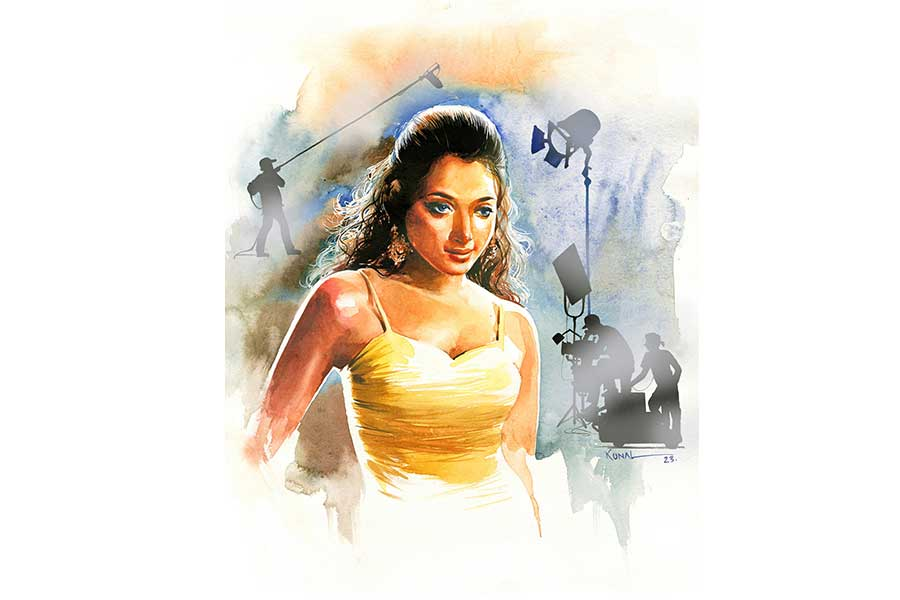

 
 <h1 align=center>আমিই তারকা</h1>
<h2 align=center>শুভমানস ঘোষ</h2> ভোরে মোবাইল ফোনের তীব্র ঝঙ্কারে ঘুম ভেঙে গেল ডিরেক্টর সজীবের। ও প্রান্তে কপিরাইটার কিঙ্কিণীদি। বেশ উত্তেজিত, “সজীব মহা বিপদ। নয়না নার্সিং হোমে।”

নয়না মেয়েটি নতুন। যেমন স্মার্ট, তেমনই গ্ল্যামারাস। বেতের মতো নমনীয় চেহারা। চোখে-মুখে কথা। অভিনয়েও চোস্ত। স্ক্রিপ্ট ফেলার অপেক্ষা, ঝাড়া মুখস্থ করে নিখুঁত অভিনয় করে মাতিয়ে দিচ্ছে। ভীষণই ভাল পারফরম্যান্স।

স্ক্রিন টেস্টেই মুগ্ধ হয়ে গিয়েছিল সজীব। ভবিষ্যতে নয়নাকে নিয়ে স্বপ্নও দেখতে শুরু করেছিল। বুঝেছিল, তাকে দিয়ে হবে। এতটাই ভাল হবে যে, রাজ্য ছাড়িয়ে তার নাম ছড়িয়ে পড়বে ঘরে ঘরে। তার গডফাদার হিসেবে সজীবও ভারতবিখ্যাত হয়ে যাবে।

কিন্তু চিন্তার বিষয় একটাই, বড্ড ভাল পার্ট করে নয়না। স্টার এলিমেন্ট নিয়ে বেছে বেছে তার হাতেই পড়েছে! এত সুখ সইলে হয়! ভয়ে ভয়েই তাকে সজীব জিজ্ঞেস করেছিল, “তুমি কি ম্যারেড?”

কোমর-ছাড়ানো চুলের পুষ্ট গোছা দুলিয়ে নয়না বলেছিল, “না।”

সজীব জিজ্ঞেস করেছিল, “ওয়েল... বয়ফ্রেন্ড আছে তোমার?”

“আছে।”

এমন মেয়ের বয়ফ্রেন্ড না-থাকাটাই আশ্চর্য। মনে মনে আরও কিছুটা শঙ্কিত হয়ে পরের প্রশ্ন সজীবের, “সেভেন উইক এপিসোড। তুমিই নায়িকা। বয়ফ্রেন্ডের সঙ্গে কথা বলেছ এ ব্যাপারে? মানে এ সব নিয়ে পরে কোনও...”

“হোয়াই?” নয়নার মুখে বিরক্তি, “আমার ব্যক্তিগত পরিসরে কাউকে অ্যালাও করি না আমি। ডোন্ট ওরি সজীবদা, কিচ্ছু হবে না।”

শুনে সজীব একটু থমকেছিল, “ব্যক্তিগত পরিসর? বাংলাটাও ভাল জানো দেখছি।”

“বয়ফ্রেন্ডকে সামলাতেও জানি‌। ও নিয়ে ভাববেন না। ঠিক ম্যানেজ করে নেব। ডোবাব না।”

তার মধ্যে হঠাৎ নার্সিং হোম? বুকটা ধড়াস করে উঠল সজীবের। টিভি সিরিয়ালের দুটো ইনস্টলমেন্ট ব্রডকাস্ট হয়ে গিয়েছে। দুটো এপিসোডের শুটিং কমপ্লিট। এখনও তিনটে বাকি।

উত্তেজনায় চেঁচিয়েই উঠল সে, “বলো কী কিঙ্কিণীদি? এরই মধ্যে হঠাৎ কী হল নয়নার?”

কিঙ্কিণীদিই নয়নাকে এনেছিল। বলল, “ঠিক জানি না রে! ওর ভাই সায়ন ফোন করেছিল। বলল হঠাৎ করে নয়না অসুস্থ হয়ে পড়েছে। তোকে নিয়ে যেতে বলেছে নার্সিং হোমে। জরুরি কথা আছে।”

নয়নার পড়ে যাওয়া মানে এখনই শুটিং করা যাবে না। মাঝে মাত্র দু’সপ্তাহ। এর মধ্যে শুটিং কমপ্লিট না-হলে সিরিয়ালের ব্রডকাস্ট ড্রপ করতে হবে। কয়েক লাখ টাকা ফাইন গুনতে হবে। চ্যানেলের টিআরপি পড়ে যাবে। রানিং অ্যাড শিফ্ট করে যাবে অন্য চ্যানেলে। মারাত্মক টেনশনে পড়ে গেল সজীব‌। ফোন ছেড়ে ছুটল নার্সিং হোমে।

কিঙ্কিণীদি দাঁড়িয়ে ছিল তারই অপেক্ষায়। মুখে তার উদ্বেগের ছায়া। সজীবকে দেখে “চল!” বলে নার্সিং হোমে ঢুকে নির্দিষ্ট কেবিনের কাছে গিয়ে থমকে দাঁড়াল। বেশ কয়েক জন লোক দাঁড়িয়ে আছে‌। তাদের মুখ-চোখের ভাবভঙ্গি সুবিধের নয়। ওকে এ রকম ভাবে দেখছে কেন লোকগুলো! নয়নাকে কাস্ট করিয়ে কি সজীবরা অপরাধ করে ফেলেছে! নয়নার কি নিজের ইচ্ছে ছিল না!

ভিড়ের মধ্যে থেকে সায়ন এগিয়ে এল। সজীবকে বেশ অপ্রসন্ন চোখে দেখে কিঙ্কিণীদিকে বলল, “এ দিকে আসুন কিঙ্কিণীদি।”

কিঙ্কিণীদিও অস্বস্তি বোধ করছিল। সজীবের পরিচয় দিতে গেল। “বুঝেছি,” বলে সবটা না-শুনেই সায়ন ঢুকে গেল কেবিনে। পিছন-পিছন সজীবকে নিয়ে কিঙ্কিণীদিও।

বেডে শুয়ে আছে নয়না। এক রাতেই তার গ্ল্যামার ও স্মার্টনেসের ইতি হয়ে গেছে। কথার ধার ও ভার শেষ। ধকলের দাগে সুন্দর মুখ কলঙ্কিত। সজীবকে দেখে হাউহাউ করে কেঁদেই ফেলল। কাঁদতে-কাঁদতে যা জানাল, তাতে বোঝা গেল, ব্যক্তিগত পরিসরেরও দফারফা তার। মুখেই বলেছিল, বয়ফ্রেন্ডকে ম্যানেজ করতে পারেনি।

টিভিতে সিরিয়াল ব্রডকাস্ট হতেই সব জানাজানি হয়ে যায়। পরিচিত লোকজনের অভিনন্দনের জোয়ারে ভেসে গেলেও বয়ফ্রেন্ডের নিষ্ঠুর ধাক্কায় তীরের শক্ত ঘাটলায় আছড়ে পড়েছে নয়না। তাকে না জানিয়ে পরদায় অবতীর্ণ হতে ছেলেটি কাল রাতে তাকে ফোনে এমন কঠিন কঠিন কথা শুনিয়েছে যে, ক্ষোভে-দুঃখে-অপমানে সে বিষ খেয়ে আত্মহত্যা করতে গিয়েছিল। সারা রাত নার্সিং হোমে পাম্প করে বিষ বার করা হয়েছে বটে, কিন্তু মনে যে ক্ষত তৈরি হয়েছে, এর পর তার পক্ষে অভিনয় করা সম্ভব নয়। তাকে যেন অব্যাহতি দেওয়া হয়।

মাথায় আকাশ ভেঙে পড়ল সজীবের। কিঙ্কিণীরও।

“তা কী করে হয় নয়না?” সজীব উত্তেজিত, “তুমিই তো বলেছিলে ডোবাবে না। সব ম্যানেজ করে নেবে। এখন অন্য কথা বললে হবে কেন? স্টোরির আসল শুটিংই তো বাকি।”

কিঙ্কিণীদি বোঝাল, “প্লিজ় নয়না, আমার মুখ রাখো। আর দু’দিন কোনও রকমে উতরে দাও। বয়ফ্রেন্ডকে বোঝাও। তার পর তার যখন ইচ্ছে নয় ছেড়ে দিয়ো।”

নয়না মাথা নাড়াল, “আমাকে ছেড়ে দাও কিঙ্কিণীদি। আমার পক্ষে সম্ভব নয়।”

“অসম্ভব!” গলা চড়ল সজীবের, “তোমাকে ছাড়া যাবে না।”

নয়না ভেঙে পড়ল, “সজীবদা, আপনি আমার দিকটা দেখুন। আপনারা ইচ্ছে করলে সব পারেন। স্টোরিলাইন চেঞ্জ করে নিন না! যত দূর হয়েছে, ওখানেই আমার রোল কমপ্লিট করে দিন।”

“মামাবাড়ির আবদার! তুমি নায়িকা। হুট করে ছেঁটে ফেলা যায়?”

এত ক্ষণ মুখ ভার করে তাদের কথা শুনছিল সায়ন। সজীবের দিকে ফিরে বিরক্ত গলায় বলল, “খুব যায়। কাস্টিং চেঞ্জ করুন। অন্য মেয়েকে আনুন। লিখে দিন এখন থেকে নয়নার রোলে এ পার্ট করবে। ঝামেলা খতম।”

সঙ্গে সিরিয়ালও খতম! এই না-হলে বাঙালির ব্রেন! সজীব রেগে গেল। কিন্তু তাতে ফল ভাল হল না। চেঁচামেচির শব্দে বাইরে থেকে ছুটে এল লোকজন। ঠেলতে-ঠেলতে সজীবদের বার করে দিয়ে শাসাল, বেশি বাড়াবাড়ি করলে তাদের নামে নয়নাকে দিয়ে থানায় এফআইআর ঠুকে দেবে। তখন বুঝবে ঠেলা!

ঠেলা ভাল করেই বুঝল সজীব। কিন্তু কোনও উপায় না থাকায় পরদায় দুঃখ প্রকাশের বার্তা দিয়ে নতুন এক নায়িকাকে সিলেক্ট করে তাকেই নামিয়ে দিল নয়নার রোলে।

নতুন নায়িকার নাম অদ্রিজা। দেখতে সুন্দর হলেও নয়নার পাশে যায় না। শুটের সময় বার বার ভুল করছিল। মাথা গরম হয়ে যাচ্ছিল সজীবের। বকাবকি করছিল। এ-ও কিঙ্কিণীদির রিক্রুট। বেচারিও অপ্রস্তুতের একশেষ। সজীব মনে মনে বলছিল, ‘সবক’টা ওয়ার্থলেস!’

সিরিয়াল শেষ হতেই সজীব দেখল, ওয়ার্থলেসের দলে তার নামও উঠে গিয়েছে। টেলিফিল্মে নায়িকার বদল হওয়ায় দর্শকরা তো বটেই, প্রোডাকশন হাউসগুলোও বেঁকে বসেছে। বিখ্যাত হওয়া দূরের কথা, তিরস্কারে জর্জরিত হচ্ছে সে। তাকে নতুন কাজের লিস্ট থেকে ছেঁটে জ্বালা বাড়াতে নতুন মেয়ে অদ্রিজাকেই ঢেলে কাজ দেওয়া হচ্ছে। যাকে সে গড়ে-পিঠে দাঁড় করিয়েছিল, দেখতে-দেখতে সজীবকে টপকে তারই নাম ছড়িয়ে যাচ্ছে। আজকাল কোনও দরকারে ফোন করলেও ধরে না অদ্রিজা। ভাল গুরুদক্ষিণা!

কিন্তু না। গুরুদক্ষিণা তখনও দেখেনি সজীব। দেখল বছর তিনেক পরেই। তত দিনে তার স্বপ্ন মুখ থুবড়ে পড়েছে। বিখ্যাত পরিচালক হওয়ার আশা এ জন্মে ছাড়তে হবে বুঝেছে। কলেজে কলেজে ফিল্ম স্টাডিজ়-এর লেকচার দিয়ে গড়িয়ে-গড়িয়ে জীবন কাটছে তার।

ঠিক তখনই তার চোখে পড়ল এক বিখ্যাত সিনেমা পত্রিকার কভারে অদ্রিজার ফলাও ছবি ছাপিয়ে উঠতি নায়িকার উত্থানের ইতিহাস লেখা হয়েছে। কভার স্টোরির ক্যাচি নাম দেওয়া হয়েছে, ‘আমিই স্টার’। স্টল থেকে পত্রিকার এক কপি কিনে পড়ে তো আক্কেল সটান কপালে।

সাক্ষাৎপ্রার্থী তার উত্থানের ইতিহাস জানতে চাইতে সে বলছে, “সে এক ইন্টারেস্টিং কাহিনি। নাটকীয়ও বলতে পারেন। আমার জীবনের স্বপ্নের দিন ছিল সেটা। আমি দক্ষিণ কলকাতার এক কলেজে পড়তাম। এক দিন কলেজের গেটে দাঁড়িয়ে ক্লাসের বন্ধুদের সঙ্গে গল্প করছি। হঠাৎ একটা গাড়ি এসে থামল। গাড়ি থেকে যিনি বেরিয়ে এলেন তাঁকে দেখে তো আমি থ। ইনি যে বাংলা টিভির সবচেয়ে জনপ্রিয় চ্যানেলের উজ্জ্বল মুখ সূর্যদা। এগিয়ে এসে দাঁড়িয়ে পড়লেন আমারই সামনে। বললেন, ‘তুমি টিভি সিরিয়ালে পার্ট করবে?’

“শুনে হ্যাঁ-না বলব কী, গলাই শুকিয়ে গিয়েছে। সূর্যদা আমার অবস্থা বুঝলেন। পকেট থেকে ভিজ়িটিং কার্ড বার করে ‘রাজি থাকো তো এই আমার নাম্বার। যোগাযোগ কোরো,’ বলে গটগট করে গাড়িতে উঠে চোখের নিমেষে অদৃশ্য। সকলের জীবনে এমন সৌভাগ্য ঘটে না। থ্যাঙ্ক গড, আমার জীবনে ঘটেছিল।”

আর বাকিটুকু পড়ার ইচ্ছেই হল না সজীবের। বুঝল যে মাটির তালকে গড়ে তুলতে সে প্রথম হাত লাগিয়েছিল, মিথ্যের প্রতিমূর্তি হয়ে কী সুন্দর ভাবেই না ফুটে উঠেছে! সূর্যদার সঙ্গে উপস্থিত সে লিভ-ইনে গিয়েছে বলে কৃতজ্ঞতা স্বীকারের ব্যানার থেকে সে-ই বাদ? এক বার তার নামটা উল্লেখ করারও প্রয়োজন বোধ করল না অদ্রিজা?

বাড়ি ফিরে সজীব নির্জীব ভাবে বিছানায় শুয়েই পড়ল। তার রাগ হচ্ছে। দুঃখ হচ্ছে। মোবাইল ফোনের কনট্যাক্ট লিস্ট খুলে দেখছে অদ্রিজার নাম। অদ্রিজা তাকে ব্লক করে দিলেও সে করেনি। জ্বলজ্বল করছে তার নাম। তিন বছর তো কেটে গেছে, আবার এক বার কল করে দেখবে নাকি? পৃথিবীতে কত আশ্চর্য ঘটনাই ঘটে। ব্লক নাম্বারে কল চলে যাওয়া কী এমন আশ্চর্য? ধরলে তাকে একটাই কথা বলবে, অকৃতজ্ঞতা চরমতম অপরাধের চেয়েও অপরাধ। তার মাফ নেই। ক্ষমা প্রার্থনা-অনুশোচনাতেও তার মুক্তি নেই।

তাও কেন যে কলটা করল না জানে না। তবে যে আশ্চর্য ঘটনার কথা ভাবছিল সেটাই ঘটে গেল। মোবাইল নিজেই জ্যান্ত হয়ে বাজতে শুরু করল।

সজীব স্ক্রিনের দিকে চেয়ে দেখল, অজানা নম্বর। টেলি-সিরিয়ালে ঢোকার পরে প্রথম প্রথম এমন কল অনেক আসত। আর আসে না। তিক্ত মুখে লাইন ধরে সাড়া দিল, “হ্যালো?”

“আমায় চিনতে পারছেন?” ও প্রান্তে চেনা গলাই বাজল। বহু আগের চেনা। তবু ভুল হল না।

সজীব ধড়মড়িয়ে উঠে বসল। পিঠ সোজা করে চোয়াল শক্ত করে সাড়া দিল, “পারছি। ব্যক্তিগত পরিসর। কী ব্যাপার?”

নয়নার স্বরের সেই ভোল্টেজ আর নেই, “কিছু না। আপনার কথা মনে পড়ল।”

কিছু না? নাকি সজীবকে কতটা সুন্দর করে ডুবিয়ে ভবিষ্যতের পার্মানেন্ট বারোটা বাজিয়েছে, সেটাই সেলিব্রেট করতে এই ফোন? কাঠ-কাঠ গলায় বলল, “ও!”

নয়না একটু চুপ। তার পর আবার বাজল, “পত্রিকায় অদ্রিজার ইন্টারভিউটা পড়লাম। আপনার নামই করল না! ছি!”

তাকে স্মরণ করার এটাই তবে কারণ? নিজের অপমান ঘাঁটতে ইচ্ছে করল না সজীবের। রাগ চেপে অন্য কথা পাড়ল, “বিয়ে করেছ?”

“করেছিলাম।”

“ছিলাম?”

“ছাড়াছাড়ি হয়ে গিয়েছে,” নয়না ভেঙে পড়ল, “অ্যাডজাস্ট করতে পারলাম না। থাকা যায় না ওর সঙ্গে। অথচ ওর জন্যই আমি এক দিন আপনাকে ডুবিয়ে, কেরিয়ারে জলাঞ্জলি দিয়ে... ব্রুট! ব্রুট!”

সজীবের পতন নয়। নিজের পতনের শোকগাথা গাইতেই এই ফোন। সজীব চুপ। কিন্তু নয়নার কথা বাকি। বলল, “বড্ড আফসোস হয় সজীবদা। কী ভীষণ ভুলই না করেছিলাম সে দিন!”

মুহূর্তে সজীবের নুইয়ে-পড়া স্নায়ু টান-টান। চোখে উড়ে এল স্বপ্ন। একই গাড়িতে দু’বার অ্যাক্সিডেন্ট হয় না। ভুল যখন ভেঙেছে, নয়নাকে নিয়ে শেষ চেষ্টা এক বার করে দেখবে নাকি? ক্ষোভ-তাপ শেষ। গলা নামিয়ে বলল, “ভুল না-করলে ঠিকটা ধরবে কী করে নয়না? নতুন করে শুরু করো আবার।”

“সেটা আর হওয়ার নয় সজীবদা। আর আগের চেহারা নেই আমার। ফ্ল্যাবি হয়ে গিয়েছি। আপনি আর আমায় পছন্দই করবেন না। কী থেকে কী হয়ে যায়! ভুলটা না-করলে কোথায় থাকত অদ্রিজা? আজকের ‘আমিই স্টার’!”

বলতে-বলতে গলা বুজে এল নয়নার। পৃথিবীটা সত্যিই আশ্চর্য জায়গা। একই দুঃখ এক সঙ্গে দু’জনের দুঃখ হয়ে যায়। কেউ কাউকে সান্ত্বনা দিতে পারে না। দু’প্রান্তে দু’জন স্তব্ধ মানুষ কথা হারিয়ে ফেলে। জানলায় তখন সন্ধে নামছে মন্থর গতিতে।