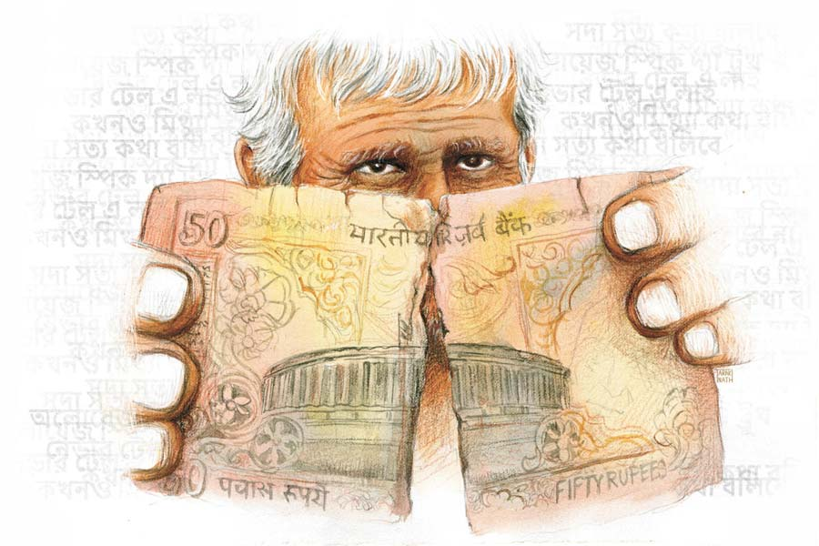

 
 <h1 align=center>আরও এক জন</h1>
<h2 align=center>উপল পাত্র</h2> যখন বাড়ির সামনে রিকশা এসে দাঁড়াল তখন ন’টা বেজে গেছে। একে মফস্সল, তার উপরে একটু আগে ঝড়বৃষ্টি হয়ে গেছে। ঝড়জল হলে এ দিকে বিদ্যুৎ থাকে না। তাই রাস্তাও অন্ধকার, চার দিক শুনশান। ভারী ব্যাগ, ছাতা আর ধুতির কোঁচা সামলে সুবোধবাবু সাবধানে রিকশা থেকে নামলেন জলকাদা বাঁচিয়ে। পকেটে রাখা পঞ্চাশ টাকার নোটটা বার করে ভাড়াটা দিতে যাওয়ার মুহূর্তে সিদ্ধান্ত বদল করলেন। নোটটা পকেটে রেখে মানিব্যাগের আলাদা খোপে রাখা ফ্লুরোসেন্ট নীল রঙের ময়লা পঞ্চাশ টাকার নোটটা বার করে রিকশাওয়ালার হাতে দিলেন। রিকশাওয়ালা গামছায় ঘাম মুছতে মুছতে কোমরের গেঁজেয় টাকাটা ভরে প্যাডেলে চাপ দিল। খুলে দেখলও না নোটটা। লোকটা চোখের আড়াল হতে স্বস্তির নিঃশ্বাস ফেললেন সুবোধবাবু। যেন গুম-খুন করা একটা লাশ তথ্যপ্রমাণ সমেত পাচার করে দিতে পেরেছেন গোপনে। নোটটা গলার কাঁটা হয়েছিল এত দিন।

ভাড়াটা একটু বেশিই চেয়েছিল রিকশাওয়ালা— তিরিশের জায়গায় পঞ্চাশ। কোনও রিকশাই এ দিকে আসতে চাইছিল না, ফিরতি পথে প্যাসেঞ্জার পাবে না বলে। এ তবু রাজি হয়েছিল। সুবোধবাবু তাই আর দরাদরিতে যাননি। ভাগ্যিস যাননি, গেলে টাকাটার গতি হত না।

মাস দুয়েক আগের কথা। অফিসের কাজ সেরে বেরোতে রাত হয়ে গেছিল সুবোধবাবুর। মান্থলি শেষ হয়ে যাওয়ায় টিকিটের লাইনে দাঁড়িয়েছিলেন। কাউন্টারে ভীষণ ভিড় আর ট্রেনের সময়ও হয়ে এসেছিল। সুবোধবাবু কাউন্টার থেকে ছোঁ মেরে টিকিট আর খুচরোটা ফেরত নিয়েই ছুট দিলেন ট্রেন ধরতে।

ট্রেন থেকে নেমে রোজকার মতো বাজারে সন্তোষের দোকানে চা-বিস্কুট খেলেন। দাম মেটাতে গিয়ে ধরা পড়ল ব্যাপারটা।

“এ হে! টাকাটা দেখে নেননি মাস্টারমশাই! এ তো চলবে না, অনেকটা ছেঁড়া।”

নোটটা হাতে নিয়ে সুবোধবাবু উল্টেপাল্টে দেখলেন— ভাঁজ বরাবর অনেকটা কাটা। দুনিয়াটা কি জোচ্চোরে ভরে গেল! কাউন্টারে বসা লোকগুলো প্রায়শই ছেঁড়া ফাটা নোট, অচল পয়সা চালিয়ে দেয় জেনেশুনে। তাড়াহুড়োয় অনেক সময় দেখে নেওয়া সম্ভবও হয় না। ওরা সেই সুযোগটাই নেয়। এক বার ভাবে না নোটটা যাকে দিল, তাকে কত নাকাল হতে হয়, কটুকাটব্য শুনতে হয়। পঞ্চাশ টাকা নেহাত কম নয়!

পরদিন অফিসে বেয়ারা মনুকে নোটটা দিয়ে বলেছিলেন, “এটা চালিয়ে দিয়ে টাকাটা তুই রাখিস... রথের বকশিশ।”

সপ্তাহখানেক বাদে মনু নোটটা ফেরত দিল, “বাবু, বকশিশ দিলে ভাল নোট দাও, এটা কেউ নিচ্ছে না।”

মাসের শেষে একটু টেনেটুনেই চলতে হয়। বকশিশ দিতে খামোকা পঞ্চাশটা টাকা বেরিয়ে গেল।

আর এক বার বামুনবাড়ি সিধে পাঠানোর সময় গিন্নির হাত দিয়ে নোটটা চালান করেছিলেন দক্ষিণা হিসেবে। ওটা ফেরত তো এলই, সঙ্গে গিন্নির মুখঝামটা, “আক্কেল কী তোমার হ্যাঁ! নোটটা যে অতখানি ছেঁড়া, একটু দেখে দিলেনে? ইজ্জত আর রইল কিছু? শেষে বুল্টির পিসির থেকে ট্যাকা চেয়ে দক্ষিনে দিই।”

সুবোধবাবু লজ্জায় পড়লেন। এই নিয়ে তিন বার ফেরত এল টাকাটা। মজার কথা, টাকাটা যত বার ফেরত আসে, ওটা চালানোর জন্য ততই যেন তার রোখ চেপে যায়। আসলে নোট গছানোর এই খেলায় জয়-পরাজয়ের একটা রোমাঞ্চ আছে। তিনি সেটা উপভোগ করেন। তাই নোট বদলাতে আর ব্যাঙ্কে যাননি। তিন বার ব্যর্থ হলেও অপেক্ষায় থাকেন সুযোগের।

সুযোগও এসে যায়। সে দিন মুক্তিপদকে বাজারে দেখে সুবোধবাবুর নোট গছানোর গোপন ইচ্ছেটা পুরনো ব্যথার মতো চাগিয়ে উঠল। কথায় বলে, ভিখারি করে না ভিক্ষার চালের বিচার আর পুরনো পাওনাদার করে না পাওনা টাকার বিচার। মুক্তিপদকে দিয়ে অনেক দিন আগে গাছের নারকোল পাড়িয়েছিলেন। তার পাওনা বাকি ছিল। মানিব্যাগে রাখা সেই নোটটা ভাঁজ সমেত তড়িঘড়ি ধরিয়ে দিলেন মুক্তির হাতে, “পঁচিশ টাকা পাওনা ছিল, মনে নেই তো? পুরোটাই রাখো বুঝলে, কিছু আর ফেরত...”

মুক্তি তেমন পাওনাদার ছিল না। সে সুবোধবাবুর সামনেই নোটটা খুলে আলোয় ধরে বলল, “কত্তা, এই লোট চলবেনে গো... পালটে দেন।”

এ বারও পঁচিশ টাকা গাঁটগচ্চা, কারণ পঞ্চাশ দেবেন কবুল করে ফেলেছেন। চার-চার বার ব্যর্থ সুবোধবাবু খানিকটা হতাশ হলেন ঠিকই, কিন্তু হাল ছাড়লেন না। নোটটা মানিব্যাগে রাখার আগে নাতির থেকে সেলোটেপ চেয়ে কাটা জায়গাটা এমন ভাবে মেরামত করলেন যাতে ছেঁড়াটা আর চট করে বোঝা না যায়।

*****

পাড়ায় মাস্টারমশাই নামে পরিচিত সুবোধ কুণ্ডু আদতে কলকাতার এক সওদাগরি অফিসের হিসাবরক্ষক। কল-কারখানা অধ্যুষিত মফস্সলের যে অঞ্চলে তিনি থাকেন, সেখানে অশিক্ষিত, নিরক্ষর শ্রমিক মজুরদেরই বসবাস। ইংরেজি-জানা লোক বেশি নেই বললেই চলে। তারা আসে ইংরেজিতে দরখাস্ত লিখিয়ে নিতে, টুকটাক পরামর্শ করতে। শুধু তা-ই নয়, বাড়িতে নাতির সঙ্গে তাদের ছেলেমেয়েদেরও তিনি ইংরেজি পড়ান। সবটাই অবশ্য বিনি পয়সায়। সেই থেকেই তিনি সবার মাস্টারমশাই। সৌম্যদর্শন, নির্বিরোধী, ছোটখাটো চেহারার মানুষটিকে অঞ্চলে সবাই শ্রদ্ধা করে, চেনে এক ডাকে। তাকে দেখে ছেলে-ছোকরারা বিড়ি সিগারেট লুকোয়। বিভিন্ন সভা-সমিতিতে প্রধান অতিথির আসন অলঙ্কৃত করেন তিনিই।

পরদিন সকালে নাতিকে ইংরেজি পড়াচ্ছিলেন। তার বন্ধুরা সে দিন আসেনি। বছর বারোর নাতি অদ্বয় তার চোখের মণি। তাকে মানুষ করার ভার নিয়েছেন নিজেই।

“শোনো দাদুভাই, ইংরেজিতে ‘বলা’ ক্রিয়াপদের জন্য চারটে প্রতিশব্দ আছে— ‘স্পিক’, ‘টেল’, ‘সে’ আর ‘টক’। তবে এদের ব্যবহার আলাদা। যেমন ‘সদা সত্য কথা বলবে’— অলওয়েজ় স্পিক দ্য ট্রুথ। কিন্তু ‘কখনও মিথ্যা বলবে না’— নেভার টেল এ লাই। আবার...”

“মাস্টারমশাই আছেন নাকি...” বাইরে পরিতোষের গলা। ওদের আজ আসার কথা ছিল। তাদের গ্রামটা দুই স্টেশনের মাঝামাঝি হওয়ায় নিত্যযাত্রীদের ভোগান্তি খুব। তাই গ্রামের কাছেপিঠে একটা ‘হল্ট’ স্টেশন করার আর্জি জানিয়ে রেল দফতরে দরখাস্ত লিখে দিতে হবে। পরিতোষ, সুনীল ঢালি, কার্তিক পাখিরার পিছন পিছন ঘরে ঢুকল আরও এক জন। তার চোখেমুখে অনেকটা সঙ্কোচ, খানিকটা ভয়। লোকটাকে দেখে সুবোধবাবু যত না অবাক হয়েছেন, অস্বস্তি বোধ করছেন তার থেকে বেশি। অসংখ্য বলিরেখায় ভরা মুখ, খোঁচা-খোঁচা সাদা দাড়ি, কষে নিংড়ানো গামছার মতো শির-ওঠা দুটো সরু হাত। লোকটা কেন এসেছে বুঝতে অসুবিধে হল না।

কার্তিক বলল, “মাস্টারমশাই, এ বলছে আপনি নাকি একে কাল পঞ্চাশ টাকার ছেঁড়া নোট দিয়েছেন?”

সুবোধবাবু মুখ খোলার আগেই মাতব্বর পরিতোষ লোকটাকে বলল, “এই লোক তোকে ছেঁড়া নোট দিয়েছে! জানিস, কাকে কী বলছিস? দেখগে, ভুল হচ্ছে কোথাও।”

সুনীল ধমকে বলল, “যার তার নামে যা খুশি বললেই হল? চিনিস ওঁকে? ভাগ এখান থেকে, যত্তসব উটকো ঝামেলা...”

ওদের ধমকে খানিকটা গুটিয়ে গেলেও মিনমিন করে লোকটা জানাল, সুবোধবাবুকে সে চেনে বলেই নোটটা আর দেখে নেয়নি। তা ছাড়া রাতে সে প্রায় দেখতেই পায় না। লোকটার হাতে ধরা নোটটার উপর আলো পড়ে সেলোটেপ চিকচিক করে উঠল। সুবোধবাবু রিকশাওয়ালার দিকে তাকিয়ে রইলেন অপরিচিতের দৃষ্টিতে। ঘরের আবহাওয়া ক্রমশ ভারী হচ্ছে দেখে নাতিকে বললেন, “দাদু, তুমি এখন যাও। আর মাকে চা পাঠিয়ে দিতে বলো তিন কাপ।”

“তিন না চার?” লোক গুনে জিজ্ঞেস করে নাতি।

সুবোধবাবু নাতিকে তিনটি আঙুল দেখালেন নিঃশব্দে।

সুনীল ঢালি বলল, “টাকাটা নেওয়ার সময় দেখে নিসনি... আর এখন ওঁর ঘাড়ে দোষ চাপাচ্ছিস। প্রমাণ কী, নোটটা উনি দিয়েছেন?”

বোঝা যাচ্ছিল লোকটা বেশ অসুস্থ। দাঁড়িয়ে থাকতে থাকতে মেঝেয় বসে পড়ে ক্ষীণ স্বরে বলল, সুবোধবাবুই গত রাতে তার শেষ সওয়ারি ছিল। আর একটাই পঞ্চাশ টাকার নোট পেয়েছিল রাতে। দিনের আলোয় রিকশাওয়ালার কোটরে বসা চোখ দুটোতে সুবোধবাবু স্পষ্ট দেখলেন ছানি পড়েছে। অনুতপ্ত সুবোধবাবু বললেন, “ভুল তো আমারও হতে পারে সুনীল... বলছে যখন টাকাটা পাল্টে দিই।”

কার্তিক বলল, “ছাড়েন তো... এদের আপনি চেনেন না মাস্টারমশাই। পঞ্চাশ টাকা ভাড়া কি এমনি এমনি চেয়েছে? আপনার ভাল নোটটা রেখে আজ এসেছে ওর ছেঁড়াটা পাল্টাতে। আপনি দিয়েছেন তাই নাকি ও দেখে নেয়নি। শয়তানিটা দেখুন এক বার। আজ একে দয়া দেখাবেন তো কাল আর এক জন আসবে... পারবেন তো সামলাতে?”

সুনীল খেঁকিয়ে বলল, “হতভাগা এখনও দাঁড়িয়ে আছিস? যাবি না ঘাড়ধাক্কা...” লোকটা সুবোধবাবুর দিকে অসহায়ের মতো চেয়ে থেকে ধীরে ধীরে বেরিয়ে গেল।

স্বস্তির নিঃশ্বাস ফেললেন সুবোধবাবু, “তোমরা চা-বিস্কুট খাও, দরখাস্তটা তত ক্ষণে লিখে ফেলি... বয়ানটা ভেঁজেই রেখেছি।”

ছেঁড়া টাকার মতো অচল টাকা থাকলেও সুবোধবাবুর মনে হয় কত ক্ষণে ওগুলো বিদায় হবে। নোটবন্দির সময় পাঁচশো আর হাজার টাকা নিয়ে কী ঝামেলাতেই না পড়তে হয়েছিল। ব্যাঙ্কে ঘণ্টার পর ঘণ্টা দাঁড়িয়ে থাকা। তার পর ভয়, এই বুঝি জিজ্ঞেস করে, ‘এতগুলো পাঁচশো আর হাজার টাকা কোথায় পেলেন?’ নোট বদলাতে ব্যাঙ্কে এক বারই গিয়েছিলেন। অবশিষ্ট যে ক’টা বাড়িতে ছিল, দিয়ে এসেছিলেন সখীচরণের আলুর আড়তে। তাঁর ‘ভালমানুষ’ পরিচিতির জন্য সখী তার কাছ থেকে টাকায় পাঁচ পয়সা কম বাটা নিয়েছিল।

এই ‘ভালমানুষ’ পরিচয়ই তো রক্ষাকবচ হয়ে সম্মান বাঁচাল পরিতোষদের কাছে। এই পরিচয়ের জন্যই নাকি রিকশাওয়ালা টাকাটা দেখে নেয়নি। অথচ তিনি তার বিশ্বাসের অমর্যাদা করে জেনেশুনে ঠকিয়েছেন। এও তো এক রকমের জোচ্চুরি। আর তিনি সেই গর্হিত কর্মটিই করেছেন ‘ভালমানুষ’ পরিচয়ের আড়ালে, রাতের অন্ধকারের সুযোগ নিয়ে। টাকাটা যাকে গছালেন এক বারও ভাবলেন না যে, সে তাঁর চেয়ে সব দিক থেকেই দুর্বল। কাউন্টারের লোকটার সঙ্গে তা হলে তার আর তফাত রইল কোথায়? কী শেখাবেন এর পর নাতিকে? প্রবল আত্মগ্লানিতে জর্জরিত সুবোধবাবু ঠিক করলেন, রিকশাওয়ালাকে গোপনে টাকাটা পাল্টে দিয়ে কৃতকর্মের প্রায়শ্চিত্ত করবেন। তার ‘ভালমানুষ’ পরিচয়ে কিছুতেই দাগ লাগতে দেওয়া চলবে না।

তিনি ভেবে দেখলেন তার কাছে ছেঁড়া নোট আছে, সেটা জানে চার জন। তাদের মধ্যে চায়ের দোকানের সন্তোষ, অফিসের মনু আর মুক্তিপদ বাইরের লোক। এদের কারও সঙ্গেই পরিতোষ, সুনীলদের কোনও দিন যোগাযোগ হওয়ার সম্ভাবনা নেই। সে ক্ষেত্রে ছেঁড়া নোটটা যে তিনিই গছিয়েছেন, সেটা কেউ কোনও দিন জানবে না। আর আসল ঘটনাটা তিনি আর রিকশাওয়ালা ছাড়া তৃতীয় কেউ জানে না। ছেঁড়া টাকার কথা প্রমীলা জানলেও রিকশাওয়ালাকে দেওয়ার ব্যাপারটা জানে না। জানলে হয়তো চোখ কপালে তুলে বলতো, “ও মা, ছেঁড়া টাকাটা শেষে ওই গরিবটাকে! এক্ষুনি পাল্টে দিয়ে এসো।”

প্রমীলা বড় কড়া ধাঁচের। হবে না, ওর বাপ যে পুলিশ!

*****

রাতে বিছানায় নাতিকে পাশে শুইয়ে রোজকার মতো গল্প বলছেন।

“....তার পর শিষ্যকে নিয়ে গুরু এল হবুচন্দ্র রাজার দেশে। শিষ্য বলল, তার খুব খিদে পেয়েছে। গুরু তাকে একটা পয়সা দিয়ে বাজারে পাঠাল খাবার আনতে। বাজার থেকে ফিরে পেটুক শিষ্যের তো খুব আহ্লাদ।”

“আহ্লাদ কী?”

“মজা, ফুর্তি।”

“মজা কেন?”

“আগে পুরোটা শোনো। পেটুক শিষ্য বললে, গুরুদেব, এ বড় মজার দেশ। এখানে মুড়ি-মিছরির এক দর। আমি আর এখান থেকে কোত্থাও নড়ছি না। গুরু বলল সর্বনাশ! এ দেশে তো তা হলে সুশাসন নেই, চোর-জোচ্চোরের বাস। চলো, এখুনি পালাই নইলে...”

“জোচ্চোর কী?”

“ওই যারা জোর করে... লোক ঠকায়।” কথাটা বলতে গিয়ে গলাটা যেন একটু কেঁপে গেল সুবোধবাবুর। দ্রুত প্রসঙ্গ বদলে গল্প শুরু করতে যাবেন আবার প্রশ্ন।

“সকালে ওই রিকশাদাদুকে চা দিতে বললে না কেন?”

“ও তো চা খায় না তাই...” মুখ রক্ষায় মিথ্যের আশ্রয় নিতেই হল।

“কেন এসেছিল দাদুটা?”

“কী হবে ভাই ও সব জেনে। গল্প ভাল না লাগলে ঘুমোও, মাথায় হাত বুলিয়ে দিই।”

“আমি সব জানি।”

“কী, কী জানো?” সুবোধবাবুর বুক ঢিপঢিপ।

“ছেঁড়া টাকাটা তুমিই দিয়েছ না? অলওয়েজ় টেল দ্য ট্রুথ।”

আচমকাই সুবোধবাবুর মুখ থেকে বেরিয়ে এল, “টেল নয় স্পিক... স্পিক দ্য ট্রুথ... শেখালাম তো,” তার পর ঘামতে ঘামতে বললেন, “আমি দিয়েছি কে বলল ভাই?”

“আমার থেকে সেলোটেপ চেয়ে লাগালে যে... তুমিই দিয়েছ না?”

সর্বনাশ, সাক্ষী আরও এক জন! কী জবাব দেবেন ওকে? প্রশ্নটা যে তাঁরও বিবেকের।

ঠিক সেই মুহূর্তে রাতের মেল ট্রেনটা তীব্র হুইসল বাজিয়ে সশব্দে ছুটে গেল বাড়ির পিছন দিয়ে। সুবোধবাবুর ‘ইতি গজ’ উত্তরটা চাপা পড়ে গেল সেই শব্দে। 

ছবি: তারকনাথ মুখোপাধ্যায়