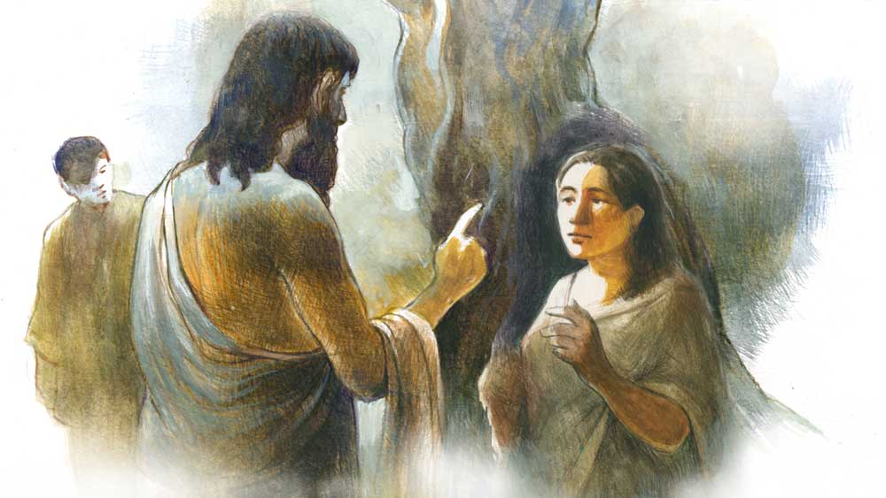

 
 <h1 align=center>আরাধ্যা</h1>
<h2 align=center>অসীমকুমার মুখোপাধ্যায়</h2> বাসবী হেঁটে চলেছিল। তার পরনে লালপাড় সাদা রঙের শাড়ি, নীল ব্লাউজ়, পায়ে হাওয়াই চপ্পল। তার কাঁখবগলে একটা পুঁটুলি, তাতে সামান্য প্রয়োজনীয় সামগ্রী। বাসবীর বিয়ে হয়েছিল বছর পাঁচেক আগে, জামাইটা ছিল নেশুড়ে, কাজকর্ম কিছুই করত না, বসে বসে খেত। শিরসে গাঁয়ে বাড়ি, তার জ্বালায় এক ভোররাতে বাপের বাড়ি পালিয়ে এসেছিল বাসবী।

জামাইও কোনও খোঁজখবর নিতে আসেনি। বাসবীর একমাত্র দাদা হলধর বলেছিল, “উখানে তুঁই গতর খাঁটায় খেতিস, ইখানেও খেটে খাবি। অমন মিদা মানুষের মুখে আগুন।”

হলধরের বৌ ফুলুরি দুটো ছেলে নিয়ে সামাল সামাল, সেও বলেছিল, “ঠাকুরঝি, তুমার কুনু ভামনা নাইখো। আমার রাম, লক্ষ্মণকে একটুখানি চোখে চোখে রেখো, আমি বামুনঘরে ‘পাট’ করে এসে তুমাকে ছেড়ে দুব, তুমি তখন বদিবামুনের ঘরে কাজগলান সামালে দিয়ো। উয়োর বাগানের কাজ, দু’বিলা খেতে দিবেক, মাস গেলে হাজারটাকা মাইনে। পেটের ভাত জুটলে মানুষের আর তেমন কিছুই লাগে না।”

বাসবীর খোঁজও নেয়নি জামাই। এক দিন শিরসের কালিকিষ্টর সঙ্গে দেখা হয়েছিল হলধরের, নূতনডাঙা হাটে, সেই বলেছিল, “তুদের জামাই নিরাপদ এখন বক্রেশ্বরের শ্মশানে পড়ে থাকে, লুকের ফাইফরমাশ খাটে। ছেলেটা বিগড়ে গেইছে।”

মানুষ ওই রকমই। পেটে টান পড়লে সে দিশা খুঁজে পায় না, যা পায়, তাতেই ভর করে বেঁচে থাকার চেষ্টা করে।

নিরাপদ দু’দিন ঘরে পেটে কাপড় বেঁধে পড়েছিল, ওই গাঁয়ের জামাই হাবুল বলেছিল, “ইখানে কতো আর পেটে কাপড় বেঁধে থাইকব্যে, আমাদের হরিদাসপুরে চলঅ, উখানে তুমার একটঅ বেবস্থা হঁয়ে যাবেক।”

নিরাপদকে দুকানে চপমুড়ি খাইয়ে বাসের ভাড়া দিয়ে নিয়ে এসেছিল বক্রেশ্বরের শ্মশানঘাটে। ঘাটের জমাদার নিশাপতিকে বলেছিল, “মাগনায় একটঅ লুক যুগাড় করে দিলুম, নিশা-ভাঙ করার পয়সা দিয়ো, আর আমার দস্তুরিটঅ কম করে দিয়ো না, তুমাদের হাঁ-টঅ বড্ড বড় বেটে।”

বাসবী এখন ফুলবেড়ে যাচ্ছে। ওইখানে নাকি মন্টু নতুন একটা আশ্রম খুলেছে। মন্টু ক’দিন আগে গাঁয়ের ভিটেতে এসেছিল, তখনই বাঁধে চান করতে যেয়ে বাসবীর সঙ্গে দেখা। বাসবীই বলেছিল, “মন্টু, তুই ই কি চেহেরা করেছিস? একগাল দাড়ি, মাথায় জটা!”

পাশেই ছিল ভুবনী, চোদ্দো বছরের কিশোরী, উথালপাথাল করা বয়স তার, সেই চোখ ঝিলিক হেনে বলেছিল, “পিসি, তুই জানিস না, মন্টুকাকা এখন সাধু হঁয়েছে, ফুলবেড়েতে আশ্রম করেছে, আমি মায়ের সতে দেখে এসেছি।”

বাসবীর বুঝি দেখে আশ মিটছিল না। এমন তো হয়ই। কত মানুষের মনে কত কিছু প্রত্যাশা থাকে, বুকের গোপনে পোঁতা গাছটিতে ফুল ফোটে, ফল ধরে, আবার ঝরেও যায়। এই মন্টুর সঙ্গে মোড়লপখোর সে কত বার এ পার ও পার করেছে, দু’জনে ছোট ছোট ডাঁড়কে, চিংড়ি মাছ ধরেছে গামছা দিয়ে, সেই মন্টুই এখন সাধু! কেমন করে পৃথিবী পাল্টে যায়!

মন্টুই বলেছিল, “বাসবী, শুনেছি তুর ভাতারের সতে ভাব নাই, উয়োকে তুঁই ছেড়ে চলে এসেছিস, তুঁই আমার আশ্রমে থাকবি?”

এমন কথায় কেমন কেঁপে উঠেছিল বাসবী, “বলেছিল, তুই কি তুর আশ্রমে তুর ‘রাখনি’ করে রাইখত্যে চাইছিস?”

হাঃ হাঃ করে হেসে উঠেছিল মন্টু, বলেছিল, “এ তুই কী কথা বলছিস বাসবী? আমি দীক্ষা নিয়ে কামিনী-কাঞ্চন ত্যাগ করেছি, আশ্রমের সব কিছু মিলন দেখে, আমি সাধনভজন নিয়ে থাকি, ইখানে দাদার সংসারে হতশ্রেদ্ধায় আছিস বলে তুখে বলেছিলুম আশ্রমে যেতে, কত মানুষের সতে থাকবি, কথা বলবি, আশ্রমের কাজকর্ম করবি, তুরই পরকালের পথ হবেক! ভেবে দ্যাখ, যদি মুনে করিস আমাদের দরজা খুলা রইল, দুবরাজপুর ইস্টিশনে নেমে হেঁটেই চলে যেতে পারবি।”

কথাটা শুনে কেমন স্বপ্নের মতো মনে হয়েছিল বাসবীর। সে তো কখনও স্বাধীন ভাবে থাকার স্বাদ পায়নি, মন্টু যাওয়ার পর সে খুব ভাল করে বাঁধের জলে সাবান মেখে চান করেছিল। ভুবনী বলেছিল, “পিসি, তুর পা গলা কত ফর্সা!”

কথাটা শুনে বাসবীর মনের ভিতরে অন্তঃক্ষরণ হয়েছিল। ভাতার যদি মাগকে না দেখে, আদর না করে, সুহাগ করে কাছে না টানে, তা হলে মেয়েলুকের আর কী মুরোদ? নিরাপদ তার যৌবনকে ভোগ করেছিল, তাও বেশি দিন সে সুখ পায়নি বাসবী। তার যৌবন অনাদরে অবহেলায় বাসি হয়ে গেছে। এমন হলে কী পুরুষ, কী মহিলা— কারও জীবনেই সুখ থাকে না। স্বামী যদি কাছে না টানে, বা স্ত্রী যদি সেই ডাকে সাড়া না দেয়, তা হলে যৌবনের ডালি নিয়ে পরস্পর কী করবে তারা?

কাজকর্ম সেরে ঘরে এসে এক বাটি মুড়ি নিয়ে খেতে বসেছিল বাসবী। অজান্তেই তার চোখ দিয়ে জল গড়িয়ে পড়ছিল। রাম, লক্ষ্মণ অন্য দিন পিসি গোলাঘর থেকে মুড়ি নিয়ে এলে পিসির সঙ্গে বসে মুড়ি খায়, আজ তারা ঘরের কোণে অর্জুন গাছটার নীচে বসে খেলছিল, বাসবী তাদের কাছেও ডাকেনি। কেন, এর কারণ সে জানে না। তার মন সে দিন খুব ভার।

ফুলুরি বামুনঘরের ‘পাট’ সেরে এসে দেখেছিল, বাসবী মুড়ি নিয়ে বসে আছে, মুখে তুলছে না, চোখ দিয়ে ঝরঝর করে জল পড়ছে। তার মনে দরদ উথলে উঠেছিল, বুঝেছিল, ভাতারের কষ্টটা কেমন।

সে বলেছিল, “ঠাকুরঝি, তুঁই কাঁদছিস কেনে?”

বাসবী চোখের জল মুছে কৃত্রিম হাসার চেষ্টা করে বলেছিল, “কাঁদব কিসের লেগে? কাঁদি নাইখো, চোখে কুটো পড়ে গেল।”

অন্য পুরুষের কথা ভুলেও মনে আনতে পারে না বাসবী। মেয়েদের কেন, ছেলেদেরও অমনি কিছু কিছু সংস্কার থাকে।

স্টেশনে বাস ধরে সে নেমে পড়েছিল পণ্ডিতপুরের আশ্রমের কাছে। তার মনের মেঘ জুড়ে পুরনো কথাগুলো মনে পড়ছিল। কালই বিকেলে সে ছিল গাঁয়ের বাড়িতে, আজ অন্য জায়গায় যাচ্ছে। আশ্রমের সামনে লোকের ভিড়।

বাসবী দেখল, এখানকার স্কুলে মা-বাবা তাদের ছোট ছোট ছেলে-মেয়েদের স্কুলে দিতে এসেছে। তারও মনে মনে সাধ ছিল, সেও এক দিন ছেলেপুলের মা হবে, তার ছেলে-মেয়ে যা-ই হোক, তাকে সে লেখাপড়া শিখিয়ে মানুষ করবে বাবুদের পারা, কিন্তু তার সেই সাধ অপূর্ণই রয়ে গেল। এ বার সে দাঁড়িয়ে দেখতে লাগল। রাস্তাটা এখান থেকে দু’দিকে চলে গেছে।

সে পথচলতি একটি ভ্যানওয়ালাকে জিজ্ঞেস করল, “হ্যাঁ গো, ফুলবেড়ের রাস্তাটঅ কুনদিগে? তুমি একটুকুন দিখাঁয় দিবে?”

ভ্যানওয়ালাটি বয়স্ক, একমুখ সাদা দাড়ি, লোকটি বলল, “ওই যে তালপখোরগলান দেখতে পেছ, উয়োর কুলে কুলে এমনি পিচরাস্তাটঅ চলে গেইছে, কুথাও বেঁকতে হবেক নাই, অ্যাকবারে ফুলবেড়েতে যেঁয়ে উঠবে।”

পথ বেঁধে দেয়, পথ আবার নিয়ে যায় পথিককে। গন্তব্যে নিয়ে যাওয়ার পিছনে পথের যে কী ভূমিকা, সেটা বুঝি কেউ খেয়াল করে না। বাসবীর মনে উদ্ভট ভাবনাগুলো দোলা দেয়, কে এই রাস্তা তৈরি করেছিল, কত মানুষই তো পথ দিয়ে হেঁটে যায়, বিশ্রাম করে, এক বারও ভুলেও কি ভাবে, কে তাদের জন্য নির্মাণ করেছিল এই পাদভূমি?

সুরে নয়, বেসুরে একটা কোকিল ডাকছিল। বাসবীর মনে হল, তার স্বামীটার মতো কোকিলটাও অমনি কুঁড়ে, গতরখেকো, ভাল করে নিজের লোককে ডাকতেও জানে না। ভালবাসা দিয়ে না ডাকলে কেউ কি কাছে আসে? খবর পেয়েছে নিরাপদ বক্রেশ্বরে এসেছে, এখান থেকে তো বেশি দূরে নয়, তার সঙ্গে কি আর দেখা হবে? আর দেখা হলেই বা কি? যে মানুষটা তাকে পেটের ভাত, পরনের কাপড় দিতে পারল না, তাকে স্বামী হিসেবে অন্য যে কোনও মেয়ের মতো বাসবীরও পছন্দ নয়। মনে মনে সে বলে, ‘ভাত দিতে না পারিস, ভালবাসা তো দিতে পারতিস, আমিই না হয় দুখ, ভিখ করে তুখে খাওয়াতুম। কই, আমাদের পাড়ার বেঙাকাকা তো ভারী কিছু কাজ করতে পারে না, হাঁপানির রুগি, কিন্তু পারীকাকি তো বেঙাকাকাকে কত যত্ন করে সামালে রাখে, মুখে বলে, স্বামি হল যেঁয়ে পরকালের পথ, সাবিত্রী-সত্যবানের গল্প শুনিস নাইখো, কেমন করে সাবিত্রী সত্যবানকে যমরাজার হাত থেকে বাঁচায় এনেছিল, আমিও সেবা করি স্বামীর, উও তো বসে থাকে না, টুকা, পেছে, ঝুড়ি বুনে, উয়োতেও আমাদের কিছু রুজগার হয়।’

বাসবীকে দেখে এক জন বুড়ি বলল, “কুথা যাবে গো বিটি, তুমাকে তো আগে এ দিকে দেখি নাইখো। কারুর ঘরে চইললে বুঝি? কুথায় ঘর বেটে, কুথা থেকে আইসছ?”

বুঝি হালে ‘পানি’ পেল বাসবী, বুঝল, এই বুড়ি তার উপকারেই লাগবে, তাই বলল, “মাগো, আমি ফুলবেড়েতে মন্টু মহারাজের আশ্রমে যাব বলে বেরঁইছি, অচিনা রাস্তা, কুন দিকে যাব বুঝতে লারছিলম, একজুনা বললেক, সুজা চলে যাও।”

বুড়িটির মাথায় শুকনো কাঠের ঝুড়ি, তার ভারে বুঝি সে বেসামাল, অবশ্য মুখে তার কষ্টের কোনও অভিব্যক্তি নেই। একগাল হেসে বলল, “অ, বুঝেছি, আমিই তো ওই মহারাজের আশ্রমে কাঠকুটো দিয়ে আসি, ইখানে বীরভূম জিলাতে কয়লার খুব আকাল, বুনের পাতাচুতা, খেজুরপাতি, শুকনো ডালপালা দিঁয়ে উনোন ধরাতে হয়। তা চলো বাছা, আমি তো ওইখানকেই যাব, তুমাকেও ঠাকুরমশায়ের কাছে পৌঁছায় দুব। টুকছিন দাঁড়াও, ওই পখোরটতে হাত-পা গলাতে জল লিই?”

টলটল করছে জল। তাদের উকিলবাঁধের মতো। এখন প্রায় বারোটা বাজে, মাঘমাসের দিন, গরম করছে, পুকুরে কোনও লোক নেই, বাসবী দেখল পাশাপাশি বেশ কয়েকটি পুকুর, সেও তার পুঁটুলি নামিয়ে বলল, “বুড়িমা, আমিও সকাল থেকে এক কাপড়ে আছি, ইখানে তো কুনু লুকজন নাইখো, তুমি আমার পুঁটুলিটা দেখো। আমি গা ধুয়ে লিই?”

বুড়ি ফোকলা মুখে হেসে বলল, “ইখানে চোর-চণ্ডাল কম, তুমি নিশ্চিন্তি ডুব দিঁয়ে এসো মা, আমি তুমার পুঁটুলি দেখছি।”

ফুলবেড়েতে ঢুকে দেখল গাছগাছালি ভর্তি একটা গ্রাম, একটা শিবমন্দির, মন্দিরের সামনের চাতালে একটি ষাঁড়ের শয়িত মূর্তি। মুগ্ধ হয়ে গেল বাসবী। বুড়ি বলল, “এই মন্দিরটা হোল গুঁসাইদের, আর তুমাদের ঠাকুরের আশ্রম ওই যে তালগাছগলান দেখতে পেছ, ওই খানে, চলো, আর দেরি কোরো না, এইখানেই তো থাকবে, সব দেখতে পাবে।”

মন্টু মহারাজের পরনে গৈরিক বসন, বাসবীকে দেখে উল্লসিত, বলল, “সত্যি তাইলে এলি বাসবী? বুড়িপিসি পথ দেখিয়ে নিয়ে এল তুকে, নাকি? বোস্‌, তুকে ঘর দিখাঁয় দিছি, রতনের মা, এক বার এই দিকে এসো তো!”

যত দেখছে বাসবী, তার মন, প্রাণ ভরে যাচ্ছে। কত গাছ ফুলের, ফলের, দেখে চোখ জুড়িয়ে যায়। কী পরিষ্কার-পরিচ্ছন্ন ঘরদোর। রতনের মায়ের সঙ্গে হেঁটে যেতে যেতে দেখল, মন্দিরে মা কালীর মূর্তি। বলল, “এখন কি কালীপুজো নাকি?”

রতনের মায়ের বয়স বোঝা যায় না। সে হাসিমুখে জবাব দিল, “মায়ের এখানে ভাসান হয় না। প্রতিদিন পুজো করেন মহারাজ। মাঘমাসের ষোলো তারিখে মায়ের পুজো হবে। এক এক মাসে মায়ের এক এক রকম সাজ হয়। তখন হবে রটন্তী কালী পুজো।”

বাসবী কেমন যেন চমকে গেল। তাদের গ্রামে গোঁসাইবাবার মঠে রটন্তী কালী পুজো হয়। এখানেও?

মাটির দেয়াল খড়ের চাল, একটা চৌকি পাতা। বালিশ, বিছানা, মশারি পরিপাটি করা। প্লাস্টিকের বালতি, মগ সব নতুন। রতনের মা বলল, “তোমার জন্যে মহারাজ সব বেবস্থা করে রেখেছেন গো। মুখে বলতেন, ‘কবে যে আমার বুনটা আসবে?’”

কোথায় যে জীবনের হিসেব-নিকেশ করা থাকে! বাসবী বুঝতে পারছিল না, মন্টুর তার জন্য এত দরদ কেন? সে তো তার রক্তের কেউ নয়। আজকাল নিজের ভাইবোন দাদা-দিদিকে দেখে না, মন্টু তো বামুন, আর তারা জেতে বাউরি, কী ভাবে যে এত কথা সে রতনের মাকে বলেছে, কিছু বুঝতে পারছিল না। রতনের মা-ই বলল, “হ্যাঁ গো, মহারাজ তুমার কেমন ভাই?”

বাসবী এখন ফেরফাঁপর সব বুঝে গেছে, সেও আর ধরা দিতে চায় না। বলল, “তুমি নিজেই মহারাজকে জিজ্ঞাসা করে লিও।”

রতনের মা-ও আর মান খোয়াবে না। সে বলল, “তুমার ঘর দিখাঁয় দিলুম, চান-টান তো করেছ, ঘণ্টা পড়লে খেতে এসো।”

ঘরের ভিতরে ঢুকে দরজা লাগিয়ে দিল বাসবী। এখন তার মনে খুব আনন্দ হচ্ছে। এমন করে সে গোটা একটা ঘর তার জীবনে কখনও পায়নি। শাড়িশায়া খুলে সে তার সারা শরীর গামছা দিয়ে মুছে অন্য একটা শাড়ি পরল, গায়ের শাড়িটা চান করার পর ভিজে গেছে, সেটাকে সে উঠোনের তারে মেলে দিল। রোদে দাঁড়িয়ে গামছা দিয়ে ঝাড়তে লাগল তার চুল।

সামনে একটা বড় তেঁতুলগাছ। কয়েকটা ময়না পাখি বসে আছে। চুল ঝাড়তে ঝাড়তে সে দেখতে লাগল পুরুষ-ময়নাটা আদর করছে স্ত্রী-ময়নাটাকে। মনটা তার উথলে উঠল, কত দিন সে তার স্বামীর সোহাগ পায়নি! এই প্রথম বার সে বুঝি মনে মনে খুব চাইতে লাগল তার স্বামীকে, হোক না সে বদমাশ, তবু ভালবাসা তো তার কাছেই পেয়েছে সে।

বিরাট চত্বর জুড়ে আশ্রম। দেখল দূরে কেউ যেন এক জন আসছে, লোকটি সিমেন্টে বাঁধানো একটা থাম্বার কাছে এসে থেমে গেল, হাতের হাতুড়ি দিয়ে থাম্বার গায়ে ঝোলানো ঘণ্টাটা বাজাতে লাগল। বাসবীর ধাঁধা লেগে যাচ্ছে, মানুষটাকে চেনা লাগছে। মুখে একমুখ দাড়ির জন্য অন্য রকম। কিন্তু সে এখানে আসবে কী করে? কেমন যেন টাল খেয়ে গেল বাসবী।

সারি দিয়ে খেতে বসেছে সবাই। সিমেন্টের মেঝেতে আসন পেতে। বাসবী দেখল, সতেরো জন। মন্টুর কাছে এত লোক আসে, খায়, কেবল অবাক হচ্ছিল সে, তার পর যখন ভাতের ডেকচি নিয়ে ভাত দিতে এল লোকটি, তখন বাসবী ভূত দেখার মতো চমকে উঠল। নিরাপদ! তার ভোলভাল সব বদলে গেছে। পরনে ধবধবে সাদা ধুতি, গায়ে গেঞ্জি, চোখ দু’টি মায়াময়।

নিঃশব্দে খেয়ে নিল বাসবী, খিদে পেয়েছিল তার। খাওয়ার পর সে একটিও কথা না বলে নিজের ঘরে গেল, খিল দিল।

গোধূলিবেলায় কড়া নাড়ার শব্দে দরজা খুলল বাসবী। দেখল,মন্টু মহারাজ, সঙ্গে নিরাপদ। মন্টু বলল, “জামাই বক্রেশ্বরে হাটালে বিটালে ঘুরে বিড়াছিল, নেশাভাঙ করে পড়ে থাকত, আমিই উয়োকে ইখানে নিয়ে এসেছি, এখন উ আর নিশাভাঙ করে না, ঠাকুরের জপতপ নিয়ে থাকে, সেই জন্যেই তুমাকে ইখানে আসতে বলেছিলুম, তুমাদের ইচ্ছা হলে এইখানে থাকতে পার, আবার শিরসে যেঁয়ে নতুন করে ঘর বাঁধতে পার, সেটা তুমরা নিজেরা বুঝে লাও, আমি চললুম।”

বাসবী এবার গলবস্ত্র হয়ে মন্টুকে প্রণাম করে বলল, “ভাইটি, তুমি সত্যি দুঃখী মানুষের আপনজন, তুমি আমার ভাঙা সংসার ফিরাঁয় দিয়েঁছ, আমি আর কুথাও যাবো নাইখো, এইখানেই মায়ের চরণে ঠাঁই দাও আমাকে।”

নিরাপদর মুখে কোনও কথা নেই। সে দেখছে বাসবীকে, যেমন করে ভক্ত তার আরাধ্যাকে দেখে!