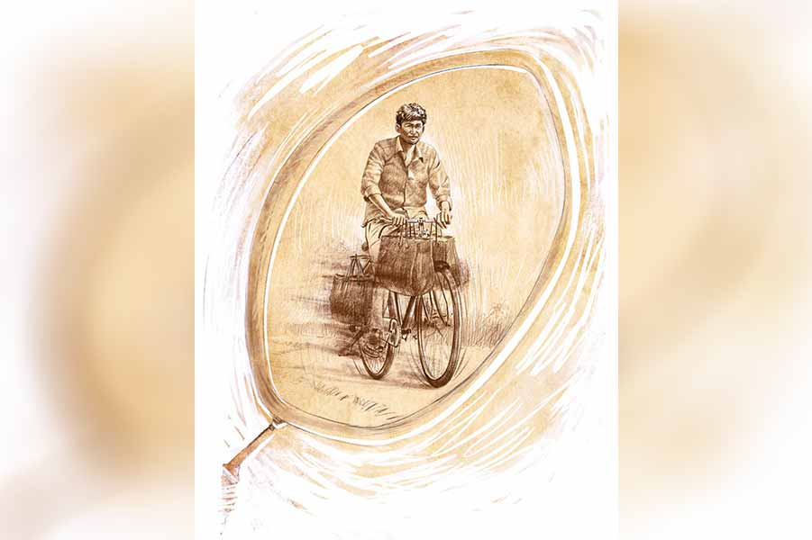

 
 <h1 align=center>আরোহী</h1>
<h2 align=center>অরিন্দম চট্টোপাধ্যায়</h2> আজকেও আসেনি?” বিরক্ত হিমাংশুবাবু। ক’টা মাত্র জিনিসের জন্য এই নিয়ে তিন দিন ঘোরাচ্ছে।

দোকানের ছেলেটার যদিও হেলদোল নেই। সে দাঁত বের করেই আছে, “ও মাস্টামশাই, অন্য কোম্পানির মাল নিয়ে যান না। ভাল, এক নম্বর জিনিস সব।”

“আরে রাখো তোমার এক নম্বর! তোমার আর কী! যে বেশি কমিশন দেবে, তার মাল বেচবে। শরীরে তো যাবে আমার। ‘আজ দেব’, ‘কাল দেব’ ছেড়ে, ঝেড়ে কাশো দিকিনি বাপু, আর কত দিন ঘোরাবে?”

মুদির পো কাউন্টারে ঝুঁকে আসে, “সেরেফ আপনার মাল আনতে দেরি করার জন্যে আগের ছেলেটাকে ছাইড়ে দিলুম। কাল থেন নতুন লোক রেকিচি। এখানকার নয়; বড় বেলু থেন আসে। এসপিরেস সার্ভিস।”

“তা সেই এক্সপ্রেস লেটে রান করছে কেন?”

“লেট না মাস্টামশাই! এবলা-ই দেওয়ার কথা। চার জায়গা ঘুরে আসছে, তাই একটু...” বলতে-বলতেই ছেলেটার চাউনি উজ্জ্বল, “ওই তো, এসে গ্যাছে! দু’মিনিট দাঁইড়ে যান। হাতে-হাতে দিয়ে দিচ্ছি।”

এক্সপ্রেস সার্ভিসটিকে দেখার জন্য হিমাংশুবাবু ঘাড় ঘোরান।

“মঙ্গলদা, খবর কী?”

কালো, মাঝারি হাইট, গাঁট্টাগোঁট্টা চেহারার লোকটা। সাইডে সিঁথি-কাটা তেল-চপচপে চুল, মোটা গোঁফ। চোখে যদিও মাইনাস পাওয়ার; দূরের জিনিস ঝাপসা দেখেন— তবু মুখটা বড় চেনা-চেনা ঠেকে হিমাংশুবাবুর।

সাইকেলটা স্ট্যান্ড দিয়ে লোকটা তত ক্ষণে দোকানের মুখটায় উঠে এসেছে। ধপ করে দু’হাতের ব্যাগ দুটো নামায়, “মঙ্গলদা, স্লিপটা বের করে ঝটাঝট মিলিয়ে নাও। আমার এখনও দুটো ডেলিভারি বাকি!”

কোথায় দেখেছেন... কোথায় দেখেছেন... ভনভন করছে অস্বস্তি। সেটা ঝেড়ে ফেলার জন্য হিমাংশুবাবু তাড়া দিলেন, “কই হে বাপু, আমার মালগুলো এ বারে গুছিয়ে দাও। রোদ্দুর তো ক্রমেই চড়ছে।”

এক্সপ্রেস-সার্ভিস ফুট কাটে, “রোদ্দুর মানে! যেন জুতো মারছে!”

কথাটা কানে যাওয়া-মাত্র বিস্মৃতির অন্ধকারে ফস করে কেউ যেন মোমবাতি জ্বেলে ধরে; ধোঁয়াটে চাউনি স্পষ্ট হয়— নরেন... হ্যাঁ, নরেনই তো! নরেন এখানে? এই কাজে? বিস্ময়ের অবধি থাকে না হিমাংশুবাবুর।

চোখ বড় বড় করে লোকটার দিকে ফিরে তাকান, “তুমি... তুমি কি নরেন? নরেন শাসমল?”

কালো মুখটা চকচকে হয়। ঠোঁট ফাঁক হয়ে বেরিয়ে আসে ঝকঝকে দু-সারি বড়-বড় দাঁত, “হেঁ হেঁ হেঁ! স্যর তা হলে চিনতে পেরেছেন!”

*****

নরেনকে ভুলে যাওয়াটা আশ্চর্যের বইকী! হ্যাঁ, সে দিনের সেই কালোকোলো, ল্যাংপেঙে কিশোরের সঙ্গে আজকের জ্বলাপোড়া প্রৌঢ়ের কোনও সাদৃশ্যই নেই প্রায়; শুধু ওই ঝকঝকে হাসিটা ছাড়া! আর ওই পেটেন্ট ডায়লগ, ‘যেন জুতো মারছে!’

যা কিছু ভাল, যা কিছু অসাধারণ— সবেতেই নরেনের ওই একটাই বিশেষণ ছিল: “উফফ, ঘুগনিটা কী দারুণ খেতে স্যর, যেন জুতো মারছে!” কিংবা “ওহ! স্যর, সোয়েটারটা কী গরম গো— যেন জুতো মারছে!”

কিন্তু যে ভাবে ওর সঙ্গে পরিচয়...

হিমাংশুবাবু তখন সদ্য স্কুল-মাস্টার হয়েছেন; বাড়ি থেকে বেশ দূরে বনমালীপুরে পোস্টিং। বিয়ে-থা হয়নি তখনও। ভাড়াবাড়িতে একা থাকেন। মাস্টারি করেন আর অবসরে পার্টির দাদাদের তদ্বির করেন, বাড়ির কাছাকাছি বদলির জন্য।

সে রকমই এক দিন— নতুন স্কুটারে স্কুলে যাচ্ছিলেন। মসৃণ পিচঢালা সড়ক। মিঠে রোদ। মেজাজ খুশ। ঢিমে-তেতালা চাল। হঠাৎ কোত্থেকে পাশে একটা সাইকেল, সিটে একটা কালোকোলো ছেলে। পিছন তুলে, প্যাডলের উপর গোটা শরীরের ভর দিয়ে প্রাণপণে ছোটাচ্ছে তার বাহন।

রেস দিচ্ছে ব্যাটা! চলন্ত স্কুটার থেকে ছেলেটা কে, ঠিক ঠাহর করতে না পারলেও, ইউনিফর্ম থেকে বুঝলেন, তাঁদেরই স্কুলের ছাত্র।

বেশ মজা তো! মুচকি হেসে সামান্য গতি বাড়ালেন হিমাংশুবাবু। কাঁটা কুড়ি ছুঁল। যন্ত্র এগিয়ে গেল অনায়াসে! বেশি ক্ষণের জন্য নয় যদিও। হাঁচোড়পাঁচোড় করতে-করতে সাইকেলওয়ালাও হাজির পাশাপাশি।

হুঁ হুঁ, ঠিক ধরেছেন! এর মাথায় এখন দৌড়ে জেতার নেশা চেপেছে। বেশ। স্পিড আরও একটু বাড়ানো যাক। এবারে পঁচিশ ছুঁই-ছুঁই।

আর বোধহয় পারল না ছেলেটা। পারে না কি! আত্মপ্রসাদের হাসিটা ঠিকঠাক ফোটার আগেই… ও মা! কী আশ্চর্য! প্যাংলা ছেলেটা ফের ধরে ফেলেছে তাকে।

হেলমেটের ফাঁকটুকু দিয়ে দেখছিলেন হিমাংশুবাবু। প্রাণপণে হ্যান্ডেল আঁকড়ে ধরেছে ছেলেটা। উল্টো দিকের বাতাস কাটানোর জন্য দুটো হাত জড়ো করে, রেখেছে হ্যান্ডেলের মাঝামাঝি, মাথা নিচু হয়ে প্রায় মিশে গেছে রডের সঙ্গে। টিঙটিঙে পা-দুটো এত জোরে ঘুরছে যে প্রায় দেখাই যাচ্ছে না।

আচ্ছা! এই ভাবে কত ক্ষণ? দশ সেকেন্ড, পনেরো সেকেন্ড বড়জোর!

স্পিডোমিটারের কাঁটা পঁচিশের ঘরে স্থির হয়ে রইল। এগোবেন না আর। দেখতে চান, এ ছোঁড়া কত ক্ষণ খাঁচার দম ধরে রাখতে পারে।

কত ক্ষণ! দশ-পনেরো সেকেন্ড না, প্রায় এক মিনিট মতো, ছেলেটা নাছোড়, অসম লড়াই চালিয়ে গেল। হিমাংশুবাবু অবাক! প্রায় নিখুঁত পশ্চার, অমানুষিক স্ট্যামিনা আর নাছোড় জেদ— এ যে পাঁকে পদ্মফুল! এ যে অবিশ্বাস্য!

তার থেকেও অবিশ্বাস্য নরেনকে ভুলে যাওয়া; হিমাংশুবাবু লজ্জা পান, “কী যে বলিস! তোকে ভুলে যাব? তা হ্যাঁ রে— তোর খবর কী?”

“এই তো স্যর...” ঝকঝকে দাঁত দেখা যায়, “দিন, আপনার ব্যাগটা সাইকেলের হ্যান্ডেলে নিয়ে নিই। হেঁটে এসছেন স্যর?”

*****

মনে-মনে খুশি হলেও হিমাংশুবাবু মুখে একটু ওজর করেন, “তোর আবার কাজের দেরি হয়ে যাবে না তো?”— আড়চোখে সাইকেলটা চেক করেন। কেরিয়ারের দু-দিকে দুটো-দুটো, চারটে বড় ব্যাগ, “তোর তো আবার এক্সপ্রেস সার্ভিস!”

“না, না। ও ঠিক মেকাপ দিয়ে দেব। কত দিন পরে দেখা হল, একটু আপনার সঙ্গে থাকি।”

নরেন সঙ্গে থাকতে চাইছে আর একটু। অথচ ওর দরকারের সময়টাতেই...

সামনেই ন্যাশনাল ছিল ছেলেটার। আর ঠিক সেই সময়েই, এত দিন ধরে ঝুলে থাকা বদলির অর্ডারটা এসে পৌঁছেছিল।

ছেলের সে কী আছাড়িপিছাড়ি, “ও স্যর গো, তুমি চলে যেউনি গো!”

চলে আসতে কি তিনিই চেয়েছিলেন? বিলক্ষণ জানতেন, প্রতিভা চিনে তুলে আনা দ্রোণাচার্য-কোচের দেশজোড়া খ্যাতির বদলে নিতান্তই ইস্কুলের গেমস্যর হয়েই থেকে যেতে হবে তাঁকে। নরেন শাসমলের মতো সুযোগ তাঁর জীবনে আর কখনও আসবে না।

নরেন শাসমল! খাজাবাবুর ন্যাশনাল রেকর্ড ভেঙে দেওয়া, সুপ্রভাত চক্রবর্তীর পরে বাংলার সবচেয়ে প্রতিভাবান রোড-সাইক্লিস্ট।

অবহেলায় পড়েছিল অন্ধকার খনির গর্ভে— মূল্যহীন পাথরের টুকরোর মতো। কে খুঁজে আনল তাকে? কে ঘষে-ঘষে তার গা থেকে তুলল যাবতীয় মরচে, মলচিহ্ন?

সকাল-সন্ধে ট্রেনিং করানো, নিজের পয়সায় তার ডায়েট মেনটেন করা, লোকাল ক্লাব টুর্নামেন্ট থেকে ধাপে-ধাপে জেলা, জ়োন, রাজ্য... কে করল এ সব? তিনিই তো। সেই তিনি যদি দেখেন, তাঁর হাড়ভাঙা বীজ-বপনের পরিশ্রমের পরে, ফসল ঘরে তোলার মাহেন্দ্রক্ষণেই সরে যেতে হচ্ছে তাঁকে— কষ্ট হবে না?

কিন্তু কী-ই বা করতেন তিনি? সংসার, দায়দায়িত্ব, কেরিয়ার— এ সবও তো তাঁকেই দেখতে হত। এ দিকে শুরু হয়েছে বসতবাটি তৈরির কাজ; পাত্রী দেখা চলছে পুরোদমে। নিজেকে প্রবোধ দিয়েছিলেন, ‘এ তো সাইক্লিং! ক্রিকেট, ফুটবল নয়, টেনিস-ব্যাডমিন্টনও নয়। খবরের কাগজের শেষ পাতায় ফুটনোটের কাছে জায়গা হয় কী হয় না। আই অ্যাম নট মিসিং মাচ!’

হয়তো তিনি বলতে পারতেন, ‘আর একটু থাকি।’

কত লোকই তো পঞ্চাশ-ষাট কিলোমিটার ডেলি-প্যাসেঞ্জারি করে। করে না? তিনিও না হয়...

বনমালীপুর থেকে চলে আসার পর আর বিশেষ যোগাযোগ ছিল না ওদের সঙ্গে। তার পর বিয়ে, মায়ের চলে যাওয়া, সন্তানাদি... জীবন জড়িয়ে রেখেছিল তাঁকে। নরেনের ব্যাপারে কানেও আসেনি তেমন কিছু। বিশেষ কিছু করলে নিশ্চয়ই...

মানে যেমনটি ভেবেছিলেন— হি হ্যাজ় নট মিসড মাচ!

তা হলে সেই ভেবে স্বস্তি পাচ্ছেন না কেন?

*****

হাঁটতে-হাঁটতে বাজার ছাড়িয়ে পুরনো পোস্টাপিস। সামনের চাতালে তাঁর বাহন রাখা। হিমাংশুবাবু স্কুটির চাবি ঘোরালেন, “তা, তুই কোন দিকে যাবি, নরেন?”

নরেন বলে, “ওই তো স্যর, দিল্লি রোড পেরিয়ে...”

মুখে দুষ্টু হাসি খেলে যায় তাঁর, “বেশ। তা হলে আর এক হাত হবে নাকি?”

চোখ কুঁচকে মাস্টারমশায়ের দিকে তাকায় নরেন। অস্বস্তিতে ঘাড় চুলকোয়, “এই গ্যাঞ্জামের মধ্যে আপনি জোরে চালাতে গেলে... ”

হাওয়ায় হাত নাড়েন হিমাংশুবাবু, “আরে দূর! তুই কী ভেবেছিস, আমি বুড়ো হয়ে গেছি? হ্যাঁ, তোর যদি আর দম না থাকে...”

ধকধক করে জ্বলে ওঠে নরেনের চোখের কালো মণিজোড়া, “তা হলে হয়ে যাক স্যর!”

বাজার চত্বর পেরিয়ে হেল্থ-সেন্টারের মাঠ। তার গা বেয়ে সোজা রাস্তা গেছে গাবতলি হয়ে গোপালপুরের দিকে। রাস্তা বেশ মসৃণ। এখন বেলার দিক, তাই ফাঁকাও মোটামুটি।

সেলফ-স্টার্টের সুইচ টিপে, নরেনের দিকে তাকালেন হিমাংশুবাবু। ডান-পা প্যাডেলে। বাঁ-পা মাটিতে। কেরিয়ারে চারটে ব্যাগ। নরেনের পিছুটান।

“ইয়ে... ব্যাগগুলোর কী করবি?”

“থাক না স্যর। ওতে আমার ওব্যেস আছে।”

“বেশ!”

অ্যাক্সিলারেটরের কান মোচড়ালেন হিমাংশুবাবু। প্যাডেলে চাপ দিল নরেন শাসমল।

মুহূর্তে ব্যবধান তৈরি হল। হবেই... বয়স হয়নি? পায়ের সেই জোর থাকে নাকি আর? তার উপর ওই ভারী বোঝা নিয়ে স্পিড বাড়ানো... অসম্ভব! গোঁয়ারের মতো জেদ করলেই তো হবে না।

রিয়ারভিউ মিররে দেখতে পাচ্ছেন ক্রমশ দূরে সরে যাচ্ছে নরেন। দূরে সরে যাচ্ছে আর অস্পষ্ট হয়ে যাচ্ছে। মনশ্চক্ষে দেখতে পাচ্ছেন, ওর দম ফুরিয়ে আসছে। পা-দুটো ভারী হচ্ছে ক্রমশ। কাঁধ-ঘাড়-কপাল বেয়ে ঘামের ফোঁটা পড়ছে সাইকেলের হ্যান্ডেলে। হাতের তালুতেও ঘাম... পিছলে যাচ্ছে হ্যান্ডেলের গ্রিপ। স্বপ্নের উড়ান বাস্তবের খাড়াই পাঁচিলে ধাক্কা খেয়ে গোঁ-গোঁ গোঙাচ্ছে।

আঃ! অসহ্য! স্কুটি থামালেন হিমাংশুবাবু। কয়েক সেকেন্ডের মধ্যেই নরেন পৌঁছল। ঘামে ভিজে সপসপ করছে জামাটা। ঘন শ্বাসের ফাঁক বুঝে ভাঙা-ভাঙা কথা ক'টা বেরিয়ে এল, “উফ স্যর... কত দিন পরে... যেন জুতো... মারছে...”

*****

স্কুটি স্ট্যান্ড দেওয়া পড়ে রইল রাস্তার মাঝখানেই। থাক। আলিঙ্গনাবদ্ধ নরেনের ঘাম লেগে যাচ্ছে তাঁর ধোপদুরস্ত জামাকাপড়ে। লাগুক। টাল সামলাতে না পেরে সে পড়ো-পড়ো হচ্ছে। হোক। আজ তো তিনি আছেন। ঠিক সামলে দেবেন। ঠিক দাঁড় করিয়ে দেবেন শক্ত পায়ে।

হিমাংশুবাবু বলেন, “নরেন, একটা কাজ আছে, করবি?”

বুড়ো আঙুলের ডগায় কপালের ঘামটুকু কাঁচিয়ে নেয় নরেন, “কিসের কাজ স্যর?”

“এ রকম ভারী খাটুনির কিছু নয়। এই আমাদের বুড়োবুড়িরই একটু খেয়াল রাখা— বাড়ির লোকের মতোই থাকবি। করবি, বাবা!”

নরেনের কপালে ভাঁজ পড়ে। মন দিয়ে ভাবছে সে। ও কি তাঁর কণ্ঠস্বরের ব্যগ্রতাটুকু ছুঁতে পারছে? ভাবছে, স্যরকে কি ফের বিশ্বাস করা যায়? আবার যদি...

আচমকা হাউহাউ করে ওঠেন হিমাংশুবাবু, “বড় ভুল হয়ে গেছে রে নরেন! বড় ভুল! ক্ষমা করে দে. বাবা, তোর খেলার স্যরকে! প্লিজ় একটা সুযোগ দে! দিবি না?”

নরেন অস্বস্তি বোধ করে, “এ কী স্যর! ক্ষমা চাইছেন কেন?”

হিমাংশু ওর কাঁধ দুটো চেপে ধরেন, “চাইব না? ক্ষমা চাওয়ারও যে মুখ নেই আমার, নরেন! শুধু আমার স্বার্থপরতার জন্য... না হলে কী হতে পারতিস তুই; আর আজ...  তোর সাইক্লিং... তোর রেসিং... ওরে, তুই যে খাজাবাবুর রেকর্ড ভেঙে দিয়েছিলি; তুই যে অলিম্পিক্সে যেতে পারতিস নরেন!”

ঝকঝকে দাঁতের পাটিতে অমলিন হাসি, “কিন্তু... আমার তো স্যর এই কাজটা ভাল লাগে!”

ভুরু কুঁচকে যায় হিমাংশুবাবুর। আলিঙ্গন আলগা হয়, “এই অর্ডার সাপ্লায়ের কাজ! এই কাজটা তোর ভাল লাগে?”

মাথা নামিয়ে নরেন বলে, “ইয়ে... আসলে... এতে তো রোজ অনেক ক্ষণ সাইকেল চালাতে পাই! আমার না স্যর, সাইকেল চালাতেই হেব্বি লাগে। জোরে, খুব জোরে... শনশন করে হাওয়া কেটে-কেটে যায় কানের পাশ দিয়ে... কী দারুণ! উফ! যেন জুতো মারছে!”

বুকের এক্কেবারে কাছ ঘেঁষে দাঁড়িয়ে আছে ছেলেটা। চোখ দুটি জলে ভরা, তবু হিমাংশুবাবু স্পষ্ট দেখতে পান তাঁর ছাত্রটিকে।

ঝকঝকে হাসিমুখ। দারিদ্রের মালিন্য নেই। অভাবের ক্লিষ্টতা নেই। কী হতে পারিনি, তা নিয়ে আক্ষেপ নেই। নরেন শাসমল রেস জিততে নয়, কাগজের শিরোনাম হতে নয়, পুরস্কার পেতে নয়— শুধু জোরে সাইকেল চালাতে ভালবাসে।

নিজের ছাত্রকে চিনতে বেশ দেরি হল তাঁর।