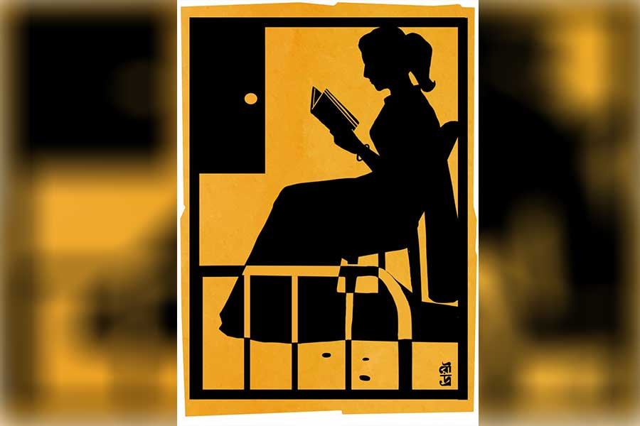

 
 <h1 align=center>আলোছায়াময়</h1>
<h2 align=center>বাসুদেব মালাকর</h2> বাবা, ঘুমিয়ে পড়েছ নাকি?”

“না, একটু তন্দ্রামতো এসেছিল... কিছু বলবি?”

“আমি একটু ছাদে যাচ্ছি।”

“এত রাতে ছাদে! হিম পড়ছে... মাথায় কিছু দিয়ে যাস।”

রাত প্রায় সাড়ে বারোটা। অম্বরবাবু অনুমান করতে পারেন, কিছু দিন ধরেই ছেলের ভিতরে একটা তোলপাড় চলছে। খুব স্বাভাবিক। মানুষের মন নদীর মতো, ঝোড়ো হাওয়ায় সেখানে তরঙ্গ উঠবেই। সায়নের মনেও সেই হাওয়ার ধাক্কা লেগেছে। ধাক্কাটা বেশ জোরালো।

সায়ন যে খুব এক্সট্রাঅর্ডিনারি, তা নয়। ভাল ভাবে কলেজের পড়া শেষ করে, অল্প কিছু দিন বেকার বসে থেকে একটা মাঝারি পদমর্যাদার সরকারি চাকরি জুটিয়ে নিয়েছে। বেকার ছেলে বছরের পর বছর ঘাড়ের উপরে বসে থাকলে মা-বাবার মনে যে হতাশা তৈরি হয়, অম্বরবাবুর সেই সময়কালটুকু তেমন দীর্ঘ হয়নি। সায়ন নিজের যোগ্যতায় তা থেকে বাবাকে মুক্ত করেছিল। শুধু একটাই দুঃখ, নন্দিতা ছেলের চাকরি পাওয়া দেখে যেতে পারেননি। হাই ব্লাডপ্রেশার ছিলই। নিয়মিত ওষুধ খেতে হত। রান্নার কাছে যাওয়া বারণ ছিল। কমলাই দু’বেলা সেটা সামলাত। ঠিকে কাজের আলাদা লোক ছিল। কিন্তু শেষরক্ষা হল না। হরেক বারব্রতে উপোস করা, নিয়ম করে রোজ প্রেশারের ওষুধ না-খাওয়া ছিলই। ধমক দিলেই বলতেন, “দূর! অত নিয়ম মেনে বাঁচা যায় নাকি! সানুর একটা চাকরি, তার পরে বিয়েটা হয়ে গেলে আমি মরলেই বা কী!”

অম্বরবাবু বলতেন, “আরে, সেই ক’টা দিন সুস্থ থাকতে গেলেও তো ডাক্তারের কথা মানতে হয়!”

নন্দিতা কান দিতেন না। এক দিন সেরিব্রাল অ্যাটাকে ঘুমের ভিতরেই নিঃশব্দে চলে গেলেন।

সায়ন যখন কলেজে পড়ত, নন্দিতা তখন প্রায়ই বলতেন, “সানু চাকরি পেলেই রিমির সঙ্গে ওর বিয়ে দেব।” রিমি, মানে রিমঝিম— নন্দিতার এক প্রিয় বান্ধবী মিলির মেয়ে। মুখশ্রী সুন্দর, স্লিম চেহারা, হাইটও সায়নের সঙ্গে মানানসই। ছোটবেলা থেকেই রিমি বাড়িতে এসেছে মায়ের সঙ্গে। তিন বছরের ছোট হলেও সায়নের সঙ্গে খুব ভাবও ছিল। কিন্তু অম্বরবাবুর সংশয় ছিল।

রিমিদের আর্থিক অবস্থা অম্বরবাবুর থেকে ভাল। তিনি বলেছিলেন, “এ বাড়িতে কি রিমি মানিয়ে নিতে পারবে? সায়নের যা আয়, তাতে লাক্সারি করা যাবে না, এটা তো বোঝো? রিমি বেশ সাজুনি... যদি খুব খরুচে টাইপের হয়!”

নন্দিতা ফুৎকারে উড়িয়ে দিয়ে বলতেন, “আমি মিলিকে ছোটবেলা থেকেই জানি। ওদের অবস্থাও খুব সাধারণ ছিল। মিলিও শ্বশুরবাড়ির টাকার গরম পছন্দ করে না। সাধারণ ঘরের মেয়ে বলে শ্বশুরবাড়িতে ও সারাটা জীবন কোণঠাসা! কেউ ওকে গুরুত্ব দেয় না। অহঙ্কারী বড়লোকের সংসারে একটা পাঁড় মাতাল অবাধ্য বর নিয়ে জীবন কাটিয়ে দিল!”

অম্বরবাবু জিজ্ঞেস করেছিলেন, “যতই হোক, তোমাদের ওই প্ল্যানে রিমির বাবা সায় দেবেন কেন? জামাই সম্পর্কে তাঁর উচ্চাশা থাকতে পারে।”

“স্বামী-স্ত্রীর মধ্যে তেমন মিলমিশ তো নেই! মনে হয়, তিনি খুব একটা বাবাগিরি ফলাবেন না।”

“তা হয় নাকি? মেয়ের ব্যাপারে সব বাবাই দারুণ পজ়েসিভ! যদি তোমাদের এই পুরনো বাংলা সিনেমার মাঝখানে তিনি কমল মিত্তির হয়ে বেঁকে বসেন, তো দুটো ছেলে-মেয়ের জীবনই বরবাদ হবে! বিয়েটা নিয়তি-নির্ধারিত লটারির টিকিট— লাগলে জ্যাকপট, না লাগলে বাজে কাগজ! ম্যাচিয়োর হলে ওদের দু’জনের পছন্দ বদলেও যেতে পারে, সে খেয়াল আছে? জীবনটা টিভি সিরিয়াল নয়!”

“তোমার যত অলক্ষুণে কথা! আমি টিক দিয়ে রেখেছি, ব্যস! আমি মানুষ চিনি।”

অম্বরবাবু আর কথা বাড়াননি।   

রিমি ও সায়ন যখন জেনে গেল যে, রিমি তার জন্য ‘কুটোবাঁধা’ হয়ে আছে, তখন থেকেই মেলামেশায় তেমন বাধা ছিল না। তবে সায়ন ওদের বাড়িতে যেত না। রিমিই এ বাড়িতে আসত। বাইরেই দেখা হত বেশি। সিনেমা-থিয়েটার, বইমেলা, বন্ধুদের সঙ্গে পিকনিক।

রাতে হোয়াটসঅ্যাপে অফুরন্ত চ্যাট হত। রিমি খুব কেয়ারিং ছিল। শাসন করত সায়নকে। বেশি আঁকুপাঁকু করলে বলত, “আরে বাবা, এত ছেলেমানুষি কেন করো! আমি কি পালিয়ে যাচ্ছি? সব সময়ই তো তোমার পাশে থাকি!”

নন্দিতা মারা যাওয়ার পরে সায়ন নিজের ঘর ছেড়ে রাতে শোবার জন্য অম্বরবাবুর ঘরে আলাদা চৌকি পেতে নিয়েছিল। রিমির সঙ্গে কথা শেষ হলে বাবার ঘরে এসে শুয়ে পড়ত। অম্বরবাবু বারণ করেছিলেন, “আমার সহজে ঘুম আসে না, তোর ঘুমের ডিস্টার্ব হবে। নিজের ঘরে শো।”

সায়ন বলেছিল, “কিচ্ছু ডিস্টার্ব হবে না! মা অজান্তে চলে গিয়েছিল— রাতবিরেতে তোমার যদি কোনও...”

অম্বরবাবু ঠাট্টা করেছিলেন, “তোর মুখে ফুলচন্দন পড়ুক!”   

সায়ন তখন একটা প্রোমোশন পেয়ে কৃষ্ণনগরে পোস্টেড। সারা দিন অফিসের পরে রাতেই রিমির সঙ্গে প্রাণ খুলে কথার সুযোগ। কিন্তু কিছু দিন ধরেই রিমি আর তেমন করে হোয়াটসঅ্যাপে আসছিল না! এলেও, দু’-তিন মিনিটের পরেই বলত, “খুব ঘুম পাচ্ছে— আজ রাখি!”

স্টেটাস হাইড করেও রাখতে পারে। কোনও দিন বা ব্যস্ততার কথা বলে। সায়নের লম্বা মেসেজের উত্তরে ‘হাঁ হুঁ হুমম’ লিখে পাঠাত। ফোন করলে বলত, “এখন একটু বাইরে আছি— পরে তোমাকে ফোন করব।”

সে ফোন আর আসত না!

এক রাতে রিমি লম্বা একটি মেসেজে লিখল, “তুমি আর আমার সঙ্গে যোগাযোগ রেখো না! আমার সমস্যা হচ্ছে। ফোন করলেও পাবে না— আজ-কালের ভিতরে সিম চেঞ্জ করব। হোয়াটসঅ্যাপ থেকে সব মেসেজগুলো ডিলিট করে দিয়ো।”

খুব কষ্ট হলেও সায়ন স্পষ্ট বুঝে নিতে পারল, নাটকে তৃতীয় চরিত্রের প্রবেশ ঘটেছে।

মায়ের কথা ভেবে খারাপ লাগছিল। তার সহজ-সরল বোকা মা একটা অলীক স্বপ্ন বুকে নিয়ে চলে গিয়েছে! আর সায়নও সেই স্বপ্নটাকে সত্যি ভেবে সোনালি সময়টা অপব্যয় করেছে। সে নিজেও কি কম বোকা! সেই কারণেই মনে ঝড়টা উঠেছিল। অম্বরবাবু সেটা জেনেছিলেন।

দুপুর প্রায় একটা। অম্বরবাবুর খাওয়া হয়ে গেলে কমলা থালা গুছিয়ে রোজকার মতো চলে যাবে। খাবার বেড়ে শোবার ঘরে ডাকতে গিয়ে দেখল, অম্বরবাবু বিছানায় কাত হয়ে আছেন। একটা হাত বাইরে ঝুলছে। মুখে মৃদু গোঁ-গোঁ শব্দ! কমলা ওঁকে সোজা করে শুইয়ে, উদ্‌ভ্রান্তের মতো পাশের বাড়িতে ছুটে গেল!

ঘণ্টা আড়াইয়ের পথ— খবর পেয়েই সায়ন চলে এসেছে। পাশের বাড়ির ওরা খবর দিয়েছিল। নার্সিংহোমের বেডের পাশে ‘বাবা’ ডাক শুনে অম্বরবাবু চোখ মেলে তাকিয়ে বললেন, “তুই এসেছিস! আমি এখন বেশ ভাল আছি। ওই, বুকে একটা ব্যথা হচ্ছিল, সব ঝাপসা হয়ে এসেছিল, কিচ্ছু শুনতে পাচ্ছিলাম না। রণজিৎ ওর বন্ধুদের নিয়ে এখানে ভর্তি করে দিয়েছে। ও কিছু নয়— ঠিক হয়ে যাবে। ওদের সঙ্গে দেখা হয়েছে?”

সায়ন বলল, “তুমি বেশি কথা বোলো না। আমি দেখছি।”

ডাক্তারবাবু বলেছেন, “হার্টে বেশ গোলমাল আছে। আরও কয়েকটা পরীক্ষা হবে। স্টেন্ট, পেসমেকার বসাতে হতে পারে। দিনকয়েক ভর্তি থাকতে হবে।”

সায়ন বলেছিল, “ডাক্তারবাবু, আমি বাড়িতে থাকার সময় রাতে বাবার কাছেই থাকতাম। এখানেও কি রাতে এক জন আয়া রাখা দরকার?”

উনি বললেন, “সিস্টাররা আছেন— তেমন বুঝলে আমরা তার ব্যবস্থাও করব।”

যা ভাবা গিয়েছিল, অবস্থা তার থেকেও খানিকটা জটিল। হৃদয়ে বেশ জট পাকিয়েছে! অপারেশনের পরে তিন-চার দিন এখানে থাকতে হবে। সায়ন অফিসে লম্বা ছুটির দরখাস্ত করে দিল।

অপারেশন ভাল ভাবেই হয়ে গেল। এক জন আয়া রাখা হয়েছে। বাইশ-তেইশ বছরের একটি মেয়ে। ফর্সা-ঘেঁষা শ্যামল গায়ের রং। আয়ত চোখ। হাসিখুশি। মুখটা খুব সুশ্রী। অম্বরবাবু যখন চুপচাপ শুয়ে থাকেন কিংবা ঘুমোন, মেয়েটি চেয়ারে বসে বই পড়ে। জেগে থাকলে ওর সঙ্গে গল্প করেন। এক দিন জিজ্ঞেস করলেন “কী বই পড়ছ?”

“দত্তা।”

“আহা! কত বার পড়েছি! সেই জায়গাটা— নরেন বিজয়াকে বলছে, ‘দাবির কথা যদি বলেন, এই বাড়ি-আসবাব-দাসদাসী মায় তাদের মালকিনটিকেও দাবি করতে পারি! দেবেন?’ চোখ ভিজে ওঠে, তাই না?”

“আপনি খুব নরম মনের। আমারও এমন হয়েছিল।”

“এক দিন ‘অপরাজিত’ থেকে সর্বজয়ার মৃত্যুর বর্ণনাটা পড়ে শুনিয়ো। ‘ঘর অন্ধকার... খাটের নীচে নেংটি ইঁদুর ঘুট ঘুট করিতেছে...’ বাড়িতে কে কে আছেন তোমার?”

“মা আর বোন। বাবা নেই। দু’বছর আগে মারা গিয়েছেন। একটা প্রাইভেট কোম্পানিতে ছোটখাটো চাকরি করতেন।”

“লেখাপড়া শেষ করেছিলে?”

“বি এসসি পাশ করেই নার্সিং কোর্সে ভর্তি হয়েছিলাম। হঠাৎ বাবা চলে গেল তো— মা আর খরচ টানতে পারেনি।”

“তোমাকে দেখলে ফ্লোরেন্স নাইটিঙ্গেলের কথা মনে পড়ে! কত খেয়াল রাখো আমার!”

“ওটা আমাদের ডিউটি।”

“না। আমার এক আত্মীয় নার্সিংহোমে ছিল অনেক দিন, তার অভিজ্ঞতা অন্য রকম!”

মেয়েটি একটু হাসল।

দীর্ঘ দুপুরের অবসরে মেয়েটি বই খুলে বসে। ভিজ়িটিং আওয়ার শুরুর একটু আগেই চুপচাপ কেবিন থেকে বেরিয়ে যায়। ওই সময় সায়ন আসে। আর দিন দু’য়েক পরেই অম্বরবাবুর ছুটি হয়ে যাবে। সে দিন হঠাৎ অম্বরবাবু বললেন, “এসো, আজ একটা সওয়াল-জবাবের খেলা খেলি! অচলা মহিমকে ছেড়ে চলে গিয়েছিল কেন, বলতে পারবে?”

“না।”

“কেন! ধনী সুরেশের পালিশ করা অ্যাপিয়ারেন্স, মন রাখা কথার জালে জড়িয়ে একটু-একটু করে অচলার মনের ভিতরে ঢুকে পড়া। অন্য দিকে, আর্থিক ভাবে দুর্বল মহিমের সাদামাটা সহজ বিবর্ণ জীবনদর্শন... সুরেশের উপর টান তৈরি হতেই পারে! সে-ও তো মানবী!”

“কিন্তু মন তো একটাই! তা কত টুকরো করা যায়? কেউ পারে?”

“অনেকেই পারে!”

“কী জানি! তাদের ভাল বুঝতে পারি না!”

“তুমি অচলা হলে কী করতে?”

মেয়েটি লাজুক হেসে বলল, “কী করে বলব! আমি তো অচলার মতো লেখাপড়া জানি না! তবে এক বার যদি কেউ আসে, তাকে সারা জীবনে ছাড়ব না!”

“বাইরে নরম-সরম, কিন্তু তুমি তো খুব শক্ত ধাতের মেয়ে দেখছি! তুমি কি সারা সপ্তাহ ডিউটি করো? ছুটি নাও না?”

“হ্যাঁ, শুক্রবারে অফ। তবে বেশি টাকার জন্য অনেক শুক্রবারও...”

“সুস্থ হয়ে এক দিন তোমাদের বাড়ি যাব। ঠিকানাটা দিয়ো কিন্তু। আপত্তি আছে?”

“কী যে বলেন! সে তো আমাদের সৌভাগ্য!” মেয়েটি লজ্জা পায়।

দিব্যি সুস্থ হয়ে অম্বরবাবু বাড়ি ফিরেছেন। অ্যাটেনডেন্টকে সরিয়ে মেয়েটি হুইলচেয়ার ঠেলে লিফটের দরজা অবধি নিয়ে এসেছিল। এক দিন পরে অম্বরবাবু সায়নকে বললেন, “এ বার অফিসে জয়েন কর। আমি দিব্যি আছি।”

“কমলাদি ছাড়াও দিন-রাতের জন্য আরও দু’জন লোক রেখে দিয়ে যাব। তাদের ঠিক করি আগে।”

“কী হবে অত লোক দিয়ে! তার থেকে এ বার একটা বিয়ে করে নে। ঘরে একটা মা আসুক আমার।”

“আর সেই মা যে তোমাকে হাতের তালুর উপর রাখবে, তার গ্যারান্টি আছে? তা ছাড়া আমি আর নতুন কোনও যন্ত্রণার ভিতরে যাব না। মা একটা বিষাক্ত গাড্ডায় ফেলে গিয়েছিল! বেঁচেছি। মেয়েদের চেনা হয়ে গেছে আমার!”

“একটা মেয়েকে দিয়ে পৃথিবীর সব মেয়ের বিচার হয় না।”

“হাঁড়ির একটা চাল টিপে— তোমরাই তো বলো!”

প্রায় মিলিয়ে-যাওয়া ক্ষতচিহ্নের উপর আর বেশি খোঁচানো ঠিক হবে না ভেবে অম্বরবাবু প্রতিবাদ করলেন না। শুধু বললেন, “শুক্রবারে আমার কাছ থেকে ঠিকানা নিয়ে এক বাড়িতে যাবি। বড় এক বাক্স মিষ্টি নিবি। গিয়ে ‘লিলি’ বলে ডাকলেই সাড়া পাবি। ভুলিস না।”

ছোট্ট শহরের উপকণ্ঠে ছোট একটা একতলা বাড়ি। সামনে একটু খোলা জমি। কয়েকটা নয়নতারা ফুলের গাছ। বিকেল নেমেছে। একটু ইতস্তত করে ‘লিলি’ বলে ডাকতেই যে বেরিয়ে এল, তাকে দেখে অবাক হয়ে গেল সায়ন। এ তো নার্সিংহোমের সেই আয়া মেয়েটি! লিলিও কম অবাক হল না! প্রতিদিনই সায়নকে দেখেছে সে। কিন্তু খুব সামনে যায়নি।

লিলি উদ্বিগ্ন কণ্ঠে বলল, “আপনি! উনি ভাল আছেন তো?”

“একদম ফিট আছেন। বাবাই এগুলো পাঠালেন...” বলে মিষ্টির প্যাকেটটি বাড়িয়ে ধরল। লিলি সেগুলো হাত বাড়িয়ে নিয়েও দাঁড়িয়ে রইল। সায়নের চোখে যত আলো ছিল, তা দিয়ে লিলিকে দেখছিল। বাবার মতো এক জন বিচক্ষণ মানুষ কেন তাকে এখানে পাঠাল, বুঝতে পারছিল না। শুধুই সৌজন্যবোধ? বিকেলের আলো এসে পড়েছে লিলির গালে। সায়ন যেন পলকহীন।

চোখ নামিয়ে মৃদু স্বরে মেয়েটি বলল, “ভিতরে আসুন।”

 সূর্য অস্ত যাচ্ছে—পশ্চিম দিকের আকাশে রঙের সমুদ্র। পথের দু’পাশে বনঝোপে অস্তরাগের ছোঁয়া। পাখিরা ঘরে ফিরছে। সায়নের হঠাৎ মনে এল, ‘পৃথিবীর সব ঘুঘু ডাকিতেছে হিজলের বনে/ পৃথিবীর সব রূপ লেগে আছে ঘাসে/... আকাশ ছড়ায়ে আছে শান্তি হয়ে আকাশে আকাশে!’ পৃথিবীতে যেন আর কোনও দুঃখ, বেদনা, ছলনা, প্রতারণা নেই! আকাশে প্রবালদ্বীপের মতো বহুরঙা মেঘপুঞ্জ মিলে মিলে নতুন দৃশ্য রচনা করছিল।

সূর্য ডুবতে তখনও একটু দেরি।