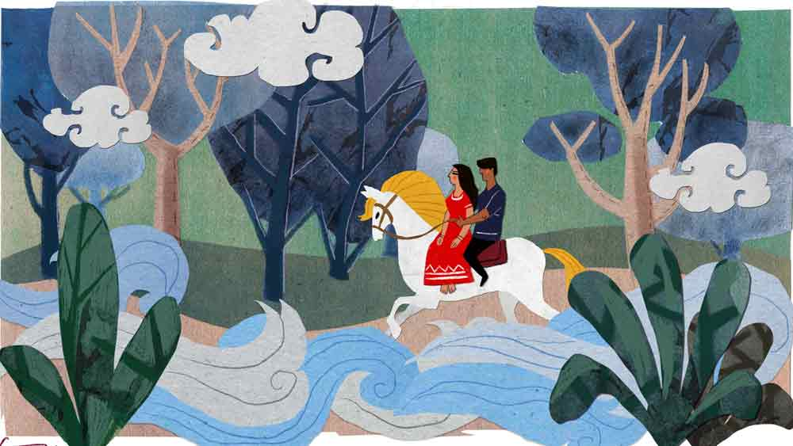

 

<h1 align=center>আলোমাখা দিন</h1>
<h2 align=center>সর্বাণী বন্দ্যোপাধ্যায়</h2>
ময়না তখন ঘোড়াটার পিঠে। পিছনে আবছা একটি পুরুষ শরীর। ঘোড়াটা তিরবেগে ছুটছে। হাওয়ার ঝাপট লাগছে গায়ে। কোথায় চলেছে ও? বড় বড় গাছ, সরে সরে যায়। অনেক নীচে লালচে কাঁকর বিছানো পথ। ঘোড়াটার একদম দুধসাদা রং। ঘাড়ের নরম কেশর ধরে ও প্রায় উড়েই চলেছে।   পেছনের মানুষটির দু’টি হাত দু’পাশে বেষ্টন করে লাগাম ধরেছে। আলগা স্পর্শের অনুভূতি। বুকের মধ্যে শিরশিরানি! তার পর মেঘ এসে ঢেকে দিল সব কিছু।   ঘোড়াটা এ বার মাটিতে নেমেছে, ওটাকে স্পষ্ট দেখতে পাচ্ছিল ও। মেটে রঙের পাঁচিলটার গা ঘেঁষে দাঁড়িয়েছে। ঝকঝকে সোনালি কেশর। পিঠের গদি টুকটুকে লাল। ঘোড়াটা গলা উঁচু করে দেখছিল এ দিক-ও দিক। যেন কেউ আসবে। মাঝে মাঝেই মাথা নিচু করে ঘাস খাচ্ছিল। হঠাৎ গলা দিয়ে চিঁ-হি-হি করে আওয়াজ তুলতেই ঘুম ভেঙে গেল ওর।   কম-পাওয়ারের বাল্‌বের নীল আলো জ্বলছে ঘরে। সেই আলোয় দেখল, মেসোমশাই উঠে বসেছেন মশারির ভেতরে। জল চাইছেন। বাথরুম যাবেন। ময়না উঠে পড়ল। স্বপ্নটা ভেঙে গেল। এই ঘোড়ার স্বপ্নটার মানে কী, ও জানে না। প্রায়ই দেখে স্বপ্নটা। ওদের বাড়ির পরেই সরু গলির মধ্যে হারুউকিলের বাড়ির নীচে এক জন ভাড়া থাকে। সে পয়সা নিয়ে হাত দেখে। তাকে এক বার দেখিয়েছিল হাতটা। সে মুচকি হেসেছিল হাত দেখতে দেখতে।   “হাসলেন কেন?”   “ঘোড়ার স্বপ্ন কবে দেখেন? পূর্ণিমা না অমাবস্যায়?”   উত্তর দিতে পারেনি ও। লোকটার চোখের চাহনিটা যেন কেমন। ভাল লাগেনি। তবে গরজ বড় বালাই। আবার এক বার যেতে হবে। ওই ঘোড়ার স্বপ্নের মানেটা জানতে হবে।   এই বাড়িটায় ও মাসখানেক হল কাজ নিয়েছে। রাতের ডিউটি। ও আসে রাত আটটায়, যায় সকাল সাতটায়। মেসোমশাইকে রাতে খাওয়ানো, টয়লেট করানো, সকালে বারান্দায় ঘোরানো, সব একার হাতে করে। রাতে মেসোমশাই ঘুমোলে তবে একটু শুতে পায়। মাটিতে বৌদির দেওয়া গদিতে নিজের আনা চাদর পেতে একটু শোয়। ঠিক তখনই মায়ের কথা মনে পড়ে। এখন ওর বয়স চব্বিশ। ঠিক দশ বছরে চলে গিয়েছিল মা। আর আসেনি।   ছোট থেকে বাবার সঙ্গে মায়ের ঝগড়া দেখতে দেখতেই বড় হয়েছে ও। মা বলত মাঝে মাঝে, “হ্যাঁ রে, আমি চলে গেলে বাবার সঙ্গে থাকতে পারবি তো?” কাণ্ডটা যে মা অত তাড়াতাড়ি ঘটিয়ে ফেলবে, ময়না ভাবেনি। এক দিন সকালে উঠে দেখেছিল, মা চলে গেছে।   প্রথমে বোঝা যায়নি। কারণ মা সকাল থেকেই কাজের জন্য বাইরে ঘোরাঘুরি করে। রাস্তার কল থেকে জল আনে। বাসন মাজে। অনেক ঘর ভাড়াটের সঙ্গে ওরা একই বাড়িতে থাকে। তাই পালা অনুযায়ী উঠোন ঝাঁট দেয়, বাথরুম ধোয়। কিন্তু মা রোজ রোজ চলে যাওয়ার কথা বলত বলেই ও ঘুম থেকে উঠে মায়ের ছাড়া চটি, দাঁতের মাজন, চিরুনি আছে কি না দেখত। সে দিন দেখেছিল সে-সব কিছুই নেই। গেল কোথায়? ওর ভয় সত্যি হল সে দিন। বাবা আগের রাতে চুল্লুর ঘোরে ঘুমিয়েছিল। তাই ভোরের সেই ফাঁকা বিদঘুটে ভাবটা ওকে একাই ভোগ করতে হয়েছিল।   মনে মনে ও জানত মা এক দিন চলে যাবে। তবু কষ্ট পেয়েছিল খুব। প্রতিদিন রাতে মায়ের ছেড়ে যাওয়া একটা শাড়ির খুঁট মুখে পুরে কাঁদত ও। তবে এখন আর সেই দুঃখকষ্ট বিশেষ মনে পড়ে না।   মা ওদের ছেড়ে চলে যাওয়ার পর ও খুব তাড়াতাড়ি বড় হয়ে যায়। ছ’মাসের মধ্যে বাবা জবামাকে বিয়ে করে নিয়ে এসেছিল। সে দিন অসময়ে ও একটু ঘুমিয়ে পড়েছিল,আর ঘোড়াটা এসে দাঁড়িয়েছিল সামনে। তবে ঘোড়াটার পা ছোড়ার শব্দ ঘুমের মধ্যে ক্রমশ বাড়তে থাকে। ঘুম ভেঙে যায়। ঠিক তখনই ও চিনতে পারে ওটা ঘোড়ার নয়, বাবার গলার আওয়াজ। বাবা বার ,বার দরজায় ধাক্কা দিতে দিতে ওকে ডাকছে।   “এই ময়না, ময়না! দরজা খোল। ওঠ, ময়না ও ময়না...”   ও তাড়াতাড়ি উঠে দরজা খুলে দেখে, দরজার সামনে দাঁড়িয়ে বেশ গোলগাল লাল শাড়ি পরা একটা বৌ। গলায় গাঁদাফুলের মালা, মাথায় ধ্যাবড়া করে সিঁদুর। ওর পাশ কাটিয়ে ঘরের মধ্যে ঢুকতে ঢুকতে বাবা বলে, “এই তোর নতুন মা। পেন্নাম কর।”   তার কিছু দিন বাদেই ও খাওয়া-পরার কাজ নিয়ে বাড়ি ছেড়ে চলে যায়। ও বাড়ি না গেলেও বাবা মাঝে মাঝে ওর কাছে চুল্লু কেনার টাকাপয়সা নিতে আসে।   যদিও মুখে বলে, “ময়না রে, ক’দিন হল বড্ড টানাটানি যাচ্ছে। তোর মা আমাকে তোর কাছে পাঠাল। বলল, উপযুক্ত মেয়ে থাকতে আমরা না খেয়ে মরব কেন? যা পারিস দে।”   আজকাল ময়নার একটা পরিবর্তন হয়েছে। যখনই একা থাকে স্বপ্নটা ওর মাথার মধ্যে ঘোরে। ময়না নিজে নিজেই স্বপ্নের কারণ খোঁজে।   এই ঘোড়ার স্বপ্নটা ও দেখে কেন? মাঝে মাঝেই ঘোড়ার স্বপ্ন। তা হলে কি ও কোথাও ঘোড়ায় চেপে কারও সঙ্গে চলে যাবে? ভাবতেই লজ্জা পায় আর ওর মুখ লাল হয়ে যায়।   বাবলু দাঁড়িয়ে ছিল দত্তদার বাড়ির ঠিক সামনে। দাঁড়িয়ে দাঁড়িয়ে ও বিড়িটায় শেষ টান দিল। আজ সকালেই দত্তদা ওকে ফোন করেছিলেন, “বাবলু, আমার বাবার অবস্থা ক্রমশ খারাপ হচ্ছে। এক বার আসতে পারবি?”   “হ্যাঁ যাচ্ছি।”   “দেখ না, এই করোনার সময় ডাক্তাররা বাড়িতে আসছে না। সঙ্গে কেউ এক জন না থাকলে, বাবাকে ডাক্তারখানায় নিয়ে যাব কী করে?”   বিড়িতে দু’টান মেরে ফেলে দিয়ে ও ভাবছিল, দত্তদা বেরোচ্ছেন না কেন? ওর দেরি হয়ে যাচ্ছে তো। সাড়ে চারটে বাজে। পাঁচটায় ওকে দোকান খুলতেই হবে।   আজ ফোনেই দত্তদা ওকে অনেকগুলো টাকা অফার করেছিলেন। কাজের আগেই আগাম টাকা! ও নেয়নি।   দত্তদা রাগ করেছিলেন, “টাকা নিবি না কেন? তোর সময় যাবে। ফুলের দোকান বন্ধ থাকবে তো।”   ও হেসেছিল, “দোকানের সঙ্গে কী? আমি তো নিজের ইচ্ছেয় আসি।”   এ ব্যাপারে ওর গুরু পাগলা ভোলা। ছোটবেলায় দেখেছে, যে যখন ডেকেছে ভোলাদা ছুটেছে। মুখে হাসি, কোমরে গামছা।   বাবলু এক বার জানতে চেয়েছিল, “এই যে ডাকলেই হাজির হও, কী পাও?”   ভোলাদা বলেছিল, “রসগোল্লা। এ কাজে নাম, টেস্ট মালুম হবে।”   ভোলাদা চলে যাওয়ার পর এ তল্লাটের মানুষেরা বড় আতান্তরে পড়েছিল। তখন বাবলু হাল ধরে।   একটু শক্ত কেস হলে ভোলাদা ডাকত ওকে। সে বার রাত তিনটেয় বাসন্তীবৌদির লেবার পেন উঠেছিল। ওকে ডেকে পাঠিয়েছিল ভোলাদা। কোনও গাড়ি পাওয়া যায় না। শেষে বটতলায় ভ্যানওলাদের তোষামোদ করে একটা ভ্যান জোগাড় করে, বৌদিকে শুইয়ে হাসপাতালে নিয়ে যায় ওরা। বৌদির বর সুব্রতদা সে জন্য মিষ্টি খাইয়েছিলেন ওদের। বলেছিলেন, “তোরা না থাকলে বাসন্তী, বাচ্চাটা মরে যেত।”   পাক্কা এক মাইল রাস্তা ভ্যান চালিয়েছিল ভোলাদা।   ভোলাদা চলে যাওয়ার পর সব ঝক্কিটা ওর ওপর পড়ল। এখন সবাই ওকেই ডাকে। কী আর করে? ফুলের গুমটি বন্ধ করে ও বেরিয়ে পড়ে।   কিন্তু আজ দত্তদার মতলবটা ওর ঠিক সুবিধের লাগছে না। সকালে কয়েকটা পাত্তি দেওয়ার কথা বললেন। আবার ডেকে পাঠিয়েছেন। ওঁর বাবার করোনা হল না কি?   বাড়িটা নিঝুম হয়ে আছে। আসলে বৌদি সকালেই ছেলেকে নিয়ে বাপের বাড়ি গেলেন। দাদা ওকে কয়েকটা ফোন নম্বর দিয়ে বুঝিয়ে দিচ্ছিলেন, মেসোমশাইয়ের শরীর খারাপ হলে ও কোথায় কোথায় ফোন করবে। ও অবাক!   “নম্বর দিচ্ছেন কেন? আপনি থাকতে আমি ফোন করব?”   “আমাকে অফিসের কাজে একটু বাইরে যেতে হবে। বাবলু বলে একটা ছেলেকে ফিট করেছি। ও এক দু’ঘণ্টা অন্তর খবর নেবে। তোমার কোনও অসুবিধে হবে না।”   দাদা বেরনোর একটু পরই এল ছেলেটা। বার বার ডোরবেল বাজাচ্ছিল। ও দরজা খোলার আগে জানলা ফাঁক করে দেখেছিল এক বার। বেশ লম্বা শক্তপোক্ত চেহারা। কিন্তু মুখটায় কেমন যেন উদাসী ভাব। মাস্ক নামিয়ে দেশলাইকাঠি দিয়ে দাঁত খুঁটছিল। তেমন ভয় পাওয়ার কিছু নেই বলেই মনে হয়। দরজাটা খুলে দিয়েছিল ও।   ছেলেটা ওকে দেখে একটু অবাক হয়েই বলল, “দত্তদা, দত্তদা নেই?”   “না। উনি তো একটু আগেই অফিসের কাজে বাইরে গেলেন।”   “ওঁর স্ত্রী?”   “তিনিও তো আজ সকালেই ছেলে নিয়ে বাপের বাড়ি গেছেন। আমাকে চব্বিশ ঘণ্টাই এখানে ডিউটি দেওয়ার কথা বলেছেন ওরা। অন্য কাজের লোকরাও আসবে।”   “মানে কী? এ দিকে আমাকে আসতে বলে...”   “আপনি বাবলু তো? উনি কিন্তু আপনার আসার কথা আমাকে 
বলে গেছেন।”   “দত্তদার বাবা কেমন আছেন বলুন তো?”   “একশোর ওপরে জ্বর। খুব দুর্বল। খাওয়ার একেবারে রুচি নেই। খাওয়াতে গেলেই ওয়াক তুলছেন। দু’-এক বার বমিও করেছেন।”   “দাঁড়ান, দাঁড়ান! আপনি কি কিছুই বোঝেননি? কদ্দিন এ কাজ করছেন? ওঁর বাবার করোনা হয়েছে নির্ঘাত! আপনার-আমার ঘাড়ে দায়িত্ব চাপিয়ে কেটে পড়েছে ব্যাটা। আসুক এক বার! বাছাধনকে বাপের বিয়ে দেখিয়ে ছাড়ব।”   “কিন্তু এ বার, এ বার কী হবে?” ময়না ঘাবড়ে যায়।   “কিচ্ছু হবে না। মুখে ডবল মাস্ক লাগিয়ে সামনে যাবেন। যা যা এত দিন করেছেন, সব করবেন। খালি বার বার হাত সাবান দিয়ে ধোবেন। হাত না ধুয়ে মুখে, নাকে আর চোখে হাত দেবেন না। আর এই নিন আমার নাম্বার। বেগতিক দেখলে, যত রাতই হোক আমায় ফোন করবেন। বুঝেছেন? আমি দেখছি। যত তাড়াতাড়ি সম্ভব বুড়োকে নার্সিংহোমে ঢোকাতে হবে। ব্যবস্থা করতে পারলেই নিয়ে যাব।”   ময়না হাঁ করে দেখছিল, ছেলেটা চলে যাচ্ছে। ও দরজাটা বন্ধ 
করে দেয়।   রাত দশটায় দাদার ফোন এল।   “বাবলু এসেছিল?”   “হ্যাঁ।”   “বাবার জ্বর বাড়লে ওকেই ডেকো। আমার সঙ্গে কথা হয়ে গেছে। ও খোঁজ করছে, সিট পেলেই বাবাকে নার্সিংহোমে ভর্তি করে দেবে।”   সারা রাত ঠায় জেগে রইল ময়না। ঘুম এল না। ঘরের জানলা দিয়ে আকাশের চাঁদ দেখছিল ও। গোল হলুদ চাঁদ! ময়না ভাবছিল, আজ মনে হয় পূর্ণিমা তিথি।   পরের দু’দিন খুবই ব্যস্ততায় কাটল। মেসোমশাইয়ের জ্বর বেড়েই চলেছে। ওষুধে কাজ দিচ্ছে না। শ্বাস নিতেও কষ্ট। বাবলু এল অ্যাম্বুল্যান্স নিয়ে। মেসোমশাইকে নার্সিংহোমে পাঠিয়ে নিজের মালপত্র গুছিয়ে নিল ও। এ ক’দিনের ধকলে শরীরটাও ঠিক নেই। দরজায় তালা দিয়ে বেরোবার সময় বাবলু এসেছিল আবার। মেসোমশাইয়ের আধার কার্ড নিয়ে যেতে ভুলে গেছিল।   ওকে বলল, “বাড়ি ফিরে যাচ্ছেন? কোথায় বাড়ি?”   “ধর্মপুর কলোনি,” উত্তর দিয়ে আর দাঁড়ায়নি ও। আসলে মনমেজাজ ভাল নেই। দু’বেলার ডিউটিই অফ হয়ে গেল। কে কবে ডাকবে, তার অপেক্ষায় বসে থাকতে হবে ক’দিন।   বাড়িতে ফিরে একটুও বিশ্রাম পেল না। চাল, ডাল বাড়ন্ত। ঘর পরিষ্কার, বাজার-দোকান, রান্নাবান্না সারতে সারতেই বিকেল গড়াল। রাতে ঘোড়াটার কথা ভাবতে ভাবতে কখন যে ঘুমিয়ে পড়েছে। ভোর রাতে কালো ধোঁয়ার স্বপ্ন দেখে ভয়ে ঘুম ভেঙে গেল। ধোঁয়াটা চার দিক থেকে ঘিরে ধরেছে ওকে, ও পালাবার পথ পাচ্ছে না। জেগে উঠে বুঝল, তার বেশ শীত করছে। গায়ে হাতে পায়ে যন্ত্রণা। মাথা ভার। চোখ জ্বালা করছে। তার বেশ ভাল রকম জ্বর এসেছে।   সকালে বাথরুমে যেতে গিয়ে টের পেল সারা গায়ে ব্যথা, শরীর দুর্বল লাগছে খুব। কোনও রকমে মুখ ধুয়ে শুয়ে পড়ল আবার। ঘুমের ঘোরেই টের পেল ফোনটা বাজছে, বেজেই চলেছে। দুপুরে কোনও রকমে উঠে কৌটো হাতড়ে দুটো মিয়োনো বিস্কুট দাঁতে কেটেছিল। ঢকঢক করে জল গিলে জ্বরের ট্যাবলেটটা গলা দিয়ে নামিয়েছিল।   সে দিন রাত থেকে কী ভাবে যে কেটেছে ময়নার! পাশের ঘরের কাউকে ডাকারও শক্তি ছিল না। তার পর, একটা ঘোরের মধ্যেই দেখেছে ওর ঘরের দরজা এক ধাক্কায় ভেঙে দিয়ে কারা যেন ঢুকে পড়ছে ওর ঘরে। তার পর আর কিছু মনে নেই।      সকালে চোখ খুলে ভারী অবাক হয়েছে ময়না। পুরনো মোবাইলটা ছাড়া সব নতুন। এত সাদা বিছানায় সে আগে কখনও শোয়নি। চার পাশে সাদা পোশাক পরা নার্সরা ঘোরাফেরা করছে। ডিশে সাজিয়ে কত কিছু খাওয়াচ্ছে। নতুন পোশাকে নিজেকে রাজকন্যা মনে হচ্ছিল ওর।   ফোন এল বাবলুর। খুশির গলায় বলল, “চোখ খুলেছেন? আর একটু হলেই টেঁসে যাচ্ছিলেন তো! দত্তদা তো বিপদ বুঝে পালাল! তার বুড়ো বাপকে বাঁচিয়েছি না? তার বদলে ব্যাটাকে চাপ দিয়ে আপনাকে বড় নার্সিংহোমে ভর্তি করতে পারলুম! রাখি এখন। দোকান খুলতে হবে।”   এখনও সে ঠিকমতো গন্ধ পাচ্ছে না, তবু নার্সের হাতে দেওয়া বাবলুর গোলাপের গন্ধ নেবে বলে মাস্ক খুলল ময়না। ও জানে না, সে দিন রাতে ঘোড়াটা আবার এসেছিল। দাঁড়িয়েছিল ওর ঘরের সামনে। তার পর সেই স্বপ্নের মানুষটি কোলে করে হালকা পালকের মতো ময়নাকে তুলে নিয়ে এসে ঘোড়ায় বসিয়ে উড়ান দিয়েছিল। হাওয়ার ঝাপট লেগে তার সোনালি কেশর বার বার সমুদ্রের ঢেউয়ের মতো ফুলে ফেঁপে উঠছিল। রাতের আকাশে সে দিনও ছিল বাঁকা চাঁদ। তার ঠান্ডা আলোয় মাখামাখি হয়ে গেছিল চার দিক।
