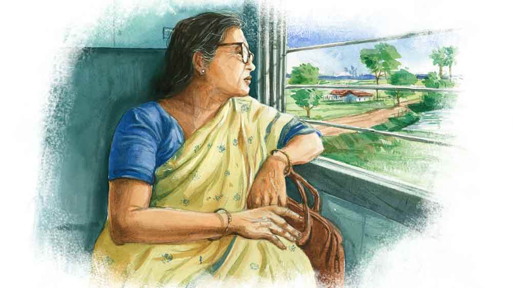

 

<h1 align=center>আলোয় ফেরা</h1>
<h2 align=center>সুস্মিতা নাথ</h2>
ব   াড়িতে সে দিন প্রচুর লোক। পুজো উপলক্ষে আসা আত্মীয়স্বজনে থিকথিক করছে। তখনও ফি-বছর গ্রামের বাড়িতে পারিবারিক পুজোটা হত। সম্ভবত দশমীর পরের দিনের ঘটনা। উঠোনের কাঁঠালতলায় শতরঞ্চি পেতে মেয়ে-বৌরা আড্ডা বসিয়েছিল। দুই বৌদি, দিদি, জেঠতুতো বড়দি বুলা, খুড়তুতো বোন সোমা, ছোটপিসি ও আরও অনেকে। একটু দূরেই ফাঁকা মণ্ডপে খেলছিল ছেলের দল। বালক থেকে কিশোর বয়সি সব। ওদের ছোটাছুটি হইচই থেকে থেকেই মা-জেঠিদের অন্তরঙ্গ রসালাপে বিঘ্ন ঘটাচ্ছিল। ফলে তাদের ধমকধামকও নিক্ষিপ্ত হচ্ছিল ছেলেদের দিকে। তবু কে শোনে কার কথা? ছেলেরা মত্ত দুষ্টুমিতে। এক বার বিরক্ত হয়ে ছোটপিসি চেঁচাল, “ওরে, তোরা কি একটু শান্ত হয়ে খেলতে পারিস না? পাগল করে ছাড়লি সবাইকে। মেয়েদের দেখে শেখ। দেখ তো, কী শান্ত আর বাধ্য ওরা!” বলেই যে দু’-চারটি মেয়ে মায়েদের আড্ডায় চুপটি করে বসে কথাবার্তা শুনছিল, ওদের দেখিয়েছিল।   কিন্তু ছেলেরা থোড়াই তোয়াক্কা করে। বকাঝকা খেয়েও আবারও মেতেছিল চেঁচামেচি-হইহুল্লোড়ে। সোনালি যেন এমনই একটা সুযোগের অপেক্ষায় ছিল। পুত্রসন্তানের জননী দুই বৌদি আর খুড়তুতো বোন সোমার প্রতি যে গোপন ঈর্ষা প্রতিনিয়ত লালন করত, সেটাই সে দিন বেরিয়ে এসেছিল মুখ দিয়ে। সুর টেনে বলে উঠেছিল, “যা-ই বলো ছোটপিসি, এই জন্যেই আমার মেয়ে পছন্দ। এ যুগেও অনেকে শুধু ছেলে ছেলে করে। আরে ছেলে-মেয়ের কোনও তফাত আছে? অশিক্ষিতের মতো পক্ষপাতিত্ব। আমার সুপ্তি যখন পেটে এল, তখন আমি ঠাকুরকে শুধু বলতাম, ঠাকুর আমাকে একটা মেয়েই দিয়ো। ঠাকুর কথা শুনেছে।”   ছেলের মায়েদের এক হাত নিতে পেরেছে ভেবে যখন সবে আত্মতুষ্টি আসছে, জেঠতুতো দিদির মেয়ে রূপসা বলে উঠেছিল, “এটাও কিন্তু পক্ষপাতই হল সোনামাসি। ছেলে আর মেয়েকে যদি সমানই ভাবো, তা হলে শুধু মেয়ে চাইবে কেন? ছেলে কেন নয়? বরং ভগবানের কাছে বলা উচিত ছিল, একটা সুস্থ সন্তান দাও।”   চোখ বড় করে তাকিয়েছিল সোনালি। বলে উঠেছিল, “বাপ রে! কী পাকা হয়েছিস! বড়দের মধ্যে কথা বলছিস? সোনামাসির ভুল ধরছিস! তুই আমাকে উচিত-অনুচিত শেখাবি?” তার পরেই জেঠতুতো দিদিকে বলেছিল, “এ মেয়েকে নিয়ে তোর মুশকিল আছে বুলাদি। এর তো এখনই পাখা গজিয়ে গেছে।”   কিন্তু এতে থামেনি মুখরা মেয়েটা। উল্টে খেপে গিয়ে বলেছিল, “এতে পাখা গজানোর কী দেখলে? তুমি বললে বলেই বললাম। তা ছাড়া আমি তো শুনেছি সুপ্তি হওয়ার আগে তোমার একটা টিউমার ধরা পড়েছিল। সুপ্তি হওয়ার সময় সেই টিউমার বাদ দিতে গিয়ে তোমার দ্বিতীয় বার মা হওয়ার সম্ভাবনাটাও চলে গিয়েছিল। অর্থাৎ ইচ্ছে থাকলেও তুমি আর ছেলে-সন্তানের মা হতে পারোনি। এর জন্যে নাকি তখন খুব কেঁদেছিলে তুমি। আর এখন বলছ কি না…”   শুনে মুহূর্তের জন্যে থম মেরে গিয়েছিল সোনালি। বাকিদের মধ্যেও পিনপতনের নিস্তব্ধতা। পরক্ষণেই রাগে অপমানে কাঁপতে কাঁপতে সভা ছেড়ে চলে গিয়েছিল। পেছন থেকে কানে এসেছিল, বুলাদি খুব বকাবকি করছে মেয়েকে। কিন্তু সে দিন ওটুকুতে সোনালির জ্বালা একটুও প্রশমিত হয়নি।   “মাসি, একটু চা খাও।”   আওয়াজ শুনে ভাবনার সুতোটা ছিঁড়ে গেল। মিলিয়ে গেল অতীতের দৃশ্যপট। ফিরে এল বর্তমান। ঘাড় ঘুরিয়ে দেখে, কাগজের কাপে চা এগিয়ে ধরে আছে মেয়েটা। কাঁপা কাঁপা হাতে কাপটা নেয় সোনালি।   মেয়েটা বলল, “সাবধানে ধরো সোনামাসি। দুটো বিস্কুট দিই?”   বাতাস কেটে ছুটছে ট্রেনটা। সাঁই সাঁই করে পিছনে সরে যাচ্ছে গাছগাছালি-মাঠ-জঙ্গল-শস্যখেত-জনপদ। কামরার ভিতরে ছড়িয়ে আছে শীতের নরম রোদ। একটু আগেই টোস্ট ও কলা দিয়ে ব্রেকফাস্ট সেরেছে দু’জনে। পেট ভরে আছে। মাথা নেড়ে তাই ‘না’ জানায় সোনালি। তার পর চায়ে চুমুক দিতে দিতে আবার আনমনা হয়ে ওঠে।   জানলার বাইরের দৃশ্যপটের মতো দ্রুত অতীতে চলে যাচ্ছে মন। বেশি নয়, মাত্র তিনটে বছর আগের কথা। বালিগঞ্জের প্রশস্ত ফ্ল্যাটটায় সে দিন খুব ভিড়। আকস্মিক ভাবেই চলে গিয়েছেন দুর্নিবার। সোনালির স্বামী। খবর পেয়ে ছুটে এসেছে স্বজনবান্ধবেরা। দিল্লি থেকে মেয়ে-জামাইও হাজির। দুর্নিবারের শোক ছাপিয়ে তখন আত্মীয়দের চিন্তা, এর পর একা একা এই ফ্ল্যাটে কী করে কাটবে বেতো ও হেঁপো রোগী সোনালির? সবাই ধরে নিয়েছিল, একমাত্র মেয়ে সুপ্তি নিজের সঙ্গে নিয়ে যাবে মাকে। নিজেও তেমনই ভেবেছিল সোনালি। মেয়ের সঙ্গে দিল্লিবাসী হওয়ার প্রস্তুতি নিয়েছিল মনে মনে। টাকাপয়সার চিন্তা নেই। দুর্নিবার যা রেখে গিয়েছেন, যথেষ্ট। এখন প্রয়োজন একটা অবলম্বনের। এই বয়সে সন্তান ছাড়া কে সেই আশ্রয় হতে পারে? কিন্তু সুপ্তি বা জামাই নিজে থেকে এক বারও তেমন কিছু না বলায়, ধন্দ জাগছিল মনে।   শ্রাদ্ধশান্তি মেটার পর আত্মীয়রা একে একে বিদায় নিল। থেকে গেল মেয়ে আর জামাই। ওরা দু’জনে চাকরি করলেও, এ বারে কিছুটা লম্বা ছুটি নিয়ে এসেছিল।   নিয়মভঙ্গের পরের দিন মেয়ে বলেছিল, “মা, আমাদেরও তো এ বার যেতে হবে। তুমি কি আমাদের সঙ্গে যেতে চাও? তবে চলো, দিন কয়েক ঘুরে আসবে দিল্লিতে।”   শুনে অবাক হয়ে তাকিয়েছিল মেয়ের দিকে। দিন কয়েকের জন্যে যেতে বলছে সুপ্তি! তাও এমন আলগোছে? তবে কি সুপ্তি নিজের কাছে মাকে রাখতে চায় না?   কিন্তু সোনালির বিস্ময়ের আরও বাকি ছিল। খাটের উপরে গুছিয়ে বসে মেয়ে বলেছিল, “মা দেখো, তোমার কথা ভেবেই বলছি, এই ফ্ল্যাটে তোমার একা থাকা ঠিক নয়। কখন কী বিপদ আপদ হয়... ”   এতটুকু শুনে আবার আশার আলো খেলে গিয়েছিল মনে। মেয়ে তবে ওকে একা ফেলে যাচ্ছে না! প্রত্যাশাভরা চোখে তাকিয়েছিল মেয়ের দিকে।   সুপ্তি তখন বলেছিল, “মা, আমরা ভেবেছি এ ফ্ল্যাটটা ভাড়া দিয়ে দেব। এমন জায়গায় এত বড় ফ্ল্যাটের ভাড়া প্রচুর হবে।”   দুর্নিবারের স্মৃতিভরা ফ্ল্যাটখানা ভাড়া দেওয়ার প্রস্তাবে মন খুঁতখুঁত করছিল সোনালির। কিন্তু মেয়ের কথারও যুক্তি আছে। মানুষ না থাকলে ঘর ফেলে রেখে লাভ নেই। নিমরাজি হয়ে বলেছিল, “আর ঘরের সব জিনিসপত্র?”   “ওগুলো নিয়ে ভেবো না। কিছু বিক্রি করে দেব। আর কিছু পাঠিয়ে দেব তোমার সঙ্গে।”   এ বারে আবার বিভ্রান্তি। ওকে কোথায় পাঠাতে চায় মেয়ে? কাঁপা কাঁপা স্বরে জিজ্ঞেস করেছিল, “আমি কোথায় থাকব?”   “আমরা ভেবেছি তোমাকে দাদুর গ্রামের বাড়িতে রেখে আসব।”   “গ্রামের বাড়ি!” মেয়ের কথা শুনে বাক্যহারা সোনালি। অবাক চোখে মেয়ের দিকে তাকিয়ে ছিল।   কিন্তু মেয়ে নির্বিকার। বলল, “হ্যাঁ, গ্রামের বাড়ি। ওই বাড়িতে তো তোমারও হক আছে মা। মামাদের বলব, তোমাকে তোমার পোরশন ছেড়ে দিতে।”   নিজের কানকে যেন বিশ্বাস হচ্ছিল না সোনালির। চরম বিস্ময়ে বলেছিল, “কী বলছিস রে সুপ্তি! এত দিন পর বাপের বাড়ির হক দাবি করব? এ হয়?”   “কেন হয় না?” বলে উঠেছিল মেয়ে, “বাবার সম্পত্তিতে ছেলে-মেয়েদের সমান অধিকার। মামারা তোমাকে তোমার ভাগ দিতে বাধ্য। না দিলে আইন-আদালত তো আছেই।”   সোনালি আঁতকে উঠেছিল মেয়ের কথা শুনে। এ সব কী বলছে সুপ্তি! আইন-আদালত-অধিকার এ সব প্রসঙ্গ আসছে কেন? যে কথা কখনও দুর্নিবার উচ্চারণ করেনি, সেটাই এখন মেয়ে বলছে! ভাবতেই পারছিল না সোনালি। সাধ্যমতো বিরোধ করেছিল। গ্রামের বাড়ি গিয়ে ও থাকতে চায় না, তা নয়। বরং মেয়ের মনোভাব দেখে মেয়ের সঙ্গে থাকার ইচ্ছেটার অপমৃত্যু ঘটে গিয়েছিল তখনই। বালিগঞ্জের ফ্ল্যাটেও সব সময় একা থাকা কঠিন। তার চেয়ে গ্রামের বাড়ি গেলে অন্তত আত্মীয়স্বজনদের মধ্যে থাকা যাবে। কিন্তু দাদাদের থেকে নির্লজ্জের মতো পৈতৃক সম্পত্তির ভাগ চাইতে সোনালির বাধছিল। বাবার মৃত্যুর পরে যে দাদারা সংসারের ঘানি কাঁধে নিয়ে বোনেদের লেখাপড়া করিয়েছে, নিজেদের জমানো পুঁজি খরচ করে বিয়ে দিয়েছে, তাদের থেকে বাড়ির ভাগ চাইবে কী করে?   কিন্তু মেয়ের সঙ্গে তর্কে পেরে ওঠেনি সোনালি। হার মেনেছিল।   এর পরেই গ্রামের বাড়িতে আসা। দাদারা খুশিমনেই কাছে টেনে নিয়েছিল। ছোড়দা নিজেই একখানা ঘর ছেড়ে দিয়েছে ওকে। ও বাড়িতে তখন কেবল বৃদ্ধ-বৃদ্ধাদেরই বাস। বাড়ির ছেলেমেয়েরা কর্মসূত্রে কিংবা বিয়ে হয়ে বাইরে। উৎসব-পার্বণে, কিংবা অসুখ-বিসুখের খবর পেয়ে তারা আসে। এখানেই সুখে-দুঃখে কেটে যাচ্ছিল দিন। কিন্তু এ বাড়িও খালি হতে শুরু করল। মাস ছয়েক আগে ছোড়দা-ছোটবৌদি কলকাতার নিউটাউনে ছেলের নতুন ফ্ল্যাটে চলে গেল। গত মাসের তেইশ তারিখ পৃথিবীর মায়া কাটাল বড়দা। শ্রাদ্ধকাজ সেরে বড়দার ছেলে বড়বৌদিকে সঙ্গে নিয়ে চলে গেল কর্মস্থল বেঙ্গালুরুতে। ফলে বাড়িটা একেবারে ফাঁকা হয়ে গিয়েছিল।   তখনই রূপসা বলেছিল, “সোনামাসি, তুমি একা এখানে থাকবে কী করে? তুমি বরং আমার সঙ্গে চলো। আমার বাড়িতে আমাদের সঙ্গে থাকবে।”   এই বলার মধ্যে এতটাই আন্তরিকতা ছিল যে, উপেক্ষা করতে পারেনি সোনালি। এই সেই রূপসা, এই সেই মুখরা মেয়েটা, যার বিরুদ্ধে তীব্র আক্রোশ মনে পুষে রেখেছিল এত দিন। বড়মামার মৃত্যু সংবাদ পেয়ে সুপ্তি না এলেও জেঠতুতো দিদির কর্তব্যপরায়ণ এই মেয়েটি ঠিক এসেছে। আর ফেরার সময়ে নেহাতই তুতো অসহায় মাসিটাকে সঙ্গে করে নিয়ে যাচ্ছে।   সোনালি ভাবে, হুজুগে তো চলে এল, রূপসার বর কিংবা শ্বশুরবাড়ির লোকেরা কিছু ভাববে না তো? মনের ভিতরে একটা সংশয় দানা বাঁধতে শুরু করেছে। ট্রেন যত এগোচ্ছে, সংশয়টা ততই আড়ে-বহরে বাড়ছে। কেবলই মনে হচ্ছে, সঙ্গে এসে ভুল করল না তো?   রূপসার বরকে দেখেনি সোনালি। শ্বশুরবাড়ির লোকজন কেমন, তাও জানে না। মনে পুষে রাখা পুরনো রাগ থেকেই রূপসার বিয়েতে আসেনি ও। তাও যদি রূপসার বিয়েটা নন্দনের সঙ্গেই হত, কিছুটা নিশ্চিন্ত থাকা যেত। নন্দনের মায়ের সঙ্গে ভাল বন্ধুত্ব ছিল সোনালির। এই বন্ধুত্বের সুযোগ নিয়েই তো… ভাবনাটা মাথায় আসতেই মনে মনে একেবারে সঙ্কুচিত হয়ে গেল সোনালি।   সবার সামনে সে দিন অপমানটা কিছুতেই মেনে নিতে পারেনি সোনালি। রাগে ক্ষোভে ফুঁসছিল। সর্বনাশী আক্রোশে অন্ধ হয়ে উঠেছিল। সে জন্যে যখন শুনল নন্দনের মতো সুন্দর ও বড় ঘরের ছেলের সঙ্গে রূপসার প্রেমের সম্পর্ক, মনে মনে প্রতিশোধের ছক কষে ফেলেছিল। খোঁজখবর করে জেনেছিল, নন্দনের মা ওরই কলেজের সহপাঠী ইভা। তেমন বন্ধুত্ব ছিল না আগে। কিন্তু এ বার নিজেই উদ্যোগ নিয়ে যোগাযোগ করল সোনালি। সুকৌশলে ঘনিষ্ঠতাও বাড়াল। তার পর শুভাকাঙ্ক্ষী সেজে ধীরে ধীরে রূপসার বিরুদ্ধে বিষ ঢালতে শুরু করেছিল ইভার কানে। রূপসা যে কত মুখরা, কতটা চরিত্রহীন, ছেলেদের মাথা চিবিয়ে খাওয়া তার অভ্যেস, ওকে নিজেদের পরিবারের মেয়ে বলে পরিচয় দিতে যে ওর কত লজ্জা হয় ইত্যাদি ধাপে ধাপে বুঝিয়েছিল ইভাকে। সব শুনে আতঙ্কিত ইভা সেই বিষ সঞ্চারিত করেছিল নিজের ছেলের মধ্যে। উদ্দেশ্য সফল হয়েছিল সোনালির। শেষ পর্যন্ত রূপসা ও নন্দনের সম্পর্কটা টেকেনি। এর পর দেখাশোনা করেই বিয়ে রূপসার। নিজে না এলেও সোনালি খবর পেয়েছিল, এই ছেলে নন্দনের মতো সুপুরুষ বা অর্থবান নয়। সব জেনে বিজয়ীর হাসি হেসেছিল ও। কিন্তু আজ এত দিন পরে সে সব মনে পড়ায় বড় গুটিয়ে যাচ্ছে সে।   পাশে বসা সহযাত্রী জানলার কাচ তুলে দিয়েছে। হু হু করে হাওয়া ঢুকছে ভিতরে। রূপসা জিজ্ঞেস করল, “মাসি, তোমাকে একটা চাদর জড়িয়ে দেব? ঠান্ডা লাগছে না তো?”   অবাক হয়ে তাকায় সোনালি। এত খেয়াল রাখছে মেয়েটা! নিজের পেটের সন্তানও তো এ ভাবে খোঁজ নেয় না! দীর্ঘশ্বাস চেপে আলতো হেসে রূপসাকে আশ্বস্ত করে, “না রে মা, একদম ঠিক আছি। তুই অত ব্যস্ত হোস না।”   “অসুবিধে হলে বোলো,” বলল রূপসা, “ট্রেন স্টেশনে ঢুকে পড়ছে। বাড়িতে গিয়ে আরাম কোরো।”   সোনালি অশেষ জড়তায় মনের সংশয়টা প্রকাশ করে ফেলল, “হ্যাঁ রে রূপসা, আমায় তো নিয়ে এলি, তোর বর বা শাশুড়ি রাগ করবেন না তো? তা হলে কিন্তু আমাকে আবার ও বাড়িতেই ফিরিয়ে দিয়ে আসিস।”   “ওফ মাসি! ওঁরা রাগ করবেন কেন?” হেসে ফেলল রূপসা, “প্রতুল খুব ভাল ছেলে। আমার শাশুড়িমাও বড় সহজ সরল। তোমাকে নিয়ে যাচ্ছি শুনে বললেন, “ভালই হল, আমার এক জন সঙ্গী হবে।”   ভরসা পায় সোনালি। এত দিনে বোঝে, সন্তান ছেলে বা মেয়ে নয়, সুসন্তান না কুসন্তান সেটাই বিবেচ্য।  সুপ্তির মতো শুধু অধিকারবোধে টনটনে হলেই হয় না, রূপসার মতো কর্তব্যবোধও থাকতে হয়।   ইতিমধ্যে ট্রেন এসে স্টেশনে থেমেছে। সোনালিকে নিয়ে লাগেজ-সহ প্লাটফর্মে নামল রূপসা। ঠিক তখনই ছুটে এল সাদামাটা চেহারার এক পুরুষ। রূপসার বর। এসেই সোনালির পা ছুঁয়ে প্রণাম করে উচ্ছ্বসিত ভঙ্গিতে বলল, “আপনি এসেছেন দেখে বড় আনন্দ হচ্ছে সোনামাসি। বাড়ি চলুন, মা-ও অপেক্ষা করছেন।”   সঙ্কোচ কাটাতে সোনালি বলে, “রূপসাটা জোর করে নিয়ে এল…”   “বেশ করেছে। আপনাদের মেয়ে একটু ঠোঁটকাটা ঠিকই, কিন্তু মনটা খাঁটি সোনা,” বলেই হাসল সে।   আবেগাপ্লুত চোখে রূপসার বরকে দেখে সোনালি। ভাবে, ঈশ্বর সত্যি করুণাময়। রূপসাকে এমন করে বুঝতে বা ভালবাসতে কানপাতলা নন্দনও কি পারত? ভাগ্যিস, সম্পর্কটা টেকেনি! রূপসার মতো ভাল মেয়ের জন্য প্রতুলের মতো এমন খাঁটি  মানুষই তো উপযুক্ত। ভিতরে জমে ওঠা সঙ্কোচ ও অপরাধবোধ ঝেড়ে ফেলে হৃদয়ের গভীর থেকে সোনালি বলল, “বেঁচে থাকো বাবা, খুব সুখে থাকো দু’জনে।”