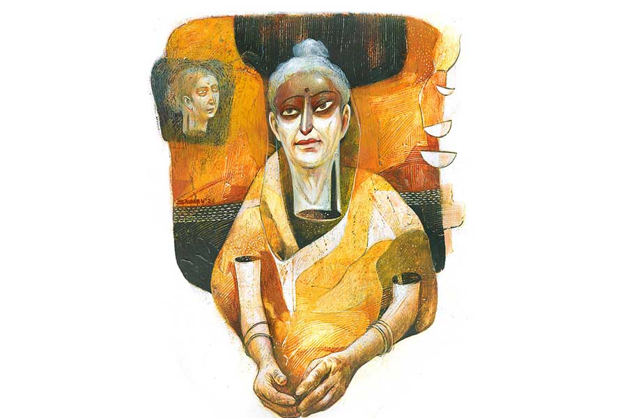

 
 <h1 align=center>আশালতার ভরা সংসার</h1>
<h2 align=center>মৌমিতা তারণ</h2> মাঝরাত্তিরে পাড়া-কাঁপানো চিলচিৎকারে ঘুম ভেঙে গেল কাবুলের। সেরেছে! সেজকাকিকে ঠাকুমার ভূতে ধরল নাকি! ঠাকুমার সঙ্গে সেজকাকির একদম বনিবনা ছিল না। সেজকাকে এক দিন সেজকাকি বলছিল, “তোমার মা মরেও আমায় রেহাই দেবে না!” ঠাকুমা কথাটা শুনে সোচ্চারে ঘোষণা করে, “ঠিকই, আমি মরলেও আমার ভূত তোমারে ছাড়ব না।”

সত্যিই কি তবে ঠাকুমার ভূত?

ও দিকে মেজকা চেঁচাচ্ছে, “কে? কে এমন মড়াকান্না কাঁদছে?”

মেজকাকি ধমক দেন, “আহ! মড়ার বাড়িতে লোকে মড়াকান্না কাঁদবে না তো চাপাকান্না কাঁদবে?”

ইতিমধ্যে সদর দরজায় বাড়ির সবাই এসে দাঁড়িয়েছে। প্রতি রাতে সদরে তালা লাগায় কাবুলের বড়দা টাবুল। দু’দিন ধরে নিরামিষ খেয়ে খেয়ে মুখে চড়া পড়ে গেছিল টাবুলের। সন্ধেবেলা একটু ইয়ারবন্ধুদের সঙ্গে বেরিয়েছিল। ভেবেছিল গেলাসেই আটকে থাকবে। কালাশৌচ বলে কথা। কিন্তু ভাঁড়ের কষা মাংস দেখে লোভ সামলাতে পারেনি।

গদাই বলেছিল, “খেয়ে নে, খেয়ে নে। বাইরে খেলে দোষ নেই।”

গদাইয়ের কথা মেনে সেই মাংস খেয়েছিল টাবুল। বাড়ি ফিরে রাতের ঘুমটা যখন গাঢ় হচ্ছে, তখনই সারা বাড়িতে চেঁচামেচি। নেশা চটকে গেল টাবুলের। ধড়মড়িয়ে উঠে বসল। ছোটকা সদরের চাবি চাইছে। দরজার ও-পার থেকে মিনুপিসির বিলাপ, “আমি মিনু। মায়-রে দ্যাখতে পাইলাম নাগো। কী পাপ করসিলাম...”

বাংলাদেশ থেকে মিনুপিসি এসেছে। চাবি নিয়ে টাবুল ছুটল সদরের দিকে। সারা বাড়িতে আলো জ্বলে উঠেছে। মিনুপিসির কান্নার তোড় কিছুটা কমে এখন তা অভিসম্পাতে পর্যবসিত, “আমার মায়রে য্যামন অইত্যাচার করসো বৌরা, হেইসব তোমরাও ফ্যারত পাইবা। তোমাগো পোলার বৌরা ফ্যারত দিব। হগ্গলরে একই শাস্তি পাইতে হইব...”

রাতদুপুরের এমন শাপশাপান্তে সবাই বিরক্ত। সেজকাকি ঘরে গিয়ে দোর দিয়েছে। বলেছে, আগামী কালই নতুন ফ্ল্যাটে চলে যাবে। নিকুচি করেছে এই রাবণের সংসারে থাকতে।

সেজকাকির বচন মিনুপিসির রাগে ঘৃতাহুতি দিয়েছে, “এত্ত বড় সাহস! আমার বাবারে তুমি রাবণ কও! জিব্বা টাইন্যা ছিড়া ফ্যালামু কইয়া দিলাম।”

অমনি ছোটকাকির ফুট, “আলাদা হওনের একটা অজুহাত পাইল।”

ছোটবৌকে পাশে পেয়ে মিনুপিসি আরও উচ্চকিত, “বিয়া হইয়া আইস্যা ইস্তক এই সংসার থিক্যা পলাইনোর মতলব তোমার। কত্ত অপমান করসো আমার মায়টারে! তোমার গুষ্টিসুদ্দা আইসা অপমান করসে। তোমার মা হাতে ঘড়ি দুলাইয়া আইত হগল সময়। কী বুঝাইতে চাইত আমার মায়রে, হ্যাঁ, কী বুঝাইতে চাইত? আমার বাবার ঘড়ি কিইন্যা দ্যাওনের ক্ষমতা নাই? আমার মা ঘড়ি দ্যাখতে জানে না?...”

*****

ঘোর অমাবস্যায় নিজের নব্বইতম জন্মদিনেই ইহলোক ত্যাগ করেছেন আশালতা মিত্র। রেখে গেছেন ভরা সংসার। ডাক্তার এসে জবাব দিতেই মিত্তিরবাড়ি লোকে লোকারণ্য। নাতিনাতনিরা শেষযাত্রার আয়োজন করেছে। বিশাল কাচের গাড়িতে নতুন শাড়ি, ফুলের মালায় সেজে আশালতা দেবী শ্মশানযাত্রা করলেন।

ভোররাতে শ্মশানঘাট থেকে ফিরে সবাই জানাল, যে চুল্লিতে আশালতা দেবীর অন্ত্যেষ্টি হয়েছে, সেখানেই শ্মশানকালী পুজো হবে। অনেক পুণ্যি করলে তবেই নাকি আশালতা দেবীর মতো এমন ভাবে পৃথিবী ত্যাগ করা যায়। এ কথা শুনে পিত্তিঠাকুমার চোখেমুখে ঈর্ষার ছায়া।

আশালতা দেবীর খুড়তুতো বোন প্রীতিলতা, ওরফে পিত্তি বরাবরই তার আশাদিদির প্রতি ঈর্ষাপরায়ণ। দিদির বরের সঙ্গে প্রথমে তারই সম্বন্ধ এসেছিল। কিন্তু ছেলের বাবার এগিয়ে দেওয়া কাগজে নাম লেখার সময় পিত্তিঠাকুমার কলম বিট্রে করে। নামটা ঠিকঠাকই লিখেছিলেন। পদবী ‘বসু’ লিখতে গিয়ে কেবল সেটা চেহারা পাল্টে ‘যম’ হয়ে যায়। ব আর স উপরের মাত্রায় ঠিকঠাক না জোড়ায় এবং শেষে ‘স’-এর নীচে ‘হ্রস্ব উ-কার’টা আবছা হয়ে যাওয়ায় এই বিপত্তি। যে মেয়ে নিজের পদবি ‘যম’ লেখে, তাকে ঘরের বৌ করতে ঘোর আপত্তি ছেলের বাবার। তখনই তিনি পিত্তিঠাকুমার জেঠতুতো দিদি আশালতার সঙ্গে ছেলের বিয়ে পাকা করলেন। পিত্তিঠাকুমার এ জন্য তেমন কিছু দুঃখ ছিল না। কিন্তু পিত্তিঠাকুমা অপমানিত হলেন অন্য কারণে।

আশাদিদিও নিজের নাম ঠিকঠাক লিখতে পারেনি। তবে ছেলের বাবার এগিয়ে দেওয়া লক্ষ্মীর পাঁচালি গড়গড় করে পড়েছিল। তাতেই ছেলের বাবা খুশি। এই ব্যাপারটাই পিত্তিঠাকুমার পিত্তি জ্বালিয়ে দিল। লক্ষ্মীর পাঁচালি তাকে পড়তে দিলে সেও তো না দেখেই পড়ে দিতে পারত। দিদিও কি পড়েছে নাকি? পাঁচালি মুখস্থ ছিল বলেই না অমন ঢং করে পড়ার ভান করল।

বহু বছর আগের সে সব অপমান ভুলেও গেছিলেন পিত্তিঠাকুমা। তাঁর কত্তাও মস্ত চাকুরে। বদলির চাকরি। বৌয়ের লেখাপড়া নিয়ে বাতিকগ্রস্ত নন। তবে শেষ বয়সে এসে পিত্তিঠাকুমারা এমন জায়গায় থিতু হলেন, ঘটনাচক্রে তা আশাদিদির বাড়ির কাছেই।

তত দিনে দিদির কত্তা গত হয়েছেন। নাতিপুতি নিয়ে ভরা সংসারে দিদি যেন রানি ভিক্টোরিয়া। সকলে তার কথায় ওঠে বসে। এই ওঠবোস বিষয়টা পিত্তিঠাকুমার মনে পুরনো ঈর্ষার জ্বলন খুঁচিয়ে তুলল। তাঁর নিজেরও ভরা সংসার। ছেলেপুলে, নাতিপুতি সকলেই প্রতিষ্ঠিত। কিন্তু সে সব যেন কেমন আলগা আলগা। আশাদিদির পরিবারের মতো নয়।

পিত্তিঠাকুমা জানেন তাঁরও আর বেশি দিন নেই এই ধরাধামে। কিন্তু যা পোড়াকপাল, চার চারটে ছেলেপুলে আর নাতিপুতিরা কেউই যে এমন মহাসমারোহে তাকে শেষযাত্রায় নিয়ে যাবে না, সে ব্যাপারে নিশ্চিত।

*****

গত পরশু দেওয়ালে টাঙানো আশালতা দেবীর পুরনো ছবিটা নিয়ে কাবুলের তিন পিসি গঙ্গায় গেছিল মায়ের কাজ করতে। কাজ শেষে গঙ্গার ঘাট থেকে মিনুপিসি ভাশুরের বাড়ি হয়ে সোজা বাংলাদেশ চলে গেছে। সঙ্গে নিয়ে গেছে মায়ের ছবিটা। বোনেদের বলে গেছে, “মায়রে লইয়া গ্যালাম। অসভ্য বৌগো লগে থাকলে মায় কষ্ট পাইব, মইরাও শান্তি পাইব না।”

মুশকিলে পড়েছে আশালতা দেবীর ছেলেরা। সারা বাড়িতে তারা মায়ের আর কোনও ছবি খুঁজে পায়নি। ও দিকে ঠাকুরমশাই বলেছেন ছবি ছাড়া শ্রাদ্ধের কাজ করা যাবে না।

এমন বিপদে আর্টিস্ট দিয়ে ছবি আঁকানোর বুদ্ধি দিয়েছেন পাড়ার গিরিজাবাবু। সেই মতো আজ আর্টিস্ট এসেছেন। সকলের মুখে চেহারার বর্ণনা শুনে তিনি আশালতা দেবীকে আঁকবেন। প্রথমেই ডাক পড়েছে বড় ছেলে বিমলবাবুর। পঁচাত্তরে পা রাখা বিমলবাবু স্বপ্নেও ভাবেননি মায়ের নাক-মুখের বর্ণনা দিতে হবে কোনও দিন। ছোট থেকে শুনে আসছেন, মায়ের যখন পনেরো বছর বয়স তখন তিনি জন্মেছেন। আজ আর্টিস্টের সামনে বসে মনে হচ্ছে দীর্ঘ এতগুলো বছরে তিনি এক বারও মায়ের চোখ, নাক আলাদা করে নজর করেননি। যদি করতেন তা হলে এখন গড়গড় করে সে সবের বিবরণ দিতে পারতেন। মায়ের আবছা চেহারা মনে পড়ছে। কিন্তু নাক, চোখ আলাদা করে মনে পড়ছে না।

বিমলবাবুকে সরিয়ে আর্টিস্ট এ বার মেজপুত্র অমলবাবুকে ডাকলেন। অমলবাবু মায়ের নাক ছাড়া আর কিছুই মনে করতে পারলেন না। একটা নাক এঁকে আর্টিস্ট বসে আছেন। ও দিকে সেজকত্তাকে আগেই সেজগিন্নি শাসিয়ে রেখেছেন, “খবরদার! তুমি একদম মায়ের চেহারা মনে করবে না। যে মা তোমার বৌকে বলেছে ভূত হয়ে ঘাড়ে চাপবে... ”

সেজকত্তা মাথা ধরার অছিলায় ঘরে শুয়ে আছেন।

ন’ছেলে নির্মল বেশ উৎসাহভরে বসেছিলেন আর্টিস্টের সামনে। একে একে মায়ের নাক, চোখ, মুখের বর্ণনা দিয়ে গেছেন চোখ বুজে। কিন্তু চোখ খুলেই ভ্যাবাচ্যাকা খেয়েছেন। নিজের মায়ের চেহারার বর্ণনা দিতে গিয়ে তিনি বৌয়ের মায়ের চেহারার বর্ণনা দিয়ে ফেলেছেন। আর্টিস্টের আঁকা ছবিতে স্বয়ং শাশুড়িমা তাকিয়ে আছেন তার দিকে। মুখে সেই কুচুটে হাসি, যা প্রতি বার শ্বশুরবাড়ি গেলে অন্য জামাইয়ের সুখ্যাতি করার সময় তিনি উপহার দেন। নির্মলকে অকর্মা প্রমাণ করাতেই তাঁর আনন্দ।

নির্মলের এই অপমান তার বৌ-ও বোঝে না। আজও যেমন বুঝল না। একঘর আত্মীয়-কুটুমের সামনে চিৎকার করে বলল, “এই ছিল তোমার মনে! আমার জলজ্যান্ত মাকে তুমি ছবি বানিয়ে ছাড়লে! আমার মাকে এ রকম কুচুটে দেখতে? জানি মায়ের মুখে অন্য জামাইয়ের প্রশংসা শুনলে তোমার হিংসে হয়। তোমার প্রশংসা মা কেন করবে বলতে পারো? এতগুলো বছরে কী দিয়েছ আমায়? চেয়েছিলাম একটা সোনার মানতাসা! পেরেছ গড়িয়ে দিতে? ছোটবোনকে যে ওর বর মানতাসার পর কামরাঙা কঙ্কণ, মকরমুখী বালা গড়িয়ে দিয়েছে সে খবর রাখো? নিষ্কর্মা কোথাকার! প্রতিশোধ তুলছ আমার মায়ের উপর! তোলাচ্ছি প্রতিশোধ...” একটানে আর্টিস্টের হাত থেকে ছবিটা নিয়ে ন’বৌ কুচিকুচি করে ছিঁড়ে ফেলল। মেজবৌ চিৎকার করে উঠল, “ও মা! পুরোটা ছিঁড়ে ফেললি! তোর মেজ ভাসুরের বর্ণনা দেওয়া নাকটা তো ঠিকঠাক ছিল ছবিতে। উনি কি আবার মায়ের নাক মনে করতে পারবেন?”

আর্টিস্ট ঘাবড়ে গেলেও নিজেকে স্থির রাখলেন। তাঁর সামনে এখন আশালতা দেবীর ছোট ছেলে কমল। আর্টিস্টের কথামতো কমল চোখ বন্ধ করল। মায়ের চোখ মনে করতে বলেছেন আর্টিস্ট। চোখ কেন, মায়ের পুরো মুখটাই এখন কমলের সামনে। তখন ক্লাস টেন। পাশের বাড়ির ছায়াকে নিয়ে সিনেমা হলে ‘ববি’ দেখতে গেছিল। সে খবর কানে যেতেই মা তেড়েফুঁড়ে এসে বিরাশি সিক্কার থাপ্পড় কষিয়েছিল। মায়ের সে দিনের মুখটা মনে পড়ছে। কমলের দেওয়া বর্ণনা শুনে আর্টিস্ট নিমেষের মধ্যে এঁকে ফেললেন আশালতা দেবীকে। কিন্তু সে ছবি সবাই বাতিল করল। এ রকম দাঁতমুখ খিঁচানো ছবি শ্রাদ্ধবাসরে শোভা পায় না।

পাঁচ দিন ধরে এ বাড়ির রকমসকম দেখে আনন্দ আর ধরে না পিত্তিঠাকুমার। এত দিন আশাদিদির সংসারের উপরের খোলসটাই দেখেছেন তিনি। কিন্তু খোলসের ভিতরের আসল কাহিনি আজ ফাঁস হয়ে গেছে। আগেই হাটে হাঁড়ি ভেঙে দিয়ে গেছে মিনু। আশাদিদি যে বৌমাদের দু’চক্ষের বিষ ছিল সবাই জেনেছে। তার উপর নাতিনাতনিরাও কতখানি ভালবাসত, সেও বোঝা গেছে। নইলে লক্ষ লক্ষ সেলফি-টেলফি, এর-তার ছবি তুললেও এক জনও কেউ কখনও ঠাকুমার কোনও ছবি তোলেনি! ছেলেগুলো তো মায়ের মুখই মনে করতে পারছে না।

তবে আনন্দের মাঝেও হঠাৎই যেন আশাদিদির জন্য একটু-একটু কষ্ট হচ্ছে পিত্তিঠাকুমার। ঠিক করলেন, তাঁর কাছে দিদির যে ছবিটা আছে, সেটাই এ বার এনে দেবেন এদের। 

আজ সেই ছবি এনে পিত্তিঠাকুমা সকলের সামনে রাখলেন। আবছা হয়ে যাওয়া সাদা-কালো সে ছবিতে ছোট ছোট দুটো শিশু পাশাপাশি বসে আছে। তার মধ্যে সামান্য বড়টিকে দেখিয়ে পিত্তিঠাকুমা বললেন, “এটা আশাদিদি, পাশের জন আমি।”

ছোটবেলার এই ছবি এক কথায় নাকচ করে দিলেন ঠাকুরমশাই।

অনন্যোপায় হয়ে কাবুলের মেজকা আর্টিস্টকে বললেন, “আপনি এই ছবি থেকেই মায়ের বড়বেলা এঁকে দিন।”

মুশকিলের কাজ হলেও আর্টিস্ট রাজি হলেন।

সারা বাড়িতে আজ উৎসবের মেজাজ। আশালতা মিত্রর শ্রাদ্ধকর্ম চলছে। পাঁচ ছেলে বসেছে কাজে। পাশে পাঁচ পুত্রবধূ। নাতি-নাতনিরাও জল দিয়ে যাচ্ছে। এক কোণে বসে আর্টিস্টের আঁকা ছবিটা দেখছেন পিত্তিঠাকুমা। ছবিতে কোথাও আশাদিদিকে খুঁজে পাওয়া যাচ্ছে না। অচেনা একটা ছবিকে সামনে রেখে সবাই মন্ত্র আউড়ে যাচ্ছে। এই অচেনা ছবিতেই নাকি কেউ তার মায়ের চোখ, কেউ তার ঠাকুমার নাক, কেউ তার শাশুড়ির কপাল খুঁজে পেয়েছে।

দিদির এই দশা দেখে মনটা আবার হু-হু করে ওঠে পিত্তিঠাকুমার। গতকাল সারা বাড়ি তন্নতন্ন করে খুঁজেছেন। নিজের একটাও ছবি খুঁজে পাননি পিত্তিঠাকুমা। তিনি চলে যাওয়ার পর এমনই কোনও অচেনা ছবিতে যে তারও আদ্যশ্রাদ্ধ হবে না, তা কে বলতে পারে। আর ভাবতে পারছেন না পিত্তিঠাকুমা। চোখ বুজলেন। আশাদিদির পুরো মুখটা এখন তার সামনে। বিড়বিড় করলেন তিনি, “ভাল থাকিস আশাদিদি। খুব শিগগির দেখা হইবো আমাগো।”