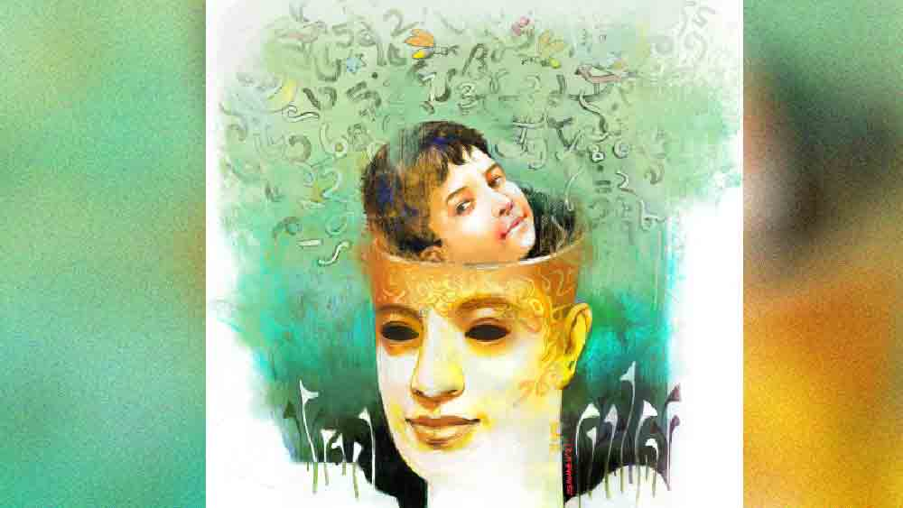

 

<h1 align=center>আয় নম্বর, আয়</h1>
<h2 align=center>অম্লানকুসুম চক্রবর্তী</h2>
বৌকে অপারেশন থিয়েটারে নিয়ে যাওয়ার মিনিট পঁয়ত্রিশ পরে দরজাটা যখন হাল্কা ফাঁক হয়েছিল, তখনই ভিতর থেকে কানে উপচে পড়েছিল একটা শিশুর চিৎকার। এক জন নার্স মুখ বাড়িয়ে বললেন, “চক্রবর্তীর বাড়ি থেকে কে আছেন?”   হুশ করে ভিতরে গলে গিয়ে যখন ছেলের মুখ দেখতে পাই প্রথম বার, তখনই আমার মনের মধ্যে পর পর অনেকগুলো কোলাজ আঁকা হয়ে গিয়েছিল। সদ্যোজাতর গোলাপি মুখটা দ্রুত ফেড আউট হয়ে স্পষ্ট হয়ে উঠল, ছেলে আমার সদ্য উঁকি মারা গোঁফ আর হাল্কা দাড়ি নিয়ে দাঁড়িয়ে রয়েছে খবরকাগজের প্রথম পাতায়। দেখলাম, রাজপথ ধরে লাইন দিয়ে রয়েছেন খবরের কাগজওয়ালারা। সাইকেলের সামনে রাখা নেটের বাস্কেটে গোছা গোছা কাগজ। ইংরিজি, বাংলা, হিন্দি— প্রতিটি কাগজের প্রথম পাতায় আমার ছেলের মুখ। হাতে ভি-চিহ্ন। মুখে যুদ্ধজয়ের হাসি। ‘এআইআর র‌্যাঙ্ক ওয়ান’ লেখাটা যেন পাতা ফাটিয়ে বাইরে বেরিয়ে আসতে চাইছে। পাশেই একটা কিউআর কোড। বলছে, ভিডিয়ো টেস্টিমোনিয়াল দেখতে চাইলে এক্ষুনি ক্লিক করো। নীচে মুক্তোর মতো হাতের লেখায় জ্বলজ্বল করছে, ‘ছোটবেলা থেকেই আমার বিজ্ঞানে যা ভিত ছিল, তাকে পোক্ত করে দিয়েছে এই ইনস্টিটিউটের ছ’বছরের ইনটেন্সিভ ট্রেনিং প্রোগ্রাম। শিক্ষক শিক্ষিকাদের ধন্যবাদ। জুনিয়রদের বলি, অঙ্ককে, নাম্বারকে ভালবাসো প্রাণ দিয়ে...’ ইত্যাদি ইত্যাদি। নীচে ছেলের নাম সই করা থাকবে— অগ্রণ্য চক্রবর্তী।   ঘণ্টাদুয়েক পরে বৌকে যখন বেডে দিল, আমার ডব্লুবিসিএস মেজকাকু ছেলের মুখ দেখেই বললেন, “একে কিন্তু আইএএস ছাড়া অন্য কিছু করানো চলবে না। প্রচুর পাওয়ার।”   মেজকাকুর আইটি পড়া মেয়ে কাঁধটা শ্রাগ করে বলল, “ড্যাম ইট। গ্রোথ পেতে পেতে জান কয়লা হয়ে যাবে। উল্টোপাল্টা জায়গায় পোস্টিং। ভাইয়া, তুমি কিন্তু আইটি-ই পড়াবে। অবভিয়াসলি ফ্রম আইআইটি। তার পরে যদি একটা আইআইএম কম্বিনেশন হয়ে যায়, তা হলে একেবারে জাস্ট ওয়াও কেস। ফালতু কলেজ থেকে বি টেক করেও আমার পাঁচটা দেশে অন সাইট হয়ে গেল ভাইয়া। বেটার কলেজ হলে কী হত, তুমি ভাবতে পারো?”   শ্বশুরমশাই বললেন, “কিছু মনে করবেন না, আমি কিন্তু এ ব্যাপারে একমত হতে পারলাম না। আইএএস থেকে আমার অনেক বেশি পছন্দ আইএসআই। শুনেছি ওখান থেকে বি স্ট্যাট পাস করতে পারলে রেজ়াল্ট আউটের দিনই আমেরিকার প্লেনের বোর্ডিং পাস দিয়ে দেয়।”   জেঠু বলল, “অনেক ক্ষণ ধরে শুনছি। তোমরা কেউ কিন্তু এক বারের জন্যও এমস-এর কথা বলছ না। এমস কোন দিক থেকে খারাপ?”   অপারেশনের পর বিধ্বস্ত বৌয়ের গলা দিয়ে এ বারে প্রথম আওয়াজ বেরোল। বলল, “আমি কিন্তু ঠিক করেই রেখেছিলাম, ছেলে হলে পড়বে বেঙ্গালুরুর আইআইএসসি-তে। মলয়কাকুর ছেলেকে দেখোনি? এক নম্বর অ্যান্টিভাইরাস কোম্পানির এশিয়া প্যাসিফিক ডিরেক্টর।”   ক্রমশ এর-ওর মধ্যে কথা কাটাকাটি হতে লাগল। হঠাৎ কোথা থেকে হাসপাতালের সিকিউরিটি উদয় হয়ে চিৎকার করে বলল, “প্লিজ় আপনারা সবাই বাইরে যান। এক্ষুনি। আই সে, এক্ষুনি। এটা হাসপাতাল। পাড়ার ক্লাব নয়।” গুটিগুটি বাইরে বেরিয়ে এলেও টপ ফ্লোরে হাসপাতালের কাফেতে বসে আলোচনা অনেক দূর গড়িয়েছিল মনে আছে।   আমি লাইফ ইনশিয়োরেন্স বেচি। মাইনে আর ইনসেন্টিভ— এই দুটো বুদ্বুদ মিলিয়ে যা রোজগার করি, তাতে তেমন বিলাসিতা করতে না পারলেও চলে যায় ঠিকঠাক। মধ্যমগ্রামে পৈতৃক ফ্ল্যাট থাকায় ইএমআইটাও নেই আপাতত। শ্রেয়সী আমার বৌ। ইংলিশ মিডিয়াম, স্টাইলিশ। কাজের বাজারে ছিপ ফেলে বসে আছে। বিয়ের সাড়ে তিন বছরের মাথায় যখন টেস্টিং কিটে ডবল দাগ দেখতে পেয়েছিল শ্রেয়সী, বলা যায় সে দিন থেকেই সন্তানের কেরিয়ার প্ল্যানিং শুরু করে দিয়েছিলাম আমরা। আমি আর শ্রেয়সী আগে রাত জেগে সিনেমা দেখতাম। এই ডবল দাগের পর থেকেই তা বদলে যায়। কোন স্কুলে দেব, স্কুলের পরে কী, কোন প্রফেশনে গেলে কত কামাতে পারবে এ নিয়ে আলোচনায় কী ভাবে ঘণ্টার পর ঘণ্টা পেরিয়ে যেত জানি না। পুরো কেরিয়ার প্ল্যানিংটা ছকে নিয়েছিলাম। তবে শ্রেয়সী যা-ই বলুক, শুধু শ্রেয়সী কেন, লোকে যে যা-ই বলুক, উপদেশ দিক, আমার বাচ্চা পুরোপুরি আমার ইচ্ছেমতো হবে— এটা পাথরে খোদাই করার মতো গেঁথে দিয়েছিলাম মনে। ফলে লোকের কথায় হুঁ-হাঁ করতাম বটে। কিন্তু সেগুলো মনে জমতে দিতাম না। কেন জানি না, আমি আর শ্রেয়সী— দু’জনেরই মনে হয়েছিল ছেলেই হবে। মেয়ে হলে আমার একটাই অপশন ছিল। সাইকোলজিস্ট। পড়াতে খরচা কম, কিন্তু বাজারে হেব্বি ডিম্যান্ড। কাউন্সেলিং করে যা রোজগার, তার চেয়ে ঢের বেশি কামাই টিভিতে মুখ দেখিয়ে। রেপ কেস হল, মনোবিদ কী বললেন? অবলা মাকে ছেলে খেতে দেয় না, মনোবিদের কাছে টিভি চ্যানেলের ফোন। ক্যানসারের কোনও পেশেন্ট হাসপাতালের ছাদ থেকে ঝাঁপ মেরেছে, টিভির সন্ধেবেলার তর্কের শো-তে এক পিস মনোবিদ মাস্ট। তবে মনে হয়েছিল মেয়ে হবে না। ছেলে হয়েছে, সুতরাং আমার আইআইটি-র জয়েন্টে অল ইন্ডিয়া প্রথম র‌্যাঙ্ক চাই। মেয়েরটা ঠিক না করে উঠতে পারলেও ছেলে হলে কী নাম হবে, তা দশ মাস আগে থেকেই ঠিক করে রেখেছিলাম। সুতরাং অগ্রণ্যর কাছে এক নম্বর হওয়া ছাড়া অন্য কোনও অপশন নেই আপাতত। আমি বেঁচে থাকতে এই ট্র্যাকের বাইরে গাড়ি যেতে দেব না। একটা টার্ম পলিসিও করে রেখেছি। কোনও কারণে ফুটে গেলে শ্রেয়সী কড়কড়ে ৭৫ লক্ষ টাকা পাবে। সুতরাং, পয়সাটা ফ্যাক্টর নয়। টাকার জন্য ছেলের পড়াশোনা আটকাবে না।   শ্রেয়সী যখন প্রেগন্যান্ট ছিল, নিয়মিত হরেক রকমের শাক নিয়ে আসতাম বাজার থেকে। বাচ্চার বুদ্ধির বিকাশ যেন ভাল হয়, সে জন্য যা যা করা দরকার, করেছি। ডেলিভারির পরে আমার কড়া নির্দেশ ছিল, কম করে এক বছর ব্রেস্টফিড করাতে হবে। মায়ের দুধ নাকি বাচ্চাদের বুদ্ধি আরও প্রখর করে তুলতে সাহায্য করে। শ্রেয়সী এক বারের জন্যও আপত্তি করেনি, কারণ এআইআর ওয়ান র‌্যাঙ্ক করাতে গেলে এটাও একটা ইনভেস্টমেন্ট। বলেছিল, “পরে আমায় ছ’মাসের জন্য জিমে ভর্তি করে দিয়ো প্লিজ়।” প্ল্যানমাফিকই এগোচ্ছিল সব। আড়াই বছরের মাথায় শহরের প্রিমিয়াম কোনও প্লে-স্কুলে দিয়ে দেব ঠিক করেছিলাম। সাড়ে তিন-চার থেকেই তো বড় স্কুল। ওখানে যা শিখবে তার পাশাপাশি ক্লাস সিক্স থেকে শুরু হয়ে যাবে ছ’বছরের ইনটেন্সিভ ট্রেনিং প্রোগ্রাম। দু’-তিনটে যে সর্বভারতীয় কোচিং সেন্টার হয়েছে, ওদের পাতাজোড়া অ্যাড বলে, যত আগে থেকে শুরু করা যাবে তত ভাল। জয়েন্ট ক্র্যাক করা মানে শুধু ইলেভেন-টুয়েল্ভ ভাল করে পড়া— এমন ভাবনার দিন চলে গিয়েছে। শ্রেয়সী কনসিভ করার পর থেকে এই কোচিং ইনস্টিটিউটের বিজ্ঞাপনগুলো দেখলেই আমি কেটে রাখি। স্টাডি করি। দেখি এআইআর ওয়ান তো বটেই, এক থেকে পঞ্চাশ জনের মধ্যে যত জন র‌্যাঙ্ক করেছে, তাদের বেশির ভাগই ক্লাস এইট থেকেই শুরু করে দিয়েছে টিউশন নেওয়া। মিশন জয়েন্ট। কোচিং সেন্টারগুলো বলছে, ক্লাস সিক্স থেকে শুরু করে দিতে পারলে দুনিয়ার কোনও শক্তি আর ঠেকাতে পারবে না। আমি সেটাই করব।   গন্ডগোলটা শুরু হল বাচ্চার তিন মাসের মাথা থেকে। নিউক্লিয়ার ফ্যামিলির নামে সুপারলাইক এমনি এমনি পড়ে না। এক দিন রাতে দেখি, বাবা টর্চ দিয়ে দেওয়ালের উপরে আলো ফেলছে আর বলছে, “বাবু ওই দেখো চাঁদমামা। চাঁদমামায় কে থাকে জানো? চরকা বুড়ি।” দেখি ছেলের চোখ চাঁদ বরাবর এ দিক-ও দিক করছে। বাবাকে একটু কড়া করেই বলতে হল, “দুনিয়াটা ফুল অব নাম্বার্স। ওর মাথার মধ্যে এ সব ফালতু জিনিস ঢুকিও না।” অনলাইনে গেলাম। জ়িরো থেকে নাইন লেখা ১০টা লেজ়ার টর্চ অর্ডার করলাম। বোতাম টিপলেই দেওয়ালে ফুটে উঠবে উজ্জ্বল রঙের নম্বর। যত ছোটবেলা থেকে নম্বরের সঙ্গে যোগাযোগ গড়ে উঠবে, তত মঙ্গল। ওরিয়েন্টেশনটা তত ভাল হবে। দু’-তিনটে টর্চ জ্বালিয়ে নম্বরের মালা দেওয়ালে এ দিক-ও দিক করে দেখি, অগ্রণ্যর কোনও উৎসাহ নেই। চোখই বন্ধ করে দিল। ও দিকে নর্মাল টর্চ জ্বালিয়ে ‘চাঁদমামা’ বললেই ড্যাবড্যাব করে তাকিয়ে দেওয়ালে আলো খোঁজে। এর মধ্যে শ্রেয়সী এক দিন কমপ্লেন করল, দুপুরবেলা কোনও দিন যদি বাচ্চাকে ওর ঠাকুমা, মানে আমার মা ঘুম পাড়ায়, তখন নাকি কী সব বই খুলে সমুদ্রের তলায় ঝিনুকের মধ্যে রাখা প্রাণভোমরার গল্প বলে। বুঝলাম, বুড়ো-বুড়ি মিলে রূপকথা, প্রকৃতিপ্রেম-সহ বিভিন্ন জাঙ্ক ইনস্টল করছে আমার ছেলের মাথায়। মায়ের বালিশের তলা থেকে ওই বইটা উদ্ধার করি এক দিন। লজঝড়ে বইটার পাতা উল্টে দেখি, আমার নাম লেখা। আরও লেখা, ‘জন্মদিনে অনেক আশীর্বাদ— মা ও বাবা।’ স্ক্র্যাপ। সে দিনই বইটাকে বিদায় করি গারবেজ ব্যাগে। এ সব আমার ছেলেকে পেয়ে বসলে সর্বনাশ। সাড়ে তিন বছরের কোনও একটা উইজ়ার্ড কিডকে ষোলো-র নামতা আওড়াতে দেখেছিলাম ইউটিউবের ভিডিয়োয়। এত কথা যখন বলে ফেললাম তখন এটাও বলি চুপিচুপি— অগ্রণ্যর এমন একটা চ্যানেল করার ইচ্ছেকে মনের মধ্যে তা দিয়ে যাচ্ছি বেশ কিছু দিন।   রক্তে কতটা অঙ্ক মিশিয়ে দিয়েছিল জানি না, তবে তমালের এক বছর আট মাসের ছেলেকে খাবারের প্লেটে একটা পড়ে থাকা চাউমিন দেখে বলতে শোনা গিয়েছিল, “ইন্তিগাল ইন্তিগাল।” এর মানে হল ইন্টিগ্রাল। অঙ্কের ইন্টিগ্রেশনের চিহ্ন আর কী। ক্যালকুলাস। তমাল আমার স্কুলজীবনের বন্ধু। নিউক্লিয়ার ফ্যামিলি। অগ্রণ্যর দু’বছরের জন্মদিনে অনেকের সঙ্গে তমালও আমন্ত্রিত ছিল আমাদের বাড়িতে, সপরিবারে। কী অদ্ভুত ভাবে ইন্টিগ্রাল সিম্বলটা রিলেট করতে পারল ওইটুকু একটা ছেলে! অনুষ্ঠান শেষে সবাই চলে যাওয়ার পরে সে দিন আমি অগ্রণ্যর গায়ে প্রথম বারের জন্য হাত তুলি। কানের পাশে একটা কম্পিটিটর বাচ্চার মুখে শোনা ‘ইন্টিগ্রাল’ কথাটা ফড়ফড় করছিল। এর মধ্যেই কতটা এগিয়ে আছে ও। যখন রঙিন কাগজ ছিঁড়ে গিফটগুলো বের করছিলাম, তখন অনেক ছড়া-ছবির বইয়ের সঙ্গে বেরিয়ে এসেছিল বেশ কয়েকটা নাম্বার বুকও। জন্মদিনের উপহার। অগ্রণ্যর হাতটা সবার আগে চলে গেল বাংলার ফালতু ছড়ার বইগুলোতে। পাতা উল্টে বলে, “গাছের ডালে বসেছে আউল।” আরও কয়েক পাতা এগিয়ে বলল, “বাঘমামা আর সিংহের হচ্ছে লড়াই।” একটু পরেই আবার বলে, “হাতি নাচি নাচি করচে, সোনামনির বে হচ্চে।” আমি ওগুলো এক ঝটকায় সরিয়ে দিয়ে নাম্বার্স-এর বইটা খুলে জিজ্ঞেস করি, “দুটো বলের পাশে এই দেখো আরো দুটো বল। তা হলে ক’টা বল হল বল তো?” বাচ্চা বলে, ‘বাঘমামা কেমন করে ডাকে? হালুম!” আমি আর ধৈর্য রাখতে পারিনি। সপাটে একটা চড় মারি অগ্রণ্যর গালে। একটু খারাপ লাগেনি তা নয়, কিন্তু শ্রেয়সী বলল, “একদম ঠিক করেছ।”   প্রবল কান্না শুনে দরজায় নক না করেই ঝটিতি ঘরে ঢুকে পড়ে মা-বাবা। বাচ্চাকে কোলে নিয়ে “কী হয়েছে সোনা, কী হয়েছে সোনা আমার?” বলতে শুরু করে। ন্যাকা! আমায় বলল, “লজ্জা করে না তোর? তুই মানুষ?” আমি উল্টে ওদের বলি, “এটিকেট-জ্ঞান বলে কিছু নেই? এ ভাবে তোমরা আমাদের ঘরে ঢুকলে কেন? মনে রেখো, বাচ্চাটা আমার।” ওরা কেমন একটা ভ্যাবাচ্যাকা খেয়ে নিঃশব্দে ঘর থেকে বেরিয়ে যায়। এক দাবড়ানিতে মিউট করে দিলাম পুরো।   অ্যাবাকাস কিনে এনেছিলাম। মানে ওই যে, অনেকগুলো তারের মধ্যে ছোট ছোট বল সেট করা থাকে। এ দিক-ও দিক করে নাম্বার সিস্টেম শেখানো যায়। সেগুলো দেখে অগ্রণ্য বলে, “কত ডিম। ডিম ফুটে পাখি হয়। পাখি ডাকে কু-উ-উ।”   আমি ওর ঘাড় ধরে বলি, “ক’টা বল আছে গোন। কুইক।”   বাচ্চা বলে, “পাখি ডাকে কু-উ-উ-উ।”   শ্রেয়সী বলল, “যথেষ্ট হয়েছে। এ বারে ওষুধ দাও।”   আমি ভাবি। তা হলে কি প্রসেসের দোষ? বড্ড সাবেকি ভাবে শেখানোর চেষ্টা করছি? তমালকে ফোন করি। একটু খেজুর করেই আসল কথাটা জেনে নিতে হবে। কেমন করে পড়ায় ও ছেলেকে? এক বছর আট মাসের মধ্যেই এমন প্রোগ্রেস কী করে? এ ধরনের ফোন করতে লজ্জাই লাগে। অবলিগেশন তো। দিনের শেষে ওর ছেলে আমার ছেলের কম্পিটিটর। প্রতিযোগী। এর কিছু দিন পরে যদি আমার থেকে বাচ্চার লেখাপড়া নিয়ে কোনও ফেভার চায় তমাল? যদি রেফারেন্স বই চায়, ক্লাস নোট চায়? মাথার মধ্যে শুধু এত কোলাজ আঁকা হয় কেন কে জানে! ফোন করলাম।   তমাল বলল, “আরে এ তো ইজ়ি। আমি তো ছেলেকে একদম ল্যাপটপের স্ক্রিন দেখে পড়াই। ওয়ার্ড ফাইল খুলি। ফন্ট সাইজ় বাড়িয়ে একেবারে ৪৮ করে দিই। কি বোর্ড টিপলেই সাদা স্ক্রিনে বিরাট অক্ষর ফুটে ওঠে। কিংবা নম্বর। ব্যাকস্পেস মারি। মিলিয়ে যায়। এতে ছেলে কী মজা পায় জানিস? নাম্বার্স তো বটেই, অন্তত পঞ্চাশটা সিম্বল চেনে ও। সব ওয়ার্ডে আছে। আই অ্যাম প্রাউড অব মাই লিটল ওয়ান্ডার।”   উত্তর পেয়ে গেছি। পরের দিন অনেক আগে অফিস থেকে বেরোলাম। সোজা ইলেকট্রনিক্সের ঝিনচ্যাক দোকান। আটান্ন হাজার খসল। ইনশিয়োরেন্স বেচার কাজ অফিসের ডেস্কটপেই সামলে নিতাম এত দিন। এআইআর ওয়ান হওয়াতে গেলে এগুলো লাগে। ইনভেস্টমেন্ট। শুধু ইন্টিগ্রাল কী রে, তোকে আজকে নম্বরের পাশাপাশি আলফা বিটা গামা পাই ডেল্টা সব গেলাব। বাড়িতে ফিরে, চোখেমুখে একটু জল দিয়েই বাবা-মায়ের ঘর থেকে টেনে হিঁচড়ে নিয়ে আসি অগ্রণ্যকে। কোলের মধ্যে জাপটে ধরি, গাড়ির সিটবেল্টের মতো। ল্যাপটপ খুলি। পাওয়ার বাটনটা টিপতেই বেরিয়ে এল উজ্জ্বল সাদা আলো। অগ্রণ্য বলতে লাগল, “ধুবতারা উঁকি দিচ্চে।” বলতে লাগল, “জোনাকিপোকা কেমন করে ডাকে?”   জানি, বাবা-মা পাশের ঘর থেকে কান খাড়া করে রয়েছে।   বেল্টগুলো দরজার পিছনে হ্যাঙারে ঝুলিয়ে রাখি। শখ করে সফট লেদার কিনেছিলাম। ওগুলোয় কাজ হবে না। হার্ড লেদারের বেল্ট চাই। আমার মতো শক্ত।