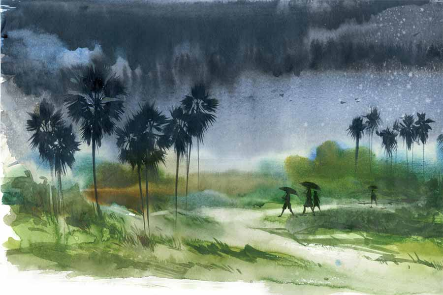

 
 <h1 align=center>আয় বৃষ্টি ঝেঁপে</h1>
<h2 align=center>বিনায়ক বন্দ্যোপাধ্যায়</h2> 

মেঘ দে, পানি দে

কোঁচড়ে মুড়ি নিয়ে আকাশের দিকে তাকিয়ে থাকা সেই মায়ের চোখ জুড়ে খেলা করে অসীম শূন্যতা। তাঁর তিন-তিনটে ছেলেই গত বছর বালেশ্বরের ভয়াবহ ট্রেন দুর্ঘটনায় প্রাণ হারিয়েছে। গোসাবা আর বাসন্তী থেকে অন্ধ্রপ্রদেশে যাচ্ছিল ওরা, ধান পুঁততে। প্রতিবার যে অন্ধ্রপ্রদেশেই যেত তা নয়। কখনও তামিলনাড়ুতে যেত, কখনও বা কেরলে। যে অঞ্চলে যে বছর আগে বৃষ্টি নামত।

আলেকজ়ান্ডার ফ্রেটার-এর সেই বিখ্যাত বই ‘চেজ়িং দ্য মনসুন’-এর কথা মনে পড়ে যাবে পাঠকের, যেখানে মৌসুমি বাতাসকে অনুসরণ করে এগিয়ে চলেছেন লেখক, কালিকট থেকে চেরাপুঞ্জি অবধি। এই দেশের অসংখ্য মানুষ ওই ফ্রেটার সাহেবের মতোই ‘বৃষ্টি’ নামক এক স্বপ্নকে সামনে রেখে ছুটে যায়, কারণ যেখানে বৃষ্টি, সেখানে কৃষিকাজ। সেই কাজ, মন না জানলেও, হাত ঠিকই শিখে নেয়। ওই বৃষ্টির খবর পেয়েই তাই অজস্র মায়ের অগণিত সন্তান ট্রেনে উঠতে শুরু করে শিয়ালদা কিংবা হাওড়া থেকে। কখনও তাদের গন্তব্য গুন্টুর, কখনও বা বেলগাঁও। যেখানে যায়, সেখানে ধান ফলিয়ে আসে বৃষ্টির কৃপা পেলেই। শ্রাবণের বিকেলে ফুটবল খেলার সময় কেউ কেউ বুঝতে পারে যে বৃষ্টি আর ফুটবল কথা বলছে, মিডফিল্ডার শুধু পা ছুঁইয়ে রয়েছে। কর্নাটক বা তামিলনাড়ুর মাটি কি টের পায়, বাঙালি আর বৃষ্টি কথা বলে নিজেদের মধ্যে ?

ধান, আদিগন্ত ধান কি তার পার্শ্বপ্রতিক্রিয়া, নাকি পরিণাম? সুভদ্রা মা তা জানেন না। কেবল জানেন যে দীর্ঘ, দগ্ধ দিন যতই বলুক না কেন, ‘যত দূরে চাই/ নাই শুধু নাই’, আসলে আছে। জন্মেরও আগে, ইচ্ছে হয়ে যে ছিল বুকের মাঝারে, মৃত্যুর পরেও সে ব্যথা হয়ে রয়েছে, পাঁজরের স্তরে স্তরে। আকাশে মেঘ গুরুগুরু করে উঠলেই, সেই ব্যথা বীজের মতো ছড়িয়ে পড়ে চরাচরের সর্বত্র। আর একটি করে ফোঁটা যখন পড়তে থাকে, উঠোনে এসে দাঁড়ানো শরীরের ঘাড়ে, কোমরে, গলায়, তখনও অস্তিত্বের প্রত্যেকটি বিন্দুতে রক্ত আর কান্না মিশে গিয়ে তৈরি হতে থাকে এক অদ্ভুত রসায়ন। মা সেই বৃষ্টির ভিতরেই আবিষ্কার করেন, উঠোনে ঘুরে বেড়ানো হাঁসগুলোর উচাটন।

গ্রামে-গ্রামে হাঁস-মুরগি পালন ইদানীং কথার কথা হয়ে দাঁড়িয়েছে। দশ-বারোটা মুরগি নিয়ে এসে বাড়ির এক ধারে খোপ বানিয়ে রাখাই দস্তুর। এই পরিবর্তনের মূল কারণ হাঁস পালতে গেলে জল লাগে আর গ্রামে-গ্রামে জলেরই আকাল এখন। সেই আকালের আগুনে ঘৃতাহুতি দিয়ে পুকুরগুলি বুজে যাচ্ছে কচুরিপানায়। কচুরিপানার উৎপাত তো আগেও ছিল, এখন এত প্রকট হল কী করে? গাঁওবুড়া কিংবা গাঁওবুড়িদের জিজ্ঞেস করলে জানা যায়, যে জলাশয় মানুষের শরীরের স্পর্শ পায়, তাকে অত সহজে গ্রাস করতে পারে না কচুরিপানা। কিন্তু এখন গাঁয়েও একটু পয়সা হলেই বাড়িতে সাবমার্সিবল পাম্প বসিয়ে কলঘরে শাওয়ার খুলে দাঁড়ানোর নেশা বেড়েছে।

“ওরে, চাষের জল পাবি না, শ্যালো পাম্প অনেক ডিপে গিয়েও দু’বালতি জল তুলতে পারবে না...” বললে জবাব মিলছে, “শহরের লোকেরা যদি করতে পারে, আমরা করলে দোষ কিসের?”

দোষ আর কিছুরই নয়, কপালের। কিংবা সময়ের। নয়তো গ্রামের মেয়েদের দল বেঁধে পুকুরে স্নান করতে যাওয়া, দুপুর গড়িয়ে গেলেও জলে হাত-পা ছোড়া, এক রকম বন্ধ হয়ে গেল কেন? কেন আবার! মেয়েরা স্নান করতে নামলেই গাছের উপরে উঠে কিংবা ঝোপের আড়াল থেকে কেউ না কেউ মোবাইলে ভিডিয়ো তুলে নেবে না? পেগাসাস এখন দরিদ্রতম যাপনের জানলাতেও উঁকি মারতে শিখে গিয়েছে। নিষ্কৃতি কেবল প্রবল বৃষ্টিতে। কারণ বৃষ্টির তোড়ের মধ্যে ক্যামেরাও চলবে না, মোবাইলও নয়। আলো যেমন একই সঙ্গে তরঙ্গ আর কণা, জীবনও তো একই সঙ্গে একটা আড়াল আর মুক্তি। বৃষ্টি ছাড়া কে দিতে পারে সেই যুগলবন্দি?

সুভদ্রার গোচরে নেই এই প্রশ্নের উত্তর। তিনি কেবল বর্ষার ফলার মতো গায়ে এসে বেঁধা বৃষ্টির বিন্দুগুলোকে নিজের নিঃশ্বাসে টেনে নিতে নিতে স্বপ্ন দেখেন, আয়লার পর ঘন বিপর্যয়ে ছেয়ে যাওয়া জমি-জিরেত একটু একটু করে আবারও বেরোবে লবণের করাল গ্রাস থেকে। পরিত্যক্ত কিংবা ভেড়ি হয়ে যাওয়া খেতগুলো ফের এক বার আবাদি জমিতে বদলাবে। তাঁর ছেলেদের মতো সা-জোয়ান সব বেটারা, বেটিদের সঙ্গে নিয়েই ধান পুঁতবে, বাদায়; ধান পুঁতবে লাট অঞ্চলে। কালো মাটি, লাল মাটি, বেলে মাটি, সব মাটি খিলখিলিয়ে হেসে উঠবে অফুরন্ত আমন আর বোরোয়। ভাতের মিষ্টি গন্ধে ভরে উঠবে বাতাস। সকাল-দুপুর-রাতে, পাত পেড়ে বসার জন্য কাউকে আর এক্সপ্রেস ট্রেন ধরে দেড় দিনের রাস্তা পাড়ি দিতে হবে না। বৃষ্টির অনর্গল উচ্চারণে ধুয়ে যাবে মাটির বুকে পুঞ্জীভূত সব পাপ। ভাবতে ভাবতেই বৃষ্টিসিক্ত হতে থাকেন মা, মায়েরা।

সেই সময়ই এক দঙ্গল হাঁস প্যাঁকপ্যাঁক করতে করতে নেমে যায় পুকুরে, জলের গায়ে জল লেগে এক অনির্বচনীয় সিম্ফনি তৈরি করে। শুধু মাটিই বৃষ্টিকে টানে তা নয়, বৃষ্টিও মাটিকে টানতে থাকে। তাই বৃষ্টি শেষ হলে মাটির বুকে যে সোঁদা গন্ধ তা বৃষ্টির নাকি মাটির, বোঝা যায় না।

অবশ্য যা অনুভবের তা বুঝতে হবেই বা কেন? গ্রামের নাড়ু চক্কোত্তির যেমন যজমানি করার পাশাপাশি ফুল চাষ করার নেশা। কিন্তু সেই ফুল, যা দেবতার পায়ে দেওয়া হয় না সচরাচর। জিজ্ঞেস করলে উত্তর দেয়, “সবটাই ভগবান খেয়ে যাবে নাকি? মানুষের জন্য, মানুষের বোনা কিছু থাকবে না?” বলে, কিন্তু মনে মনে জানে যে মানুষকে দিতে হলেই মানুষের হাতে টান পড়ে। আগের বছর যেমন চালের আড়তদার সামন্তবাবুর বাড়িতে, মহাষ্টমীর দিন কুমারীপূজার সময়, “একবর্ষা ভবেৎ সন্ধ্যা, দ্বিবর্ষা বা সরস্বতী/ ত্রিবর্ষা চ ত্রিধামূর্তিশ্চতুর্বর্ষা চ কালিকা/ সুভগা পঞ্চবর্ষা তু ষড়বর্ষা উমা ভবেৎ...” আওড়াচ্ছিল নাড়ু। কিন্তু সামন্তবাবুর স্ত্রী অকারণে ঠেস মেরে বললেন, “খুব তো বর্ষা বর্ষা করছেন, এই বছর তো বর্ষা হলই না মোটে। চাল আক্রা হবে,বলে রাখলুম।”

নাড়ু তেড়েমেড়ে বোঝাতে গেল যে, এই বর্ষা মানে বয়সি, বৃষ্টি নয়, কিন্তু কারও কি আর শোনার সময় আছে? অল্প ক্ষণ পরে রণে ভঙ্গ দিল নাড়ু, কারণ উত্তমর্ণর ভুল অধমর্ণ ধরে দিলে, তার ফল খুব ভাল হয় না। বিপদে-আপদে, অমাবস্যা-পূর্ণিমার ব্রতপালনে, ভাল আতপ চালের জন্য ওই বাড়িতে গিয়েই তো দাঁড়াতে হয়। তার চেয়ে বাড়ির পিছনে যে চন্দ্রমল্লিকা ফোটানোর তালে আছে, তা-ই কয়েকটা দিয়ে আসবে সামন্তবাড়ির দুই কিশোরী কন্যাকে। ওদের সুনজরে থাকলেই, পৌরোহিত্য করার ডাক আসবে আবার। কিন্তু হতচ্ছাড়া চন্দ্রমল্লিকা চাষ করার সময় পটাশের সঙ্গে নিমের খোলই মেশাও আর কাঠকয়লার গুঁড়োই দাও, একটা-দু’টো বৃষ্টির ঝটকা না পড়লে রং খোলে না। সিঙ্গল সুপার সার দিয়ে করলেও রং একদম চাঁদের মতো হয়, যদি একটা বৃষ্টি-স্নান মেলে।

মেঘের গর্জনে তাই মনটা পুলকিত হয়ে উঠেছিল নাড়ু চক্কোত্তির। আর গর্জন যখন বর্ষণে বদলাল, ওর খুশি দেখে কে? কিন্তু দ্রুতপায়ে ঘরের পানে এগোতে গিয়ে পা আটকে গেল আচমকাই। করমণ্ডল এক্সপ্রেসের ওই দুর্ঘটনায় তিন ছেলেকে এক মুহূর্তে হারানো মা আকাশের দিকে হাত তুলে কী বলছেন? না কি শুধু শরীরে নেমে আসা বৃষ্টির দানাগুলোকে পরম আদরে সারা গায়ে মেখে নিচ্ছেন? আর ওই বৃদ্ধার পাশাপাশি বৃষ্টিও যেন খুশি হচ্ছে তাতে। বৃষ্টিও কি মানুষের মতোই স্পর্শাতুর?

অনেক প্রশ্নের উত্তর না পেতেই ভাল লাগে। আর সেই ভাল-লাগা ভিতরে নিয়েই নাড়ু সঙ্কল্প করে ফেলল, সামন্তবাড়িতে যজমানি থাকুক না থাকুক, চন্দ্রমল্লিকা যদি সত্যিই ফোটে তার ঘরের পিছনে, তবে তার মালা গেঁথে সুভদ্রা গায়েনের গলাতেই পরাবে ও।

ব্যথিত নভতল, বৃষ্টির চুম্বন

রবীন্দ্রনাথ লিখেছিলেন, “কবিবর কবে কোন বিস্মৃত বরষে/ কোন পুণ্য আষাঢ়ের প্রথম দিবসে/ লিখেছিলে মেঘদূত। মেঘমন্দ্র শ্লোক/ বিশ্বের বিরহী যত সকলের শোক/ রাখিয়াছে…”, কিন্তু মেঘদূত লেখার পিছনে যে বিপুল বেদনাই থাক, এই উপমহাদেশে আকাশে মেঘ দেখলে হৃদয় ময়ূরের মতোই নেচে ওঠে। কিন্তু সেই নাচেরও ব্যাকরণ আছে। আর ব্যাকরণের কথা উঠলেই মনে পড়ে যায়, পণ্ডিত মণীন্দ্রচন্দ্র শাস্ত্রীর কথা। সংস্কৃত ভাষা ও সাহিত্যের এনসাইক্লোপিডিয়া প্রায়, সর্বপল্লি রাধাকৃষ্ণনের অন্যতম প্রিয় ছাত্র, পাড়ার ঘরে ঘরে গিয়ে ছাত্র-ছাত্রী সংগ্রহ করতেন, আদ্য-মধ্য পরীক্ষা দেওয়ানোর জন্য। অধিকাংশ ঘর থেকেই খালিহাতে ফিরতে হত ওঁকে, আর আমাদের মতো যারা খানিক অনিচ্ছাতেই যেত, তাদেরও সংস্কৃত শেখায় তত আগ্রহ ছিল না, কেবল দাদুর বাড়িতে গেলে বিকেলে কী খাওয়া যাবে, সেই চিন্তাই পাক খেত মাথায়। টুলো পণ্ডিত, নেহাতই দরিদ্র, কিন্তু কখনও শুধু-মুখে ফিরিনি।

‘অভিজ্ঞানশকুন্তলম্’ হোক কিংবা ‘মেঘদূত’, দাদু কাব্যানুবাদের চাইতে গদ্যানুবাদের দিকে হেলে থাকতেন। রাজশেখর বসুর মতো উনিও হয়তো বিশ্বাস করতেন, “…পদ্যানুবাদ যতই সুরচিত হ’ক, তা মূল রচনার ভাবালম্বনে লিখিত স্বতন্ত্র কাব্য।” রাজশেখর বসুই যে পরশুরাম, তত দিনে জেনে গিয়েছি। অমন সব ক্ষুরধার হাসির গল্প যিনি লেখেন, তিনি আবার এই সব অনুবাদও করেন? দাদুর দেওয়া প্রায় হলুদ হয়ে যাওয়া একটা বই বাড়ি নিয়ে যেতে যেতে মনে হয়েছিল আমার।

বইটা প্রায় না-পড়েই যে দিন ফেরত দিতে গিয়েছি, সে দিন আকাশ কালো করে এসেছে আর বাজ পড়ছে মুহুর্মুহু। পদ্যানুবাদের বিপক্ষের লোক বলে যাঁকে ভাবতাম, তিনি সে দিন আচমকাই আবৃত্তি করতে থাকলেন, “পিঙ্গল বিহ্বল ব্যথিত নভতল/ কই গো কই মেঘ উদয় হও/ সন্ধ্যার তন্দ্রার মুরতি ধরি/ আজ মন্দ্র-মন্থর বচন কও;/ সূর্যের রক্তিম নয়নে তুমি মেঘ! দাও হে কজ্জল পাড়াও ঘুম,/ বৃষ্টির চুম্বন বিথারি’ চলে যাও— অঙ্গে হর্ষের পড়ুক ধূম।/… গ্রীষ্মের হোক শেষ, ভরিয়া সানুদেশ স্নিগ্ধ গম্ভীর উঠুক তান,/ যক্ষের দুঃখের করহ অবসান, যক্ষ কান্তার জুড়াও প্রাণ।”

ওঁর কথার মাঝেই বৃষ্টি নামল ঝেঁপে। আমরা যারা বসেছিলাম ওই মহাপণ্ডিতের অগোছালো ঘরে সেই সন্ধ্যায়, তাদের দিকে তাকিয়ে দাদু বললেন, “সত্যেন্দ্রনাথের কলমে মেঘদূত যেন কালিদাসের রচনার থেকেও বেশি টানে এমন দিনে।”

আমাদের মধ্যে বসে থাকা এক মিচকে শয়তান বলে উঠেছিল, “দাদু, আজ আমরা সবাই যদি খাদ্যেন্দ্রনাথ হই, খিচুড়ি আর বেগুনি খাওয়াবেন?”

মুহূর্তের জন্য চুপ করে গিয়েছিলেন বৃদ্ধ। তার পর ঋজু শরীরটা নিয়ে দাঁড়িয়ে গিয়েছিলেন ধনুকের ছিলার মতো।

“দাদু, এই বৃষ্টিতে ওই পুরনো ছাতায় কী হবে? বেরোবেন না এখন আপনি!” আমার দিদি বলেছিল।

মণীন্দ্রদাদু হেসেছিলেন, “যজ্ঞ করার সময় আমরা যেমন আগুনকে বেঁধে ফেলেছি ভেবে স্বস্তি পাই, ছাতা মাথায় থাকলেও তেমন বৃষ্টি আমাদের বশ ভেবে ভাল লাগে।”

সেই রাতে সত্যিই খিচুড়ি, বেগুনভাজা আর লাবড়া দিয়ে পরিপাটি ভোজ হয়েছিল দাদুর বাড়িতে। খবর পেয়ে আরও কেউ কেউ চলে আসায়, খাইয়ের সংখ্যা কুড়ি ছাড়িয়ে গিয়েছিল। প্রায় মাস ছয়েক পরে জানতে পেরেছিলাম যে, দাদু নিজের একটি গোল্ড-প্লেটেড ঘড়ি বিক্রি করে দিয়ে আমাদের খাওয়ানোর জন্য সোনামুগের ডাল আর গোবিন্দভোগ চাল কিনে এনেছিলেন।

উপকথার অর্ধেক ঘটেছিল কলকাতার উপান্তে আর বাকি অর্ধেকটা তোলা ছিল আমেরিকার আয়ওয়া শহরের জন্য। ইতিমধ্যে কুড়ি বছর বয়ে গেছে ক্যালেন্ডারের পাতা দিয়ে, সুমনের গলায়, ‘…বেদম ভিজে একটা লোক/ মেঘদূতের নাম রেখেছে আহাম্মক’-ও শোনা হয়ে গেছে, তবু আকাশ ফুটো করে বৃষ্টি ঝরতেই থাকলে থমকে যাওয়ার অভ্যাস বদলানো যায়নি।

‘অভ্যাস’ শব্দটার সঙ্গেই যাঁর যুদ্ধ, সেই ইয়ান ফ্রেজ়ার-এর কথায় একটু আসি। বিশ্ববিদ্যালয়ের অধ্যাপক সেই সাহেবের রক্তে ড্যানিশ আর জার্মান শিকড়, কিন্তু হৃদয় জুড়ে কেবলই ভারত আর গঙ্গা আর হিমালয়। এবং অতি অবশ্যই কালিদাস—

‘কশ্চিৎকান্তা-বিরহগুরুণা-স্বাধিকারপ্রমত্তঃ/ শাপেনাস্তং -গমিতমহিমা-বর্ষভোগ্যেন ভর্ত্তুঃ/ যক্ষশ্চক্রে জনকতনয়াস্নানপুণ্যেদকেষু/…’

ওঁর মুখে শুনতে শুনতে, শরীরে-মনে শিহরন লাগত।

এক মেঘলা সন্ধ্যায়, ফ্রেজ়ার, নির্বাসিত যক্ষের প্রিয়ার প্রতি টানের কথা বলতে বলতে চলে গিয়েছিলেন গ্রিক কাব্যে। বীণাবাদক অরফিউস যেখানে মৃত্যুপুরী থেকে এউরুদিকে-কে বাইরের পৃথিবীতে নিয়ে আসতে চায়। মৃত্যুদেবতার অনুমতি মিলল এউরুদিকে-কে নিয়ে যাওয়ার। কিন্তু তার সঙ্গেই এল শর্ত। জীবিত অরফিউসের পিছন-পিছন একেবারে নীরব হয়ে হাঁটতে হবে এউরুদিকে-কে। আর অরফিউসও পিছন ফিরে তাকাতে পারবে না এক বারের জন্যও। জীবন আর মৃত্যুর মধ্যে কোনও সমবায় সম্ভব নয়, তাই মৃত্যুপুরীর বাইরে বেরিয়ে আসার পরই কথা হতে পারবে ওদের।

পারেনি। পিছন ফিরে তাকানোয়, অরফিউস পারেনি তার প্রেমিকাকে বাইরে বার করে আনতে। যেমন যক্ষের পক্ষেও অসম্ভব ছিল প্রিয়ার কাছে পৌঁছনো। কিন্তু বৃষ্টি পারে মানুষের কাছে পৌঁছতে। আর তাকে ভিতরে নিয়ে প্রান্ত থেকে প্রান্তে উড়ে যায় মেঘ। কিন্তু মানুষ যখন মৃত্যুপুরী বানিয়ে ফেলে সমগ্র পৃথিবীটাকেই?

সাহেবের কথা বুঝতে না পেরে ভ্যাবলার মতো তাকিয়েছিলাম আমি।

বিপুল বিষাদে অবগাহন করতে করতে ফ্রেজ়ার বলে চললেন, কেমন করে উষ্ণায়ন, ধ্বংসস্তূপে বদলে দেবে প্রতিটি দেশের প্রত্যেকটি মহল্লা। সমুদ্রের অনেক গভীরে নেমে গিয়ে যে ধারালো যন্ত্র গ্যাস আর পেট্রোলিয়াম তুলে আনছে, তার তৈরি করা উত্তাপে পেঙ্গুইন থেকে সিল, মারা পড়বে সবাই। বিরাট বিরাট আইসব্রেকারগুলো কেবল হিমবাহের দেওয়ালই নয়, ভেঙে দিয়ে যাবে সভ্যতার যাবতীয় শিলালেখ। অদূরেই সেই দিন, যখন সাহারার থেকে তপ্ত হয়ে উঠবে আমার-আপনার শহর, ভার্চুয়াল বৃষ্টি বিক্রি করবে ধনকুবেররা, আর যার যেটুকু সামর্থ্য আছে তা-ই দিয়ে এসি মেশিন চালিয়ে ঘরবন্দি হয়ে থাকবে। ওই ঘরই তখন রামগিরি পর্বতের গুহা।

বাস্তবে মুক্তি না মিললেও স্তবে মেলে। সাহেবের কথাগুলো তেমনই মনে হচ্ছিল আমার। আর ওর চোখে ‘ভার্চুয়াল’ নয়, ‘রিয়্যাল’ বৃষ্টিই দেখেছিলাম যখন উনি শেলি আওড়াচ্ছিলেন।

“আই সাইলেন্টলি লাফ অ্যাট মাই ওন সেনোটাফ,/ অ্যান্ড আউট অব দ্য ক্যাভার্ন্স অব রেন”— ফ্রেজ়ার বলে যাচ্ছিলেন, আমি শুনছিলাম। গর্ভস্থ সন্তানের মতো, সমাধি-মধ্যস্থ প্রেতের মতো আয়ওয়ার আকাশে ছড়িয়ে পড়ছিল মেঘ।

বৃষ্টি অবশ্য হয়েছিল দিন তিনেক পরে। যে দিন আয়ওয়ার আন্তর্জাতিক লেখক শিবিরে অংশ নিতে আসা অন্য এক জনের মুখ থেকে শুনেছিলাম যে, ফ্রেজ়ার সাহেবের ব্লাড ক্যানসার একেবারে শেষ পর্যায়ে। রক্তে কর্কট? ওই মানুষটার?

সেই রাতে আমেরিকার বৃষ্টিতে ভিজেছিলাম আর ভিজতে ভিজতে টের পাচ্ছিলাম, প্রতিটি মানুষই যক্ষ আর তার স্বপ্নই হল প্রিয়া। বন্যা যে রকম জলে মাটি মিশিয়ে দেয়, কাল সে ভাবেই মৃত্যুকে মিশিয়ে দেয় জীবনের প্রতি পলে। যত ক্ষণ না পুরনো খরার ভিতর দিয়ে হাঁটতে হাঁটতে আবারও একটা নতুন বৃষ্টির মুখোমুখি হতে পারছি।

অক্ষরে-স্বাক্ষরে

বুকের মধ্যে ভারী ব্যাপক বৃষ্টি ঝরার উল্লেখ করেছিলেন শক্তি চট্টোপাধ্যায়। সুনীল গঙ্গোপাধ্যায় লিখেছিলেন, দুঃখের দিনে বৃষ্টি এলে আগুন জ্বালানোর কথা। শঙ্খ ঘোষের কবিতায় মেঘের মতো মানুষ পেয়েছি, পেয়েছি বৃষ্টিধারাকে জানানো প্রণাম। মল্লিকা সেনগুপ্তর ‘আমি সিন্ধুর মেয়ে’ পড়তে পড়তে স্পর্শ করতে পেরেছি সেই আধার, যেখান থেকে জন্ম নেওয়া বাষ্পই এক দিন বৃষ্টি হয়ে নেমে আসে। বেমক্কা ভিজে যাওয়ার সময়ও মনে হয়েছে, বৃষ্টি যেন ভাস্কর চক্রবর্তীর গলায় বলে উঠছে, ‘তোমাকে দুঃখিত করা আমার জীবনধর্ম নয়’। সুদীপ বসু তাঁর কবিতায় লিখেছিলেন, ‘…অহঙ্কারই বৃষ্টি হয়ে আসে’। প্রতিটি সকালে মাথা উঁচু করে ইন্টারভিউ দিতে বেরিয়ে, প্রতিটি সন্ধ্যায় ঘাড় নিচু করে ঘরে ঢোকে যারা, তাদের এক জন না হলে কি স্পর্শ করা যায় ওই পঙ্‌ক্তি?

ওরহান পামুকের ‘দ্য মিউজ়িয়ম অব ইনোসেন্স’-এ, কেমাল আর তার দূরসম্পর্কের আত্মীয়া ফুসান-এর প্রেমের আখ্যানের উপর গোটা ইস্তানবুল শহরটাই যেন টিপটিপ বৃষ্টির মতো ঝরতে থাকে, আর ভিজে যায় পাঠক। আবার ‘জোসেফ অ্যানটন’ নামক আত্মজৈবনিক ইতিকথায়, জোসেফ কনরাড আর আন্তন চেকভের নামের আড়ালে আত্মগোপন করে থাকা সলমন রুশদির আয়নায় বৃষ্টি ধরা দেয় গুপ্তচরের মতো। অন্য একটি উপন্যাসে রুশদি লিখেছিলেন, ‘ইজ় বার্থ অলওয়েজ় আ ফল?’ এই প্রশ্নও কি সদাই পতনোন্মুখ বৃষ্টিকে দেখেই অঙ্কুরিত হয় না? কিন্তু সর্বদা উপর থেকে নীচে ঝরছে বলেই,
বৃষ্টি যে উত্থানের সঙ্গে সম্পৃক্ত নয়, এমনটাও তো নয়।

তরঙ্গ-আকুলা অকূলা রে

সব কিছুর পর আবারও কিছু শুরু করার জন্য এক জনই আছেন, রবীন্দ্রনাথ। ‘ঝরঝর বরিষে বারিধারা/ হায় পথবাসী, হায় গতিহীন, হায় গৃহহারা।…’ এই গান তো আমরা সবাই শুনেছি। কিন্তু এমন একজন চিত্রপরিচালক ছিলেন এই বাংলায়, যিনি এই গানের মর্মবিন্দু স্পর্শ করবেন বলে, তুমুল বৃষ্টির রাতে শেডের তলায় শুয়ে থাকা ফুটপাথবাসীর ছেঁড়া চাদরের ভিতরে ঢুকে গিয়েছিলেন। সেই মানুষটিও আপত্তি করেননি। নিজের মতো, ‘পথবাসী’ কিংবা ‘গৃহহারা’ ভেবে সরে গিয়ে জায়গা করে দিয়েছিলেন। পরে সেই চিত্রপরিচালক বলেছিলেন, সিমেন্ট-কংক্রিটে বৃষ্টি পড়ার সঙ্গে, মাটির বুকে বৃষ্টি পড়ার ফারাক বোঝার জন্যই অমনটা করেছিলেন। তিনি পার্থপ্রতিম চৌধুরী। ‘ছায়াসূর্য’, ‘যদুবংশ’-র মতো সিনেমার দৌলতে তাঁর নাম অনেকেরই জানা।

এই গল্প শোনা। কিন্তু শোনা বা পড়া গল্পও কি অনেক সময় জীবনের চেয়ে বেশি জীবন্ত হয় না? তুমুল বৃষ্টির এক সন্ধ্যায় খোঁজখবর নিতে আসা নারায়ণ গঙ্গোপাধ্যায়কে এক কাপ চা খাওয়াতে না পেরে সদ্যপ্রয়াত মানিক বন্দ্যোপাধ্যায়ের স্ত্রী বলেছিলেন, “ক্ষমা করবেন, উনি আসলে কিছুই রেখে যাননি, তাই… ” আর ওই বৃষ্টির ভিতরেই রাস্তায় বেরিয়ে ‘সুনন্দর জার্নাল’-এর লেখকের মনে হয়েছিল, সত্যিই কি কিছু রেখে যাননি মানিক?

পাকিস্তানের অকালপ্রয়াতা কবি সারা সাগুফতা লিখেছিলেন যে, বৃষ্টি হওয়ার আগে যে বাতাস বয়, তা জমির চুল আঁচড়ে দেয়। দৃশ্যমান, অথচ অদৃশ্য সেই অলৌকিক চন্দ্রালোক পাঠকের সঙ্গে ভাগ করে নেওয়ার জন্যই কি সারা লিখেছিলেন, ‘বাহার আধি বারিশ হো রহি হ্যায়?’

সারার প্রশ্নের সূত্রেই জানতে ইচ্ছে করে, বৃষ্টির পরে যে বাতাস বয়, সে কী করে? বর্ধমানের সর্বমঙ্গলা মন্দিরের পশ্চিম দিকের সরু রাস্তা ধরে এগিয়ে গেলে তিনশো বছরের পুরনো ভৈরবীশ্বরী মন্দিরে আমার এক বার তার সামান্য অনুভব হয়েছিল। স্বপ্নাদেশে ওই মন্দিরের কালীমূর্তি নিমকাঠ দিয়ে তৈরি, যা কেবল বাংলা নয়, ভারতেই দুর্লভ। যখন মন্দিরে প্রবেশ করে মায়ের সামনে দাঁড়িয়েছিলাম, তখন শীতল সমাপন হয়েছে সদ্য। বাইরে খুব বৃষ্টি হচ্ছিল, আছড়ে পড়ছিল বাজ, আর ভিতরেও যেন বাজ পড়ল যখন শুনলাম যে, মন্দিরের প্রায় পঞ্চাশ বছরের পুরোহিত দৃষ্টিহীন। প্রায়ান্ধকার সেই নাটমন্দিরে আলো খুব কম, কিন্তু একটা কল্যাণী অন্ধকার যেন ঘিরে রেখেছিল আমাদের। সময়ের সম্পাদ্য কষতে কষতেই যে মুহূর্তে আমরা মহাসময়ে পা রাখি, তেমন একটা মুহূর্ত এসে কালের চিরচঞ্চল গতিকে রুদ্ধ করল, যখন ঠাকুরমশাই বলে উঠলেন যে, বাইরে বৃষ্টি থেমে গেছে।

‘আপনি কী করে জানলেন?’ প্রশ্ন না করলেও আমার জিজ্ঞাসা হয়তো জানতে পেরেছিলেন উনি। বললেন, “হাওয়ার শব্দে বুঝলাম।”

আচ্ছা, কালীর ভিতর থেকে কাল-কে যে টেনে তোলে, সেই কি বৃষ্টি? তা হলে তো সে সৃষ্টিরও আর এক নাম।

বাইশ বছর বয়সে বম্বেতে ফিল্ম সাংবাদিকের চাকরি করতে গিয়ে তাকে দেখেছিলাম। জুহুর একটি পার্টিতে বৃষ্টি শুরু হয়েছে বলে নাচতে শুরু করেছিল সে। আর সেই নাচ কি শুধুই নাচ? তা যেন এক অনিঃশেষ কার্নিভাল, এক চিরকালীন রামধনু। সেই হলঘরে যারা উপস্থিত ছিল, তাদের মধ্যে এক জনের কথা কানে এসেছিল, “শি ইজ় ক্যারিয়িং, ইয়েট শি ওন্ট স্টপ।” গীতাঞ্জলি শ্রী-র একটি গল্পের একটা লাইন ছিল, বৃষ্টিধারা থেকে আলাদা হয়ে যে বৃষ্টিবিন্দু গাছের পাতায় লেগে থাকে, কী বলে তাকে? তখন জানতাম না, কিন্তু এখন উত্তরটা জানি। শ্রীদেবী।

ওই রাতের মাস ছয়েক পরে শ্রীদেবীর মেয়ে হয়েছে যখন পড়লাম, তখন আমি কলকাতায় ফিরে এসেছি।

কিন্তু আজও সেই সন্ধ্যা মনে করিয়ে দিয়ে যায়, শিল্পী কখনওই, কোনও অবস্থায়, তার নাচ থামায় না। রাস্তায় নয়, ইন্দ্রের সভাতেও নয়। সুপারস্টার হয়েও নয়, ছিন্ন খঞ্জনা হলেও নয়। কারণ শিল্প নিজেই তো বৃষ্টি। যা তেতে-পুড়ে থাকা জীবনকে আলতো করে শোনায়, শুনিয়েই যায়, “…আগে আগে চলে হম, পিছে পিছে প্রীত মিতওয়া…”

