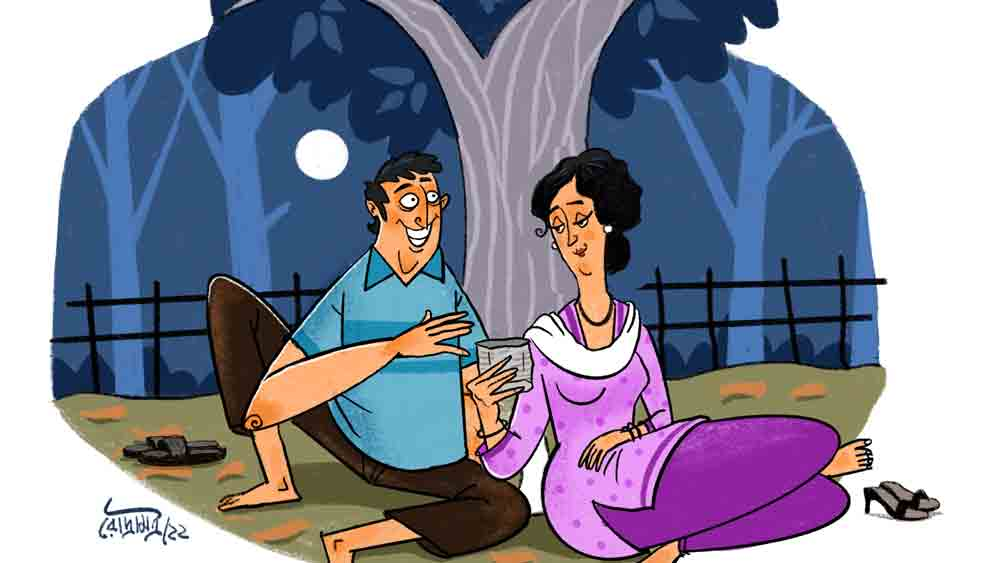

 
 <h1 align=center>ইচ্ছামৃত্যু</h1>
<h2 align=center>মৃত্যুঞ্জয় দেবনাথ</h2> বিড়ির প্যাকেটটা হাতে নিয়েই ছুড়ে ফেললেন বড়দা। বিরক্ত হয়ে বললেন, “ধুস! এ তো ভেজাল বিড়ি! অরিজিনাল ‘মা লক্ষ্মী’ নয়। আসল ‘মা লক্ষ্মী’ আরও লম্বা, একটু ব্রাউনিশ। তোকে দিয়ে কোনও কাজ হয় না! কোত্থেকে আনলি? বল্টুর দোকানে যাসনি?”

আমি মাথা নাড়ি, “না। গোবিন্দদার দোকান থেকে।”

“কোন গোবিন্দ?” বড়দা হাই পাওয়ারের চশমার উপর দিয়ে তাকিয়ে আমার দিকে। বিড়ি যেন একটা অমৃততুল্য বস্তু, ভুল দোকান থেকে কিনে ফেলায় মহাভারত অশুদ্ধ। বড়দা বলে চলল, “বঙ্গলক্ষ্মীর মোড়? কেলে গোবিন্দ? ও তো জালি মাল একটা। যা, পাল্টে নিয়ে আয়।”

ফের দোকানের সামনে গিয়ে দাঁড়াতে গোবিন্দদা আমার দিকে বিস্ময়মিশ্রিত চোখে তাকালেন।

বিড়ির প্যাকেটটা দিয়ে বললাম, “এটা ডুপ্লিকেট। বড়দা বলছিল।”

হেসে উঠল গোবিন্দদা, “বিড়ির আবার ডুপ্লিকেট কী? বিড়ি তো বিড়িই। আগুন ছোঁয়ালে দুটোর মুখ দিয়েই ধোঁয়া বেরোয়। দুটোর ধোঁয়াই ক্যান্সারাস। কী, ঠিক বললাম?”

আমি উত্তর না দিয়ে বাড়ির পথ ধরলাম। নতুন প্যাকেট পেয়ে তৃপ্তির হাসি হাসলেন বড়দা। পরম স্নেহে বললেন, “ইয়েস। থ্যাঙ্ক ইউ।”

বড়দার থেকে মুখ ঘুরিয়ে মালতীর বাড়িয়ে ধরা চায়ের কাপ নিলাম। চুমুক দেব বলে চেয়ারে হেলান দিয়েছি, অমনি মেজদার তলব, “শুনছিস, কেলো? তোর বৌদির জুতো ছিঁড়ে গেছে। মোড়ে হরিমুচির দোকানটায় নিয়ে যা না...”

বিস্মিত চোখে তাকালাম মেজদার দিকে। মনে মনে বললাম, ‘হে অগ্রজ, সক্কালবেলা তুমি তোমার বৌটির জুতো বওয়াবে? এও ছিল কপালে?’

দোকানের সামনে গিয়ে দাঁড়িয়ে আছি হরিব্যাটার হেলদোল নেই তখনও। মুখে ব্রাশ ঢুকিয়ে খচরমচর করে চলেছে। অস্থির হয়ে বললাম, “একটু তাড়াতাড়ি করবে গো? বৌদি অফিস বেরোবেন।”

“বৌদির জুতা?” হরিমুচির মুচকি হাসি, “দ্যাশের কী অবস্তা! রামায়ণের ভরত দাদা রামচন্দ্রের জুতা মাথায় লিয়েছেল, ইনি বৌদির। হ্যা হ্যা হ্যা...”

সারানো জুতো বৌদির নাকের ডগায় মেলে ধরলাম। উনি তিন বার ‘থ্যাঙ্ক ইউ’ বললেন। জবাবে অন্তত এক বার ‘ওয়েলকাম’ বলা যেত, মুখে এল না। মটকা গরম। শালা! বেকার বলে সক্কালবেলা জুতো বওয়ালে। এ বাড়ির চাকর আমি! অ্যাঁ! চাকর!

“কী রে কেলো, মন খারাপ কইরা কী ভাবস?” মুন্নিপিসি তাকিয়ে আছেন আমার দিকে।

থেকে থেকেই ভারী রাগ হয় এদের উপর। আশ্চর্য! ভাল নামেও ডাকতে ইচ্ছে করে না কোনও দিন? কেলো কি আমার নাম? আমার নাম তো কালিদাস। সম্রাট বিক্রমাদিত্যের নবরত্নের এক জন। কবিশ্রেষ্ঠ। তাঁর নামের কী হতচ্ছিরি দশা!

“কী বলছ?” মুখ ঝামটে বললাম।

“কইতাছি, তর কি মন খারাপ?”

“হ। খারাপ।”

“ক্যান?”

“তোমাগো ব্যবহারে।”

মুন্নিপিসি অবাক, “ক্যান! আমরা আবার কী করলাম তরে?”

গা জ্বলে গেল। যতই ভালমানুষি দেখান, মহিলা মোটেই সুবিধের লোক নন। যেমন ধড়িবাজ, তেমনই স্বার্থপর। না হলে নিজের সম্বলটুকু বড়দার হাতে সমর্পণ করেন, যে বড়দার সবই আছে! জলজ্যান্ত একটি সরকারি চাকরি তো আছেই। এই নিঃস্ব বেকারটিকে নজরে এল না? অথচ কাজের বেলায় তো কেলো ছাড়া গত্যন্তর নেই। কথায় কথায় বড় নিঃশ্বাস ফেলে বলবেন, “শইলডা ভালা নাই। চোকে দেহি না, কানে শুনি না। ককন চইল্যা যাই, ঠিক নাই।”

আমি যমরাজকে স্মরণ করি, তুলে নাও এ গিটকিরিকে। বুড়ির হাড়ে-মজ্জায় বিষ আর ধান্দাবাজি।

কপালদোষে, আমার মতে কপালগুণে, এক ভেজাল বুড়োর সঙ্গে বিয়ে হয়েছিল মুন্নিপিসির। আকণ্ঠ মদ গিলে এসে রোজ বৌ পেটাত সে। সেই পুণ্যে বেশি দিন ভবযন্ত্রণা পেতে হয়নি, অকালে টেঁসে গেল ব্যাটা। মুন্নিপিসি সাদা থান পরে বিধবা সাজলেন। বাবার কাছেই ছিল মুন্নিপিসির তহবিল। স্থাবর-অস্থাবর মিলিয়ে লাখদুয়েক। বাবা মরতে ওটি সসম্মানে বড়দার হাতে তুলে দিলেন। সেই থেকে বুড়ি আমার দু’চক্ষের বিষ।

“কী রে! কতা কস না যে, কেলো? আমরা বুজি মনে দাগা দিছি তর?”

“দিছ ত।”

“কী করি বুজলি?”

“সব বুঝি। মুখ্যু না আমি।” 

“বুজজস ঘেঁচু। তুই ত মুখ্যুই!” বলে বুড়ো আঙুল দেখান মুন্নিপিসি।

সে দিকে রাগী চাহনি মেলে তাকালাম আমি। তার পর পটাং করে উঠে দাঁড়ালাম।

“আবার উঠছ কই? সইন্ধা অইছে না? এখন যাবি কই?” রে রে করে উঠলেন মুন্নিপিসি।

“ঘাটে যামু।”

“কীডা কস? কন ঘাটে?”

“শ্মশান!” বলে এক মুহূর্ত দেরি করলাম না। সত্যিই ঘাটে যাওয়ার কথা আমার। পদ্মপুকুর ঘাটে। খেন্তি অপেক্ষা করবে। কী যেন দরকারি কথা আছে আমার সঙ্গে। মনটা অস্থির হয়ে উঠল। কী কথা বলবে খেন্তি?

ভাবতে বেশ লাগছে। এই প্রথম কোনও ঠিক বয়সের মেয়ে আমার সঙ্গে যেচে কথা বলতে চেয়েছে। জিজ্ঞেস করেছিলাম, “কী কথা রে খেন্তি? এখনই শুনতে ইচ্ছে করছে।”

উত্তরে এ পাশ-ও পাশ মাথা নাড়ল ও, “এখন না। এলে বলব। কী, আসবি তো?”

আমি লম্বা করে ঘাড় নেড়েছিলাম, “অফ কোর্স!”

পাড়ায় হাজার দুর্নাম খেন্তির। সবাই বলে, ও নাকি ছেলেধরা। একটাকে ধরে, একটাকে ছাড়ে। আজ যদি রামকে খেল, কাল শ্যামকে। অন্যার্থে খাদ্যরসিক। সর্বভুক। এক খাবারে বেশি দিন মন ভরে না। তবে আমায় কিসের জন্য তলব? নিঝুম পদ্মপুকুর ঘাটে? সন্ধ্যায়? ওর সুনজর বা কুনজরে পড়লাম কি? হে ভগবান!

অন্য এক ভাবনার ঘোড়দৌড়ও চলছে মনে। বাপ-মা নেই খেন্তির। মরেছে বছরকয় আগে। থাকে দাদার হেফাজতে। দাদার নাম গোরা। তার নাম শুনে তল্লাট ভিরমি খায়। কাউন্সিলরের ডান হাত ও। লিকপিকে পাটকাঠি থেকে সেগুনগাছ হয়েছে। শালা! দেশটা ভেজালে ভরে গেল।

ভাবছি, খেন্তিকে বললে কেমন হয়? ওর দাদাকে বলে যদি একটা কাজের ব্যবস্থা করা যায়? বেকার-বাউন্ডুলে থেকে হাড়েমজ্জায় যে জং ধরে গেল! কলকব্জায় ক্যাঁচকোঁচ আওয়াজ হয়। কখনও ভাবি, বেলা ফুরিয়ে এল বুঝি। হরি দিন তো গেল সন্ধে হল, পার করো আমারে...

 অনেক ক্ষণ বসে আছি পুকুরঘাটে। আচমকা মরা পাতায় খচমচ শব্দ তুলে খেন্তি এসে সামনে দাঁড়াল। ঠোঁটে স্মিত হাসি। আবছা অন্ধকারেও স্পষ্ট বুঝলাম, এ হাসি নিখাদ, নির্মল। আন্তরিক। আহা, অভাগা কেলোকে এই প্রথম কোনও তরুণীর হাসি উপহার।

“এই নে, বাদাম খা...” বলে আমার দিকে বাদামের প্যাকেট বাড়িয়ে ধরল খেন্তি। আকাশের নীলান্ধকারে তখন চাঁদের উঁকিঝুঁকি। অবিকল চাঁদটিকে যেন খেন্তির ঠোঁটে ঝুলতে দেখছি আমি।

আবিষ্ট হয়ে বাদামের প্যাকেট নিতে যাই আমি। অমনি একটি ছোট্ট অঘটন। দু’জনের দুই হাতে স্পর্শ! যেন হাজার ভোল্ট লেগে গেল! জীবনে প্রথম কোনও তন্বীর কোমল আঙুল আমার মুঠোয়। কিন্তু টু দ্য পয়েন্টে আসার জন্য মন ছটফট করছে তত ক্ষণে আমার। ফট করে বললাম, “খেন্তি, তোমার দাদাকে বলে একটা কাজের ব্যবস্থা করে দাও না গো। খুব অসুবিধেয় আছি যে।”

হাত সরিয়ে খেন্তি কটমটিয়ে তাকাল আমার দিকে। খেঁকিয়ে বলল, “কাজের জন্য দাদাকে ধরতে হবে কেন? ও সব ঘেন্নার কাজ করবে তুমি? ছিঃ! একটা ভাল কাজ করার চিন্তা করো কালিদা।” বলে প্রসঙ্গ পাল্টাল খেন্তি। হঠাৎই ফিসফিসিয়ে বলল, “এই যে পুকুরপাড়ের নির্জন অন্ধকারে দু’জনে... আমি পূর্ণ যুবতী। কিছু মনে হচ্ছে না তোমার কালিদা? কোনও বাড়তি অনুভূতি?”

মনে মনে বিষম খেলাম। এমন প্রশ্নের জন্য প্রস্তুত ছিলাম না। মিনমিন করে বললাম, “একটা কবিতা মনে আসছে খেন্তি। এক কালে কবিতা লিখতাম কিনা। বলি?”

ট্রাফিক সেজে হাত দেখাল খেন্তি, “ধুত! ও সব না। আমি বলছি শরীরের কথা। ইচ্ছে করছে না আমায় জড়িয়ে ধরতে? একটা হামি খেতে? সত্যি বলো?” আরও কাছ ঘেঁষে এল খেন্তি।

অমনি ‘নো বল’ কল করলাম আমি। বললাম, “ছিঃ খেন্তি। আমার তেমন মনে আসবে কেন? আমি কি দুশ্চরিত্র? অমন ভাবাও যে পাপ!”

টক করে উঠে দাঁড়াল খেন্তি। জ্যোৎস্নার বন্যা বওয়া মুখে অমাবস্যার কালি। বলল, “বুঝেছি, তুমি একটি ঢ্যাঁড়শ। নির্বিষ ঢোঁড়াসাপ। এ যুগের অচল পয়সা। চললাম।”

কথা হারিয়ে একদৃষ্টে তাকিয়ে আছি খেন্তির চলে যাওয়ার দিকে। খেন্তি কোথায়, গরম খুন্তি যে একটি। মরমে ছ্যাঁকা দিয়ে হনহনিয়ে চলে যাচ্ছে ও। পুকুরঘাট ছাড়িয়ে ওই সরু রাস্তায়। না, আর দেখা যাচ্ছে না। আবছা অন্ধকারে মিলিয়ে গেল আমার তিরিশ পেরনো জীবনের তিরিশ মিনিটও না পেরনো প্রেম।

 

“বলুন?” ভিড় হালকা হতে দোকানদার আমার দিকে তাকালেন।

ঘুমের ওষুধের নামটা বলে আছে কি না জিজ্ঞেস করি।

“আছে। প্রেসক্রিপশন?”

“প্রেসক্রিপশন তো নেই,” পরক্ষণে সামলে নিয়ে বললাম, “মানে বাড়িতে। আনতে ভুলে গেছি।”

“তা বললে তো হবে না। প্রেসক্রিপশন ছাড়া আমরা এতগুলো ঘুমের ওষুধ দিতে পারি না।”

যদিও পরের দোকানদার দিলেন। এক পাতা জুটল। মনে মনে বললাম, ‘এ আমার মৃত্যুবাণ।’ রাত্তিরে শেষ বারের মতো সবার সঙ্গে মিষ্টি কথা বলে সটাসট মারব। তার পর বালিশে মাথাটি রেখে ফুস্‌।          

 

সকালে ঘুম ভেঙে যারপরনাই বিস্মিত হলাম। আশ্চর্য! দশটা ঘুমের ওষুধ গিললাম কাল রাত্তিরে। মরলাম কই? দিব্যি জেগে উঠলাম তো আবার। এই যে, স্পষ্ট শুনতে পাচ্ছি-দেখতে পাচ্ছি সব। দেওয়ালঘড়িতে বেলা সাড়ে এগারোটা বাজে। হে ভগবান! ঘুমের বড়িতেও ভেজাল?

টুক করে চোখ বুজলাম আবার। কেননা ওই ঘরে মুন্নিপিসি মড়াকান্না জুড়েছেন। সঙ্গে মেজবৌদি-বড়বৌদিরাও। বুঝতে পারছি সব, ওঁদের হাতে আমার রাত্তিরে লিখে রাখা সুইসাইড নোটটা পড়েছে। সেটা পড়তে পড়তে সুরেলা কান্না জুড়ছেন সকলে। সকলের কথাগুলো শুনছিলাম মড়া সেজেই...

মুন্নিপিসি বলছে, “কেলো, চইল্যা গেলি! এই চিনলি আমারে? আমি ভালবাসি না তরে? সুযুগ পাইলে কতা শুনাই? অরে বোকারাম, সপ ট্যাকাগুলি যে তর লাগিই রাখা। তর হাতে দি নাই ক্যান, তা বুজলি না রে? হে তো তর ভালার লাগিই। ভাবছি, তুই নিচ্চয়ই কাজে লাগবি তবে একটা। ট্যাকাগুলি হাতে ধরাই দিলে পাছে আরও নিষ্কম্মা হস, তাই ত দি নাই। অরে, আমার কেলো রে!”

তার পরই মেজ বৌদি, “ছিঃ ঠাকুরপো, জুতো সেলাই করতে পাঠিয়েছি, তাই মনে করে রাখলে! কেন পাঠাতাম, এক বারও তলিয়ে দেখলে না? একটাই তো কথা ভেবেছিলাম, আমাদের এই সব কাজে যদি সম্মানে লাগে, ঘেন্না ধরে তোমার। ঘরে বসে না থেকে যদি একটা ভাল কাজের ব্যবস্থা করো। আমরাও তো এইটুকুই চেয়েছিলাম, পয়সাকড়ি রোজগার করো। বিয়ে করে সংসারী হও।”

বড় বৌদিও লাইন জুড়ল, “ঠাকুরপো, অপরাধ নিয়ো না। সে দিন চুলের কিলিপ আনতে দিয়েছিলাম, সে তোমার কথা ভেবেই। আমিও ভাবতাম, যদি রাগ-ঘেন্না জাগে মনে। যদি একটা ভাল কাজের সন্ধান করো। ঠাকুরপো গো...”

আশ্চর্য! উড়ে এসেছে খেন্তিও। ফুঁপিয়ে ফুঁপিয়ে কাঁদছে আর বলছে, “অনেক দিনই এক জন ভাল বন্ধু খুঁজছিলাম যার সঙ্গে ঘর বাঁধা যায়। কিন্তু সবাই দেখলাম ভুসিমাল। প্রেম-ভালবাসা বলতে সব ছেলেরাই বোঝে শরীর। একমাত্র তুমি ছাড়া, কালিদা। আমার পরীক্ষায় শুধু তুমিই পাশ করেছিলে। ভেবেছিলাম ক’দিন পর সারপ্রাইজ় দেব তোমায়। একটু সময় দিলে না!”

আমারও তত ক্ষণে অবস্থা সঙ্গিন। এই ভাবে চোখ বুজে মড়া সেজে পড়ে থাকা যায় কত ক্ষণ? চোখের পাতাদু’টি লাফিয়ে-লাফিয়ে উঠছে। মেরুদণ্ড টনটনাচ্ছে। উপরি উপলব্ধি করছিলাম, নির্ভেজাল কথাগুলো সব। কান্না মিশিয়ে অন্তরের কথাই বলছে সবাই। এতটা ভালবাসত এরা আমায়? সকলের এত্ত সব বাড়তি চাওয়া ছিল সে আমার ভাল চেয়েই? আবার খেন্তিও! আমায় পরীক্ষা করেছে! সত্যিই ছেলেধরা নয় ও? ‘ও সর্বভুক’ এ কথা তা হলে সর্বৈব মিথ্যা? তবে আর পটল তোলা কেন?

পটাং করে চোখের পাতা মেললাম। অবসন্ন শরীরটা নিয়ে বিছানা ছেড়ে উঠে বসলাম। মাথাটা পাথরের মতো ভারী। চোখের দৃষ্টি সামান্য ধোঁয়াটে। টলতে টলতে পাশের ঘরে গিয়ে দাঁড়ালাম। আমার দিকে তাকিয়ে বিষম খেল সবাই। কান্নায় ফুলস্টপ। চোখের তারা কুড়ি টাকার রাজভোগ। ভিড় ঠেলে খেন্তি এগিয়ে এল সকলকে চমকে গিয়ে।

“তুমি মরোনি, কালিদা?”

আমি মাথা নাড়ি। মিনমিন করে বলি, “না রে।”

“তবে?”

সত্যিটা বলতে গিয়ে ঢোঁক গিললাম। সত্যি আজকাল চলে না, যুগটাই ভেজালের কি না। তাই সত্যে ভেজাল মিশিয়ে বললাম, “আমায় তুই ভালবাসিস কি না, তারই পরীক্ষা নিচ্ছিলাম। দিব্যি পাশ করে গেলি!”

“সত্যি বলছ?” খেন্তির চোখভর্তি জল। ঠোঁটভর্তি জোছনা।

ওকে আঁকড়ে ধরে আমি মাথা দোলাই। তিন সত্যি!