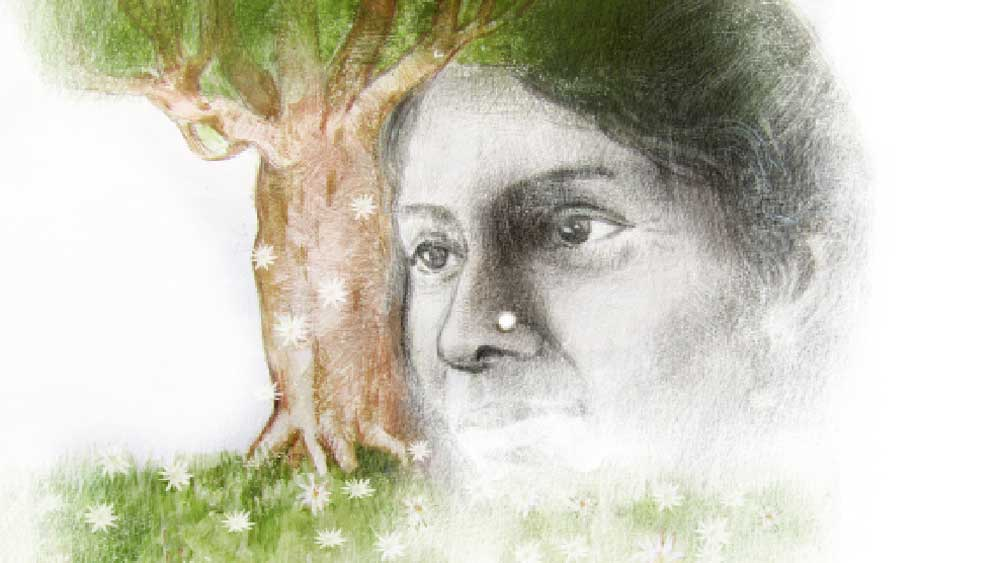

 

<h1 align=center>ইচ্ছে</h1>
<h2 align=center>নন্দিতা বাগচী</h2>
অপালা বললেন, “তবে ওই কথাই রইল, পরশু আসছেন আপনি আবার।” কথার সঙ্গে সঙ্গে তাঁর নাকের হিরেটায় ঝিলিক খেলে গেল। যেন সকালের সূর্যের রশ্মি এসে আছড়ে পড়ল ঘাসের ওপরে জমে থাকা নিটোল শিশিরবিন্দুর ওপর।   মুগ্ধ চোখে মায়ের দিকে তাকিয়ে আছে অঙ্গিরা। মনে মনে বলছে, ‘তোমার ওই হিরের নাকছাবিটাও আমার চাই মা। তুমি যখন থাকবে না তখন নাক বেঁধাব আমি ওই নাকছাবিটা পরার জন্য। এমন ঝিলিক আর কোনও হিরেতে দেখিনি আমি!’   কাগজপত্রে সইসাবুদ করিয়ে চলে গেছেন উকিলবাবু। অপালা এবং তাঁর প্রয়াত স্বামী নিখিলেশের ইচ্ছে অনুযায়ী আলিপুরের বাংলো পেল ছেলে নিষাদ আর রায়চকের বাগানবাড়ি মেয়ে অঙ্গিরা। এ ছাড়া টাকা-পয়সা যা লগ্নি করা আছে, সেগুলো ভবিষ্যতে সমানুপাতে ভাগ হবে অঙ্গিরা ও নিষাদের মধ্যে।   স্বামীর অকালমৃত্যুতে অথৈ জলে পড়ে গিয়েছিলেন অপালা। ছোট ছোট ছেলেমেয়েদুটোকে সামলাবেন, না ব্যবসা সামলাবেন, না কি স্বামীর অপরিণামদর্শিতার জন্য কোর্টে ছুটোছুটি করবেন! আজ এত বছর বাদে সেই দিনগুলোর কথা ভাবলে শিউরে ওঠেন তিনি। তবে প্রবল ঝড়ে ভেঙে যাওয়া একটা গাছে যেমন করে নতুন ডালপালা গজায়, তেমন ভাবেই দশটা হাত গজিয়ে ছিল অপালার। কিছু দিনের মধ্যেই সামলে নিয়েছিলেন তিনি সেই দুর্যোগকে। তাই আটঘাট বেঁধে রাখছেন যাতে ছেলেমেয়ে দুটো বিপাকে না পড়ে।   পার্শিয়ান কার্পেটটার ওপরে গড়াচ্ছে অঙ্গিরা। তার গাল-গলা চেটে দিচ্ছে তার আদরের ফাজ। এই জার্মান শেফার্ডটা তার ছোট্টবেলার সাথী। বাড়িতে আসা ইস্তক তার পিছু ছাড়ছে না মোটে। নিষাদ কম কথার মানুষ, কর্মই তার ধ্যানজ্ঞান। স্মার্টফোনে সেই কর্মসাধনেই ব্যস্ত সে এখন।   ছেলেমেয়ে দু’টিকে প্রাতিষ্ঠানিক শিক্ষার সঙ্গে সঙ্গে সামাজিক শিক্ষাও দিয়েছেন অপালা। তবে তাদের আঁচলের ছায়ায় বেঁধে রাখেননি। তাদের উড়তে শিখিয়েছিলেন তিনি নিজেই। এত বড় খোলা আকাশ থাকতে খাঁচায় পুরে রাখবেন কেন তাদের? উড়তে উড়তে তারা যখন ক্লান্ত বোধ করবে, তখন নীড়ে এসে না-হয় জিরিয়ে নেবে খানিক।   এ বারে আসা মায়ের ডাকে। বাবার দশম মৃত্যুবার্ষিকী উপলক্ষে। অপালার আকাশটা এখন এত বড়  হয়ে গেছে যে, অপত্যদের নাগাল পাওয়া ভার। কর্মসূত্রে অঙ্গিরা থাকে আমেরিকার পশ্চিমতম শহর পোর্টল্যান্ডে আর নিষাদ থাকে অস্ট্রেলিয়ার পূর্ব প্রান্তের ব্রিসবেনে।   চমৎকার ব্যবস্থা করেছিলেন অপালা। বাড়ির কাছের ফাইভ স্টার ব্যাঙ্কোয়েট হলে। শহরের গণ্যমান্য মানুষজন এসেছিলেন। সকলেই ভাল ভাল কথা বলেছিলেন স্মৃতিচারণে। মৃত ব্যক্তি সম্পর্কে মন্দ কথা বলার রেওয়াজ নেই সমাজে। নিখিলেশের সিরোসিস অব লিভার হয়েছিল, সে দায় তো অতিথিদের নয়।   ভুক্তভোগী অপালা চান না তাঁর ছেলেমেয়েদুটো তাঁর মতো বিপদে পড়ুক। তাই উকিলবাবুকে ডেকে দুটো দানপত্র করিয়ে নিলেন। তরাজুর পাল্লা মেপে দু’জনকে পৈতৃক সম্পত্তির অংশীদার করে দিলেন। তবে কিছু শর্ত আছে তাঁর। সেই শর্তগুলো নিয়েই আলোচনা করার চেষ্টা করছেন তিনি।   “তোদের কিছু কথা বলার আছে,” মৃদু হেসে বললেন অপালা।   নিষাদ ফোন থেকে চোখ তুলে বলল, “হ্যাঁ মা, বলো।”   অঙ্গিরা কার্পেটের ওপরে উপুড় হয়ে শুয়ে থেকেই বলল, “তোমার ওই হিরের নাকছাবিটা কিন্তু আমার, দাদার বৌকে দেবে না বলে দিচ্ছি।”   “আগে আমি মরি, তার পর নিস!” হাসিটাকে কান অবধি নিয়ে গিয়ে বললেন অপালা।   নিষাদ তার চোখে-মুখে বিরক্তি ফুটিয়ে বলল, “তুই বড় বাজে বকিস অরা। মা-র কথাটা আগে শুনবি তো!”   “তুই আবার কবে থেকে এত মাতৃভক্ত হলি রে দাদা? রায়চকের বাগানবাড়িটা হাতিয়ে নেওয়ার মতলব নেই তো তোর?” হিহি করে হেসে বলল অঙ্গিরা।   “উইল ইউ শাট আপ? আমেরিকায় গিয়ে আরও বেশি টকেটিভ হয়ে উঠেছিস দেখছি!” রেগে গিয়ে বলল নিষাদ।   কার্পেটের ওপরে তড়াক করে উঠে বসে অঙ্গিরা বলল, “আর তুই, তুই কী? থাকিস তো এক কনভিক্টদের দেশে, তার আবার এত দেমাক!”   অপালা বিরক্ত হয়ে বললেন, “অ্যাই, তোরা থামবি? আমার কিছু জরুরি কথা বলার আছে। আবার কবে তোদের দু’জনকে এক সঙ্গে পাব কে জানে! তার পর মরেটরে গেলে কথাগুলো আর বলাই হবে না।”   “বড় সেন্টুতে সুড়সুড়ি দাও তুমি আজকাল। এর ভেতরে তোমার মরার কথাটা এল কোথা থেকে?” অপালার হাঁটু দুটোর মাঝখানে মুখটা গুঁজে বলল অঙ্গিরা।   “আরে বাবা, কে কবে মরে যাবে কিছু বলা যায়? তোদের বাবা যে আটচল্লিশ বছর বয়েসেই চলে যাবেন, সে কথা কি ভেবেছিলাম আমি? আর আমি তো এক রোগের ডিপো। ব্লাড প্রেশার হাই, ব্লাড শুগার হাই, কোলেস্টেরল হাই, সঙ্গে আবার হাঁপের কষ্ট। যা হোক, এ বার তোরা মন দিয়ে শুনে রাখ কিছু কথা। আসলে এগুলো আমার ইচ্ছে।”   অঙ্গিরা তার স্বভাবসিদ্ধ ভঙ্গিতে হিহি করে হেসে বলে, “লাস্ট উইশ?”   “অরা!” ফের ধমকে ওঠে নিষাদ।   আর অপালা স্নিগ্ধ হেসে বলেন, “হ্যাঁ, লাস্ট উইশ। শোন, রায়চকের অনাথ আশ্রমে আমি প্রতি মাসে যে টাকাটা দিই, সেটা যেন বন্ধ না হয়। আই মিন, আমার অবর্তমানে। আর ওষুধের হোলসেল বিজ়নেসটা তোরা পারলে চালাবি, নইলে বিক্রি করে দিবি। কোনও জবরদস্তি নেই। তবে চালাতে পারলে ভাল, আখেরে তোদেরই লাভ হবে। তিন পুরুষের ব্যবসা, পুরো ইস্টার্ন ইন্ডিয়ার ডিলারশিপ আমাদের হাতে।”   কয়েক মুহূর্ত চুপ করে অপালা বললেন, “আরও একটা কথা। এটাকে অবশ্য লাস্ট উইশই বলতে পারিস। আমার মৃত্যুর পর আমাকে পোড়াস না তোরা। এই সিস্টেমটা ভাল লাগে না আমার। কেমন যেন ভয়ও করে। তার চেয়ে একটা মেহগনি কাঠের কফিনে শুইয়ে মাটি দিস আমাকে। আর কফিনের ওপরে রেখে দিস কিছু তাজা গোলাপ। আর ওই পারলৌকিক শ্রাদ্ধফাদ্ধ চাই না আমার। পারলে একটা স্মরণসভার ব্যবস্থা করিস।”   নিষাদ আর অঙ্গিরা অবাক হয়ে তাকিয়ে আছে মায়ের দিকে। নির্বাক। আর অপালা বলে চলেছেন, “কোনও বেরিয়াল গ্রাউন্ডে জমি কিনতে যাস না। রায়চকের বাগানবাড়িটায় গঙ্গার পাড়ঘেঁষা যে মস্ত বকুল গাছটা আছে তার তলায়...”   এইটুকু শুনেই হাঁ-হাঁ করে ওঠে অঙ্গিরা, “না, না, সে কী করে হবে! তার পর পেত্নি হয়ে আমার ঘাড় মটকাবে তুমি!”   অঙ্গিরার পিঠে একটা চাপড় মেরে নিষাদ বলল, “তুই চুপ করবি?”   অপালা মেয়ের পিঠে হাত বুলিয়ে দিয়ে বললেন, “না রে, আমি পেত্নি হব না। আর হলেও তোর ঘাড় মটকাব না। তুই তো আমার মেয়ে। আমার আত্মজা।”   তার পর জানলার বাইরে তাকিয়ে বললেন, “দৃশ্যটা একটু ভেবে দেখ তোরা। গঙ্গা থেকে ঠান্ডা হাওয়া ভেসে আসছে, পাড়ে ঢেউ ভাঙছে ছলাৎ, ছলাৎ... বকুলগাছটা থেকে টুপটাপ করে ঝরে পড়ছে ফুল... আঃ! প্রাণটা জুড়িয়ে যাচ্ছে আমার...”   অপালার একটা ফোন এসে যাওয়ায় ইতি টানতে হল প্রসঙ্গটায়।   ছেলেমেয়ে যথাসময়ে ফিরে গেছে তাদের কর্মস্থলে। অপালা আবার একা। তবে কাজপাগল মানুষ তিনি, তাই একাকিত্ব বোধটা নেই। এরই মধ্যে সারা পৃথিবী তোলপাড় করছে এক ভাইরাস। পুরাণের বকরাক্ষসের মতো পটাপট গিলে ফেলছে তরতাজা মানুষগুলোকে। নানা দেশের, নানা বর্ণের, নানা ধর্মের মানুষকে। দেশ, কাল, পাত্র কিচ্ছু দেখছে না... মানুষ হলেই হল।   অপালা গিয়েছিলেন রায়চকের অনাথ আশ্রমে। গাড়িভর্তি সাবান, স্যানিটাইজ়ার আর মাস্ক নিয়ে। বাচ্চাগুলোকে শিখিয়ে এলেন কী করে বার বার হাত ধুতে হয়। কী করে স্যানিটাইজ়ার দিয়ে হাত শুদ্ধ করতে হয়। কী করে মাস্ক পরতে হয়। প্রতিদিন যেন একটা করে মাস্ক সাবান দিয়ে ধুয়ে কড়া রোদে মেলে দেয় এবং অন্যটা পরে নেয় ইত্যাদি।   সপ্তাহখানেক বাদে অপালার ঘুম ভাঙল সারা গায়ে ব্যথা ও জ্বর নিয়ে। গলার ব্যথা আর শ্বাসকষ্ট বাড়তে লাগল ধীরে ধীরে। ডাক্তারবাবু বাড়িতে আসতে রাজি হলেন না। নির্দিষ্ট হাসপাতালে গিয়ে পরীক্ষা-নিরীক্ষা করিয়ে ভর্তি হতে হল সেখানে। কোমর্বিডিটি শব্দটা আগে শোনেননি অপালা। নিয়ম অনুযায়ী তাঁর বাড়ি ও অফিসের কর্মীরা অন্তরিত হলেন।   কোভিড ওয়ার্ডে আছেন অপালা। ব্যবস্থা ভালই। তবে নিজেকে কেমন যেন অচ্ছুত মনে হতে লাগল তাঁর। আর অকর্মণ্য। ভাগ্যিস স্মার্টফোনটা সঙ্গে ছিল। সোশ্যাল মিডিয়ায় নানা আলাপচারিতা চলতে লাগল আর ছেলেমেয়ের সঙ্গে ভিডিয়ো কল। ক’টা মাত্র দিনের তো ব্যাপার, ঠিক ছুঁয়ে ফেলবেন ফিনিশিং লাইনটা।   কিন্তু এগারো দিনের মাথায় শুরু হল প্রবল শ্বাসকষ্ট। ফুসফুস বিকল হতে শুরু করল অপালার। অক্সিজেনের অভাব শরীরে। ভেন্টিলেশনে যেতে হল তাঁকে।   নিষাদ ও অঙ্গিরা পাগলের মতো ছুটোছুটি করল দেশে আসার জন্য। কিন্তু পায়ে তাদের বেড়ি। ভিডিয়োতে কথা বলার অবস্থাতে নেই অপালা। তাঁর কর্মীদেরও হাসপাতালে যাওয়ার অনুমতি নেই। কিংকর্তব্যবিমূঢ় নিষাদ ও অঙ্গিরা। হাসপাতালের ডাক্তার ও কর্মীদের কাছ থেকে যেটুকু খবর পেল তাই নিয়েই সন্তুষ্ট থাকতে হল তাদের।   পনেরো দিন কেটে গেছে। সুস্থ হয়ে উঠছেন অপালা। নিষাদ ও অঙ্গিরা ফোনে কৃতজ্ঞতা জানাল হাসপাতালের ডাক্তার ও স্বাস্থ্যকর্মীদের। কিন্তু উনিশ দিনের মাথায় অপালার মৃত্যু-সংবাদটা শোকে পাথর করে দিল তাদের। তারা দু’জনেই বলতে চাইল, যদি একটা মেহগনি কাঠের কফিনের ব্যবস্থা করা যায়। যদি তাদের রায়চকের বাগানবাড়ির বকুলগাছটার তলায় তাঁকে সমাধিস্থ করা যায়।   কিন্তু তত ক্ষণে অপালা রওনা হয়ে গেছেন এক শোভাযাত্রায়। সাদা প্লাস্টিকের পোশাকে মোড়া তাঁর শরীর। অসংখ্য সহযাত্রীরা একই পোশাক পরে সঙ্গ দিচ্ছেন তাঁকে। শহর থেকে দূরে এক নির্জন প্রান্তরে তাঁদের জন্য অপেক্ষা করছে সারি সারি দাহন-চুল্লিগুলো।   সারা পৃথিবী তোলপাড় করে বিদায় নিয়েছে বকরাক্ষস। ভীম-ভ্যাকসিনের কাছে পরাজয় মেনেছে সে। পরিযায়ীরা ঘরে ফিরছে একে একে। এখন আর তাদের পায়ে হেঁটে আসতে হয় না, রেললাইনের ওপরে আধপোড়া রুটি ছড়িয়ে রেখে পৃথিবীকে বিদায় জানাতে হয় না। এখন তারা রেলগাড়িতে সওয়ার হয়ে বাড়ি ফিরছে। অভিবাসীরা ফিরছে আকাশপথে। নিষাদ আর অঙ্গিরাও বাড়িতে এসেছে মায়ের স্মরণসভার আয়োজন করতে। তাঁর অন্যান্য ইচ্ছে যথাযথ ভাবে পালন করতে না পারলেও এই একটি ইচ্ছেকে সম্মান জানাতে চায় তারা।   মায়ের অন্তরঙ্গ এবং পরিচিত মানুষদের সঙ্গে যোগাযোগ করছে তারা ফোন মারফত। অপালার ফোনেই সে সব নম্বর সংরক্ষিত ছিল। তবে যে হাসপাতালে অপালার চিকিৎসা হয়েছিল, সেখানকার তৎকালীন কোভিড ওয়ার্ডের ডাক্তার এবং নার্সদের ফোন নম্বর ছিল না। তাই নিষাদ এবং অঙ্গিরা দু’জনে মিলে সশরীরে উপস্থিত হল সেখানে।   ওদের কথাবার্তা শুনে এক জন নার্স ছুটে এসে অঙ্গিরাকে জিজ্ঞেস করলেন, “আপনি কি লেট অপালা দাশগুপ্তর মেয়ে?”   ‘লেট’ শব্দটা যেন একটা তিরের মতো ছুটে গিয়ে অঙ্গিরার মনটাকে এফোঁড়-ওফোঁড় করে দিল। নিজেকে সামলে নিয়ে সে বলল, “হ্যাঁ। কেন বলুন তো?”   নার্স-মহিলা বললেন, “আপনি দু’মিনিট অপেক্ষা করুন, আমি এখনই আসছি।”   তবে দু’মিনিট নয়, মিনিট দশেক বাদে ফিরলেন তিনি। হাতে একটা ছোট্ট ওষুধের বাক্স। আর তার ভেতরে একটা তুলোর দলা। সেটা অঙ্গিরার হাতে আলতো ভাবে দিয়ে তিনি বললেন, “এটা আপনার মা আপনাকে দিতে বলেছিলেন ভেন্টিলেটরে যাবার আগে।”   “কী আছে এটায়?” অনুসন্ধিৎসু হয় অঙ্গিরা।   “আপনি নিজেই দেখুন। তবে সাবধানে খুলবেন।”   তুলোর ভাঁজটা সরাতেই এক বিন্দু ভোরের শিশির যেন ঝিলমিল করে উঠল নার্সেস স্টেশনের জোরালো আলোটার তলায়। সেটাকে মুঠোর ভেতরে চেপে ধরে হাউহাউ করে কেঁদে উঠল অঙ্গিরা।   নার্স ভদ্রমহিলা তার পিঠে হাত বুলিয়ে দিয়ে বলতে লাগলেন, “এক বছর ধরে এটাকে সামলে রেখেছি জানেন? খুব ভয় করত, যদি হারিয়ে ফেলি! যদি কেউ চুরি করে নেয়! খুব দামি জিনিস তো...”   তাঁর কোনও কথাই শুনতে পায় না অঙ্গিরা। শুধু তার মায়ের বলা কথাগুলোই হাতুড়ি পেটায় কানে, “আগে আমি মরি, তার পরে নিস...”   মায়ের ইচ্ছেগুলো পূরণ করতে পারেনি ওরা। কিন্তু মেয়ের ইচ্ছেটাকে ঠিক পূরণ করে দিয়ে গেছেন অপালা।