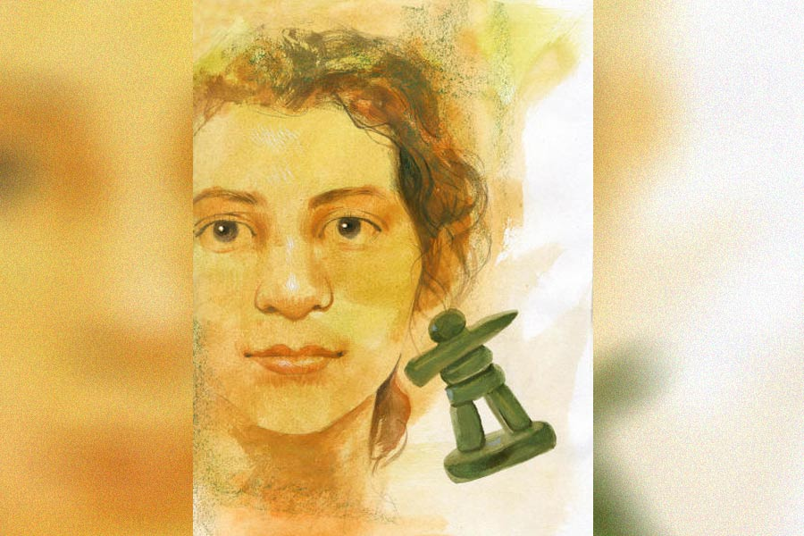

 
 <h1 align=center>ইনুকশুক</h1>
<h2 align=center>মোনালিসা চন্দ্র</h2> কাল ঝুনুকাকু আবার একটা গিফট দিয়েছে বুলিকে। ইঞ্চি ছয়েকের পাথুরে পুতুল একটা। বুলি পুতুল ভাবলেও কাকু বলেছে, ওটা ঠিক পুতুল নয়, একটা শো-পিস। তবে এ শো-পিসের মধ্যে ‘শো’-এর বালাই খুব কম, এক্কেবারেই কাঠখোট্টা। ছোট ছোট কয়েকটা পাথরের টুকরো আঠা দিয়ে জুড়ে জুড়ে কোনও মতে একটা মানুষের আদল দেওয়ার চেষ্টা। এটা যেন সেই প্রস্তর যুগের মানুষদের হাতে তৈরি জিনিস।

তবে বুলি মোটেই অখুশি নয় ওটা পেয়ে। ও জানে, এই গিফটের পিছনেও থাকবে একটা গল্প। ঝুনুকাকুর উপহারগুলো সব সময় অন্য রকমই হয়। নারকেলের হাতি, ঝাউয়ের ফুল কিংবা ম্যালাকাইটের টুকরো। তার পর আজ এই অদ্ভুত পুতুল। তবে এই সব উপহারের গায়ে যে গল্পগুলো লেগে থাকে, সেগুলো বুলিকে আনন্দ দেয় অনেক বেশি।

কাজের জন্য ঝুনুকাকুকে প্রায়ই দেশ-বিদেশে ঘুরে বেড়াতে হয়। কাজের ফাঁকে ফাঁকে ওই সব দেশের আনাচকানাচ ঘুরে নেয় কাকু। ধু বেড়ানোর জন্যেও অনেক জায়গায় যায় কাকু। ওই সব ভ্রমণের ফলে কাকুর ঝুলিতে ভাল ভাল যে গল্পগুলো জমে, বুলি ভাগ পায় সেগুলোর।

অফিস এ বার কাকুকে পাঠিয়েছিল কানাডায়। অফিসের কাজ মিটে যেতেই কাকু টরন্টো থেকে গেছিল নুনাভাট। নুনাভাট এক আশ্চর্য জায়গা। বছরের বেশির ভাগ সময় সে জায়গা বরফের নীচে থাকে। আসলে এস্কিমোদের দেশ। এস্কিমোদের কিন্তু এখন আর এস্কিমো বলা হয় না, বলতে হয় ইনুইট। একগাদা ছোট ছোট দ্বীপ নিয়ে তৈরি নুনাভাটের রাজধানীর নাম ইকালুইট। সেই ইকালুইট-এ বেড়াতে গিয়েছিল ঝুনুকাকু, আর সেখানে গিয়ে খোদ ইনুইটদের সঙ্গেই নাকি কয়েকটা দিন কাটিয়ে এসেছে এ বার। তবে ঝুনুকাকু ইগলুতে থাকেনি। ইনুইটরাও আজকাল আর ইগলুতে থাকে না। দল বেঁধে কয়েক দিনের জন্য ওরা যখন সিল আর সিন্ধুঘোটক শিকার করতে যায়, তখনই কেবল ধু-ধু বরফমাঠে ইগলু বানিয়ে থাকে।

যে পুতুলটা বুলিকে এ বার এনে দিয়েছে ঝুনুকাকু, তার নাম ‘ইনুকশুক’। ইনুকশুক হল ইনুইটদের বন্ধু। উত্তর মেরুর কাছাকাছি বরফ ঢাকা এই জায়গাগুলোয় পথঘাট তৈরি করার কথা ভাবা যায় না। গাছ, নদী, পাহাড়পর্বত বলেও সেখানে কিছু নেই। পথের নিশানা বোঝা খুব কঠিন। ওই সব জায়গায় খাদ্যের খোঁজে বেরোতে হয় যাদের, পথ চিনে চিনে এগিয়ে যাওয়ার জন্য ইনুকশুকেরাই সাহায্য করে ওদের। তাদের পাথুরে শরীরের দু’পাশে হাতের মতো দেখতে যে অংশদুটো, সেই ‘হাত’ই ট্র্যাফিক সিগন্যালের মতো দিকনির্দেশ করে ওদের। ওরা জানে, ইনুকশুকের দেখানো দিক ধরে চলতে শুরু করলে একটা সময় ঠিক শিকার মিলবে। জায়গায় জায়গায় তাই পাথর দিয়ে মস্ত মস্ত ইনুকশুক বানিয়ে রেখে গেছে ওদের পূর্বসূরিরা। অনেক অনুসন্ধানের পর মাছ শিকারের যে ‘উর্বর’ জায়গাগুলোর সন্ধান ওরা পেয়েছিল, তার নিশানা ওরা এই ভাবেই ওরা রেখে দিয়েছে অন্য দল বা উত্তরসূরিদের জন্য। খুব কষ্ট করে বাঁচতে হয় যাদের, তারা সাধারণত হিংসুটে হয় না, অন্যদের কথা ভাবে, বুলিকে বলেছে ঝুনুকাকু।

পাথরের উপর পাথর চাপিয়ে তৈরি করা এই মূর্তিগুলো ইনুইটদের কাছে তাই আশ্বাস আর ভরসার প্রতীক। নুনাভাট দেশটা পরে যখন কানাডার সঙ্গে মিশে যায়, ইনুকশুক তখন হয়ে ওঠে গোটা কানাডা দেশটারই বন্ধুত্বের প্রতীক।

কোথাও বেড়িয়ে আসার পর কাকু যে ভাবে গল্প বলে, তাতে সেই সব জায়গা ছবির মতো ভাসে বুলির চোখে। সে কানে শোনা গল্প আর নিজের কল্পনা দিয়ে গড়া নতুন দেশগুলোয় মনের আনন্দে ঘুরে বেড়ায়। যখন ম্যালাকাইটের টুকরোটা উপহার পেয়েছিল, তখন খনির গা ছমছমে সুড়ঙ্গে টর্চওয়ালা টুপি পরে ক’টা দিন কী ঘুরেই না বেরিয়েছিল বুলি। কয়েক দিন সুড়ঙ্গের গোলকধাঁধায় ঘুরে সুড়ঙ্গের শেষে অ্যালিসের ওয়ান্ডারল্যান্ডের মতো একটা দেশ পর্যন্ত খুঁজে পেয়েছিল ও, যে দেশের সব কিছু শুধু সবুজ সবুজ পাথর দিয়ে তৈরি।

ইনুকশুকটা রাখা ছিল টেবিলের উপর। খুব মন দিয়ে দেখতে দেখতে পুতুলটার মাথা-পাথরটার মধ্যে দুটো স্পট আবিষ্কার করে ফেলল বুলি, যাদের দিব্যি চোখ বলে ধরে নেওয়া যায়। নাকটাকে খুঁজে পেল না ঠিকই, তবে ঠোঁটদুটো হঠাৎ স্পষ্ট হয়ে উঠল। আসলে ঠোঁটদুটো থেকে একটুখানি হাসি আর হালকা একটা ‘হ্যালো’ বেরিয়ে এল বলেই ও দুটোকে খুঁজে পেতে সুবিধে হল বুলির। তার পরে আর ভাব হতে কত ক্ষণ?

শীতকালে ইনুইটদের দেশে রাতের আকাশে এক আশ্চর্য আলো খেলা করে। গালভরা এক নামও আছে তার। অরোরা বোরিয়ালিস। বাবা-মাকে সেই আলোর ছবি দেখাচ্ছিল কাকু। বুলিও দেখেছে।  তবে সে ছবি তেমন টানেনি বুলিকে। পরদিন সকালে ইনুকশুককে বারান্দায় নিয়ে গিয়ে সকালের আলো দেখাতে দেখাতে বুলি বলেছিল, “কাল তোমাদের আলো দেখেছি, আজ তুমি আমাদের আলো দেখো।”

চোখ সইয়ে নেওয়ার জন্য একটু ক্ষণ চোখ কুঁচকে রাখলেও কলকাতার ঝলমলে সূর্যের আলো খুব ভাল লেগেছিল ইনুর। ওর সবচেয়ে ভাল লেগেছে এ দেশের হরেক রঙের বাহার। চার দিকে কত রং এখানে! গাছগাছালির সবুজই কত রকমের! তার উপর হাজার ফুলের হাজার-একটা রং! ইনু তো ফুলই দেখেনি কখনও। দেখবে কী করে? ওদের দেশে সব তো শুধু সাদা।

ইনুকশুক নামটা খুবই পছন্দ হয়েছে বুলির, কিন্তু যার সঙ্গে সব সময় কথা বলতে হবে, তার নামটা এত বড় হলে চলে? ইনুকশুককে তাই ‘ইনু’ করে নিয়েছে বুলি।

ইনুকে শো-কেসে তুলে রাখেনি বুলি, রেখেছে পড়ার টেবিলে। রাতে নিজের পাশটিতে নিয়ে শোয়। ঘুম না আসা পর্যন্ত বকবক চলে তার সঙ্গে। তার পর ঘুমটি এলে শুরু হয়ে যায় আর এক মজা। ইনুইটদের একটা দলের সঙ্গে হারপুন হাতে বুলি তখন চলে যায় সিল শিকারে। বরফের উপর দিয়ে যেতে যেতে মাথা উঁচু করে দাঁড়িয়ে থাকা মস্ত একটা ইনুকশুক দেখতে পেয়ে ইনুইটদের দলটা যখন দিক ঠিক করে নিয়ে আরও এগিয়ে যায়, বুলি তখন দাঁড়িয়ে পড়ে। শিকার করতে যাওয়ার বদলে ইনুকশুকের পায়ের কাছে বসে পড়ে গল্প করে তার সঙ্গে। শিকার শেষে দলটা যখন ফেরে, ওদের সঙ্গে আবার ইগলুতে ফিরে আসে বুলি।

ইনু এখন বুলির বেস্ট ফ্রেন্ড। হবে না-ই বা কেন? সারা দিন ধরে বুলি যা-যা বলে, সব মন দিয়ে শোনে ও। ইশকুলের বা পাড়ার কোন বন্ধুটা এমন করে, শুনি? উল্টে ওরা বুলির চুল ধরে টানে, পিছনে লাগে, পেন্সিল সরিয়ে রাখে, টিফিন খেয়ে নেয়। রেক্টর ম্যাম বারণ করার পরেও ওরা ও সব থামায়নি, একটু কমিয়েছে।

হেল্প করতে ভালবাসে বলে বুলির হারিয়ে যাওয়া জিনিসপত্তর সব খুঁজে দেয় ইনু। সে দিন লিখতে লিখতে বুলির ইরেজ়ারটা হঠাৎ গেল হারিয়ে। টেবিল তোলপাড় করে যখন খুঁজছে বুলি, ইনু হঠাৎ ধুপ করে পড়ে গেল টেবিল থেকে। ভাগ্যে পাপোশটা ছিল সেখানে, তাই পড়ে গিয়েও সে ভাঙল না। কিন্তু কী আশ্চর্য, দেখা গেল ইনুর ঠিক পাশেই পাপোশের ওপর পড়ে রয়েছে ইরেজ়ারটা! বুঝল বুলি, ইরেজ়ারটা খুঁজে দিতেই ইনু লাফিয়ে পড়েছিল অমন করে।

মা-ই কেবল পছন্দ করে না ইনুকে। ইনুর সঙ্গে বুলির গল্প করাটাও মায়ের ঘোর অপছন্দের। মায়ের ভয়, সারা দিন নিজের মনে বকবক করতে করতে বুলি বুঝি এক দিন পাগলই হয়ে যাবে। মাঝে মাঝে এক জন আন্টির কাছে বুলিকে নিয়ে যায় বাবা-মা। সেই আন্টি খুব সুন্দর করে হেসে হেসে কথা বলে বুলির সঙ্গে। যে ছবিগুলো তার মনের মধ্যে তৈরি হয়, সেগুলোকে সব খাতায় লিখে ফেলতে বলে। কিন্তু লিখতে যে বুলির একটুও ভাল লাগে না, সে কথা কাকে বোঝাবে ও? তা ছাড়া অত্ত অত্ত কথা লিখতে গেলে সারা দিন তো শুধু লিখেই যেতে হবে বুলিকে।

আজকেও সেই আন্টির চেম্বারে বুলিকে নিয়ে গিয়েছিল মা। আন্টি আজও হেসে হেসে কথা বলেছে বুলির সঙ্গে। তবে সেই সঙ্গে এও বলেছে, বুলি যে শুধু একা একা থাকতে চায়, মা-বাবার কাছে আসতে চায় না, এতে নাকি মায়ের মনে খুব দুঃখ। বুলি যদি একটু মায়ের কাছে কাছে থাকে, মায়ের সঙ্গে গল্প করে আর মা ছোটখাটো যে কাজগুলো করতে বলবে সেগুলো করে, তা হলে মায়ের সব দুঃখ নাকি চলে যাবে।

কিন্তু বুলি আর কী করে! মা যে ওর কথাগুলোই শুনতে চায় না। ম্যালাকাইটের সুড়ঙ্গটা ধরে সবুজ পাথরের দেশে পৌঁছনোর পর বুলি তো সবার আগে মাকেই বলতে এসেছিল কথাটা। মা শুনলই না। উল্টে এমন কাঁদতে শুরু করল যে বুলিই গেল ঘাবড়ে! 

ইনু আজকাল হারানো জিনিসপত্র খুঁজে দেয় বুলিকে। তবে ও যাতে আর পড়ে না যায়, সে দিকে খুব খেয়াল রাখে বুলি। কোনও জিনিস খুঁজে না পেলে বুলি এখন ইনুকে দু’হাতে চেপে ধরে চোখ বুজে বনবন করে কয়েক পাক ঘুরে নেয়। তার পর চোখ খুলে দেখে ইনুর হাতদুটো কোন দুটো দিকে আছে। সেই দুটো দিকের যে কোনও একটা দিক খুঁজতে শুরু করলেই হারানো জিনিসটা পেয়ে যায় বুলি।

অনেক সময় অবশ্য রহস্য করতেও ছাড়ে না ইনু। গত সোমবার যেমন, খালি টিফিনবক্সটা খুঁজে খুঁজে হয়রান বুলি শেষে ইনুর শরণাপন্ন হল। সে যে দিকটা দেখাল, সে দিকে খুঁজতে গিয়ে টিফিনবক্সের বদলে পিঁপড়ের সারি দেখতে পেল বুলি। তার পর সেই সারি ধরে এগোতে এগোতে অবশেষে টিফিনবক্সটা পেয়ে গেল শু-র‍্যাকের পেছনে।

মায়ের ভয় আর মনখারাপ ক্রমশ বাড়ছে। ঝুনুকাকু সে দিন এসে মাকে বলছিল, আড়াল থেকে শুনে ফেলেছে বুলি, “অত ভয় পাও কেন, বৌদি? বুলির মতো অমন কল্পনাশক্তি ক’জনের হয়? আমি বলছি তোমাকে, বড় হয়ে নিশ্চয়ই এক জন মস্ত লেখক হবে ও।“

মা কান্নাভেজা গলায় বলে উঠল, “ওকে কেন ওই পুতুল এনে দিলে ঝুনু? ও যে সারা ক্ষণ শুধু পুতুলটার সঙ্গেই বকে চলেছে, ওর সঙ্গেই বরফরাজ্যে ঘুরে বেড়াচ্ছে।” 

পা টিপে টিপে ফিরে এসেছিল বুলি নিজের ঘরে।

সে দিন রাত্তিরে বিছানায় যাওয়ার সময় ইনুকে নিতে গেলে বুলি দেখে পড়ার টেবিল ছেড়ে সে কী করে যেন উঠে গেছে কাবার্ডের উপর, যেখানে বাচ্চা কোলে মা টেডিটা থাকে তার ঠিক পাশে। কেউ তুলে রেখেছিল হয়তো। নামাতে গিয়ে বুলি দেখে, এত ভারী হয়ে গেছে ইনু যে, তাকে নড়ানোই যাচ্ছে না! ইনুর একটা হাত টেডিটাকে ছুঁয়েই ছিল, এ বার চোখ দিয়েও কিছু একটা ইশারা করল সে।

বেস্ট ফ্রেন্ডের সব ইশারা এখন বোঝে বুলি। বিছানা থেকে তাই নিজের বালিশটা তুলে নিয়ে আর ইনুকে একটু আদর করে গুডনাইট বলে বুলি চলে এল মা-বাবার ঘরে। অবাক হয়ে যাওয়া মায়ের গলাটা জড়িয়ে ধরে বলল, “আমায় গল্প বলে বলে ঘুম পাড়াবে, মা? দেখো, আজ আমি একটুও বকবক করব না, চুপ করে শুধু শুনে যাব। বলো না মা, শোনাবে আমাকে, একটা গল্প?”