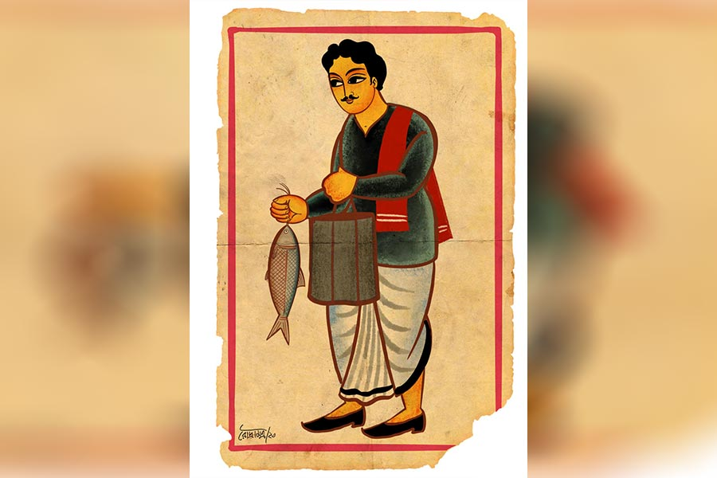

 
 <h1 align=center>ইলিশ</h1>
<h2 align=center>অলোক মুখোপাধ্যায়</h2> ভাদ্র পেরিয়ে আশ্বিন পড়ে গিয়েছে। বৃষ্টির প্রকোপ এখনও কমেনি। ভালই
চলছে। কাল থেকে টানা মুষলধারে হয়ে এখনও ঝিরঝির করে ইলশেগুঁড়ি হয়ে চলেছে। পরিতোষ
ভাবেন, এমন
ইলশেগুঁড়িতে বাজারে ইলিশের আমদানি বাড়ে। পরিতোষের বয়স হয়েছে, চাকরি থেকে অবসর
নিয়েছেন বেশ ক’বছর আগে। এখন হাতে টাকাপয়সার খুবই টানাটানি। তাই মনের মধ্যে ইলিশের
গন্ধ ভেসে এলেও কোনও উপায় নেই। এখন পরিতোষ ও সুমনা পুরোপুরিই ছেলের অধীন।

রাস্তায় সাইকেলের বেল। রিয়া দোতলার জানালার পর্দা সরিয়ে দেখে, মাছওয়ালা। বলে,
“কী গো, ভাল কিছু আছে?”

সাইকেলের পিছনের ঝাঁকায় রোজ থাকে পারশে, বাটা, চারাপোনা। কিন্তু আজ লোকটা দেঁতো হাসি
ছড়িয়ে বলে, “বৌদি, আজ শুধুই ইলিশ। একদম তাজা। কেজি, সোয়া কেজির নীচে একটাও নেই!”

রিয়া মুচকি হাসে, একটু অবাকও হয়। নীচে নেমে এসে বাইরের দরজা খুলে
ডাকে। ঝাঁকার উপর প্লাস্টিকের নীল ঢাকা। তার নীচে রুপোলি আলোর বিচ্ছুরণ। রিয়া
ঝাঁকায় হাত দিতে গেলে বলে, “বৌদি, আপনি পারবেন না। আমি ভাল দেখে বেছে দিচ্ছি। তার
পর খেয়ে দাম দেবেন।”

ঝাঁকার নীচ থেকে একটা প্রায় দেড় কেজি ওজনের একটা ইলিশ বের করে বলে,
“এ জিনিস কোথাও পাবেন
না বৌদি! একদম বাছাই করে আপনার জন্য এনেছি। তলায় লুকিয়ে রেখেছিলাম যাতে কারও নজর
না লাগে। এ জিনিসের কদর একমাত্র আপনিই দিতে পারেন। তাই…”

বারান্দায় বসে দেখছিলেন পরিতোষ। মাছখানা দেখে চোখ-মন ভরে যায়। যাক,
আজ তা হলে অনেক দিন
পর জিভের আড় ভাঙবে। এত বড় মাছ, তার স্বাদই আলাদা। লোকে যা-ই বলুক, খোকা ইলিশের সঙ্গে
খয়রার তেমন তফাত নেই। খেলে বড় ইলিশই খেতে হয়। বড় ইলিশের পেটিই বলো আর গাদাই বলো,
সবই অমৃত। দাম মনে
হয় হাজার তিনেক হবে। সত্যিই তো, এমন দাম দিয়ে মাছ তার খোকাই কিনতে পারে।

ছোটবেলায় কাটানো দেশের বাড়ির কথা মনে পড়ে পরিতোষের। মধুমতীর ইলিশ,
সে কি ভোলা যায়!
ইলিশ রান্না হলে সে দিন আর স্কুলে যেতে মন চাইত না। মন পড়ে থাকত মাছে। গরম ভাতে
তেল, এক পিস
গাদার মাছ ভাজা, মাছের ডিম ভাজা। আর তার পর গরগরে সর্ষের ঝালে ইলিশের পেটি। সে সব দিন
এখন শুধুই স্মৃতি!

রিয়া শাশুড়িকে ডেকে বলে, “এই যে শুনছেন, মাছটা ভাল করে কেটে, ধুয়ে রাখুন। এ ভাবে
পড়ে থাকলে, বেড়ালে নজর দেবে। আশপাশেই একটা হুলো বেড়াল ঘোরে না!”

সুমনা বলেই ফেলেন, “বৌমা, এত বড় ইলিশ, খুব স্বাদ হবে! কত দিন তোমার শ্বশুর এত বড়
ইলিশ চোখে দেখেননি। চাকরি থাকতে অবশ্য বাজারে আমদানি হলেই নিয়ে আসতেন, কখনও বাদ পড়েনি।”

রিয়া খর গলায় বলে, “আপনাকে আর মাছের গুণ গাইতে হবে না। যা বলেছি,
সেই কাজটা ভাল করে
করুন। একটা পিসও যেন এ দিক-ও দিক না হয়। আপনার ছেলের কানে গেলে কিন্তু খুব রাগ
করবে।”

বৌমার কথায় সুমনা বেশ কষ্ট পান। পাওয়ারই তো কথা। ছেলে কি তাঁর কেউ নয়!
ছেলে ভাল রোজগারও করে। তা ছাড়া ছেলের চাকরি তো ওর বাবা-ই করে দিয়েছেন কোম্পানির
এমডি-কে ধরে।

সুমনাকে মাছ কাটতে দেখে পরিতোষ ভাবেন, আজ তা হলে কপাল খুলে গেল। সুমনাকে বলেন,
“সুমনা, আজ অনেক দিন পর তা
হলে জিভের স্বাদ পাল্টানো যাবে।”

সুমনা বলেন, “তোমার বড্ড লোভ। দেখলে না, মাছের পিসগুলো সব ধরে উপরে ফ্রিজে তুলে
রেখে এল। ও-মাছ আমাদের কপালে নেই। বলিহারি তোমার! এত দিনেও মানুষ চিনলে না তুমি!”

প্রায় তিরিশ বছর আগের কথা। পরিতোষ কলকাতার একটা নামী কোম্পানির বড়বাবু
ছিলেন। ভালই মাইনে পেতেন। টাকাপয়সার অভাব ছিল না। ভাল উপরিও ছিল। বড় বড় অর্ডার
ধরতে পরিতোষের কলমের আঁচড় লাগত। কোম্পানির কুর্সিতে বসে অনেকেই বেশ মোটা মাল
কামাতেন। পরিতোষও একটু আধটু হাত পাকিয়েছিলেন।

বেশ ভোজনরসিক ছিলেন পরিতোষ। রবিবারে সারা সপ্তাহের মাছ আর আনাজপাতি
কিনে ফ্রিজে রেখে দিতেন। এ ছাড়াও, অফিস-ফিরতি যদি কোনও ভাল মাছ বা নতুন আনাজ পেতেন,
তা হলে ব্যাগে পুরে
নিতে কালবিলম্ব করতেন না। সুমনা মাঝেমধ্যে বিরক্ত হয়ে বলতেন, “সমস্ত বাজারটা তুলে
আনতে পারলেই বোধ হয় খুশি হতে।”

পরিতোষ সহাস্যে বলতেন, “এখন পাচ্ছ, পেট ভরে, মন ভরে খাও। পরে ছেলের জমানায় কী হবে
কিচ্ছু বলা যায় না গিন্নি।”

সুমনা কথাটায় খুশি হতেন না, “দেখো, আমি অমন ছেলে পেটে ধরিনি। সে আমাদের খেতে দেবে না,
এমনটা কখনও হতে পারে
না।”

সে রকম সময়ে বর্ষার এক রবিবারের কথা আজও মনে পড়ে। মাছওয়ালা পরিতোষকে
দেখেই দাঁত বার করে বলল, “এই যে সার, এ দিকে আসুন। আজ খাসা মাল আছে। একদম মাখন।
মুখে দেবেন আর মিলিয়ে যাবে।”

এই বলে সে প্রায় কেজি দুয়েকের একটা ইলিশ তুলে ধরে বলল, “নিয়ে যান সার। এ
জিনিস ভাগ্যে থাকলে মেলে, বহু লোক অনেক টাকা কবুল করেও পায় না। এ সবের দাম
আপনার মতো লোকই বুঝবে।”

পরিতোষ অমনি মাছটা নিয়ে নিলেন। দরাদরির রাস্তায় গেলেন না। মাছওয়ালা
টাকাগুলো কপালে ঠেকিয়ে বলল, “বাজারে এলে, এখানে এক বার ঢুঁ মেরে যাবেন সার। আপনার
ভাগ্যটা খুব ভাল। পদ্মার আসলি ইলিশ পেয়ে গেলেন।”

বাড়িতে ব্যাগ থেকে ইলিশটা বার করতেই সুমনার চোখ চড়ক গাছ, “এত্ত বড় ইলিশ! এ তো
অনেক দাম! এত টাকা দিয়ে তুমি…”

“আরে দূর! তুমি সব সময় খরচের কথাই বলো। টাকা চিরদিন থাকবে না। টাকা আয়
করা তো খরচের জন্যই। আত্মা যা চায়,তাই দাও, বুঝলে। আত্মাকে কষ্ট দিয়ো না, তা হলে মরেও শান্তি
পাবে না। তোমাকে আগেও বলেছি, আমার জমানায় মন ভরে খাও। পরে কপালে কী আছে,
তার ঠিক নেই। ভাল
করে ভাজো দেখি! আগে দু’পিস ভাজা খেয়ে জিভের আড় ভাঙি, তার পর অন্য কথা। তোমার হাতের ইলিশ ভাপা,
সর্ষে-ইলিশের যে কী
স্বাদ, যে না
খেয়েছে, সে
জীবনে বুঝবে না!”

একটা প্লেটে দুটো ভাজা ইলিশের গাদা এনে দিলেন সুমনা। মাছ দু’পিস খেয়ে
তেল মুখেই সুমনার গালে চকাস করে চুমু খেলেন পরিতোষ।

“আঃ! কী যে করো না, কেউ দেখলে কী ভাববে বলো তো!”

“মাছটা এত সুন্দর হয়েছে যে, তোমাকে এই উপহারটা না দিয়ে পারলাম না।... যাকগে,
তোমায় একটা ভাল খবর
দেওয়ার আছে, আমাদের কোম্পানিতে ছেলের চাকরির একটা ব্যবস্থা করে ফেলতে পারব মনে
হচ্ছে।”

“তাই নাকি! তা হলে তো খুবই ভাল খবর!”

“আমি তো আগামী বছরেই চাকরি থেকে অবসর নেব। বড়সাহেবকে বলে আমাদের
কোম্পানিতে কাজলের একটা হিল্লে করা যেতে পারে। তবে বেশ কিছু টাকা খসাতে হবে।
রিটায়ারমেন্টে যা পাব, আর যা জমানো আছে, সব মিলিয়ে মোট যা হওয়ার কথা, তার প্রায় আশি
শতাংশই দিয়ে দিতে হবে। উপায় নেই, আমাদের কোম্পানির এ রকমই নিয়ম।”

সে দিন পরিতোষ কিংবা সুমনা, কারও মনই কু গায়নি। ছেলের চাকরির জন্য এটুকু করতে
পারবেন না তাঁরা!

পরিতোষ মোটা টাকার বিনিময়ে ছেলের চাকরি পাকা করে দিয়েছিলেন। আর বাকি
টাকা খরচ করে ছেলের বিয়ে দিয়েছিলেন। সে সবই আজ ধূসর স্মৃতি মাত্র! সেই কারণেই আজ
তাঁর হাতে টাকাপয়সার কোনও সংস্থান নেই। ছেলের উপরই পুরোপুরি নির্ভরশীল।

ছেলে ঋভুকে দু’পিস ইলিশভাজা দিয়ে গরম ভাত বেড়ে দিয়ে রিয়া বলে,
“তাড়াতাড়ি খেয়ে
স্কুলড্রেস পরে রেডি হয়ে নাও। বাসের সময় হয়ে গেল।”

পরিতোষ বলেন, “রিয়া, এক কাপ চা দেবে মা?”

“আর চা করতে পারব না বাবা। এই সকালেই তো খেলেন। তা ছাড়া, আমার তাড়া আছে,
কলকাতা যেতে হবে।
আপনাদের খেতে দিয়েই বেরোব। ফিরতে দেরি হবে। অনেক কেনাকাটা আছে।”

পরিতোষ আর সুমনাকে ভাত দেয় রিয়া, সঙ্গে ফালি করে কাটা আলু দিয়ে করা
পোলট্রির ডিমের ট্যালটেলে ডালনা।

থালা এগিয়ে দিয়ে বলে, “তাড়াতাড়ি খেয়ে উদ্ধার করুন।”

পাতে শুধুই পোলট্রির ডিম দেখে পরিতোষ তেলে-বেগুনে জ্বলে ওঠেন, নিজেকে সামলে বলেন,
“রিয়া, অতগুলো ইলিশ মাছ কী
হল!”

“ওগুলোর দিকে নজর দেবেন না। আপনার ছেলে ফিরলে তার পর রান্না হবে...”
বলে বেরিয়ে যায় রিয়া।

ইলিশ ভাজার সময় গোটা ঘর গন্ধে ম-ম করছিল। প্রাণভরে গন্ধ উপভোগ করেছেন
পরিতোষ, আর এখন
যদি খাবার সময় পোলট্রির ডিম খেতে হয়, তা হলে কার না রাগ হয়!

পরিতোষের চোখে জল। ধীরে ধীরে ভাতের থালাটা সরিয়ে রাখেন পরিতোষ। সুমনা
বলেন, “দুঃখ
কোরো না। সবই নিয়তির পরিহাস!”

পরিতোষ ভাবেন, এই সংসারে আর শান্তি ফিরে আসবে বলে মনে হয় না।

ইতিমধ্যে ঋভু ফিরে আসে স্কুল থেকে। সে বুঝতে পারে, পরিস্থিতি থমথমে।
দাদুর কাছে এসে সে জিজ্ঞেস করে, “দাদু, ভাত খাওনি? তোমার মুখটা এমন শুকনো কেন!”

“তুই এত তাড়াতাড়ি ফিরে এলি কী করে?”

“আমাদের স্কুলের এক জন প্রাক্তন শিক্ষক মারা গেছেন। এক মিনিট নীরবতা
পালন করে ছুটি হয়ে গেল। মা তোমাদের ইলিশ দেয়নি, না! দাঁড়াও দেখছি। দাদু তোমার ফোনটা দাও
তো।” ঋভু বুঝতে পারে, ওর মা ফ্রিজে মাছ তুলে রেখে চাবি নিয়ে চলে গেছে। ডাইনিং টেবিলে পড়ে
থাকা ডিমের ঝোল-ভাত দেখে সে গোটা ঘটনাটা আন্দাজ করে নেয়।

ঋভু ওর বাবাকে ফোন করে, “হ্যালো বাবা!”

ও পার থেকে কাজল প্রশ্ন করে, “তুমি স্কুলে যাওনি? দাদুর ফোন থেকে ফোন করলে!”

“হ্যাঁ গেছিলাম। এক জন প্রাক্তন মাস্টারমশাই মারা গেছেন, তাই ছুটি হয়ে গেছে।”

“ওহ, সো স্যাড!”

“বাবা, মা আজ ইলিশ কিনেছে। খুব বড় মাছ গো!”

“সে তো ভাল খবর।”

“না বাবা। ভাল খবর নয়। মা আমাকে দিয়েছে দু’পিস ইলিশ ভাজা। কিন্তু
দাদু-ঠাকুমাকে একটুও দেয়নি। ওদের শুধুই ডিমের ডালনা দিয়ে ভাত দিয়েছে। দাদু রাগে
অভিমানে ভাত খায়নি। আমার খুব খারাপ লাগছে জানো। কী করি বলো তো!”

কাজল কয়েক সেকেন্ড চুপ করে থেকে বলে, “শোন মন দিয়ে। টিভি টেবিলের উপরে যে
ফুলদানি আছে, তার ভিতরে সব ডুপ্লিকেট চাবিগুলো থাকে। ফ্রিজেরটাও আছে। ফ্রিজ খুলে
চার পিস মাছ বের করে দাদু-ঠাকুমাকে দিবি। ঠাকুমাকে দিয়ে ভাজা করিয়ে জোর করে
খাওয়াবি। তার পর মাছের থালা ফ্রিজে তুলে চাবি দিয়ে চাবি জায়গামতো রেখে দিবি।”

ঋভু বলে, “কিন্তু মা সব পিস গুনে তুলেছে।”

কাজল বলে, “ছাড় তো! কথা তুললে কোনও উত্তর দেওয়ার দরকার নেই। কাকে সাক্ষী রেখে
গুনেছে? কে জানে,
ফ্রিজে ক’টা মাছ আছে?
চাবি দেওয়া ফ্রিজ
থেকে মাছ কী করে গায়েব হতে পারে? তোর মা ভেবে নেবে, নিশ্চয়ই গোনা আর তোলার মাঝখানে কোনও এক
সময় চালাক হুলোটা এসে... বুঝেছিস?”

ঋভু বাবার কথামতো সব কাজ করে, আর মায়ের হয়ে নিজে দাদু-ঠাকুমার কাছে ক্ষমা চেয়ে
নেয়। বিকেলের কাজের লোকের হাত দিয়ে পাচার হয়ে যায় না-খাওয়া ডিমের ডালনা।
দাদু-ঠাকুমার খাওয়ার পর সমস্ত কাঁটাকুটো বাইরে ফেলে আসা হয়। বাসনপত্র মেজে ঘরে রুম
ফ্রেশনারও ছড়ানো হয়। ইলিশ মাছের গন্ধ ঢাকা কি সোজা কথা!

রিয়া কলকাতা থেকে ফিরে এসে মাছ বার করে অবাক! রাতে কাজল বাড়ি ফিরে
রিয়ার কাছে ঘটনার আদ্যোপান্ত বর্ণনা শুনে বলে, “এ তো স্বাভাবিক! তোমার মন পড়েছিল শপিংয়ে।
কী গুনতে কী গুনেছ, তুমিই জানো। না হলে গুনে রেখে হয়তো কোথাও চোখের আড়াল হয়েছ, হুলোটা কাজ সেরে
পালিয়েছে...”

ঋভু ওর মায়ের অলক্ষে বাবার দিকে তাকিয়ে মুচকি হাসে। কাজল ঋভুর মাকে
আড়াল করে ঋভুর হাতে আলতো চাপ দেয়।

নিজের ঘরে হজমের ওষুধ খাচ্ছিলেন পরিতোষবাবু। দেখতে পেয়ে উদ্বিগ্ন
সুমনা বললেন, “তোমার কি অ্যাসিডিটি হল নাকি?”

বিষণ্ণ হেসে পরিতোষবাবু বলেন, “না গো গিন্নি, নিজের ছেলের সংসারে বেড়াল হয়ে চুরি করে
খাওয়া মাছটা পেটে বড্ড ফুটছে। নাতিটা কষ্ট পাবে বলেই... না হলে আমি...”

মাথা নিচু করে বসে রইলেন সুমনা। হঠাৎ বৃষ্টি নামল। চার দিক আচমকাই
ঝাপসা।