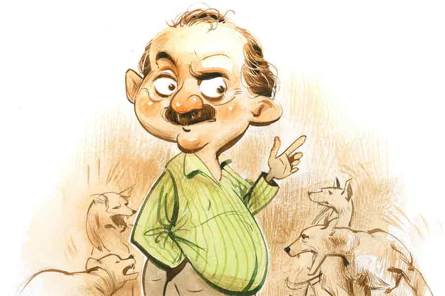

 
 <h1 align=center>উত্তম পুরুষ</h1>
<h2 align=center>কমলেশ কুমার</h2> 

কুকুরগুলো ডেকেই চলেছে। দিবাকর সমাদ্দার কথার মাঝে একটু থামলেন। কথা বলতে বলতে থামতে হলে তাঁর মুখে বিরক্তির ছাপ স্পষ্ট ফুটে ওঠে।

এত ক্ষণ সুমথনাথকে তিনি দেশের বর্তমান পরিস্থিতি বোঝাচ্ছিলেন।

সুমথনাথের পাইকারি লোহালক্কড়ের ব্যবসা। পাড়ার খুচরো নেতাদের টুকটাক চাঁদা দেওয়া ছাড়া তাকে দেশ নিয়ে বেশি ভাবতে হয় না। কোথায় বোমা পড়ছে, ভোটের সময় কত জন নেতা দল বদল করল, কোন দল নারীশক্তিকে প্রণাম জানাচ্ছে, কোন দল কৃষকদের সম্মান জানানোর জন্য উঠেপড়ে লেগেছে, কোন দল কী কী গ্যারান্টি দিল— এ সব তার বিচার্য বিষয় নয়, বরং সুমথনাথ ভাবে, কী ভাবে বিল্ডিংয়ের উপকরণ আরও বাড়ানো যায় দোকানের স্টকে।

চাবি, হুক, তালা, প্লাস্টিকের কব্জা, জানলা-দরজার ছিটকিনি, এ সব নিয়েই তার দিন কাটে।

সুমথনাথ সব সময় চেষ্টা করে দিবাকর সমাদ্দারের ছোঁয়াচ এড়িয়ে চলতে। কিন্তু দিবাকরবাবু দূরে থাকার মানুষ নন।

আজ সন্ধ্যাতেই যেমন তিনটে ডিমের ডেভিল কিনে সুমথনাথের খগড়িয়া হার্ডওয়্যারে এসে হাজির হয়েছেন। খগড়িয়া হার্ডওয়্যার সুমথনাথের দাদুর হাতে তৈরি। তিনি এসেছিলেন বিহার থেকে।

বৌয়ের আদেশে দিবাকরবাবু ডিমের ডেভিল কিনতে বেরোলেও এখন তিনি দেশের এক জন অত্যন্ত সচেতন নাগরিকের মতো বলে চলেছেন, “একটি দেশ ধ্বংস হওয়ার জন্য জঘন্য রাজা, ঘুমন্ত প্রজা এবং সমাজমাধ্যমের খেয়োখেয়িই যথেষ্ট। কী বলো, ভাই সুমথনাথ?”

দাঁড়িপাল্লায় পেরেক মাপতে মাপতে সুমথনাথ জবাব দিল, “সত্যি দাদা, রাজা আর প্রজারাই যত নষ্টের মূল। দেশটা শেষ করে দিল একেবারে।”

দিবাকর সমাদ্দার প্রথমে কিছু বললেন না। সুমথনাথকে কিছু ক্ষণ গভীর ভাবে পর্যবেক্ষণ করলেন। একটু এ দিক-ও দিক তাকিয়ে বললেন, “শেখার ইচ্ছা নিয়ে শোনো ভায়া, শোনার মাধ্যমেই পরিবর্তন ঘটে জগতের।”

সুমথনাথ অপেক্ষমাণ ক্রেতাটির জন্য পেরেকের গোছা প্যাকেটে মুড়তে মুড়তে খানিক জিভ বার করল, লজ্জিত মুখে বলল, “আমি শুনেছি দাদা, সোশ্যাল মিডিয়ায় তো সারা দিন হাজার হাজার বিষয় নিয়ে তরজা চলছেই।”

দিবাকরবাবু হতভম্ব হলেন। হতাশও হলেন খানিকটা। তবুও দমে না গিয়ে গভীর ভাবে শ্বাস টেনে বললেন, “শ্রীনগরের কী অবস্থা ভাবো! বড় বড় জঙ্গি সংগঠন ক্রমশ প্রভাব বিস্তার করতে শুরু করেছে। দেশ জুড়ে বেড়ে উঠছে সন্ত্রাসবাদী কার্যকলাপ, আর আমরা কী করছি?”

“কী করছি, দাদা?”

সুমথনাথের হাঁ হয়ে যাওয়া মুখের দিকে তাকিয়ে দিবাকর সমাদ্দার বললেন, “ডিমের ডেভিল খাচ্ছি। বৌয়ের হুকুম তামিল করছি!”

এত ক্ষণ দিবাকরবাবুর হাতের দিকে নজর পড়েনি সুমথনাথের, হঠাৎ চোখ পড়ে যাওয়ায় বলল, “বৌদি চপ আনতে পাঠিয়েছিল বুঝি! তা হলে তো আর আপনার অপেক্ষা করা একদম ঠিক হবে না দাদা! বৌদি ভীষণ রাগ করবেন!”

“শোনো সুমথনাথ,” চেয়ার ছেড়ে উঠে চলে যাওয়ার বদলে আরও জাঁকিয়ে বসে দিবাকরবাবু বললেন, “শহরের অলিতে গলিতে বহুতল বিপর্যয় ঘটছে, ছারপোকার মতো মানুষ মরছে। কলকাতার উপকণ্ঠে বসে আইফেল টাওয়ার উড়িয়ে দেওয়ার ছক কষছে উগ্রপন্থীরা, আর আমরা কী করছি! রাগ, অভিমান, তাপ-উত্তাপের ঠুনকো সেন্টিমেন্ট আগলে গোটা জীবন কাটিয়ে দিচ্ছি। ছ্যাঃ!”

সুমথনাথ কী বলবে না বুঝে চুপচাপ বসে থাকল খানিক, তার পর উঠে দাঁড়িয়ে গণেশের মূর্তির সামনে ধূপ জ্বেলে দিতে দিতে বলল, “হোম মিনিস্টার খেপে গেলে রক্ষে নেই দাদা। ঘণ্টাখানেকের ওপর আপনি বাইরে রয়েছেন...”

আরও কিছু বলতে যাচ্ছিল সুমথনাথ, তাকে মাছি তাড়ানোর ভঙ্গিমায় থামিয়ে দিয়ে দিবাকরবাবু বললেন, “সিয়াচেনে শীতকালে তাপমাত্রা মাইনাস ছিয়াশি ডিগ্রি সেলসিয়াসে নেমে আসে, প্রতি ঘণ্টায় তিনশো কিলোমিটার বেগে তুষারঝড় হয়। এ সব জানা আছে তোমার?” কথাটা বলে সুমথনাথের উত্তরের অপেক্ষা না করেই দিবাকরবাবু বলে চললেন, “গড় তাপমাত্রা দিনের বেলা মাইনাস পঁচিশ ডিগ্রি সেলসিয়াস আর রাতে মাইনাস পঞ্চান্ন ডিগ্রি সেলসিয়াসের মধ্যে থাকে। সেখানে আমাদের ছেলেরা বুক চিতিয়ে লড়াই করছে। কাদের জন্য করছে?”

সুমথনাথ এ বার বোধহয় একটু আগ্রহী হল। দিবাকরবাবুর পাশের চেয়ারে বসে প্রশ্ন করল, “আপনার কোম্পানির ছেলেরা বুঝি? আপনাদের কোম্পানির ও দিকেও ব্রাঞ্চ আছে?”

সুমথনাথের হাঁ হয়ে যাওয়া মুখের দিকে তাকিয়ে একরাশ বিরক্তি ছুড়ে দিলেন দিবাকর সমাদ্দার, “বেসিক কনসেপ্টটাই যদি ক্লিয়ার না হয়, দেশের সচেতন নাগরিক হবে কী করে?” একটু থেমে কথাটির ব্যাখ্যা দিলেন তিনি নিজেই, “আমাদের সৈনিকরা দেশসেবার কাজে ব্রতী হয়েছিল বলেই নিশ্চিন্তে তুমি পেরেক সাপ্লাই করতে পারছ। মোড়ের মাথার প্যালা শান্তিতে চপ ভাজতে পারছে। ওই কুত্তাগুলো তখন থেকে নিশ্চিন্ত মনে ডাকতে পারছে। অথচ আমরা...” খানিকটা সময় চুপ থেকে নিচু গলায় বললেন দিবাকরবাবু, “আমরা শুধু আমাদের বৌ, বাচ্চা, শেয়ার মার্কেট, পেরেক, মাটন, দিঘা, পুরী ছাড়া কিছু বুঝতেই চাই না!”

বলতে বলতে আবেগমথিত হয়ে উঠল তাঁর গলা, “গীতা এক জায়গায় কী বলেছে জানো ভায়া?”

সুমথনাথ প্রমাদ গুনল মনে মনে। বিরস মুখে একটা ঢোক গিলে বলল, “গীতা আমার মাসির মেয়ের নাম দাদা, ভাল নাম গীতশ্রী। আমরা গীতা বলে ডাকি। সে তো বিশেষ কিছু বলে না!”

সুমথনাথের কথা কেড়ে নিয়ে আগুনচোখে তাকিয়ে বললেন দিবাকরবাবু, “সঙ্কোচের বিহ্বলতা নিজেরে অপমান। কথাটা কে বলেছিলেন জানো?”

নীরবে ঘাড় নাড়ল সুমথনাথ। ও বিহারের সমস্তিপুর জেলার বাসিন্দা। তার দাদু সত্তর বছর আগে বাংলায় চলে এসে এই হার্ডওয়্যারের দোকানটা খুলেছিল। বাংলায় থাকলেও তার কৃষ্টি ও সংস্কৃতির সঙ্গে এখনও পুরোপুরি অভিযোজিতহতে পারেনি সে।

তাকে নীরব থাকতে দেখে সুমথনাথ বলল, “রবীন্দ্রনাথ ঠাকুর বলেছেন। নিজের জ্ঞানকে জাগ্রত করতে হবে। তা হলে অন্ধকার নিজে থেকেই হুস করে পালিয়ে যাবে। কিসের ভয়! এই ভারতবর্ষ তোমার-আমার সকলের দেশ। তবে এখানে বাস করতে ভয় পাব কেন? মনের জাগ্রত ইচ্ছে তোমার সকল প্রশ্নের উত্তর দেবে!”

সুমথনাথ উসখুস করতে শুরু করেছে। দু’-এক জন ক্রেতা আসছে। তাদের প্রয়োজনীয় জিনিসপত্রগুলো দিতে দিতেই দিবাকর সমাদ্দারের কথা শুনছে।

সুমথনাথের এই এক দোষ। কাউকেই ও অপছন্দের কথাটা জানিয়ে উঠতে পারে না। বিয়ের আগে চম্পাকলিকে একটুও পছন্দ হয়নি ওর। কিন্তু বাবা-মা আত্মীয়স্বজনের জোরাজুরিতে বিয়েটা শেষ পর্যন্ত করতেই হয়।

দিবাকর সমাদ্দার তার দোকানে প্রায়ই আসেন। এসেই গোটা দেশের বিভিন্ন বিষয় নিয়ে আলোচনা শুরু করেন। কিছু কথা সুমথনাথের মাথায় ঢোকে, বেশির ভাগই তার ক্লাস এইট অবধি বিদ্যের মাথার উপর দিয়ে বেরিয়ে যায়।

সুমথনাথকে চুপ থাকতে দেখে দিবাকরবাবু বললেন, “যা বলছিলাম। গীতা এক জায়গায় বলছে, আমাদের অবাধ্য মনকে সংযত করা খুব দরকার। পরমাত্মার ধ্যান, তীর্থবাস আর ব্রহ্মচর্যের দ্বারা সেটা সম্ভব। অথচ দেখো, ভগবান শ্রীকৃষ্ণের লীলাকথা শোনার মতো ধৈর্য ও সময় কোনওটাই আজ আমাদের নেই। আজকের প্রজন্মের ছেলেদের কথাটা এক বার ভাবো!”

দিবাকরবাবুর কথামালার সাময়িক বিরতিতে সুমথনাথ আড়চোখে দেওয়াল-ঘড়িটার দিকে এক বার তাকাল। আটটা পঁয়ত্রিশ বাজে।

ভাবল, বৌদির ডিনারের সময় হয়ে গেল বোধহয়! কিন্তু সাহস করে কথাটা সে আর বলে উঠতে পারল না।

দিবাকরবাবু সুমথনাথের দিকে বড় বড় চোখে তাকিয়ে বললেন, “এই যেমন তুমি! যখন আমি ভবরোগ নিরাময়ের উপযুক্ত পথ্যের সন্ধান দিচ্ছি, জড় বিষয় থেকে মনকে অনাসক্ত করার উপায় বাতলে দেব ভাবছি, তখন খালি দেওয়াল-ঘড়িটার দিকে বার বার উঁকি মারছ! অর্থাৎ মনকে সংযত করতে পারছ না। আমাদের চার পাশে হাজার প্রলোভন। ভোগসুখ কিন্তু আসল জীবন নয়। ত্যাগ, তিতিক্ষা, সহমর্মিতা হল আমাদের জীবনের আসল সম্পদ।” একটু থামলেন দিবাকরবাবু। ডিমের ডেভিলের ঠোঙাটা পাশের টেবিলে রেখে বললেন, “গীতার যথাযথ অর্থ যদি আমরা উপলব্ধি করতে চাই, তা হলে আমাদেরও অর্জুনের মতোই ভগবানের সব ক’টি নির্দেশ পুঙ্খানুপুঙ্খ ভাবে গ্রহণ করতে হবে। এখন প্রশ্নটা হচ্ছে...”

দিবাকরবাবু কথার দমটা পুনরায় বাড়ানোর আগেই কুকুরগুলো গলা উঁচিয়ে ডেকে উঠল। পাড়া-বেপাড়ার বহু কুকুর এসে জমা হয়েছে সুমথনাথের দোকানের সামনে।

সুমথনাথ দোকান থেকে দু’পা বেরিয়ে এ দিক-ও দিক তাকিয়ে দেখতে লাগল কুকুরগুলোকে। কিন্তু তাদের চিৎকারের কারণটা বুঝতে পারলনা কিছুতেই।

দিবাকরবাবু কুকুরগুলোর দিকে ভাবলেশহীন ভাবে তাকালেন এক বার। সুমথনাথ চেয়ারে বসতেই তিনি গম্ভীর হয়ে বললেন, “মহাভারতেও যে কুকুরের সন্ধান দেওয়া আছে, সেটাও নিশ্চয়ই তোমার অজানা!”

“মহাভারতে কুকুর!”

“তবে আর বলছি কী! এ রকমই নেড়িকুত্তা!” বলে চললেন দিবাকর সমাদ্দার, “পাণ্ডবরা তাদের রাজ্য ত্যাগ করার সঙ্কল্পে দৃঢ় ছিল এবং তাদের চূড়ান্ত যাত্রার অংশ হিসাবে হিমালয়ের একটি মেরু পাহাড়ে আরোহণ শুরু করেছিল। যুধিষ্ঠির পথ দেখিয়েছিল ভীম, অর্জুন, নকুল, সহদেব এবং দ্রৌপদীকে। তাঁদের যাত্রাপথে একটি কুকুরও তাঁদের সঙ্গে ছিল।”

“তাই নাকি!” ফোঁস করে একটা দীর্ঘশ্বাস ফেলে সুমথনাথ বলল, “কুকুরটা নিশ্চয়ই যুধিষ্ঠিরের খুব পেয়ারের ছিল!”

সুমথনাথের কথাকে পাত্তা না দিয়ে দিবাকরবাবু বললেন, “কুকুরটি ধর্মের ঈশ্বরে রূপান্তরিত হয়েছিল এবং ইন্দ্রের রথে যুধিষ্ঠির স্বর্গে উঠেছিল।”

দিবাকরবাবুর কথা শেষ হওয়ার আগেই অন্তত আট-দশটা কুকুর লাফিয়ে ঝাঁপিয়ে পাড়া মাথায় করে তুলল। তারা সকলেই সুমথনাথের দোকানের দিকে তাকিয়ে ডেকে চলেছে প্রাণপণে।

কুকুরগুলোর দিকে তাকিয়ে দিবাকরবাবু বললেন, “কুকুর আগামী সময়ের বার্তা বহন করে। কোনও অশুভ আত্মা চার পাশে ঘোরাফেরা করলে, কিংবা কেউ মারা গেলে কুকুর বুঝতে পারে। তাই তারা ডাকে। কিন্তু এখানে কী ঘটছে!”

“আমি ছোটবেলায় শুনেছিলাম কুকুরের ঘ্রাণশক্তি খুব ভাল,” সামান্য আত্মবিশ্বাসী হয়ে সুমথনাথ বলল, “চোর, ডাকাত, খুনি, বাটপাড় দেখলেই নাকি ওরা চিৎকার করে! কিন্তু আমাদের পাড়ায় সে রকম লোক কি একটাও আছে?”

কিছু বলতে যাচ্ছিলেন দিবাকরবাবু। তার আগেই পকেটের ফোনটা বেজে উঠল। ওটা কানে দিতেই ঝামরে পড়ল তাঁর স্ত্রীর গলা, “একটা কাজ দিয়ে শান্তি নেই গো! যেখানেই যাবে, সেখানেই শেকড় গজিয়ে তবে বাড়ি ঢুকবে! আমি রাতের খাবারের সঙ্গে ডিমের ডেভিলটা খাব! হাড়মাস জ্বালিয়ে খেল আমার...”

দিবাকরবাবু হাঁ-হুঁ শব্দে জবাব দিয়ে ফোনটা কেটে পকেটে ঢোকালেন। রাস্তায় নামতেই কুকুরগুলো তেড়ে এল তাঁর দিকে।

কিন্তু কুকুরগুলোর দিকে এখন মনোযোগ নেই তাঁর। তিনি মনে মনে সুমথনাথের বলা শেষ কথাগুলো ভাবছিলেন।

ও কি জেনে গেল কোনও ভাবে! ক্যানিং স্ট্রিটের একটা মারোয়াড়ি ফার্মে কাজ করা দিবাকর সমাদ্দার সুযোগ বুঝলেই পাঁচ-সাত হাজার টাকা নিঃশব্দে পকেটে ঢোকান, যখন যেমন সুযোগ আসে। মালিকের বিশ্বাসের সুযোগ নিয়ে কয়েক লক্ষ টাকা তিনি হাতিয়ে ফেলেছেন বছর দশেকের মধ্যেই। আজও তাঁর প্যান্টের পকেটে কড়কড়ে দশটা পাঁচশো টাকার নোট রয়েছে। সুমথনাথ কি সেটা ধরে ফেলে চোরা ইঙ্গিতে কিছু বোঝাতে চাইল! এত যে ভাল ভাল কথা বলে বেড়ান সবাইকে, নিজের ইয়ে ব্যাপারটা ধামাচাপা দিয়ে রাখার জন্য, সে সব কি বৃথা গেল তা হলে!

কুকুরগুলোও আর ডাকার সময় পেল না! হতচ্ছাড়া চারপেয়েগুলোর মুন্ডুপাত করতে করতে বাড়ির দিকে পা চালালেন দিবাকরবাবু।

ছবি: কুনাল বর্মণ

