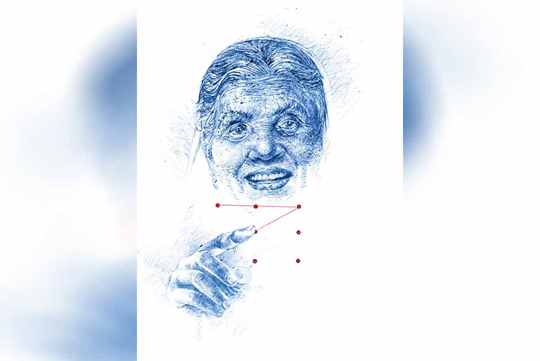

 
 <h1 align=center>উত্তর-রাগ</h1>
<h2 align=center>সমীরণ বন্দ্যোপাধ্যায়</h2> সে  কী কাণ্ড! বুড়ি এই বয়সে প্রেম-ট্রেম করছে নাকি!”

“ধ্যাত, কনফার্ম না হয়ে কারও সম্পর্কে ও রকম ডিসিশন নেওয়া যায় না, তবে মানতেই হবে দেয়ার ইজ় সামথিং রং!”

শতভিষার কথার ধুয়ো ধরে নিধি বলল, “সে আর বলতে! নিজের বাহাত্তরতম জন্মদিনে স্মার্টফোন উপহার পেয়ে ভদ্রমহিলার এক্সাইটেড হয়ে পড়াটা মেনে নেওয়া যায়। মানা যায় পরের ব্যাপারটাও। একটা নতুন ধরনের জিনিস পেলে অনেকেই প্রথম-প্রথম সেটা নিয়ে মশগুল থাকে, কিন্তু ওঁর অন্য আচরণগুলো মিস্টিরিয়াস! বিরলে ফোন হাতে বসে থাকা, কারও পায়ের শব্দ পেলেই থতমত খেয়ে ফোন আড়াল করা, হঠাৎ-হঠাৎ নিজের মনে হেসে ওঠা, এগুলো সবই পূর্বরাগের লক্ষণ! কিন্তু প্রেমে হাবুডুবু খাওয়া টিনএজারদের সঙ্গে খাপ খেয়ে গেলেও এক জন বৃদ্ধা গৃহকর্ত্রীর পক্ষে এমন আচরণ বেমানান। কী বলা যায় একে, উত্তর-রাগ? তুই তো বাংলা অনার্স, বল না, অভিধানে এ রকম কোনও শব্দ আছে কি না!”

শতভিষাকে অন্যমনস্ক দেখে আর একটু খোঁচাল নিধি, বলল, “না বাবা! তুই ওঁকে ডিফেন্ড করার চেষ্টা করলেও, আমার মনে হচ্ছে ভদ্রমহিলা প্রেমে পড়েছেন!”

“উফ! থামবি তুই!” খিঁচিয়ে উঠে শতভিষা বলল, “প্রেম করতে চাইলে ঠাকুমা অনেক আগেই করতে পারত। দাদু যখন মারা যায়, তখন বাবা সাত, ঠাকুমা একত্রিশ। স্লিম সুন্দরী অ্যান্ড এডুকেটেড, তার উপর প্রাইমারি স্কুলের হেডমিস্ট্রেস। তখন ঠাকুমা বিয়ে করতে চাইলে পাত্রের লাইন পড়ে যেত, কিন্তু ছেলের ভবিষ্যতের কথা ভেবে ওই পথ মাড়ায়নি! সেই মহিলা এই বয়সে এসে প্রেম করবে... ব্যাপারটা ঠিক হজম হচ্ছে না!”

“আহা, খেপচুরিয়াস হোস না! তুই একটা কথা বল, এক জন মানুষ কখন তার ফোনটা সবার নাগালের বাইরে রাখতে চায়? সহজ উত্তর, যখন তাতে কনফিডেনশিয়াল কিছু থাকে। ইঁচড়পক্ব ছেলেমেয়েরা কখনওই চায় না তাদের নন-ভেজ ফোন বড়দের হাতে পড়ুক। সায়েন্টিস্ট, পলিটিশিয়ান, বিজ়নেসম্যান, সম্পর্কে অসুখী দম্পতি, সবাই নিজের ফোনটা চোখের মণির মতোই আগলে রাখে। কিন্তু তোর ঠাকুমা তো এর কোনও ক্যাটেগরিতেই পড়ছে না, তবে কেন এত রাখঢাক!”

নিধির কথায় যতটা বিরক্তি নিয়ে এক মুঠো ঘাস ছিঁড়ল শতভিষা, সাধারণত নিজের মাথার প্রথম পাকা চুল তোলার সময় তেমনটা করে কোনও সুন্দরী যুবতী।

কলেজের পিছন দিকের এই লনে শীতের দুপুরে আড্ডায় মাতে ক্লাস-কাটা ছেলেমেয়েরা। মিঠে রোদ আর শীতল হাওয়ার যুগলবন্দি কখনও-কখনও লিখে ফেলে কোনও অনুরাগরঞ্জিত আখ্যানের পর্ব। শত-নিধির ফুরফুরে মধ্যাহ্ন-আলোচনার খোরাক হয় সেই সব গপ্পো। তবে জগতের সমস্ত প্রেমকাহিনির মুখবন্ধই যে অপার সুখানুভূতির জন্ম দেয় না, তা এই মুহূর্তে বেশ বুঝতে পারছে শতভিষা!

খানিক পরে নিধি আবার বলল, “আচ্ছা, তোর ঠাকুমার ফোনে হোয়াটসঅ্যাপ, ফেসবুক আছে কি না জানিস?”

আবার কয়েকটা নিরীহ ঘাসের মূলোৎপাটন করে শতভিষা বলল, “আছেই তো! আমিই মোবাইলটা গিফ্ট করার দিন হোয়াটসঅ্যাপ ইনস্টল করে দিয়েছি। ফেসবুক অ্যাকাউন্টও খুলে দিলাম। ফেবু নিয়ে চিন্তার কিছু নেই, প্রোফাইল চেক করে দেখেছি আমি ছাড়া এই ক’দিনে ঠাকুমার আর কোনও ফ্রেন্ড জোটেনি। চেনাশোনা না থাকলে এক জন সেভেন্টি-প্লাস মহিলাকে কে আর রিকোয়েস্ট পাঠাবে!”

“কায়দা করে এক বার তোর ঠাকুমার ফোনটা হাতাতে পারিস? জানি এক জনের ব্যক্তিগত পরিসরে এ ভাবে উঁকি মারা আনএথিক্যাল, তবু এই রহস্যের সমাধান না হওয়া পর্যন্ত তো তুইও শান্তি পাবি না!”

“করেছিলাম চেষ্টা,” দীর্ঘশ্বাস ফেলে শতভিষা বলল, “বুড়ি ফোন লক করতে শিখে গেছে। পুরনো দিনের গ্র্যাজুয়েট, তার উপর মগজটাও শার্প। ছোটবেলায় আমাকে ট্রান্সলেশন শিখিয়েছে। মাধ্যমিকের আগে টেস্ট পেপারের ম্যাথ নিয়ে ঝামেলায় পড়লেই ধরনা দিতাম ঠাকুমার ঘরে। জলের মতো সহজ করে বুঝিয়ে দিত সব কিছু। সেই মানুষের হাতে পড়েছে স্মার্টফোন! এই ক’দিনে ঘাঁটাঘাঁটি করে আরও কত কী শিখে নিয়েছে কে জানে! বেশ চালিয়ে নিচ্ছিল ফিচার ফোন দিয়ে, আমারই মাথায় ভূত চাপল, ঠাকুমাকে জন্মদিনে স্মার্টফোন উপহার দেব! মা-ও খুশি হল আমার প্ল্যান শুনে। বলল, ‘তাই কর। মানুষটা তো বই নিয়েই কাটিয়ে দিল সারা জীবন, এ বার ডিজিটাল জগতটা চিনুক।’ তখন কি ছাই জানতাম, খাল কেটে কুমির আনতে চলেছি!”

“আন্টি বা আঙ্কলের সঙ্গে এক বার আলোচনা করলে পারতিস!”

নিধির কথায় আবার খিঁচিয়ে উঠল শতভিষা, “ধুত্তেরি! তোর খুপরিতে কি কিছুই নেই! কী বলব আমি মাকে? ‘তোমার শ্রদ্ধেয়া মাদার-ইন-ল’এর হাবভাব সুবিধের ঠেকছে না!’ নাকি বাবার কাছে তার মায়ের নামে নালিশ ঠুকব! জানিস না আমাদের বাড়িতে সবাই খুব লিবারাল, কারও ব্যক্তিগত ব্যাপারে মাথা ঘামানোর চল নেই! ও সব বোকা-বোকা কমেন্ট বাদ দিয়ে রিয়ালিস্টিক কোনও আইডিয়া থাকলে বল!”

একটু ভেবে নিধি বলল, “তোর সামনে কখনও ঠাকুমা ফোন আনলক করেছে?”

“করেছে, অনেক বারই করেছে। প্যাটার্ন লক। নাতনি তার উপর গোয়েন্দাগিরি করতে পারে সে কথা ঠাকুমা ভাবতেই পারে না। যদিও আমি ঘোর পাপী, ইতিমধ্যেই ওই অপকম্মোটি বেশ কয়েক বার করেছি! তবে ভাল করে লক্ষ করেও আঙুলের মুভমেন্ট বুঝতে পারিনি। প্যাটার্নটা বেশ কমপ্লিকেটেড! বিকেলে গোটা দুয়েক সিরিয়াল দেখে সন্ধেবেলা ঠাকুরঘরে যায় ঠাকমা। আধঘণ্টা লাগে পুজো করতে। কোনও কোনও দিন সেই সময় ফোনটা ড্রয়িংরুমেই থাকে। আমি কাল আনলক করার চেষ্টা করেছিলাম, সুবিধা হয়নি। তা ছাড়া ভয় ছিল, কখন মা হুট করে চলে আসে। ঠাকুমার অ্যাবসেন্সে তার ফোন ঘাঁটাঘাঁটি করছি দেখলে মায়ের কাছেও ঝাড় খেতে হবে। তার উপরে রয়েছে কাজের মাসি। এর কথা ওকে, ওর কথা তাকে লাগাতে ওস্তাদ!”

খানিক ক্ষণ চিন্তা করে নিধি বলল, “ওক্কে! তার মানে তুই চাইছিস বাড়ির কাউকে কিছু না জানিয়ে ফোন-রহস্য উদ্ঘাটন করতে। হয়ে যাবে ব্যবস্থা। তার জন্য তোকে আর একটু পাপ করতে হবে! পারবি তো?”

ব্যাকপ্যাক হাতে উঠে দাঁড়াল শতভিষা। বলল, “পিকেএম-এর ক্লাসটা ইম্পর্ট্যান্ট। ফিরে এসে শুনছি তোর আইডিয়া, তত ক্ষণ তুই বুদ্ধির গোড়ায় আর একটু শান দিয়ে নে। আবার কোনও ভাটের আইডিয়া বাতলালে ব্যাপক মার খাবি!”

*****

টিভি দেখছিলেন মৈত্রেয়ী। শতভিষা নিজের ফোনটা হাতে নিয়ে তাঁর কাছে গিয়ে বেজার মুখে বলল, “তোমার ফোন থেকে নিধিকে একটা কল করব ঠাকুমা? ওর একটা নোট নিয়ে আসার কথা ছিল দুপুরে। এখনও পাত্তা নেই। এ দিকে আমার আউটগোয়িং শেষ, কাউকে কল করতে পারছি না।”

“হ্যাঁ করবি, হাজার বার করবি, তার জন্য এমন আমশি-মার্কা মুখ করে পারমিশন চাইছিস কেন! আয়, বোস এখানে, নম্বর বল...” টি-টেবিল থেকে ফোনটা তুলে স্ক্রিনে আঙুল ছোঁয়ালেন মৈত্রেয়ী।

এমনটাই ঘটবে আন্দাজ করেছিল শতভিষা! এই ক’দিনের অভিজ্ঞতা বলছে, ব্যবহারের অনুমতি দিলেও ফোনটা চোখের আড়াল করবে না ঠাকুমা! তাই এই ঘরে আসার আগেই নিজের ফোনের ক্যামেরা অন করে নিয়েছে সে!

নিষ্পাপ মুখে শতভিষা বলল, “নাইন সিক্স ফোর জিরো...”

*****

“সব ঠিক আছে? ঠাকুমা টের পায়নি তো ভিডিয়ো করার ব্যাপারটা?”

সদর দরজা ঠেলে ভিতরে ঢুকেই চাপা গলায় প্রশ্ন নিধির। ততোধিক নিচু গলায় শতভিষা জবাব দিল, “না, পায়নি। কিন্তু আমার খুব টেনশন হচ্ছে। জানাজানি হলে ঠাকুমার চোখে বড্ড ছোট হয়ে যাব। বাবা-মাও ভয়ঙ্কর রাগারাগি করবে!”

আশ্বাসের সুরে নিধি বলল, “কেউ জানতে পারবে না। ঠাকুমা এখন কোথায়?”

“এইমাত্র ঠাকুরঘরে ঢুকল।”

“আঙ্কল, আন্টি, কাজের মাসি?”

“বাবা অফিস থেকে ফেরেনি। মা স্কুলের খাতা নিয়ে বসেছে, এখনই উঠে আসার চান্স কম। আর মাসি কিচেনে রুটি করছে।”

“ব্যস! গোল্ডেন অপরচুনিটি!” উত্তেজনায় শতভিষার পিঠে আলতো চাপড় মেরে নিধি বলল, “তাড়াতাড়ি চল তা হলে। ফোনটা ড্রয়িংরুমেই আছে নিশ্চয়ই?”

“না, উপরে ঠাকুমার ঘরে। তবে অসুবিধে নেই, এই সময় ঠাকুমার ঘর খোলাই থাকে।”

এই বাড়িতে আগে অনেক বার এলেও দোতলার কোণের ওই ঘরটায় কখনও ঢোকার প্রয়োজন হয়নি নিধির। ড্রয়িংরুমে বা শতভিষার ঘরে বসে গল্প করেছে। গরমের সন্ধেয় কখনও ছাদে। এই ঘটনায় ফোনে গোয়েন্দাগিরির তদন্ত একাই করতে পারত শতভিষা। কিন্তু ভরসা পায়নি। তাই ডেকেছে বন্ধুকে। দোতলায় উঠে বারান্দা দিয়ে হাঁটতে হাঁটতে নিধি ফিসফিস করে বলল, “আন্টি যদি হঠাৎ চলে এসে জানতে চায় আমরা কেন ওই ঘরে ঢুকেছি?”

“বলব, তুই ঠাকুমার বইয়ের স্টক দেখতে চেয়েছিস।”

“হুম! স্মার্ট গার্ল!” আলতো করে শতভিষার মাথায় টোকা মারল নিধি।

*****

ভুল বলেনি শতভিষা, মুগ্ধ করার মতোই সংগ্রহ তার ঠাকুমার। কৃত্তিবাসী রামায়ণ, কাশীদাসী মহাভারত থেকে বঙ্কিমচন্দ্র-শরৎচন্দ্র-রবীন্দ্রনাথ হয়ে হালের নামী লেখকদের উপস্থিতি দেওয়ালজোড়া র‌্যাকে। দেখলেই চকচক করে উঠবে বইপোকাদের চোখ!

ঘরে ঢুকে সে দিকে তাকিয়ে বিস্ময়সূচক শব্দ করল নিধি। তার পর পর্দার আড়ালে দাঁড়িয়ে বলল, “আমি বাইরে লক্ষ রাখছি। কাউকে আসতে দেখলেই সিগন্যাল দেব, তুই ঝটপট কাজ শুরু কর!”

ফোনটা পড়ে রয়েছে খাটের এক কোণে। নিধি আসার আগে বেশ কয়েক বার ভিডিয়ো দেখে নিয়েছে শতভিষা। কাঁপা-কাঁপা হাতে খাট থেকে ফোনটা তুলে স্ক্রিনে নির্দিষ্ট ছকে আঙুল বুলোতেই আনলক হল ফোন। উত্তেজিত কণ্ঠে দরজার দিকে তাকিয়ে শতভিষা বলল, “হয়েছে!”

চাপা গলায় নিধি বলল, “আগে গ্যালারিটা চেক কর, তার পর হোয়াটসঅ্যাপ!”

সামান্য পরেই শতভিষা অস্ফুটে বলে উঠল,”ওহ মাই গড!”

বারান্দার দিকে চোখ রেখে উদ্বিগ্ন নিধি জিজ্ঞেস করল, “কী হল রে, পেলি কিছু?”

বাকরুদ্ধ শতভিষা। তর সইছে না নিধিরও। সিঁড়ি দিয়ে উঠে লম্বা বারান্দার একদম শেষপ্রান্তে এই ঘর। বারান্দা পেরিয়ে কারও এই ঘরে আসতে বেশ কয়েক সেকেন্ড সময় লাগবে। তত ক্ষণে এক বার ফোনে উঁকি মেরে আসাই যায়! উত্তেজিত নিধি দ্রুত পায়ে শতভিষার পাশে এসে চোখ রাখল ফোনের পর্দায়।

চেনা যাচ্ছে শতভিষার ঠাকুমাকে। কিন্তু ওঁর পাশের সৌম্যদর্শন সহাস্য ভদ্রলোকটি কে! শুধু একটা ছবি নয়, শতভিষার আঙুলের স্পর্শে সরে যাওয়া একের পর এক ছবিতে সধবার সাজে ভিন্ন বয়সের ঠাকুমা। প্রতিটি ছবিতেই উপস্থিত সৌম্যদর্শন ভদ্রলোক। শতভিষার ঠাকুমার সঙ্গে সাযুজ্য রেখে বয়স বেড়েছে-কমেছে তাঁরও! ছবি দেখে দু’জনকে দম্পতি না ভাবার কোনও অবকাশ নেই!

প্রায় চার দশক আগে স্বামীকে হারানো বৃদ্ধা দোসর জুটিয়ে হাজির যুগল অবতারে! যে মানুষটা বাড়ির বাইরে পা রাখে কালেভদ্রে, তার পক্ষে কী ভাবে সম্ভব এমন দ্বৈত-জীবন যাপন করা!

হঠাৎ একটা ছবিতে এসে থেমে গেল শতভিষার আঙুল। চমকে উঠল নিধিও। মুহূর্তেই সব কিছু জলের মতো পরিষ্কার হয়ে গেল তার কাছে।

ছবির মানুষটাকে এই ঘরে ঢুকেই দেখেছে নিধি। প্রায় চল্লিশ বছর আগে মানুষটার জীবনদীপ নিবলেও বুকশেলফের উপরে রাখা সাদা-কালো ছবি ধরে রেখেছে তাঁর স্মৃতি। শতভিষার মুখে তার অকালপ্রয়াত ঠাকুরদার কথা এক-আধ বার শুনলেও আজই প্রথম তার ছবি চাক্ষুষ করেছে নিধি! অনন্য কীর্তির অধিকারী না হলে, চলে যাওয়া মানুষকে নিয়ে কে আর বেশি দিন মাথা ঘামায়!

কাঁদছিল শতভিষা। নিধি তার পিঠে হাত ছোঁয়াতে চোখ মুছে বলল, “ছবির বয়স বাড়ানো কমানোর এই অ্যাপটা নিয়ে কিছু দিন আগে মজা করেছিলাম। বাবা-মাকে বানিয়েছিলাম বয়স্ক দম্পতি, আমাকে আশি বছরের বুড়ি আর ঠাকুমাকে ষোড়শী। আমরা তিন জন ছাড়াও ঠাকুমার জীবনে আরও এক জনের অস্তিত্ব আছে, সে কথা ভুলেই গিয়েছিলাম! স্মার্টফোন হাতে পেয়ে ঠাকুমা সেই অ্যাপটাই ডাউনলোড করেছে। তার পর নিজের জীবনের ধূসর পর্বগুলোকে রাঙিয়েছে কল্পনার রঙে। চল্লিশ বছর আগে যে মানুষটার হাত ছেড়ে দিতে হয়েছিল, তাকেই বয়স বাড়িয়ে এনে দাঁড় করিয়েছে এখনকার নিজের ছবির পাশে। জ্ঞান হয়ে থেকে যাকে দেখছি, তাকে চিনতে এত বড় ভুল! নিজেকে বড় নিকৃষ্ট মনে হচ্ছে আজ!”

কথার ঝাঁপি রিক্ত নিধির, মাথায় আসছে না কিছুই!

একটু পরে ফোন রেখে চোখ তুলল শতভিষা। ভিজে গলায় বলল, “তুই এখন বাড়ি যা। ঠাকুমা ঠাকুরঘর থেকে নেমে এলে আমি তার মুখোমুখি হব। পরিণতি যাই হোক, আই উইল কনফেস, নইলে নিজেকে কখনও ক্ষমা করতে পারব না! তোর চিন্তা নেই, কেউ কোনও দিন জানবে না তোর নাম!”

নিধি অনুভব করল, চিত্রনাট্যের শেষ অনুচ্ছেদে পৌঁছে খেই হারিয়েছে সে। যে অপ্রত্যাশিত ক্লাইম্যাক্স ঘটতে চলেছে, দর্শক হিসেবেও সেই পর্বে তার উপস্থিতি কাম্য নয়!

সময় নষ্ট না করে দরজার দিকে পা বাড়াল সে।