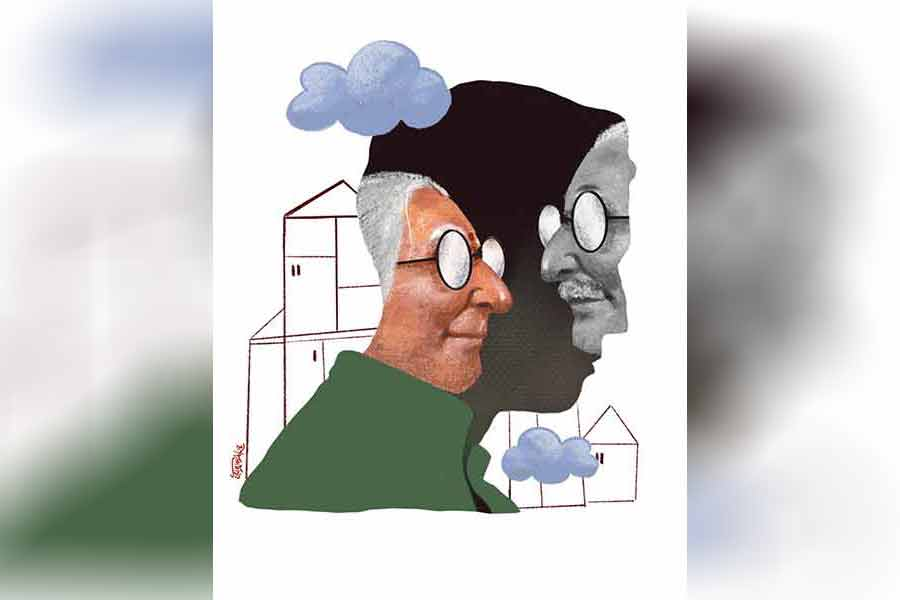

 
 <h1 align=center>উত্তরাধিকার</h1>
<h2 align=center>সোমজা দাস</h2> 

ঘুমের মধ্যেই টের পেলেন সুবিনয়। টের পাওয়াটা যে খুব গভীর হল, তা নয় অবশ্য। একটা তরঙ্গ যেন। যাওয়া-আসা। স্বচ্ছ চাদরের মতো, কুয়াশার মতো যন্ত্রণার ঢেউ। বুকের বাঁ দিক ঘেঁষে।

কিছু একটা স্বপ্ন দেখছিলেন তিনি। খুব অস্পষ্ট। ছোট্ট তুতান। হাঁটি হাঁটি পা পা, তুতান হাঁটে দেখে যা। ছন্দা গাইছে। ওর গানের গলা নেই। সেই বিয়ের সময় পাত্রী দেখতে গিয়ে সুবিনয়ের বাবা জিজ্ঞেস করেছিলেন, “মা, তুমি গাইতে জানো?”

ছন্দার সেই অসহায় দৃষ্টি এখনও মনে পড়ে সুবিনয়ের। পাশ থেকে পিসি বলে উঠেছিলেন, “আচ্ছা আচ্ছা, থাক। বাড়ির বৌ, সংসারটা গুছিয়ে করতে পারলেই হল। নাচ-গান কী হবে?”

বাবা আর কথা বাড়াননি। অথচ সুবিনয় জানেন, তাঁর পরম বৈষ্ণব বাবার ইচ্ছে ছিল, ছেলের বৌ গান জানবে। কালোয়াতি দরকার নেই। মাঝে মাঝে সন্ধেবেলায় কাছে বসে দু’কলি কীর্তন গেয়ে শোনাবে। ‘আর ঘুমায়ো না মন, মায়াঘোরে কত দিন রবে অচেতন?’ সুবিনয়ের মধ্যবিত্ত বাবার নাগালের মধ্যের অতি সাধারণ, মধ্যবিত্ত স্বপ্ন। তা বলে কি সব স্বপ্ন পূরণের দায় থাকে কারও? না থাকতে হয়?

সে সব পুরনো কথা। এখন যন্ত্রণার ঢেউটা আবার হানা দেওয়ার মাঝের সময়টুকুতে সুবিনয় স্বপ্ন দেখছেন। ছন্দা ভাঙা গলায় গাইছে, ‘আয় রে তোরা দুষ্টু ছেলে দামাল ছেলে আয়। দেখবি রে আয় তুতান চলে টলোমলো পায়।’

তুতান হাঁটছে। দু’পা এগোতে গিয়ে ধুপ করে বসে পড়ছে লাল মেঝেতে। উঠে দাঁড়িয়ে আবারও হাঁটছে। ছেলেটা হাঁটতে হাঁটতে কবে এত বড় হয়ে গেল কে জানে!

ব্যথাটা ফিরে আসছে আবারও। চিনচিনে, আগের চেয়ে তীব্র।

“তুতান, স্কুলের গাড়ি এসে গেছে।”

“তুতান, ভূগোলের হোমওয়ার্কটা আজ জমা দিবি কিন্তু।”

“তাড়াতাড়ি কর তুতান। এত স্লো হলে হবে নাকি!”

ছন্দা ছুটছে, যেন সম্ভব হলে তুতানের স্কুলের গাড়িটাতে ওই চড়ে বসে। তুতানের হেলদোল নেই। একটা একটা করে পা ফেলছে। ওর পায়ে যেন কেউ দশ কেজির বাটখারা বেঁধে দিয়েছে। বাসে ওঠার মুখে ঘুরে তাকাচ্ছে তুতান। দুই চোখে কি অভিযোগ? কে জানে! সুবিনয় জানেননি। ছন্দা জানতে চায়নি।

ব্যথা, ব্যথা! তীব্র যন্ত্রণা! হাত বাড়িয়ে ছন্দাকে খোঁজেন সুবিনয়। নেই। থাকার কথাও নয়। গত বছর ছন্দা দীক্ষা নেওয়ার পর থেকেই শোয়ার ঘর আলাদা দু’জনের।

“জেনারেল লাইনে পড়বি? সে কী রে! লোকে কী বলবে?”

সতেরোর তুতান। রোগা, তরতরে মুখখানা। কোমল, সবজেটে গোঁফের রেখা। স্বপ্নালু চোখ। নরম, ভিতু।

“কেমিস্ট্রি অনার্স নেব মা। ইঞ্জিনিয়ার, ডাক্তার হওয়ার ইচ্ছে আমার নেই। অনেক দূর অবধি পড়ব। রিসার্চ করব।”

“জয়েন্ট দিবি না?” ছন্দা যেন অবাক হতেও ভুলে যান। হাঁ করে তাকিয়ে থাকেন ছেলের মুখের দিকে।

“প্লিজ় মা। আমাকে জোর কোরো না।”

“জোর? জোর করছি তোকে? সারাটা জীবন তোর পিছনে বৃথাই সময় নষ্ট করলাম, বল? তোর বুটুদাদা, তিন্নিদিদি, পাশের বাড়ির অঙ্কন অবধি জয়েন্টে চান্স পেয়ে ডাক্তারি, ইঞ্জিনিয়ারিং পড়ছে। বুটুদাদা ক্যাম্পাস ইন্টারভিউতে চাকরিও পেয়ে গেছে। শুরুতেই বছরে চার লাখের প্যাকেজ। বড়মামি ফোন করে সকলকে জানাচ্ছে বড় মুখ করে। সেখানে তুই… আত্মীয়স্বজনের কাছে মুখ দেখাব কী করে?”

সতেরো বছরের তুতান তাকিয়ে আছে বাবার দিকে। সেই দৃষ্টিতে বিস্ময়, প্রার্থনা, অসহায়তা। সুবিনয় চোখ নামিয়ে নিচ্ছেন। তুতানের দৃষ্টি বদলে যাচ্ছে ধীরে ধীরে, না তাকিয়েও অনুভব করতে পারছেন তিনি। ঘৃণা। তীব্র। তীব্রতর।

ব্যথাটা বাঁ হাত বেয়ে গলিত লাভার মতো নামছে। গলা বেয়ে, ঘাড় বেয়ে উঠছে চটচটে আলকাতরার মতো, যে ভাবে তরল চুম্বক ওঠে লোহাকে বেড় দিয়ে।

সে দিন সুবিনয় পারেননি প্রতিবাদ করতে। দুর্বল পুরুষ তিনি। ছন্দা আলোকময়ী। সুবিনয় নিভৃতচারী। ছন্দা সবলা। নিজের দাবিটুকু সুদে-আসলে উসুল করে নিতে জানে। ছন্দার প্রবল ব্যক্তিত্বের সামনে দিনের পর দিন আরও বেশি সঙ্কুচিত হয়ে পড়েছেন সুবিনয়।

সঙ্কোচনের সেই যন্ত্রণা মস্তিষ্কের গহ্বর ছুঁয়েছে। কৃষ্ণগহ্বর। স্কাল্পটর গ্যালাক্সি। অন্ধকার। সেই অন্ধকার প্রকোষ্ঠের মধ্যে গুঙিয়ে গুঙিয়ে কেঁদে চলে ছন্দা।

“কী চেয়েছি? কতটুকু পেয়েছি এই সংসারে এসে? দিয়েই গেছি। সেই দেওয়াটুকু তোমরা নিয়েছ হাত পেতে। কখনও ভেবে দেখেছ, আমারও কিছু পাওয়ার ছিল? তুমি ভেবেছ? তোমার বাবা ভেবেছেন? কেউ না, কেউ না। আমিও কিছু চাইনি। চেয়ে লাভ হবে না বলেই চাইনি। শুধু জানতাম, আর কেউ না থাকুক, আমার তুতান থাকবে আমার জন্য। আমার কষ্টটুকু, না-পাওয়াটুকু বুঝবে ও। আজ যখন সেটুকু চাইছি, তখন দেখি, ও মা, কবে যেন তলে তলে ছেলেও তোমাদের দলে যোগ দিয়ে বসে আছে। ছেলেকে বড় করে তোলার সময় কোথায় ছিলে তুমি? কতটুকু তুমি জানো ওকে যে, আজ বাবার অধিকার ফলাতে চাইছ? তুতান তোমাকে উকিল খাড়া করেছে, না?”

আঃ! কী যন্ত্রণা!

ছন্দা! ছন্দা! এ সব বোলো না। কষ্ট হচ্ছে আমার। অধিকার! কিসের অধিকার? ছেলেটাকে একটু নিজের মতো বাঁচতে দাও। শ্বাস নিতে দাও। ও কি তোমার সম্পত্তি? স্থাবর কিংবা অস্থাবর? ও নিজের সিদ্ধান্ত নিতে পারে। দয়া করো। দয়া করো।

ইঞ্জিনিয়ারিং কলেজ। ইলেক্ট্রিক্যাল। বদলে গেছে তুতান। চুপচাপ, কৈশোর থেকে এক লাফে বার্ধক্যে পৌঁছে যাওয়া তুতান। লাফ, নাকি উড়ান! উড়ে চলেছে তুতান। আকাশ ছাড়িয়ে, মহাকাশ, আলফা সেন্টরি ছাড়িয়ে। চাকরি। ছয় লাখ প্যাকেজ। ফোন যাচ্ছে, একের পর এক। ছন্দা হাসছে। হেসেই চলেছে। আগে কখনও এত হাসতে দেখেননি ছন্দাকে। বলতে ইচ্ছে হত, ছন্দা, ছন্দা, এত হেসো না। তোমার গাল কুঁচকে যাচ্ছে। চোখ দুটো জ্বলছে। দাঁত বেরিয়ে আসছে। শ্বদন্ত। ভয় করছে আমার। একটু স্থির হও। একটু স্থির হও।

তুতান তবু ওড়া থামাচ্ছে না। সাত লাখ, আট লাখ। দশ, পনেরো, কুড়ি, তিরিশ, পঞ্চাশ... লন্ডন, কানাডা, জার্মানি, বস্টন। ডলার। পাউন্ড। ইউরো।

ছন্দার হাসিও চওড়া হতে হতে ঢেকে ফেলছে সুবিনয়ের পৃথিবী। ঘরকুনো সুবিনয় আরও সেঁধিয়ে যাচ্ছেন ঘরের নিভৃততম কোণে। দেওয়ালে আঁচড়াচ্ছেন। নখের ভিতর ঢুকে যাচ্ছে সিমেন্ট, বালি। রক্তক্ষরণ। শিরায় শিরায় সংবাহিত হয়ে ছড়িয়ে পড়ছে বিষ। যন্ত্রণা! উঃ!

“মা, আমি বিয়ে করেছি। স্টেলা মেক্সিকান মেয়ে, আমার সঙ্গে চাকরি করে।”

ছন্দা হাসছে। হাসার চেষ্টা করছে প্রাণপণ। সেই হাসিতে জোর পাচ্ছে না। কিন্তু সে আলোকময়ী। দুনিয়ার কাছে নিজেকে প্রমাণ করার সে কী মরিয়া চেষ্টা। আবারও ফোন যাচ্ছে।

“জানো তো, তুতান না… হি হি হি…”

“আরে না না, আমি আর ওর বাবাই তো বললাম, রেজিস্ট্রি করে নে। ম্যারেজ সার্টিফিকেট থাকলে স্টেলারও এখানে আসার ভিসা পেতে সুবিধে হবে।”

“মেক্সিকান মেয়ে। খুব সুন্দর। ছবি পাঠিয়েছে তো। ফ্যামিলি হোয়াটসঅ্যাপ গ্রুপে ফরোয়ার্ড করছি।”

“আরে ও খুশি থাকলেই আমি খুশি। ক্রিসমাসের ছুটিতে একেবারে বৌ নিয়ে আসবে। তখন গ্র্যান্ড রিসেপশন হবে।”

সুবিনয় নীরব শ্রোতা। ছন্দার অনুপস্থিতিতে লকারে ভেলভেট বাক্সে শায়িত তাঁর মায়ের বালাটায় হাত বোলান। এটা দিয়ে ছেলের বৌকে আশীর্বাদ করবেন ভেবেছিলেন। আচ্ছা, স্টেলা কি গান গাইতে পারে! হঠাৎ এ কথা কেন মনে হয় কে জানে!

সেই রাতে ছন্দাকে লুকিয়ে কাঁদতে দেখেছিলেন সুবিনয়। প্রথম বার। জীবনে প্রথম বার অস্ত্র নামিয়ে রেখেছিল ছন্দা, তার আজীবনের প্রতিদ্বন্দ্বীর সামনে। সর্বস্বান্ত দেখাচ্ছিল ওকে। হাউহাউ করে বালিশ আঁকড়ে কাঁদছিল। কষ্ট হচ্ছিল সুবিনয়েরও। বোঝাতে চেষ্টা করেছিলেন ছন্দাকে, “আমরা সব সময় কী চেয়েছি বলো? চেয়েছি, তুতান সুখী হোক। আমরা যা-যা পাইনি, সব ও পাক। ওকে তুমি বড় করেছ। আজ ও যেখানে, তার সব ক্রেডিট তোমার। কিন্তু ভেবে দেখো, সারাটা জীবন ও তোমার, মানে আমাদের মর্জিমতো বেঁচেছে। আজ যদি ও কোনও কাজ নিজের ইচ্ছেয় করতে চায়, তুমি কেন কষ্ট পাবে? ওর ডানা তো তুমিই শক্ত করে তুলেছ তোমার শাসন দিয়ে। এখন ওকে উড়তে দাও।”

বুঝেছিল ছন্দা। উড়তে দিয়েছিল তুতানকে। কিন্তু ও উড়তে পারল কোথায়!

বছর দুয়েক সব ঠিক ছিল। দু’জন হাসিমুখে ছবি পাঠায়। ভিডিয়ো কল করে। বড়দিনের ছুটিতে ওরা ইউরোপ টুর করল। বাড়ি আসা হবে না। অনেক টাকা খরচ হয়ে গেছে। গ্র্যান্ড পার্টি! দূর! লোক খাইয়ে কে টাকা নষ্ট করে! পাগল নাকি! একটা নতুন প্রপার্টি কিনছে তুতান। ক্যালেন্ডারের ছবির মতো দোতলা বাড়ি। সামনে লন। সুইমিং পুল। মিয়া-বিবি, সঙ্গে একটা ছোট্ট লোমওয়ালা কুকুর। ওদের সুখী দাম্পত্যের ছবিতে ভরে যেতে লাগল ফ্যামিলি হোয়াটসঅ্যাপ গ্রুপ। সুখের লাইভ বিজ্ঞাপন। ছন্দার চোখ দুটো আজকাল চকচক করে, দেখতে পান সুবিনয়।

“জানিস তুতান, তিন্নি বলেছে, দাদা-বৌদিকে ওদের কাছে ক্যালিফোর্নিয়া বেড়াতে নিয়ে যাবে।”

“জানিস, বুটু তো এখন কলকাতাতেই চাকরি করছে। বিয়ে-থা করেনি। ভালই হয়েছে। তোর জেঠু-জেঠির তো বয়স হল। ছেলেটা কাছে থাকে। নিশ্চিন্ত।”

“মা, একটা কথা…”

“আমাদের পাশের বাড়িটা বিক্রি হয়ে গেল, জানিস? অঙ্কন এসেছিল তো। বাবা-মাকে সাউথের দিকে বিশাল ফ্ল্যাট কিনে দিয়েছে। দাম কত জানিস? দু’কোটি। ও ওর বাবাকে বলেছে, ‘এই ভূতের বাড়িতে বুড়ো-বুড়ি থাকো। লোকে আমাকেই বা কী বলবে! এখন ফ্ল্যাটে থাকো আরামসে।’ চব্বিশ ঘণ্টার সিকিয়োরিটি, সারা ক্ষণ জল, জেনারেটর, বয়স্কদের জন্য পার্ক…”

ছন্দা বলে চলে। ফোনের ও পারে তুতানের উসখুস টের পান সুবিনয়।

“মা, একটা কথা বলার ছিল।”

ছন্দা শোনে না। বা শুনতে চায় না।

“আচ্ছা শোন না, জানিস, তিন্নি না ওর মা-কে একটা বিদেশি ফোন কিনে পাঠিয়েছে। কত দাম হবে বল তো?”

“মা, আমার কথাটা শোনো প্লিজ়!” এ বারে যেন কতকটা মরিয়া হয়ে চেঁচিয়ে ওঠে তুতান। ছন্দা থমকে চুপ করে যায়।

“স্টেলা আর আমি আলাদা হয়ে যাব ঠিক করেছি।”

“আলাদা মানে?”

“আলাদা মানে ডিভোর্স। তবে কোনও আইনি ঝামেলায় যাচ্ছি না। মিউচুয়ালি আলাদা হচ্ছি।”

“এ সব কী বলছিস তুতান?” স্খলিত কণ্ঠে জিজ্ঞেস করে ছন্দা।

“ওর দোষ নেই মা। ও সন্তান চায়। চাওয়াই স্বাভাবিক। আমি চাই না। এটা আমার সমস্যা। আমাদের নতুন বাড়িটা ওকে দিয়ে দিচ্ছি খোরপোশ বাবদ।”

“বাড়ি দিয়ে দিবি? তুই কি পাগল?” চিৎকার করে প্রায় কেঁদে ওঠে ছন্দা, “যদি কোনও সমস্যা থাকে, ডাক্তার দেখা তুতান। আজকাল কত রকম চিকিৎসা বেরিয়েছে।”

ফোনের অপর প্রান্তে চুপ করে থাকে তুতান। ছন্দা একাই বলে চলে। বলেই চলে। সুবিনয় এসে ফোনটা ছন্দার হাত থেকে নেন। স্পিকারে সব শুনেছেন তিনি। এ বারে জিজ্ঞাসা করেন, “তুই কী চাস তুতান? আমাকে বল। তুই যা চাস, তা-ই হবে।”

“আমি খুব ক্লান্ত, বাবা। এখানকার চাকরিটা ছেড়ে কলকাতায় ফিরছি।”

“এখানে এসে কী করবি কিছু ভেবেছিস?” বলেন সুবিনয়।

“ভাবার জন্য খানিকটা সময় দরকার আমার। সে জন্যই যাচ্ছি।”

সুবিনয় কিছু বলার আগেই হাহাকার করে ওঠে ছন্দা।

“কী বলছে ও? এখন বাড়ি আসবে? বৌ নেই, চাকরি ছেড়ে দিয়ে এ ভাবে এখানে এলে লোককে কী জবাব দেব আমি? না না, ওকে এখন আসতে বারণ করো।”

তুতান চুপ করে থাকে। সুবিনয় চুপ করে থাকেন। দু’জনের নীরবতার মধ্য দিয়ে কোটি কোটি অনুচ্চারিত শব্দের ঢেউ বয়ে যায়। সুবিনয় সেই সতেরো বছর বয়সি তুতানের চোখ দুটো দেখতে পান।

“এ বারেও আমার পাশে দাঁড়ালে না তুমি? অশান্তির এত ভয় তোমার? মাকে ভয় পাই না আমি, জেনে রেখো। শুধু তোমার মুখ চেয়ে…” হিসহিস করে বলে চলেছে সুবিনয়ের ঠোঁট-চাপা ছেলেটা। নাকি সত্যি সত্যি বলছে না! সবটাই কি কল্পনা? বুঝতে পারছেন না সুবিনয়। মাথার ভিতরটা ধোঁয়া-ধোঁয়া। কত নিযুত-কোটি আলোকবর্ষ দূর থেকে ভেসে আসছে তুতানের কণ্ঠস্বর, “এই জন্য বাচ্চা চাই না আমি। ভয় পাই। তোমারই তো রক্ত আমার শরীরে...”

এখন গভীর রাত। যন্ত্রণাটা সারা শরীর জুড়ে ছড়িয়ে পড়েছে। আঁধার নেমে আসছে সুবিনয়ের চোখের সামনে। তাঁর শ্রাদ্ধশান্তির জন্য তুতানকে কলকাতায় ফিরতেই হবে। ছন্দা কিছুতেই ওকে আটকাতে পারবে না। এ বার না, কোনও দিন নয়। এক বার অন্তত জিতে গেছেন তিনি, সন্তানের জন্য রেখে যাচ্ছেন জয়ের উত্তরাধিকার। বিশ্বাসের বীজ। শিকলি কেটে গেছে। বাকিটুকু ঠিক খুঁজে নিতে পারবে তুতান। ব্যথার মধ্যেই হাসেন সুবিনয়। হেসেই চলেন।

সকালে ছন্দা যখন সুবিনয়ের প্রাণহীন দেহটা আবিষ্কার করে, তখনও তাঁর ঠোঁটের কোণে লেগে আছে এক চিলতে হাসি।

