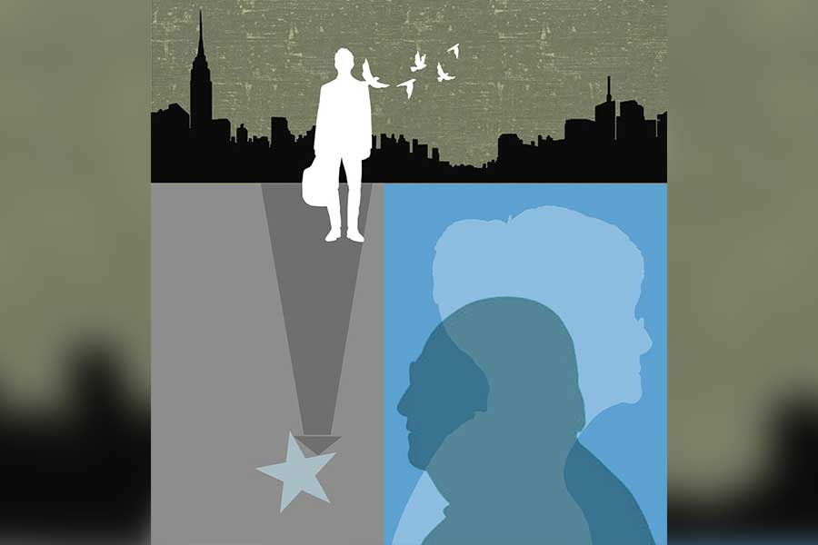

 
 <h1 align=center>উপগ্রহ</h1>
<h2 align=center>পুনর্জিৎ রায়চৌধুরী</h2> ভাল ছেলে বলতে যা বোঝায়, আমাদের একমাত্র পুত্র অর্চিষ্মান, একেবারে ছোটবেলা থেকেই তা-ই। ভাল ছাত্র তো ও প্রথম থেকেই, সবাই বলত ওর স্বভাবও চমৎকার— নম্র, ভদ্র, বিনয়ী। স্কুল কিংবা কোচিং-এর সময়টুকু বাদ দিলে, সারা দিন লেখাপড়া কিংবা গল্পের বই নিয়েই থাকত। বাইরেও বেরোত না বিশেষ। বন্ধু বলতেও ছিল ওর ক্লাসের জয়দীপ, দেবপ্রিয় আর ভাস্করের মতো হাতে গোনা কয়েক জন। আর ছিলাম আমি আর ওর মা। সেই ছোটবেলা থেকেই ওর মনের-প্রাণের যাবতীয় কথা আমাদের সঙ্গে ভাগ করে না নেওয়া পর্যন্ত শান্তি পেত না ও!

অর্চির জন্য আমাদের কোনও দুর্ভোগই পোয়াতে হয়নি। ওর সম্পর্কে আমাকে বা শুচিস্মিতাকে কারও কাছ থেকে কখনও কোনও অভিযোগও শুনতে হয়েছে বলে তো মনে পড়ে না! বরং প্রত্যেক বছর, স্কুলের পেরেন্ট-টিচার মিটিং-এ অর্চির সম্পর্কে নানা রকম প্রশংসাই শুনতাম ওর শিক্ষক-শিক্ষিকাদের কাছ থেকে— “অর্চিষ্মান ইজ় ব্রিলিয়ান্ট”, “আমরা সবাই অর্চিষ্মানের জন্য ভীষণ গর্বিত”, “আমরা নিশ্চিত, অনেক দূর যাবে অর্চিষ্মান” ইত্যাদি।

সামান্য কমার্স গ্র্যাজুয়েট আমি। একটি বেসরকারি সংস্থার অ্যাকাউন্টস বিভাগে চাকরি করি। আমাদের মতো সাধারণ মধ্যবিত্ত মানুষদের জীবনে প্রাপ্তির থেকে অপ্রাপ্তির ভাগটাই বেশি সাধারণত। কিন্তু যখন অর্চির প্রশংসা শুনতাম ওর শিক্ষক-শিক্ষিকা, ওর বন্ধুদের বাবা-মা, পাড়া-প্রতিবেশী কিংবা আত্মীয়স্বজনদের কাছ থেকে, তখন জীবনের সব অপ্রাপ্তি যেন ভ্যানিশ হয়ে যেত! মনে হত আমার আর শুচিস্মিতার মতো সুখী বুঝি আর কেউ নেই!

মাধ্যমিকে নব্বই শতাংশের উপর নম্বর পেয়েছিল অর্চি। উচ্চ মাধ্যমিকে সব্বাইকে তাক লাগিয়ে দিয়ে রাজ্যে ষষ্ঠ স্থানও অধিকার করেছিল! এই খবর চাউর হতেই আমাদের পাম অ্যাভিনিউয়ের তিন কামরার ফ্ল্যাটে জমে উঠেছিল সাংবাদিক, আত্মীয়স্বজন, পাড়া-প্রতিবেশী, অর্চির বন্ধুবান্ধবদের ভিড়। নাতিকে আশীর্বাদ জানাতে চন্দননগর থেকে গাড়ি ভাড়া করে এক বাক্স জলভরা সন্দেশ নিয়ে চলে এসেছিলেন আমার নবতিপর শ্বশুরমশাইও!

জয়েন্টেও ভাল রেজ়াল্ট করেছিল অর্চি। কিন্তু ডাক্তারি অথবা ইঞ্জিনিয়ারিং না পড়ে অর্থনীতি নিয়ে ভর্তি হয়েছিল প্রেসিডেন্সিতে। তখন দু’বছরের শেষে পার্ট ওয়ান পরীক্ষা হত— সেই পরীক্ষায় বিশ্ববিদ্যালয়ে তৃতীয় হল। পরের বছর, পার্ট টু-তে, তৃতীয় থেকে পৌঁছে গিয়েছিল একবারে প্রথম স্থানে!

অফিসের সবাই হইহই করে উঠেছিল, “মুখার্জিদা, হায়ার সেকেন্ডারির সময় মুড়ি-তেলেভাজা দিয়ে সেরেছিলেন, এ বার কিন্তু অত শর্টে হবে না! অনাদির মোগলাই চাই, সঙ্গে ফিশ কবিরাজি!”

আত্মীয়স্বজনরা বলেছিল, “আমাদের পরিবার থেকে ইউনিভার্সিটিতে ফার্স্ট ক্লাস ফার্স্ট! এ তো ভাবাই যায় না!”

প্রতিবেশীরা বলেছিল, “মিলিয়ে নেবেন, এ ছেলে নোবেল না পাওয়া পর্যন্ত থামবে না!”

আস্তে আস্তে উপরের দিকে উঠছিল অর্চি। শুচিস্মিতা আর আমি চোখ ভরে ওর সেই উপরে ওঠাটা দেখছিলাম। আর তারিয়ে তারিয়ে উপভোগ করছিলাম আমাদের ছেলের সাফল্য!

কিন্তু নীচের দিক থেকে উপরের দিকে উঠে যাওয়ার একটা অর্থ যে দূরেও চলে যাওয়া, সেটা খেয়ালই ছিল না। তাই অর্চি যখন দিল্লি স্কুল অব ইকনমিক্সে স্নাতকোত্তর পড়ার আহ্বানে সাড়া দিয়ে দিল্লি চলে গেল, সেটা মেনে নিতে প্রথম প্রথম আমাদের দু’জনেরই বেশ বেগ পেতে হয়েছিল। তবু মনকে মানিয়েছিলাম এই বলে, প্লেনে মাত্র দু’ঘণ্টার পথ দিল্লি, চাইলেই চলে যাওয়া যায়! তা ছাড়া মাত্র তো দু’বছরের ব্যাপার! 

দু’বছর কেটেও গিয়েছিল নিমেষে। মাস্টার্সেও আউটস্ট্যান্ডিং রেজ়াল্ট করেছিল ও— কনভোকেশনে অমর্ত্য সেনের হাত থেকে গোল্ড মেডেল পেয়েছিল। আর পেয়েছিল আমেরিকার বস্টন ইউনিভার্সিটিতে ফুল স্কলারশিপ নিয়ে পিএইচ ডি করার সুবর্ণসুযোগ।

খবর ছড়িয়ে পড়তেই আবারও অভিনন্দনের বন্যায় ভেসে যাওয়ার জোগাড় হয়েছিল আমাদের! তবে সে বার অভিনন্দন বার্তা কেবল কাছের আত্মীয়স্বজন, পাড়া-প্রতিবেশী, অফিস-কোলিগদের থেকেই আসেনি, এসেছিল এমন অনেক আত্মীয় এবং পরিচিতদের কাছ থেকে, যাঁরা কোনও দিন আমার মতো ছাপোষা মধ্যবিত্ত মানুষকে তাঁদের সমকক্ষ মনে করতেন না। এঁদের ভোল বদলের খবর শুনে আমার শ্যালক বিপ্লব হাসতে হাসতে বলেছিল, “এতে আর আশ্চর্যের কী! খোদ আমেরিকায় পিএইচ ডি করতে যাচ্ছে ছেলে— আপনারা তো এখন সেলেব্রিটি! সেলেব্রিটিদের সঙ্গে গা-ঘষাঘষি করতে আর কে না চায় বলুন!”

আমেরিকায় চলে গিয়েছিল অর্চি। যে দিন ফ্লাইট, বিমানবন্দরে সি-অফ করতে গিয়েছিলাম অনেকে মিলে। আমাদের প্রণাম করে বিমানবন্দরে যখন প্রবেশ করেছিল ও, গর্বে চোখে জল চলে এসেছিল। আমেরিকায় পিএইচ ডি করার সুযোগ আমাদের দেশ থেকে ক’জন পায়! আমি বলার মতো কোথাও পৌঁছতে পারিনি জীবনে, আমার ছেলে পারল। সাফল্যের শিখরে পৌঁছনো ওর এখন কেবল সময়ের অপেক্ষা।

তবে গর্ব হওয়ার পাশাপাশি শুচিস্মিতা আর আমার আরও একটা অনুভূতি হয়েছিল সে দিন বাড়ি ফিরে আসার পর। সেই অনুভূতি নিরেট নিখাদ শূন্যতার। তার কারণ আমরা যেন হঠাৎ বুঝতে পেরেছিলাম, আমাদের সফল পুত্র, আমাদের সবচেয়ে কাছের বন্ধু, আর পাকাপাকি ভাবে আমাদের পাম অ্যাভিনিউয়ের তিন কামরার ফ্ল্যাটে ফিরবে না। সফল যারা, তারা এ দেশ ছেড়ে কেবল চলেই যায়, ফিরে আসে না। ও যখন দিল্লিতে গিয়েছিল, তখনও আমাদের কষ্ট হয়েছিল। কিন্তু তখন ওর ফিরে আসাটা নিয়ে মনে সংশয় ছিল না বলেই হয়তো গভীর শূন্যতার বোধ তৈরি হয়নি তেমন।

অর্চি আমেরিকায় চলে যাওয়ার পর, সেই গভীর শূন্যতার বোধটাই যেন জাঁকিয়ে বসল মনের মধ্যে। অফিসের কাজে মন বসত না, শুধু বুকের ভেতরে তোলপাড় অনুভব করতাম। রাতে খেতে বসে ওর শূন্য চেয়ারটার দিকে তাকিয়ে চোখে জল আসত। ওর প্রিয় পাঁঠার মাংস কখনও কোনও নেমন্তন্নে পরিবেশিত হলে গলা দিয়ে নামতে চাইত না। জুতোর ক্যাবিনেটে ওর রেখে যাওয়া জুতো-চটি দেখলে গলার কাছটা ব্যথা করে উঠত। শুচিস্মিতার মনের অবস্থা যে আমার থেকে ভাল নয়, তা বেশ বুঝতে পারতাম। সংসারে থেকেও যেন ও সংসারে নেই।

আমেরিকায় যাওয়ার দু’বছর পর গরমের ছুটিতে দিন কুড়ির জন্য এসেছিল অর্চি। সাময়িক ভাবে শূন্যতা ঘুচেছিল, হাসি-আনন্দে কেটেছিল কয়েকটা দিন। কিন্তু ও চলে যেতেই আবার যে কে সেই। শূন্যতা, কেবল অসীম শূন্যতা। প্রতি দিন শূন্যতার অতলে একটু একটু করে তলিয়ে যাচ্ছিলাম আমরা।

এবং তাই যখন চার বছর পর সফল ভাবে গবেষণা সমাপ্ত করে আমেরিকার ওহাইয়ো ইউনিভার্সিটিতে সহকারী অধ্যাপকের পদে নিযুক্ত হয়ে অর্চি ফোনের ও-প্রান্ত থেকে জানিয়েছিল, “মা-বাবা, আমি পেরেছি, আই হ্যাভ মেড ইট!” তখন ডক্টরেট ছেলের জন্য ভীষণ অহঙ্কার হয়েছিল ঠিকই, কিন্তু বুকের মধ্যে হাহাকারটা কমেনি এতটুকু। তারও মাস ছয়েক পর ফোনে যে দিন অর্চি জানিয়েছিল ওহাইয়োর এক আইটি কোম্পানিতে কর্মরত, হায়দরাবাদের মেয়ে পার্বতী ধুলিপালার সঙ্গে ও ঘর বাঁধার স্বপ্ন দেখেছে, আনন্দে যেমন চোখে জল এসেছিল, তেমনই মনে হয়েছিল, বুকের ভিতরটা যেন আরও খানিকটা খালি হয়ে গেল।

শূন্যতার অতলে বাস করছিলাম বলেই হয়তো একটু বেশি তাড়াতাড়িই বুড়িয়ে যাচ্ছিলাম আমরা। ষাট ছোঁওয়ার বছর দুয়েক বাকি থাকতেই আয়নায় নিজেদের ভাঙাচোরা মুখ দেখে মনে হত সত্তরের কোঠায় আমাদের বয়স। মনের ভেতরের নিঃস্বতা বাইরের পৃথিবীর থেকে গোপন রাখার চেষ্টা করেছিলাম আমরা। কিন্তু পারিনি বোধহয়। তাই ঠোঁটকাটা বলে কুখ্যাত নীচের ফ্ল্যাটের বাসিন্দা ডাক্তার হোমচৌধুরী এক রবিবার চা খেতে এসে কড়া গলায় বলছিলেন, “তোমাদের ব্যাপারটা কী বলো তো? কী হয়েছে কী তোমাদের?... এত ভাল ছেলে অর্চি, এইটুকু বয়েসেই কত কিছু অ্যাচিভ করেছে, আমেরিকায় সংসার পাততে চলেছে! আর তোমাদের দেখে মনে হচ্ছে তোমরা সর্বস্ব খুইয়েছ! যত সব মিডল ক্লাস ধাষ্টামো! জানো না অর্চি আজ যে জায়গায় পৌঁছেছে সেখানে নিরানব্বই শতাংশ মানুষ জীবন পণ করলেও পৌঁছতে পারে না?”

তার পর একটু থেমে যোগ করেছিলেন, “দাঁত থাকতে দাঁতের মর্যাদা বোঝে না মানুষ। হত যদি অর্চি একদম সাধারণ ছাত্র, করত যদি কোনও মফস্সল শহরে কেরানির চাকরি, পাতত যদি সংসার সেখানে, বুঝতে! গর্ব করার মতো কিছু থাকত তখন? পাড়ার রাস্তা দিয়ে হেঁটে গেলে সম্ভ্রমের চোখে তাকাত কেউ? আত্মীয়পরিজন, বন্ধুবান্ধবদের থেকে যে সম্মান আর খাতির পেতে তোমরা অভ্যস্ত হয়ে গেছ, পেতে সে সব? ভুলে যেয়ো না, আমার-তোমার মতো সাধারণ মধ্যবিত্ত মানুষেরা চাঁদের মতোই সামান্য উপগ্রহ। চাঁদের যেমন নিজের আলো বলতে কিস্যু নেই, সূর্যের কৃপাতেই তার যত ঠাটবাট, আমাদেরও সেই একই ব্যাপার। ছেলেমেয়েদের সাফল্যের আলো চুঁইয়ে-চুঁইয়ে আমাদের উপর পড়ে বলেই আমাদের যত গর্ব, অহঙ্কার।”

কথাগুলোর সঙ্গে একমত হতে পারিনি। বরং বিরক্তই লেগেছিল। কারণ শূন্যতার অন্ধকারে বাস করতে করতে তত দিনে এ বিশ্বাস আমাদের মনে বদ্ধমূল হয়ে গিয়েছে যে, সন্তান জীবনে সফল হলে সেটা যতটা আনন্দ দেয়, গর্বিত করে, তার থেকে অনেক বেশি কষ্ট দেয় সেই সন্তানের দূরে চলে যাওয়া। ডাক্তারবাবুর মতো কয়েক জন বাবা-মায়ের তা মনে না-ই হতে পারে, কিন্তু তারা ব্যতিক্রম।

যদি অর্চি এতটা সফল না হত, আমাদের আজ যা সামাজিক সম্মান সেটা জুটত না— এটা ঠিক। এটাও ঠিক, সমাজের কাছে গর্ব করার মতো কিছু থাকত না। কিন্তু তাতে সত্যিই কি কিছু যেত আসত? অর্চি তো থাকত আমাদের পাশে, আমাদের সহায় হয়ে! সামাজিক সম্মান, সোশ্যাল স্টেটাসের মূল্য কি তার থেকে বেশি হতে পারে কখনও?

আমাদের এই বিশ্বাস আরও মজবুত হত যখন পুজো-পার্বণে সমবয়সি আত্মীয়পরিজন বা বন্ধুবান্ধবদের কারও বাড়িতে গিয়ে দেখতাম, ছেলে-বৌমা-নাতি-নাতনিদের নিয়ে কী রকম গুছিয়ে সংসার করছে তারা। অর্চি যেমন সাফল্যের শিখর ছুঁয়েছে, তাদের ছেলেরা কেউ হয়তো তা পারেনি, সামাজিক সম্মানের দৌড়েও হয়তো আমাদের থেকে পিছিয়ে তারা, কিন্তু সুখের নিরিখে, ভাল থাকার নিরিখে যে তারা আমাদের থেকে বহু যোজন এগিয়ে— সে ব্যাপারে আমরা নিশ্চিত হয়ে গিয়েছিলাম।

সত্যি কথা বলতে, দিনে দিনে আমাদের এই বিশ্বাসের ভিতটাই পাকাপোক্ত হয়ে উঠেছিল। কিন্তু সে ভাবনায় যে ভুল ছিল, বুঝতে পারলাম আমাদের বত্রিশতম বিবাহবার্ষিকীর দিন। সন্ধেবেলায় ফুল আর উপহার নিয়ে আমাদের শুভেচ্ছা জানাতে এসেছিল বিপ্লব আর ওর স্ত্রী সঙ্গীতা। ওরা গেল আটটা নাগাদ। অর্চির ভিডিয়ো কল এল তার একটু পরেই। ওহাইয়োতে তখন সকাল।

আমাদের অভিনন্দন জানানোর পর বলল, “তোমাদের কোনও গিফট পাঠাতে পারিনি এ বার। কিন্তু একটা সারপ্রাইজ় আছে তোমাদের জন্য…” তার পর দুম করে বলে বসল, “আমি আর পার্বতী দেশে ফিরে আসছি। কলকাতায় সেট্ল করব। অনেক দিন ধরেই ভাবছিলাম। শেষ পর্যন্ত ডিসিশনটা নিয়েই নিলাম। অ্যাকাডেমিক্স আর ভাল লাগছে না আমার। এক বন্ধুর সঙ্গে একটা ফুড স্টার্ট-আপ তৈরি করার প্ল্যান করেছি। পার্বতীরও কমপ্লিট সাপোর্ট আছে। ও কলকাতায় কোনও চাকরি খুঁজে নেবে। তার পর সামনের বছর হয়তো বিয়েটাও সেরে নিতে পারি আমরা…”

একটু দম নিল অর্চি। তার পর বলল, “আমি জানি তোমাদের একা থাকতে একদম ভাল লাগে না। আমাদেরও এখানকার ফাস্ট লাইফ আর পোষাচ্ছিল না অনেস্টলি। আর মাত্র দু’-তিন মাস। ইফ এভরিথিং গোজ় ওয়েল, পুজোর আগেই চলে আসব আমরা…”

আরও কিছু ক্ষণ কথা বলে কলটা ডিসকানেক্ট করে দিল অর্চি।

স্বাভাবিক ছিল আমাদের আনন্দে আত্মহারা হয়ে পড়া, আত্মীয়স্বজনকে তক্ষুনি ফোন করে বলা, ‘জানো, অর্চি ফিরে আসছে আমাদের কাছে!’

পরিবর্তে অজানা এক আশঙ্কায় হাত পা থরথর করে কাঁপছিল আমার। আষাঢ়ের প্যাচপেচে গরমেও কেমন শীত শীত করছিল। টের পাচ্ছিলাম বুকের মধ্যে ধড়ফড়ানি। শুচিস্মিতার মুখের দিকে তাকালাম। ওর মুখ বিবর্ণ। ফ্যালফ্যাল করে তাকিয়ে আছে আমার দিকে। আমার মতো ওর পায়ের তলার মাটিও যে কেঁপে উঠেছে, বুঝতে পারলাম।

সাফল্যের তুঙ্গবিন্দু স্পর্শ করা আমাদের ডক্টরেট ছেলে অর্চি, এ সব কী বলল! আমেরিকার অত বড় চাকরি ছেড়ে এ পোড়া শহরে ফিরে আসবে? এসে খাবারের স্টার্ট-আপ করবে? লোকে কী বলবে! আমাদের মান-সম্মানের কী হবে!

বজ্রাহতের মতো চুপচাপ বসে রইলাম আমরা। আর চোখের সামনে স্পষ্ট দেখতে পেলাম, চাঁদের উপর থেকে সূর্যের আলো সরে যাচ্ছে। জমাট অন্ধকার ক্রমশ গ্রাস করে নিচ্ছে সামান্য উপগ্রহটিকে।