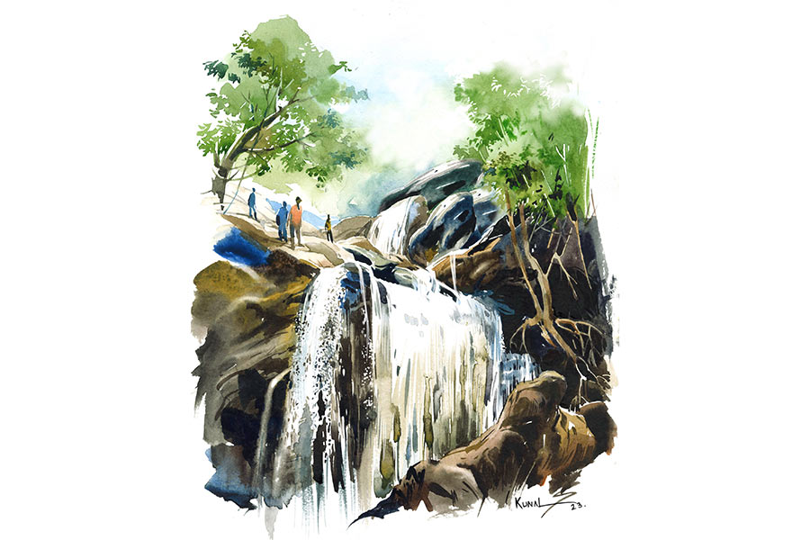

 
 <h1 align=center>উলট পুরাণ</h1>
<h2 align=center>বিশ্বজিৎ পাত্র</h2> সকালের ঠান্ডা ফুরফুরে বাতাস ঢুকছিল গাড়ির জানলা দিয়ে। তাতেই চোখ জুড়ে এসেছিল অমিতের। ট্রেনে গত রাতটা প্রায় না ঘুমিয়েই কাটিয়েছে সে। ট্রেনের দুলুনিই হোক আর নতুন জায়গায় বেড়াতে যাওয়ার উত্তেজনাই হোক, কী কারণে যে ট্রেনে ঘুম আসে না, তা আজও বোঝেনি অমিত। প্রথম প্রথম চেষ্টা করত ঘুমোনোর, কিন্তু গত কয়েক বার আর সে পথে না হেঁটে মোবাইলে চোখ রেখেই রাত কাটিয়ে দিয়েছে। তবে পরদিনটায় একটু রেশ থেকেই যায়। তাই ট্রেন থেকে নেমে সকালে হোটেলে ঢুকে ফ্রেশ হয়ে গাড়িতে সপ্তগড় যাওয়ার সময় একটু তন্দ্রা এসেছিল অমিতের। কিন্তু ঘুমোনোর কি আর উপায় আছে এ রকম বন্ধুরা সঙ্গে থাকলে!

অমিতকে একটু নাড়িয়ে দিয়ে প্রীতম জিজ্ঞেস করল, “কী রে, ঘুমোতে এসেছিস নাকি এখানে?”

মনে মনে একটু রেগে গেলেও রাগ করে বেশি ক্ষণ থাকতে পারে না অমিত। রাস্তার দু’দিকের সবুজ দেখতে দেখতে রাগ গলে জল হয়ে যায় ওর। গাড়ি একটু এগোতেই দেখা যায়, দূরে উঁকি দিচ্ছে পাহাড়-জঙ্গলে ঘেরা গন্তব্য, সপ্তগড়। অনেক বার আসার কথা হলেও আগে কোনও বার সুযোগ হয়নি।

ওরা চার বন্ধু। গৌরব, অনির্বাণ, প্রীতম আর অমিত। বেসরকারি সংস্থার কর্মী চার জনের মধ্যে মিলের চেয়ে অমিলই বেশি। তবে যেখানে তাদের সবচেয়ে বেশি মিল, তা হল হঠাৎ বেড়াতে বেরিয়ে পড়ার নেশা। এ বারও হোলিতে যে তারা সপ্তগড় আসবে, দু’দিন আগেও তারা জানত না। কোনও ভাবে ছুটির ব্যবস্থা হলেও ট্রেনের টিকিট একেবারেই পাওয়া যাচ্ছিল না। শেষ মুহূর্তে গৌরবের এক কাকার সৌজন্যেই টিকিট কনফার্মড হয়। ব্যস, চার জনেই হইহই করে ব্যাগ গুছিয়ে বেরিয়ে পড়েছে প্রকৃতির মাঝে কয়েকটা দিন হারিয়ে যেতে।

গৌরবকে অনির্বাণ জিজ্ঞেস করেছিল, “কী কী আছে সপ্তগড় ট্রেকিং-এ, গৌরবদা?”

অভিজ্ঞ গৌরবদা উত্তর দিল, “পাহাড়ের শুরুতে যে সমতল, সেখানে আছে একটা পুরনো গড়। এই রকম আরও ছ’টা গড় আছে জঙ্গলের চার দিক ঘিরে। সাতটা গড়ের জন্যই জায়গাটার নাম সপ্তগড়। সমতল থেকে ট্রেকিং শুরু করে আঁকাবাঁকা পথে বেশ কিছুটা গেলে প্রথমে পাওয়া যাবে একটা পুরনো মন্দির। আরও কিছুটা পাহাড়ি রাস্তা গেলে সপ্তগড় লেক। তবে…” এই পর্যন্ত বলে কিছু একটা ভেবে একটু থেমে যায় গৌরব।

অনির্বাণ পাল্টা প্রশ্ন করল, “তবে কী? থামলে কেন গৌরবদা?”

গৌরব জবাব দেয়, “খুব কম লোকই লেক পর্যন্ত যায় ট্রেকিং-এ।”

“কেন, খুব কম লোক যায় কেন?” জিজ্ঞেস করে প্রীতম।

গৌরব একটু চিন্তিত গলায় বলল, “জায়গাটা শুনেছি বিপজ্জনক।”

অমিত এ বার প্রশ্ন করল, “কেন, বিপজ্জনক কেন?”

আসলে কোথাও বেড়াতে গেলে বা ট্রেকিং-এ গেলে হোমওয়ার্ক করে যাওয়া গৌরবের পুরনো অভ্যাস। আর বয়সেও বাকিদের চেয়ে একটু বড় হওয়ার জন্য গাইডের কাজটা গৌরবই করে আসে বরাবর। অমিতের প্রশ্নে গৌরব একটু বিজ্ঞের মতো বলল, “আসলে সপ্তগড় জঙ্গলে এক সময় কিছু বন্য জীবজন্তু ও দুষ্প্রাপ্য গাছ ছিল, কিন্তু চোরাচালানকারীরা জঙ্গলের গাছ কেটে বাইরে পাচার করে দিচ্ছে। এই রকমই এক দল চোরাচালানকারীর নজর এখন সপ্তগড় জঙ্গলের উপর পড়েছে, আর তাদের মাস্টার-মাইন্ড এক মহিলা। সে আর তার শাগরেদরা নাকি লেকের কাছেই কোথাও আস্তানা নিয়েছে। তাই লেক পর্যন্ত ট্রেকিং করার লোক খুব কম। স্থানীয় পুলিশ-প্রশাসনের তরফে এক রকম বারণই আছে।”

 কথা বলতে বলতেই গাড়িটা পৌঁছল সপ্তগড় পাহাড়ের সমতল অংশে। এখানে গাড়ি নিয়ে বেশ কিছু পর্যটক ওদের আগেই এসে গেছে। ফলে জায়গাটা বেশ জমজমাট। হোলির দিন হওয়ায় এখানে প্রায় মেলার মতো অবস্থা। আশপাশের গ্রামের লোকেরা রং-আবিরের পশরা সাজিয়ে বসেছে পর্যটকদের জন্য। অনেকেই সপরিবার এসে রং খেলতেও শুরু করে দিয়েছে। ওরা চার জন একটা চায়ের দোকানে বসে গলাটা একটু ভিজিয়ে নিল। প্রীতম বয়স্ক দোকানদারের সঙ্গে ভাব জমিয়ে নিতে বেশি সময় নিল না। নিজেদের পরিচয় দিল। সঙ্গে বয়স্ক লোকটির হাঁড়ির খবর অর্থাৎ কোথায় বাড়ি, বাড়িতে কে কে আছে, কত দিন ধরে এখানে দোকান, এমনকি বছরের অন্যান্য সময়ে কী ভাবে তার সংসার চলে— কোনও খবরই তার জানতে বাকি রইল না।

প্রীতমের ইচ্ছে ছিল আরও কিছুটা সময় কাটিয়ে দেওয়ার, কিন্তু গৌরব বলল, “ট্রেকিং করে মন্দির পর্যন্ত গিয়ে ফিরে আসতে তিন-চার ঘণ্টা সময় লাগবে। তাই আর দেরি করাটা ঠিক হবে না।”

অমিত আর অনির্বাণও তাতে সায় দিল। দোকানদার লোকটিকে বিদায় দিয়ে এগোতে যাবে, এমন সময় লোকটি বলল, “এই বুড়োর এট্টা কথা রাখবা, বাবুরা?”

প্রীতম সঙ্গে সঙ্গে বলে ওঠে, “নিশ্চয়ই শুনব, কিন্তু কথাটা কী?”

লোকটি আশপাশ ভাল করে পর্যবেক্ষণ করে চাপা সাবধানী গলায় বলল, “মন্দিরির পর আর না এগুনোই ভাল বাবারা, শুনিচি ও দিকটায় এট্টু বিপদ আচে।”

চার জনেই প্রায় এক সঙ্গে ঘাড় নেড়ে সম্মতি দিল, প্রীতম শুধু মুখে বলল, “আচ্ছা।”

পাহাড়ি পাথুরে আঁকাবাঁকা পথে ধীর পায়ে এগোচ্ছিল তারা। আশপাশে লোকজন খুব কম। শুধু নাম না জানা পাখির ডাক ভেসে আসছিল কখনও কাছ থেকে, কখনও দূর থেকে। প্রকৃতির মনোমুগ্ধকর রূপ দেখতে দেখতে চার জনে যেন কোথায় হারিয়ে গিয়েছিল।

বাস্তবে ফিরে এল নারীকণ্ঠের প্রশ্ন শুনে, “কত দূর যাবেন আপনারা?”

চার জনেই ঘুরে দেখল, দু’টি যুবতী তাদের দিকেই জিজ্ঞাসু দৃষ্টিতে তাকিয়ে আছে। এক জনের পরনে জিন্‌স ও সবুজ রঙের টপ, আর-এক জন নীল সালোয়ার-কামিজ। কাঁধে ঝোলানো লেডিজ় ব্যাগ। দু’জনেরই গালে আবিরের রং আর চুলের খোঁপায় পাহাড়ি ফুলের মালা, চোখে সানগ্লাস। এক ঝলক দেখেই বেশ আকর্ষক মনে হল প্রীতমের।

বাকি তিন জন কিছু বলার আগেই প্রীতম উত্তর দিল, “ইচ্ছে তো ছিল মন্দিরটা দেখার, আর আপনারা?”

“আমরা কিছু ঠিক করিনি। যত দূর যেতে ইচ্ছে হবে তত দূর যাব,” সালোয়ার-কামিজ পরা মেয়েটি উত্তর দেয়। দু’টি মেয়েকে পাহাড়ের এই প্রায় নির্জন জায়গায় দেখে অবাক হলেও কেউ কিছু জিজ্ঞেস করল না। ব্যতিক্রম শুধু প্রীতম। মানুষের সঙ্গে মিশে যাওয়ার গুণ তার অসাধারণ। তাই আলাপ জমতে দেরি হল না। জানা গেল এক জনের নাম তানিয়া আর অন্য জনের নাম মহুয়া। জিওলজি নিয়ে রিসার্চ করছে।

মহুয়া জানতে চাইল, “আপনারা কী করেন?”

এ বার অমিত ভাবল উত্তরটা সে দেবে, কিন্তু তার কিছু বলার আগেই প্রীতম সগর্বে বলে ওঠে, “আমরা স্পেশাল ব্রাঞ্চ, পুলিশ ফোর্স।”

চমকে ওঠে বাকি সকলে। প্রীতম যে এত সুন্দর করে গুছিয়ে মিথ্যে বলতে পারে, তার প্রমাণ প্রতিবারই কিছু না কিছু পেয়েছে বাকিরা, কিন্তু এ বারেরটা একটু বেশিই হয়ে গেল। গৌরব তো ভাবল বলেই দেবে যে, কথাটা মিথ্যে, কিন্তু নিজেরাই ছোট হয়ে যাবে ওদের সামনে, তাই আর বলল না।

ধীরে ধীরে আলাপ গভীর হল। মহুয়া মেয়েটিই বেশি কথা বলছিল, তানিয়া প্রায় কিছুই বলছিল না। কথা বলতে বলতে ওরা পৌঁছে গেল মন্দিরের কাছে। পুরনো মন্দির। দেখে মনে হয় যেন অনেক ইতিহাসের সাক্ষী। মন্দিরের চার দিকে কিছুটা সমতল জায়গা, যেখানে ওরা বসে বিশ্রামের সিদ্ধান্ত নিল। এইখানটা থেকে নীচের অনেকটা জায়গার দৃশ্য এক সঙ্গে দেখা যায়। একটু দূরে বয়ে যাচ্ছে ছোট্ট পাহাড়ি ঝোরা।

অনির্বাণ বলল, “চল, ও দিকটায় গিয়ে ঝোরাটা দেখে আসি,” যদিও অমিত ছাড়া আর কেউ বিশেষ আগ্রহ দেখাল না। অমিত আর অনির্বাণ ঝোরাটায় গিয়ে স্বল্প জলের ধারা থেকে জল নিয়ে চোখেমুখে দিল। বাকিরা যেখানে বসেছিল সেখানে ফিরে আসতে আসতেই কোথা থেকে যেন সুরেলা গান ওদের কানে এল।

“আরে, প্রীতম গাইছে না?” জিজ্ঞেস করল অনির্বাণ।

“হ্যাঁ, তাই তো মনে হচ্ছে,” অমিত বলল। কাছে এসে ওরা শুনল, প্রীতম গাইছে, “হোঠোঁ সে ছুঁ লো তুম, মেরা গীত অমর কর দো...”

অমিত দেখল, তানিয়া আর মহুয়া মন্ত্রমুগ্ধের মতো বিভোর হয়ে শুনছে। তানিয়া তো অবাক দৃষ্টিতে তাকিয়ে আছে প্রীতমের দিকে। গান শেষ হওয়ার পরও যেন কিছু ক্ষণ সময় লাগে বাস্তবে ফিরে আসতে। নীরবতা কাটল অনির্বাণের প্রশ্নে, “লেকের দিকটা একটু ঘুরে এলে হয় না, কী বলিস প্রীতম?”

প্রীতম বলল, “হ্যাঁ সে তো যাওয়া যেতেই পারে, কিন্তু রিস্কি হবে না তো যাওয়াটা? যা সব শুনছি...”

হেসে উঠল মহুয়া, বলল, “সঙ্গে তো পুলিশ আছেই, ভয় কী?”

ভুল বুঝতে পারল প্রীতম, তাই তাড়াতাড়ি বলল, “লেট’স গো।”

সবাই মিলে এগিয়ে চলল সপ্তগড় লেকের দিকে। সূর্য এই সময় মাথার উপর এসে যাওয়ায় কিছু দূর অন্তর বিশ্রাম নিয়ে এগোচ্ছিল ওরা। ঘণ্টাখানেকের মধ্যেই ওরা সবাই পৌঁছে গেল লেকের প্রান্তে। লেকের ব্যাপারে যে ভয়টা পাহাড়ে ওঠার আগে তাদের ঘিরে রেখেছিল, মহুয়া আর তানিয়ার সঙ্গ যেন ধীরেধীরে সেই ভয়টাকে তাদের মন থেকে মুছে ফেলেছিল।

কিন্তু বাস্তবে ভয়ের কারণটা ছিলই, আর তার জন্য একেবারেই প্রস্তুত ছিল না প্রীতমরা। এই সময় জঙ্গলের নিস্তব্ধতা ভঙ্গ করে কানে এল বন্দুকের গুলির শব্দ এবং গুলিটা যে তাদের উদ্দেশেই করা হয়েছে তা বুঝতে বাকি থাকল না কারওই। পরমুহূর্তের ঘটনাটা অবশ্যই প্রীতমের সারাজীবনের উল্লেখযোগ্য ঘটনাগুলির মধ্যে অন্যতম হয়ে থাকবে। তানিয়া মুহূর্তের মধ্যে শরীরটাকে ছুড়ে দিয়ে প্রীতমকে ধাক্কা দিয়ে একটা বড় গাছের পাশের কাঁটাঝোপের মধ্যে ফেলে দিল আর আক্রমণকারীদের পরের গুলির নিশ্চিত নিশানা থেকে প্রীতমকে বাঁচাল। কাঁটাঝোপে হঠাৎ পড়ে গিয়ে এবং ঘটনার আকস্মিকতায় জ্ঞান হারাল প্রীতম।

জ্ঞান যখন ফিরল, তখন প্রীতম দেখল যে, সে হাসপাতালে শুয়ে। একে একে দেখতে পেল গৌরব, অমিত আর অনির্বাণকে। মাঝখানের ঘটনাটা সে জানতে পারল ধীরে ধীরে। প্রীতম জ্ঞান হারানোর সঙ্গে সঙ্গেই অমিত, অনির্বাণ আর গৌরবকে অবাক করে ব্যাগে লুকিয়ে রাখা বন্দুক বার করে নিখুঁত নিশানায় আক্রমণকারীদের পাল্টা জবাব দিল তানিয়া আর মহুয়া। আর গুলি বিনিময় শুরু হতেই দেখা গেল আড়াল আবডাল থেকে পিলপিল করে বেরিয়ে এল মিলিটারি পোশাকের বন্দুকধারীরা। তাদের গার্ড করে লড়তে লাগল জঙ্গলের আক্রমণকারীদের বিরুদ্ধে। ব্যাকআপ টিম ওদের পিছন পিছনই আসছিল, ওরা টের পায়নি।

বিপদ কেটে গেছে বুঝে অমিত আর গৌরব বেরিয়ে আসে বড় গাছের গুঁড়ির পিছনের আশ্রয় থেকে। অমিত কাঁপা কাঁপা গলায় জিজ্ঞেস করে, “আপনাদের কাছে বন্দুক?”

এ বার উত্তর দিল তানিয়া, “জঙ্গলের কাঠ চোরাচালানকারীদের মাস্টার-মাইন্ড এক মহিলা আর তার শাগরেদরা যে এই লেকের আশপাশে লুকিয়ে ছিল, সে খবর আমাদের কাছে ছিল। তাদের খোঁজ করতেই এত দূর ট্রেকিং-এ আসা।”

গৌরব জিজ্ঞেস করল, “তা হলে আপনারা...”

কথা শেষ হওয়ার আগেই তানিয়া মুচকি হেসে উত্তর দিল, “আমরা স্পেশ্যাল ব্রাঞ্চ, পুলিশ ফোর্স।”

ঘটনাটা শুনে প্রীতম শুধু এইটুকুই বলতে পারল যে, “ওরাই তা হলে আসল পুলিশ!”

অনির্বাণ বলল, “ও ভাল কথা, তোর জন্য একটা সারপ্রাইজ় আছে,” বলে একটা গোলাপের বোকে এগিয়ে দিল প্রীতমের দিকে। প্রীতম বোকেটা ঘুরিয়ে ফিরিয়ে দেখল, তাতে একটা কার্ড। লেখা আছে, “গেট ওয়েল সুন, ফ্রম তানিয়া।” বোকেটা ঘুরিয়ে ফিরিয়ে আরও কিছু খোঁজার চেষ্টা করছিল প্রীতম।

অমিত বলল, “মোবাইল নাম্বার খুঁজছিস? ওটা দেয়নি।”

হেসে উঠল সবাই। প্রীতমকে কেউই জানাল না যে, তানিয়া ওর ফোন নাম্বার নিয়েছে।

ট্রেনে ফেরার সময় কেমন একটা উদাস ভাব ছিল প্রীতমের মধ্যে। কারও সঙ্গে কথা বলছিল না খুব একটা। মোবাইলটা নিয়ে ট্রেকিং-এর সময় তোলা ছবিগুলো একমনে দেখছিল। এমন সময় অজানা নাম্বার থেকে হোয়াটসঅ্যাপে একটা মেসেজ আসতেই হাসি ফুটল প্রীতমের মুখে।

অমিত, গৌরব আর অনির্বাণ এক সঙ্গে বেসুরো গলায় গেয়ে উঠল, “হোঠোঁ সে ছুঁ লো তুম, মেরা গীত অমর কর দো...”