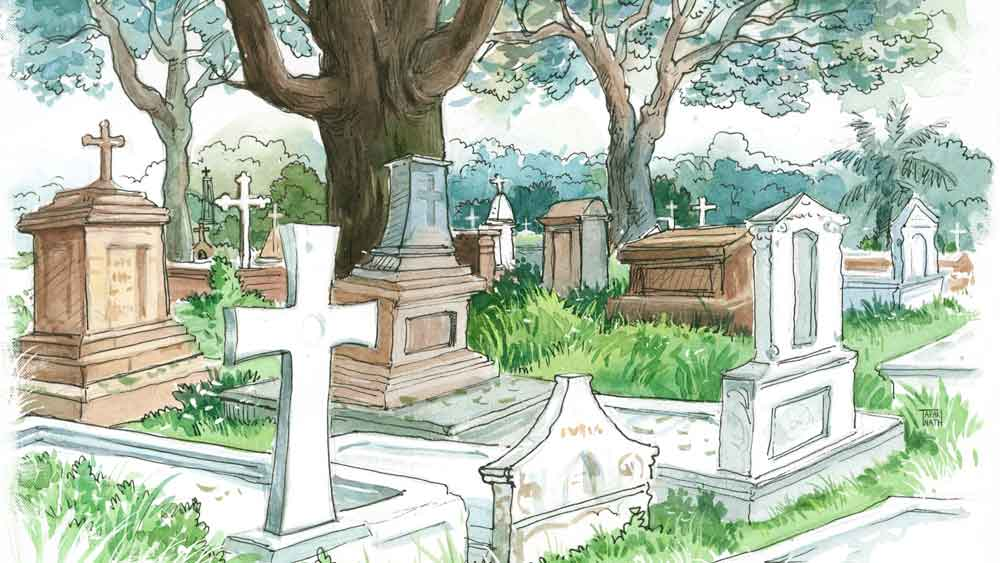

 
 <h1 align=center>উল্কি রহস্য</h1>
<h2 align=center>জিনিয়া সেন</h2> একটি পাঁচ-ছ’বছরের মেয়ে দরজাটা হালকা ঠেলে মুখ বাড়িয়ে জিজ্ঞেস করে, “আন্টি, হাউ মাচ টাইম উইল মাম্মি নিড টু গেট রেডি?”

তার পরনে ছাইরঙা ফ্রক, পরিষ্কার কালো পাম্প শু, চুলটা টেনে বাঁধা। মেহগিনি কাঠের দরজাটা ভিতর থেকে ভেজিয়েই রেখেছিল সারা। বাইরের জ্বলতে থাকা লাল আলোটা বুঝিয়ে দেয় সে ব্যস্ত। এই সময় কেউ ঘরে ঢুকলে তার ছাড় নেই। কিন্তু খুদে অতিথিকে তেমন কিছু বলে না সারা।

“আর চল্লিশ মিনিট। তুমি বাইরে বোসো। মাম্মি রেডি হলেই আমি ডাকব। সঙ্গে কে আছে? বাবা?” জিজ্ঞেস করে সারা।

মেয়েটি বলে, “আমার সঙ্গে আছে বাবা, গ্র্যান্ডপা, গ্র্যানি, থিও আঙ্কেল আর মেলিসা আন্টি।”

“আচ্ছা দেখছি... তোমার নামটা?” জানতে চায় সারা।

মেয়েটি জানায় তার নাম মিলি। মিলি ডি’ক্রুজ়।

সারার আজ ব্যস্ততার শেষ নেই। একে আসতে দেরি হয়েছে। মায়ের পেটের ব্যথাটা বেড়েছে রাত থেকে, তাও ভদকা খাওয়া চাই। ডাঃ নীলাঞ্জনকে জানাতে বাড়িতে কম্পাউন্ডার পাঠিয়ে ইঞ্জেকশন দিয়ে গিয়েছে। একটা ইঞ্জেকশনের সিরিঞ্জে ফর্মালডিহাইড-ভিত্তিক কেমিক্যাল ভরতে ভরতে মায়ের কথা মনে পড়ে তার। ভদকার বোতলটা ব্যাগে ভরে নিয়ে চলে এসেছে সারা। আর কেয়ারটেকার ভজুদাকে বলে এসেছে, কোনও ডেলিভারি বয় মায়ের খোঁজ করলেই সে যেন বলে দেয় বাড়ির সবাই শঙ্করপুরে বেড়াতে গেছে। মদের অ্যাপ-ডেলিভারিটা আটকানো কঠিন হয়ে উঠছে।

ইঞ্জেকশনটা দিতে দিতে প্রথম বার মেয়েটির দিকে চোখ যায় সারার। বাঃ কী সুন্দরী! লম্বাটে মুখ, টানা টানা চোখে বড় বড় পাতা, টিকোলো নাক, কয়েক গাছা হাইলাইট করা চুল কানের ওপর পড়ে আছে, কোন কালার এটা! চোখের ওপরের বাদামি লাইনারটা তো বেশ! এটা নিশ্চয়ই অনলাইনে কেনা, না হলে সাউথ সিটি বা কোয়েস্ট মল।

“জানো, আমি হেয়ার কালার করাব ভেবেছি কত বার! কিন্তু হয়ে ওঠেনি। তোমার চুলে কী কালার এটা?” হাতের কাজ সারতে সারতে জিজ্ঞেস করে সারা। উত্তর আসে না। এরকম সারার সঙ্গে রোজই ঘটে। কিন্তু তাতে কী হল! সে শুনেছে মৃত্যুর পরও ছ’ঘণ্টা নাকি মানুষ শুনতে পায়, তাই বলতে না পারলেও, কথাগুলো জানতে তো পারবে।

সার্জিকাল কাজ শেষ। মেয়েটির শরীরে আর কোনও বায়ু বা জলীয় পদার্থ নেই। তার চোখগুলো সুন্দর করে বন্ধ করে দিয়েছে সারা। ঠোঁটটা একটুও বেঁকে নেই, কিন্তু শুকিয়ে কাঠ। চমৎকার একটা সবুজ গাউন পরিয়ে দিয়েছে সে। এবার সাজানোর পালা। পরিবারের তরফ থেকে অনেক সজ্জা-সামগ্রী এসেছে— লিপস্টিক, স্টুডিয়োফিক্স, আইলাইনার, রুজ়, ফরাসি পারফিউম... “তোমায় দারুণ দেখাবে আজ!” সারা কমপ্লিমেন্ট দিতে সিদ্ধহস্ত, যদি এটুকুও আনন্দ দেওয়া যায় তাদের, যারা চলে গেছে না ফেরার দেশে।

সুন্দরী অপরিচিতার নামটা জানতে ইচ্ছে হয় সারার। ডেথ সার্টিফিকেটটা খুলে দেখে—এডেল ডি’ক্রুজ়। এডেল— তার প্রিয় গায়িকার নাম। আজ ফিরে গিয়ে মায়ের সঙ্গে এডেলের গান শুনবে, ‘হ্যালো’ বা ‘রোলিং ইন দ্য ডিপ’।

“এডেল, তোমার লাগছে না তো?” চুলের অল্প জট ছাড়াতে ছাড়াতে জিজ্ঞেস করে সারা। হাল্কা মসৃণ চুল, ঘষা লেগে জট পড়েছে কয়েকটা, কী সুন্দর গন্ধ।

“কোন ব্র্যান্ডের শ্যাম্পু এটা?” সারা চুল আঁচড়ে রোলার লাগিয়ে দেয়। তখনই দরজায় হাল্কা নক। সারার চোয়াল শক্ত হয়। সারা বলে, “মিলি, প্লিজ় ওয়েট ফর আ হোয়াইল!”

উত্তরে আসে, “নো, ইটস হার ড্যাড।”  সারা বলে, “বলুন”।

উনি বলেন, “একটু যদি তাড়াতাড়ি করা যায়। আমাদের পরিবারের প্রায় প্রত্যেকেই অন্যান্য শহর থেকে এসেছেন। অনেকেই রাতের ফ্লাইটে ফিরে যাবেন। আর তার জন্য যদি এক্সট্রা টাকা লাগে...”

কথার মাঝখানেই সারা বলে, “আপনারা যখন খুশি নিয়ে যেতে পারেন। আমি রোলার্স খুলে নিচ্ছি...” মিলির ড্যাড বলেন, “না, আমি তা বলিনি, শুধু সময়টা জানতে চাই।”

সারা জানায়, “আধ ঘণ্টা।”

মিলির ড্যাড বলেন, “আপনি করুন, আমি বাইরে ওয়েট করছি।”

পেটানো চেহারা, লম্বায় ছ’ফুট, পরনে কালো স্যুট, পালিশ করা কালো জুতো, ঠিক যেন মিলস্‌ অ্যান্ড বুনের হিরো। কড়া ভাবে কথা বললেও, কোথাও যেন একটু মায়া হয় সারার।

বয়স কত হবে এডেলের? পঁচিশ কি ছাব্বিশ! ভাবতে ভাবতে ঠোঁটের লাইনারটা লাগায় সারা। হাল্কা একটু ফাউন্ডেশন দিয়ে দিয়েছে সে, যাতে ফাটা ঠোঁট আর বোঝা না যায়। এবার একটা মেরুন লিপস্টিক লাগাবে সে। “মেরুন আর সবুজ কিন্তু দারুণ কম্বিনেশন। তুমি বিয়েবাড়ি গেলেও এটাই চুজ় করতে, তাই না?”

এক বার মুখটা দেখে নেয় সারা। তাড়াতাড়ি সজ্জাসামগ্রীগুলো চোখ দিয়ে মিলিয়ে নেয়। হ্যাঁ, স্টুডিয়োফিক্সটা লাগিয়ে দিয়েছে সে, চোখে কালো লাইনারও পরানো হয়ে গেছে, হাল্কা করে কাজলের একটু ছোঁয়া দিয়েছে সে, আর শিমারি আই শ্যাডো। মেরুন লিপস্টিকটা লাগাতেই মুখটা ঠিক প্রতিমার মতো সেজে উঠেছে। এমবামিং কিন্তু খুব উঁচু দরের আর্ট, নিজেকে মনে মনে প্রশংসা করে সারা। ঠিক যেন ফাঁকা ক্যানভাসকে তুলির টানে জীবন্ত করে তোলা। তাও এই পোড়া শহরে কত জন তার কাজের কদর বোঝে! মৃতদেহকে দীর্ঘ ক্ষণের জন্য আরও সতেজ আর তরতাজা করে তোলার আর্টকে যে এমবামিং বলে, সে কথা জানেই বা ক’জন!

‘স্কাইফল’-এর টিউনটা বেজে ওঠে। এডেলের গাওয়া এই গানটাই সারার রিংটোন। ফোনটা সে আজ সাইলেন্ট করেনি, মায়ের কথা ভেবে। ভজুদার নামটা স্ক্রিনে ভেসে ওঠায় ফোনটা ধরে সারা।

“মা বলে রেখেছে তার ডেলিভারি আসবে চারটের সময়। আমায় নীচে থাকতে বলেছে, আমি মায়ের হাতে পৌঁছে দিলেই নগদ ৫০ টাকা,” ফোনের ও দিক থেকে জানায় ভজুদা।

“তুমি ডেলিভারি বয়কে ভাগাতে পারলে নগদ ১০০ টাকা,” বলে ফোন কেটে দেয় সারা।

“সরি এডেল,” বলে নেলপলিশ রিমুভারটা তুলে নেয়। আর মাত্র ১৫ মিনিটের ব্যাপার। নখগুলো পরিষ্কার করে শুধু নেলপলিশটা পরিয়ে দেওয়া আর রোলার্স খুলে নিয়ে চুলটা একটু হাল্কা হাতে সাজিয়ে দেওয়া। কিন্তু নেলপলিশ রিমুভারের বোতলটা ঠিক খুলছে না যে! জোরে খোলবার চেষ্টা করে সারা এক বার। মনে হয় বেশ কিছু দিন ব্যবহার করা হয়নি। আর এক বার প্যাঁচটা ঘোরাতে খানিকটা স্পিরিট এডেলের কব্জির ওপর পড়ে। 

“ইস, আমি এক্ষুনি তুলে দিচ্ছি।”

একটু তুলো ছিঁড়ে নিয়ে কব্জিটা পরিষ্কার করতে করতে বেশ খানিকটা কালো রং উঠে আসে। সারা ভাবে, সে কি ঠিক দেখছে! কব্জির ঠিক ওপরে একটা উল্কি, তাতে লেখা নীলা— এন-ই-ই-এল-এ। কিন্তু শেষ ‘এ’ অক্ষরটা তো উঠে এল! তবে কি পুরোটাই উঠে আসবে। স্পিরিট নিয়ে উল্কির ওপর হাল্কা করে ঘষে সারা। হয়তো শখ করে লিখেছিল এডেল।

বারবার ঘষা সত্ত্বেও নীলা থেকে শুধু শেষ ‘এ’-অক্ষরটাই ওঠে, বাকিটা অর্থাৎ ‘নীল’ থেকে যায়। এ বার খটকা লাগে সারার। এ রকম তো হওয়ার কথা না। নীল, যেটা প্রচলিত খ্রিস্টান নাম, তার বানান হওয়া উচিত ‘এন-ই-আই-এল’। আর যদি নামটা নীল হয়, সেটা ঢাকা দেওয়ার চেষ্টা কেন করা হল, কেই বা করল?

উল্কিটা বারবার করে দেখতে গিয়ে আরও একটা জিনিস নজরে পড়ে সারার। ইঞ্জেকশনের হাল্কা একটা দাগ না ওটা! নাকি সে ভুল দেখছে। উল্কির মধ্যে দিয়ে কি তবে কেউ ইঞ্জেকশন পুশ করেছিল। এডেলের মৃত্যু কি তবে স্বাভাবিক নয়? এডেলের উল্কিটার উপর লাইনার দিয়ে আগের মতো ‘এ’ যোগ করে দেয় সারা।

“এডেল, তোমার মনে পড়ে মৃত্যুর আগের কথা? এডেল... এডেল... এডেল...” ডেকে ওঠে সারা। কোনও উত্তর আসে না। আরও এক বার ডেথ সার্টিফিকেট’টা খুলে দেখে নেয় সে— “ডেথ ডিউ টু কার্ডিওভাস্কুলার ফেলিওর ইন স্লিপ” লেখা আছে। ঘুমের মধ্যে স্বাভাবিক মৃত্যু। সারা ফোনটা আনে টেবিল থেকে। স্পিড ডায়ালে গিয়ে স্যান্ডিকে ফোন করে। স্যান্ডি মানে সন্দীপন ঘোষ। ডেপুটি কমিশনার অফ পুলিশ, লালবাজার। এক কলেজে পড়েছে সারা আর স্যান্ডি। বন্ধুত্বটাও একটু স্পেশাল, কিন্তু তাই বলে নর্মাল গার্লফ্রেন্ড-বয়ফ্রেন্ড তারা নয়। সারার কমিটমেন্ট ফোবিয়া আর স্যান্ডির ব্যস্ততা মিলিয়ে সম্পর্কের সমীকরণটা বেশ আলাদা। কিন্তু সারার সব সমস্যায় স্যান্ডি আছে আর স্যান্ডির সব সমাধানে সারা। ফোনটা বেজে যায়। স্যান্ডিকে না পেয়ে ল্যান্ডলাইনে কল করে সারা। এত দিনের বন্ধুত্বের সুবাদে খানচারেক ল্যান্ডলাইন নাম্বার সারার মুখস্থ। ফোন পেয়ে প্রশ্ন করে,  “সন্দীপন আছে, সন্দীপন ঘোষ?”

“স্যর তো মিটিংয়ে আছেন। বেরোলে কিছু কি বলতে হবে?” ফোন ধরে জিজ্ঞেস করে ওপারের লোকটি। উত্তরে সারা বলে, “বলবেন, সারা সালভাডর ফোন করেছিল। সারা সালভাডর, এমবামিস্ট।”

“পামিস্ট তো, পামিস্ট?” লোকটি জিজ্ঞেস করে।

“শুধু সারা ফোন করেছিল বললেই হবে। আচ্ছা রাখছি, নমস্কার,” বলে ফোন রেখে দেয় সারা।

নেলপলিশটা পরিয়ে দেয় সারাহ্‌। এর মধ্যে দরজায় টোকা পড়ে বেশ কয়েক বার।

“ইয়েস, প্লিজ়।”

মিলি এসেছে তার বাবার সঙ্গে। সারা বলে, “আই অ্যাম ডান। ফ্রন্ট অফিসে বলুন এক বার কাফিলকে, লোক পাঠিয়ে কাস্কেটে তুলে দেবে।”

“ওহ থ্যাঙ্ক ইউ সো মাচ!” মিলির বাবা বলেন।

“আচ্ছা, আপনার নামটা জানা হল না!” সারা বলে ওঠে। উত্তরে তিনি বলেন, “পল, পল ডি’ক্রুজ়… অ্যান্ড মাই ডটার, মিলি।”

সারা বলে, “মিলি ক্যান স্টে।”

পল চলে গেলে, সারা বলে, “নীলা ইজ় আ নাইস নেম।”

অবাক হয়ে তাকিয়ে থাকে মিলি।

“ইউ মাস্ট বি নোয়িং নীলা, ইজ় ইট ইওর মাদার’স পেট নেম? নীল-আ, নীল-আ...” নীলের ওপর জোর দিয়ে বলতে থাকে সারা।

“নীল ইজ় হার ফ্রেন্ড!” বলে মিলি দৌড়ে দরজা দিয়ে বেড়িয়ে যায়। সারা রোলার্স খুলে নেয় এডেলের চুল থেকে। হাত দুটো পেটের ওপর রেখে দেয়। কাফিল লোক পাঠিয়েছে। চার জন মিলে ধরে সুন্দর একটা কাস্কেটে রেখে দেয় এডেলকে। তার পর তাকে বাইরে নিয়ে যাওয়া হয়। হাতটা পরিষ্কার করে ধুয়ে বাইরে আসতেই পলের সঙ্গে দেখা হয়। তিনি বলেন, “থ্যাঙ্ক ইউ মিস সারা। ইউ আর দ্য বেস্ট। সবাই আপনার কাজের প্রশংসা করেছে অনেক, তাই আপনার কাছে আসা।”

“আবার দেখা হবে…” সারা বলে।

“হোয়াট?” অবাক হয়ে পল জিজ্ঞেস করে।

“না, ওটা কথার কথা। মানে সি ইউ আর কী!” সারা উত্তরে জানায়।

 

সবাই চলে যাওয়ার পর রুমে ফেরে সারা। ফোনটা অনবরত বেজেই চলেছে।

“চার বার ফোন করেছি!” ও পারে স্যান্ডির উদ্বিগ্ন গলা।

“খ্রিস্টান বেরিয়াল গ্রাউন্ডের দিকে যে প্রসেশনটা যাচ্ছে, ওটা আটকা! ইমিডিয়েটলি!” বলে ওঠে সারাহ্‌।

স্যান্ডি বলে, “কী হয়েছে, তাড়াতাড়ি বল!”

পুরো ঘটনাটা এক নিঃশ্বাসে শেষ করে সারা।

“ফর্মাল একটা কমপ্লেন পাঠাচ্ছিস তো?” জিজ্ঞেস করে স্যান্ডি।

“ইয়েস স্যর!” উত্তরে বলে সারা।

 

ঘড়িতে রাত ন’টা। সারার মা অ্যাঞ্জেলা স্টার ফ্রায়েড চিকেন রান্না করতে করতে একটু রাম ঢেলে দেন। সারা বলে “উফ মম! বারণ করেছি বহু বার। এই পেটের অবস্থায় রাম দিয়ে রান্না কোরো না। লেট মি মেক সাম স্যুপ।”

“তুই চুপ কর। রাম ইজ় হেলদি।”

“অ্যান্ড সো ইজ় ভদকা। উফ!” বলতেই সারার ফোনটা বেজে ওঠে।

ও পারে স্যান্ডির গলা, “থ্যাঙ্ক ইউ সেরু!”

সারা বলে, “কী হল বল?”

স্যান্ডি জানায়, “বেরিয়াল গ্রাউন্ডে গিয়ে ধরলাম। ডেথ সার্টিফিকেট দেখাচ্ছিল, কিন্তু ওতে কী হয়। আমি বললাম আমাদের কাছে রিটন কমপ্লেন এসেছে। তার পর আর কী, আবার অটোপ্সি। ডেথ ডিউ টু ইঞ্জেক্টিং এয়ার থ্রু দ্য পালমোনারি ভেন। আর ভুয়ো ডাক্তারের রেজিস্ট্রেশনও ক্যান্সেল করা হয়েছে।”

“কনফেশন?” উত্তেজিত হয়ে সারা জিজ্ঞেস করে। স্যান্ডি জানায়, “হ্যাঁ, মহিলা প্রেম করছিল। কোনও এক নীল। নীল ব্যানার্জি। ওদেরই এক পারিবারিক বন্ধু। এডেল লুকোতে চায়নি, পলকে জানিয়েছিল মনের কথা। পল অনেক দিন ধরেই প্ল্যান করছিল, শেষে এ ভাবেই খুনটা করে।... কথায় বলে অতি বড় সুন্দরী না পায় বর, আর অতি বড় ঘরনি না পায় ঘর। তবে তুই সুন্দরীও নোস, আর ঘরনিও নোস, কাজেই তোর চিন্তা নেই।”

সারা গলায় ছদ্মবিরক্তি ফুটিয়ে বলে, “চুপ কর তো তুই!”