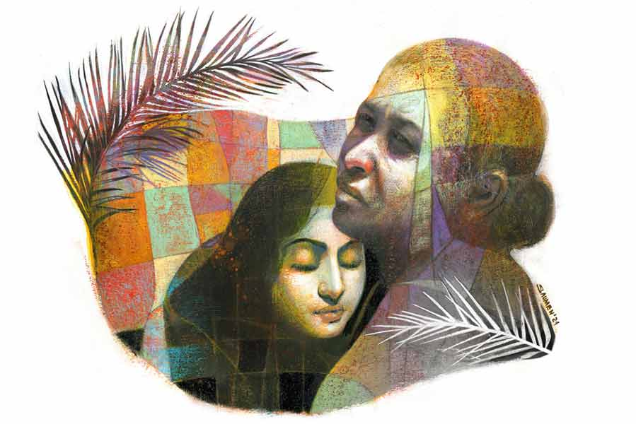

 
 <h1 align=center>উড়ান</h1>
<h2 align=center>সব্যসাচী ধর</h2> 

কই রে, চাঁপার মা, পলির মা, বিজনের মা... কোথায় গেলি রে সব?”

হাঁকডাক শুনে প্রায় সকলেই ঘর থেকে বলে, “আমাদের ছোড়দা যে, যাই গো যাই...”

ছোড়দা, মানে প্রাণকেষ্ট জোয়ারদারের ডাক এদের খুব চেনা। মুখ দেখতে হয় না, গলার আওয়াজেই বুঝে যায় ওরা— এটা ‘হুলোর ডাক’। প্রাণকেষ্টকে সামনে ছোড়দা বললেও আড়ালে ওরা বলে হুলো। কোমর থেকে পা অবধি অসাড় নন্দাবুড়ি এক বার বলেছিল, “কে এত হুলোয় দেখ তো বৌ।” বুড়ির দেশের বাড়ি বোলপুরের ও দিকে কোন মুলুকে। সেখানে নাকি চিৎকার করে ডাকাকে ‘হুলোনো’ বলে। সেই থেকে আড়ালে ছোড়দার আর এক নাম হুলো।

আগে ঘরগুলোর মাঝে দু’-চারটে উঠোন ছিল, এখন আর নেই। পার্টির দাদারা দরকার মতো ঘর বসিয়েছে। নতুন কোনও লোক এসে বলেছে, “পাট্টা দিলে। বড়দা পাঠালে।” বড়দা পাঠালে তেঁতুলপাতায় ন’জন কেন, আঠারোও অসম্ভব নয়। কিছু দিনের মধ্যেই আবাসের টাকায় দাদার সেবকবাহিনী দিনকে রাত করে ঘর তুলে দেয়। ইট, বালি, পাথর এসে যায় বড়দার সেবক নেপু, ভ্যাবলাদের ইমারতি থেকে। কিচ্ছুটি টের পেতে হয় না নতুন বাড়ির মালিককে। শুধু এটা-সেটা কাগজে সই করে দাও, না পারলে স্যাট করে একটা বুড়ো আঙুলের ছাপ দিয়ে দাও, ব্যস! নেপুদের জিন্সের নানা পকেটে নানা ব্যবস্থা থাকে, টিপছাপের কালি থাকবে না, তা কি হয়?

সংসারে সংসারে হাঁড়িকুড়িতে ঠোকাঠুকি লাগলেও ঘর বেড়েছে রামকৃষ্ণপল্লিতে। আগে বাবুবাড়ির কাজ সেরে এসে শীতের দুপুরে মাথার চুল খুলে বসা যেত। চিলতে উঠোনে বসেই মুখে পান-সুপুরি ভরে মনের সুখে বাবুবাড়ির আদবকায়দা নিয়ে খিল্লি করা যেত। এখন আর সে সুখ নাই। নন্দামাসির মুখের হিজিবিজি বলিরেখার মতো আঁকাবাঁকা ড্রেন চলে গেছে উঠোনের এলাকা দিয়ে।

পলির মা নাইটির উপরে গামছাটাকে ওড়নার মতো ফেলে চটপট বাইরে আসে। সময় নষ্ট না করে আশপাশের বাড়ির দিকে গলা বাড়িয়ে ফাটা বাঁশির মতো চিৎকার করে, “ওরে, কানের মাথা খেয়েছিস নাকি রে সব? ছোদ্দা রে!”

তবে রামকৃষ্ণপল্লির এরা জানে, যে দলই আসুক, আর যে দাদাই নেতা হোক না কেন, এদের ছাড়া গতি নাই। আগের আমলেও মিটিং মিছিল অবরোধ হলে দল বেঁধে যেত ওরা।

এখনও যেতে হয়। মিছিল-মিটিংয়ের সব স্লোগান মুখস্থ ওদের। শুধু মিটিং মিছিল উতরে দিলেই হয় না, ও দিকে দুটো দিন কামাই করলে বাবুদের ঘরদোরও অচল। তখন বৌদিমণিদের কী নরম সুরে ডাক!

জানলা দিয়ে মুখ বার করে বিজনের মা মাধু জিজ্ঞেস করে, “কী হল দাদাবাবু?”

পিচ করে পিক ফেলে জ্বলন্ত সিগারেটে একটা লম্বা টান দিয়ে ছোড়দা বলে, “মাধুদি, সামনের শনিবার, ওই সকাল ন’টা, বড়দা বলে দিয়েছে কিন্তু, এই রামকৃষ্ণ থেকে ধরো কমসেকম দুশো লোক চাই।”

“শনিবার? বাবুবাড়ির কাজ যে ছোড়দা! বৌদিমণির ইস্কুল। তা রবিবার করলে হত না ছোড়দা?”

মাধু আরও কিছু বলত। মাধুর সঙ্গে কথা বললেও প্রাণকেষ্ট ড্রেনের ও পারে চাঁপাদের ঘরের দিকে তাকিয়ে ছিল এত ক্ষণ। ঘুরে মাধুর দিকে তাকাতেই ও বুঝতে পারে, শনিবার রবিবারের কথা বলা ঠিক হয়নি। এ বার এক মুখ হাসি এনে বলে, “শনিবার তো? আচ্ছা দাদা। খুব ভাল। একটা বেলা রুনুবৌদি ঠিক চালিয়ে নেবে দাদা।”

চাঁপার মার বেরিয়ে আসতে দেরি হয়। চাঁপা এসে উপস্থিতি দেয়।

“চাঁপা! বেশ বড় হয়ে গেছিস তো রে! তোর মা কি বাবুবাড়ি? ঘরে নাই? লেখাপড়া করছিস নাকি?”

“না তো! তা হলে ঘরের রান্না কে করবে? ঠিক সময়ে খাবার না পেলে দাদা মাকে মারে। আমাকেও মারে। বইখাতা ছিঁড়ে দিয়েছে। নাইনের পরে আর যাইনি। তা তিন বছর হল।”

“পটলা না তোর দাদা? এত সাহস! এ তো চলবে না! বড়দাকে আজই বলছি। তোর তো একটা ব্যবস্থা করা দরকার। কই, সে কই?”

কথার মাঝে প্রাণকেষ্ট চাঁপাকে আগাপাশতলা স্ক্যান করে নিয়ে ভাবে, এটা সেই টিবিতে মরা পলানের মেয়ে! এমন সুন্দরী মেয়ে এদের হয় কী করে! প্রাণকেষ্ট জানত, পটলা বাড়িতে থাকবে না। সারদাপল্লি আর রামকৃষ্ণপল্লির মাঝে মজাপুকুর ক্লাবের আস্তানায় ওদের ব্যবস্থা করা আছে। নিজাম পটলাকে হাতেখড়ি করেছিল— পেটো বাঁধার। ওখানেই পরশা নিজাম পটলাদের জন্য বড়দা পাকা ব্যবস্থা করে দিয়েছে। পুলিশ ও দিকে যায় না।

দু’জনের কথার মাঝে চাঁপার মা ফুলি এসে গদগদ হয়ে বলে, “কী হল ছোড়দা, বলেন?”

“এই তো, তোমাদের সব খপর লিতে এলাম।” প্রাণকেষ্টর বয়স অবশ্য ফুলিদের চেয়ে বেশি নয়।

কিন্তু বড়দা পুরো দুটো পল্লির সব কিছু এর হাতে ছেড়ে দিয়েছে। থানার বাবুরাও সমঝে চলে ছোড়দাকে। সে বার যখন ম্যানহোলে ঢুকে ময়লা তুলতে গিয়ে তিনটে ছেলে দমবন্ধ হয়ে মারা গেল, তখন রামকৃষ্ণপল্লির বাসিন্দারা দেখেছিল লাশ তোলার সময় ছোড়দার তড়পানি। থানার বাবুদেরকে আঙুল তুলে বলেছিল, “গরিবের দুঃখ আপনারা কী বুজবেন মোয়াই! থাকেন তো এসিতে বসে।”

ফুলিরা দেখেছিল, ছোড়দার কথায় কেমন কেঁচো হয়ে ভ্যালভ্যাল করে তাকাচ্ছিল ব্যাটারা!

“ফুলিদি, তা আছো কেমন? এইটুনি চাঁপা তো বড় হয়ে গেল গো। এ বার তো একটা ব্যবস্থা করতে হয় ওর। আর শোনো, সামনের শনিবার মিটিন, ওই আমাদের ক্লাব থেকে পুরসভার মাঠ। বড়দা বলে দিয়েছে, একচুল ফাঁকা রাখা চলবে না।”

“সে তো যাবই দাদা। আপনে ঘর বয়ে বলে গেলেন। তবে দাদা আপনারে পেইছি, একটা কথা শুধাই, পটলার ব্যাপারটা কী হবে দাদা?”

“কোনটা বলো তো? ও মনে পড়েছে, ভোটের কেসটা তো? ওটা কোনও কেস হল? পার্টি দেখছে। দু’-এক বার হাজরে দেবে পটলা। সাক্ষী দেবে কোন মাই কা লাল! কেস পুরো আমাদের পকেটে।” একটা সুখটান দিয়ে তাচ্ছিল্য ভরে হাসে ছোড়দা।

তবে যত কথাই বলুক না কেন, চাঁপার লাবণ্য দেখে প্রাণকেষ্টর ভিতরটা মুচড়ে ওঠে। জোটে তো সরকারি চাল, বাবুবাড়ির এঁটোকাঁটা আর মাতাল পটলার মারধর। তার পরেও এমন সুন্দর হয় কী করে। চাঁপাকে যদি এক বার বড়দার দিঘার হোটেলে তোলা যেত! একটা কিছু করার জন্য অস্থির হয়ে ওঠে প্রাণকেষ্ট। নিজামের কাছে প্রাণকেষ্ট শুনেছিল, পটলার বন্ধু পরশার সঙ্গে নাকি আশনাই চলছে চাঁপার।

“ফুলিদি, তোমার হাতেই পঞ্চাশটা কুপন দিয়ে গেলাম। শনিবার সক্কাল সক্কাল চলে যেয়ো। মিটিন শেষে ক্লাবে কুপন জমা করে টাকা আর টিফিন লিয়ে লিও। আর চাঁপার কুপনটা তোমার কাছেই রেখে দিয়ো। ওরে আর যেতে হবে না।”

প্রাণকেষ্ট চাইছিল না, চাঁপার নরম শরীরে রোদ লাগুক। আর ওই হইহুল্লোড়ে চাঁপাকে ঠিক মানায় না। হঠাৎ হাতে থাকা বড় মোবাইলে খ্যাচাক করে একটা ছবি তুলে নেয় চাঁপার। বড়দাকে এক বার দেখিয়ে রাখা ভাল। যে কোনও জিনিস এক বার নমো-নমো করে ছুঁইয়ে রাখলে বড়দা আর রাগ করে না। আর কোনও ঝামেলা হলেও নিস্তার পাওয়া যায় সহজে। চাঁপার উঠতি হিরোইনের মতো চেহারার খবর অন্য কেউ বড়দার নজরে আনলে ভাল দেখায় না... এই সব ভাবতে ভাবতে এগিয়ে যায় প্রাণকেষ্ট।

দামি মদের একটা সুবিধে আছে, পেঁচোর মতো লটপট করায় না। বড়দা দামি খায়, বিদেশি খায়। বড়দার কাছের লোকদের জন্যও আলাদা বোতল রাখা থাকে। প্রাণকেষ্টরা খায়। রাতে বড়দার ঘরে প্রাণকেষ্টর পেটে কিছুটা মদ যাওয়ার পরেই চেপে রাখা চাঁপার উদ্গিরণ হয় ওর পেট থেকে।

“বড়দা, চিন্তা করতে পারবেন না, একেবারে ড্রিমগাল! ছবি তুলে এনেছি এই দেখুন... দেখুন, ছবি দেখুন। বড়দা, এই মেয়ে কি ওই পেটো-বাঁধা পরশার যুগ্যি? বড়দা, শনিবার মিটিনের পর দিঘাতে একটা পিকনিক দেবেন না?”

বড়দা আরও এক পেগ গলায় ঢেলে, প্রাণকেষ্টর ফোনে চাঁপার ছবি দেখে গম্ভীর ভাবে বলে, “ভোটার কার্ড হয়েছে?”

আঙুলের কড় গুনে হিসাব করে প্রাণকেষ্ট বলে, “নাইন, তার পর তিন বছর ইস্কুল নট। না, বড়দা কার্ড হয়নি। আর হলে তো আমি জানতাম। গত ভোটে তো হয়নি।”

“কাল নিয়ে আয়।”

পরদিন চাঁপা ও ফুলির আগমন ঘটে বড়দার প্রাসাদে। ফুলি জানে, ভোটের কার্ড বিনে কত সমস্যা। হয়তো পরেশের সঙ্গে বিয়ে দিয়ে একটা আলাদা ঘরের ব্যবস্থা করে দেবে বড়দা। ফুলিকে তখন আর পটলার মার খেতে হবে না। চাঁপার ঘরেই শেষবয়সে থাকতে পারবে।

দিনকয়েক পরেই প্রাণকেষ্টকে চাইবাসার ও দিকে যেতে হয়। বড়দার সিমেন্ট কারখানায় খুব লোকসান হয়ে যাচ্ছে। বড়দা প্রাণকেষ্টকে বুঝিয়ে বলে, “তোর মতো বিশ্বস্ত লোকের দেখভাল ছাড়া কারখানা লাটে উঠবে। কিছু দিন সামলে দিয়ে আসতে হবে।”

ভোটের সময় পটলা, পরেশরা বুথের বাইরে বোমা মারলে এক জন নিরীহ ভোটারের প্রাণ যায়। যত নষ্টের গোড়া ওই টিভি চ্যানেলের সাংবাদিকগুলো। ওরা এমন ভাবে ছবি তুলে দেখাতে শুরু করে যে, পরেশ, পটলারা জেলে যায়। তবে বেশি দিন থাকতে হয়নি। ওরা জামিনেই ছিল। তবে পার্টি এখন সিদ্ধান্ত নিয়েছে, এ ভাবে গণতন্ত্রকে হত্যা করা যায় না। এক বার ভুল হতেই পারে, বার বার নয়। যে মজাপুকুর ক্লাবে কস্মিনকালেও পুলিশ ঢোকে না, সেখান থেকে নিজাম পটলা পরশাকে পুলিশ ধরে নেয় সহজেই।

চাইবাসার সিমেন্ট কারখানায় প্রাণকেষ্ট বিশেষ গোলমালের কিছু দেখে না। গড়গড় করে মেশিন চলে। লরি লরি সিমেন্ট বোঝাই হয়ে রাজপথের দিকে পাড়ি দেয়। বড়দাকে সে সব কথা বললেই বড়দা বলে, “তুই আছিস বলেই না! আর শোন, এ দিকে পটলা, পরেশরা জেলে, কখন কার নাম করে ঠিক নেই। চুপচাপ পড়ে থাক ওখানে।”

দিনকয়েকের মধ্যেই চাঁপার ভোটার কার্ড হয়ে গেলে বড়দার বাড়িতে ওদের ডাক পড়ে। বড়দার পাশে বসে থাকা জ্যোতিষী অমৃতবাক শাস্ত্রী চাঁপাকে দু’জনের মাঝে বসিয়ে ওর বাঁ হাতের রেখা দেখতে শুরু করে। তার পর আচমকা ফুলিকে প্রচণ্ড বকুনি দেয়। ফুলি বুঝতেই পারে না, কী এমন ঘাট হয়েছে তার। নরম সুরে সে কথা জিজ্ঞেস করলে জ্যোতিষী এ বার বুঝিয়ে বলে, “সত্ত্বগুণ তমোগুণ ও রজোগুণের মধ্যে এ জাতিকা রজোগুণের অধিকারী। ললাটে রজোগুণের পদ্মকোরক অবস্থান করছে। ক্রমে ক্রমে তা প্রস্ফুটিত হয়ে উঠবে। জল স্থল ও গগনের মধ্যে সদা গগনবিহারী যোগ। এ জাতিকা কী নিম্নবর্গের সঙ্গে পাপভূমিতে অধিষ্ঠান করতে পারে?”

ফুলি হাঁ করে বসে থাকে। কিছু না বোঝার কষ্ট তার চোখে মুখে ফুটে ওঠে। তার পর শুধু মিনমিনে গলায় বলে, “আমারে কী করতে হবে বড়দা? কিছুই তো বুঝতে পারি না।”

বড়দা এ বার বুঝিয়ে বলে, “জ্যোতিষী বলতে চাইছেন, তোমার মেয়ের মধ্যে রাজরানি হওয়ার যোগ আছে। সর্বদা আকাশপথে ঘোরাফেরা। ওই রামকৃষ্ণপল্লির নোংরা বস্তি চাঁপার স্থান নয়।”

“আপনিই বলে দেন বড়দা, আমরা কী করব তা হলে?”

কিছু ক্ষণ চুপ করে থাকার পর বড়দা একটা সুন্দর পথ বাতলে দিয়ে বলে, “আমি চাঁপাকে আমার দিল্লির ফ্ল্যাটে নিয়ে যাচ্ছি। এখন ওখানেই থাক। ওখানে পড়াশোনা করার পর একটা চাকরির ব্যবস্থা করে দিতে হবে। পরের ব্যবস্থা পরে।”

“আমার পটলা জেলে, চাঁপা আপনার সঙ্গে গেলে আমি কী নিয়ে থাকব বড়দা?” কাতর ভাবে জিজ্ঞেস করে ফুলি।

“তা তো ঠিক। তুমি একা একা থাকবে কী করে! আচ্ছা, সে ব্যবস্থা করছি। আমি ভাল উকিল দিয়ে পটলাকে বার করে দেব জেল থেকে। কিন্তু পরশার উপায় নাই। ওকে জেলের মধ্যেই থাকতে হবে, বুঝলি চাঁপা। নিজাম পুলিশের মার খেয়ে বলেই দিয়েছে, সে দিন বুথের লাইনে বোমা মেরেছিল ওই শুয়োরের বাচ্চা পরশা! কিন্তু পটলার কথা কিছু বলেনি। দেখছি আমি।”

হতভম্ব চাঁপা পরেশের জন্য দুঃখ পাচ্ছিল ঠিকই, কিন্তু এটাও ভাবছিল, আকাশপথে দিল্লি? তাও সম্ভব? এরোপ্লেনে চেপে উড়ে উড়ে যাওয়া!

এক সময় আকাশের দিকে খুব তাকিয়ে থাকত ফুলি। এয়ারপোর্ট থেকে কোনও প্লেন ওদের রামকৃষ্ণপল্লির উপর দিয়ে গেলেই ভাবত, ওতে নিশ্চয়ই চাঁপা আছে। এক বৌদিমণি ফুলিকে একটা লক্ষ্মীঠাকরুনের পুরনো ফোটো দিয়েছিল। সন্ধ্যা দেওয়ার সময় সেই ছবি দেখে ফুলির মনে হত, চাঁপাও এমন রাজরাজেশ্বরী হয়েছে নিশ্চয়ই।

এখন বড়দা আরও বড় নেতা, তাই তার আর এ দিকে আসা হয় না। ফুলি শুনেছে, হিল্লিদিল্লি করে বেড়াতে হয় তাকে। তবে পটলাকে সত্যিই জেল থেকে বার করে এনেছিল বড়দা। কিন্তু প্রাণকেষ্ট যখন বুঝতে পেরেছিল, বড়দা তাকে ইচ্ছে করে সরিয়ে দিয়েছে, তখন এক দিন চুপচাপ এসে পটলাকে সত্যিটা বলে গেছিল। পটলাকে বুঝিয়েছিল, ওই ভণ্ড জ্যোতিষীর সব কথা মিথ্যা। চাঁপার মতো বেশ কয়েকটি মেয়েকে বড়দা নানা জায়গায় নিজের জন্যে রেখে দিয়েছে। তার পর পটলাকে যথেচ্ছ মদ খাইয়ে দিয়েছিল।

মাতাল পটলা সোজা বড়দার বাড়ি গিয়ে এক দল লোকের মাঝে জিজ্ঞেস করেছিল, “আমার বুনি চাঁপাকে কোথায় রেখেছেন বলুন? তাকে ফেরত চাই!” বলেই একটা পেটো ছুড়েছিল বড়দার দিকে।

না, বড়দার গায়ে লাগেনি সেটা। বড়দা জানে, পিছনে হাত রেখে ক্রিমিনালরা কথা বললে সেখানে অস্ত্র থাকার আশঙ্কা প্রবল। তাই সাবধান ছিল বড়দা। দ্রুত সরে গিয়েছিল চেয়ার ছেড়ে। কিন্তু এ বার আর জেল থেকে বেরোতে পারেনি পটলা।

ফুলির অনেক বয়স হয়ে গেছে। আর উড়ানের শব্দ তার কানে ঢোকে না। মেয়েটার কথা মনে পড়ে। তবে শুকনো ছানি-পড়া চোখ আর আকাশ পর্যন্ত পৌঁছতে পারে না।

কত উড়ান কত দিকে উড়ে যায়!

