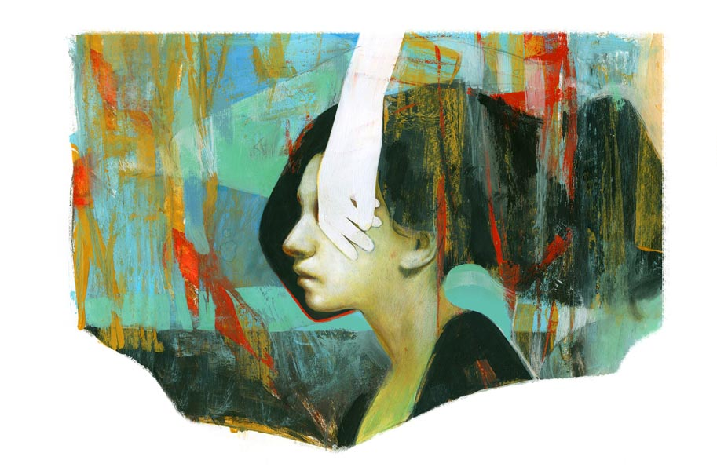

 
 <h1 align=center>এই সেই হাত</h1>
<h2 align=center>সৈকত মুখোপাধ্যায়</h2> বালতির গরমজলে হাত ডুবিয়ে সাবান গুলতে-গুলতে জয়ার আবারও মনে পড়ল, শুভ্র এক বার ওর এই হাতটা ছুঁতে চেয়েছে।

ছ’মাস আগে যখন শুভ্র তাকে বলেছিল, “আমি তোমাকে ভালবাসি,” তখন জয়া ওকে নিবৃত্ত করার যথাসাধ্য চেষ্টা করেছিল। বলেছিল, “কেন শুভ্র? আমাকেই কেন? আমি তো তোমাকে কিছু দিতে পারব না।”

শুভ্র উত্তর দিয়েছিল, “কিছু দিতে হবে না। শুধু তোমাকে ভালবাসতে দিয়ো। আমার বুকে তোমার জন্যে কিছু স্তব জমা হয়, কিছু স্তুতি। তুমি শুধু সেগুলো শুনো। তা হলেই হবে।”

তখনও জয়া ভেবেছিল, ও সব মন-ভোলানো কথা। প্রেমিক ও এ যাবৎ কিছু কম দেখেনি। যদিও ওর বয়স বত্রিশ এবং একটি আট বছরের ছেলেও রয়েছে, তবু ওর শরীরের বাঁধুনি এখনও অটুট। তা ছাড়া একটু টেপা নাকের ডগা, পাতলা ঠোঁট আর খুব কালো চোখের মণির জন্যে ওর মুখটাকে নাকি, শুভ্ররই ভাষায়, কাঠবেড়ালির মতো ফুর্তিবাজ লাগে।

ওই আপাত-উচ্ছল মুখ আর বালিঘড়ি-ফিগারের টানেই পুরুষেরা ওকে প্রেম নিবেদন করতে আসে; আবার উপেক্ষা বুঝতে পেরে চলেও যায়। মধ্যবয়সি শিকারি-পুরুষ তারা, টার্গেট মিস হলে আর সেখানে সময় নষ্ট করে না। কিন্তু শুভ্র তো ওর সমবয়সিই হবে। উপরন্তু অবিবাহিত। বয়েজ় স্কুলের ইংরেজি মাস্টারমশাইয়ের সঙ্গে পাশের গার্লস স্কুলের ভূগোল দিদিমণির দেখাসাক্ষাৎই বা কতটুকু?

শুভ্র চলে যায়নি। উত্ত্যক্তও করেনি। শান্ত ভাবে অপেক্ষা করেছিল। অপেক্ষা বোঝা যেত ওর দূর থেকে তাকানোয়, কদাচিৎ পাশাপাশি হাঁটতে-হাঁটতে একটা-দুটো কুশল জিজ্ঞাসার মধ্যে।

তার পর যা হয়। এক সময় জয়ার প্রতিরোধ দুর্বল হয়ে এল। তা ছাড়া তত দিনে ওর নেশা ধরে গিয়েছিল— শুভ্রর কথা শোনার নেশা।

ভীষণ ভাল কথা বলতে পারে শুভ্র। বৈশাখের খর নির্জন দুপুরে অনেক ক্ষণ ধরে ঘুঘুপাখির ডাক শুনতে-শুনতে যেমন মাথার ভিতর ঝিম ধরে যায়, কিংবা সাঁকোর উপরে দাঁড়িয়ে পায়ের নীচে জলের মধ্যে মাছেদের খেলা দেখতে-দেখতে যেমন মনে হয় চিরকাল এইখানে এই ভাবে মাথা নিচু করে দাঁড়িয়ে থাকি, শুভ্রর নরম গলায় ধীরে ধীরে বলা কথাগুলোর মধ্যে সে রকমই এক সম্মোহন থাকে।

তবে ওইটুকুই। কথা রেখেছিল শুভ্র। এত দিনের মধ্যে কিছু চেয়ে উত্ত্যক্ত করেনি ওকে। শুধু এই কিছু দিন আগে প্রথম বারের জন্য বলল, “আমাকে তোমার হাতটা এক বার ছুঁতে দেবে?”

একটু ভুল বলা হল। এর আগে এক বার বলেছিল, “আমি তোমার সঙ্গে কিছুটা হেঁটে যেতে পারি না?”

জয়া বলেছিল, “উঁহু। যে-রাস্তা ধরে ফিরি, সেটা আমাদের পাড়ার মধ্যে। সবাই দেখবে।”

আবার কিছু দিন পর শুভ্র বলেছিল, “ছুটির পরে বাইরে কোথাও দেখা করতে পারি তো। এখান থেকে দু’জনে আলাদাই বেরোব। তার পর কিছুটা দূরে কোথাও গিয়ে মিট করব, ধরো নন্দন চত্বরে।”

“না, হবে না,” শুকনো গলায় উত্তর দিয়েছিল জয়া।

“বেশি ক্ষণ বসব না। এক ঘণ্টা!” শুভ্রর গলায় কাতর অনুনয় ছিল।

“উঁহু। সম্ভব নয়।”

যদিও ফোনেই কথা হচ্ছিল, তবু মনের চোখে শুভ্রর আশাহত মুখটা পরিষ্কার দেখতে পাচ্ছিল জয়া। ও বুঝতে পারছিল, এ ভাবে ওর সঙ্গে কথা বলা উচিত নয়। যে ভালবাসে, তাকে এ ভাবে ভিখিরি ফেরানোর মতো করে ফেরানো যায় না।

আর তা ছাড়া শুভ্রর জানাও দরকার জয়ার পায়ের শেকলের কথা। তাই ও বলেছিল, “আমার বাড়িতে পাহারাদার আছেন শুভ্র, আমার শাশুড়ি। যখন ফেরার কথা, তার চেয়ে দশ মিনিট দেরি হলেও সেটা দেবাশিসের কাছে রিপোর্ট করবেন।”

এ সব কথা বলতে-বলতে নিজের জীবনের উপরেই ধিক্কার জন্মেছিল জয়ার। হঠাৎ ফুঁসে উঠে বলেছিল, “কেন? এক জন পরস্ত্রীর পেছনেই পড়ে আছ কেন? চতুর্দিকে এত আনম্যারেড মেয়ে, তাদের সঙ্গে প্রেম করতে পারছ না। এ বার অব্যাহতি দাও না আমাকে।”

শুনে শুভ্র শান্ত গলায় বলেছিল, “অব্যাহতি দিলে খুশি হবে?”

চশমার কাচের নীচ দিয়ে তর্জনী ঢুকিয়ে দু’চোখের কোণ মুছে জয়া ধরাগলায় উত্তর দিয়েছিল, “না।”

তার পর দু’জনেই হেসে ফেলেছিল।

ডাস্টার দিয়ে ব্ল্যাকবোর্ডটা মোছার পরে, নখের কোণ থেকে ফুঁ দিয়ে চকের গুঁড়ো ঝেড়ে ফেলতে-ফেলতে জয়ার আবার মনে পড়ল যে, এ বার ও শুভ্রকে আর ফেরায়নি। কথা দিয়েছে, এক দিন এক সঙ্গে একটু হেঁটে আসবে। বেশি দূরে কোথাও নয়। তার মধ্যে ও যদি চায় হাতটাও ধরতে পারবে বইকি।

“কী করবে হাত ছুঁয়ে?” জয়া বেশ অবাক হয়েই প্রশ্ন করেছিল। আসলে এর আগে এ ভাবে তো কেউ চায়নি।

সরাসরি সে-কথার উত্তর না দিয়ে ফোনের মধ্যেই শুভ্র আবৃত্তি করেছিল, “একখানা শাদা হাত, কয়টি আঙুল,

আংটির হীরার ঝলক,/ মণিবদ্ধে সরু এউলি, ম্লান-নীল আলো, চোখের পলক।”

“বাব্বা, একেবারে হিরের আংটি! সে আমি কোথায় পাব?” বেরসিকের মতো হেসে উঠেছিল জয়া।

জয়ার চাপল্য উপেক্ষা করে শুভ্র আবৃত্তি করে চলেছিল, “বিছানায় শুয়ে আছি, ঘুম হারায়েছে,

না জানি কখন কত রাত; কখনো সে হাত যদি ছুঁই, জানিবো না,/ এ-ই সেই হাত।”

এ বার জয়াও চুপ করে গিয়েছিল। শেষের লাইনটা এত সুন্দর! কখনো সে হাত যদি ছুঁই, জানিবো না, এ-ই সেই হাত। সে খুব কোমল স্বরে জিজ্ঞেস করেছিল, “কার লেখা গো?”

শুভ্র একটা দীর্ঘশ্বাস ফেলে বলেছিল, “বুদ্ধদেব বসুর।”

খুব কষ্ট হচ্ছিল জয়ার। কত কী চাওয়ার থাকে এক জন পুরুষের। কত কী দেওয়ার থাকে এক জন নারীর। আর তার এই অভাগা প্রেমিক তার কাছে চাইছে শুধু একটা হাতের অধিকার। ও নিশ্চয়ই বোঝে, জয়া ভিতু। তার চেয়েও বেশি বোঝে জয়ার ভয়ের কারণ। জয়াই ওকে বলেছে, “অশান্তি চাই না। দেখি, যত দিন পারি মুখ বুজে সহ্য করে যাই।”

সে দিনই জয়া ঠিক করে নিয়েছিল, হ্যাঁ, সে এ বার এক দিন শুভ্রর সঙ্গে বেরোবে। কোথায়? হয়তো তাদের স্কুল থেকে সামান্য দূরে সুভাষ সরোবরের পাড় ধরে হাঁটবে, কিংবা ঢুকে পড়বে সিআইটি রোডের কোনও একটা সরু প্রশাখায়। সে রকম কোথাও দাঁড়িয়ে যদি শুভ্র তার হাতটা ধরতে চায়, যদি আদর করে হাত বুলিয়ে দেয় ওর হাতে, সে আপত্তি করবে না। ও শুভ্রকে বলেছিল, “বেশ। তুমি যা চাইছ পাবে। তোমার সঙ্গে বেরোব।”

“কবে?”

“বলব। দু’দিন বাদে বলব,” কথা দিয়েছিল জয়া।

কথা দিয়ে ফেলার পর থেকেই জয়ার সমস্ত স্নায়ু যেন বিদ্যুৎবাহী খোলা তারের মতো যখন-তখন ঝিলিক মারতে শুরু করল। কী হতে চলেছে তা ভাবলেই ওর শ্বাস দ্রুততর হয়, চিবুকে আর ঠোঁটের উপরে বিন্দু-বিন্দু ঘাম জমে।

কিন্তু একই সঙ্গে একটা দুশ্চিন্তার কালো মেঘ জয়ার মনের আকাশে ঘনিয়ে ওঠে। সে ভাবে, শুভ্র যদি তার কোমরে হাত রাখতে চাইত কিংবা পিঠে, যদি কণ্ঠকূপে চুমু খেতে চাইত কিংবা আরও গভীরে কোথাও, তা হলে সমস্যা ছিল না। কিন্তু হাত! তার মতো এক জন খেটে খাওয়া মেয়ের ডান হাতের পাতা! এ কী কাউকে দেখানোর মতো একটা অঙ্গ? কী যে সমস্যায় ফেলল শুভ্র। এতই বিশ্রী দশা হয়ে রয়েছে হাতটার যে, কারুর হাত ধরাও লজ্জা।

অফ-পিরিয়ডে টিচার্স-রুমের জানলার ধারে দাঁড়িয়ে এক ফালি রোদ্দুরের মধ্যে নিজের হাতটাকে ঘুরিয়ে-ফিরিয়ে দেখে জয়া। সংসারের যাবতীয় পীড়নের ছাপ আর কোথাও এতটা পড়েনি যতটা এই হাতের পাতায় আর কব্জিতে, কব্জির কিছুটা উপরেও। কাঠবেড়ালির মতো মুখে নয়, সদ্য মাটি খুঁড়ে তোলা কন্দফলের মতো গ্রীবায় নয়, পোশাকে ঢেকে রাখা অঙ্গগুলোতে তো নয়ই।

শুধু ডান হাতের পাতাটা যেন আগ্নেয়শিলায় গড়া। খসখসে, কঠিন। হাতের উল্টো-পিঠ গ্যাস-বার্নারের তাপে কালচে। বুড়ো আঙুলের পাশে স্টিল-উলের ঝিরিঝিরি ক্ষতচিহ্ন। এমনকি কব্জির উপরে সোনালি মিহি রোমগুলো আগুনের তাপে কুঁকড়ে গেছে। ন

খগুলোর অবস্থা তো আরও শোচনীয়। গরম জল, ডিটারজেন্ট, মোচার কষ, হলুদ, ফিনাইল, টয়লেট-ক্লিনার, চকের গুঁড়ো, ফাঙ্গাস— অণুবীক্ষণ যন্ত্র দিয়ে খুঁটিয়ে দেখলে নিশ্চয়ই এই সব কিছুর অবশেষ খুঁজে পাওয়া যাবে ওর বিবর্ণ নখের পিঠে।

জয়া জানে, শুভ্র যখনই ওর দিকে তাকায়, বড় মনোযোগ দিয়ে তাকায়। এক বার যদি ও নিজের হাতে এই হাত ধরে, তা হলে বাকি শরীরের সঙ্গে এই হাতের তফাতটুকু ওর চোখ এড়াবে না। জয়ার খুব লজ্জা করছিল। সেই জন্যেই সে কয়েকটা দিন সময় চেয়ে নিয়েছিল। ভেবেছিল, তার মধ্যে যদি হাতটাকে একটু ভদ্রস্থ করা যায়।

রবিবার সন্ধের মুখে জয়া ফুলবাগানে একটা বিউটি-পার্লারের দরজা ঠেলে ভিতরে উঁকি মেরে ম্যানিকিয়োরের দর জিজ্ঞেস করল। জয়ার তেলতেলে মুখটার দিকে এক বার অবজ্ঞাভরে তাকিয়ে পার্লারের মালকিন জবাব দিলেন, “ম্যানিকিয়োর পেডিকিয়োর এক সঙ্গে পনেরোশো টাকা, প্রথম বার। পরের বার থেকে একটু কম লাগবে।”

স্যুইংডোরের পাল্লা থেকে হাত সরিয়ে নিয়ে দু’কদম পিছিয়ে এল জয়া।

ওর বর দেবাশিস আগে যে ট্রাভেল-এজেন্সিটায় চাকরি করত, সেটা ভাল ছিল। কিন্তু ঝগড়াঝাঁটি করে সেই চাকরিটা ছেড়েছে বছরখানেক আগে। এখন গিরিশ পার্কের কাছে অনেক ছোট একটা এজেন্সিতে জয়েন করেছে, অনেক কম মাইনেতে। ওরা বেশ গরিব হয়ে গেছে এখন। বিউটি-পার্লারে পনেরোশো টাকা খরচ করার মতো সাধ্য নেই জয়ার।

এমনই সমাপতন, ঠিক তখনই দেবাশিসের ফোন এল। কড়া গলায় সরাসরি কৈফিয়ত চাইল, “মা বলল, বেরিয়েছ। রোববারেও ঘরে মন টেকে না? কোথায় ঘুরছ?”

“বাজারে এসেছিলাম,” উত্তর দিতে গিয়ে জয়ার চোয়ালদুটো শক্ত হয়ে এল। দিন-দিন অসম্ভব সন্দেহপ্রবণ হয়ে উঠছে দেবাশিস, আর সেই সঙ্গেই অসম্ভব নিষ্ঠুর। এই রকম টুরিস্ট-পার্টি নিয়ে যখন বেরোয়— এখনই যেমন গেছে লাটাগুড়ি— বার বার ফোন করে বোঝার চেষ্টা করে জয়া ঠিক কোথায় আছে, কী করছে। সামান্যতম সন্দেহেই বাপ-মা তুলে গালাগাল দেয়। আর এই সবই ঘটে তাপাইয়ের সামনে। দু’কামরার ফ্ল্যাটে কোথায় সরাবে জয়া তার আট বছরের শিশুকে?

“তাড়াতাড়ি বাড়ি ফেরো। আমি ঠিক কুড়ি মিনিট পর আবার কল করছি,” এই বলে দেবাশিস ফোনটা রাখার পর জয়া দাঁতে দাঁত চেপে বলল, “তোমাকে খুব বড় শাস্তি দিতে পারতাম দেবাশিস, কিন্তু দেব না। তাপাইয়ের কথা ভেবেই দেব না। শুভ্রকে শুধু হাতটাই ছুঁতে দেব, আর কিছু নয়।”

তার পর রাসমণি বাজারে ঢুকে একটু মুলতানি মাটি, লেবু, কাঁচা হলুদ অর্থাৎ টিচার্স-রুমে সহকর্মীদের আলাপে ত্বকের যত্ন নেওয়ার যা-যা ঘরোয়া উপকরণের কথা এত দিন অন্যমনস্ক ভাবে শুনেছিল, সেই সবই অল্প অল্প করে কিনে নিয়ে জয়া নিজেদের ফ্ল্যাটে ঢুকে পড়ল।

পরের দু’দিনে সে ওই মুলতানি মাটি, নুনজল, লেবু, খাবার সোডা এমনকি টুথপেস্ট— অনেক কিছু দিয়েই ঘষাঘষি করল হাতের পাতাদুটোকে। বুধবার রাতে কড়াইয়ে মাছ ছাড়ার সময় ওর ডান হাতের কব্জিতে ফুটন্ত তেল ছিটকে লাগল। কয়েকটা ছোট-ছোট ফোস্কা পড়ল।

শুভ্র ইতিমধ্যে বেশ কয়েকবার জানতে চেয়েছে, “কবে, কবে, কবে?”

জয়া কেমন করে জানবে কবে? ফোস্কাগুলো আগে সারুক, তবে তো। তাই বলেছে, “অপেক্ষা করো। এখন একটু অসুবিধে আছে।”

এর পর পরিস্থিতি আরও খারাপ দিকে বাঁক নিল।

দেবাশিস বলে গিয়েছিল শনিবার ফিরবে, কিন্তু বৃহস্পতিবার রাতেই সে ফিরে এল। ও আজকাল মাঝেমধ্যেই এ রকম চমক দেয়। অসময়ে ফিরে এসে দেখে, জয়া আর কারও সঙ্গে লটরপটর করছে কি না। ও যখন বাড়িতে ঢুকেছিল তখন জয়া পাড়ার দর্জির দোকানে গিয়েছিল, কয়েকটা কামিজ অলটার করাতে। ফিরে আসার পরে দেবাশিস ওকে বলল, “ঢলানি মাগি।” বলল, “তোর দু’পয়সার চাকরির মুখে পেচ্ছাপ করি। ছেড়ে দে অমন চাকরি।”

জয়া বলতে গিয়েছিল, ‘আমার এই চাকরিটার জন্যেই এখনও তাপাই ভাল স্কুলে পড়তে পারছে, ফ্ল্যাটের ইএমআই শোধ করতে পারছ।’ দেবাশিস অদ্ভুত একটা মুখভঙ্গি করে ওর ডান হাতটা ধরে গায়ের জোরে মুচড়ে দিল।

সারা রাত হাতের যন্ত্রণায় ঘুমোতে পারল না জয়া। তাপাই মায়ের পাশে বসে কী যেন একটা অয়েন্টমেন্ট মায়ের হাতে মালিশ করে দিয়েছিল। তবু সকালে উঠে ও দেখল, ডান হাতের বুড়ো আঙুলের গোড়া থেকে শুরু করে হাতের পাতার পিছন দিকটা অবধি ফুলে ঢোল হয়ে আছে। এমনকি ওর শাশুড়িও হাতের অবস্থা দেখে সে দিন বলেছিলেন, “আজ আর স্কুলে যেয়ো না বৌমা।”

তবু স্কুলে গেল জয়া। শুভ্রকে ফোন করে বলল, “ছুটির পর এস। আজই আমরা দু’জনে এক সঙ্গে হাঁটতে যাব।”

স্কুল ছুটির পরে ওরা দু’জন লেকের পাড় ধরে প্রাচীন গাছেদের ছায়ায় ছায়ায় হেঁটে চলল। হেঁটে চলল, যত ক্ষণ না নির্জন হয়ে আসে লেকের চার পাশ। তার পর জয়া শুভ্রর কাঁধে আলতো টান দিয়ে বলল, “চলো ওই বেদিটায় গিয়ে বসি।”

বকুলগাছের নীচে লাল সিমেন্টের বেদি। চড়াই নাকি গাঙশালিকের ঝাঁক এত ক্ষণ বকুলপাতার আড়ালে ঝুমঝুমি বাজাচ্ছিল। আলো কমে আসতেই ওরা হঠাৎ চুপ করে গেল। লেকের অন্য প্রান্ত দিয়ে বাতাস চিরে সাদা ইউনিকর্নের মতো সুন্দর মেট্রোরেল দৌড়ে চলে গেল কোনও রূপকথার দেশে। জয়া এক বার মাত্র তার গালটা শুভ্রর কাঁধে ঠেকিয়ে, পরক্ষণেই সোজা হয়ে বসল। তার পর আমুদে কাঠবেড়ালির মতো মুখখানা ওর মুখের দিকে তুলে ধরে বলল, “আমার হাত ধরবে বলেছিলে যে!”

তাই শুনে বালক যে ভাবে বৃষ্টির ফোঁটার নীচে আঁজলা পাতে, অবিকল সেই ভঙ্গিতে শুভ্র তার ডান হাতের পাতাটা জয়ার দিকে বাড়িয়ে দিল।

জয়া এত ক্ষণ আঁচলের প্রান্তটা আলতো করে নিজের ডান হাতের পাতার উপরে ফেলে রেখেছিল। এ বার তার নীচ থেকে হাতটা বার করে শুভ্রর হাতের উপরে রাখল। ফোস্কায় ভরা আগ্নেয়শিলার টুকরোর মতো একটা হাত। ডিটারজেন্টের ক্ষারে ক্ষয়ে যাওয়া, গুঁড়ো-মশলার রঙে হলুদ, চকের গুঁড়োয় বিবর্ণ চামড়া আর নখ। এই সব মিলিয়ে একটা মেয়ের হাত। ইতিমধ্যে ব্যথার লসিকা জমে-জমে বুড়ো আঙুলের গোড়াটা আরও ফুলে উঠেছিল।

শুভ্র সবে মন্ত্রোচ্চারণের মতো ধীর স্বরক্ষেপে বলতে শুরু করেছিল, “কখনো সে হাত যদি ছুঁই, জানিবো না…” কিন্তু জয়ার হাতের পাতাটার দিকে তাকিয়ে ওর কথা আটকে গেল। ওর আতঙ্কিত মুখের দিকে তাকিয়ে জয়াই বাকিটা শেষ করল। হাসতে-হাসতে বলল, “এই সেই হাত।”