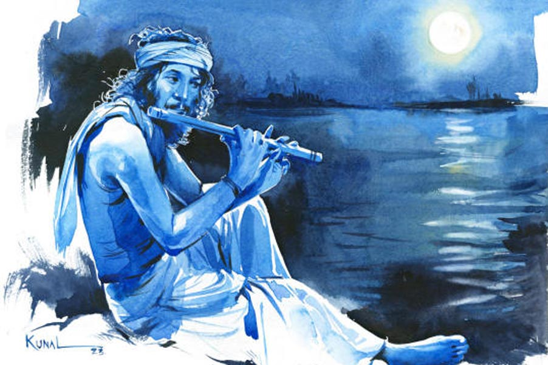

 
 <h1 align=center>এক জ্যোৎস্নায়</h1>
<h2 align=center>বাপ্পাদিত্য চট্টোপাধ্যায়</h2> কখন এলে?”

“অনেক ক্ষণ...”

“ডাকোনি যে?”

“দেখছিলাম তোমাকে...”

“আমার দেখা যে কমে গেল...”

“অত হিসেব করলে চলে? বেশি কম মেনে নিতে হয়...”

কথা হয় না শেষ, ভোর হয়ে যায়। আলো ফুটতে না ফুটতেই চলে যায় সে। চলে যায় না মিলিয়ে যায়, বোঝা দায়। যত ক্ষণ থাকে, তত ক্ষণই পৃথিবী মধুময়। তারাভরা জ্যোৎস্না আকাশ, সুগন্ধি বাতাস, সঙ্গে নদীর কলকল কথা। রাত যেন মায়াহীন মুহূর্ত। আচমকাই রুক্ষ বাস্তবে আছড়ে ফেলতে দ্বিধা করে না। তখনই তাকে চলে যেতে হয়। আসতেও পারে মাসে মাত্র এক কি দু’বার। আসা-যাওয়া হতে চলল এক যুগ প্রায়।

প্রায় এক যুগ প্রতি পূর্ণিমায় অজয় নদের চরে আসছে কানাই। আসছে এক অলীক মায়ায়। প্রতি পূর্ণিমায় বাঁশি বাজায় অজয়ের চরে। কখনও বসে, কখনও হাঁটতে-হাঁটতে অজয়ের হাঁটুজল পেরিয়ে ও পারে। কখনও বাজাতে-বাজাতে ঘুমিয়েও পড়ে। কিন্তু সে আসবেই। চাঁদের আড়াল থেকে নেমে আসবে এক অপরূপা পরি। কখনও চুপ করে বাঁশি শোনে, কখনও ঘুমন্ত কানাইয়ের দিকে তাকিয়ে থাকে। কখনও আবার ঝরনা ঝরায় কথার, কিছুই প্রায় বলতে পারে না কানাই। কী বলবে? পরি যে বলে অজানা কথা। তাই মন দিয়ে শোনে। দেখে পরির সৌন্দর্য। দেখতে শুনতে নেশা লেগে যায়। নেশার মাঝেই যাওয়ার সময় হয়ে যায় পরির। ঘোরের মধ্যে বসেই থাকে কানাই। এক সময় সূর্যতাপ যেন শুষে নেয় পরি-কথা। মনে থাকে শুধু আসা-যাওয়া।

জয়দেব। কেন্দুলি ভুলে ‘গীতগোবিন্দম্‌’ রচয়িতার নামেই এখন গ্রামের নাম। গ্রামেই রাধাবিনোদ মন্দির। নির্মাণ করেছিলেন বর্ধমানের রাণী নৈরানী দেবী। সেই মন্দিরে শ্রীকৃষ্ণের হাতের বাঁশিতে আকৃষ্ট হয়েছিল বালক কানাই। জয়দেব মেলায় বাঁশিতে দিয়েছিল দু’-চার ফুঁ। ওইটুকুতেই দোকানি টের পেয়েছিল ছেলেটির সহজাত গুণ। বলেছিল, কিনে নিয়ে শিখতে। কিনবে যে, পয়সা কোথায়? বাবা জনমজুর, পাঁচ পেটের ভাত জোগাতেই হিমসিম। মেলা শেষে দোকান ওঠানোর আগে বিনা পয়সায় একটা বাঁশি দিয়েছিল দোকানি। শর্ত একটাই। পরের বছর বাঁশিতে একটা গান শোনাতে হবে।

পড়ালেখার পাট নেই, সারা দিন মনের আনন্দে বাঁশি বাজায় কানাই। কখনও রাধাবিনোদের সামনে, কখনও কুশেশ্বর মন্দিরে, কখনও অক্ষয় বটতলায়। এক সময় নজরে পড়ল জয়দেবের বিখ্যাত বাউল তারক খেপার। কানাইকে সঁপে দিল দলের বংশীবাদক সুবলের হাতে। শিল্পীই সহজে চেনে শিল্পীর জাত।

“তুই কাল থিকে মুর সাথে মাঠে যাবি।”

“কাল সকালে যে সুবল কাকার সাথে যেতে হবে। সাঁঝে বাঁকুড়ায় তারক কাকার আসর।”

“বাঁশি বাজিয়ে পেট চলবে? বাড়ির মানুষগুলার লেগে তুর কুনও দায় নাই?” ঝাঁঝিয়ে উঠল কানাইয়ের বাপ রাঘব দাস। তারককে বার বার বলেও কোনও কাজ হয়নি। মিলেছে শুধুই সান্ত্বনা। ছেলে এক দিন বড় শিল্পী হবে, প্রচুর রোজগার করবে। সায় দেয়নি রাঘব। পরের কথা পরে, এখন তো পেটগুলো চালাতে হবে।

“কালকের দিনটো বাদ দাও গো বাবা। পরশু ঠিক যাব,” কাতর মিনতি কানাইয়ের। অভাবের সংসারে বছর বারোতেই সাবালক হতে হয়।

“কাল থিকেই যাবি, নইলে ঘর থিকে বেরিন্ যা...”

বাঁশির টানে তুচ্ছ হয়ে গেল মায়ের কান্না। বেরিয়েই এল কানাই। তারক খেপার অনুরোধে প্রথমে এগিয়ে এল ইস্কুল মাস্টার শান্তি রজক। শান্তিবাবুকে দেখে এগিয়ে এল আনারুল হক, সুভাষ কবিরাজের মতো মানুষজন। তারকের মতো বিখ্যাত শিল্পী যখন ভরসা করেছে, তখন ছেলেটি নিশ্চয়ই গুণী। সবার বাড়িতে পালা করে থাকতে লাগল কানাই। সঙ্গে চলল তালিম আর আসরে হাজিরা দেওয়া।

বছর কুড়িতেই কানাই নামী বাঁশিবাদক। বাবা পক্ষাঘাতে পঙ্গু হওয়ায় বাড়িতেও ফিরতে হয়েছে। টাকার প্রয়োজনে ছাড়তে হয়েছে তারক খেপার দলও। আপত্তি করেছিল তারক। সুবলের পরে সেই হবে দলের প্রধান বাঁশি-বাজিয়ে। সংসারের চাপে অপেক্ষার সময় ছিল না কানাইয়ের। যোগ দিয়েছিল তুলসীদাসীর কীর্তনের দলে।

এক বার আসরে চোখের জলে ভাসতে-ভাসতে তুলসীদাসী গাইছে শ্রীরাধার বিরহগীত। বাঁশির সুরে কানাইয়ের চোখেও জল। তখনই ঝাপসা চোখে মঞ্চের উপর চোখে পড়ল পরিকে। বোধহীন হয়ে গেল যেন কানাই। গান থেমে গেলেও থামল না কানাইয়ের বাঁশি। থামাতে হল জোর করে। সেই থেকে শুরু হল পরি-খোঁজ।

“আজ আনমনা যে?”

“ভাবছি...”

“কী?”

“কবে যেন দেখা হয়েছিল আমাদের?”

“মনে করো।”

“মনে পড়ে না যে।”

“কেন এসেছিলাম মনে আছে?”

“না।”

“তোমার বাঁশির টানে।”

“ভাল লাগে?”

“লাগে বলেই তো আসি। আচ্ছা... এত যে তাকিয়ে থাকো আমার দিকে, ছুঁতে ইচ্ছে করে না?”

“না।”

“কেন?”

“সুন্দরকে দেখতে হয়, উপলব্ধি করতে হয়, তার পর তো ছোঁয়া।”

“কোনও দিন ছোঁবে না আমাকে?”

“জানি না। শুধু জানি, আগুনের তাপ নিতে হয়, ছুঁতে নেই।”

প্রথম দেখা অজয় চরে। কানাইয়ের তখন পাগল দশা। ‘কোথায় পাব তারে’র আকুতি নিয়ে ঘুরে বেড়ায় জয়দেবের আনাচ-কানাচে। কখনও চলে যায় ও পারে গড়জঙ্গলের শ্যামারূপা মন্দির বা ইছাই ঘোষের দেউলে, কখনও যেখানে আসর করতে যায়, এলোমেলো ঘুরে বেড়ায় সেখানে। দল ফিরলেও কানাই ফেরে না। ফেরে বিধ্বস্ত অবস্থায়। বাড়ির লোক, গ্রামের মানুষ চিন্তিত— মাথা খারাপ হয়ে গেল না কি ছেলেটার?

শুরু হল বিয়ের চেষ্টা। বাদ সাধল কানাই। শুনল না কারও কথাই। তত দিনে অজয় চরে আনমনে বাঁশি বাজাতে-বাজাতে হঠাৎই পেয়েছে পরির দেখা। মন মজেছে পরিতে। এমন অদ্ভুত, নির্মল, অপার্থিব আনন্দের কথা কি সাধারণ মানুষ বুঝবে? এক সময় হাল ছাড়ল সকলে। কানাইয়ের যা খ্যাতি, সংসারটা তো বাঁচবে। সংসার ছাড়া আর কী-ই বা আছে সাধারণের জীবনে?

“শুন কানাই, ইবার জয়দেব মেলায় একটা ভাল সুযোগ আছে।”

“কী সুযোগ?”

“তুলসীর সাথে আমি কথা বুলেছি। গানের মাঝে ও তুকে তোর এলেম দিখানোর সুযোগ দিবে। কয়েক জন বিদেশি আসবে ইবারের মেলায়। উদের চোখে যদি পড়ে যাস, তা হলে তুর বিদেশ যাওয়া আটকায় কে? তা ছাড়া সুভাষও ইবারে উর পত্রিকায় লিখবে তুর কথা। ইংরেজি অনুবাদ দেওয়া হবে সাহেবদের!” শান্তি রজকের মুখে গর্বের হাসি। রিটায়ার করেছেন অনেক দিন। এখনও কর্মক্ষম থাকায় মেলার অস্থায়ী আশ্রমের সেক্রেটারি। তারক অনেক বার বললেও কানাই বিদেশ যেতে রাজি হয়নি। বছর কয়েক আগে তারক নিজেই চলে গিয়েছে না-ফেরার দেশে।

“তুমি তো জানো কাকা, আমি যাব নাই...” পূর্ণিমায় যে আসরে যায় না, সে যাবে বিদেশ?

“ছোট বুনটার বিয়ে দিতে টাকা তো চাই। ইবারটো নয় যা ক্যানে!” শান্তিবাবুর বাস্তব।

“না গো কাকা, সে হয় না। বুনের বিয়ে আমি দেনা করে হলেও দিব।”

অবাক হলেন না শান্তি রজক। অনেকের মতো তিনিও লক্ষ করেছেন, পূর্ণিমা রাতে অজয় চরে কানাইয়ের বাঁশি বাজানো আর প্রকৃতির সঙ্গে কথোপকথন। মনোরোগ বিশেষজ্ঞ বন্ধু রণজিৎ মুখোপাধ্যায়ের কাছে জেনেছেন, এই রকম মানসিক বিকার কারও কারও হয় এবং পূর্ণিমা রাতে প্রকোপ বাড়ে। ডাক্তারের কাছে কানাই কিছুতেই যাবে না, তাই মরিয়া প্রশ্ন ছুড়লেন, “নিজের বিয়ের কথা কুছু ভেবেছিস?”

উত্তর দিতে পারল না কানাই। জানাও নেই উত্তর। আছে শুধু এক সুপ্ত বাসনা। সন্তান বাসনা। সন্তানের মাধ্যমে প্রত্যক্ষ করতে চায় শ্রীকৃষ্ণের বাল্যলীলা। সে বোধহয় আর সম্ভব নয় এই জীবনে।

বয়স যে বছর পঁয়ত্রিশ পেরিয়েছে সে খেয়াল নেই কানাইয়ের। খেয়াল শুধু বাঁশি আর পরিতে। একটা কথা বেশ বুঝতে পারে, বাঁশির সুর আগের চেয়ে অনেক খোলতাই হয়েছে পরি-সঙ্গে। আসরে যখন বাজায় তখন শ্রোতারা মন্ত্রমুগ্ধ হয়ে শোনে। এমন কি মাঝেমাঝে তুলসীদাসীও গান ধরতে ভুলে যায়। বাঁশির সুরে মাতোয়ারা আসর তখন শুধু আর আসর থাকে না। হয়ে ওঠে আবেগ, সঙ্গীতের মেলবন্ধন। সেই বন্ধনে স্বেচ্ছায় ধরা দেয় মানুষ।

“আমার কাছে এসে কী পাও তুমি?”

“তোমার বাঁশি শুনতে পাই, আর আমি এলে দূর হয় তোমার বিরহ।”

“বিরহেও যে আনন্দ আছে, জানো সে কথা?”

“জানি... বিরহ থেকেই তো সঙ্গীতের সৃষ্টি।”

“তা হলে বিরহেই ডুবে থাকতে দাও আমাকে।”

“অতি বিরহ যে ভাল নয়। তা ছাড়া বিরহী জীবন তোমার জন্য নয়।”

“আমার জীবন তা হলে কিসের জন্য?”

আজ পূর্ণিমা। বাঁশিতে সুর তুলে অজয় চরে হেঁটে বেড়াচ্ছে কানাই। হাঁটতে-হাঁটতে প্রায় ও পারে। জয়দেব বীরভূমে হলেও ও পারটা বর্ধমান। হঠাৎ ভরা জ্যোৎস্নায় নজর গেল বাঁধের উপরে একটা গাছের দিকে।

মানুষ না? হ্যাঁ মানুষই তো! একটা মেয়ে, গাছের ডালে উঠে গলায় ফাঁস লাগাচ্ছে। দৌড় লাগাল কানাই। পৌঁছেই ধরে ফেলল নীচের ডালে ভর দেওয়া পা দুটো। ঝটকায় সরিয়ে দিতে চাইল মেয়েটা। কানাইয়ের অনুরোধ যেন কানেই যাচ্ছে না। তত ক্ষণে গলায় ফাঁস জড়িয়ে ফেলেছে। শুধু পা দুটো ছাড়াতে পারলেই হয়। উপায় না দেখে মেয়েটার পা দুটো শক্ত করে ধরে গাছে উঠল কানাই। মেয়েটার প্রবল বাধা উপেক্ষা করে খুলে ফেলল ফাঁস। তার পর মেয়েটাকে জড়িয়ে ধরে লাফ দিল মাটিতে।

“ক্যানে বাঁচালে আমায়? ক্যানে?”

“অধিকার তুমার জন্মেও নাই মরণেও নাই।”

“কিন্তু... কিন্তু মরা ছাড়া আমার যে আর কুনো উপায় নাই...” ফুঁপিয়ে উঠল মেয়েটি।

“ক্যানে? তুমার ঘরে কেউ নাই? ঘর কুথায়?” কানাইয়ের প্রশ্ন। মেয়েটি যে জয়দেবের নয়, দেখেই বুঝেছে।

“শিবপুর,” মুখ নামিয়ে নিচু স্বরে উত্তর দিল মেয়েটি। কানাই বুঝল, শিবপুর গ্রাম জয়দেবের উল্টো পারে।

“বরের সাথে ঝগড়া করে মরতে এয়েছ বুঝি?”

“বর... সে আর আসবেক নাই,” মুখ নামিয়েই বলল মেয়েটি।

“ছেড়ে গেইছে?”

“বিয়েই হল না তো...” চিলতে বেদনার হাসি যেন মেয়েটির মুখে।

আর কী জিজ্ঞাসা করা যেতে পারে মাথায় এল না কানাইয়ের। বরং মেয়েটিকে বাড়ি পৌঁছে দেওয়াই উচিত। তবুও চুপ করে রইল কানাই। ভাল করে দেখল মেয়েটিকে। দেখতে মন্দ নয়, প্রথমটায় ঝাঁঝ থাকলেও এখন কথা বলছে নম্রতায়।

“আমার নাম কানাই, কীর্তনের দলে বাঁশি বাজাই। ঘরে বাবা, মা আর এক বিয়ের যুগ্যি বুন আছে। রোজগার মন্দ করি না। আমাকে বিয়ে করবে?” আচমকাই বলে ফেলল কানাই। যেন কেউ বলিয়ে নিল।

বেশ খানিক ক্ষণ চুপ করে রইল মেয়েটি। তার পর গলা খাদে নামিয়ে বলল, “আমার প্যাটে বাচ্চা আছে।”

“এ যে পূর্ণ কুম্ভ!” হতাশ হওয়ার বদলে উৎফুল্ল হল কানাই। বিয়ে করলে বউ বাঁজা হতেই পারত, অথবা নিজেই সক্ষম কিনা কে জানে। কিন্তু এই বিয়েটা হলে যে প্রভুর বাল্যলীলা দেখা যাবেই, সেটা নিশ্চিত। জোড় হাত কপালে ঠেকাল কানাই। সত্যিই প্রভু দয়াময়।

“বিয়ে করবে আমাকে?”

নীরবে মাথা আরও নিচু করল মেয়েটি। সম্মতির লক্ষণ ধরে কানাই দাঁড়িয়ে বলল, “চলো... ঘর যাই।”

“ঘরে কী বলবে?”

“বলব... বলব আমার বাচ্চা।”

এই বার মুখ তুলল মেয়েটি। দৃষ্টি বিনিময় হল দু’জনার। খানিক বাদে উঠে দাঁড়াল।

“তুমার নাম কী?”

“পরি।”

এ কি স্বপ্ন! না সত্যি! পরখ করতে পরির হাতে হাত রাখল কানাই। শরীর যেন তড়িদাহত হল। হৃদয়ের গভীর থেকে উঠে এল অচেনা বাঁশির সুর, মস্তিকে অজানা উপলব্ধি। বাঁশির টানে যদি আকাশ থেকে পরি নেমে আসতে পারে তা হলে ঈশ্বরের আসা কি অসম্ভব? সঙ্গীত তো প্রকৃতিরই অঙ্গ। এত দিন শুধু পরের জন্য বাজিয়েছে, এ বার নিজের জন্যও বাজাবে। শ্রম, মনঃসংযোগ আর সাধনায় কি সাড়া দেবেন না প্রভু? মনে পড়ল— ‘লোকে বলে কৃষ্ণ পাষাণ, সাড়া দিতে জানে না/ মন বলে আকুল হয়ে কেউ তো তারে ডাকে না, তাই সাড়া দিতে জানে না।’

পরির হাত ধরে গ্রামের দিকে এগোতে লাগল কানাই। সাক্ষী তারাভরা আকাশ, পূর্ণিমা চাঁদ, অজয় জল। জয়দেবে পৌঁছে বাড়ির পথে গেল না কানাই। গেল রাধাবিনোদ মন্দিরের দিকে। সৃষ্টির স্রষ্টাকে করবে সাধনার প্রথম নিবেদন।