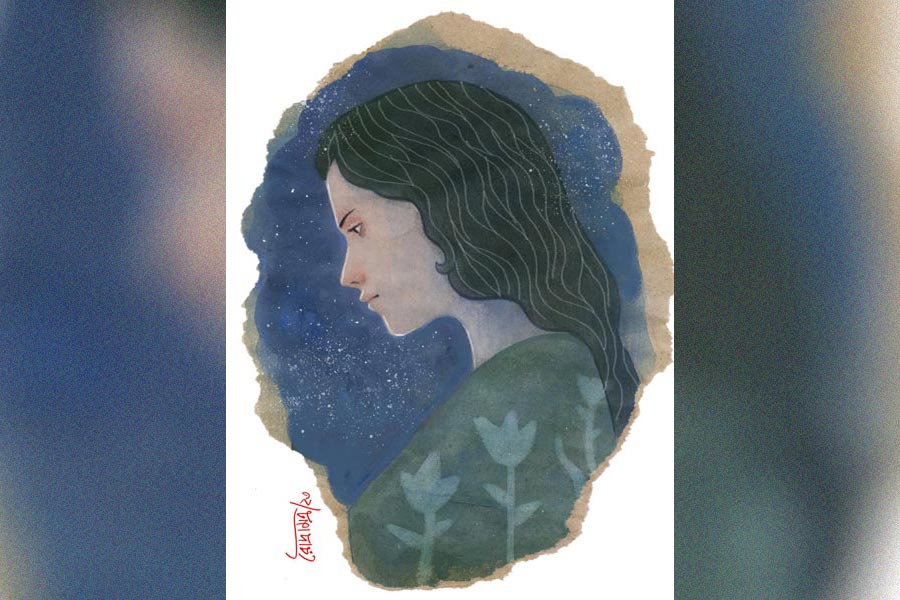

 
 <h1 align=center>এক টুকরো তারা</h1>
<h2 align=center>অর্চনা গুপ্ত</h2> কাজ থেকে বাড়িতে ফিরে কমলিকা দেখে পাপিয়া বসে আছে। অবাক হয়ে বলে, “তুই? কী ব্যাপার?”

পাপিয়া বলে, “তোমার সঙ্গে খুব দরকারি কথা আছে, বৌদি।”

পাপিয়ার পাশে কমলিকা বসে বলে, “বল, কী দরকার?”

“আমাকে একটা রাতদিনের কাজের ব্যবস্থা করে দাও না।”

“কেন? তোর দোকানের কাজটা কী হল?”

“কোথাও থাকার ব্যবস্থা হলে ও কাজটা আমি ছেড়ে দেব।”

“কেন, কী হয়েছে?”

“জানো, রাত্তিরে আমি ভাল করে ঘুমোতে পারি না। কতগুলো বদমাশ, ওই শিবু, গোপাল, রতন ওদের চেনো তো? সারা ক্ষণ আমার দিকে নজর ওদের।”

“হ্যাঁ রে, আমিও প্রায়ই ওই বদমাশগুলোকে দেখি তোর পাড়ার এলাকায় ঘোরাঘুরি করছে। বিশেষত সন্ধের পরে।”

“মা মারা যাওয়ার পর থেকেই এই ব্যাপারটা শুরু হয়েছে। ওই তো পলকা দরজা ঘরের, কখন যে শয়তানগুলো ভেঙে ফেলবে জানি না।”

“সত্যি, তোর মা এমন অসময়ে চলে গেলেন! কতই বা বয়স হয়েছিল, খুব খারাপ লাগে।”

“কী আর বলব বলো, আমার কপাল। হায়ার সেকেন্ডারি পাশ করে কলেজে ভর্তির ফর্ম নিয়ে এলাম, হঠাৎ মা চলে গেল। আমার পড়াশোনাও শেষ হয়ে গেল।”

“সত্যি, খুব খারাপ লাগে।”

বিষণ্ণমুখে দু’জনেই কিছু ক্ষণ বসে থাকে। তার পর কমলিকা বলে, “ঠিক আছে, তুই এখন যা, আমি দেখছি।”

দিনদুয়েক বাদে সকালের কাজ থেকে বাড়ি ফিরে পাপিয়া দেখে কমলিকা বসে আছে। বলে, “কী গো বৌদি, তুমি?”

“বোস, তোর সঙ্গে কথা আছে।”

“হ্যাঁ, বলো।”

“তোর কাজ আর থাকার ব্যবস্থা আমি করেছি।”

“কোথায় গো?” ব্যস্ত ভাবে বলে ওঠে পাপিয়া।

“আমি যে বাড়িতে রান্না করি সেখানে। ও বাড়িতে ঠাকুমা যিনি আছেন, তাঁর বয়স হয়েছে, তাঁর দেখাশোনা করতে হবে।”

“আমি পারব তো কাজটা করতে?” ভয়ে ভয়ে বলে পাপিয়া।

“পারবি না কেন? ওরা সবাই খুব ভাল। ঠাকুমাকে যে মেয়েটা দেখাশোনা করে, তার বিয়ে ঠিক হয়ে গেছে, সে চলে যাবে।”

“কী করতে হবে আমাকে?”

“ঠাকুমাকে ধরে ধরে বাথরুমে নিয়ে যেতে হবে, খাইয়ে দিতে হবে... এই সব। ঠাকুমা খুব ভাল মানুষ।”

“ঠিক আছে।”

“কবে যাবি?”

“পরশু দিন যাব।”

পাপিয়ার কাজটা হয়ে যায়।

কমলিকা যে ঠিক কথাই বলেছে, কিছু দিনের মধ্যেই বুঝতে পারে সে। ঠাকুমা তো অল্প ক’দিনের মধ্যেই ওকে খুব ভালবেসে ফেলেছেন, বুঝতে পারে। বাড়িতে চার জন লোক, ঠাকুমা, কর্তা-গিন্নি আর তাঁদের এক ছেলে। সবাই খুব ভাল ব্যবহার করেন তার সঙ্গে। এমনকি দুই দিদি যখন শ্বশুরবাড়ি থেকে আসেন, তাঁরাও খুব সুন্দর করে কথা বলেন। এমন একটা ভাল জায়গায় যে সে থাকতে পারবে, কখনও ভাবতেও পারেনি। বহু দিন বাদে রাতে শান্তির ঘুম হয় তার।

ক্রমে সেও নিজের কাজের বাইরে বাড়ির অন্যান্য কাজে সাহায্য করতে থাকে। এক দিন কানে আসে, বাড়ির কর্ত্রী দেবারতি কমলিকাকে বলছেন, “খুব ভাল একটা মেয়ে এনে দিয়েছ।”

কথাটা শুনে পাপিয়ার মনে গভীর আনন্দ হয়। সে কাজে যোগ দেওয়ার কিছু দিন বাদে বড় মেয়ে সুমিতার ননদের বিয়ের দিন চলে আসে। বিয়ের দিন সকালে সবাই চলে যায়।

সে দিন রাতে ঠাকুমাকে খাইয়ে, শুইয়ে, নিজের খাবার নিচ্ছে সে, এই সময়ে সবাই ফিরে আসে। ভিতরে ঢুকতে ঢুকতেই দেবারতি জিজ্ঞেস করেন, “তোর খাওয়া হয়ে গেছে?”

“না মা, খাবারটা নিচ্ছিলাম।”

“ওই খাবারটা রেখে দে। দিদি খাবার পাঠিয়ে দিয়েছে, এটা খা।”

“দিদি আমার জন্যে খাবার পাঠিয়ে দিয়েছে?” অবাক হয়ে বলে পাপিয়া।

“বাঃ, আমরা সবাই বিয়েবাড়ির ভাল খাবার খেলাম, আর তুই বাড়ির খাবার খাবি? খেয়ে নিস। রান্না খুব ভাল হয়েছে...” খাবারটা টেবিলে রেখে উপরে চলে যান দেবারতি।

খেতে বসে চোখে জল এসে যায়। তার জন্য দিদি খাবার পাঠিয়ে দিয়েছে, এ কথা ভেবে। ক’দিন বাদেই সুমিতা এসে তাকে একটা সুন্দর সালোয়ার কামিজ দেয়।

“আমার জন্যে আবার সালোয়ার কামিজ কেন দিদি?” অবাক হয় সে।

“বাঃ, বিয়েতে আমরা সবাই নতুন কাপড়জামা পেয়েছি আর তোকে দেব না? তুই তো বাড়িরই এক জন। তোর পছন্দ হয়েছে তো?”

“খুব সুন্দর হয়েছে!” হাসিমুখে বলে সে।

এ ভাবেই কেটে যায় চারটে বছর। নিজের পুরনো পাড়ার সঙ্গে যোগাযোগ রেখে চলে পাপিয়া। প্রায়ই যায়, পাড়ার দিদি, বৌদিদের সঙ্গে গল্প করে আসে। কিছু বন্ধুবান্ধব আছে, তাদের সঙ্গেও কিছুটা সময় কাটায়। নিজের ঘরটাও দেখে আসে। পাড়ার মেয়ে-বৌরা সকলেই বলে, “তোকে কিন্তু দেখতে খুব সুন্দর হয়ে গেছে। তুই যে কোনও দিন এখানে থাকতিস তোকে দেখে বোঝা যায় না।”

“ও সব বোলো না তো। আমি তোমাদের মতোই, নেহাত কমলিকা বৌদি ভাল একটা বাড়িতে কাজ খুঁজে দিয়েছে তাই কোনও রকমে একটু খেয়ে-পরে থাকতে পারছি।”

মহিলারা তাকে উপদেশ দেয়, “তুই এ বার একটা বিয়ে করে ফেল!”

“না বাবা, বিয়ে করে আমার কাজ নেই। তখন আবার কোথায় গিয়ে পড়ব কে জানে! এই দিব্যি আছি।”

মানুষ ভাবে এক আর হয় আর এক। প্রতিটি মানুষ বোধহয় জীবনের নানা সন্ধিক্ষণে এই সত্যিটা উপলব্ধি করে। পাপিয়াও বুঝতে পারেনি, সে এখন জীবনের এক অজানা অচেনা বাঁকের সামনে এসে দাঁড়িয়েছে।

সে দিন বিকেলে ছাদে গিয়েছে জামাকাপড় আনতে। হঠাৎ দেখে, রণজয় উঠে এসেছে। অবাক হয়ে বলে, “দাদা, আপনি?”

“তোমার সঙ্গে আমার একটা দরকার আছে।”

“আমার সঙ্গে?” অবাক হয়ে যায় পাপিয়া, “কী দরকার?”

“তোমাকে একটা কথা কিছু দিন ধরেই বলব ভাবছি, কিন্তু সুযোগ পাচ্ছি না।”

হতভম্ব পাপিয়া তাকিয়ে থাকে তার দিকে।

রণজয় বলে, “আমি সোজাসুজি কথা বলতে ভালবাসি। তাই বলছি, আমি তোমাকে ভালবাসি।”

“মানে, কী বলছেন? বুঝতে পারছি না।”

“তোমার মতো বয়সের একটা মেয়েকে আমার মতো বয়সের একটা ছেলে ভালবাসে বলতে যা বোঝায়, তা-ই বলতে চাইছি।”

শোনামাত্র কেঁপে ওঠে পাপিয়া। তার পরই বলে, “না দাদা, এ অসম্ভব।”

“কেন, অসম্ভব কিসের?”

“না, না দাদা, এ কিছুতেই হতে পারে না...” বলে প্রায় ছুটতে ছুটতে সে নেমে যায় সিঁড়ি দিয়ে। নীচে এসে জামাকাপড় কোনও ক্রমে রেখে বাথরুমে ঢুকে পড়ে, চোখেমুখে জল দেয়। হাত-পা কাঁপছে তখনও। বাথরুমে বেশ কিছু ক্ষণ দাঁড়িয়ে থেকে নিজেকে শান্ত করার চেষ্টা করে, যাতে কেউ কিছু বুঝতে না পারে।

রাতে শুয়ে মনের মধ্যে অদ্ভুত অস্থিরতা অনুভব করে। নিজেকে খুঁজতে গিয়ে দেখে, যে ডাক তার কাছে এসেছে, তাতে সাড়া দেওয়ার জন্যে মনপ্রাণ আকুল হয়ে উঠেছে। কী যে করবে ভেবে পায় না, নিজের সঙ্গে নিজের দ্বন্দ্বে ক্ষতবিক্ষত হয়ে যায়। বিনিদ্র রাত কাটায়। এক সময়ে জানালার ফাঁক দিয়ে ভোরের আলো ঢোকে। সে-ও মনস্থির করে ফেলে।

স্বাভাবিক ভাবে সব কাজকর্ম করে। দিন দুয়েক বাদে রণজয়ের দুই দিদি আসে। শুনতে পায় মেয়েরা মাকে বলছে, “মা, রণোর তো এ বার বিয়ের ব্যবস্থা করতে হবে। দেখতে দেখতে বত্রিশ বছর বয়স হয়ে গেল।”

“হ্যাঁ, আমিও এ ব্যাপারে তোদের সঙ্গে কথা বলব ভাবছিলাম। তবে খোঁজখবর করার আগে ও নিজে কোথাও কিছু ঠিক করে ফেলেছে কি না জানতে হবে তো!” বলেন মা।

“সে তো নিশ্চয়ই। আজ তো রণো বাড়ি নেই। তুমি আগেভাগে এ ব্যাপারে ওকে কিছু জিজ্ঞেস কোরো না। আমরা কথা বলব।”

সে দিন রাতে কাজকর্ম সেরে শুতে যাবে পাপিয়া। এমন সময় বুঝতে পারে, কেউ দরজায় এসে দাঁড়িয়েছে। ঘুরে দাঁড়াতেই দেখে, রণজয়। থতমত খেয়ে সে উঠে দাঁড়ায়।

রণজয় বলে, “তোমাকে যে কথা বললাম, সে নিয়ে কী ভাবলে বলো।”

পাপিয়া বলে, “নতুন কথা আমার তো কিছু বলার নেই। এই ধরনের অদ্ভুত কথা আপনি ভাবছেন কেন?”

“তোমাকে আমার ভাল লাগে তাই বলেছি। আর অদ্ভুত কথা বলছ কেন? এ রকম কি হতে পারে না? এটা তো খুব স্বাভাবিক!” বলে রণজয়।

“এ রকম হয় না দাদা। আপনি এত বড় বাড়ির ছেলে। কত লেখাপড়া শিখেছেন। ভাল চাকরি করেন। আমার কী আছে বলুন! পড়াশোনা মাত্র হায়ার সেকেন্ডারি পর্যন্ত। বাড়িঘর বলতে কিছু নেই। আত্মীয়স্বজনও তেমন কেউ নেই। থাকার জায়গা নেই বলে কমলিকা বৌদি আপনাদের বাড়িতে...” কথা শেষ করতে পারে না পাপিয়া। 

ওকে থামিয়ে দিয়ে রণজয় বলে, “দেখো, ওগুলো সবই বাইরের ব্যাপার। তোমাকে তো আমি কয়েক বছর ধরে দেখছি। তুমি খুবই ভাল। তোমাকে আমার সব দিক থেকেই ভাল লাগে।”

“তবু আমি রাজি হতে পারছি না।”

“কেন?”

“আপনার বাড়ির লোকে কিছুতেই এই সম্পর্ক মেনে নিতে পারবে না।”

“ওদের সঙ্গে আমি কথা বলব। ওদের বুঝিয়ে বলব। ঠিক আছে, আজ আমি চলে যাচ্ছি। তুমি আরও এক বার ভেবে দেখো, আমার অনুরোধ...” চলে যায় রণজয়।

সে দিন রাত্রি প্রায় ন’টা বাজে। রণজয়ের বাবা-মা গেছেন বড় মেয়ের বাড়ি। ঘরে বসে কাজ করছে রণজয়। হঠাৎ দেখে, পাপিয়া দরজার বাইরে দাঁড়িয়ে আছে। অবাক হয়ে বলে, “কী ব্যাপার, তুমি? ভিতরে এসো।”

“আপনাকে আমি কয়েকটা কথা বলতে এসেছি,” ভিতরে ঢুকে বলে পাপিয়া।

“বলো...” বলে রণজয়।

“আপনি যে সিদ্ধান্ত নিতে চাইছেন, তাতে হ্যাঁ বলা আমার পক্ষে কোনও ভাবেই সম্ভব নয়।”

“বলো, আমি শুনছি...” শান্ত ভাবে বলে রণজয়।

“দেখুন, আপনার বাড়ির প্রত্যেকে আমাকে যে ভাবে ভালবেসেছেন, বিশ্বাস করেছেন, তাদের সেই বিশ্বাসে আঘাত দেওয়া আমার পক্ষে সম্ভব নয়। আপনি যা বলছেন, তাতে রাজি হলে নানা রকম কথা হবে... সকলে আমাকেই দোষ দেবেন।”

পাপিয়া চুপ করতে রণজয় বলে, “আর কিছু বলবে?”

“আমি যে জীবনে ছিলাম, সেখান থেকে ওঁরা আমাকে যে সুন্দর, নিশ্চিত জীবন দিয়েছেন, তা আমি কিছুতেই ভুলতে পারি না। সবচেয়ে বড় কথা, এত ভালবাসা, যা আমি কোনও দিন পাইনি, তা আমি হারাতে চাই না।”

একটু চুপ করে থাকে রণজয়, তার পর মৃদু গলায় বলে, “ঠিক আছে, আমি বুঝেছি।”

এ দিকে রণজয়ের মা আর দিদিরা তাকে বিয়ে করার জন্য বার বার তাগাদা দিতে থাকে। কিন্তু সে কিছুতেই রাজি হয় না। বলে, সে এখন বিয়ে করবে না। এ ভাবে কেটে যায় আরও একটা বছর। ক্রমেই ব্যাপারটা রাগারাগির পর্যায় চলে যেতে থাকে। তখন সে বাধ্য হয়ে বিয়েতে মত দেয়। বছর দেড়েক বাদে বিয়ে হয়ে যায় তার। ক্ষতবিক্ষত মন নিয়েও সাজগোজ করে সমস্ত অনুষ্ঠানে অংশ নেয় পাপিয়া। চোখের জল বরাদ্দ থাকে শুধু রাতের জন্যে। বৌ নিয়ে বাড়ি আসে রণজয়। বাড়িটা আনন্দে ঝলমল করতে থাকে। কিন্তু মাসতিনেক যেতেই বাড়িতে বিষাদের ছায়া নেমে আসে। রণজয় জানায়, সে আমেরিকায় চাকরি পেয়েছে। এখানকার চাকরি ছেড়ে বৌকে নিয়ে চলে যাবে। কষ্ট পেলেও সকলেই তার সিদ্ধান্ত মেনে নেয়। চলে যাওয়ার দিনটা ক্রমেই এগিয়ে আসতে থাকে।

তখন সন্ধে নেমে আসছে। পাপিয়া ছাদে গিয়ে দাঁড়ায়। তারাভরা অন্ধকার আকাশটার দিকে তাকিয়ে চুপচাপ দাঁড়িয়ে থাকে। হঠাৎ পায়ের শব্দে পিছন ফিরে দেখে, রণজয়।

“এ কী, আপনি? বৌদি কোথায়?”

“ঘরে আছে।”

“আপনি এক্ষুনি নীচে চলে যান।”

সে কথার উত্তর না দিয়ে রণজয় বলে, “দেখো, আমি কেন চলে যাচ্ছি, তা নিয়ে তোমাকে আলাদা করে কিছু বলতে চাই না। যে কষ্ট থেকে পালিয়ে যাচ্ছি, সে কষ্ট নিশ্চয়ই তুমি বোঝো।”

কিছু বলতে পারে না পাপিয়া। চুপচাপ শুনতে থাকে।

“যে কথাটা আমি বলতে চাই,” বলে রণজয়, “তা হচ্ছে আমি তোমাকেই ভালবাসি, কিন্তু তোমার সিদ্ধান্ত আমার কাছে শ্রদ্ধাও আদায় করে নিয়েছে। তোমার মুখ চেয়েই, সবার কাছে তোমার সম্মান রক্ষার জন্যই আমি তোমার কথা মেনে নিয়েছি। ঠিক আছে, আমি চলি। ভাল থেকো। তবে একটা কথা, এ বার একটু নিজের কথা ভাবো। এ ভাবে তো চিরকাল চলতে পারে না। ভাল থেকো...” চলে যায় রণজয়।

পাপিয়ার মনে হয়, আকাশ থেকে এক টুকরো তারা তার হাতের উপর এসে পড়েছে।

রাত সাড়ে এগারোটা বাজে। সমস্ত বাড়িটা নিঝুম। আজই বৌকে নিয়ে চলে গেল রণজয়। সবারই খুব মন খারাপ। কেউই ভাল করে খাওয়াদাওয়া করেনি। ঠাকুমাও খুব কান্নাকাটি করে একটু আগে ঘুমিয়ে পড়েছেন। মেঝেতে শুয়ে আছে পাপিয়া। কিন্তু তার মনটা ভেসে চলেছে তারার দেশের মধ্যে দিয়ে দুটো ডানা মেলে উড়ে চলা যান্ত্রিক পাখিটার সঙ্গে। বার বার মনে পড়ে যাচ্ছে পাখিটার ভিতর বসে থাকা একটা অন্য রকম মানুষকে।

তার চোখ দিয়ে জল গড়িয়ে পড়ে। সে বুঝতে পারে না জল কেন পড়ছে। ওই মানুষটার সঙ্গে ক্রমেই তার দূরত্ব বাড়ছে, সেই কষ্টে— নাকি সেই মানুষটা যে এক টুকরো তারা তাকে উপহার দিয়ে গেছে, সেই আনন্দে।