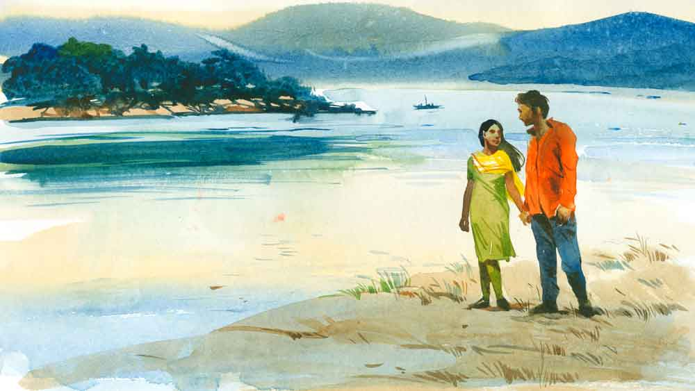

 
 <h1 align=center>এক টুকরো ব্রহ্মপুত্র</h1>
<h2 align=center>সাইদুর রহমান</h2> কেম্পেগৌড়া বিমানবন্দর থেকে সব সেরে বাইরে আসতে মিনিট বিশেক লেগে গেল। আগে জানতাম না, বেঙ্গালুরু আন্তর্জাতিক বিমানবন্দরের অফিশিয়াল নাম কেম্পেগৌড়া বিমানবন্দর। হোটেলের ড্রাইভার যেখানে থাকার কথা ছিল, বেরিয়ে তাকে দেখতে পেলাম না। হোটেল থেকে ড্রাইভারের একটা ফোন নম্বর দেওয়া হয়েছিল। সেই নম্বরে ফোন করলাম। রিং হয়ে গেল। কোথাও কোনও ভুল হচ্ছে না তো! পাশেই একটি ঝকঝকে কফি কাউন্টার। সেখান থেকে এক কাপ কফি নিতেই আমার মোবাইল ফোন বেজে উঠল।

দেখলাম ড্রাইভার ফোন করেছে। ফোন ধরতে বলল, “বাইরে একটা কফি কাউন্টার আছে। তার সামনে চলে আসুন।”

আমি সেখানেই দাঁড়িয়ে ছিলাম। এ দিক-ও দিক তাকালাম। দেখলাম পিছনেই বছর পঁচিশ-ছাব্বিশের একটি ছিপছিপে চেহারার ছেলে দাঁড়িয়ে ফোন করছে। ও যে আমাকেই ফোন করছে তা বুঝতে পারলাম। দ্রুত ওর কাছে হেঁটে গিয়ে হেসে বললাম, “ও ভাই! ম্যায় ইঁহা হুঁ।” 

ছেলেটি আমাকে নমস্কার করল। আমিও প্রতিনমস্কার করলাম। আমার হাতে দু’টি লাগেজ ছিল। ছেলেটি আমার হাত থেকে লাগেজ দু’টি নিয়ে গাড়ির দিকে এগিয়ে গেল। আমিও মায়ের হাত ধরে এগিয়ে গেলাম ছেলেটির পিছু-পিছু। গাড়ির ডিকিতে লাগেজ তুলে দিয়ে মাকেও খুব যত্ন করে ধরে গাড়িতে তুলে দিল ছেলেটি। যেন কত দিনের পরিচিত! যেন আমার মায়ের আর একটি সন্তান ও। 

*****

গাড়ি তখন বেঙ্গালুরুর মসৃণ পথ বেয়ে ছুটে চলেছে শহরের দিকে। গাড়ির স্টিয়ারিং-এ হাত রেখে মন দিয়ে গাড়ি চালাচ্ছে ছেলেটি। স্টিয়ারিং-এর সামনে একটি ছোট্ট রেডিয়ো জোরে জোরে বেজে চলেছে— ‘কুল নাই, কিনার নাই, অথই দইরার পানি/ সাবধানে চালাইও মাঝি, আমার ভাঙা তরী রে...’

অনেক দিন রেডিয়োয় গান শুনিনি। খুব ছোটবেলায় আমারও একটি ছোট্ট রেডিয়ো ছিল। সেটাকে টেবিল বা চৌকির এক কোণে রেখে দিতাম। খুব হালকা ভল্যুমে গান বাজত তাতে। আকাশবাণী কলকাতা, বিবিধ ভারতী, শিলং কত সব রেডিয়ো সেন্টারের নাম। এখন ভুলে গেছি সব। অনেক দিন পর রেডিয়ো বাজতে দেখলাম। তাও আবার এই বেঙ্গালুরুর বুকে এবং বাংলা ভাটিয়ালি গান! ছেলেটির প্রতি কৌতূহলী হলাম। 

জিজ্ঞেস করলাম, “তুমহারা নাম কেয়া হ্যায় ভাই?” 

ছেলেটি বলল, “হাসান।”

“ঘর কাঁহা?”

“অসম। অসমের গোয়ালপাড়ায় আমার বাড়ি।”  

ছেলেটি বাংলায় কথা বলছে। অবশ্য এর আগে ফোনেও বাংলায় কথা বলেছিল।

বললাম, “তুম বাংলা মে অচ্ছি বাত কর রহে হো। তুম বাঙালি হো?”

“আমি বাঙালি কি না জানি না। তবে আমার বাবা, দাদু বাঙালি ছিলেন। আমি অসমে জন্মেছি। আমাদের বাড়িতে এখনও সবাই বাংলায় কথা বলে।”

তার পর যা বলল লজ্জায় আমার মুখ লাল হয়ে উঠল। 

“আপনি তো বাঙালি। বাংলা থেকে আসছেন। বাংলায় কথা বলছেন না কেন?” 

আমি কী উত্তর দেব বুঝতে পারলাম না। বাংলার বাইরে এই হাই-টেক শহরে, তাও আবার এক জন ড্রাইভারের কাছ থেকে এই প্রশ্নের মুখোমুখি হব, ভাবিনি! তবু ছেলেটিকে চাপে রাখার জন্য বললাম, “আমি বাঙালি কী করে বুঝলে?”

“আপনার চেহারা। আপনার হিন্দি বলার ধরন!”

“না মানে, আমি সে ভাবে কিছু ভেবে বলিনি। আসলে বাইরে এসেছি তো। কেউ বাংলা বুঝতে পারবে কি না! তাই...” আমি বললাম।  

“আমি তো বাংলাতেই কথা বলছি। আপনার তো অসুবিধে হওয়ার কথা নয়।” 

এক জন ড্রাইভার এ ভাবে মুখের উপর কড়া কড়া জবাব দেবে কে জানত! আবার খুব যে ভুল কিছু বলছে, তাও নয়। এ সব কথার কী উত্তর হতে পারে জানা নেই। তাই আমি আর বেশি কিছু না বলে চুপ করে থাকলাম। 

আমরা একটা হাসপাতালে যাব। মাকে ডাক্তার দেখাতে। আগামী কাল বারোটার সময় অ্যাপয়েন্টমেন্ট করা আছে। বছর তিনেক ধরে মা হার্টের সমস্যায় ভুগছে। 

এয়ারপোর্ট থেকে হোটেল প্রায় ঘণ্টাখানেক। হাসান এত সুন্দর ড্রাইভ করছিল যে, আমরা বুঝতেই পারছিলাম না গাড়িতে আছি । 

একটু পরে হাসান নিজে থেকেই বলে উঠল, “জানেন, বহু বছর আমি এখানে আছি। কত কত জায়গা থেকে মানুষ এখানে রোগী দেখাতে আসে। নেপাল থেকে আসে। ভুটান থেকে আসে। বাংলাদেশ, আফগানিস্তান থেকেও আসে। কিন্তু বাংলা থেকে যারা আসে তারা আলাদা।”

আমি কিছুটা উৎসাহিত হয়ে জিজ্ঞেস করলাম, “কী রকম?”

“এরা প্রয়োজন ছাড়াই হিন্দি বলে। কিছুতেই জানান দিতে চায় না যে সে বাঙালি।”

হাসান যে আমাকে উদ্দেশ্য করেই কথাগুলো বলছে, সেটা বুঝতে পারলাম। তাই আমি বেশি উৎসাহ না দেখিয়ে চুপ করে থাকলাম।  

সে আবার বলল, “নেপালি, ভুটানিদের মাঝে এ রকম নেই। বাংলাদেশিদের মধ্যে খুব কম। মরাঠি, তামিলদের মধ্যেও আমি এ রকম দেখতে পাই না।”  

আমি মনে মনে রাগ করছিলাম হাসানের উপর। কাকে কী কথা বলতে হয় এখনও কেউ ওকে শেখায়নি। ও জানে না, এ সব বিষয়ে ওর চেয়ে আমি বেশি জানি। বেশি বুঝি। 

কিন্তু ওকে নিয়ে আমার কৌতূহলও বাড়ছিল। একটু পরে কথা ঘোরানোর জন্য বললাম, “এখানে তুমি কত বছর আছ হাসান ভাই?” 

“ষোলো-সতেরো বছর হবে।”  

“তোমার বয়স কত এখন?”  

“আমার বয়স এখন ছাব্বিশ।”  

“ত ুমি এখানে কী করে এলে?”

“ছোটবেলায় আব্বার সঙ্গে আসতাম। আব্বা এখানকার হোটেলে হোটেল-বয়ের কাজ করত। আমি আর মা মাঝে মাঝে এসে থাকতাম।”  

“তোমার মা কী করতেন?”

“মা কিছু করত না। আমরা তো কয়েক দিন থেকে আবার গ্রামে চলে যেতাম। যে কয়েক দিন থাকতাম, হোটেলের মালিক একটি ঘর দিত। আমরা কমবেশি দশ-পনেরো দিন থেকে ফিরে যেতাম।”  

“তোমার আব্বা এখনও হেটেলে কাজ করেন?”  

“আমার আব্বা বছর পাঁচেক আগে মারা গেছে।”

হঠাৎ কে যেন আমাকে বাধা দিল। আমি চুপ করে হাসানের দিকে তাকালাম। দেখলাম হাসান এক দৃষ্টে সামনের রাস্তার দিকে তাকিয়েআছে। স্টিয়ারিং-এ চেপে বসে আছে তার হাত। সেখানে কোনও অসতর্কতা নেই। 

একটু পরে জিজ্ঞেস করলাম, “কী ভাবে তোমার আব্বা মারা গেলেন হাসান ভাই?”

হাসান একটু চুপ করে থাকল। তার পর বলল, “নিজের দোষে।”  

আমি ঠিক বুঝতে পারলাম না। নিজের বাবার মৃত্যু নিয়ে এ ভাবে সোজাসাপ্টা কেউ উত্তর দিতে পারে, শুনিনি। হাসানের দিকে তাকিয়ে কিছু বোঝার চেষ্টা করলাম। কিছু বোঝা গেল না। স্টিয়ারিং-এ হাত রেখে সামনের দিকে তাকিয়ে আছে ও।

তার পর প্রশ্ন করলাম, “নিজের দোষে মানে?”  

“আব্বা লেখাপড়া জানত না। আমার দাদুও জানত না। জমিজমার কাগজপত্র কিছু ঠিক করে গুছিয়ে রাখেনি। ভোটার কার্ডের নামের সঙ্গে রেশন কার্ডের নামের মিল ছিল না। জমির দলিলেও নামের বানান ভুল ছিল। তার পর সরকার থেকে নোটিস হল। নাগরিকত্বের কী সব প্রমাণ দিতে হবে। আব্বা প্রমাণ দিতে পারল না। দু’বছর ধরে অফিসের দুয়ারে দুয়ারে ঘুরে কাগজপত্র ঠিক করতে পারল না। এক দিন সকালবেলা সবাই দেখল, ঘরে গলায় দড়ি দিয়ে মরে পড়ে আছে।”  

আবার চুপ করে গেলাম। ঠিক কী কথা বলা উচিত ভাবার চেষ্টা করছি।

হাসান আবার বলতে শুরু করল, “আব্বা লেখাপড়া জানত না। কিন্তু আত্মসম্মান বোধ ছিল খুব। কাগজপত্র ঠিক করার জন্য সারা দিন অফিসের দুয়ারে দুয়ারে ঘুরে ঘরে ফিরে ঝিম ধরে বসে থাকত।”   

আমি বললাম, “তোমার কাগজপত্র ঠিক আছে হাসান ভাই?”  

“হ্যাঁ। আমার কাগজপত্র সব ঠিক করে নিয়েছি।”  

“তুমি লেখাপড়া জানো?”  

“আমাদের গ্রামের স্কুলে মাধ্যমিক পর্যন্ত পড়েছি।”  

“তুমি এখন গ্রামে যাও না?”  

হঠাৎ হাসান জোরে ব্রেক করে গাড়িটিকে রাস্তার বামে দাঁড় করাল। তাকিয়ে দেখলাম রাস্তার ধারে একটা চায়ের দোকান। পাশেই একটাবড় ধাবা। 

হাসান আমাকে বলল, “চলুন, চা খেয়ে আসি।”  

আমি চা খাই না। মাঝে মধ্যে নিতান্ত উপায় না থাকলে চিনিছাড়া চা খাই। হাসানের অফারটায় আপত্তি করতে পারলাম না। 

চা-পর্ব শেষ হলে আমরা আবার গাড়িতে চেপে বসলাম। হাসানের রেডিয়ো থেকে ভাটিয়ালির সুর তখন রাস্তার দু’ধারে নদীর ঢেউয়ের মতোই আছড়ে পড়েছে।

গাড়িতে স্টার্ট দিয়ে হাসান স্টিয়ারিং-এ হাত রেখে গাড়িটিকে মসৃণ ভাবে রাস্তায় তুলে আনল। তার পর বলতে শুরু করল, “আপনি জিজ্ঞেস করছিলেন না গ্রামে যাই কি না! আব্বা বেঁচে থাকার সময় থেকেই এখানে চলে এসেছিলাম। আব্বা যে হোটেলে কাজ করত, সেই হোটেলে আমিও কাজ শুরু করি। আব্বার সঙ্গেই কাজগুলো করতাম। তবে, তখন আমি বাড়িতে বেশি থাকতাম। স্কুলে পড়তাম। 

“আমাদের বাড়িটা ছিল ব্রহ্মপুত্রের ধারেই। বাড়ি থেকে দু’পা হাঁটলেই নদী। আর পাঁচ মিনিট হেঁটে গেলে স্কুল। আমি স্কুল ফাঁকি দিতে চাইতাম না। ফতেমাকে খুব ভালবাসতাম তো!”

তার পর হাসান চুপ করে গেল। আমিই জিজ্ঞেস করলাম, “ফতেমা কে, হাসান?” 

“ফতেমা আমার ক্লাসমেট ছিল। একই গ্রামে থাকতাম। আমরা একে অপরকে ভালবাসতাম।”  

“ভালবাসতাম মানে? এখন ভালবাসো না?”  

“ফতেমা আর নেই। ফতেমাকে মেরে ফেলেছে!”

হাসান দীর্ঘশ্বাস ফেলল। আমি তাকিয়ে দেখলাম হাসানের চোখ ছলছল করছে।

প্রচণ্ড গতিতে গাড়ি চলছে। এই সময় হাসানকে আবেগপ্রবণ করে তোলা ঠিক হবে কি না ভাবছি। আবার হাসানের কথা শুনতে লোভও হচ্ছে ভীষণ। শখের লেখক আমি। সুযোগ পেলে দু’-একটা গল্প লিখি। দু’-একটি ম্যাগাজ়িনে গল্পও বেরিয়েছে।

আমি কিছু জিজ্ঞেস করতে যাব, হাসান নিজে থেকেই বলতে শুরু করল, “বছর চারেক হল। আব্বা মরার ওই মাস পাঁচ-ছয় পরে। হঠাৎ গ্রামে দাঙ্গা শুরু হল।”

দাঙ্গা! দাঙ্গার কথা শুনতে ভাল লাগে না। শুনেছি কিছু মানুষ ইচ্ছে করে দাঙ্গা লাগায়। তাতে অনেক মানুষ মারা যায়। নিজের চোখে দাঙ্গা কখনও দেখিনি। মানে সে রকম পরিস্থিতির মধ্যে পড়িনি আর কী! আর পড়তেও চাই না। আমি সাধারণ ভদ্র বাঙালি, কারও কোনও ঝামেলায় থাকি না। বরং ঝামেলার কথা শুনলে অনেক দূর থেকে কেটে পড়ার রাস্তা খুঁজি। কিন্তু কেন যেন হাসানেরকথা শোনার আগ্রহ ক্রমশই বেড়ে যাচ্ছিল আমার।

কথা বলতে বলতে একটু থামল হাসান। তার পর আবার শুরু করল, “আমি তখন এখানে। ফতেমাকে বলে এসেছিলাম, এখানে একটা ভাল জায়গা দেখে কিছু একটা কাজকম্ম জোগাড় করে ওকে নিয়ে আসব। মাকেও নিয়ে আসব। সে আর হল না। এক দিন সকালবেলা গ্রাম থেকে এক বন্ধু ফোন করে জানাল, ব্রহ্মপুত্রের চরে ফতেমার লাশ পাওয়া গেছে।”

আবার কিছু ক্ষণ চুপ করল হাসান। একটা ঢোক গিলে আবার শুরু করল সে, “সে দিনই সকালবেলা এখানে বসে টিভিতে দেখলাম ফতেমাকে। ব্রহ্মপুত্রের চরে কী শান্ত ভাবে নিশ্চিন্তে ঘুমোচ্ছে ও!”  

তার পর আমাকে লক্ষ করে বলল, “জানেন, ব্রহ্মপুত্রের ওই চরে ফতেমাকে নিয়ে আমি কত দিন ঘুরে বেড়িয়েছি। বসে থেকেছি ঘণ্টার পর ঘণ্টা। দুপুর থেকে সন্ধে পর্যন্ত কত সাঁতার কেটেছি দু’জনে।” 

আমি জিজ্ঞেস করলাম, “তুমি গ্রামে যাওনি ফতেমাকে দেখতে?”  

“পরের দিনই গিয়েছিলাম। সৌমেনকাকু বিমানের টিকিট কেটে দিয়েছিল। কিন্তু গিয়ে কী আরহল দাদা? না যাওয়াই তো ভালছিল। না গেলে হয়তো ফতেমা আজও আমার কাছে জীবিত থাকত। আমি যে নিজের চোখে তার লাশ দেখে এলাম।” 

কিছু ক্ষণ চুপ থেকে বলল, “সেই যে চলে এসেছি, আর যাইনি গ্রামে। আমার এক আত্মীয়ের বাড়িতে মাকে রেখে এসেছি।”

আমি বললাম, “কিন্তু তোমার সেই গ্রাম, সেই ব্রহ্মপুত্রের চর তোমাকে আর টানে না হাসান?”

হাসানের উত্তর শোনা হল না। তত ক্ষণে হোটেলের কাছে চলে এসেছিলাম। হাসান গাড়ি চালাতে চালাতেই মাঝে মাঝে আশপাশের লোকদের হাত নেড়ে কখনও বাংলায়, কখনও হিন্দিতে কুশল সংবাদ নিচ্ছিল। বুঝতে পারছিলাম এই এলাকায় হাসানকে সবাই চেনে।

একটু পরেই হোটেলের সামনে গাড়ি এসে দাঁড়াল। হাসান গাড়ি বন্ধ করতেই হোটেলের দু’জন বয় নেমে এল। হাসান ডিকি খুলে দিয়ে তাদের লাগেজগুলো হোটেলের ঘরে নিয়ে যেতে বলল। 

আমি নেমে মাকে গাড়ি থেকে নামাতে যাব, তার আগেই দেখি হাসান মাকে নামাতে এগিয়ে এসেছে। হোটেলে আমাদের ঘরটি ছিল দোতলায়। খুব সাবধানে মাকে ধরে আস্তে আস্তে ঘরের বিছানায় নিয়ে গিয়ে বসাল হাসান। 

আমার মা সামান্য সেবা বা কারও যত্ন পেলেই আবেগে কেঁদে ফেলেন। হাসানের হাত চেপে মা বললেন, “তুমি আমার ছেলের মতো বাবা। আবার এস এই মাকে দেখতে।”

হাসানও মায়ের হাত চেপে ধরেছিল। দেখলাম, সে কিছু একটা বলতে গিয়েও বলতে পারল না। শুধু মায়ের পায়ের কাছে একটা হাত রেখে মাথা নিচু করে ঘর থেকে বেরিয়ে যেতে গেল। আমি পেছন থেকে তার পিঠে আলতো করে হাত রেখে ডাকলাম, “হাসান ভাই!”

থমকে দাঁড়াল হাসান। তার পর ফিরে তাকাল। আমি হাসানের দিকে তাকিয়ে নির্বাক হয়ে গেলাম। তার মুখমণ্ডল জুড়ে এক টুকরো ব্রহ্মপুত্র লেগে আছে। দু’পাশে ঘন নীল দুই চোখ। সমুদ্রের অসীম গভীরতা সেই দু’চোখের ভিতর দিয়ে দৃষ্টির অন্তরালে চলে গেছে। সেই চোখের গভীরতা মাপার ক্ষমতা আমার নেই। শুধু বুঝতে পারলাম, আদিগন্ত বিস্তৃত ব্রহ্মপুত্রের কালো ঘন নীল জল হাসানের দু’চোখের গভীরে এসে ভর করছে। একটু স্পর্শ পেলেই সহস্র ধারায় গড়িয়ে পড়বে।

আমি তাকে বুকে টেনে নিয়ে ডাকলাম, “হাসান।”

হাসান আমার বুকে মাথা রেখে ফিসফিস করে বলল, “খুব তাড়াতাড়ি গ্রামে যাব দাদা। মায়ের কাছে যাব। আর ব্রহ্মপুত্রের চরে গিয়ে এক বার খুব জোরে শ্বাস নেব। খুব জোরে।”

তার পর প্যান্টের পকেট থেকে একটা রুমাল বার করে খুব সন্তর্পণে চোখের দুই কোণ মুছে নিয়ে জোরকদমে বেরিয়ে গেল।

সবচেয়ে আগে সব খবর, ঠিক খবর, প্রতি মুহূর্তে। ফলো করুন আমাদের Google News, Twitter এবং Instagram পেজ।