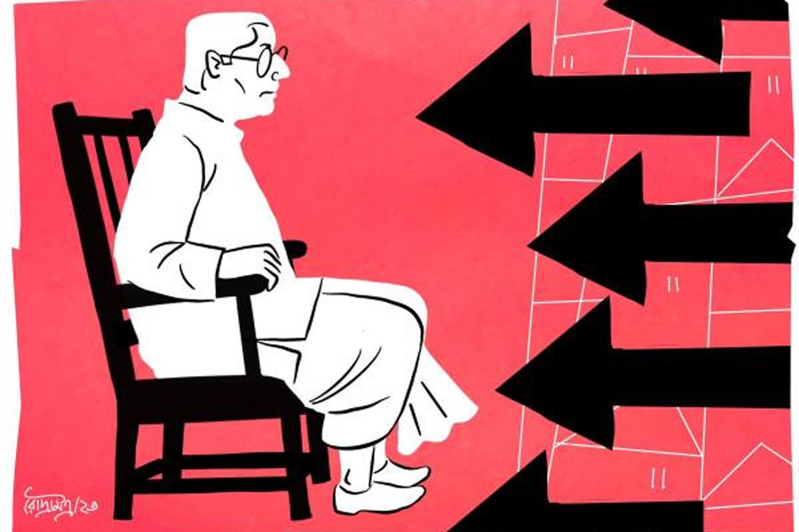

 
 <h1 align=center>একা কুম্ভ</h1>
<h2 align=center>কাকলি ঘোষ</h2> কতয় বিকোবে লোকটা?”

“জানি না স্যর। বহুত খচড়া। কিছুতেই বাগে আনা যাচ্ছে না।”

“হুম! কী যেন নাম?” জিজ্ঞেস করে স্বপন জোয়ারদার।

“ব্রতীন ঘোষাল।” তেতো মুখে উচ্চারণ করে মন্টু, “ওই এক কথা— ‘আমি পারব না। আর কি কোথাও জায়গা নেই? সেখানে যাও না।’ — এই সব ফালতু বুকনি! বুঝিয়ে বললাম— ‘এই ইস্কুল তো স্যর এমনিই উঠে যাবে। আপনি হেডমাস্টার। আপনার একটা কলমের খোঁচায় সব হয়ে যায়। সুযোগ আছে কিছু কামিয়ে নিন।’ তো সে কথা কানে তুললে তো!”

“আর ক’বছর চাকরি আছে?”

“দু’বছর মতো। এই ক’টা দিন কাটাতে পারলে...”

“বাজে বোকো না। ঝুনঝুনওয়ালা এতগুলো টাকা ঢেলেছে দু’বছর বসে থাকার জন্য? সময়ের দাম নেই? যে ভাবেই হোক রাজি করাও। টাকার অ্যামাউন্ট বাড়িয়ে দাও।”

চোখ নামিয়ে নিঃশব্দে মাথা চুলকোয় মন্টু, বলে, “হবে না স্যর। ও মালটা বহুত টেঁটিয়া। ওর ছেলে বলছিল, বরাবরই এ রকম। আদর্শবাদী টাইপ।”

“ছেলে? কে সে? কী করে?” এ বার নড়েচড়ে বসে স্বপন জোয়ারদার।

“ওর নাম অতনু, স্যর। কিছু করে না। পাশটাশ করে বসে আছে।”

কয়েক মুহূর্ত চুপ করে থাকেন স্বপন। একটা সূক্ষ্ম হাসি খেলে যায় মুখে। তার পর বলেন, “তা হলে এখানকার ম্যানেজারকে অন্য প্রজেক্টে পাঠাও। আর ছেলেটাকে কনস্ট্রাকশন ফার্মে সেই জায়গায় বসিয়ে দাও। ম্যানেজারি করুক। তার পর আবার যাও মাস্টারের কাছে।”

“বলছেন যখন যাব। তবে মনে হয় না কাজ কিছু হবে। দেখি...”

“হবে হবে। ঠিক জায়গায় ঠিক দাম ফেললে সবই কেনা যায়..” চোখ বুজে মুচকি হাসে জোয়ারদার।

চুপ করে যায় মন্টু। বলছে বটে স্বপনদা। কিন্তু লোকটাকে তো দেখেছে ও। সাদা ধবধবে ধুতি-পাঞ্জাবি। ব্যাকব্রাশ করা কাঁচাপাকা চুল। আর সবার উপরে দুটো চোখ! সামনে দাঁড়ালে যেন ভিতরটা অবধি দেখে ফেলে। প্রথম দিকে ঘুরিয়ে-পেঁচিয়ে বললেও পরে তো স্পষ্টই বলেছে ও। ক’টা ছেলেমেয়েই বা পড়ে ওই প্রাইমারি ইস্কুলে। দশ-পনেরো জন। এই ক’টা বাচ্চার জন্য ফালতু লাফড়া রেখে কী লাভ? মাস্টারমশাই যদি একটা চিঠি লিখে দেন যে, ইস্কুলে আর কেউ আসে না, তা হলেই তো...

কথা শেষ করতে পারেনি ও। উত্তর না দিয়ে শুধু চেয়ে ছিল লোকটা। তার পর আঙুল তুলে দরজা দেখিয়ে দিয়েছিল। আর কেউ হলে ওখানেই চোখ দুটো গেলে দিত মন্টু। কিন্তু কী যে হল! ওই ধপধপে ধুতি-পাঞ্জাবি আর সোজাসাপ্টা চাউনির সামনে নিজেকে বড় নোংরা লাগছিল। বেরিয়ে আসার পরেও যেন গায়ে এঁটে বসে রইল চাউনিটা।

*****

বাইরের বারান্দায় বসে সামনের দিকে তাকিয়ে দেখছিলেন ব্রতীন ঘোষাল। বোসেদের বাড়িটাও গেল। আজ থেকেই ভাঙা শুরু হয়েছে। বহুতল হবে। বোসদা আর বৌদি বেঙ্গালুরু আর পুণেতে ছেলেদের কাছে ভাগাভাগি করে থাকবেন। কেন যে এ রকম ভুল করছেন ওরা! ভিটেমাটি কি ছাড়তে আছে!

ভাবছিলেন দেখা হলে বুঝিয়ে বলবেন এক বার। কিন্তু এই ক’দিন বোসদাকে একলা পেলেন না। ছেলেরা যেন এঁটুলির মতো আটকে আছে সঙ্গে। অথচ এই গত সপ্তাহ অবধি দু’জনে এক সঙ্গে বাজারে গেছেন। গোটা রুই আধাআধি করে নিয়েছেন। লাগোয়া বাড়ি। কত দিনের সম্পর্ক। সব ঘুচে যাবে।

বুকে এক বার হাত বুলিয়ে নিলেন ব্রতীন ঘোষাল। কেমন ফাঁকা লাগে যেন। একে একে সবাই যাচ্ছে। ও দিকে সান্যালরা গেল। চাটুজ্জেরা আগেই গেছে। একতলা, দোতলা সামনে উঠোন পিছনে খিড়কি— বাড়িগুলো এখন সব ঝাঁ-চকচকে ফ্ল্যাটবাড়ি! সেই প্রাণের সংযোগ যেন আর নেই। পাড়া কালচারের বদলে এখন ফ্ল্যাট কালচার।

কী চমৎকার একটা পুকুর ছিল ঘোষদের! টলটলে কাকচক্ষু জল। আর তেমনই মাছ! হঠাৎ অদ্ভুত ভাবে নোংরা আবর্জনা ফেলে পুকুরটাকে ভরাট করার জন্য যেন উঠেপড়ে লাগল সকলে। অবাক চোখে দেখেছেন, যারা ওই পুকুরের মাছ খেয়ে এক সময় ধন্য-ধন্য করত, তারাও রাতের অন্ধকারে লুকিয়ে প্লাস্টিকে ভরে নোংরা ফেলে যাচ্ছে। অথচ যাদের পুকুর তাদের কোনও হেলদোল নেই।

শেষে সত্যিটা কানে এল। অতনুই বলল, “পুকুর ভরাট করে বিক্রি করবে ওরা। পাড়ার লোক নয়, ওরা নিজেরাই জঞ্জাল ফেলে ভর্তি করছে তলায় তলায়।”

কথাটা শুনে অবধি বিস্ময়ের শেষ ছিল না যেন! পুকুর বোজানো‌ তো বেআইনি। আর পাড়ার মধ্যে এমন সুন্দর একটা জলাশয়! শুধু কি কাজের? চোখেরও তো কত আরাম ছিল! কিন্তু থাকল কোথায়? দেখতে দেখতে পুকুর বুজিয়ে জমি ভরাট করে তৈরি হয়ে গেল বিশাল ইমারত।

শুধু কি এটুকু? স্কুলটা? ও দিকে তো আর তাকানো যায় না। ছাত্র প্রায় নেই। শূন্য বেঞ্চ, ফাঁকা ক্লাসরুম। চার দিক যেন খাঁ-খাঁ করছে। অথচ এক সময় ভালই ছাত্রসংখ্যা ছিল এই শান্তিপুর বয়েজ়’ প্রাইমারি স্কুলে। প্রথম থাবা বসাল ইংরেজি মিডিয়াম স্কুলগুলো। আর পরে লকডাউন।

তবু যান এক বার করে রোজই। তালা খোলেন। শূন্য ঘরগুলোয় ভূতের মতো ঘুরে বেড়ান। অপেক্ষা করেন যদি কেউ আসে। খাতায়-কলমে এখনও জনাদশেকের নাম আছে। অতিমারি  পরিস্থিতি তো কিছুটা হলেও কেটেছে। যদি কেউ আসে! শিক্ষকরাও কেউ  আসেন না। এসে কী হবে? ছাত্র কই? আগে যাও বা দু’-চার জন আসত, জানেন না কোন অজ্ঞাত কারণে তারাও আসা বন্ধ করেছে। তবু অপেক্ষা করেন। এ দিকে শকুনের মতো ঘোরাফেরা করছে দালালরা। স্কুল উঠিয়ে শপিং মল হবে। দু’-তিন বার ভাগিয়ে দিয়েছেন। কিন্তু কত দিন?

“আসব স্যর?”

ভাবনায় বুঁদ হয়েছিলেন এত ক্ষণ। চমকে ঘুরে তাকালেন, “কে?”

একেবারে বারান্দার সামনের সিঁড়িতে উঠে এসে দাঁড়িয়েছে একটা লোক। সে বলে উঠল, “স্যর, আমার নাম স্বপন জোয়ারদার।”

স্বপন জোয়ারদার! এর কথাই তো বলছিল অতনু। এঁর কোম্পানিতে ডেকে চাকরি দিয়েছে ওকে! অবাকই হয়েছেন শুনে। কনস্ট্রাকশন কোম্পানির জানে কী অতনু? বি এসসি বিএড করে বসে আছে। ইচ্ছে ছিল স্কুল সার্ভিস কমিশনের পরীক্ষা দিয়ে স্কুলে পড়াবে। সে পরীক্ষাই তো বন্ধ হয়ে গেল। বেকার বসেছিল ছেলেটা ঠিকই। কিন্তু এই চাকরি! এত লোক থাকতে হঠাৎ ওকে ডেকে চাকরি দেওয়ার মানে? বিপদের গন্ধ পাচ্ছিলেন। ছেলেকে বারণও করেছিলেন ও চাকরি নিতে।সে কথা শোনেনি।

“আপনি হঠাৎ! মানে...” কথা শেষ করতে পারেন না ব্রতীন ঘোষাল। চোখ পড়ে স্বপন জোয়ারদারের পিছনের দিকে। ওই ছেলেটা সে দিন এসেছিল না? মন্টু না কী নাম? বাজে কথা বলছিল। এ কেন স্বপন জোয়ারদারের সঙ্গে?

ভ্রু কুঁচকে কিছু ক্ষণ তাকিয়ে রইলেন ব্রতীন। আস্তে আস্তে সমীকরণ দিনের আলোর মতো স্পষ্ট হয়ে যায় চোখের সামনে। তার ছেলেকে ডেকে চাকরি দেওয়া তা হলে এই জন্য?

নিজের অজান্তেই যে চোয়াল শক্ত হচ্ছে টের পাচ্ছিলেন। তবু শান্ত চোখে তাকালেন।

“আপনার কাছে একটা দরকারে এসেছি মাস্টারমশাই।”

অনুমতির অপেক্ষা না করে সামনের চেয়ারে বসে পড়ে লোকটা।

“বলুন।”

“একটা সামান্য কাজ। একটা সই। করে দিন দয়া করে।”

“কী কাজ? কোথায় সই করতে হবে? কিসের?” বেশ কষ্ট করে নিজেকে সংযত রাখেন ব্রতীন।

“এই যে স্যর, আমি সব লিখেটিখেই এনেছি। কিচ্ছু দেখতে হবে না। ও ইংরেজিতে একটাও ভুল পাবেন না। আপনার ছেলেকে দিয়েই লিখিয়েছি তো। শুধু আপনি একটা সই করে দিলেই...”

হাতের ফাইল থেকে কাগজটা বার করে সামনে রাখে লোকটা।

“কী এটা?”

“সবই তো জানেন স্যর। আগেও লোক পাঠিয়েছি। এই মন্টুও বারদুয়েক ঘুরে গেছে আপনার কাছে। এ স্কুল তো এমনিই উঠে যাবে। ক’টা ছাত্র হয় বলুন তো? কেউ আসে আর? কেউ আর পড়বে না এ সব বাংলা মিডিয়াম স্কুলে। মাতৃভাষা-টাষা ভুলে যান স্যর। আপনি শুধু লিখে দিন এই স্কুলে আর কোনও ছাত্র নেই। ব্যস। বাকিটা আমরা বুঝে নেব। আপনারও কিছু ফায়দা হবে, আমাদেরও হবে...”

অতনু এই চিঠি লিখে দিয়েছে এদের! চাকরি করা মানে কি মাথা বিকিয়ে দেওয়া! অসহ্য রাগে জ্বলে ওঠে শরীর। তবু নিজেকে শান্ত রাখেন ব্রতীন, বলেন, “দুঃখিত। আমি সই করতে পারব না।”

“পারবেন স্যর, খুব পারবেন!” দপ করে জ্বলে উঠেই ঠান্ডা হয়ে যায় জোয়ারদারের চোখ, “মন্টু, স্যরের প্রণামীটা দাও...”

“এই যে দাদা...” চোখের পলকে একখানা মোটা খাম সামনে বাড়িয়ে ধরে মন্টু।

কিছু ক্ষণ খামটার দিকে স্থির চোখে তাকিয়ে থেকে উচ্চস্বরে হেসে ওঠেন ব্রতীন। তার পর বলেন, “মানুষ চিনতে ভুল করেছেন আপনারা। আচ্ছা। আজ তবে আসুন। নমস্কার।”

চেয়ার ছেড়ে উঠে দাঁড়ান।

চলে যেতে বলার সুস্পষ্ট ইঙ্গিত সত্ত্বেও ওঠার কোনও লক্ষণ দেখায় না স্বপন জোয়ারদার। দাঁতে দাঁত ঘষে বলে, “সই করবেন না তা হলে?”

“যা বলার বাংলাতেই তো বললাম। বুঝতে পারছেন না? বাংলা মিডিয়ামের এত দুরবস্থা, জোয়ারদারবাবু! মাতৃভাষা যে কারও কাছে এ রকম দুর্বোধ্য হতে পারে, টের পাইনি তো আগে। স্পষ্ট করে বলছি, যত ক্ষণ খাতায় একটি ছেলেরও নাম থাকবে তত ক্ষণ সই করব না। আপনারা আসতে পারেন এ বার।”

চিবিয়ে চিবিয়ে স্বপন জোয়ারদার বলে, “ভুল করছেন মাস্টার। আর দু’বছরই তো মোটে চাকরি। কেন ঝুটঝামেলায় জড়াচ্ছেন।”

“আছি তো এখনও দু’বছর। তার পরই না-হয় যা করার করবেন। আমি থাকতে নয়।”

কিছুক্ষণ নিষ্পলক চেয়ে থেকে উঠল স্বপন জোয়ারদার। দৃষ্টি সরালেন না ব্রতীনও। জোয়ারদারের চাউনিতে নিষ্ঠুরতার আভাস। কিন্তু ব্রতীনের কিছু মনে হল না। এই মুহূর্তে জোয়ারদার হেরে গেছে তাঁর আত্মবিশ্বাসের কাছে। তিনি জানেন বাড়িতে ঝড় উঠবে। জানেন, কাল থেকে আবার অতনু বেকার। সকলে তাঁর দিকে আঙুল তুলবে, তাঁকে দোষ দেবে, তবু বড় শান্তি, বড় স্বস্তিতে ভরে গেছে ভেতরটা। 

হয়তো কয়েক দিনের মধ্যেই এক শান্ত সন্ধেয়, অন্ধকার রাস্তায় কেউ তাঁকে ছুরি মারবে, কিংবা গাড়িতে পিষে দেবে। রক্তাক্ত হতে তাঁর আপত্তি নেই। তিনি শান্তি পাচ্ছেন শুধু এই ভেবে যে, ওদের কালো হাত এতটুকুও কালি লাগাতে পারেনি তার সাদা ধপধপে ধুতি-পাঞ্জাবিতে।

ছবি: রৌদ্র মিত্র