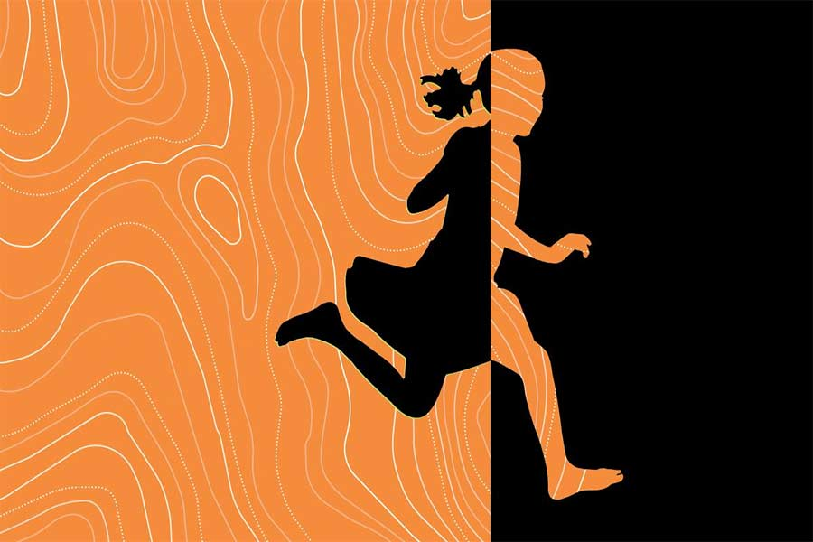

 
 <h1 align=center>এমনি</h1>
<h2 align=center>স্মরণজিৎ চক্রবর্তী</h2> 

কালকে মুখ্যমন্ত্রীর সঙ্গে জরুরি মিটিং আছে। তাই নিজের ঘরে সকাল-সকাল কাজ নিয়ে বসেছে বিশ্বনাথ। ওর পার্সোনাল সেক্রেটারি এখনও আসেনি। আসলে আজ রবিবার, ছুটির দিন। তাই একটু দেরি করছে বোধহয়। অন্য কেউ হলে হয়তো রাগ করত। কিন্তু বিশ্বনাথের শরীরে রাগ নেই। ওর মনে হয়, রাগের মতো বিষ আর দ্বিতীয় কিছু নেই এই পৃথিবীতে।

“বাবা! বাবা!” তুলি উত্তেজিত হয়ে দৌড়ে এল ঘরের মধ্যে।

বিশ্বনাথ মুখ ফিরিয়ে তাকাল। শ্যামলা মেয়েটার মুখ-চোখ উত্তেজনায় লালচে হয়ে আছে। একটু যেন হাঁপাচ্ছে। সঙ্গে মুখে হাসি। দশ বছরের মেয়ে, বাবার খুব ন্যাওটা।

বিশ্বনাথ জিজ্ঞেস করল, “কী হয়েছে মা?”

তুলি বলল, “তপনকাকু এসে গেছে টিভি লাগাতে, তুমি দেখবে না?”

বিশ্বনাথ অবাক হল, “এই সকাল সাড়ে আটটাতেই চলে এসেছে টিভি লাগাতে!”

তুলি বলল, “হ্যাঁ গো! আমি বলেছিলাম যে, তাড়াতাড়ি ইনস্টল করে দিতে! ডিএম-এর মেয়ে না আমি? আমার কথা শুনবে না? সেভেন্টি ফাইভ ইঞ্চেস! ওহ, মনে হচ্ছে বসার ঘরটা যেন একদম সিনেমাহল হয়ে গেছে!”

“ডিএম-এর মেয়ে— এমন কথা ভাবতে নেই মা। ক্ষমতা আজ আছে কাল নেই। এ সবের সঙ্গে অ্যাটাচড হতে নেই, তাতে কষ্ট পেতে হয়...” বিশ্বনাথ হাসল। বলল, “আর আমি একটু দরকারি কাজ করে নিই মা। তোমরা দেখো।”

তুলি বিরক্ত হল, “তুমি কখনও টিভি দেখো না কেন গো? ডাকলেই এড়িয়ে যাও! কেন?”

বিশ্বনাথ মেয়ের মাথায় হাত দিয়ে বলল, “কোনও কারণ নেই মা। এমনি। তুমি গিয়ে দেখো, আনন্দ করো... কেমন!”

পঁয়ত্রিশ বছর আগে

অনেকটা দেরি হয়ে গিয়েছে, তাই ঊর্ধ্বশ্বাসে দৌড়ল বিশ্বনাথ। কোচিংয়ের সুব্রতদা রবিবারগুলোয় ইচ্ছে করেই যেন দেরি করে ছাড়ে! ও দিকে ‘মহাভারত’ শুরু হয়ে যাবে যে! প্রতি রবিবার ‘মহাভারত’ না দেখলে কী যে মনখারাপ করে বিশ্বনাথের!

লোহাজেঠুর বাড়ির জানলায় ভিড় লেগে যায় মহাভারত দেখার। দুটো জানলায় কম-বেশি কুড়ি জনের মতো মানুষ ভিড় করে। জায়গা পাওয়াই মুশকিল হয়ে যায়। ভাগ্যিস নুড়ি আছে!

নুড়ি ওর বোন। এগারো বছর বয়স। শ্যামলা রোগা-পাতলা চেহারা। বড় বড় চোখ। সঙ্গে মুখে খই ফুটছে যেন। ও সবার সঙ্গে লড়াই করে বিশ্বনাথের জন্য জানলার সামনে জায়গা রাখে।

আসলে ওদের বাড়িতে টিভি নেই। ওদের বাবা কাছের একটা হাই স্কুলে দারোয়ানের চাকরি করে। খুবই সামান্য মাইনে। টানাটানির সংসারে তাই আর এ সব বিলাসিতা করার কথা ওরা ভাবতেও পারে না। টিভি ছাড়াই ওদের চলে যায়।

এমনিতে ওদের দুই ভাইবোনের টিভি দেখার নেশা খুব একটা নেই। কিন্তু এই একটা সিরিয়াল ওরা দেখতে চায়। লোহাজেঠুর বাড়িতে রঙিন টিভিটা বসার ঘরে এমন করে রাখা যে, বড় দুটো জানলা দিয়ে বাইরে থেকে স্পষ্ট দেখা যায়। ‘মহাভারত’ ওর খুব পছন্দের সিরিয়াল হলেও, অন্যের বাড়িতে এ ভাবে জানলা দিয়ে টিভি দেখতে লজ্জা করে বিশ্বনাথের। কিন্তু নুড়ি এমন করে বলে যে ও ‘না’ বলতে পারে না। আসলে নুড়িকে কিছুতেই ও ‘না’ বলতে পারে না। নুড়ি সবার খুব আদরের।

এই টিভি দেখা নিয়ে মা-ও বকে। বলে, “লেখাপড়া নেই তোদের! আর অন্যের বাড়ির জানলায় এ ভাবে ঝুলে ঝুলে দেখিস কেন? মানসম্মান নেই একটা! হঠাৎ কোনও দিন যদি খারাপ কিছু বলে দেয়, আমাদের কতখানি অপমান হবে ভেবে দেখেছিস!”

নুড়ি মাকে অন্য ভাবে প্রতিহত করে। কটকট করে বলে, “আর তো মোটে কয়েকটা বছর। তার পর আমার দাদাই বাড়িতে টিভি কিনে আনবে। বড় টিভি! তাই না রে দাদা?”

বিশ্বনাথ লেখাপড়ায় খুব ভাল। ও বোঝে, বাড়ির সবার ওর প্রতি খুব আশা। এই কারণে মাঝে মাঝে ভয়ও করে ওর। আসলে প্রত্যাশার মতো চাপ জীবনে খুব কম আছে। যাকে এটা সামলাতে হয়, সে-ই এর ভার জানে।

লোহাজেঠুর বাড়ির সামনে আজও বেশ ভিড়। জানলায় লোকজন যেন ঝুলছে! অনেকেই এখানে মুখ চেনা হয়ে গিয়েছে এখন।

বিশ্বনাথ গিয়ে ভিড়ের বাইরে দাঁড়িয়ে, “নুড়ি, নুড়ি...” বলে চিৎকার করে ডাকল।

একটা অল্পবয়সি মেয়ে ভিড়ের মধ্য থেকে বলল, “ও নেই। চলে গেছে।”

“চলে গেছে?” বিশ্বনাথ অবাক হল। মহাভারত না দেখেই!

“হ্যাঁ রে, আসলে ও কথা বলছিল জোরে জোরে। বাড়ির মধ্যে থেকে এক জন এসে ওকে ধমক দিয়েছে, ভিখিরি বলেছে। বলেছে, ‘ভিখিরিদের মতো এসেছিস, চুপ করে থাক। এত গলাবাজি কিসের!’ তাই নুড়ি কাঁদতে কাঁদতে চলে গেছে।”

বিশ্বনাথ জানে, নুড়ি খুব অভিমানী।

ও আর অপেক্ষা না করে বাড়ির দিকে দৌড়ল। থাক, আজ আর সিরিয়াল দেখে কাজ নেই। গলি দিয়ে সামনে গেলেই বড় রাস্তা, আর সেটা পেরিয়ে কিছুটা দূরে ওদের বাড়ি।

বড় রাস্তার কাছে গিয়ে থমকে দাঁড়াল বিশ্বনাথ। ও দিকে বেশ ভিড়। আর সেই ভিড়ের মধ্যে বাবা-মাকে দেখতে পেল ও। কী হয়েছে?

ও ঊর্ধ্বশ্বাসে দৌড়ল বাবা-মায়ের দিকে। ভিড়ের মধ্যে কিছু লোক রাস্তার গাড়ি থামানোর চেষ্টা করছে। বিশ্বনাথ দেখল, বাবার কোলে শুয়ে আছে নুড়ি। চোখ বন্ধ। হাত দুটো ছড়ানো। মাথায় আর মুখে রক্ত!

হাত-পা কাঁপছে বিশ্বনাথের! নুড়ির কী হয়েছে! এমন রক্ত কেন! বিশ্বনাথ মাটিতে বসে পড়ল। মাথা একদম শূন্য ওর! ও শুনল লোকজন বলছে, “মেয়েটা কাঁদতে কাঁদতে, কোনও দিকে না তাকিয়ে রাস্তা ক্রস করছিল… হঠাৎ একটা গাড়ি এসে…”

সে দিন বিকেলে, সব মায়া কাটিয়ে চলে গিয়েছিল নুড়ি। বাইরে পাখিরা ডাকছিল খুব। সূর্যের শেষ আলো স্কাইলাইট দিয়ে এসে পড়ছিল হাসপাতালের ঘরের মেঝেতে। বাবা-মায়ের সঙ্গে বিশ্বনাথ দাঁড়িয়েছিল লোহার বেডের সামনে।

নুড়ি শুধু এক বার চোখ মেলে তাকিয়েছিল। দুর্বল গলায়, অস্ফুটে বলেছিল, “দাদা, আমরা ভিখিরি নই তো?”

এখন

তুলি রাগ করে তাকিয়ে আছে বিশ্বনাথের দিকে। সেই শ্যামলা রোগা-পাতলা চেহারা! বড় বড় চোখ! অবিকল যেন নুড়ি! পিসির সঙ্গে ভাইঝির এমন অদ্ভুত মিল হয়!

তুলি বলল, “তোমার সবেতেই এক কথা—এমনি! ভাল লাগে না আমার!”

তার পর “মা, মা...” বলতে বলতে চলে গেল!

বিশ্বনাথ মাথা নিচু করে বসে রইল। ‘এমনি’ ছাড়া আর কী-ই বা বলবে! এই একটা শব্দের তলায় মানুষ কত কিছু যে লুকিয়ে রাখে! কত না-বলা, না-বলতে পারা কথাকে যে ঢেকে রাখে এই ‘এমনি’!

বিশ্বনাথ মুখ তুলে তাকাল। দেওয়ালে মা, বাবা আর নুড়ির ছবি। আজ ওরা আর কেউ নেই। বিশ্বনাথের বুকের মধ্যে যেন একটা পাতা ঝরে যাওয়া জঙ্গল রয়ে গিয়েছে শুধু।

বাড়ির টিভিটা খারাপ হয়ে যাওয়ায় এখন সবচেয়ে বড় টিভি কিনেছে বিশ্বনাথ। কিন্তু ছোটবেলার সেই দিনটার পর থেকে আর কোনও দিন নিজে টিভি দেখে না ও। কেন দেখে না সেটা কাউকে বলবে কী করে! জীবনে সব কথা কি আর বলে ওঠা যায়!

“মেয়ে ডাকল, তাও গেলে না!”

স্ত্রী রুপালির গলা পেয়ে মুখ ফিরিয়ে তাকাল বিশ্বনাথ। তখনও চোখ মোছা হয়নি ওর।

রুপালি অবাক হয়ে জিজ্ঞেস করল, “ও কী, চোখে জল কেন? কাঁদছ? কী হয়েছে?”

বিশ্বনাথ দ্রুত চোখ মুছে জোর করে হাসার চেষ্টা করল। তার পর বলল, “ও কিছু না। এমনি।”

