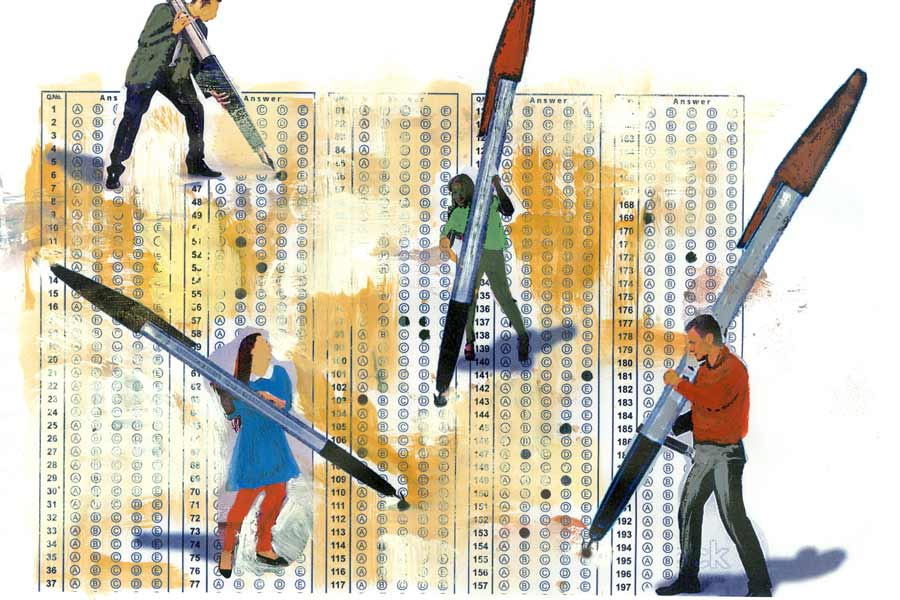

 
 <h1 align=center>এমসিকিউ</h1>
<h2 align=center>অরিন্দম শীল</h2> আগে অমলকান্তি বলতেন, “মারাদোনা! মারাদোনা! মেসি আবার প্লেয়ার…”

মেসি কেন মারাদোনার চেয়ে এগিয়ে, তা নিয়ে কেয়া একটাই যুক্তি দিতে পারত। মারাদোনা বেঁটে, মেসিকে দেখতে বেশি ভাল।

কী সব দিন ছিল— কত কাল বাপ-বেটিতে তর্ক হয় না আর!

ক্লার্কের পরীক্ষায় এমসিকিউ এসেছিল, হোয়াট ইজ় দ্য ফুল নেম অফ মারাদোনা? অপশন এ— দিয়োগো আদ্রিয়ানো মারাদোনা, অপশন বি— দিয়োগো আর্মান্দো….

কেয়া আন্দাজে অপশন সি-টা করে এসেছিল। এক নম্বর গেল, সঙ্গে নেগেটিভ মার্কিংও। স্কোর হল পাক্কা আশি আর কাট-অফ উঠল এইট্টি ওয়ান। ইস, মারাদোনাকে আর একটু কালচার করলে হয়তো জীবনটা বদলে যেতে পারত।

ঝুমুরদিরা ভাড়া থাকে একতলায়। কেয়ার চাইতে কিছু বড় বয়সে। সে এক দিন বলেছিল, “জিকে-ফিকে ম্যাগাজ়িন-বই পড়ে হয় না বুঝলি… চোক্কান খোলা রাখতে হয়, ওই পিন্টুকাকা পড়ছে দেখ, ত্রিমুখী লড়াই আর তুই হেডফোন গুঁজছিস কানে…”

“আমরা এইচএস দিচ্ছি না গো ঝুমরিতালাইয়া, দিচ্ছি কম্পিটিটিভ!” সোহাগ হলে কেয়া ঝুমুরদিকে ‘ঝুমরিতালাইয়া’ বলে। তিতিরদের বাস কেয়াদের পাশের দুটো ঘরে। বয়সে বাচ্চা হলেও বড় ফচকে।

পঁচিশ বছর আগে পিন্টুকাকা উচ্চ মাধ্যমিকে বছর বছর ফেল করত। পাশের বাড়ির সবিতাপিসির সঙ্গে বিয়েটা ঠিক হয়েই ছিল। পিন্টুকাকাকে যখন পাড়াপড়শি ‘রবার্ট ব্রুস’ বলে প্যাঁক দিচ্ছে, তখন সবিতাপিসি এম এ-তে ভর্তি হল। বাসে করে যেত। তার পর এক দিন গাড়ি করে যেতে লাগল। ইউনিভার্সিটির কোনও প্রফেসরের গাড়ি। চারচাকা দেখেই সবিতাপিসির বাড়ির লোকের মনে পড়ে গেল, পিন্টুকাকা অশিক্ষিত!

তার পর ফুলে-মালায় সেজে সেই চারচাকা তাদের গলিতে ঢুকল। সবিতাপিসিদের উঠোনে শামিয়ানা, ছাদে খাওনদাওন আর মাইকে কিশোরকুমার। গান বাজছিল, ‘... এর পরে এক রাজার কুমার, অ্যাম্বাসাডর গাড়ি চড়ে তার এল জিতে নিল কন্যার কোমল হৃদয়…’

গান আটকাতে জানালাগুলো বন্ধ করে দিয়েছিল পিন্টুকাকা। তবুও কিশোরকুমারকে দমানো যাচ্ছিল না। জানালার ফাঁকফোকর, ভেন্টিলেটর দিয়ে ঢুকে লোকটা গেয়েই যাচ্ছিল— ‘... যাও ফিরে যাও বনে তোমার কেউ বুঝবে না কথা তোমার মানুষের ব্যাপার-স্যাপার আলাদা রকম…’

পিন্টুকাকা বন্ধ ঘরে চিৎকার করছিল, “...উচ্চমাধ্যমিক পাশ করব, বি এ পাশ করব, এম এ করবই শালা! প্রফেসারি করব এক দিন, দেখিস…”

তার পর পড়েই যাচ্ছিল প্রাণপণ। কিন্তু শয়তান কিশোরকুমার পিন্টুকাকার আওয়াজটা কারও কানে পৌঁছোতে দিচ্ছিল না। পড়তে পড়তে পিন্টুকাকা ‘পিন্টুখ্যাপা’ হয়ে গেল…

রোজ নীচ থেকে আওয়াজ আসে, “উঁ উঁ উঁ… ত্রিমুখী লড়াই ত্রিমুখী লড়াই ত্রিমুখী লড়াই… পাল পাল পাল পাল… গুজ্জর গুজ্জর গুজ্জর গুজ্জর… প্রতিহার প্রতিহার প্রতিহার প্রতিহার… রাষ্টকূট…”

ঝুমুরদি বলে এখন, “এই ত্রিমুখী লড়াই যদি জিকে-তে আসে? মন দিয়ে শুনলে না পড়া থাকলেও করে আসতে পারবি, কম্পিটিটিভ বাওয়া, একটা নম্বরে চাকরি লেগে যায়…”

*****

কর্পোরেশনের কলে জল আসে। শেওলা-পড়া চৌবাচ্চা ভরে গেলে টুলু-পাম্পে করে দোতলা তিনতলার বারান্দায় রাখা ড্রাম ভরে নেয় ভাড়াটেরা। জলটল ভরে তিতির ছাদে এলে তবে কেয়া ওঠে। তিতির বলে, “টেট-টা কবে বেরোবে কেয়াদি?”

“আমাদের বেরোবে তো বলছে, তোদেরটা বেরোল?”

টেট, অর্থাৎ টিচার্স এলিজিবিলি টেস্ট-এর দুটো ভাগের পরীক্ষা হওয়ার কথা সামনে— প্রাইমারি ও আপার প্রাইমারি। তিতিরের ডিগ্রি ডিএলএড অর্থাৎ ডিপ্লোমা। তাই সে প্রাইমারির দলে। কেয়া আবার বিএড, সে উচ্চ প্রাথমিকের চাকুরিপ্রার্থী।

তিতির বলে, “বেরোলে খবর পাব ঠিক, আমার আবার নেট শেষ, তোমারটায় দেখো না…”

কেয়ার ফোনেও আজই নেট শেষ। সে গজগজ করে, “দুনিয়ায় মাস তিরিশ দিনে, বাবুদের আঠাশ দিনে মাস, পয়লায় ভরেছি, আজ ঊনত্রিশে শেষ। ঊনত্রিশে কেউ মাইনে দেয়?”

সাত বছরের মতো করে সাত তারিখ পেরোয়। মাইনেটা দাদার কাছে চেয়ে রাখতে রিমাবৌদির খালি ভুল হয়ে যায়। কেয়া মনে করালে বৌদির মনে পড়ে, তাতান সেকেন্ড টার্মে রি-অ্যারেঞ্জমেন্টগুলো ঠিক করে পারেনি। পাক্কা তিনটে নম্বর। ওই জন্য সৌজন্য ফার্স্ট হয়ে গেল, ইস্!

শ্যামলকাকার হাঁপানির টান ওঠে মাঝরাতে— কাশির আওয়াজে ঘুম ভেঙে যায় কেয়ার। তড়িঘড়ি  যায় তিতিরদের ঘরে। নীচ থেকে ঝুমুরদিও উঠে আসে তত ক্ষণে। সকাল হতেই ডাক্তারের নম্বরে ফোন করে তিতির। কম্পাউন্ডার ক্যানকেনে কণ্ঠে জানায়, ফোনে ডাক্তারবাবু ওষুধ দেন না।

তিতির বোঝানোর চেষ্টা করে সাধ্যমতো, “আমরা রেগুলার দেখাই, একটু বলে দিলে…”

“পেশেন্ট না দেখে কিছু বলা সম্ভব নয়।”

বৌবাজারের গলির ভিতর উপচে পড়া ভ্যাট পেরিয়ে এক ছ্যাতলা-পড়া তেতলা বাড়ির ভাড়াটে তারা। একই রকম ঘরদোর। বর্ণহীন। সব ঘরেই টাকাকড়ির টানাটানি। তবুও সব দিক সমান রাখার প্রাণপণ চেষ্টা করছে সবাই— উপরতলা থেকে মোচার ঘণ্ট নীচে নামলে নীচতলা থেকে কাঁচকলার বড়া উঠে আসে পরের দিনই।

“তোমার কাছে কিছু টাকা হবে কেয়াদি? বাবাকে ডাক্তারটা না দেখালে…” এ সাম্যবাদের দাঁড়িপাল্লা এক দিকে ঝুললে অন্য দিকের বুকে তা ছুরির মতো বেঁধে। তিতিরকে তার বাবার চেয়েও অসুস্থ দেখায় যেন।

*****

কেয়ার এম এ-র ফাইনাল পরীক্ষার রেজ়াল্ট বেরোল যে দিন, সে দিনই অমলকান্তিদের জুটমিলে লকআউট হল। তার পর দারিদ্র আরও কয়েক ফ্যাদম গভীর হল, পাত্রপক্ষরা মাথা নেড়ে উঠে যেতে থাকল। পড়ে থাকল ধারে আনা শিঙাড়া, মিষ্টি। আধখাওয়া। এঁটো সেই টেবিল থেকে জীবন আবার একটা বহুবিকল্পভিত্তিক প্রশ্ন, অর্থাৎ এমসিকিউ সাজিয়ে দিল— অমলকান্তির অবশিষ্ট সামান্য সঞ্চয়ে কী করতে চায় কেয়া?

অপশন এ: বিএড, অপশন বি: ডিএলএড, অপশন সি: সরকারি চাকরির কোচিং এবং অপশন ডি: বিয়ে।... অপশন ‘এ’ মার্ক করে কেয়া ভুল করল?

কোচিং চাকরির নিশ্চয়তা দেয় না, আর বেকার অবস্থায় বিয়ে করলে বাবাকে দেখবে কে? লকআউট হতেই পক্ষাঘাতগ্রস্ত হয়ে বিছানায় পড়ে গেছে। বরের পয়সায় আয়া রাখাটা কোন শ্বশুরবাড়ি বরদাস্ত করবে?

তা ছাড়া বিনা কোচিং-এ সরকারি চাকরি যদিও বা মেলে, টিচিং লাইনের চাকরিতে ইদানীং বিএড অথবা ডিএলএড বাধ্যতামূলক। ওটা না থাকলে ভেকেন্সিগুলোতে অ্যাপ্লাই করাই যাবে না। সরকারিতে চান্স মিলল না, অগত্যা প্রাইভেট কলেজ থেকেই বিএডটা করতে হয়েছিল কেয়াকে। তিতিরের অত ধৈর্য নেই। উচ্চমাধ্যমিক দিয়েই দুম করে ডিএলএড-এ ভর্তি হয়ে গেল।

কেয়া বকেছিল, “মাস্টার্স না করিস আগে গ্র্যাজুয়েট অন্তত হ, তার পর প্রফেশনাল কোয়ালিফিকেশনের দিকে ঝুঁকবি না-হয়।”

তিতির বলেছিল, “চাকরিটা বড্ড দরকার কেয়াদি, আমাদের উঠিয়ে দেবে, জানো? কোথায় যাব বলো?”

কানাঘুষো শোনা যাচ্ছে বটে, এ বাড়িটা বিক্রি হবে। দুপুরে কলতলায় আলোচনা হয়, “ভাড়াটে তোলা অত সহজ না কি? সেলামি নেয়নি মালিক? আমরা বাড়ি ছাড়ব না।”

কিন্তু কেউই যেন নিশ্চিন্ত হতে পারে না। বদ্ধ উঠোনে দুশ্চিন্তার হাওয়া ঘুরপাক খায়—  সামনের মিত্তিরদের বাড়িটা যখন ভাঙা হল, কী কী কায়দায় ভাড়াটে তোলা হল তা সবার জানা। ওরা সব পারে।

কেয়া ভাবে, একটা চাকরি পেলে সমস্যা মিটে যায়। প্রথম মাইনে পেয়েই একটা ব্যাঙ্ক লোন। তার পর রাজারহাট কিংবা শ্রীরামপুরে ফ্ল্যাট। ‘সাদাকালো এই জঞ্জালে ভরা মিথ্যে কথার শহরে’-র থেকে মুক্তি মুক্তি মুক্তি! অন্য চাকরির সমস্যা প্রচুর। অঙ্ক, স্ট্যাট আর ইংরেজিতে সে কাঁচা। শিক্ষকতায় চেনা মাঠ, সাবজেক্টের মধ্যে থাকা যায়।

টেট-টা কেন যে বেরোচ্ছে না! এক বার রিটনটা পাশ করলে ইন্টারভিউটা ঠিক সামলে নেওয়া যাবে। এত দিন ধরে টিউশন পড়াচ্ছে, অভিজ্ঞতায় ঠিক পারবে। কেয়া জানে।

*****

ঝুমুরদির সঙ্গে বন্ধুত্বটা বিষিয়ে গেল অবশেষে।

চাইল্ড সাইকোলজি আর পেডাগজির কিছু বিষয় প্রাইমারি ও আপার প্রাইমারিতে কমন। তাই কেয়া-তিতির গ্রুপ ডিসকাশন করছিল, “বিশেষ চাহিদাসম্পন্ন শিশু-টা এবারে আসবেই…”, “আমার না খালি এই বোধমূলক প্রশ্ন আর প্রয়োগমূলক প্রশ্নে খালি গুলিয়ে যায়...”, “পিঁয়াজের তত্ত্ব থেকে প্রশ্নগুলো করে নিই আয়…”

ঝুমুরদি কখন যেন এসে দাঁড়িয়েছিল, তারা তাকাতেই বলল, “যা, ড্রেসটা পাল্টে আয়, বেরোব…”

“কোথায়?”

ঝুমুরদি যেন কথাটা গায়েই মাখল না, বলল, “হালকা সেজে নিস, কেমন? মিডিয়া থাকবে তো…”

“কোথায় যাবে সেটা তো বলবে!”

“পর্ষদের হেডঅফিসে। বিক্ষোভ হবে। নিয়োগ নিয়ে দুর্নীতি... ঘেরাও করে রাখব আমরা, মেরিট লিস্ট-এর র‌্যাঙ্ক না মেনে ঢোকানো হয়েছে…” কাউন্সিলর যতীন বাঁড়ুজ্যের মতো করে বলে যায় ঝুমুরদি।

কিন্তু বাকি দু’জনে চুপ।

সে নীরবতা যত গভীর হয়, ঝুমুরদির স্বর তত পাল্টে যেতে থাকে যেন। উদ্ধতস্বভাব দাবিদার থেকে ক্রমে অনুনয়কারী ভিক্ষাপ্রত্যাশী— নিয়োগের স্বচ্ছতার স্বার্থে যদি নতুন প্রজন্ম এগিয়ে না আসে তবে কে আর আসবে? বন্ধুত্বের খাতিরে এইটুকু করা যায় না? এইটুকুমাত্র?... দু’জন কি চায় না ঝুমুর তার পাওনা চাকরিটা পাক?... ক’টা লোক বেশি হলে তাদের বিক্ষোভটা একটু প্রচার পায়…সে কথা দিয়ে এসেছে…

মৌন সর্বদা সম্মতিলক্ষণম্ নয়!

সন্ধেবেলা টিভিতে দেখায়, আন্দোলনকারীদের রাস্তায় ফেলে মারছে পুলিশ। অনেক রাতে বাড়ি ফেরে ঝুমুর। মাথায় ব্যান্ডেজ। তার পর পোস্ট দেয়, “সংগঠনের পক্ষ থেকে মামলা দায়ের করা হচ্ছে। আদালতের রায়ের আগে প্রাথমিকে নতুন নিয়োগের বিজ্ঞাপন বন্ধ করার দাবি জানাই।”

বাটনে আঙুলটা চেপে ধরে কেয়া। অনুভূতির অপশনগুলো চড়বড় করে ওঠে— পছন্দ, ভালোবাসা, যত্ন, হাসি, দুঃখ, রাগ। কী দেওয়া যায়?

মেসেঞ্জারে গিয়ে লেখে, “কেন ঝামেলায় যাও দিদি…”

কোনও উত্তর আসে না।

কিন্তু নতুন নোটিফিকেশন আসে— প্রাথমিক টেট পরীক্ষার নতুন বিজ্ঞাপন বের করল পর্ষদ….

কেয়া ভাবলেশহীন। এ বিজ্ঞাপনে তার কোনও লাভ নেই। সে বিএড। এই পরীক্ষা দেয় ডিপ্লোমারা। আপার প্রাইমারিটা যে কবে বেরোবে!

তবুও তিতিরের পক্ষে সুখবর, তাই সে খবরটা পড়ে। পড়তেই একটা অপ্রত্যাশিত আলো জ্বলে ওঠে যেন! সে অনুভূতি লিখে বোঝানোর সাধ্য নেই। জীবনানন্দ পারতেন— হাল ভেঙে যে নাবিক হারায়েছে দিশা, সবুজ ঘাসের দেশ সে যখন চোখে দেখে দারুচিনি দ্বীপের ভিতর...

মোবাইল স্ক্রিনের সমস্ত আলো কেয়ার মুখে ভিড় করে।

ঝুমুরদির ঘরে তখন নিকষ কালো অন্ধকার।

*****

“চল বললেই কি পুলিশের ঝামেলায় যাওয়া যায়? ওরই বা যাওয়ার কী দরকার, ফেসবুকে প্রোফাইল কালো করলেই তো হয়…”

তিতিরের মতে কেয়া সায় দেয়, “পুলিশ ধরলে কেস দেবে, আমরা যদি চাকরি পাই পুলিশ কেস থাকলে আটকে দেবে, এত বড় রিস্ক…”

হঠাৎ তিতির সতর্ক হয়, “চুপ চুপ, ঝুমুরদি…”

ছাদের দরজায় ফ্রেমে ঝুমুর। বড় এলোমেলো। বড় উদাস, অগোছালো। শূন্যদৃষ্টি। শহরজুড়ে লাখ-লাখ ফোনে নোটিফিকেশন আসে, “পুলিশি হেফাজতে শ্লীলতাহানির অভিযোগ বিক্ষোভকারীদের…” কিন্তু তারা রাস্তা আটকায়নি, রেল রোকেনি, স্টেশনের টাইলস উপড়ে ফেলেনি। স্কুল-কলেজ-অফিস-কাছারি যাওয়ার নাগরিক অসুবিধে হয়নি। তাই শহর তাদের খবর সরিয়ে দিয়ে সার্চ দিয়েছে ‘সানি লিওনি হট’। অথবা মন দিয়ে দেখে নিয়েছে রাশিফল।

ছাদের অন্য পাশটায় চলে যায় ঝুমুর। একা। সেখান থেকে কেয়াদের ফিসফাস শোনা যায় না।

কেয়া বলে, “করলি ফর্মটা ফিলআপ?”

নিশ্চিত স্বরে তিতির উত্তর দেয়, “হুঁ বাবা, ফেলে রাখে কেউ! কোন দিন নোটিস দেয়, অমুকরা বসতে পারবে না…”

নোটিসে বার বার বদল করার ব্যাপারে নিয়োগকারীদের একটা কুখ্যাতি আছে বটে। কেয়াও সে জন্যই তড়িঘড়ি…

এক গাল হেসে কেয়া বলে, “আমিও করে নিয়েছি, বুঝলি…”

তিতির চমকে যায় যেন, “ত্তু-তুমি করেছ মানে? তুমি তো বিএড, বিএড-রা প্রাইমারি বসবে কী ভাবে?”

“এ বার বিএড-রাও পারবে…”

তিতির বিশ্বাস করতে চায় না প্রথমে। অ্যাডটা খুঁটিয়ে দেখে। তার ঝলমলে মুখখানা কেমন নিভে যায় যেন। হতাশ গলায় সে বলে, “কত লাখ বিএড আছে কেয়াদি?”

সংখ্যাটা শুনে চুপ করে যেতে হয়। এত লাখ নতুন ভাগীদার!

তার পর টেনে টেনে বলে, “খুব ফুর্তি বলো কেয়াদি, গাছেরও খাবে তলারও কুড়োবে… প্রাইমারিও পাবে আবার আপারও মারবে!”

“চার বছর পরীক্ষা হয়নি, আমাদেরও সুযোগ পাওয়া দরকার…”

“তবে আপার প্রাইমারিতে করোগে যাও না, আমাদের চাকরিতে ভাগ বসাতে এসেছ কী জন্য?”

“থাম থাম! বিএড উঁচু ডিগ্রি ডিএলএডের থেকে, আমি ডিগ্রি কোর্স আর তুই পাতি ডিপ্লোমা…”

আর ফিসফাস নয়, তাদের তর্ক উচ্চকিত কথা কাটাকাটিতে পরিণত হয়। পাতালরেলের সুড়ঙ্গেরও অনেক, অনেক নীচে কফিনের ঢাকনা খুলে যায়। শয়তান উঠে আসে আবার! হাতে এমসিকিউ-গান!

ছাদের অপর প্রান্তে দাঁড়িয়ে থাকা অপশন-সি সব শুনতে পেয়ে হাসে। আকাশ বাতাস কাঁপিয়ে। অপশন-এ আর অপশন-বি ও-সবে মন দেয় না, গলা ফাটিয়ে ঝগড়া করে। নীচে রাস্তায় কুকুরগুলোর উচ্ছিষ্ট মাংসের হাড় নিয়ে কামড়াকামড়ি করে। লালা বেয়ে গড়িয়ে পড়ে রেবিস…

অপশন ডি-এর পড়ার আওয়াজও জোরালো হয়, “উঁ উঁ উঁ... ত্রিমুখী লড়াই ত্রিমুখী লড়াই ত্রিমুখী লড়াই…”

কোন অপশনে চাকরিটা লুকিয়ে, বোঝা যায়?