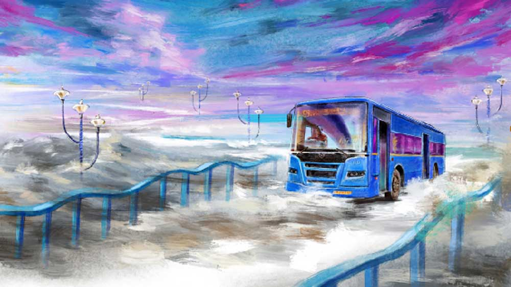

 

<h1 align=center>এস নাইন</h1>
<h2 align=center>স্বপ্না মিত্র</h2>
সকাল থেকে শুরু হয়েছে একটানা বৃষ্টি। বৃষ্টি কখনও জোরে পড়ছে, কখনও কমে আসছে, থেমেও যাচ্ছে প্রায়। তার একটু পরই আবার শুরু হচ্ছে মুষলধারে বৃষ্টি।   বিকেল সাড়ে পাঁচটা বাজে, ডেকচেয়ারে গা এলিয়ে বসেছিল অরিন্দম। তার হাতে চায়ের কাপ, পাশে ছোট্ট কাঠের টিপয়ের ওপর রাখা কাচের প্লেটে কয়েকখানা কুকি।   স্বাতী বাড়িতে নেই। এত বৃষ্টির মাঝেও ড্রাইভ করে গেছে পাশের ডিপার্টমেন্টাল স্টোরে, ফ্রেশ কড়াইশুঁটির খোঁজে। পছন্দমতো কড়াইশুঁটি পাওয়া গেলে, আজ রাতে কড়াইশুঁটির কচুরি করবে। আগে বাজারে কড়াইশুঁটি উঠত শীতকালে। শীতের সন্ধ্যায় মা-র হাতের নলেন গুড়ের পায়েস আর গরম গরম 
কচুরি, আহা!   চায়ের কাপে চুমুক দিতে দিতে অরিন্দম অলস চোখে দেখছিল বৃষ্টির ধারাপাত, আবার দেখছিলও না। এলোমেলো বাতাসের সঙ্গে দু’-এক কণা জলবিন্দু উড়ে এসে লাগছিল মুখে। বৃষ্টির জলকণায় আর্দ্র হয়ে উঠছিল মনের অলিগলি। না হলে সদ্য ষাট-উত্তীর্ণ অরিন্দম স্বভাবে অত্যন্ত কেজো, তার মাপা হাসি, বাঁধাধরা যাপনে চড়াই-উতরাই খুব কম, রংও তেমন নেই। দু’-বছর আগে একমাত্র ছেলে মুভ আউট করে যাওয়ার পর ওই ছিটেফোঁটা রঙেও টান ধরেছে। কত স্বামী-স্ত্রীর সম্পর্কে স্পেস নিয়ে সমস্যা তৈরি হয়, অরিন্দম আর স্বাতীর মাঝে স্পেসই স্পেস! বর্তমানে তাদের নাওয়া-খাওয়া-ঘুমোনো সব কিছুরই সময়, অর্থাৎ দৈনন্দিন রুটিনটাই আলাদা।   শুধু যে দিন অরিন্দমের নিজের ব্যবসায় নতুন পারচেজ় অর্ডার আসে, সুদূর অস্ট্রেলিয়ায় বসেও স্বাতীর সঙ্গে পুরনো বাংলা সিনেমা দেখতে দেখতে সে দু’পেগ সিঙ্গল মল্ট খেয়ে ফেলে। ওইটুকু, ওইটুকু রংই এখনও অবশিষ্ট আছে তার জীবনে।   ভিজে বাতাসের গায়ে জড়িয়ে এক ঝলক সুবাস এসে ঝাপটা মারে অরিন্দমের নাকে। সে দোতলার ডেক থেকে ঝুঁকে দেখে বাগানের গাছগুলো। বিদেশি ফুলগাছের পাশে একটা জুঁইয়ের ঝাড়, একটা হাস্নুহানার, দুটো থোকা বেলফুল আর একটা গন্ধরাজ গাছ লাগিয়েছে সে। গন্ধরাজ গাছটায় ফুল এসেছে ঝেঁপে।   যাদবপুরে অরিন্দমদের বাড়ির গেটের পাশেও এ রকমই একটা ঝাঁকড়া গন্ধরাজ গাছ ছিল। গরমকাল থেকে তাতে শুরু হত ফুল ফোটা, বর্ষায় ছেয়ে যেত ফুলে। ঈষৎ পুরু কালচে পাতার মাঝে ধবধবে সাদা গন্ধরাজ ফুল দেখে অরিন্দমের মনে পড়ে যায় নানা পুরনো কথা। ছেলেবেলায় যদি তার বাস-টিকিটের ডায়েরি তৈরি করার অভ্যেস না হত, আজ হয়তো অরিন্দমের জীবন বয়ে যেত অন্য খাতে।   সেই সময় ট্রেনের টিকিটের তুলনায় বাসের টিকিটগুলো ছিল সরু আর পাতলা এবং অপেক্ষাকৃত সাদা, টিকিটের পিছনে দিব্যি লেখা যেত। সুদূরের প্রতি আকর্ষণের কারণেই বোধহয়, ট্রেন বা বাসের টিকিটের প্রতি অদ্ভুত টান ছিল তার। ওই এক ফালি কাগজের টুকরো সম্বল করে কত দূর পাড়ি দেওয়া যায়! তবে ট্রেন বা বাসের টিকিট তখন অত মামুলি ছিল না, কারণ ট্রেনে-বাসে চড়ে ঘন-ঘন কোথাও যাওয়াই হত না। অরিন্দমের স্কুল ছিল বাড়ি থেকে হেঁটে দশ মিনিট। পুরী, দার্জিলিংয়ের মতো দূরে বেড়াতে যাওয়া ছিল স্বপ্নের মতো। নিয়মিত যাতায়াতের মধ্যে ছিল মামা অথবা পিসির বাড়ি, বসিরহাটে বা রানাঘাটে যাওয়া। সেও বছরে দু’বার, গরমের ছুটিতে আর অ্যানুয়াল পরীক্ষার পরে। বেড়ালের ভাগ্যে শিকে ছেঁড়ার মতো ক্বচিৎ-কদাচিৎ চিড়িয়াখানা, জাদুঘর বা সার্কাস দেখতে যাওয়া ছিল। যেখানেই যাওয়া হোক না কেন, বাড়ি ফিরে সে মায়ের ব্যাগ বা বাবার পকেট থেকে বাসের টিকিটগুলো হস্তগত করে টিকিটের পিছনে লিখত সে দিনের উল্লেখযোগ্য কোনও ঘটনা, তার পর টিকিটগুলো জমিয়ে রাখত একটা জং-ধরা চকলেটের টিনের বাক্সে। সে ছিল অরিন্দমের নিজস্ব কায়দায় অভিনব বাস-টিকিটের ডায়েরি। অরিন্দম বড় হয়ে যাওয়ার পরেও মা বহু দিন সযত্নে রেখে দিয়েছিলেন সেই বাক্সটা।   তবে অরিন্দম কেতকীকে ধরে রাখতে পারেনি। তার এই টিকিটের পিছনে লেখার অভ্যেসের কারণেই কেতকী হারিয়ে গেল চিরতরে। মনে পড়তেই অরিন্দম দীর্ঘশ্বাস ফেলে, কেতকী বর্ষার ফুল, কেতকীর স্মৃতিও বিজড়িত এমনই এক ঘনঘোর বর্ষণমুখর দিনের সঙ্গে।   কেতকী ছিল অনেকটা এই গন্ধরাজ গাছটার মতো— শ্যামলা সুন্দরী, ভাস্কর্যের মতো গড়ন, পদ্মপাতায় শিশিরের বিন্দুর মতো চেহারায় টলটল করত লাবণ্য। সাবেকি ঐতিহ্য আর আধুনিকতার নিখুঁত মিশ্রণ ছিল সে। তাঁতের শাড়ি ছাড়া অন্য কিছু পরত না, সঙ্গে সেই যুগেও প্রতি দিন ম্যাচিং স্লিভলেস ব্লাউজ়, লম্বা বিনুনিটা কোমর ছাড়িয়ে পৌঁছে যেত নিতম্বে।   কেতকী অরিন্দমের ক্লাসমেট ছিল না। একই ইয়ারে রাজাবাজার সায়েন্স কলেজে অরিন্দম পড়ত ফিজ়িক্স নিয়ে, আর কেতকীর বিষয় ছিল সাইকোলজি। কেতকীকে সে প্রথম দেখে কলেজ ক্যান্টিনের সামনে। কেতকী কোনও দিন ক্যান্টিনে পাঁচটা ছেলের সঙ্গে বসে আড্ডা মারত না, তবু গোটা সায়েন্স কলেজের ছেলেরা টিফিন টাইমের প্রতীক্ষায় থাকত, কেতকীকে এক ঝলক দেখার প্রত্যাশায়। ওই দেখা অবধিই, না হলে প্রতি দিন টিফিন ব্রেকে ক্যান্টিনের অদূরে মেয়েদের সঙ্গে দাঁড়িয়ে বকমবকম করেও এক বিরল প্রতিভায় নিজেকে পাঁচ জনের ধরাছোঁয়ার বাইরে রেখেছিল কেতকী।   তবে তখন তার অল্প বয়স, অফুরন্ত এনার্জি। কয়েক দিন গোয়েন্দাগিরি চালিয়ে অরিন্দমদের গ্রুপটা জেনে গিয়েছিল যে, কেতকী থাকে বালিগঞ্জে। বালিগঞ্জ থেকে সায়েন্স কলেজ যাতায়াত করে এস নাইনে। সেই থেকে কলেজে অরিন্দমদের গ্রুপে কেতকীর নিকনেম হয়ে যায় এস নাইন।   তখন কলেজে পড়ার পাশাপাশি হাতখরচের জন্য অরিন্দম অনেক টিউশনি করত। এমন ভাগ্যের খেলা, বালিগঞ্জ অঞ্চল থেকে একটা টিউশনের অনুরোধ এল অরিন্দমের কাছে, ক্লাস টেনের ছেলেকে অঙ্ক শেখাতে হবে। এমনিতে হায়ার সেকেন্ডারি বা অনার্সের ছাত্র না হলে অরিন্দম পড়াত না, তবু এই টিউশনিটা সে ধরেছিল শুধু ছাত্রের বাড়ির ঠিকানার সৌজন্যে।   অরিন্দমের দুরাশা বাস্তবে পরিণত হল। এক দিন এস নাইন বাসে কেতকীর সঙ্গে আলাপ হয়ে গেল তার। সপ্তাহে দু’দিন সায়েন্স কলেজ থেকে বেরিয়ে অরিন্দম যেত বালিগঞ্জের টিউশনিতে, আর কেতকী ফিরত বাড়ি। ওই যাতায়াতের পথটুকুই, অরিন্দম ঘুরঘুর করত বাসের লেডিজ় সিটের সামনে, পিছনে জেনারেল সিট খালি থাকলেও বসত না। লেডিজ় সিটে বসে কেতকী বলত, “দাঁড়িয়ে আছিস কেন? ওই তো খালি সিট, বসে যা।”   কেতকীর কথা শুনেও না শোনার ভান করত অরিন্দম, নতুন প্যাসেঞ্জার উঠে খালি সিটে বসে পড়লে হাঁপ ছেড়ে বাঁচত। কাঁধে কলেজের ব্যাগ সামলে এক হাতে হ্যাঙ্গিং রড ধরে লেডিজ় সিটের সামনে সে দাঁড়িয়েই থাকত, সরতে ইচ্ছে করত না। কেতকী বোধহয় মনে মনে খুশিই হত, হেসে বলত, “তা হলে ব্যাগটা দে, আমি ধরছি।”   হলই বা একটা জড়বস্তু ব্যাগ, তবু অরিন্দমের কাঁধের বোঝা কোলে করে বালিগঞ্জ অবধি কেতকী নিয়ে যাবে?   কাঁধ থেকে ব্যাগটা নামিয়ে কেতকীকে ধরতে দিত অরিন্দম, হঠাৎ কেমন ফুরফুরে লাগত শরীরটা, নিজেকে রাজা-রাজা বলে অনুভব হত। কেতকীর সঙ্গে আগডুম বাগডুম গল্প করতে করতে রাস্তা ফুরিয়ে যেত ফুস করে, তিরিশ মিনিটকে মনে হত তিন মিনিট।   কেতকী কোনও দিন নিজের বাড়িতে ডাকেনি অরিন্দমকে। কোনও দিন তারা রেস্তরাঁয় এক কাপ চা খেতেও ঢোকেনি এক সঙ্গে। মার্কেটিংয়ের অছিলায় কলেজ স্ট্রিট বা গড়িয়াহাটের রাস্তায় পাশাপাশি হাঁটেওনি। তবু তাদের মধ্যে কোথাও একটা সম্পর্ক তৈরি হয়ে উঠেছিল। কী সেই সম্পর্কের নাম? স্রেফ বন্ধু বলা হলে মিথ্যে বলা হয়, আবার তারা প্রেমিক-প্রেমিকাও তো ছিল না। অরিন্দম নিজেই দ্বিধায় ছিল, ও দিকে কেতকীর মনের খবরও সে জানত না।   দেখতে দেখতে ফাইনাল পরীক্ষা হয়ে গেল, রেজ়াল্ট বেরোনো অবধি লাইব্রেরিতে ছাড়া কলেজে যাওয়ারও কোনও কারণ নেই। কেতকী কলেজে আসে মাঝে মাঝে। বালিগঞ্জের টিউশনিটা ছেড়েই দেবে ভাবছিল অরিন্দম, হঠাৎ এস নাইনে দেখা হয়ে গেল কেতকীর সঙ্গে। অরিন্দমকে দেখে হইহই করে উঠেছিল কেতকী, বলল যে ওরা নাকি কলকাতা ছেড়ে চলে যাচ্ছে। কেতকী নিজেই বলেছিল, “ফোন করিস মাঝে মাঝে, ফোনেই আড্ডা মারব।”   সে মোবাইলের যুগ নয়, ঘরে ঘরে ফোনের প্রচলনও শুরু হয়নি। অরিন্দমদের বাড়িতেও ফোন ছিল না, তাদের এমার্জেন্সি ফোন আসত এক পাড়াতুতো কাকুর বাড়িতে। সে দিন অরিন্দমের কাঁধে কলেজের ব্যাগ নেই, কেতকীর হাতে ছোট্ট একটা পার্স, লেখার জায়গা বলতে ছিল শুধু পকেটে বাসের টিকিট। সেই সরু, পাতলা, এক আঙুল সমান লম্বা বাস-টিকিটের পিছনে কেতকী যত্ন করে লিখে দিয়েছিল, তাদের ফোন নম্বর আর ঠিকানা।   সে দিন বালিগঞ্জ থেকে বাড়ি ফেরার পথে এমনই মুষলধারায় বৃষ্টি নেমেছিল। সে কী বৃষ্টি! বাসস্টপ থেকে তাদের বাড়ি দু’মিনিটের হাঁটা পথ, তাতেই সে ভিজে চুপচুপে হয়ে গেছিল। বাড়ি ঢুকে এক মিনিটও দাঁড়ায়নি অরিন্দম, সোজা চলে গেছিল বাথরুমে। তাড়াতাড়ি ভিজে জামাকাপড় ছেড়ে, তোয়ালে দিয়ে গা-মাথা মুছে, এক কাপ কফি নিয়ে বসেছিল টিভির সামনে। সম্ভবত ইন্ডিয়া-অস্ট্রেলিয়ার একটা গুরুত্বপূর্ণ ম্যাচ ছিল সে দিন। সে সব ভুলে ডুবে গিয়েছিল খেলায়। যত ক্ষণে তার খেয়াল হয়, তত ক্ষণে সর্বনাশ যা হওয়ার হয়ে গেছে। তার ছেড়ে রাখা বৃষ্টির জলকাদা-মাখা জামাকাপড় মা ভিজিয়ে দিয়েছিল সাবানজলে।   একটা ফোন নম্বর, একটা ঠিকানা, একটা রাস্তার নামে ছিল রামধনুর খোঁজ। বৃষ্টির পরে আকাশে রামধনু ওঠে। সে দিনের ঝমঝম বৃষ্টির কারণে যুবক অরিন্দমের জীবনের রামধনু সত্যিই তার থেকে এক আকাশ দূরে চলে যায়। যা ছোঁয়ার নয়, ধরার নয়, শুধু এক বর্ণময় স্মৃতি হয়ে রয়ে গেছে মনের মণিকোঠায়।      বৃষ্টি সামান্য ধরে এসেছে। বাগানের গাছগুলো জলে ভিজে শেষ বিকেলের ম্লান আলোয় ঝলমল করছে। পুরনো স্মৃতির ম্যাজিকে কেজো অরিন্দমের চোখেও চিকচিকে হাসি, তার প্রৌঢ় মুখের পেশিতে হঠাৎই যৌবনের ছায়া।   ওই যে, স্বাতী ফিরে এসেছে, সামনের গেট খুলে বাড়িতে ঢুকল। গ্যারেজের দরজা খোলার আওয়াজ আসে, সিঁড়িতে পায়ের শব্দ হয়, তবু অরিন্দম ডেকচেয়ার থেকে ওঠে না। সূর্যের শেষ রশ্মিতে গা ডুবিয়ে প্রায়ান্ধকার উডেন ডেকে সে বসে থাকে, বসেই থাকে।   মিনিট দশেকের মধ্যেই দু’কাপ ধোঁয়া-ওঠা কফি নিয়ে ডেকের দরজা ঠেলে বাইরে আসে স্বাতী, চেঁচিয়ে ওঠে, “কী ঠান্ডা! এত ঠান্ডায় বাইরে বসে কী করছ? ভিতরে চলে এসো।”   অরিন্দমের বুক চিরে দীর্ঘশ্বাস পড়ে। সে চেয়ার ঠেলে উঠে দাঁড়ায়। অন্ধকার ডেক থেকে আলো-ঝলমল ড্রয়িংরুমে ঢুকে সোফায় স্বাতীর গায়ে গা লাগিয়ে বসে।   স্বাতী সরে বসতে যায়, অরিন্দম স্বাতীর হাত চেপে ধরে।   স্বাতী চোখ সরু করে তাকায়, জিজ্ঞেস করে, “কী ব্যাপার? একা একা বারান্দায় কী করছিলে? কার কথা ভাবছিলে শুনি? রামগরুড়ের ছানার হঠাৎ হাসি-হাসি মুখ?”   স্বাতীর মুখটা দু’হাতে টেনে বাঁ গালে টপ করে একটা চুমু খায় অরিন্দম, বলে, “তোমাকে মিস করছিলাম ডার্লিং!”      সকাল ন’টায় রোজকার মতো অরিন্দম অফিসে বেরিয়ে গেছে। যমজ বোন শম্পার সঙ্গে স্বাতী ফোনে গল্প করছিল।   শম্পার গলা গম্ভীর শোনায়, “সবই বুঝি, পুরনো প্রেম, হয়তো প্রেমও নয়, সুখস্মৃতি মাত্র, এখন কোনও যোগাযোগও নেই... তবু তোর রাগ হয় না?”   স্বাতী হাসে, “না, বরং তার উল্টো। আজকাল আমি বৃষ্টির প্রতীক্ষায় থাকি।”   শম্পা রাগ করে, “ঠিক আছে, নেক্সট টাইম আকাশে মেঘ হলে তুই ময়ূরীর মতো পেখম তুলে নাচিস!”   শম্পার ফোন শেষ হলে পায়ে পায়ে স্বাতী এসে দাঁড়ায় জানালার ধারে। গতকাল বৃষ্টির পরে আজ প্রকৃতি বড় মনোরম, মুচমুচে সোনালি রোদ্দুর ঝলমল করছে চার পাশে।   স্বাতী তার ডান হাতের তর্জনী বাঁ গালে রাখে, কত কত দিন পরে গতকাল ঠিক এইখানে রামগরুড়ের ছানা একটা নিটোল চুমু খেয়েছে। মেঘের জল বৃষ্টি হয়ে পৃথিবীতেই ফিরে আসে, মহাশূন্যে তো পাড়ি দেয় না, তা হলে মনখারাপের কী আছে?   বরং উনষাট বছরের স্বাতীর সাদা-কালো জীবনে অরিন্দমের এমন অচেনা, বর্ণময় রূপ ফিরে ফিরে পাওয়ার জন্যই সে মেঘ-বৃষ্টির কাছে কৃতজ্ঞ থাকবে চিরকাল।